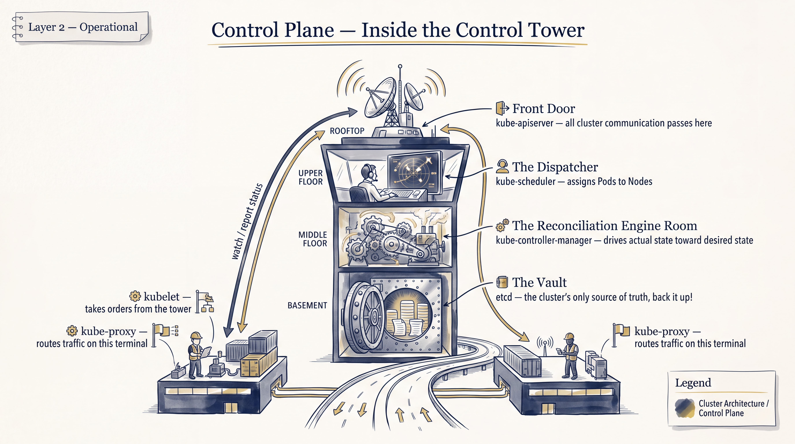
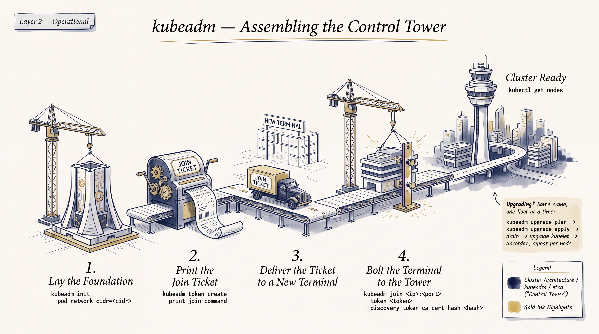
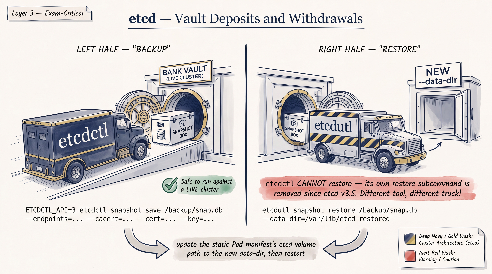
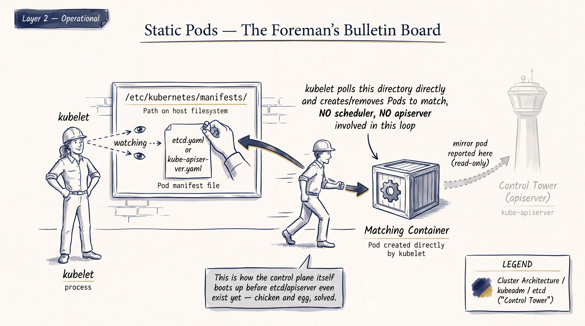
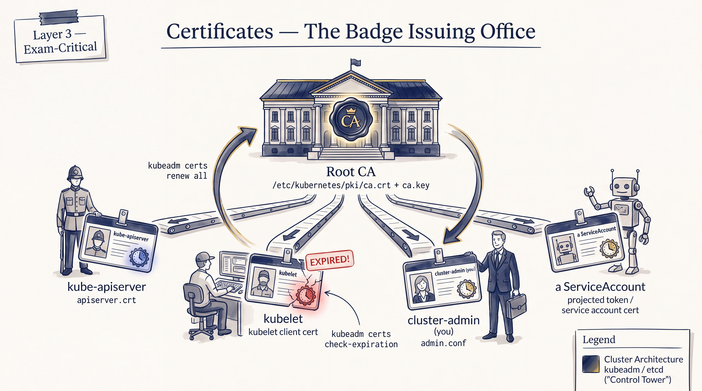
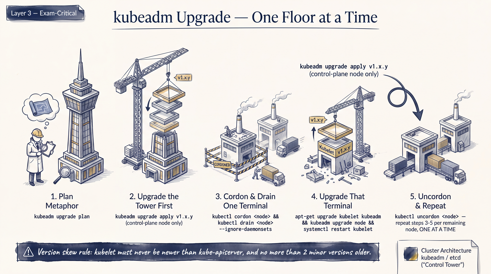
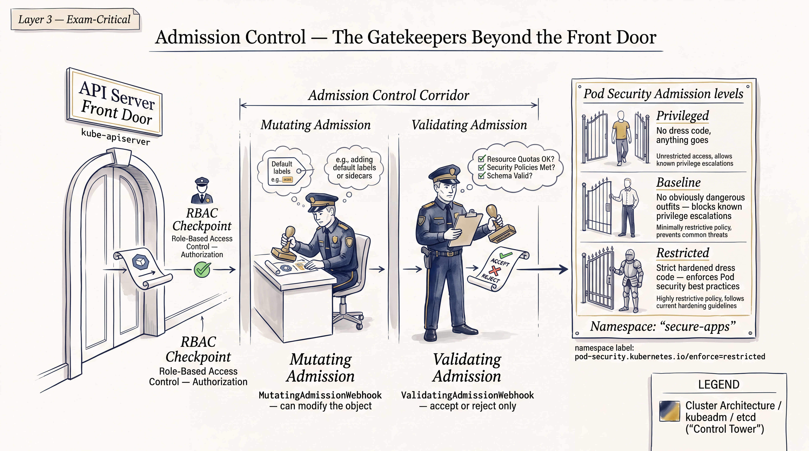

# Cluster Architecture, kubeadm & etcd










*Domain weight: Cluster Architecture, Installation & Configuration — 25% (second-largest domain). Per `01-exam-snapshot-and-priorities.md`, kubeadm bootstrap, kubeadm upgrade, etcd backup/restore, static-pod/kubelet diagnosis, and certificate management are all **P0**. Target Kubernetes version: v1.35 (re-verify against the live LF page before booking — v1.36 is already GA and the LF FAQ may be lagging). Runtime assumed: containerd (dockershim is long gone, removed in v1.24). Exercises below are original, built to drill the underlying competency — not reproductions of any real exam question.*

---

## Part A — Rapid Knowledge Refresh

### A1. Control plane components (kube-apiserver, controller-manager, scheduler, etcd, kubelet, kube-proxy)

**Concept in 3-8 sentences**
The control plane is `kube-apiserver` (the only component that talks to etcd directly; front door for all reads/writes and auth/admission), `kube-controller-manager` (runs reconciliation loops — node, replication, endpoint, service-account controllers, etc.), `kube-scheduler` (binds unscheduled Pods to nodes based on predicates/priorities), and `etcd` (the cluster's only source of truth, a distributed key-value store using the Raft consensus protocol). On worker (and control-plane) nodes, `kubelet` is the node agent that talks to the container runtime via CRI and reports node/pod status back to the apiserver; `kube-proxy` programs iptables/IPVS rules to implement Service virtual IPs. In a kubeadm cluster, apiserver/controller-manager/scheduler/etcd normally run as **static Pods** managed directly by kubelet, not as Deployments — this is the detail CKAD never required you to internalize.

**Important objects**
Static Pods (mirror Pods visible via `kubectl get pods -n kube-system`), Nodes, Leases (`kube-system` leases for leader election of controller-manager/scheduler).

**Important YAML fields**
Static pod manifests at `/etc/kubernetes/manifests/*.yaml`: `spec.containers[].command` (flags like `--advertise-address`, `--etcd-servers`, `--service-cluster-ip-range`), `spec.containers[].livenessProbe`, `spec.volumes` (hostPath mounts for `/etc/kubernetes/pki`, `/etc/kubernetes/*.conf`).

**Important commands**
```bash
kubectl get pods -n kube-system -o wide
kubectl get componentstatuses          # deprecated but still works on many versions
kubectl -n kube-system logs kube-apiserver-<node>
crictl ps | grep -E 'apiserver|scheduler|controller|etcd'
systemctl status kubelet
journalctl -u kubelet -f
```

**How to verify**
`kubectl get nodes` shows `Ready`; `kubectl get pods -n kube-system` shows all control-plane static pods `Running` with low restart counts; `crictl ps` on the control-plane node shows matching containers.

**Common exam mistake**
Trying to `kubectl edit` a static pod directly — edits are silently overwritten because the source of truth is the manifest file on disk, not the API object (the API object is just a read-only mirror).

**One mini exercise**
On a control-plane node, find which flag sets the etcd endpoints for kube-apiserver by inspecting the running static pod's command, without opening the manifest file first (use `kubectl -n kube-system get pod kube-apiserver-<node> -o yaml`).

---

### A2. Static Pods & manifests

**Concept in 3-8 sentences**
A static Pod is defined by a file kubelet watches directly (no apiserver involved in scheduling it); kubelet creates a **mirror Pod** on the apiserver so it's visible via `kubectl get pods`, but that mirror is read-only from the API side — you can't delete/edit it through `kubectl`, only by changing the file. The watched directory is set by `staticPodPath` in the kubelet config file (commonly `/var/lib/kubelet/config.yaml`) or the legacy `--pod-manifest-path` flag, and defaults to `/etc/kubernetes/manifests` in kubeadm clusters. Kubelet polls that directory (default ~20s) and creates/updates/deletes Pods to match; moving a manifest out of the directory kills the pod, moving it back in recreates it — this is the standard trick for "restart" a static pod. Mirror pod names get a node-name suffix, e.g. `kube-apiserver-controlplane`. kubeadm-managed clusters run all four core control-plane components this way specifically so kubelet — not etcd/apiserver bootstrapping order — can bring the cluster up from nothing.

**Important objects**
Static Pod manifest files; mirror Pods (annotation `kubernetes.io/config.mirror`).

**Important YAML fields**
Kubelet config `staticPodPath:`; manifest `metadata.name` (becomes `<name>-<nodename>` as mirror pod name).

**Important commands**
```bash
cat /var/lib/kubelet/config.yaml | grep staticPodPath
ps -ef | grep kubelet | grep -o '\--config=\S*'
mv /etc/kubernetes/manifests/kube-scheduler.yaml /tmp/     # stop
mv /tmp/kube-scheduler.yaml /etc/kubernetes/manifests/     # start again
```

**How to verify**
`kubectl get pod <name>-<node> -n kube-system` disappears within ~20s of moving the manifest out, reappears within ~20s of moving it back; check `crictl ps` for the actual container lifecycle.

**Common exam mistake**
Editing a manifest with a typo (e.g., bad image tag or a malformed flag) and not noticing kubelet just keeps crash-looping it — always tail `journalctl -u kubelet` or `crictl ps -a` / `crictl logs <id>` after any manifest edit, don't assume it worked.

**One mini exercise**
Create a static pod manifest for a plain nginx container by hand in `/etc/kubernetes/manifests/`, confirm the mirror pod appears with the node suffix, then break it (bad image name) and diagnose via `crictl` without touching `kubectl describe`.

---

### A3. Certificates

**Concept in 3-8 sentences**
Every control-plane component and kubelet authenticates via x509 certs issued by the cluster CA (`/etc/kubernetes/pki/ca.crt` + `ca.key`); kubeadm generates all of these at `kubeadm init` time with a **default 1-year expiry** for leaf certs (the CA itself is 10 years). Client kubeconfigs for admin/controller-manager/scheduler/kubelet-bootstrap live at `/etc/kubernetes/{admin,controller-manager,scheduler,kubelet}.conf` and embed their own client certs. `kubeadm certs check-expiration` reports all cert expiry dates; `kubeadm certs renew <name>` (or `all`) reissues certs in place using the existing CA — but renewing does **not** restart the static pods that read them, so you must force a restart (move-manifest trick, or `crictl` kill the container) for the new cert to take effect. Separately, `kubeadm certs certificate-key` / automatic renewal on `kubeadm upgrade apply` are worth knowing exist even if not drilled deeply.

**Important objects**
`/etc/kubernetes/pki/` (ca.crt/key, apiserver.crt/key, apiserver-kubelet-client, front-proxy-ca, etcd/ca.crt, etc.), CertificateSigningRequest objects (for kubelet TLS bootstrap of new nodes).

**Important YAML fields**
N/A — this is mostly file/CLI driven, not YAML, though `CertificateSigningRequest.spec.signerName` matters conceptually (e.g. `kubernetes.io/kube-apiserver-client-kubelet`).

**Important commands**
```bash
kubeadm certs check-expiration
kubeadm certs renew all
kubeadm certs renew apiserver
openssl x509 -in /etc/kubernetes/pki/apiserver.crt -noout -dates -subject -issuer
kubectl get csr
kubectl certificate approve <csr-name>
```

**How to verify**
`kubeadm certs check-expiration` shows a new "residual time" after renewal; confirm the running apiserver actually picked up the new cert by checking `openssl x509 -in /etc/kubernetes/pki/apiserver.crt -noout -enddate` against what the live connection presents (`openssl s_client -connect <ip>:6443 -showcerts` and check `notAfter`), not just the file on disk.

**Common exam mistake**
Renewing certs and declaring victory without restarting the static pod — the running process keeps serving the old (soon-to-expire or already-rotated) cert from memory until restarted.

**One mini exercise**
Check expiration of all certs, renew just the `apiserver-etcd-client` cert, force the apiserver static pod to restart, and confirm via `openssl x509 -enddate` that the on-disk file changed.

---

### A4. Control-plane troubleshooting

**Concept in 3-8 sentences**
When a control-plane component is down, the diagnostic order is: is the static pod manifest present and syntactically valid → is kubelet itself healthy (`systemctl status kubelet`, `journalctl -u kubelet`) → is the container actually running (`crictl ps -a`) → what does the container's own log say (`crictl logs <id>` or `kubectl logs` if the apiserver itself is up). A common failure mode is a chicken-and-egg: if `kube-apiserver` itself is down, `kubectl` commands fail entirely, so you fall back to `crictl`/`journalctl`/reading the manifest directly on the control-plane node. Typical breakages: wrong flag value (bad `--etcd-servers`, wrong cert path), a manifest YAML syntax error, insufficient resources causing an OOM-kill, or a node's clock skew breaking TLS validation.

**Important objects**
Static pods, Events (`kubectl get events -A --sort-by=.lastTimestamp`), Nodes.

**Important YAML fields**
Whatever flag is broken in the specific manifest — most commonly cert paths (`--etcd-certfile`, `--etcd-keyfile`, `--tls-cert-file`), `--etcd-servers`, `--service-cluster-ip-range`, `--bind-address`.

**Important commands**
```bash
crictl ps -a
crictl logs <container-id>
crictl inspect <container-id>
journalctl -u kubelet -n 200 --no-pager
cat /etc/kubernetes/manifests/kube-apiserver.yaml
kubectl get events -A --sort-by=.lastTimestamp
```

**How to verify**
Component's static pod shows `Running`/`1/1` and stays stable (no restart-count climb) for at least one poll interval; `kubectl get nodes`/`kubectl get cs` respond normally again.

**Common exam mistake**
Spending the whole time budget staring at `kubectl describe pod` when the apiserver itself is the broken component and `kubectl` is non-functional — recognize that signal fast and drop to `crictl`/manifest inspection on the node instead.

**One mini exercise**
Deliberately point `--etcd-servers` in the apiserver manifest at a wrong port, observe the apiserver container crash-loop via `crictl`, and fix it purely by reading the container log (not by remembering the fix).

---

### A5. kubeadm init / join / token

**Concept in 3-8 sentences**
`kubeadm init` bootstraps the first control-plane node: generates the CA and all certs, writes static pod manifests, writes kubeconfigs, and prints a `kubeadm join` command with a bootstrap token and CA cert hash for other nodes to use. `--pod-network-cidr` must be set at init time if your CNI expects a specific range (e.g. Calico/Flannel defaults), and `--control-plane-endpoint` should be set up front (a stable DNS name/LB) if you ever plan to add more control-plane nodes — it's painful to retrofit. Worker nodes join with `kubeadm join <endpoint>:6443 --token <token> --discovery-token-ca-cert-hash sha256:<hash>`; additional control-plane nodes join the same way plus `--control-plane --certificate-key <key>`. Tokens expire after 24h by default, so on an older cluster you generate a fresh one with `kubeadm token create --print-join-command` rather than reusing the original init output.

**Important objects**
Bootstrap tokens (Secrets of type `bootstrap.kubernetes.io/token` in `kube-system`), Nodes.

**Important YAML fields**
kubeadm `ClusterConfiguration`/`InitConfiguration` (if using a config file): `networking.podSubnet`, `controlPlaneEndpoint`, `apiServer.certSANs`.

**Important commands**
```bash
kubeadm init --pod-network-cidr=192.168.0.0/16 --control-plane-endpoint=<lb-host>:6443 --upload-certs
mkdir -p $HOME/.kube && cp -i /etc/kubernetes/admin.conf $HOME/.kube/config
kubeadm token create --print-join-command
kubeadm token list
kubeadm join <endpoint>:6443 --token <t> --discovery-token-ca-cert-hash sha256:<hash>
kubeadm join <endpoint>:6443 --token <t> --discovery-token-ca-cert-hash sha256:<hash> --control-plane --certificate-key <key>
```

**How to verify**
`kubectl get nodes` shows the new node `Ready` (it'll be `NotReady` until a CNI is applied); `kubectl get nodes -o wide` shows the correct internal IP; `kubeadm token list` no longer shows an expired/consumed token as usable.

**Common exam mistake**
Forgetting the CNI step entirely — nodes join and show `NotReady` forever, and candidates burn time debugging kubelet when the actual fix is `kubectl apply -f <cni-manifest>`.

**One mini exercise**
On a real (or lab) multi-node setup, generate a brand-new join token with a 2-hour TTL, join a node with it, and confirm via `kubeadm token list` that reusing the same token again fails once it's past single-use expectations for the discovery flow you configured.

---

### A6. kubeadm upgrade

**Concept in 3-8 sentences**
Upgrades are strictly sequential: upgrade `kubeadm` itself first (via the OS package manager) on **one** control-plane node, run `kubeadm upgrade plan` to see what's possible, then `kubeadm upgrade apply v1.x.y` on that node (this upgrades the control-plane static pods, CoreDNS, kube-proxy). Then `kubectl drain <cp-node> --ignore-daemonsets`, upgrade `kubelet`+`kubectl` packages, restart kubelet, `kubectl uncordon`. Additional control-plane nodes repeat the pattern but run `kubeadm upgrade node` instead of `apply`. Worker nodes: `kubeadm upgrade node` after upgrading the `kubeadm` package, then the same drain → upgrade kubelet/kubectl → restart kubelet → uncordon sequence. **Version skew rules** (still current for v1.35, confirmed against the live kubernetes.io skew-policy page): kube-apiserver instances in HA may differ by at most 1 minor version from each other; controller-manager/scheduler must be ≤ apiserver's minor version (same or 1 older); kubelet may be up to **3 minor versions older** than kube-apiserver; kube-proxy follows the *same* 3-minor-version skew as kubelet (not the controller-manager/scheduler rule — a common mix-up) and must match kubelet's minor version on its node; kubectl may be 1 minor newer or older than apiserver. You can only upgrade **one minor version at a time** with kubeadm (no skipping v1.33→v1.35 directly).

**Important objects**
Nodes (cordon/drain state), static pods (rewritten in place by `kubeadm upgrade`).

**Important YAML fields**
N/A directly — driven by package versions and CLI, but worth knowing `kubeadm upgrade plan` reads the cluster's current `ClusterConfiguration` ConfigMap in `kube-system`.

**Important commands**
```bash
apt-mark unhold kubeadm && apt-get update && apt-get install -y kubeadm=1.35.x-1.1 && apt-mark hold kubeadm
kubeadm upgrade plan
kubeadm upgrade apply v1.35.x        # first control-plane node only
kubeadm upgrade node                 # other control-plane nodes AND workers
kubectl drain <node> --ignore-daemonsets --delete-emptydir-data
apt-mark unhold kubelet kubectl && apt-get install -y kubelet=1.35.x-1.1 kubectl=1.35.x-1.1 && apt-mark hold kubelet kubectl
systemctl daemon-reload && systemctl restart kubelet
kubectl uncordon <node>
```

**How to verify**
`kubectl get nodes -o wide` shows the new `VERSION` per node updated in the correct order; `kubectl version` / `kubeadm version`; `kubectl get pods -n kube-system` all healthy post-upgrade.

**Common exam mistake**
Running `kubeadm upgrade apply` on a second control-plane node (should be `kubeadm upgrade node`), or forgetting to `apt-mark hold`/unhold package versions so `apt-get upgrade` doesn't silently jump multiple minors at once.

**One mini exercise**
On a 1 control-plane + 1 worker lab cluster one minor version behind, perform the full sequence end to end and verify with `kubectl get nodes -o wide` that both nodes report the new version and stay `Ready` throughout (worker should go `NotReady`/`SchedulingDisabled` only during its own drain window).

---

### A7. Node drain / cordon / uncordon

**Concept in 3-8 sentences**
`cordon` marks a node unschedulable (`SchedulingDisabled`) without touching existing pods — used when you want to stop new work landing there but don't need to evict anything yet. `drain` cordons **and** evicts existing pods (respecting PodDisruptionBudgets, using the eviction API not a hard delete) so they get rescheduled elsewhere; it fails by default on pods backed by local `emptyDir` data or bare (unmanaged) pods unless you pass `--delete-emptydir-data` and `--force` respectively. DaemonSet-managed pods are skipped unless `--ignore-daemonsets` is passed (they'll otherwise block the drain forever since they're expected to run on every node). `uncordon` reverses cordon, making the node schedulable again — it does **not** rebalance pods back automatically.

**Important objects**
Nodes (`spec.unschedulable: true`), PodDisruptionBudgets, DaemonSet pods.

**Important YAML fields**
Node `spec.unschedulable`; PDB `spec.minAvailable`/`maxUnavailable` (a drain can hang or fail if a PDB can't be satisfied).

**Important commands**
```bash
kubectl cordon <node>
kubectl drain <node> --ignore-daemonsets --delete-emptydir-data --force
kubectl uncordon <node>
kubectl get nodes
```

**How to verify**
`kubectl get nodes` shows `SchedulingDisabled` next to the node during cordon/drain; `kubectl get pods -o wide --all-namespaces --field-selector spec.nodeName=<node>` shows only DaemonSet pods remaining after a successful drain.

**Common exam mistake**
Running `drain` without `--ignore-daemonsets` on a node with CNI/kube-proxy DaemonSets and having the command hang/error out, then panicking instead of just adding the flag; or forgetting `uncordon` after maintenance, leaving a healthy node silently unschedulable.

**One mini exercise**
Cordon a node, confirm existing pods stay put, then drain the same node and confirm pods reschedule elsewhere while DaemonSet pods remain; uncordon and confirm new pods can land there again.

---

### A8. etcd snapshot/backup and restore

**Concept in 3-8 sentences**
`etcdctl` **backs up** (`snapshot save`) and `etcdutl` **restores** (`snapshot restore`) — this is a genuine tool-boundary split since etcd v3.5, not a naming quirk, and per the exam-priority research it's called out as a near-guaranteed high-value task where a single wrong tool/flag fails it outright. `etcdctl snapshot save` needs `--endpoints=https://127.0.0.1:2379` and the three TLS flags (`--cacert`, `--cert`, `--key`) pointing at etcd's own PKI (`/etc/kubernetes/pki/etcd/`), not the apiserver's client certs. `ETCDCTL_API=3` is still commonly exported for muscle memory/compatibility but etcd ≥3.4 already defaults to v3, so it's not a live gotcha — just don't be thrown if you see it in older command examples. Restore is **offline**: `etcdutl snapshot restore <file> --data-dir=<new-empty-dir>` writes a fresh data directory (never restore into the currently-live data-dir in place); afterward you edit the etcd static pod manifest's `hostPath` volume for its data dir to point at the new directory (and typically bump `--initial-cluster-token` conventions aren't required for single-node, but the data-dir path change is mandatory), then let kubelet pick up the manifest change automatically. Always confirm the restored data actually reflects the expected point-in-time state afterward — e.g., a resource you know was created before the snapshot exists, and one created after does not.

**Important objects**
etcd cluster (single source of truth for **all** cluster objects — a bad restore silently reverts *everything*, not just one resource); static pod `etcd.yaml`.

**Important YAML fields**
`/etc/kubernetes/manifests/etcd.yaml`: `spec.containers[0].command` (`--data-dir`, `--cert-file`, `--key-file`, `--trusted-ca-file`, `--peer-*` equivalents), `spec.volumes[]` `hostPath.path` for the data-dir mount, matching `volumeMounts[].mountPath`.

**Important commands**
```bash
# Backup (etcdctl)
ETCDCTL_API=3 etcdctl snapshot save /opt/etcd-backup.db \
  --endpoints=https://127.0.0.1:2379 \
  --cacert=/etc/kubernetes/pki/etcd/ca.crt \
  --cert=/etc/kubernetes/pki/etcd/server.crt \
  --key=/etc/kubernetes/pki/etcd/server.key

etcdctl snapshot status /opt/etcd-backup.db --write-out=table

# Restore (etcdutl — offline, new data-dir)
etcdutl snapshot restore /opt/etcd-backup.db --data-dir=/var/lib/etcd-restore

# Then edit /etc/kubernetes/manifests/etcd.yaml hostPath to /var/lib/etcd-restore
```

**How to verify**
After the manifest edit, `crictl ps | grep etcd` shows a fresh container start; `kubectl get pods -A` and `kubectl get <known-pre-snapshot-resource>` succeed while anything created after the snapshot is gone — that asymmetry (old present, new absent) is the actual proof the restore worked, not just "etcd is Running again."

**Common exam mistake**
Using `etcdctl snapshot restore` (removed/deprecated in etcd 3.5+ in favor of `etcdutl`), restoring into the same `--data-dir` etcd is currently using without stopping it first, or forgetting to update the static pod manifest's `hostPath` after restoring to a new directory (so kubelet keeps mounting the old, untouched data).

**One mini exercise**
Create a ConfigMap, take an etcd snapshot, create a second ConfigMap, then restore the snapshot into a new data-dir, repoint the etcd manifest, and confirm the first ConfigMap exists while the second does not.

---

## Part B — Task Patterns

### B1. Bootstrap a kubeadm cluster (init + join)

**Skill tested**
End-to-end control-plane bring-up: `kubeadm init` with correct flags, kubeconfig setup, CNI application, worker join.

**What the task usually looks like**
"Initialize a Kubernetes control plane on node X using pod network CIDR Y, then join nodes A and B as workers, then install CNI Z so all nodes reach Ready." Sometimes split into sub-tasks across multiple exam questions rather than one monolithic task.

**Commands I need**
```bash
kubeadm init --pod-network-cidr=<cidr> --kubernetes-version=v1.35.x --upload-certs
mkdir -p $HOME/.kube && cp -i /etc/kubernetes/admin.conf $HOME/.kube/config && chown $(id -u):$(id -g) $HOME/.kube/config
kubectl apply -f <cni-manifest-url>
kubeadm token create --print-join-command
# on each worker:
kubeadm join <cp-ip>:6443 --token <t> --discovery-token-ca-cert-hash sha256:<hash>
```

**Files/directories commonly involved**
`/etc/kubernetes/manifests/`, `/etc/kubernetes/admin.conf`, `/etc/kubernetes/pki/`, `$HOME/.kube/config`, CNI manifest (Calico/Flannel/Weave).

**Kubernetes documentation page worth knowing**
"Creating a cluster with kubeadm" (kubeadm/install section under Setup) and the specific CNI provider's install page — both are on the allowed `kubernetes.io/docs/` domain.

**Common mistakes**
Forgetting `--pod-network-cidr` before applying a CNI that expects a specific range (nodes stick at `NotReady`); running `kubeadm init` as a non-root user without `sudo`; not copying `admin.conf` before running any `kubectl` command, leading to confusing "connection refused" errors.

**Fastest solution strategy**
Run `kubeadm init` with all flags in one shot (don't do it interactively/iteratively), immediately set up `admin.conf`, apply CNI in the same breath, then loop `kubectl get nodes` while joining workers in a second terminal/session — don't wait for CNI convergence before starting the join commands, they run in parallel fine.

**Typical troubleshooting variation**
Node stuck `NotReady` after join — check `crictl ps` for CNI pod crash-loops, check `/etc/cni/net.d/` is populated, check kubelet logs for "cni plugin not initialized."

**Estimated time target**
10-12 minutes for a 3-node init+join+CNI sequence if flags are memorized; budget more if CNI needs debugging.

**Original practice task**
*Solve:* On a 2-node lab (1 control-plane, 1 worker, containerd pre-installed, no Kubernetes packages yet), initialize the control plane with pod network `10.244.0.0/16`, set up kubeconfig for root, install a CNI compatible with that CIDR (e.g. Flannel), then join the second node as a worker using a freshly generated token.
*Verify:* `kubectl get nodes` shows both nodes `Ready`; `kubectl get pods -n kube-system -o wide` shows CNI pods on both nodes with `Running` status and zero restarts.

**Hard-mode version**
Do the same but with `--control-plane-endpoint` set to a load-balancer-style DNS name from the start (even if it currently resolves to just one IP), so a second control-plane node could join later with `--control-plane --certificate-key`, and prove that by actually joining a second control-plane node afterward.

---

### B2. Inspect and renew cluster certificates

**Skill tested**
Reading cert metadata, identifying near-expiry certs, renewing via kubeadm, and forcing the affected component to reload.

**What the task usually looks like**
"One or more control-plane certs are expiring soon / already expired — find which ones and fix it," or a component is down specifically *because* of an expired cert (apiserver refusing kubelet connections, TLS handshake errors in logs).

**Commands I need**
```bash
kubeadm certs check-expiration
openssl x509 -in /etc/kubernetes/pki/apiserver.crt -noout -enddate -subject
kubeadm certs renew all
mv /etc/kubernetes/manifests/kube-apiserver.yaml /tmp/ && mv /tmp/kube-apiserver.yaml /etc/kubernetes/manifests/
crictl ps | grep apiserver
```

**Files/directories commonly involved**
`/etc/kubernetes/pki/`, `/etc/kubernetes/*.conf`, `/etc/kubernetes/manifests/`.

**Kubernetes documentation page worth knowing**
"PKI certificates and requirements" and "Certificate Management with kubeadm" under the kubeadm setup docs.

**Common mistakes**
Renewing certs but not restarting the static pods that hold them open in memory; confusing which cert file backs which component (etcd's own PKI at `/etc/kubernetes/pki/etcd/` is separate from the main `/etc/kubernetes/pki/`); renewing only `apiserver` when `check-expiration` flagged multiple certs.

**Fastest solution strategy**
Always run `kubeadm certs renew all` unless the task explicitly scopes it to one cert — it's idempotent and safe — then force-restart every static pod at once via the manifest move trick rather than guessing which one needs it.

**Typical troubleshooting variation**
Task gives you a cluster where the apiserver is already down due to expiry (so `kubectl`/`kubeadm certs check-expiration` against the live cluster won't work cleanly) — you diagnose from `openssl x509 -enddate` directly on the file and `journalctl`/`crictl logs`, fix certs, then confirm apiserver comes back before touching `kubectl`.

**Estimated time target**
5-7 minutes.

**Original practice task**
*Solve:* On a lab control-plane node, use `openssl` to backdate-check (or simulate) which cert has the soonest expiry via `kubeadm certs check-expiration`, renew all certs, and force every control-plane static pod to restart.
*Verify:* `kubeadm certs check-expiration` shows a fresh ~1-year expiry for all listed certs; `kubectl get pods -n kube-system` shows all control-plane pods with a very recent `AGE`/restart timestamp; `kubectl get nodes` still responds normally.

**Hard-mode version**
Simulate full apiserver outage (rename its manifest out of the directory), fix the underlying cert issue purely via file inspection and `crictl`/`journalctl` with no working `kubectl`, then restore the manifest and confirm cluster health from scratch.

---

### B3. Diagnose a broken static pod / control-plane component

**Skill tested**
Root-causing a control-plane outage using `crictl`/`journalctl`/manifest inspection when `kubectl` may be partially or fully unavailable.

**What the task usually looks like**
"The cluster is unhealthy / kubectl is timing out — find and fix the root cause," with a deliberately broken static pod manifest (bad flag value, wrong cert path, bad image tag, resource that doesn't exist).

**Commands I need**
```bash
kubectl get pods -n kube-system      # if apiserver is up at all
crictl ps -a
crictl logs <container-id>
crictl inspect <container-id> | less
journalctl -u kubelet -n 300 --no-pager
cat /etc/kubernetes/manifests/*.yaml
```

**Files/directories commonly involved**
`/etc/kubernetes/manifests/`, `/var/log/pods/` (if present), kubelet's own config/log stream.

**Kubernetes documentation page worth knowing**
"Troubleshooting kubeadm" and "Debug Cluster" pages under Tasks → Cluster Troubleshooting.

**Common mistakes**
Trying `kubectl logs` on a static pod when the apiserver itself is the broken component (no apiserver means no API to query); missing a subtle typo (e.g. `--etcd-severs` vs `--etcd-servers`) by skimming instead of diffing against a known-good manifest.

**Fastest solution strategy**
Immediately go to `crictl ps -a` to see restart/crash state, then `crictl logs` on the most-recently-exited container — the log almost always states the exact flag/config problem in the first few lines. Fix the manifest, save, and watch `crictl ps` for a stable new container.

**Typical troubleshooting variation**
The break is in kubelet's own config (bad `staticPodPath`, or kubelet not running at all) rather than in a manifest — recognize this when *no* static pods start at all, not just one, and pivot to `systemctl status kubelet` / `journalctl -u kubelet` first.

**Estimated time target**
6-9 minutes depending on how obfuscated the break is.

**Original practice task**
*Solve:* On a lab control-plane node, edit `/etc/kubernetes/manifests/kube-scheduler.yaml` to reference a nonexistent flag value (e.g. set `--leader-elect` to an invalid string) or a wrong image tag, then diagnose and fix it using only `crictl` and `journalctl` (pretend `kubectl` is unavailable).
*Verify:* `crictl ps | grep scheduler` shows a long-running, non-restarting container; once fixed, `kubectl get pods -n kube-system` (now that apiserver still works, since only the scheduler was broken) shows the scheduler pod `Running` `1/1`.

**Hard-mode version**
Break the **apiserver itself** (so `kubectl` is fully unavailable cluster-wide) and diagnose/fix it purely from node-local tools, then confirm full cluster recovery only at the very end.

---

### B4. Upgrade a kubeadm cluster

**Skill tested**
Correct sequencing of a minor-version upgrade across control-plane and worker nodes with proper drain/cordon/uncordon and version-skew compliance.

**What the task usually looks like**
"Upgrade this cluster from v1.34.x to v1.35.x" across 1 control-plane + 1-2 worker nodes, sometimes with a constraint like "workers must remain schedulable as long as possible" or "do not upgrade more than one minor version."

**Commands I need**
See A6 command block in full — `apt-mark hold/unhold`, `kubeadm upgrade plan`/`apply`/`node`, `kubectl drain`/`uncordon`, kubelet/kubectl package upgrade + `systemctl restart kubelet`.

**Files/directories commonly involved**
Package manager cache/hold state (`apt-mark`/`dnf versionlock`), `/etc/kubernetes/manifests/` (rewritten by kubeadm), kubelet systemd unit.

**Kubernetes documentation page worth knowing**
"Upgrading kubeadm clusters" under Tasks → Administer a Cluster, plus the "Version Skew Policy" reference page.

**Common mistakes**
Running `apply` (not `node`) on a non-first control-plane node; upgrading kubelet/kubectl packages before draining the node (pods can get disrupted ungracefully); skipping more than one minor version because a package manager pulled `latest` instead of a pinned version; forgetting to `uncordon` at the end.

**Fastest solution strategy**
Script the repetitive per-node block once (drain → package upgrade → daemon-reload → restart kubelet → uncordon) mentally as a fixed 5-step ritual so you're not re-deriving flags under time pressure; always run `kubeadm upgrade plan` first even if you know the target version, since it surfaces skew problems before you commit.

**Typical troubleshooting variation**
A worker node's kubelet won't come back `Ready` post-upgrade because `systemctl daemon-reload` was skipped after the binary swap — old kubelet process/unit file mismatch.

**Estimated time target**
15-20 minutes for a 1 control-plane + 2 worker cluster, one minor version.

**Original practice task**
*Solve:* On a lab cluster running v1.34.x (1 control-plane, 1 worker), upgrade fully to v1.35.x following the correct sequence, draining and uncordoning each node appropriately.
*Verify:* `kubectl get nodes -o wide` shows `v1.35.x` for both nodes and both `Ready`/schedulable (no lingering `SchedulingDisabled`); `kubectl get pods -n kube-system` all healthy; `kubeadm upgrade plan` reports no further action needed for that minor.

**Hard-mode version**
Repeat with 2 control-plane nodes (HA) plus a worker, respecting that only the first control-plane node uses `upgrade apply` and the second uses `upgrade node`, while keeping the API reachable (via the other CP node) throughout the first CP node's maintenance window.

---

### B5. etcd backup and restore

**Skill tested**
Correct backup (`etcdctl`) vs restore (`etcdutl`) tool usage, correct TLS flags, correct data-dir handling, and validating point-in-time state after restore.

**What the task usually looks like**
"Take a snapshot of etcd and save it to path X" as one task, and separately (often much later in the exam, deliberately decoupled to test whether you kept the snapshot) "restore the cluster from the snapshot at path X" as another.

**Commands I need**
See A8 command block in full — `etcdctl snapshot save` with `--endpoints`/`--cacert`/`--cert`/`--key`, `etcdctl snapshot status`, `etcdutl snapshot restore --data-dir=<new-dir>`, then editing `etcd.yaml`'s hostPath.

**Files/directories commonly involved**
`/etc/kubernetes/pki/etcd/{ca.crt,server.crt,server.key}`, `/etc/kubernetes/manifests/etcd.yaml`, snapshot output path (exam usually specifies an exact path — follow it exactly), `/var/lib/etcd` (original) vs a new restore dir.

**Kubernetes documentation page worth knowing**
"Operating etcd clusters for Kubernetes" and the backing-up-an-etcd-cluster section under Tasks → Administer a Cluster.

**Common mistakes**
Using `etcdctl snapshot restore` instead of `etcdutl` (removed/non-functional in newer etcd); restoring into the live `--data-dir` in place instead of a fresh directory; forgetting to update the manifest's `hostPath.path` to the new data-dir (leaving etcd still reading the old, unrestored data); wrong/missing TLS flags causing `context deadline exceeded` on `snapshot save` and mistaking it for a networking problem.

**Fastest solution strategy**
Memorize the four etcd PKI file paths cold (`ca.crt`, `server.crt`, `server.key` under `/etc/kubernetes/pki/etcd/`) so you're not hunting for them under time pressure; always restore into a brand-new directory name (e.g. append `-restore` or a timestamp) and only ever touch the manifest's hostPath, never the running data-dir directly.

**Typical troubleshooting variation**
Exam gives you a snapshot file but the etcd cluster is already unhealthy/apiserver down before you even start — you must restore "cold" without a live etcd to sanity-check against, relying purely on `etcdutl snapshot restore` + manifest edit + `crictl` to confirm the new container starts clean.

**Estimated time target**
8-10 minutes for backup+restore+verify combined if the tool split is muscle memory; this is exactly the task the priority matrix flags as "one mistake fails it outright," so accuracy over speed.

**Original practice task**
*Solve:* Create a Namespace `pre-snap`, take an etcd snapshot to `/opt/backup/etcd-snap.db`, create a second Namespace `post-snap`, then restore the snapshot into a new data-dir `/var/lib/etcd-restored`, update the etcd static pod manifest, and let it come back up.
*Verify:* `kubectl get ns pre-snap` succeeds; `kubectl get ns post-snap` returns `NotFound`; `crictl ps | grep etcd` shows a fresh, stable container; `etcdctl snapshot status /opt/backup/etcd-snap.db --write-out=table` shows non-zero keys/revision consistent with the pre-snapshot state.

**Hard-mode version**
Do the full cycle on a cluster where etcd is **not** co-located with the control plane you're operating from (separate etcd node) — you must pass `--endpoints` pointing at the remote etcd's address and copy/scp the snapshot file to where you'll run the restore, then correctly repoint that node's own manifest.

---

### B6. Node maintenance workflow (cordon/drain/uncordon) tied to another operation

**Skill tested**
Using cordon/drain/uncordon correctly as a *supporting* step for a larger operation (upgrade, cert renewal, hardware/OS maintenance simulation), including PDB and DaemonSet awareness.

**What the task usually looks like**
"Node X needs maintenance — safely evict its workloads first, perform <some action>, then return it to service," often combined with a PodDisruptionBudget already in place on one of the Deployments running there, specifically to test whether `drain` handles it gracefully (or fails informatively).

**Commands I need**
```bash
kubectl cordon <node>
kubectl drain <node> --ignore-daemonsets --delete-emptydir-data
kubectl get pdb -A
kubectl uncordon <node>
```

**Files/directories commonly involved**
None node-local — this is pure API-object manipulation (Node spec, Pod evictions).

**Kubernetes documentation page worth knowing**
"Safely Drain a Node" under Tasks → Administer a Cluster, and "Disruptions" for PDB semantics.

**Common mistakes**
Not checking for a PDB first and being confused when `drain` hangs/reports it can't evict a pod ("Cannot evict pod as it would violate the pod's disruption budget"); using `kubectl delete pod` on that node instead of `drain` (bypasses the eviction API and PDB protection — technically "works" but wrong technique with a wrong-answer risk); forgetting `--ignore-daemonsets` on a node that runs CNI/kube-proxy/log-agent DaemonSets.

**Fastest solution strategy**
Run `kubectl get pdb -A` and `kubectl get pods -o wide --field-selector spec.nodeName=<node>` *before* draining so you know exactly what you're dealing with, rather than discovering a stuck PDB mid-drain and re-diagnosing under pressure.

**Typical troubleshooting variation**
A Deployment has `minAvailable` set equal to its replica count in a PDB (mathematically impossible to satisfy while draining) — the fix is recognizing the PDB itself is misconfigured for the task's goal and either temporarily scaling up replicas or adjusting the PDB, not fighting `drain` forever.

**Estimated time target**
4-6 minutes for a straightforward drain/uncordon; add time if a PDB needs diagnosing.

**Original practice task**
*Solve:* Deploy an nginx Deployment with 2 replicas on a specific worker node (use nodeSelector/nodeName to force placement), attach a PodDisruptionBudget with `minAvailable: 2` to it, then attempt to drain that node and resolve the resulting conflict so the drain can complete.
*Verify:* Before the fix, `kubectl drain` reports a PDB violation error; after adjusting the PDB (or scaling appropriately), `kubectl drain <node>` completes successfully and `kubectl get nodes` shows the node `SchedulingDisabled`; `kubectl uncordon <node>` returns it to `Ready` schedulable state.

**Hard-mode version**
Do the same with the Deployment's pods also using a local `emptyDir` volume with actual data written to it, so `drain` additionally requires `--delete-emptydir-data`, and confirm you understand *why* that flag is required (data loss acknowledgment) rather than just pattern-matching the flag onto the command.
