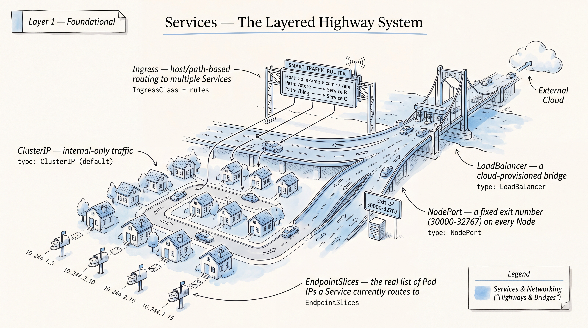
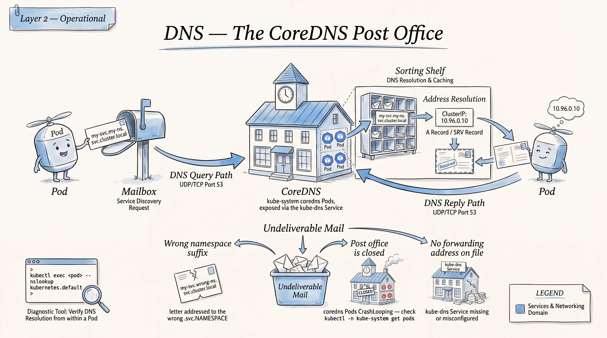
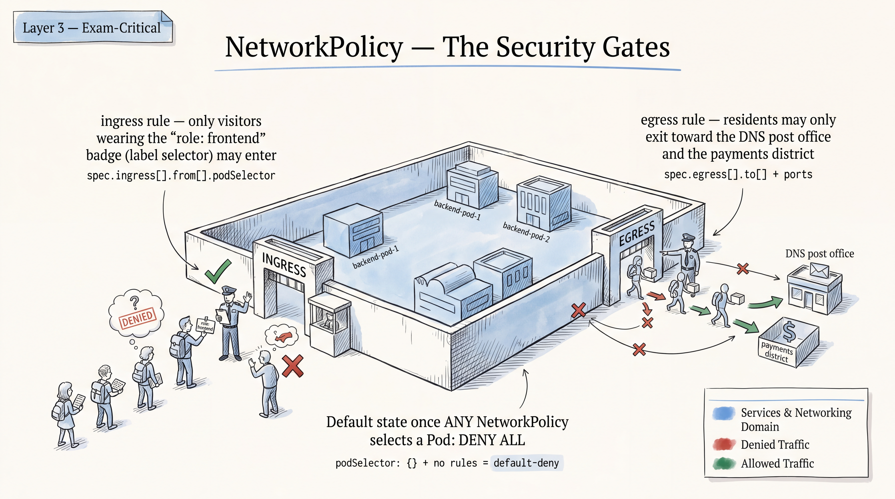
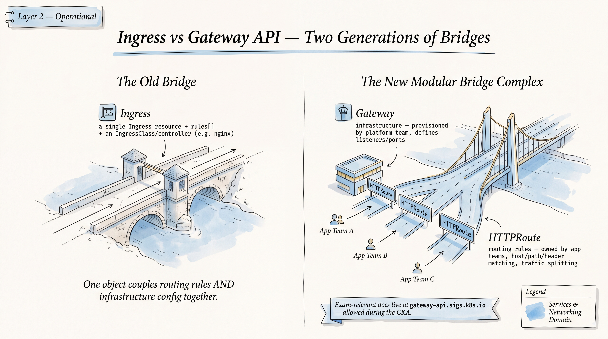
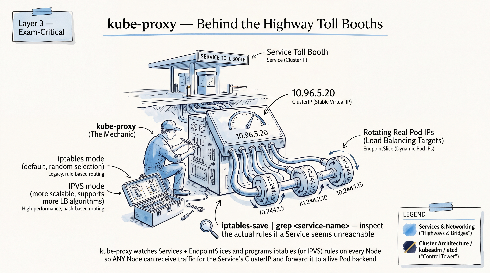
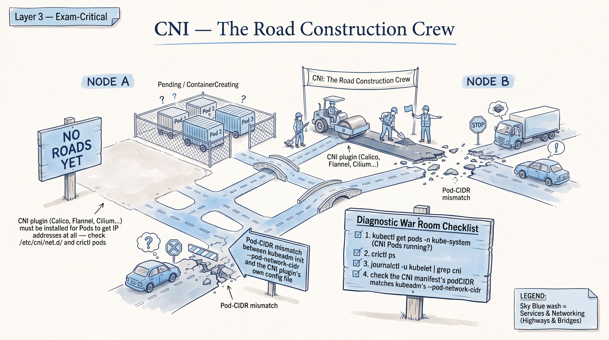

# CKA Domain: Services & Networking (20%)








*Scope calibration from `01-exam-snapshot-and-priorities.md`: this domain is P1 across the board — Services/Ingress/Gateway API rated Priority P1 (Low difficulty, Services is CKAD overlap, Gateway API is the newer piece), NetworkPolicy rated P1 (Low-Medium difficulty, partial CKAD overlap), and the narrow "CNI bring-up / pod-CIDR fix" sub-skill rated P2 (Low-confidence, single-source signal — general CNI/node/DNS diagnosis via logs/crictl/journalctl is the P0 item but lives in the Troubleshooting domain file, not here). Gateway API is confirmed in-scope and its docs (`gateway-api.sigs.k8s.io`) are exam-allowed for CKA specifically. Target version: v1.35 (re-verify against v1.36 before booking per the snapshot file). Nothing here is beginner material — you already know what a container is; this is exact syntax, exact flags, and exact failure-mode recall under a clock.*

---

# Part A — Rapid Knowledge Refresh

## A1. Services: ClusterIP, NodePort, LoadBalancer, ExternalName

### Concept
A Service is a stable virtual IP + DNS name that load-balances to a dynamic set of Pod endpoints selected by label selector (or manually via an `Endpoints`/`EndpointSlice` object with no selector). `ClusterIP` (default) is only reachable inside the cluster; `NodePort` opens the same ClusterIP routing plus a port in the 30000–32767 range on every node's IP; `LoadBalancer` extends NodePort by asking a cloud controller to provision an external LB (on bare-metal/kubeadm labs with no cloud integration, it just sits `<pending>` forever — expected, not a bug); `ExternalName` is a pure DNS-level CNAME to an external hostname with no proxying, no selector, and no ClusterIP at all. Service routing itself is implemented by kube-proxy (iptables or IPVS mode) rewriting packets on every node, not by a central load balancer process.

### Important objects
`Service`, `EndpointSlice` (or legacy `Endpoints`), `kube-proxy` (DaemonSet or static, implements the actual rules).

### Important YAML fields
```yaml
apiVersion: v1
kind: Service
metadata:
  name: my-svc
spec:
  type: NodePort         # ClusterIP | NodePort | LoadBalancer | ExternalName
  selector:
    app: myapp            # must match Pod labels exactly
  ports:
    - port: 80             # Service's own port
      targetPort: 8080      # container port — can be a name from the Pod spec
      nodePort: 30080        # only valid on NodePort/LoadBalancer (30000-32767) — apiserver rejects this field outright when type: ClusterIP
      protocol: TCP
---
apiVersion: v1
kind: Service
metadata:
  name: ext-svc
spec:
  type: ExternalName
  externalName: db.example.com   # no selector, no ports required
```

### Important commands
```bash
k expose deployment myapp --port=80 --target-port=8080 --type=NodePort
k create service clusterip my-svc --tcp=80:8080
k create service externalname ext-svc --external-name=db.example.com
k get svc -o wide
k get endpointslices -l kubernetes.io/service-name=my-svc
k describe svc my-svc          # shows Endpoints line directly — fastest sanity check
```

### How to verify
`k get endpointslices` (or `k describe svc`) must list Pod IPs — if `Endpoints: <none>`, the selector doesn't match any Pod. Then exec into a Pod (or use a throwaway `busybox`/`curlimages/curl` Pod) and `curl <svc-name>.<ns>.svc.cluster.local:<port>` or the ClusterIP directly. For NodePort, curl `<any-node-ip>:<nodePort>` from outside the pod network (this exercises the full iptables NAT path, not just DNS+ClusterIP).

### Common exam mistake
Mismatching `selector` labels vs. Pod labels (silent empty-Endpoints failure — `kubectl` won't error, it just never routes). Second most common: confusing `port` (what clients hit) with `targetPort` (what the container listens on) and leaving them equal when the container actually listens on a different port. Third: expecting `LoadBalancer` to get an external IP in a bare kubeadm lab with no cloud provider integration — it won't, and that's correct, not a bug to chase.

### One mini exercise
Create a Deployment with 2 replicas listening on port 8080, then create a ClusterIP Service exposing port 80 → targetPort 8080. Break it on purpose by editing the Service selector to not match, confirm `EndpointSlice` comes back empty, then fix it and confirm a `curl` from a temp Pod succeeds.

---

## A2. EndpointSlices

### Concept
EndpointSlices replaced the monolithic `Endpoints` object as the scalable backing store for Service membership (a single `Endpoints` object gets unwieldy past ~a few hundred addresses; EndpointSlices shard into multiple ~100-address objects per Service). Every selector-based Service auto-generates and maintains one or more EndpointSlices; Services without a selector require you to manage Endpoints/EndpointSlices manually (used for external-service mapping by IP, a legitimate CKA-flavored trick question). Each slice carries an `addressType` (`IPv4`/`IPv6`/`FQDN`), a list of `endpoints` (each with `addresses`, `conditions.ready`, and optionally `nodeName`), and a `ports` list.

### Important objects
`EndpointSlice` (`discovery.k8s.io/v1`), legacy `Endpoints` (`v1`, still created in parallel for back-compat unless disabled).

### Important YAML fields
```yaml
apiVersion: discovery.k8s.io/v1
kind: EndpointSlice
metadata:
  name: my-svc-manual
  labels:
    kubernetes.io/service-name: my-svc   # REQUIRED — this is what ties it to the Service
addressType: IPv4
ports:
  - port: 8080
endpoints:
  - addresses: ["10.244.1.5"]
    conditions:
      ready: true
```

### Important commands
```bash
k get endpointslices -A
k get endpointslices -l kubernetes.io/service-name=my-svc -o yaml
k get endpoints my-svc          # legacy view, often faster to read at a glance
```

### How to verify
`k describe svc` still surfaces an `Endpoints:` summary line even though it's backed by EndpointSlices under the hood — that one line is usually all you need. Drop to `k get endpointslices -o yaml` only when you need to check `conditions.ready` (an address can exist but be marked not-ready, e.g. failing readiness probe, and Service routing will skip it).

### Common exam mistake
Forgetting the `kubernetes.io/service-name` label when hand-authoring an EndpointSlice for a selector-less Service — without it, the slice is orphaned and never associated with the Service no matter how correctly named the file is.

### One mini exercise
Create a selector-less ClusterIP Service (no `spec.selector`) pointing at port 5432, then hand-write an EndpointSlice with a single fake address `10.244.9.9` and the correct label, and confirm `k describe svc` shows that address as an endpoint.

---

## A3. CoreDNS / DNS troubleshooting

### Concept
CoreDNS runs as a Deployment (typically 2 replicas) in `kube-system`, fronted by the `kube-dns` Service (name is legacy, don't be thrown), and is what every Pod's `/etc/resolv.conf` points at via the cluster DNS IP baked into kubelet's `--cluster-dns` flag (or the equivalent kubeadm/KubeletConfiguration field). Every Service gets an A/AAAA record `<svc>.<namespace>.svc.cluster.local`, and Pods (if `subdomain`+headless-Service configured) can get `<hostname>.<subdomain>.<namespace>.svc.cluster.local`. DNS failures are one of the single most common CKA troubleshooting scenarios and almost always trace to one of: CoreDNS pods not Running, CoreDNS Service has no/wrong endpoints, the CoreDNS `Corefile` ConfigMap is broken/misconfigured, a NetworkPolicy blocking egress to port 53, or the node's CNI being broken (so CoreDNS pods themselves can't get IPs/can't reach upstream).

### Important objects
`Deployment/coredns` (kube-system), `Service/kube-dns` (kube-system), `ConfigMap/coredns` (holds the `Corefile`), Pod `spec.dnsPolicy`/`spec.dnsConfig`.

### Important YAML fields
```yaml
# ConfigMap/coredns key "Corefile" — default structure to recognize when reading it, not to memorize verbatim
.:53 {
    errors
    health
    ready
    kubernetes cluster.local in-addr.arpa ip6.arpa {
       pods insecure
       fallthrough in-addr.arpa ip6.arpa
    }
    forward . /etc/resolv.conf {   # upstream resolution — common break point if this is pointed wrong
       max_concurrent 1000
    }
    cache 30
    loop
    reload
    loadbalance
}
```
```yaml
# Pod-level override, useful for isolating a broken cluster DNS during a task
spec:
  dnsPolicy: ClusterFirst   # default; also: Default, None, ClusterFirstWithHostNet
  dnsConfig:                 # only used when dnsPolicy: None, or to add extras
    nameservers: ["8.8.8.8"]
    searches: ["ns1.svc.cluster.local"]
```

### Important commands
```bash
k -n kube-system get pods -l k8s-app=kube-dns
k -n kube-system get svc kube-dns
k -n kube-system logs -l k8s-app=kube-dns --tail=100
k -n kube-system get cm coredns -o yaml
k run dnsutils --image=registry.k8s.io/e2e-test-images/jessie-dnsutils:1.7 -it --rm --restart=Never -- nslookup kubernetes.default
k run dnsutils --image=registry.k8s.io/e2e-test-images/jessie-dnsutils:1.7 -it --rm --restart=Never -- cat /etc/resolv.conf
```

### How to verify
Successful `nslookup kubernetes.default` (or any in-cluster Service FQDN) from a throwaway test Pod is the canonical proof. If that fails, check in order: are CoreDNS pods `Running` and `Ready`? Does `kube-dns` Service have endpoints (`k -n kube-system describe svc kube-dns`)? Is `/etc/resolv.conf` inside the test Pod pointing at the right cluster DNS IP? Do CoreDNS pod logs show `Corefile` parse errors or upstream `forward` failures?

### Common exam mistake
Diagnosing "DNS is broken" as a CoreDNS problem when it's actually a NetworkPolicy silently blocking UDP/TCP 53 egress from application namespaces — always check NetworkPolicies in the affected namespace before touching CoreDNS itself. Second: editing the `coredns` ConfigMap and forgetting CoreDNS doesn't hot-reload Corefile changes from a plain `kubectl edit` unless the `reload` plugin is present and its poll interval has elapsed — a `k -n kube-system rollout restart deployment coredns` is the reliable way to force a pickup.

### One mini exercise
Scale `coredns` to 0 replicas, confirm `nslookup` from a test Pod times out, scale back to 2, confirm it recovers. Then add a restrictive default-deny egress NetworkPolicy in `default` namespace and confirm DNS breaks again for Pods there even with CoreDNS healthy — then fix it by adding a port-53 egress allow rule.

---

## A4. NetworkPolicy

### Concept
NetworkPolicies are additive-only allow-lists enforced by the CNI plugin (not the API server — a cluster with a non-compliant CNI like early flannel silently ignores them entirely, which is worth knowing as a diagnostic dead-end to rule out first). With zero policies selecting a Pod, all traffic is allowed; the instant one policy selects a Pod for a given direction (`Ingress`/`Egress`), that direction becomes default-deny except for what's explicitly allowed, and multiple policies selecting the same Pod are unioned (OR'd), never intersected. Policies are namespaced and select Pods via `podSelector` (empty selector = all Pods in the namespace); egress/ingress rules combine `from`/`to` peers (`podSelector`, `namespaceSelector`, or `ipBlock`) with `ports` — an empty `from`/`to` list matches nothing on that rule, while an *absent* `ingress`/`egress` key entirely means "no rules of that type," not "allow all."

### Important objects
`NetworkPolicy` (`networking.k8s.io/v1`). No separate enforcement object — it's CNI-implemented.

### Important YAML fields
```yaml
apiVersion: networking.k8s.io/v1
kind: NetworkPolicy
metadata:
  name: deny-all-ingress
  namespace: prod
spec:
  podSelector: {}          # {} = all pods in namespace
  policyTypes: [Ingress]     # explicitly listing this matters — see mistake below
---
apiVersion: networking.k8s.io/v1
kind: NetworkPolicy
metadata:
  name: allow-frontend-to-backend
  namespace: prod
spec:
  podSelector:
    matchLabels: { app: backend }
  policyTypes: [Ingress, Egress]
  ingress:
    - from:
        - podSelector: { matchLabels: { app: frontend } }
          namespaceSelector: {}   # combining both = AND: frontend pods in ANY namespace
      ports:
        - protocol: TCP
          port: 8080
  egress:
    - to:
        - namespaceSelector: { matchLabels: { kubernetes.io/metadata.name: kube-system } }
      ports:
        - protocol: UDP
          port: 53
        - protocol: TCP     # DNS falls back to TCP for large/truncated responses — UDP-only egress breaks those lookups
          port: 53
```

### Important commands
```bash
k get networkpolicy -A
k describe networkpolicy allow-frontend-to-backend -n prod
k get pods -n prod --show-labels
k get ns --show-labels          # namespaceSelector matches need this checked
```

### How to verify
There is no `kubectl` dry-run for policy effect — verify empirically with a temp Pod using the allowed/denied labels and `curl --max-time 3` or `nc -zv -w 3` against the target, confirming both the positive case (allowed traffic succeeds) and negative case (traffic that should now be blocked times out — DNS/API errors look different from a genuine policy drop, so a timeout, not a "connection refused," is the signature of a NetworkPolicy block).

### Common exam mistake
Forgetting `policyTypes` — if you only write an `ingress` block but don't list `Ingress` under `policyTypes` (or vice versa for egress-only policies), the ingress rules are silently ignored. Second: writing an empty `egress: []` while forgetting DNS — the moment any egress policy selects a Pod, port 53 to CoreDNS must be explicitly allowed or the Pod loses all DNS resolution even for unrelated traffic. Third: confusing `podSelector` + `namespaceSelector` **combined in one peer entry** (logical AND — same peer must satisfy both) with two **separate entries in the same `from` list** (logical OR).

### One mini exercise
In a namespace with `frontend` and `backend` Pods (labeled accordingly) and a third unlabeled `debug` Pod, write a policy that default-denies all ingress to `backend`, then a second policy allowing ingress only from `frontend` on port 8080. Confirm `frontend`→`backend` works, `debug`→`backend` times out.

---

## A5. Ingress

### Concept
Ingress is an L7 HTTP(S) routing object consumed by an Ingress Controller (NGINX, Traefik, etc. — the controller is not built into the API server and must exist as a running workload; kubeadm labs commonly use ingress-nginx). It maps host/path rules to backend Services, optionally terminates TLS via a referenced Secret, and every Ingress must specify (or inherit via a default) an `ingressClassName` telling the API server which controller should act on it — an Ingress with no matching controller just sits inert with no error. CKA treats Ingress as largely a CKAD-overlap skill (per the priority matrix, "Low difficulty"), but exact annotation/pathType syntax is still worth having cold since it's easy to get subtly wrong under time pressure.

### Important objects
`Ingress` (`networking.k8s.io/v1`), `IngressClass`, the controller Deployment/Service itself (e.g. `ingress-nginx-controller`), TLS `Secret` (type `kubernetes.io/tls`).

### Important YAML fields
```yaml
apiVersion: networking.k8s.io/v1
kind: Ingress
metadata:
  name: web-ingress
  annotations:
    nginx.ingress.kubernetes.io/rewrite-target: /   # controller-specific, only if needed
spec:
  ingressClassName: nginx        # must match an existing IngressClass, or default one
  tls:
    - hosts: ["app.example.com"]
      secretName: app-tls
  rules:
    - host: app.example.com
      http:
        paths:
          - path: /
            pathType: Prefix       # Prefix | Exact | ImplementationSpecific
            backend:
              service:
                name: web-svc
                port:
                  number: 80
```

### Important commands
```bash
k get ingressclass
k create ingress web-ingress --rule="app.example.com/=web-svc:80" --class=nginx
k get ingress -o wide
k describe ingress web-ingress
```

### How to verify
`k describe ingress` shows resolved backend endpoints per path — if `Address:` is empty or a backend line says no endpoints, that's your problem. Test with `curl -H "Host: app.example.com" http://<controller-ip-or-nodeport>/`.

### Common exam mistake
Omitting `ingressClassName` (or the legacy `kubernetes.io/ingress.class` annotation on older clusters) and then wondering why nothing routes — with no default IngressClass configured, an unclassed Ingress is simply never picked up by any controller. Second: `pathType: Exact` when the task implies prefix matching (or vice versa) — these produce genuinely different routing, not just style.

### One mini exercise
Deploy ingress-nginx (or assume it's pre-installed in your practice cluster), create two Services (`v1-svc`, `v2-svc`), and write one Ingress routing `/v1` and `/v2` to each with `pathType: Prefix`. Verify both paths independently with `curl`.

---

## A6. Gateway API / HTTPRoute

### Concept
Gateway API is the newer, more expressive successor model to Ingress, split into distinct roles: a `GatewayClass` (cluster-scoped, defines which controller implements it — analogous to `IngressClass`), a `Gateway` (a concrete listener/entry point, e.g. binds a hostname+port, provisioned by infra/platform teams), and route objects like `HTTPRoute` (attached to a Gateway via `parentRefs`, owned by app teams, defines host/path/header matching and backend routing — richer than Ingress: header-based matching, traffic splitting/weighting across multiple backendRefs, and cross-namespace routing via `ReferenceGrant`). This was added to the official CKA curriculum in the ~2025 overhaul specifically for "ingress traffic management," and its docs domain (`gateway-api.sigs.k8s.io`) is explicitly exam-allowed for CKA (confirmed — not true for CKAD). Treat it as genuinely new material, not a re-skin of Ingress knowledge — the object model and API group are both different (`gateway.networking.k8s.io`), and Gateway API CRDs must be installed separately (they are not built into core Kubernetes even in v1.35/v1.36).

### Important objects
`GatewayClass`, `Gateway`, `HTTPRoute` (also `GRPCRoute`, `TCPRoute`, `TLSRoute` — less likely to be tested but recognize them), `ReferenceGrant` (cross-namespace backend permission).

### Important YAML fields
```yaml
apiVersion: gateway.networking.k8s.io/v1
kind: Gateway
metadata:
  name: web-gateway
spec:
  gatewayClassName: nginx     # or istio, envoy-gateway, etc. — whatever controller is installed
  listeners:
    - name: http
      protocol: HTTP
      port: 80
      allowedRoutes:
        namespaces:
          from: All          # All | Same | Selector
---
apiVersion: gateway.networking.k8s.io/v1
kind: HTTPRoute
metadata:
  name: web-route
spec:
  parentRefs:
    - name: web-gateway
  hostnames: ["app.example.com"]
  rules:
    - matches:
        - path:
            type: PathPrefix
            value: /api
      backendRefs:
        - name: api-svc
          port: 8080
          weight: 100      # useful for canary/traffic-split scenarios
```

### Important commands
```bash
k get gatewayclass
k get gateway -A
k get httproute -A
k describe httproute web-route
k api-resources | grep gateway.networking.k8s.io    # confirm CRDs are actually installed
```

### How to verify
`k get gateway web-gateway -o yaml` and check `status.conditions` for `Programmed: True` / `Accepted: True` — Gateway API is heavily status-condition-driven, more so than Ingress. Same pattern on `HTTPRoute` status — check `parents[].conditions` for `Accepted`/`ResolvedRefs`. Then functional-test exactly like Ingress: `curl` against the Gateway's address/NodePort with the right `Host` header.

### Common exam mistake
Assuming the Gateway API CRDs are pre-installed like core resources — if `k get gatewayclass` errors with "no matches for kind," the CRDs (and a controller implementing them) simply aren't present and must be installed first; this is a very plausible thing for a task to deliberately omit. Second: forgetting `parentRefs` must reference an existing `Gateway` by name (and `sectionName` if the Gateway has multiple listeners) — a dangling `parentRefs` leaves the route's status `Accepted: False` with no traffic ever routed.

### One mini exercise
Given a pre-installed Gateway API controller (state this assumption explicitly when practicing, since installing one from scratch is its own multi-step task), create a `Gateway` with one HTTP listener, then an `HTTPRoute` on it splitting traffic 80/20 between two backend Services using `weight`. Confirm both routes' `status.conditions` show `Accepted: True`.

---

## A7. Pod-to-pod and node networking

### Concept
Kubernetes' fundamental networking model requires: every Pod gets its own routable IP (no NAT between Pods, cluster-wide), every Pod can reach every other Pod's IP directly without NAT, and a Pod sees its own IP the same way others see it. This is delivered by the CNI plugin, not the Kubernetes core — kubelet calls the configured CNI binary (per `/etc/cni/net.d/*.conf(list)`) on every Pod create/delete to assign an IP from a per-node slice of the cluster's Pod CIDR and wire up routes (implementation varies: overlay/VXLAN for flannel, BGP-based real routing for Calico, eBPF for Cilium — you don't need controller-level depth, just enough to recognize the layer where a fault lives). Node-to-node (and thus pod-to-pod cross-node) traffic itself rides on the underlying physical/VPC network — the CNI's job is making sure each node knows the route to every other node's Pod CIDR slice, either via an overlay tunnel or real routing table entries.

### Important objects
No dedicated K8s API object — configuration lives in files (`/etc/cni/net.d/`, CNI binaries in `/opt/cni/bin/`) and in the CNI's own CRDs/DaemonSet if it uses them (Calico's `IPPool`, `BGPPeer`, etc.).

### Important YAML fields
Not YAML-centric — relevant fields live in `kubeadm-config`/`ClusterConfiguration` (`podSubnet`, `serviceSubnet`) and the CNI's own install manifest (e.g. flannel's `net-conf.json` embedded ConfigMap, which must match the cluster's actual `--pod-network-cidr`).

### Important commands
```bash
k get nodes -o jsonpath='{.items[*].spec.podCIDR}'
k get pods -A -o wide                          # cross-check Pod IPs are in-CIDR and unique per node
ip addr show                                    # on a node: check cni0/flannel.1/cali* interfaces exist
ip route                                        # confirm routes to other nodes' pod CIDRs
crictl ps
crictl logs <container-id>
journalctl -u kubelet -f
cat /etc/cni/net.d/*.conf*
ls /opt/cni/bin/
```

### How to verify
Pods on different nodes can `ping`/`curl` each other's Pod IP directly (not via Service). `k get nodes` shows all `Ready`. `k get pods -A -o wide` shows no Pods stuck `Pending`/`ContainerCreating` due to IP allocation failure. `ip route` on a node lists a route (or tunnel endpoint) for every other node's `podCIDR`.

### Common exam mistake
Installing a CNI manifest whose embedded pod-network CIDR doesn't match the `--pod-network-cidr` given to `kubeadm init` — nodes come up `Ready` but Pods never get IPs (or get IPs in the wrong range and can't route), and CoreDNS Pods specifically get stuck `Pending`/`ContainerCreating` since they need the CNI too. This exact "practice scenario shape" is directly named in the priority matrix as a realistic drill even though its real-exam frequency is unverified.

### One mini exercise
On a lab kubeadm cluster, check the actual `podSubnet` via `k -n kube-system get cm kubeadm-config -o yaml` (or your `kubeadm init` flags), then inspect the flannel/Calico ConfigMap's configured CIDR and confirm they match. Deliberately break it by re-applying a CNI manifest with a different CIDR patched in, then observe new Pods sticking in `ContainerCreating`, then fix and confirm recovery.

---

## A8. CNI troubleshooting basics

### Concept
When Pods on a node are stuck `ContainerCreating` with events like `failed to set up sandbox container` or `network: failed to find plugin`, or nodes show `Ready` but with a `NetworkPluginNotReady`/`node.kubernetes.io/network-unavailable` condition/taint, the fault is in the CNI layer: missing/misconfigured `/etc/cni/net.d/*.conf`, missing binaries under `/opt/cni/bin/`, the CNI DaemonSet Pod itself crashlooping (common when its own CIDR config is wrong or it can't reach the API server), or a genuinely down network path between nodes breaking the overlay. This sits at the boundary between the Services & Networking domain and the (larger, 30%-weighted) Troubleshooting domain — the general log/event/`crictl`/`journalctl` diagnosis workflow itself belongs to Troubleshooting, but recognizing CNI-specific symptoms is what this domain adds.

### Important objects
CNI DaemonSet (`kube-flannel`, `calico-node`, etc. in `kube-system`), Node `.status.conditions` and `.spec.taints`.

### Important YAML fields
N/A — this is diagnostic, not authoring. Recognize the taint key `node.kubernetes.io/network-unavailable` and the condition type `NetworkUnavailable` when reading `k describe node` output.

### Important commands
```bash
k get nodes -o wide
k describe node <node>                     # check Conditions and Taints sections
k -n kube-system get pods -o wide | grep -E "flannel|calico|cilium"
k -n kube-system logs <cni-pod> 
k describe pod <stuck-pod> -n <ns>          # Events section: exact CNI error string
crictl ps -a
crictl inspect <container-id> | grep -i network
journalctl -u kubelet --since "10 min ago" | grep -i cni
```

### How to verify
Node condition `NetworkUnavailable: False` and no lingering `network-unavailable` taint; CNI DaemonSet Pods all `Running`/`Ready` on every node (`k -n kube-system get pods -o wide` filtered to the CNI label, count must equal node count); previously-stuck Pods transition out of `ContainerCreating` once the CNI is healthy — confirm the actual `Events` line clears, not just that time has passed.

### Common exam mistake
Chasing kubelet/API-server logs for a networking symptom that's actually a CNI DaemonSet crashloop — always check `k -n kube-system get pods` for the CNI's own Pods first when you see fleet-wide `ContainerCreating`/`NotReady`, since CNI failure has a very specific and recognizable blast-radius pattern (whole node, all new Pods, existing ones often fine).

### One mini exercise
On a lab node, rename `/etc/cni/net.d/10-flannel.conflist` to hide it, then try creating a new Pod on that node and observe the exact `FailedCreatePodSandBox` event text via `k describe pod`. Restore the file and confirm the same Pod then schedules successfully (may need to delete and let it recreate).

---

## A9. iptables / nftables relevance

### Concept
kube-proxy is what actually implements Service virtual IPs, and it does so by programming the node's packet-filtering layer — historically `iptables` (via `iptables-legacy` or `iptables-nft` back-ends), with an `ipvs` mode for higher-scale clusters, and increasingly `nftables` as its own kube-proxy mode on modern kubelet/kube-proxy versions (nftables backend has been progressing toward being viable/default-track in recent K8s release cycles — treat the exact current default as something to sanity-check against the live docs rather than assume, since this is exactly the kind of "moving target" the version-drift note in the exam snapshot warns about). Regardless of backend, the mental model is identical to what you already know from CKAD-adjacent networking: kube-proxy watches Services/EndpointSlices and rewrites the node's NAT rules so that traffic to a ClusterIP gets DNAT'd to a live Pod IP, and NodePort traffic gets caught on every node regardless of whether that node runs a matching Pod.

### Important objects
`kube-proxy` (DaemonSet, `kube-system`), its `ConfigMap` (`kube-proxy` config, holds `mode: iptables|ipvs|nftables`).

### Important YAML fields
```yaml
# ConfigMap/kube-proxy (kube-system) — relevant key inside kube-proxy-config
mode: "iptables"     # or "ipvs" or "nftables" depending on cluster build
```

### Important commands
```bash
k -n kube-system get cm kube-proxy -o yaml | grep mode
k -n kube-system logs -l k8s-app=kube-proxy --tail=50
sudo iptables -t nat -L -n | grep <service-cluster-ip>       # iptables mode
sudo nft list ruleset | grep -A5 <service-name>                 # nftables mode
sudo ipvsadm -Ln                                                  # ipvs mode, if installed
```

### How to verify
This is almost never something you author directly on the exam — it's a diagnostic escape hatch for "Service exists, Endpoints exist, but traffic still doesn't reach the Pod." In that specific case, confirm kube-proxy Pods are `Running` on the affected node and check its logs for sync errors before dropping to raw `iptables`/`nft` rule inspection.

### Common exam mistake
Reaching for raw `iptables`/`nft` rule-reading as a first troubleshooting step when the actual fault is almost always one layer up (bad selector, bad targetPort, NetworkPolicy, CNI) — this is a last-resort verification tool, not a first-line diagnostic, and spending exam minutes parsing NAT chains before ruling out the cheaper checks is a classic time sink in a 30%-troubleshooting-weighted, ~7-minutes-per-task exam.

### One mini exercise
On a lab node, identify kube-proxy's mode from its ConfigMap, then find the NAT rule (or nft/ipvs equivalent) corresponding to a Service you created earlier and confirm it lists the correct backend Pod IP as the DNAT target.

---

## A10. Port-mapping mistakes (cross-cutting)

### Concept
The single highest-frequency class of "why doesn't this work" across every object in this domain is a port/field mismatch, not a conceptual gap. Container `containerPort` (documentation only — not enforced, doesn't need to match anything to function, but should match reality) vs. Service `targetPort` (must equal what the container is actually listening on — by number or by the container port's `name`) vs. Service `port` (what clients/other Services use) vs. `nodePort` (must be 30000–32767, only meaningful on NodePort/LoadBalancer) vs. Ingress backend `service.port.number` (must equal the Service's `port`, not its `targetPort`) — these are five distinct fields that are trivially easy to conflate under time pressure, and a wrong one produces no error, just silent connection failures or timeouts.

### Important objects
N/A — cross-cutting field discipline across `Pod.spec.containers[].ports`, `Service.spec.ports`, `Ingress...backend.service.port`.

### Important YAML fields
See A1/A5 above — the point here is the *relationship* between them, not new syntax.

### Important commands
```bash
k get pod <pod> -o jsonpath='{.spec.containers[0].ports}'
k get svc <svc> -o jsonpath='{.spec.ports}'
k exec <pod> -- netstat -tlnp    # or ss -tlnp — confirm what port the app is ACTUALLY listening on
```

### How to verify
Cross-check the actual listening port inside the container (don't trust the manifest's stated `containerPort` — verify with `ss`/`netstat` or app logs) against Service `targetPort`, and Service `port` against whatever's referenced upstream (Ingress backend, another app's env var/ConfigMap).

### Common exam mistake
Trusting a manifest's declared `containerPort` as ground truth instead of checking what the process inside the container is actually bound to — a very common deliberately-broken-task pattern is an app listening on, say, 3000 while every manifest says 8080.

### One mini exercise
Deploy a Pod running `busybox` with `nc -lk -p 9000 -e echo hello` (or any simple listener) but write `containerPort: 8080` in the manifest, then create a Service with `targetPort: 8080` and watch it fail; use `k exec ... -- netstat -tlnp` (or `ss -tlnp`) to spot the real listening port, then fix `targetPort` to 9000 and confirm success.

---

# Part B — Task Patterns

## B1. Expose a workload and fix a broken Service

### Skill tested
Service creation from imperative/declarative sources and root-causing "Service exists but traffic doesn't reach the Pod."

### What the task usually looks like
"A Deployment `X` exists in namespace `Y`. Expose it via a Service of type `Z` on port `P`." Often paired with a pre-seeded broken Service in the same or another namespace that you must fix rather than create from scratch.

### Commands I need
```bash
k expose deployment X -n Y --port=P --target-port=<containerPort> --type=ClusterIP
k get endpointslices -n Y -l kubernetes.io/service-name=<svc>
k describe svc <svc> -n Y
k edit svc <svc> -n Y
```

### Files/directories commonly involved
None persistent — this is almost always live `kubectl` object manipulation, not file-based, unless the task explicitly says "using a manifest file at `/root/svc.yaml`."

### Kubernetes documentation page worth knowing
`Concepts > Services, Load Balancing, and Networking > Service` and its "Debugging Services" section.

### Common mistakes
Selector/label mismatch (silent); wrong `targetPort`; assuming `LoadBalancer` will get an external IP with no cloud provider; forgetting `-n <namespace>` and creating/editing the Service in the wrong namespace.

### Fastest solution strategy
`k describe svc` first, always — its `Selector:` and `Endpoints:` lines together diagnose ~80% of these tasks in one command. Only reach for `k get pods --show-labels` and manual selector comparison if `Endpoints` is empty and the reason isn't obvious.

### Typical troubleshooting variation
The Service is correct but the Pod's own readiness probe is failing, so it's correctly excluded from Endpoints — the fix is in the Pod/Deployment, not the Service. Don't tunnel-vision on Service YAML when the root cause is upstream.

### Estimated time target
3–5 minutes for a straightforward expose; 5–8 minutes if it's a "find and fix the broken one" variant.

### Original practice task
**Solve:** Create a namespace `netlab`. Deploy `nginx` with 2 replicas labeled `app=web` listening on port 80. Create a ClusterIP Service `web-svc` on port 8080 → targetPort 80. Then deliberately edit the Service's selector to `app=webapp` (wrong) and demonstrate you can detect and fix it back to `app=web`.
**Verify:** `k get endpointslices -n netlab -l kubernetes.io/service-name=web-svc` lists 2 addresses; a temp Pod `curl web-svc.netlab.svc.cluster.local:8080` returns the nginx welcome page.

### Hard-mode version
Do the same but with a selector-less Service and a hand-authored `EndpointSlice` pointing at two external (non-Pod) IPs, simulating exposing a legacy VM-hosted service to the cluster.

---

## B2. NetworkPolicy default-deny + selective allow

### Skill tested
Writing correct default-deny plus scoped allow NetworkPolicies without breaking DNS.

### What the task usually looks like
"In namespace `prod`, ensure Pods labeled `app=backend` only accept traffic from Pods labeled `app=frontend` on port `8080`, and deny everything else." Sometimes layered with an egress requirement too ("...and `backend` may only reach `app=db` on port 5432 plus DNS").

### Commands I need
```bash
k get pods -n prod --show-labels
k apply -f netpol.yaml
k describe networkpolicy -n prod
```

### Files/directories commonly involved
A manifest file you write from scratch (no reliable `kubectl create networkpolicy` imperative generator exists — this is one of the few objects you genuinely hand-write YAML for, so know the skeleton cold).

### Kubernetes documentation page worth knowing
`Concepts > Services, Load Balancing, and Networking > Network Policies` — includes copy-pasteable default-deny-all examples worth having mentally indexed.

### Common mistakes
Forgetting `policyTypes`; forgetting the DNS egress carve-out once any egress policy is applied; using `namespaceSelector` and `podSelector` in the same peer entry when the intent was actually "either/or" (should have been two separate `from` entries).

### Fastest solution strategy
Write the default-deny policy first and confirm the negative case (blocked traffic times out) before layering the allow policy — verifying the deny half in isolation avoids debugging two policies' interaction at once. Then add the allow policy and re-verify both the newly-allowed path and that unrelated traffic is still blocked.

### Typical troubleshooting variation
Task gives you a pre-existing but broken NetworkPolicy (e.g., wrong port, wrong label key) and asks you to fix connectivity without loosening security beyond what's needed — resist the shortcut of just deleting the policy.

### Estimated time target
6–9 minutes including verification with a temp Pod.

### Original practice task
**Solve:** In namespace `prod`, create Pods `frontend` (`app=frontend`), `backend` (`app=backend`, listens on 8080), and `intruder` (no matching labels). Write a policy `backend-default-deny` (default-deny all ingress to `app=backend`) and `backend-allow-frontend` (allow ingress from `app=frontend` on port 8080 only). Add an egress policy on `backend` allowing DNS (UDP/TCP 53 to `kube-system`) and nothing else.
**Verify:** `frontend`→`backend:8080` succeeds; `intruder`→`backend:8080` times out; `backend`'s DNS lookups (`nslookup kubernetes.default`) still succeed; `backend`'s attempt to reach any other arbitrary address times out.

### Hard-mode version
Add a third tier `app=db` and require `backend`→`db:5432` egress while `frontend` must NOT be able to reach `db` directly at all (only through `backend`) — a three-tier segmentation model in one namespace.

---

## B3. Diagnose and fix a cluster DNS failure

### Skill tested
End-to-end DNS diagnosis: CoreDNS health, Service endpoints, Corefile config, and NetworkPolicy interaction.

### What the task usually looks like
"Pods in namespace `X` cannot resolve any in-cluster or external DNS names. Fix it." The actual injected fault varies: CoreDNS scaled to 0, `kube-dns` Service selector broken, Corefile syntax error, or (the classic cross-domain trap) a NetworkPolicy blocking port 53 egress.

### Commands I need
```bash
k -n kube-system get pods,svc -l k8s-app=kube-dns
k -n kube-system logs deploy/coredns
k -n kube-system get cm coredns -o yaml
k -n kube-system rollout restart deployment coredns
k get networkpolicy -A
```

### Files/directories commonly involved
No files typically — everything is live cluster state (Deployment, Service, ConfigMap, NetworkPolicy objects).

### Kubernetes documentation page worth knowing
`Tasks > Administer a Cluster > Debug DNS Resolution` — this page's step-by-step order (check CoreDNS pods → check Service → check Corefile → check DNS from a test pod) is essentially the exact checklist to reproduce verbatim under time pressure.

### Common mistakes
Only checking CoreDNS Pod status and stopping there when the real fault is a NetworkPolicy; editing the Corefile ConfigMap and expecting an instant hot-reload without a rollout restart; not checking whether the fault is cluster-wide (CoreDNS itself) vs. namespace-scoped (NetworkPolicy) before picking a fix.

### Fastest solution strategy
Run the official debug-DNS checklist top to bottom rather than guessing: Pods Running? Service has Endpoints? Corefile parses (check logs for errors, not just existence)? NetworkPolicies in the affected namespace? Only then treat it as an app-level `/etc/resolv.conf`/`dnsPolicy` issue.

### Typical troubleshooting variation
DNS works for some namespaces but not others — near-certain sign it's a NetworkPolicy scoped to specific namespaces/labels rather than a cluster-wide CoreDNS problem, since CoreDNS itself has no concept of "namespace X can't reach me."

### Estimated time target
5–7 minutes once the checklist is memorized; budget extra time if you have to distinguish policy-based vs. CoreDNS-based causes.

### Original practice task
**Solve:** Break DNS three different ways in sequence on a lab cluster (scale CoreDNS to 0; restore it, then break the `kube-dns` Service selector; restore it, then add a namespace-scoped default-deny-egress NetworkPolicy with no DNS carve-out) and fix each using the correct targeted remedy rather than a blanket "restart everything."
**Verify:** After each fix, `k run dnsutils --image=registry.k8s.io/e2e-test-images/jessie-dnsutils:1.7 -it --rm --restart=Never -n <affected-ns> -- nslookup kubernetes.default` succeeds.

### Hard-mode version
Inject a Corefile syntax error (e.g., malformed `forward` block) instead of any of the above, requiring you to read CoreDNS pod logs for the actual parse-error line rather than diagnosing from symptoms alone.

---

## B4. Ingress routing setup and troubleshooting

### Skill tested
Ingress object authoring, IngressClass awareness, and diagnosing "Ingress exists but returns 404/no route."

### What the task usually looks like
"Route `app.example.com/api` to Service `api-svc:8080` and `app.example.com/` to `web-svc:80` using the pre-installed `nginx` ingress controller." Or a pre-broken Ingress (wrong `ingressClassName`, wrong `pathType`, wrong backend port) to fix.

### Commands I need
```bash
k get ingressclass
k create ingress app-ingress --rule="app.example.com/api*=api-svc:8080" --rule="app.example.com/=web-svc:80" --class=nginx
k describe ingress app-ingress
k -n ingress-nginx get pods,svc
```

### Files/directories commonly involved
Typically live object creation; occasionally a provided manifest at a known path to `k apply -f` after fixing.

### Kubernetes documentation page worth knowing
`Concepts > Services, Load Balancing, and Networking > Ingress` plus `Ingress Controllers` page for the controller-must-exist-separately point.

### Common mistakes
Missing/mismatched `ingressClassName`; wrong `pathType` (`Exact` vs `Prefix`) breaking multi-path routing; referencing the Service's `targetPort` instead of its `port` in the Ingress backend.

### Fastest solution strategy
`k describe ingress` first — it resolves and prints the actual backend per rule, immediately showing if a Service/port reference is wrong even before you try a live `curl`.

### Typical troubleshooting variation
Controller Pod itself is crashlooping or missing (task expects you to notice the controller namespace has zero healthy Pods) rather than the Ingress object being wrong at all.

### Estimated time target
4–6 minutes for straightforward creation; 6–9 for a fix-the-broken-one variant.

### Original practice task
**Solve:** Assuming ingress-nginx is installed, create two Deployments+Services (`v1` on port 8080, `v2` on port 8081), then an Ingress splitting `/v1` and `/v2` prefixes to each on host `demo.local`.
**Verify:** `curl -H "Host: demo.local" http://<ingress-controller-ip>/v1` and `.../v2` return distinct expected responses; `k describe ingress` shows both backends resolved with non-empty endpoints.

### Hard-mode version
Add TLS termination with a self-signed cert/key generated via `openssl` and stored as a `kubernetes.io/tls` Secret, and confirm HTTPS access works while plain HTTP either redirects or is rejected per the controller's default behavior.

---

## B5. Gateway API HTTPRoute setup

### Skill tested
Recognizing and authoring the newer Gateway/HTTPRoute object model, distinct from Ingress.

### What the task usually looks like
"Using the pre-installed Gateway API controller and existing `GatewayClass`, create a `Gateway` and an `HTTPRoute` routing `api.example.com` to Service `api-svc:8080`." May also test traffic splitting via `weight` across two backends.

### Commands I need
```bash
k get gatewayclass
k api-resources | grep gateway.networking.k8s.io
k apply -f gateway.yaml
k apply -f httproute.yaml
k get gateway,httproute -o yaml
```

### Files/directories commonly involved
Hand-written manifests — no imperative generator exists for Gateway API objects.

### Kubernetes documentation page worth knowing
`gateway-api.sigs.k8s.io` (explicitly exam-allowed for CKA) — specifically the "Getting Started" and "HTTPRoute" reference pages; also `kubernetes.io`'s own Ingress/Gateway comparison page for framing.

### Common mistakes
Assuming CRDs are pre-installed and not checking first; wrong/missing `parentRefs` (name and, if the Gateway has multiple listeners, `sectionName`); not checking `status.conditions` and instead only checking that `kubectl apply` succeeded (applying succeeds even if the route never actually attaches).

### Fastest solution strategy
Check `k get gatewayclass` and `k api-resources | grep gateway` before writing anything — confirms the platform half of the task is even in place. Then always read back `status.conditions` on both `Gateway` and `HTTPRoute` rather than trusting a clean `apply`.

### Typical troubleshooting variation
`HTTPRoute` created in a different namespace from the backend Service with no `ReferenceGrant` — cross-namespace backend references are denied by default and need an explicit `ReferenceGrant` in the Service's namespace.

### Estimated time target
6–10 minutes — budget more than Ingress since the object model is less over-learned muscle memory.

### Original practice task
**Solve:** Given a pre-installed Gateway API implementation, create a `Gateway` named `demo-gw` with one HTTP listener on port 80, then an `HTTPRoute` named `api-route` attached to it, matching path prefix `/api`, with two `backendRefs` (`api-v1`, `api-v2`) each weighted 50.
**Verify:** `k get httproute api-route -o jsonpath='{.status.parents[0].conditions}'` shows `Accepted: True` and `ResolvedRefs: True`; repeated `curl` calls against the Gateway's address show responses from both backends roughly evenly.

### Hard-mode version
Put `api-v2`'s Service in a different namespace from the `HTTPRoute` and demonstrate the request fails until you add the correct `ReferenceGrant`.

---

## B6. CNI bring-up / pod-CIDR mismatch diagnosis

### Skill tested
Recognizing CNI-layer failure signatures and reconciling a pod-network CIDR mismatch (P2 per the priority matrix — lower-confidence as an independently-verified real-exam pattern, but a legitimate and cheap drill).

### What the task usually looks like
A freshly-`kubeadm init`'d (or pre-broken) cluster where nodes are stuck `NotReady` and CoreDNS Pods are stuck `Pending`/`ContainerCreating` because either no CNI is installed yet, or the installed CNI manifest's CIDR doesn't match `--pod-network-cidr`.

### Commands I need
```bash
k get nodes
k get pods -A -o wide
k -n kube-system get cm kubeadm-config -o yaml
k -n kube-system get ds
k -n kube-system logs -l <cni-label>
k describe pod <pending-coredns-pod> -n kube-system
```

### Files/directories commonly involved
The CNI's own install manifest (often a well-known public URL you `kubectl apply -f` per the CNI's docs — check whether the exam environment allows outbound fetches or provides a local copy), `/etc/cni/net.d/`, `/etc/kubernetes/manifests/` if a static-pod-level component is implicated.

### Kubernetes documentation page worth knowing
`Tasks > Administer a Cluster > Networking > Installing Addons`; the specific CNI vendor's own install page (flannel/Calico) — note neither of those is on the exam's allowed-docs list by default the way kubernetes.io is, so know the manifest CIDR field name (`net-conf.json`'s `Network` key for flannel; `CALICO_IPV4POOL_CIDR` env var for Calico) from memory.

### Common mistakes
Applying a CNI manifest with its bundled default CIDR (e.g., flannel's default `10.244.0.0/16`) without checking it matches the cluster's actual `--pod-network-cidr`; not noticing CoreDNS Pods specifically (not just app Pods) are stuck, which is the fastest tell that this is CNI-layer, not app-layer.

### Fastest solution strategy
`k get nodes` → all `Ready`? If not, check `k describe node` Conditions for `NetworkPluginNotReady` and go straight to checking whether the CNI DaemonSet exists at all. If nodes are `Ready` but new Pods hang, compare the CNI ConfigMap's CIDR against `kubeadm-config`'s `podSubnet` field directly rather than guessing.

### Typical troubleshooting variation
CNI is installed and CIDRs match, but the DaemonSet Pods themselves are crashlooping due to an unrelated cause (e.g., missing kernel module, RBAC permission issue for the CNI's ServiceAccount) — a reminder to check the CNI Pods' own logs, not just its config.

### Estimated time target
8–12 minutes — this is one of the slower patterns in the domain since it spans config-file inspection plus live object diagnosis.

### Original practice task
**Solve:** On a lab `kubeadm init --pod-network-cidr=10.244.0.0/16` cluster, apply a deliberately-edited flannel manifest with `Network: "10.245.0.0/16"` in its ConfigMap. Observe and describe the exact failure mode on new Pods, then correct the CIDR and confirm recovery.
**Verify:** `k get nodes` shows all `Ready`; `k -n kube-system get pods` shows CoreDNS `Running`/`2/2 or 1/1 Ready`; a new test Pod scheduled on any node reaches `Running` within a normal timeframe.

### Hard-mode version
Do the same diagnosis but with the CNI DaemonSet Pods themselves crashlooping (e.g., patch in a bad image tag) instead of a CIDR mismatch, so the symptom looks identical at the `k get nodes`/`k get pods -A` level but the root cause and fix are entirely different — forces you to actually read DaemonSet Pod logs rather than pattern-matching on the CIDR fix from muscle memory.

---

## Quick cross-reference: symptom → likely layer

| Symptom | Check first |
|---|---|
| Service has no endpoints | `selector` vs Pod labels, Pod readiness |
| Service has endpoints, still unreachable | `targetPort` vs actual listening port, NetworkPolicy, kube-proxy health |
| `nslookup` fails cluster-wide | CoreDNS Pod/Service health, Corefile |
| `nslookup` fails in one namespace only | NetworkPolicy egress on port 53 |
| Ingress 404 / no route | `ingressClassName`, controller Pod health, backend port |
| Gateway/HTTPRoute silent no-op | CRDs installed?, `status.conditions`, `parentRefs` |
| Whole-node Pod networking dead | CNI DaemonSet health, `/etc/cni/net.d`, node taints/conditions |
| Pod-to-pod cross-node fails, same-node works | Overlay/route mismatch between nodes, CIDR config |
