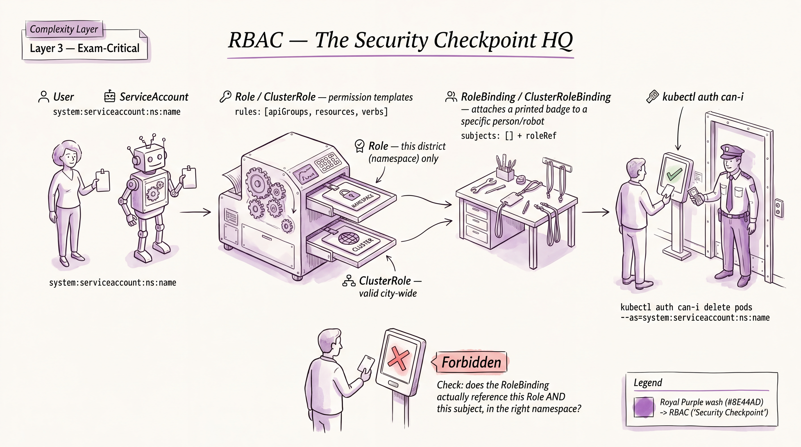
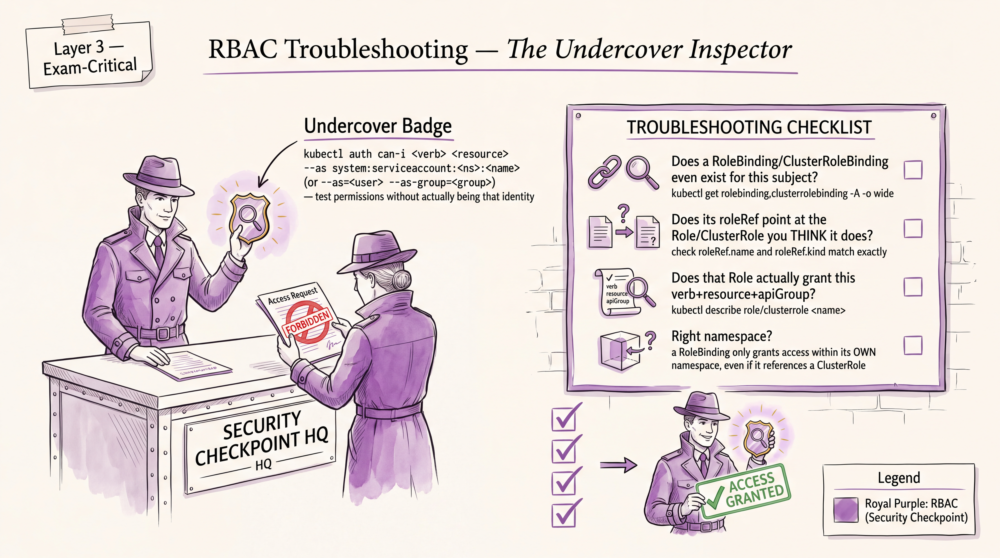

# RBAC — CKA Study Notes




**Priority: P0** (Cluster Architecture, Installation & Configuration — 25% domain; also directly feeds Troubleshooting — 30% domain, since "why is my ServiceAccount/Pod getting Forbidden" is a classic diagnosis task). Target cluster version: v1.35 (re-verify against v1.36 close to booking per `01-exam-snapshot-and-priorities.md`). RBAC API is `rbac.authorization.k8s.io/v1` and has been stable for many releases — no version-skew concerns here.

You already know the *concept* of RBAC cold from CKAD-adjacent security context work and general cloud IAM experience (11+ years across GCP/AWS/Azure IAM makes the mental model trivial: principal → binding → role → permissions). What's rusty is exact object wiring, `kubectl` imperative shortcuts, impersonation flags, and reading `Forbidden` errors fast under time pressure. This file assumes that fluency and skips IAM-101 explanation.

---

## Part A — Rapid Knowledge Refresh

### A1. ServiceAccounts

#### Concept
A ServiceAccount (SA) is a non-human identity for processes running inside the cluster (Pods, controllers, CI pipelines calling the API). Every namespace gets a `default` SA automatically. Since v1.24, tokens are **not** auto-created as long-lived Secrets anymore — they're issued on-demand as time-bound, audience-bound projected volume tokens via the `TokenRequest` API, auto-mounted into the Pod at `/var/run/secrets/kubernetes.io/serviceaccount/token`. A Pod uses whatever SA is set in `spec.serviceAccountName` (defaults to `default` if unset). RBAC bindings target the SA as the subject, exactly like they'd target a User or Group.

#### Important objects
- `ServiceAccount` (core API, namespaced)
- Pod field `spec.serviceAccountName`
- Legacy: SA-associated long-lived token Secret (`kubectl create token` is the modern replacement — see below)

#### Important YAML fields
```yaml
apiVersion: v1
kind: ServiceAccount
metadata:
  name: build-bot
  namespace: ci
automountServiceAccountToken: false   # set false to opt a Pod/SA out of auto-mounting
```
Pod side:
```yaml
spec:
  serviceAccountName: build-bot
  automountServiceAccountToken: true   # can override at Pod level too
```

#### Important commands
```bash
k create serviceaccount build-bot -n ci
k create sa build-bot -n ci                       # short form
k get sa -n ci
k describe sa build-bot -n ci
k create token build-bot -n ci --duration=1h       # on-demand token (modern way)
k create token build-bot -n ci                     # default duration ~1h
```

#### How to verify
```bash
k get pod mypod -n ci -o jsonpath='{.spec.serviceAccountName}'
k exec mypod -n ci -- cat /var/run/secrets/kubernetes.io/serviceaccount/token
k auth can-i --list --as=system:serviceaccount:ci:build-bot
```

#### Common exam mistake
Forgetting the `system:serviceaccount:<namespace>:<name>` fully-qualified name format when referencing an SA as a subject in a binding, or when using `--as`. Also forgetting SAs are namespaced — a RoleBinding subject SA must include its own namespace explicitly (the SA's namespace, not necessarily the binding's namespace, if cross-namespace).

#### Mini exercise
Create SA `build-bot` in namespace `ci`, mint a 30-minute token for it, and confirm via `k auth can-i get pods --as=system:serviceaccount:ci:build-bot -n ci` that it currently has no permissions (expect `no`).

---

### A2. Roles and RoleBindings

#### Concept
A `Role` is a namespaced allow-list of API verbs on resources (never deny rules — RBAC is purely additive). A `RoleBinding` grants a Role's permissions to one or more subjects (User, Group, or ServiceAccount), scoped to the RoleBinding's own namespace. A RoleBinding can also reference a `ClusterRole` (not just a `Role`) — this is a common pattern to reuse a cluster-wide-defined permission set but grant it only within one namespace, avoiding duplicating rule sets per namespace.

#### Important objects
- `Role` (namespaced)
- `RoleBinding` (namespaced) — `roleRef` + `subjects[]`

#### Important YAML fields
```yaml
apiVersion: rbac.authorization.k8s.io/v1
kind: Role
metadata:
  namespace: ci
  name: pod-reader
rules:
- apiGroups: [""]              # "" = core API group
  resources: ["pods"]
  verbs: ["get", "list", "watch"]
- apiGroups: [""]
  resources: ["pods/log"]      # subresources need explicit listing
  verbs: ["get"]
---
apiVersion: rbac.authorization.k8s.io/v1
kind: RoleBinding
metadata:
  name: build-bot-pod-reader
  namespace: ci
subjects:
- kind: ServiceAccount
  name: build-bot
  namespace: ci
roleRef:
  kind: Role                   # or ClusterRole
  name: pod-reader
  apiGroup: rbac.authorization.k8s.io
```

#### Important commands
```bash
k create role pod-reader -n ci --verb=get,list,watch --resource=pods
k create rolebinding build-bot-pod-reader -n ci --role=pod-reader --serviceaccount=ci:build-bot
k get role,rolebinding -n ci
k describe role pod-reader -n ci
```

#### How to verify
```bash
k auth can-i get pods --as=system:serviceaccount:ci:build-bot -n ci      # yes
k auth can-i delete pods --as=system:serviceaccount:ci:build-bot -n ci   # no
```

#### Common exam mistake
`roleRef` is **immutable** — you cannot `k edit` a RoleBinding to point at a different Role/ClusterRole; you must delete and recreate it. Also: subresources (`pods/log`, `pods/exec`) are separate resource strings, not covered by granting `pods` alone.

#### Mini exercise
Give `build-bot` `get`/`list` on `pods` and `get` on `pods/log` in namespace `ci`, using one Role and one RoleBinding. Verify `k auth can-i get pods/log --as=system:serviceaccount:ci:build-bot -n ci` returns `yes`.

---

### A3. ClusterRoles and ClusterRoleBindings

#### Concept
A `ClusterRole` is the same rule structure as a `Role` but is non-namespaced — it can grant permissions on cluster-scoped resources (nodes, PVs, namespaces themselves) and on non-resource URLs (e.g. `/healthz`), and it can be bound either cluster-wide (via `ClusterRoleBinding`) or namespace-scoped (via a `RoleBinding` that references it, per A2). A `ClusterRoleBinding` grants permissions across **all** namespaces — use it deliberately, it's the single easiest way to over-grant permissions on the exam and in real life. Kubernetes ships default ClusterRoles worth recognizing: `cluster-admin`, `admin`, `edit`, `view`.

#### Important objects
- `ClusterRole` (cluster-scoped)
- `ClusterRoleBinding` (cluster-scoped)
- Built-in aggregated ClusterRoles: `cluster-admin`, `admin`, `edit`, `view`

#### Important YAML fields
```yaml
apiVersion: rbac.authorization.k8s.io/v1
kind: ClusterRole
metadata:
  name: node-reader
rules:
- apiGroups: [""]
  resources: ["nodes"]
  verbs: ["get", "list", "watch"]
- nonResourceURLs: ["/healthz", "/healthz/*"]
  verbs: ["get"]
---
apiVersion: rbac.authorization.k8s.io/v1
kind: ClusterRoleBinding
metadata:
  name: build-bot-node-reader
subjects:
- kind: ServiceAccount
  name: build-bot
  namespace: ci
roleRef:
  kind: ClusterRole
  name: node-reader
  apiGroup: rbac.authorization.k8s.io
```

#### Important commands
```bash
k create clusterrole node-reader --verb=get,list,watch --resource=nodes
k create clusterrolebinding build-bot-node-reader --clusterrole=node-reader --serviceaccount=ci:build-bot
k get clusterrole,clusterrolebinding | grep node-reader
k describe clusterrole view       # inspect a built-in default for reference
```

#### How to verify
```bash
k auth can-i get nodes --as=system:serviceaccount:ci:build-bot
k auth can-i '*' '*' --as=system:serviceaccount:ci:build-bot   # sanity check it's NOT cluster-admin
```

#### Common exam mistake
Reaching for `ClusterRoleBinding` + `cluster-admin` as a lazy fix when a task actually wants namespace-scoped access via `RoleBinding` referencing a `ClusterRole` — graders on real tasks check for least-privilege intent, and it's also just slower to type correctly under pressure than it looks.

#### Mini exercise
Create ClusterRole `node-reader` (get/list/watch on `nodes`), bind it to `build-bot` cluster-wide, then separately grant `build-bot` the built-in `view` ClusterRole but **only** in namespace `ci` via a RoleBinding (not a ClusterRoleBinding). Verify `view` access doesn't leak into another namespace.

---

### A4. `kubectl auth can-i`

#### Concept
`kubectl auth can-i` is the fast RBAC self-check tool — it evaluates whether the acting identity (you, or an impersonated identity via `--as`) can perform a verb on a resource, without actually performing it. It queries the `SelfSubjectAccessReview` / `SubjectAccessReview` API under the hood. This is your primary verification and debugging tool for every RBAC task — use it constantly rather than trial-and-error with real requests.

#### Important objects
- `SelfSubjectAccessReview`, `SubjectAccessReview`, `SelfSubjectRulesReview` (the APIs `can-i` calls)

#### Important YAML fields
N/A — this is purely a CLI/API check, not something you author YAML for on the exam.

#### Important commands
```bash
k auth can-i create deployments -n dev
k auth can-i delete pods --as=jane -n dev
k auth can-i get pods --as=system:serviceaccount:ci:build-bot -n ci
k auth can-i get pods --as=jane --as-group=developers -n dev
k auth can-i --list                         # list everything I can do
k auth can-i --list --as=system:serviceaccount:ci:build-bot -n ci
k auth can-i get pods --subresource=log -n dev
```

#### How to verify
The command's own `yes`/`no` output *is* the verification — but double-check namespace flag placement (`-n`) since a missing `-n` silently checks the current/default namespace context, which is a frequent false result under time pressure.

#### Common exam mistake
Running `can-i` without `-n <namespace>` when checking namespaced resources and getting a misleading answer because it silently used the wrong (current-context) namespace. Also forgetting `--subresource=log` / `--subresource=exec` when the actual task cares about `pods/log` or `pods/exec` specifically — plain `get pods` won't reflect subresource permissions.

#### Mini exercise
Without creating any bindings, run `k auth can-i '*' '*' -A` as yourself to confirm you're currently cluster-admin (typical for exam terminal), then check the same for `system:serviceaccount:ci:build-bot` and confirm it's far more restricted.

---

### A5. Impersonation

#### Concept
`--as` (and `--as-group`, `--as-uid` since newer versions) lets an identity with sufficient rights act *as* another user/group/SA for a single request — used heavily for testing "what can this other identity actually do" without switching kubeconfigs or contexts. Impersonation itself requires RBAC permission: the `impersonate` verb on resources `users`, `groups`, `serviceaccounts` in the **core** (`""`) API group, and on `uids` in the `authentication.k8s.io` API group (see the YAML below — `uids` is the one that lives in a different group). By default, cluster-admin (and the exam terminal's default identity) already has blanket impersonate rights, so on the exam you'll mostly just *use* `--as`, but you should recognize how to *grant* it too since that's occasionally the actual task.

#### Important objects
- No new object kind — it's a Role/ClusterRole rule targeting the `impersonate` verb.

#### Important YAML fields
```yaml
apiVersion: rbac.authorization.k8s.io/v1
kind: ClusterRole
metadata:
  name: impersonator
rules:
- apiGroups: [""]
  resources: ["users", "groups", "serviceaccounts"]
  verbs: ["impersonate"]
- apiGroups: ["authentication.k8s.io"]
  resources: ["uids"]
  verbs: ["impersonate"]
```

#### Important commands
```bash
k get pods --as=jane -n dev
k get pods --as=system:serviceaccount:ci:build-bot -n ci
k auth can-i get pods --as=jane --as-group=system:authenticated -n dev
k get pods --as=jane --as-uid=1234-5678
```

#### How to verify
```bash
k auth can-i impersonate users --as=<the-granted-identity>
# Then confirm the impersonated action itself:
k get pods --as=jane -n dev
```

#### Common exam mistake
Assuming `--as-group` alone implies a user identity — you often need `--as` (user) *and* `--as-group` together to accurately reproduce a real user's group memberships, since `can-i`/impersonation doesn't automatically infer group membership from cluster state (there's no real "user database" in Kubernetes — identity comes entirely from the authenticator, e.g., cert CN/O fields).

#### Mini exercise
Grant a ClusterRole permitting `impersonate` on `users` to SA `build-bot`, then, if you had a kubeconfig authenticated as `build-bot`, predict (without running it) whether `k get pods --as=jane` would succeed at the impersonation step vs. fail at the `jane`-has-no-pod-permissions step — articulate the two-layer check (impersonate-the-identity vs. the-identity's-own-permissions) out loud, since this distinction is a classic verbal/practical trap.

---

### A6. Permissions troubleshooting

#### Concept
This is where RBAC crosses into the Troubleshooting domain (30%). A `Forbidden` API error always names the offending identity, verb, resource, and namespace verbatim — read it literally instead of guessing. The systematic path: (1) identify the acting identity (which SA is the Pod using? which user is the kubeconfig context using?), (2) `can-i` check that identity against the exact verb/resource/namespace/subresource from the error, (3) find the binding(s) that should grant it — or don't — via `k describe rolebinding/clusterrolebinding`, (4) fix the rule, subject, or `roleRef` as needed, remembering `roleRef` is immutable (delete+recreate the binding, don't try to patch it).

#### Important objects
Same objects as above — troubleshooting is about *reading* Role/RoleBinding/ClusterRole/ClusterRoleBinding state, not new object types.

#### Important YAML fields
No new fields — but pay attention to `subjects[].namespace` (easy to get wrong for cross-namespace SA references) and `apiGroups: [""]` vs a named group (a very common typo source — e.g. Deployments are in `apps`, not `""`).

#### Important commands
```bash
# 1. Identify identity in use
k get pod mypod -n dev -o jsonpath='{.spec.serviceAccountName}'
kubectl config view --minify -o jsonpath='{.contexts[0].context.user}'

# 2. Reproduce the check
k auth can-i <verb> <resource> --as=<identity> -n <namespace> --subresource=<sub>

# 3. Find what's bound to that identity
k get rolebindings,clusterrolebindings -A -o json | \
  jq '.items[] | select(.subjects[]?.name=="build-bot")'
# or without jq:
k get rolebindings -A -o wide
k describe rolebinding <name> -n <namespace>

# 4. Inspect the referenced Role/ClusterRole's actual rules
k describe role <name> -n <namespace>
k describe clusterrole <name>

# 5. API server audit-style confirmation (if accessible)
k logs -n kube-system <apiserver-or-controller-pod>   # look for Forbidden lines
```

#### How to verify
Re-run the exact `can-i` check that matches the original error's verb/resource/subresource/namespace and confirm it flips to `yes`; then re-run the actual failing operation (e.g., re-trigger the Pod, re-run the client call) to confirm the real symptom is gone, not just the synthetic check.

#### Common exam mistake
Fixing the wrong layer — e.g., adding a rule to a `ClusterRole` that's never actually referenced by any binding for that identity, or fixing a `Role` in the wrong namespace when the Pod/SA lives in a different one. Also: assuming a `Forbidden` is RBAC when it's actually a Pod Security Admission or NetworkPolicy/webhook denial — read the error's reason field carefully; RBAC denials say `"forbidden: User \"X\" cannot Y resource \"Z\""` specifically, not just any 403-shaped error.

#### Mini exercise
Deliberately create a Role granting `get` on `pods` but bind it via a RoleBinding whose `subjects[].namespace` points at the wrong namespace for the SA. Observe `can-i` returning `no`, locate the mismatch via `describe rolebinding`, fix it, and re-verify.

---

## Part B — Task Patterns

### B1. Grant a ServiceAccount namespace-scoped access

#### Skill tested
Wiring SA → Role → RoleBinding correctly and fast, using imperative commands over hand-written YAML.

#### What the task usually looks like
"Create a ServiceAccount named `X` in namespace `Y`. Grant it permission to `list`/`get`/`watch` `Z` resources in that namespace only. Do not grant any other permissions."

#### Commands I need
```bash
k create sa X -n Y
k create role X-role -n Y --verb=get,list,watch --resource=Z
k create rolebinding X-binding -n Y --role=X-role --serviceaccount=Y:X
```

#### Files/directories commonly involved
None required — fully doable imperatively. If YAML is explicitly requested, generate with `--dry-run=client -o yaml > file.yaml` then `k apply -f`.

#### Kubernetes documentation page worth knowing
`kubernetes.io/docs/reference/access-authn-authz/rbac/` — has copy-pasteable Role/RoleBinding examples; bookmark the exact anchor mentally since exam search is in-page only.

#### Common mistakes
- Granting via `ClusterRoleBinding` when only namespace scope was asked for (over-grants, likely graded wrong).
- Wrong `--serviceaccount=<namespace>:<name>` format (must include namespace, colon-separated, no `system:serviceaccount:` prefix needed in this specific flag — that full form is only for `--as` / YAML subject references).
- Forgetting the negative constraint ("no other permissions") — leaving the SA's Pod also implicitly inheriting `default` SA permissions if `serviceAccountName` wasn't actually set on the target Pod.

#### Fastest solution strategy
One-liners, no YAML files, in the order: create SA → create role → create rolebinding → `can-i` verify. Total should be under a minute of typing once memorized.

#### Typical troubleshooting variation
"Pod `P` in namespace `Y` is failing with Forbidden errors trying to list `Z` — fix it." Requires you to first find which SA the Pod uses, then apply the same fix pattern.

#### Estimated time target
3–4 minutes for the straightforward creation variant; 5–6 minutes for the troubleshooting variant (extra time for diagnosis).

#### Original practice task
All original — not sourced from any exam dump.

**Solve:**
Create namespace `logging`. Create ServiceAccount `log-shipper` in it. Grant `log-shipper` `get`/`list`/`watch` on `pods` and `get` on `pods/log`, scoped only to `logging`. Confirm it cannot list pods in `default`.
```bash
k create ns logging
k create sa log-shipper -n logging
k create role log-reader -n logging --verb=get,list,watch --resource=pods --dry-run=client -o yaml > role.yaml
# add pods/log rule manually since --resource can't add subresources imperatively for a second rule in one command:
cat <<'EOF' >> role.yaml
- apiGroups: [""]
  resources: ["pods/log"]
  verbs: ["get"]
EOF
k apply -f role.yaml
k create rolebinding log-reader-binding -n logging --role=log-reader --serviceaccount=logging:log-shipper
```

**Verify:**
```bash
k auth can-i get pods --as=system:serviceaccount:logging:log-shipper -n logging        # yes
k auth can-i get pods --subresource=log --as=system:serviceaccount:logging:log-shipper -n logging  # yes
k auth can-i list pods --as=system:serviceaccount:logging:log-shipper -n default       # no
```

#### Hard-mode version
Same task, but also require `log-shipper` be usable from a Pod running in namespace `apps` (cross-namespace SA reference in a RoleBinding subject) targeting a Role in `logging` — forces you to get `subjects[].namespace` exactly right and confront the fact that a `Role` can only be bound within its own namespace, so you must decide whether to convert `log-reader` into a `ClusterRole` referenced by a `RoleBinding` in `logging`, or accept that RoleBindings can reference remote-namespace subjects but never a remote-namespace Role.

---

### B2. Grant cluster-wide read access via ClusterRole + ClusterRoleBinding

#### Skill tested
Correctly distinguishing when a task genuinely needs cluster scope (cluster-scoped resources like `nodes`, `namespaces`, `persistentvolumes`, or "across all namespaces" wording) vs. when it's a namespace task in disguise.

#### What the task usually looks like
"Create a ClusterRole `X` allowing `get`/`list` on `nodes` and `persistentvolumes`. Bind it to user/group/SA `Y` cluster-wide."

#### Commands I need
```bash
k create clusterrole X --verb=get,list --resource=nodes,persistentvolumes
k create clusterrolebinding X-binding --clusterrole=X --user=Y
# or --group=Y or --serviceaccount=ns:Y
```

#### Files/directories commonly involved
None required imperatively; YAML only if the task explicitly demands a manifest artifact left in the cluster/repo.

#### Kubernetes documentation page worth knowing
Same RBAC reference page — specifically the "ClusterRole example" and "Referring to resources" sections (subresources, resource names, non-resource URLs).

#### Common mistakes
- Using `--resource=nodes` when the task means `node` metrics or `nodes/status` — read the exact resource name in the task.
- Binding with `--user=` when the task means a Group (`--group=`) — these silently create a binding to a nonexistent-looking identity that never errors at creation time (RBAC doesn't validate that a User/Group "exists" — there's no User object), which makes mistakes here invisible until you `can-i` check.

#### Fastest solution strategy
Imperative `create clusterrole` + `create clusterrolebinding`, then always `can-i` verify with the exact subject flag matching how the task described the identity (user vs. group vs. SA).

#### Typical troubleshooting variation
"User `jane` reports she cannot list PVs cluster-wide despite being told she has access — find and fix the misconfiguration." Usually a wrong `roleRef.kind` (pointing at a `Role` that doesn't exist / has no cluster scope) or a typo in the subject name/kind.

#### Estimated time target
3 minutes creation; 5 minutes troubleshooting variant.

#### Original practice task

**Solve:**
Create ClusterRole `pv-viewer` allowing `get`/`list`/`watch` on `persistentvolumes` and `storageclasses`. Bind it cluster-wide to group `storage-admins`.
```bash
k create clusterrole pv-viewer --verb=get,list,watch --resource=persistentvolumes,storageclasses
k create clusterrolebinding pv-viewer-binding --clusterrole=pv-viewer --group=storage-admins
```

**Verify:**
```bash
k auth can-i list persistentvolumes --as=jane --as-group=storage-admins   # yes
k auth can-i list persistentvolumes --as=jane                             # no (group missing)
k auth can-i delete persistentvolumes --as=jane --as-group=storage-admins # no (verb not granted)
```

#### Hard-mode version
Add a requirement that members of `storage-admins` can view PVs and StorageClasses cluster-wide, but can only view (not list/watch) Secrets, and only inside namespace `storage-ops` — forces combining one ClusterRoleBinding (cluster scope) with one separate RoleBinding-to-ClusterRole (namespace-scoped reuse pattern from A2), correctly split by resource scope.

---

### B3. Diagnose and fix a Forbidden error (RBAC troubleshooting)

#### Skill tested
The full diagnostic loop from A6 under time pressure — this is the pattern most likely to show up as a "something is broken, fix it" Troubleshooting-domain task rather than a build-from-scratch task.

#### What the task usually looks like
A Deployment/CronJob/controller Pod is crash-looping or logging `Forbidden` API errors. Task says: "Application in namespace `X` cannot [do something]. Without changing the application code, fix the cluster configuration so it can."

#### Commands I need
```bash
k logs <pod> -n X                                    # read the literal Forbidden message
k get pod <pod> -n X -o jsonpath='{.spec.serviceAccountName}'
k auth can-i <verb> <resource> --as=system:serviceaccount:X:<sa> -n X
k get rolebindings,clusterrolebindings -A -o wide
k describe rolebinding <name> -n X
k describe role <name> -n X
k edit role <name> -n X            # fix rules (rules ARE mutable, unlike roleRef)
k delete rolebinding <name> -n X && k create rolebinding ...   # if roleRef itself is wrong
```

#### Files/directories commonly involved
None fixed — whatever the live cluster state already has. No manifest files to hunt for; this is a live-object diagnosis task.

#### Kubernetes documentation page worth knowing
`kubernetes.io/docs/reference/access-authn-authz/rbac/#troubleshooting` — literally has a "Troubleshooting" subsection worth knowing by name, plus `kubernetes.io/docs/reference/access-authn-authz/authorization/#checking-api-access` for `can-i` mechanics.

#### Common mistakes
- Assuming the error is RBAC when it's an Admission control or NetworkPolicy denial (different failure signature — re-read A6's note on this).
- Editing the Role but not noticing the binding references a *different* Role entirely, or edits a same-named Role in the wrong namespace.
- Overcorrecting: adding `verbs: ["*"]` or resources `["*"]` when the task wants the specific minimal verb — least-privilege intent may be graded.

#### Fastest solution strategy
Never guess — always extract the exact `verb`/`resource`(`/subresource`)/`namespace` from the literal error text, run one targeted `can-i`, then go straight to `describe` on any binding matching that subject. Fix the smallest possible thing (usually one missing verb or one wrong `roleRef.name`).

#### Typical troubleshooting variation
The binding's `roleRef` is correct but the underlying Role is missing a subresource (`pods/exec`, `pods/log`, `deployments/scale`) rather than missing the whole resource — a subtler variant that a naive `can-i get pods` check will miss.

#### Estimated time target
5–7 minutes (this domain rewards fast pattern recognition; budget matches the exam's ~7 min/task average called out in the snapshot file).

#### Original practice task

**Solve:**
Setup (pretend this is pre-existing broken state you're handed):
```bash
k create ns app1
k create sa metrics-reader -n app1
k create role pod-viewer -n app1 --verb=get --resource=pods   # missing "list"/"watch" on purpose
k create rolebinding pod-viewer-binding -n app1 --role=pod-viewer --serviceaccount=app1:metrics-reader
```
Task: "A monitoring agent using SA `metrics-reader` in namespace `app1` needs to `list` and `watch` Pods (not just `get`) — fix it without recreating the SA or binding."
```bash
k auth can-i list pods --as=system:serviceaccount:app1:metrics-reader -n app1   # confirm: no
k edit role pod-viewer -n app1
# change verbs: ["get"] to verbs: ["get", "list", "watch"]
```

**Verify:**
```bash
k auth can-i list pods --as=system:serviceaccount:app1:metrics-reader -n app1    # yes
k auth can-i watch pods --as=system:serviceaccount:app1:metrics-reader -n app1   # yes
k auth can-i delete pods --as=system:serviceaccount:app1:metrics-reader -n app1  # no (unchanged, good — least privilege intact)
```

#### Hard-mode version
Same starting complaint, but the actual root cause is a decoy: the Role has correct verbs, but the RoleBinding's `subjects[].namespace` was set to `app2` instead of `app1` for the SA reference (a binding can reference an SA from a *different* namespace than the binding itself lives in — the SA is looked up in the namespace stated in `subjects[].namespace`, not the RoleBinding's own namespace). You must notice `roleRef` and `rules` both look fine and realize the subject itself is misdirected, then delete+recreate the RoleBinding (since `subjects` is mutable via `edit`, but practice recognizing which fields are/aren't — `roleRef` is the immutable one, `subjects` can actually be edited in place).
