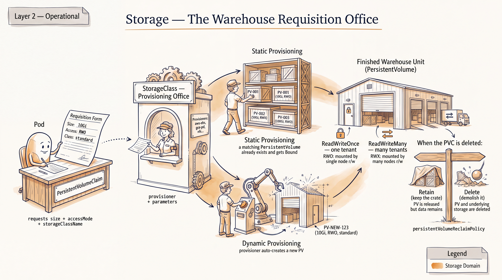
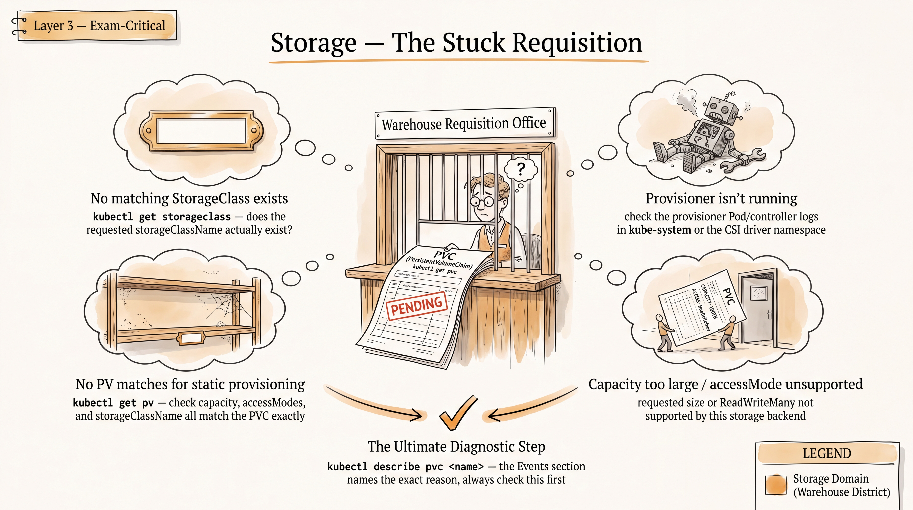

# CKA Topic: Storage (Official Weight 10% — smallest domain)




*Scope note (from `01-exam-snapshot-and-priorities.md`): Storage is rated **P2 / Occasional / Low difficulty & failure-risk** for you specifically — heavy overlap with things you already touch conceptually, the genuinely new CKA-specific piece is the **admin side** (StorageClass, provisioner wiring, reclaim policy, static provisioning) rather than the app-dev side (mounting a volume into a Pod, which you already have cold from CKAD). Depth below is deliberately calibrated to a 10%-weight domain: solid and exam-correct, not exhaustive. All YAML/commands verified against the v1.35-era stable storage API (`storage.k8s.io/v1`, core `v1` for PV/PVC) — nothing here relies on alpha/beta fields.*

---

# Part A — Rapid Knowledge Refresh

## PersistentVolume (PV)

### Concept
A PV is a cluster-scoped storage resource, provisioned either by an admin ahead of time (static) or by a provisioner on demand (dynamic). It has a lifecycle independent of any Pod — it exists whether or not something is currently consuming it. A PV binds 1:1 to a single PVC (whichever PVC's request it satisfies first, subject to matching access mode, size, storage class, and any selector/label constraints). PVs are not namespaced; PVCs are. The `persistentVolumeReclaimPolicy` on the PV decides what happens to the underlying storage once its bound PVC is deleted.

### Important objects
`PersistentVolume` (cluster-scoped), and whatever backing volume plugin it wraps (`hostPath` for exam/lab convenience, `nfs`, CSI driver types like `csi`).

### Important YAML fields
```yaml
apiVersion: v1
kind: PersistentVolume
metadata:
  name: pv-static-01
spec:
  capacity:
    storage: 1Gi
  volumeMode: Filesystem        # or Block
  accessModes:
    - ReadWriteOnce
  persistentVolumeReclaimPolicy: Retain   # Retain | Delete | Recycle (deprecated)
  storageClassName: manual       # "" (empty string) explicitly means "no class"
  hostPath:
    path: /mnt/data/pv-static-01
```

### Important commands
```bash
k get pv                         # CLAIM, STORAGECLASS, RECLAIM POLICY, STATUS are already default columns — -o wide adds nothing for PVs
k describe pv pv-static-01
k get pv pv-static-01 -o yaml
```

### How to verify
`k get pv` → `STATUS` column: `Available` (unbound, ready), `Bound` (claimed), `Released` (claim deleted but not reclaimed, only relevant with `Retain`), `Failed`. Confirm `CLAIM` column shows `<namespace>/<pvc-name>` once bound.

### Common exam mistake
Forgetting `storageClassName` must match on both sides for static binding to work as intended — a PVC with no `storageClassName` set will match a PV with no class (or the cluster default class, if one exists) via the default-StorageClass admission controller, which silently breaks a "bind to *this specific* PV" static-provisioning task. Always set `storageClassName` explicitly on both the PV and PVC when doing static provisioning, and set it to `""` on the PVC if you deliberately want to opt out of any default class.

### Mini exercise
Create a PV backed by `hostPath: /mnt/data/exam` with capacity `500Mi`, `accessModes: [ReadWriteOnce]`, `persistentVolumeReclaimPolicy: Retain`, `storageClassName: manual`. Confirm it shows `Available`.

---

## PersistentVolumeClaim (PVC)

### Concept
A PVC is a namespaced *request* for storage made by a user/Pod author — "I need X GiB, this access mode, optionally this StorageClass." The control plane (or the dynamic provisioner, if a StorageClass with a provisioner is referenced) finds or creates a PV satisfying the request and binds them together. Once bound, the binding is exclusive and sticky — that PV won't go to any other PVC even if it later frees up, until the binding is explicitly broken.

### Important objects
`PersistentVolumeClaim` (namespaced).

### Important YAML fields
```yaml
apiVersion: v1
kind: PersistentVolumeClaim
metadata:
  name: pvc-static-01
  namespace: default
spec:
  accessModes:
    - ReadWriteOnce
  volumeMode: Filesystem
  resources:
    requests:
      storage: 500Mi
  storageClassName: manual        # omit entirely to use cluster default class
```

### Important commands
```bash
k get pvc -A
k describe pvc pvc-static-01
k get pvc pvc-static-01 -o jsonpath='{.status.phase}'
```

### How to verify
`k get pvc` → `STATUS` must read `Bound`, and `VOLUME` column must show the PV name you expect. `Pending` means no matching PV was found (static) or provisioning is failing (dynamic) — go straight to the troubleshooting pattern in Part B.

### Common exam mistake
Requesting a size larger than any available PV's capacity, or an access mode the PV doesn't advertise (e.g., PVC asks `ReadWriteMany` against a PV that only offers `ReadWriteOnce`) — the PVC just sits `Pending` with no obviously loud error unless you `describe` it and read the Events.

### Mini exercise
Write a PVC requesting `200Mi`, `ReadWriteOnce`, `storageClassName: manual`, and confirm it binds to the PV from the previous exercise (not some other PV that might also match).

---

## StorageClass & Dynamic Provisioning

### Concept
A StorageClass is the admin-defined "recipe" for dynamic provisioning: it names a `provisioner` (a CSI driver or legacy in-tree plugin string) and parameters that provisioner understands. When a PVC references a StorageClass (or none, and a default exists), the provisioner creates a brand-new PV on the fly to satisfy it — no admin has to pre-create anything. Exactly one StorageClass in a cluster should carry the `storageclass.kubernetes.io/is-default-class: "true"` annotation; if a PVC's `storageClassName` field is left unset, the default class (if any) is used automatically.

### Important objects
`StorageClass` (cluster-scoped, in `storage.k8s.io/v1`).

### Important YAML fields
```yaml
apiVersion: storage.k8s.io/v1
kind: StorageClass
metadata:
  name: fast
  annotations:
    storageclass.kubernetes.io/is-default-class: "true"
provisioner: rancher.io/local-path   # real dynamic provisioner (external, non-CSI) — common default on kind/minikube. kubernetes.io/no-provisioner is a different, non-dynamic special case: it never creates PVs on its own, it just pairs WaitForFirstConsumer with manually pre-created local PVs
reclaimPolicy: Delete            # default if omitted
volumeBindingMode: WaitForFirstConsumer   # or Immediate (default)
allowVolumeExpansion: true
```

### Important commands
```bash
k get storageclass          # or: k get sc — PROVISIONER, RECLAIMPOLICY, VOLUMEBINDINGMODE, ALLOWVOLUMEEXPANSION are already default columns, -o wide adds nothing here
k describe sc fast
k patch storageclass <old-default> -p '{"metadata":{"annotations":{"storageclass.kubernetes.io/is-default-class":"false"}}}'
```

### How to verify
`k get sc` — exactly one class should show `(default)` next to its name. `k get pv` after a PVC referencing that class is created — a new PV should appear automatically (name usually `pvc-<uuid>`) if provisioning succeeded.

### Common exam mistake
Having **two** StorageClasses both annotated as default (or forgetting to un-default the old one before setting a new default) — this makes default-class selection ambiguous and PVCs that omit `storageClassName` may behave unpredictably. Also: `volumeBindingMode: WaitForFirstConsumer` means the PV isn't actually provisioned until a Pod using the PVC is scheduled — a PVC can look `Pending` for a while and that's *expected*, not a bug, until a consuming Pod exists.

### Mini exercise
`k get sc` on your practice cluster, identify the provisioner in use (commonly `rancher.io/local-path` on kind/minikube-style local clusters), create a PVC with no `storageClassName` set, and confirm it dynamically provisions and binds without you creating a PV by hand.

---

## Access Modes

### Concept
Access modes describe how many nodes can mount the volume, and in what mode, simultaneously. They are a *contract advertised by the PV/provisioner*, not something Kubernetes enforces at the filesystem level — the backing storage technology has to actually support the mode for it to mean anything (e.g., `hostPath` can only meaningfully do `ReadWriteOnce`; NFS can do `ReadWriteMany`). A PVC's requested access mode must be a subset of what the bound PV offers.

### Important objects
N/A (a field on both `PersistentVolume.spec.accessModes` and `PersistentVolumeClaim.spec.accessModes`).

### Important YAML fields
- `ReadWriteOnce` (RWO) — read-write by a single node (as of recent Kubernetes, this is enforced *per node*, not strictly per Pod — multiple Pods on the same node can share it).
- `ReadOnlyMany` (ROX) — read-only by many nodes.
- `ReadWriteMany` (RWX) — read-write by many nodes (needs a backend that supports it: NFS, many CSI drivers — not `hostPath`, not most block storage).
- `ReadWriteOncePod` (RWOP) — read-write by exactly one Pod cluster-wide (stricter than RWO; useful when you must guarantee single-writer at the Pod level, not just the node level).

### Important commands
```bash
k get pv -o custom-columns=NAME:.metadata.name,ACCESS:.spec.accessModes
```

### How to verify
`k describe pvc <name>` — check the `Access Modes` line matches what you intended, and cross-check against `k describe pv <bound-pv>` to confirm the PV actually advertises it.

### Common exam mistake
Assuming RWX works with `hostPath` or default local-path provisioners — it doesn't, and a Pod-scheduling task that implicitly needs multi-node read-write access will fail confusingly (Pods stuck `Pending` or scheduled to the wrong node) if the underlying storage class/backend can't actually do RWX.

### Mini exercise
Try requesting `ReadWriteMany` against a `hostPath`-backed PV and confirm the PVC stays `Pending` — read the Events in `k describe pvc` to see exactly how Kubernetes reports the mismatch.

---

## Reclaim Policy

### Concept
`persistentVolumeReclaimPolicy` on the PV governs what happens to the PV (and, for `Delete`, the underlying storage) once its bound PVC is deleted. `Retain` keeps the PV (now `Released`, not reusable by a new PVC until an admin manually clears `claimRef` and/or cleans data) — safest for data you can't lose. `Delete` removes both the PV object and (for dynamically-provisioned volumes) the backing storage — this is the default for dynamically provisioned volumes. `Recycle` is deprecated and should not be used or mentioned as current practice.

### Important objects
N/A (field on `PersistentVolume.spec`).

### Important YAML fields
```yaml
spec:
  persistentVolumeReclaimPolicy: Retain   # Retain | Delete
```

### Important commands
```bash
k patch pv <pv-name> -p '{"spec":{"persistentVolumeReclaimPolicy":"Retain"}}'
k get pv <pv-name> -o jsonpath='{.spec.persistentVolumeReclaimPolicy}'
```

### How to verify
Delete the PVC, then immediately `k get pv` — a `Retain` PV shows `STATUS: Released` and `CLAIM` still shows the old (now-nonexistent) claim reference; it will not auto-bind to a new matching PVC until you manually clear `spec.claimRef` on the PV.

### Common exam mistake
Forgetting that a `Released` PV (under `Retain`) is *not* automatically reusable — a task that expects "delete the PVC, recreate it, and it re-binds" will fail silently unless you manually null out `claimRef` on the PV first (`k patch pv <name> -p '{"spec":{"claimRef": null}}'` or edit it out).

### Mini exercise
Set an existing bound PV's reclaim policy to `Retain` via `kubectl patch` (not by recreating it — patching a live field is the realistic exam action), delete its PVC, confirm `Released` status, then clear `claimRef` and confirm a new PVC can bind to it.

---

## volumeMode

### Concept
`volumeMode` decides whether the PV/PVC is presented as a mounted filesystem (`Filesystem`, the default) or as a raw, unformatted block device (`Block`) exposed directly to the Pod via `volumeDevices` instead of `volumeMounts`. `Block` is a niche, advanced case (databases wanting raw device access) — low probability of deep exam coverage given Storage's 10% weight, but worth recognizing the field and knowing it must match between PV and PVC to bind.

### Important objects
N/A (field on both PV and PVC spec).

### Important YAML fields
```yaml
spec:
  volumeMode: Block   # Filesystem (default) | Block
```
Pod side, when `Block` is used:
```yaml
containers:
  - name: app
    volumeDevices:
      - name: data
        devicePath: /dev/xvda
```

### Important commands
```bash
k get pv -o jsonpath='{.items[*].spec.volumeMode}'
```

### How to verify
`k describe pv`/`pvc` — `Volume Mode` line. A `Filesystem`-mode PVC will never bind to a `Block`-mode PV and vice versa; mismatch shows as `Pending` with no obvious size/access-mode complaint, so check this field specifically if those look fine.

### Common exam mistake
Not realizing `volumeMode` mismatch is a distinct, separate binding-failure cause from access-mode or size mismatch — easy to overlook when troubleshooting a `Pending` PVC.

### Mini exercise
Just read one existing PV's and PVC's `volumeMode` with `-o jsonpath` to build the muscle memory of checking it during a Pending-PVC triage — no need to actually build a Block volume lab.

---

## Static vs. Dynamic Provisioning

### Concept
Static provisioning: an admin manually creates the PV object ahead of time, pointing at real backing storage; a PVC later comes along and binds to it. Dynamic provisioning: no PV exists yet — a PVC references a StorageClass with a real `provisioner`, and the provisioner's controller creates the PV (and, depending on the driver, the actual backing volume) automatically at claim time. Static is the "exam-lab-friendly, `hostPath`-backed" pattern; dynamic is what real clusters use in production and is more likely to appear as "here's a broken StorageClass/provisioner, fix it" troubleshooting rather than "build one from scratch."

### Important objects
Static: `PersistentVolume` + `PersistentVolumeClaim`. Dynamic: `StorageClass` + `PersistentVolumeClaim` (no manually-authored PV).

### Important YAML fields
Covered above under PV/PVC/StorageClass individually — the differentiator is simply whether a PV is hand-authored (static) or `storageClassName` + provisioner does the work (dynamic).

### Important commands
```bash
k get pv,pvc,sc -A          # quick full-picture triage view
k get events --sort-by=.lastTimestamp -A | grep -i provision
```

### How to verify
If you never ran `k apply -f <pv.yaml>` and a PV still exists bound to your PVC, it was dynamically provisioned — confirm via `k get pv <name> -o yaml` and check for a `pv.kubernetes.io/provisioned-by` annotation.

### Common exam mistake
Trying to statically pre-create a PV *and* also pointing the PVC at a class with an active provisioner — the provisioner may just dynamically create its own PV instead of using yours, leaving your hand-made PV sitting `Available` and unused, which looks like "my PVC didn't bind" when actually a different, unwanted PV bound instead.

### Mini exercise
Do both back to back on the same practice cluster: (1) static PV+PVC pair with `storageClassName: manual` (no provisioner attached to that class name), and (2) a PVC with no class referencing the cluster's real default StorageClass, and diff the resulting `k get pv` output to see the naming/annotation differences.

---

## Mounting PVCs into Pods

### Concept
This is the one full-overlap-with-CKAD sub-skill in this domain — a Pod (or a Pod template inside a Deployment/StatefulSet) references the PVC by name under `spec.volumes`, then mounts it into a container via `volumeMounts`. Nothing here is CKA-specific; it's included for completeness since Storage tasks often chain PV → PVC → Pod-mount as one end-to-end task.

### Important objects
`Pod` (or higher-level controller) referencing a `PersistentVolumeClaim` by name.

### Important YAML fields
```yaml
apiVersion: v1
kind: Pod
metadata:
  name: pvc-consumer
spec:
  containers:
    - name: app
      image: nginx
      volumeMounts:
        - name: data
          mountPath: /usr/share/nginx/html
  volumes:
    - name: data
      persistentVolumeClaim:
        claimName: pvc-static-01
```

### Important commands
```bash
k run pvc-consumer --image=nginx --dry-run=client -o yaml > pod.yaml   # then hand-add the volume block
k exec pvc-consumer -- df -h /usr/share/nginx/html
k describe pod pvc-consumer   # check Events for FailedMount / FailedAttachVolume
```

### How to verify
Pod reaches `Running`, `k exec ... -- touch /mountpath/testfile`, then delete the Pod and recreate it (or start a second Pod against the same PVC if RWX) and confirm the file persists.

### Common exam mistake
Referencing a PVC name that doesn't exist yet, or exists in a different namespace than the Pod (PVCs are namespaced — the Pod can only mount a PVC in its own namespace) — Pod sits in `Pending` with a `FailedScheduling`/`Unschedulable`-looking event that's actually a missing-PVC problem, not a scheduling problem per se.

### Mini exercise
Mount the `pvc-static-01` claim from earlier into an nginx Pod at `/usr/share/nginx/html`, write a file into it via `k exec`, delete the Pod, recreate an identically-spec'd Pod, and confirm the file is still there.

---

## Resizing a PVC

### Concept
If the PVC's StorageClass has `allowVolumeExpansion: true`, you can increase (never decrease) `spec.resources.requests.storage` on an existing PVC in place. For most CSI drivers this triggers expansion of the underlying volume; whether the *filesystem* inside also grows automatically without a Pod restart depends on the driver's online-expansion support — if not, the consuming Pod may need to be recreated for the filesystem resize to complete. This is a small, cheap, high-value thing to have memorized cold given the domain's low overall weight.

### Important objects
`StorageClass` (must have `allowVolumeExpansion: true`), `PersistentVolumeClaim`.

### Important YAML fields
```yaml
spec:
  resources:
    requests:
      storage: 2Gi   # increased from original 1Gi
```

### Important commands
```bash
k patch storageclass <name> -p '{"allowVolumeExpansion": true}'
k patch pvc <pvc-name> -p '{"spec":{"resources":{"requests":{"storage":"2Gi"}}}}'
k get pvc <pvc-name> -o jsonpath='{.status.capacity.storage}'
k describe pvc <pvc-name>   # look for Conditions: FileSystemResizePending
```

### How to verify
`k get pvc` — `CAPACITY` column reflects the new size once expansion completes; if `status.conditions` shows `FileSystemResizePending`, the block-level resize succeeded but the filesystem hasn't caught up yet — this often clears after the consuming Pod is deleted/recreated.

### Common exam mistake
Trying to shrink a PVC (unsupported — expansion is one-directional) or forgetting to set `allowVolumeExpansion: true` on the StorageClass first, which makes the `patch` on the PVC silently accepted by the API but never actually take effect on the backing volume.

### Mini exercise
Enable expansion on your practice cluster's default StorageClass, patch an existing bound PVC from its current size to a larger one, and watch `k get pvc -w` until `CAPACITY` updates.

---

# Part B — Task Patterns

## Pattern 1 — Static Provisioning End-to-End (PV → PVC → Pod)

### Skill tested
Whether you can wire together a hand-authored PV, a matching PVC, and a consuming Pod, getting access mode / capacity / storageClassName / reclaim policy all correct on the first pass, under time pressure.

### What the task usually looks like
"Create a PV named X backed by hostPath Y with capacity Z and reclaim policy Retain. Create a PVC named A in namespace B requesting the same/smaller capacity that binds to that specific PV. Mount the PVC into a Pod named C at path D."

### Commands I need
```bash
k get sc                       # check what's already there before adding "manual"
k apply -f pv.yaml
k apply -f pvc.yaml
k get pv,pvc                   # confirm Bound + matching CLAIM/VOLUME columns
k run <pod> --image=nginx --dry-run=client -o yaml > pod.yaml   # then edit in the volume block
k apply -f pod.yaml
k describe pod <pod>           # confirm no FailedMount events
```

### Files/directories commonly involved
Task-provided YAML skeletons are common in real CKA tasks — read what's given before writing from scratch. `hostPath` paths on the exam node typically live wherever the task specifies (commonly under `/mnt` or `/tmp`); don't assume a path exists, task text usually states it or expects you to `mkdir` it if node access is implied.

### Kubernetes documentation page worth knowing
"Configure a Pod to Use a PersistentVolume for Storage" and the "Persistent Volumes" concept page (both under kubernetes.io/docs/concepts/storage/ and /tasks/configure-pod-container/) — in-page search for "persistent volume" gets you there fast.

### Common mistakes
- `storageClassName` mismatch between PV and PVC (or a default-class admission controller quietly overriding an unset field).
- Requesting more storage in the PVC than the PV's `capacity.storage`.
- Access mode on the PVC not a subset of the PV's advertised modes.
- Forgetting the PVC is namespaced — creating it in the wrong namespace relative to the consuming Pod.

### Fastest solution strategy
Write the PV first, `apply`, confirm `Available`. Write the PVC referencing the exact same `storageClassName`, `apply`, confirm `Bound` before touching the Pod at all — never build a three-layer stack and debug all of it at once. Generate the Pod skeleton via `k run ... --dry-run=client -o yaml`, then hand-add only the `volumes`/`volumeMounts` block.

### Typical troubleshooting variation
Given a PVC already stuck `Pending`, find and fix the mismatch (usually access mode, storage class name, or requested size exceeding the only available PV) without recreating everything from scratch — patch/edit the existing objects.

### Estimated time target
4–6 minutes for the straightforward build version; up to 8 for a "find the mismatch" troubleshooting variant.

### Original practice task
*(Original — written for this study file, not reproduced from any real or claimed exam source.)*

**Solve:**
1. Create namespace `storage-drill`.
2. Create a PV `pv-drill` — `hostPath: /mnt/drill-data`, `capacity: 300Mi`, `accessModes: [ReadWriteOnce]`, `persistentVolumeReclaimPolicy: Retain`, `storageClassName: manual`.
3. Create a PVC `pvc-drill` in `storage-drill` requesting `200Mi`, `ReadWriteOnce`, `storageClassName: manual`.
4. Create a Pod `drill-pod` in `storage-drill` running `busybox`, command `sleep 3600`, mounting `pvc-drill` at `/data`.

**Verify:**
```bash
k get pv pv-drill                                    # STATUS = Bound
k get pvc -n storage-drill pvc-drill                 # STATUS = Bound, VOLUME = pv-drill
k exec -n storage-drill drill-pod -- sh -c 'echo hello > /data/f && cat /data/f'
```
Expect `hello` printed back with no mount errors in `k describe pod -n storage-drill drill-pod`.

### Hard-mode version
Do the same, but make the PVC request `ReadWriteMany` instead of `ReadWriteOnce` deliberately, then diagnose (via `k describe pvc`) exactly why it won't bind to `pv-drill`, and fix it by editing the PVC rather than recreating it — without deleting the PV.

---

## Pattern 2 — Dynamic Provisioning & StorageClass Configuration

### Skill tested
Reading/setting up a StorageClass correctly (default-class annotation, `volumeBindingMode`, `allowVolumeExpansion`) and confirming a PVC dynamically provisions through it — the actually-new-for-CKA half of this domain versus the CKAD-familiar half.

### What the task usually looks like
"There are two StorageClasses; change the default from X to Y" / "Create a PVC that should dynamically provision against the existing `<provisioner>` StorageClass and confirm it binds" / "Enable volume expansion on StorageClass X."

### Commands I need
```bash
k get sc
k get sc -o jsonpath='{range .items[*]}{.metadata.name}{"\t"}{.metadata.annotations.storageclass\.kubernetes\.io/is-default-class}{"\n"}{end}'
k patch storageclass <old> -p '{"metadata":{"annotations":{"storageclass.kubernetes.io/is-default-class":"false"}}}'
k patch storageclass <new> -p '{"metadata":{"annotations":{"storageclass.kubernetes.io/is-default-class":"true"}}}'
k patch storageclass <name> -p '{"allowVolumeExpansion":true}'
```

### Files/directories commonly involved
No fixed path convention — StorageClasses are cluster objects, usually already present on the exam cluster (a local-path or CSI-driver class), rarely hand-authored from zero.

### Kubernetes documentation page worth knowing
"Storage Classes" concept page (kubernetes.io/docs/concepts/storage/storage-classes/) — covers the default-class annotation and `volumeBindingMode` precisely; keep this bookmarked mentally since the field names (`is-default-class`) are easy to mistype from memory.

### Common mistakes
- Leaving two StorageClasses both marked default simultaneously.
- Assuming a PVC will bind instantly under `volumeBindingMode: WaitForFirstConsumer` — it won't until a Pod referencing it is scheduled; don't "fix" something that isn't actually broken.
- Confusing `reclaimPolicy` (on the StorageClass, inherited by PVs it creates) with `persistentVolumeReclaimPolicy` (the field name on the PV itself) — same concept, different field name at each level, easy to fumble under time pressure.

### Fastest solution strategy
`k get sc` first, always — know what provisioner and binding mode you're working with before writing any PVC. If the task is "make PVC X dynamically provision," skip authoring a PV entirely; just point `storageClassName` at the real provisioner-backed class and apply.

### Typical troubleshooting variation
A PVC stuck `Pending` against a StorageClass whose `provisioner` field was typo'd or points at a driver that isn't actually running (`k get pods -n kube-system` or wherever the CSI driver's controller pod lives, check it's `Running`) — the fix is fixing the provisioner/driver, not the PVC.

### Estimated time target
3–5 minutes for a default-class switch or expansion toggle; 6–8 for a broken-provisioner diagnosis.

### Original practice task
*(Original — written for this study file.)*

**Solve:**
1. `k get sc` and note the current default class name.
2. Create a new StorageClass `drill-fast` using the same `provisioner` as the existing default, with `allowVolumeExpansion: true`.
3. Re-point the default annotation from the old class to `drill-fast` (only one class should read `(default)` afterward).
4. Create a PVC `pvc-dyn-drill` in namespace `storage-drill` with no `storageClassName` set, requesting `100Mi`.

**Verify:**
```bash
k get sc                                             # exactly one shows (default), and it's drill-fast
k get pvc -n storage-drill pvc-dyn-drill             # STATUS = Bound (or Pending+WaitForFirstConsumer if no Pod yet — expected)
k get pv | grep pvc-dyn-drill                        # a dynamically-named PV exists once bound
```

### Hard-mode version
Set `volumeBindingMode: WaitForFirstConsumer` on `drill-fast` deliberately, confirm the PVC stays `Pending` with no Pod present (and correctly explain via `k describe pvc` why that's expected, not broken), then create a consuming Pod and watch it transition to `Bound`.

---

## Pattern 3 — Troubleshooting a Pending PVC

### Skill tested
Systematic diagnosis under time pressure — this is the storage domain's one genuine overlap with the 30%-weighted Troubleshooting domain, so it's disproportionately likely to appear even though Storage itself is only 10%.

### What the task usually looks like
"A PVC named X in namespace Y has been Pending for a while — find and fix the problem without deleting the PVC" (deletion is often explicitly disallowed if the PVC has an app depending on it, or simply the wrong instinct to reach for first).

### Commands I need
```bash
k get pvc -n <ns>
k describe pvc -n <ns> <name>            # Events section is the single most useful output here
k get pv                                 # is there any Available PV at all matching size/mode/class?
k get sc                                 # does the referenced storageClassName even exist? typo?
k get pods -n kube-system | grep -i provisioner   # is the CSI/dynamic provisioner controller Running?
k logs -n kube-system <provisioner-pod>  # if the provisioner itself is crashing/erroring
k get events -n <ns> --sort-by=.lastTimestamp
```

### Files/directories commonly involved
None fixed — this is a live-cluster diagnosis task, not a file-editing one, until you've identified the fix (which might be: patch the PVC's class/size, patch/create a PV, or fix a broken provisioner Deployment/Pod).

### Kubernetes documentation page worth knowing
"Troubleshooting" section under kubernetes.io/docs/concepts/storage/persistent-volumes/ (binding section specifically) plus the general "Troubleshooting Applications" task page for the `describe`/`events` workflow pattern that applies everywhere, not just storage.

### Common mistakes
- Deleting and recreating the PVC as a first move instead of reading `describe` Events — often loses task credit if the task explicitly says not to delete it, and doesn't even fix anything if the underlying cause (e.g., no matching PV, bad StorageClass reference) is unchanged.
- Stopping at "no events shown yet" — some binding failures take a few seconds to generate an event; give it a beat and re-describe rather than assuming nothing's wrong.
- Not checking whether `volumeBindingMode: WaitForFirstConsumer` is simply doing its job as designed (no consuming Pod exists yet) before assuming it's a real failure.

### Fastest solution strategy
Always start with `k describe pvc` — the `Events` block almost always names the exact reason (`no persistent volumes available for this claim and no storage class is set`, `waiting for first consumer to be created before binding`, `storageclass.storage.k8s.io "X" not found`, etc.). Only escalate to checking StorageClass/provisioner health if the PVC's own Events are silent or unhelpful.

### Typical troubleshooting variation
The reverse direction — a Pod is stuck `Pending`/`ContainerCreating` and the *actual* root cause is its PVC never bound; you have to trace Pod → PVC → PV/StorageClass rather than being handed the PVC name directly.

### Estimated time target
5–7 minutes if you go straight to `describe` first; budget more (8–10) if it's the Pod-first variation requiring an extra hop of tracing.

### Original practice task
*(Original — written for this study file. Deliberately induces one specific realistic failure mode; not a reproduction of any real or claimed exam question.)*

**Solve (setup, then fix):**
Setup (simulate a broken state — imagine this was handed to you already broken):
```bash
k create namespace storage-drill2
k apply -f - <<'EOF'
apiVersion: v1
kind: PersistentVolumeClaim
metadata:
  name: pvc-broken
  namespace: storage-drill2
spec:
  accessModes: ["ReadWriteOnce"]
  storageClassName: manual
  resources:
    requests:
      storage: 100Mi
EOF
```
(No PV named/classed `manual` exists yet in this namespace's reach — the PVC will sit `Pending`.)

Now diagnose and fix it *without deleting the PVC* — create a correctly-matching PV (`storageClassName: manual`, `accessModes: [ReadWriteOnce]`, capacity ≥ 100Mi, `hostPath` backed) so the existing PVC binds.

**Verify:**
```bash
k describe pvc -n storage-drill2 pvc-broken     # before fix: Events show no matching PV / class
k get pvc -n storage-drill2 pvc-broken          # after fix: STATUS = Bound
```

### Hard-mode version
Same broken PVC, but this time the real cause is layered: the `manual` StorageClass name is fine and a matching PV *does* exist, but the PV's `accessModes` only lists `ReadOnlyMany` (a deliberate one-field trap) — find that specific field mismatch via `describe`/`get -o yaml` diffing rather than assuming "no PV exists" is always the answer, and fix the PV's access mode without deleting/recreating the PVC.
