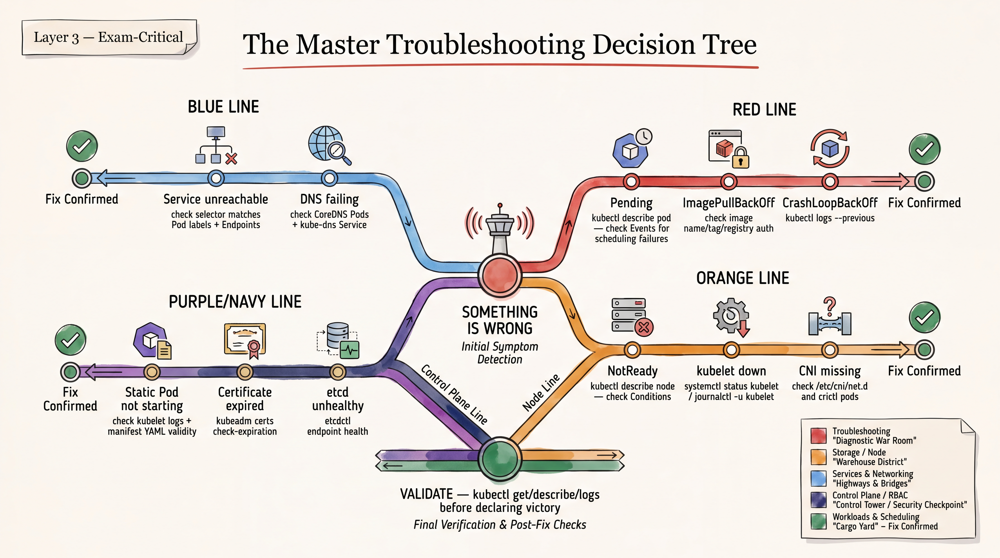
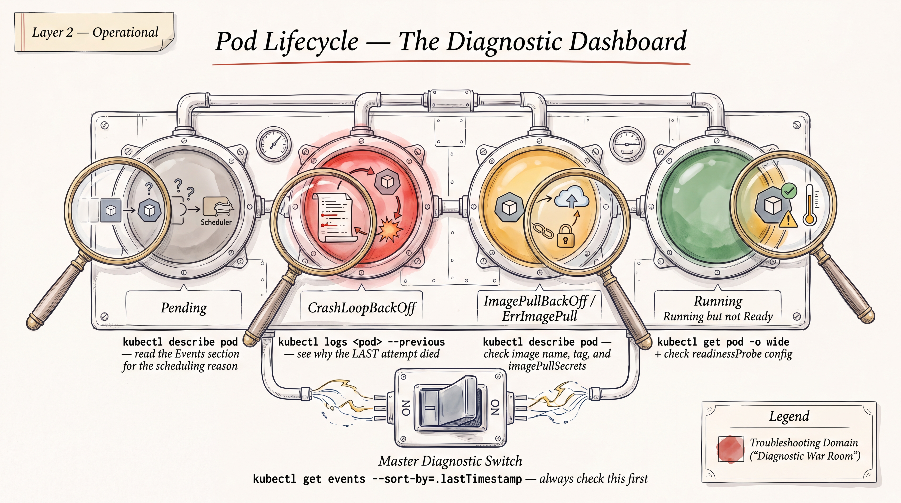

# Troubleshooting Playbook (CKA Domain — 30%, largest domain)





*Aligned to `CKA/01-exam-snapshot-and-priorities.md`: Troubleshooting is the single largest domain and the exam's genuine center of gravity. Control-plane/node/kubelet/CNI/DNS diagnosis via logs, events, `crictl`, `journalctl` is rated the strongest cross-source-confirmed pattern in the whole research set (P0). Static pod & kubelet manipulation, and certificate management, are also P0. CrashLoopBackOff/ImagePullBackOff/Pending-pod triage overlaps your CKAD baseline — kept tight here, not re-taught from scratch. Target version: v1.35 (re-verify live before booking per the snapshot file — v1.36 is already GA and the moving-target warning applies).*

---

# Master Decision Tree

Start here. Follow the branch that matches the symptom, then jump to the matching Part A/B section.

```
SYMPTOM: something is wrong with the cluster
│
├─ Can you reach the API server at all? (`k get nodes`, `k cluster-info`)
│   ├─ NO  → control-plane node down / apiserver crashed / cert expired
│   │        → go to: Static Pods, Control-Plane Components, Certificate Problems, etcd
│   └─ YES → continue
│
├─ Is a NODE showing NotReady? (`k get nodes`)
│   ├─ YES → SSH/`sudo -i` to that node
│   │        → systemctl status kubelet → running?
│   │            ├─ NO/crashed  → Kubelet Health & Config section
│   │            └─ YES but NotReady → check node Conditions (Disk/Memory/PID
│   │                pressure, NetworkUnavailable) → Resource Constraints /
│   │                CNI checks under Node NotReady section
│   └─ NO  → continue
│
├─ Is a POD not Running? (`k get pods -A | grep -v Running`)
│   ├─ Pending          → Pending Pods & Scheduler Issues
│   ├─ ImagePullBackOff/ErrImagePull → ImagePullBackOff section
│   ├─ CrashLoopBackOff → CrashLoopBackOff section
│   ├─ ContainerCreating (stuck) → check CNI / volume mounts / secrets
│   ├─ Terminating (stuck) → check finalizers, node reachability
│   └─ Running but app broken → continue below (Service/DNS)
│
├─ Is traffic not reaching a Pod via a Service?
│   → Service-not-reaching-Pods / selector & Endpoints section
│
├─ Is name resolution failing inside pods?
│   → DNS Failures (CoreDNS) section
│
└─ Is a control-plane component (apiserver/controller-manager/scheduler/etcd)
   unhealthy specifically?
   → Static Pods → Control-Plane Components → etcd Problems → Certificates
     (in that order — static pod manifest errors are the most common root
     cause of "control plane component missing/crashlooping")
```

General triage law for the exam: **events before logs, logs before guessing, `describe` before `get -o yaml`.** Always start with `k describe` (Events section at the bottom) and `k get events --sort-by=.lastTimestamp -A`, then drop to `journalctl`/`crictl` only when the problem is below the kubelet (i.e., the object doesn't exist as a normal Pod, or the node itself is unhealthy).

---

# Part A — Rapid Knowledge Refresh

## 1. Kubelet Health & Configuration

### Concept
The kubelet is the per-node agent that talks to the container runtime (containerd via CRI) and reconciles PodSpecs assigned to its node. On a kubeadm cluster it runs as a native `systemd` service (not a pod), configured by a combination of a systemd drop-in (flags), a `kubeadm-flags.env` file, and a `KubeletConfiguration` YAML file. If the kubelet is down, the node goes `NotReady` and every pod on it eventually shows as unknown/terminating. Misconfiguration (wrong cgroup driver, bad `--container-runtime-endpoint`, bad cert paths) is the single most common "broken worker node" exam scenario. The kubelet also owns static pod reconciliation, so kubelet problems and static pod problems are tightly coupled. Always check `systemctl status kubelet` and `journalctl -u kubelet` before touching anything else on a broken node.

### Important objects
Not a Kubernetes API object — it's a host-level `systemd` unit (`kubelet.service`) plus a `Node` object it registers/updates in the API.

### Important YAML fields
- `/var/lib/kubelet/config.yaml` — `KubeletConfiguration`: `cgroupDriver`, `staticPodPath`, `clusterDNS`, `clusterDomain`, `resolvConf`, `authentication`, `authorization`
- `/var/lib/kubelet/kubeadm-flags.env` — `KUBELET_KUBEADM_ARGS` (container runtime endpoint, node-ip, etc.)
- `/etc/systemd/system/kubelet.service.d/10-kubeadm.conf` — drop-in that sources the above two files and sets `ExecStart`
- `/etc/kubernetes/kubelet.conf` — kubeconfig the kubelet uses to talk to the apiserver (cert/key paths)

### Important commands
```bash
systemctl status kubelet
systemctl restart kubelet
journalctl -u kubelet -f                 # follow live
journalctl -u kubelet --since "5 min ago" -o cat
journalctl -u kubelet -n 200 --no-pager
cat /var/lib/kubelet/config.yaml
cat /var/lib/kubelet/kubeadm-flags.env
crictl info | grep -i cgroupDriver       # confirm runtime's cgroup driver matches kubelet's
```

### How to verify
`k get node <name>` shows `Ready`, and `k get pods -A -o wide --field-selector spec.nodeName=<name>` shows pods scheduled and Running again.

### Common exam mistake
Editing `config.yaml` or the drop-in but forgetting `systemctl daemon-reload` before `systemctl restart kubelet` (only needed if you touched the *unit file*, not `config.yaml` — but candidates burn time being unsure, so just always run it after any systemd file edit). Also: after fixing a bad edit, confirm the binary path referenced in the unit's `ExecStart` (`/usr/bin/kubelet` vs `/usr/local/bin/kubelet`) actually exists — it's easy to leave it pointing at a path that doesn't.

### One mini exercise
On a worker node, stop the kubelet, delete `/var/lib/kubelet/kubeadm-flags.env`, then try to bring the node back to `Ready` using only `journalctl -u kubelet` output to figure out what's missing (hint: you'll need to reconstruct the flags file or re-run `kubeadm join` phase `kubelet-start` if it's unrecoverable).

---

## 2. Node NotReady (broken worker node, general)

### Concept
`NotReady` means the kubelet either stopped heartbeating to the apiserver or is reporting a `False`/`Unknown` `Ready` condition. Root causes cluster into four buckets: (1) kubelet process itself down/misconfigured (see above), (2) container runtime (containerd) down or its socket unreachable, (3) CNI not installed/broken so the node can't report network readiness, (4) resource pressure (disk/memory/PID) causing the kubelet to self-report `NotReady`/taint the node. `k describe node` is the single best command — it shows the `Conditions` block with the exact reason string, which tells you which of the four buckets you're in before you even SSH to the node.

### Important objects
`Node` (check `.status.conditions`, `.status.nodeInfo`, `.spec.taints`)

### Important YAML fields
`status.conditions[].type` (`Ready`, `MemoryPressure`, `DiskPressure`, `PIDPressure`, `NetworkUnavailable`), `.reason`, `.message`; `spec.taints` (auto-added `node.kubernetes.io/not-ready:NoExecute`, `node.kubernetes.io/unreachable:NoExecute`)

### Important commands
```bash
k get nodes -o wide
k describe node <name>                          # Conditions + Events at bottom
k get node <name> -o jsonpath='{.status.conditions}' | jq
ssh <node>  # or: sudo -i, if already on it
systemctl status kubelet containerd
crictl info                                      # runtime reachable? cgroup driver?
ip a ; ip route                                  # basic networking sanity
ls /etc/cni/net.d/ /opt/cni/bin/                # CNI installed?
df -h ; free -h                                  # disk/memory pressure root cause
```

### How to verify
`k get nodes` shows `Ready`; `k get pods -A -o wide` shows previously-stuck pods scheduling/running on the node; the auto-added `NoExecute` taints disappear (`k describe node <name> | grep Taints`).

### Common exam mistake
Fixating on the kubelet when the real problem is containerd being down (`systemctl status containerd`) or the CRI socket path mismatch between kubelet's `--container-runtime-endpoint` and where containerd is actually listening (`unix:///var/run/containerd/containerd.sock` is containerd's own default — unrelated to the Kubernetes version — and is what kubeadm writes into `kubeadm-flags.env`; check `/etc/containerd/config.toml` too if someone changed it).

### One mini exercise
Stop `containerd` (not kubelet) on a worker (`systemctl stop containerd`), watch the node go `NotReady`, then diagnose purely from `k describe node` Events/Conditions text before running any node-local command — confirm you can correctly predict "runtime is down" from API-level evidence alone.

---

## 3. Static Pods

### Concept
Static pods are managed directly by the kubelet from manifest files on the node's local filesystem (`staticPodPath`, default `/etc/kubernetes/manifests`), bypassing the scheduler and apiserver for their *desired state*. The kubelet creates a read-only "mirror pod" in the API so you can see them with `kubectl` (name suffixed with `-<node-name>`), but editing the mirror pod via `kubectl edit` has no effect — you must edit the manifest file on disk, and the kubelet picks up changes within seconds (it watches the directory). This is exactly how kubeadm runs `kube-apiserver`, `kube-controller-manager`, `kube-scheduler`, and `etcd` on control-plane nodes — so "control plane component is down" almost always reduces to "go fix/read the static pod manifest."

### Important objects
Mirror `Pod` objects in `kube-system` namespace named `<component>-<node-name>` — read-only via the API, source of truth is the YAML file on disk.

### Important YAML fields
Any standard Pod spec field, but pay attention to: `spec.containers[].command`/`args` (flags to the component binary), `spec.containers[].livenessProbe` (a bad probe will crashloop a control-plane component), `spec.volumes[].hostPath` (cert/pki mounts — a wrong path here is a classic induced failure), `metadata.annotations` (kubelet adds `kubernetes.io/config.hash`/`config.mirror` — don't hand-edit these).

### Important commands
```bash
cat /var/lib/kubelet/config.yaml | grep staticPodPath   # confirm the watched dir
ls /etc/kubernetes/manifests/
k get pods -n kube-system -o wide | grep <node-name>
k describe pod kube-apiserver-<node> -n kube-system
crictl ps -a | grep kube-apiserver          # see it at the CRI level too
crictl logs <containerID>
vi /etc/kubernetes/manifests/kube-apiserver.yaml   # fix, save — kubelet reconciles automatically
```

### How to verify
`k get pods -n kube-system` shows the component `Running` with a fresh `AGE`/restart count stabilizing; `crictl ps` shows the corresponding container `Running` (not `Exited`); functionally, `k get nodes`/`k get pods` (for apiserver) or `k get events` (for controller-manager/scheduler leader election) work again.

### Common exam mistake
Trying `kubectl edit pod kube-apiserver-<node>` or `kubectl apply -f` against the mirror pod — this silently does nothing useful because the source of truth is the file on disk, not the API object. Also: moving the manifest *out* of the directory to "disable" a component temporarily and forgetting to move it back (kubelet deletes the mirror pod almost instantly when the file disappears — useful trick, but easy to leave broken).

### One mini exercise
Intentionally break `kube-scheduler` by editing `/etc/kubernetes/manifests/kube-scheduler.yaml` to point `--leader-elect` typo'd as `--leader-electt`, watch it crashloop via `crictl ps -a`, fix it by re-editing the file directly (not via `kubectl`), and confirm scheduling resumes by creating a plain Pod and watching it leave `Pending`.

---

## 4. Control-Plane Components (apiserver / controller-manager / scheduler)

### Concept
When `kubectl` itself is unreachable, you can't use `kubectl` to debug it — you must drop to the node level: `crictl` (talks directly to the CRI/containerd, works even if the apiserver is fully down) and `journalctl`/static pod manifests. `kube-apiserver` failures usually show as connection refused/timeout from `kubectl`; check its container status with `crictl ps -a` and its logs with `crictl logs`. `kube-controller-manager` and `kube-scheduler` failures are subtler — the API still works, but reconciliation stalls (Deployments don't create ReplicaSets, or Pods stay `Pending` forever with no scheduling events). Both use leader election (`--leader-elect=true` by default), so with multiple control-plane nodes check `k get lease -n kube-system` (`kube-controller-manager`, `kube-scheduler` Lease objects) to see who currently holds leadership before assuming the component is dead everywhere.

### Important objects
Mirror `Pod`s in `kube-system`; `Lease` objects `kube-scheduler` and `kube-controller-manager` in `kube-system` (leader election); `Endpoints`/`EndpointSlice` for the `kubernetes` service in `default` namespace (proves apiserver reachability).

### Important YAML fields
Same static pod manifest fields as above; additionally `--etcd-servers`, `--service-cluster-ip-range`, `--advertise-address` on apiserver; `--kubeconfig` on controller-manager/scheduler (points to `/etc/kubernetes/controller-manager.conf` / `scheduler.conf`).

### Important commands
```bash
# When kubectl is dead:
crictl ps -a                                  # every container's state, incl. exited ones
crictl ps -a | grep -E 'apiserver|controller|scheduler|etcd'
crictl logs --tail 100 <containerID>
crictl inspect <containerID> | less           # full config as the runtime sees it

# When kubectl works but reconciliation is stuck:
k get lease -n kube-system
k logs -n kube-system kube-controller-manager-<node>
k logs -n kube-system kube-scheduler-<node>
k get events -A --sort-by=.lastTimestamp | tail -40
```

### How to verify
`crictl ps` shows the container `Running` with low/no restart churn; `k get componentstatuses` (deprecated but sometimes still present) or simply `k get nodes`/`k get deploy` behaving normally end-to-end; for scheduler specifically, create a test Pod and confirm it schedules within seconds.

### Common exam mistake
Assuming `kubectl` being down means the whole cluster is unrecoverable and starting to rebuild — 90% of the time it's one static pod manifest typo or an expired cert (see below), fixable in place in under two minutes.

### One mini exercise
On a single-node control-plane, run `crictl ps -a` and identify the exact container ID for `kube-apiserver`; kill it manually with `crictl stop <id>`; observe the kubelet restart it automatically within seconds (proving static pod self-healing); then predict what happens if you instead delete the *manifest file* (it won't come back until the file returns).

---

## 5. etcd Problems

### Concept
etcd is the cluster's single source of truth; if it's unhealthy, the apiserver can't read/write state even though it may still be "up." On kubeadm clusters etcd runs as a static pod (`/etc/kubernetes/manifests/etcd.yaml`) using client/peer certs from `/etc/kubernetes/pki/etcd/`. Diagnosis needs `etcdctl` (network client — health/member/snapshot-save) pointed at the right endpoint and TLS material; every `etcdctl` invocation on a kubeadm cluster needs `--endpoints`, `--cacert`, `--cert`, `--key` unless you export them as `ETCDCTL_*` env vars first. Since etcd v3.5, **restore is `etcdutl`, not `etcdctl`** — this split is a near-guaranteed exam trap per the priority matrix (P0). A single-member etcd cluster with disk pressure or a full disk is a very common induced-failure scenario (etcd goes read-only/alarms trigger).

### Important objects
Not a native K8s object on its own — static Pod `etcd-<node>` in `kube-system`; the data lives in `/var/lib/etcd` by default.

### Important YAML fields
In `etcd.yaml`: `--data-dir`, `--listen-client-urls`, `--advertise-client-urls`, `--cert-file`/`--key-file`/`--trusted-ca-file`, `--initial-cluster` (multi-member topology).

### Important commands
```bash
export ETCDCTL_API=3   # default since etcd 3.4, harmless to set explicitly
alias e='etcdctl --endpoints=https://127.0.0.1:2379 \
  --cacert=/etc/kubernetes/pki/etcd/ca.crt \
  --cert=/etc/kubernetes/pki/etcd/server.crt \
  --key=/etc/kubernetes/pki/etcd/server.key'

e endpoint health
e endpoint status --write-out=table
e member list --write-out=table
e alarm list                             # NOSPACE alarm = disk full, common induced failure
e alarm disarm                           # after freeing space, must explicitly disarm

# Backup (etcdctl, network client)
e snapshot save /tmp/etcd-snapshot.db
e snapshot status /tmp/etcd-snapshot.db --write-out=table

# Restore (etcdutl, OFFLINE, operates on files directly — NOT etcdctl)
etcdutl snapshot restore /tmp/etcd-snapshot.db \
  --data-dir=/var/lib/etcd-restored
# then point etcd.yaml's --data-dir at the new directory and let kubelet
# restart the static pod, or stop etcd first if it's still running
```

### How to verify
`e endpoint health` returns `healthy`; `e member list` shows all expected members with no errors; `k get pods -n kube-system etcd-<node>` is `Running`; a plain `k get ns` round-trips successfully proving the apiserver→etcd path works.

### Common exam mistake
Running `etcdctl snapshot restore` (deprecated/removed since 3.5) instead of `etcdutl snapshot restore`, or restoring into the *same* `--data-dir` the running etcd still uses without stopping etcd/moving the manifest first (causes corruption/conflicts). Also forgetting `--cacert/--cert/--key` and getting a generic "context deadline exceeded" that looks like a network problem but is actually a TLS auth problem.

### One mini exercise
Take a snapshot with `etcdctl snapshot save`, verify it with `snapshot status`, then simulate disaster recovery: stop the etcd static pod (move manifest out of `/etc/kubernetes/manifests`), restore the snapshot with `etcdutl` into a **new** data directory, update `etcd.yaml`'s `--data-dir` to point at it, move the manifest back, and confirm the cluster comes back healthy.

---

## 6. Certificate Problems

### Concept
kubeadm clusters are certificate-heavy: apiserver, kubelet, etcd, and every control-plane client all use TLS material under `/etc/kubernetes/pki/`, most with a **1-year default expiry** (except the CA, which is 10 years). Expired certs are a classic induced exam failure — symptoms are usually `x509: certificate has expired or is not yet valid` in apiserver/kubelet logs, or `kubectl` suddenly failing with TLS errors even though nothing "changed." `kubeadm certs check-expiration` is the fastest single diagnostic command; `kubeadm certs renew` handles regeneration without touching the CA. Kubelet client certs (used for kubelet→apiserver auth) are separate from the static-pod-manifest certs and can rotate automatically if `serverTLSBootstrap`/rotation is enabled — but the exam more often tests the manual kubeadm-managed cert lifecycle.

### Important objects
Not API objects — files under `/etc/kubernetes/pki/` (`ca.crt`/`ca.key`, `apiserver.crt`, `apiserver-kubelet-client.crt`, `front-proxy-ca.crt`, etc.) and `/etc/kubernetes/*.conf` kubeconfigs (`admin.conf`, `kubelet.conf`, `controller-manager.conf`, `scheduler.conf`) which embed client certs.

### Important YAML fields
N/A (PEM files), but `kubeadm-config` ConfigMap in `kube-system` records the cluster's cert/CA configuration used for renewals.

### Important commands
```bash
kubeadm certs check-expiration
kubeadm certs renew all                      # renews everything except the CA itself
kubeadm certs renew apiserver                # renew a single cert
# after renewal, restart affected static pods so they pick up new certs:
systemctl restart kubelet    # kubelet re-reads and restarts static pods on manifest touch
# or force it:
mv /etc/kubernetes/manifests/kube-apiserver.yaml /tmp/ && sleep 5 && mv /tmp/kube-apiserver.yaml /etc/kubernetes/manifests/

openssl x509 -in /etc/kubernetes/pki/apiserver.crt -noout -dates -subject
openssl x509 -in /etc/kubernetes/pki/apiserver.crt -noout -text | grep -A1 "Subject Alternative Name"
journalctl -u kubelet | grep -i "x509\|certificate"
crictl logs <apiserver-container-id> | grep -i "x509\|expired"
```

### How to verify
`kubeadm certs check-expiration` shows all certs with future `EXPIRES` dates; `kubectl get nodes` (using `admin.conf`) succeeds without TLS errors; component logs no longer show `x509` errors.

### Common exam mistake
Renewing certs but never restarting the components that hold the *old* cert in memory (apiserver/controller-manager/scheduler as static pods need a restart — touching/re-placing the manifest, or `crictl stop` on the container, forces it). Also confusing which kubeconfig is stale — `~/.kube/config` on your workstation is a **copy** of `admin.conf` from bootstrap time; if you renewed certs but didn't re-copy `admin.conf`, your local `kubectl` will still fail.

### One mini exercise
Check current expirations with `kubeadm certs check-expiration`, force-expire the apiserver cert conceptually by checking what log line you'd expect (`x509: certificate has expired or is not yet valid`), then practice the full renew → restart → verify loop for just the apiserver cert without touching anything else.

---

## 7. CrashLoopBackOff

### Concept
CrashLoopBackOff means the container starts, exits (any nonzero-relevant reason, including a killed liveness probe), and the kubelet is backing off retries exponentially. This is app/pod-level, not typically control-plane-level, and overlaps your CKAD baseline heavily — the CKA angle is mostly "find the exit code/reason fast using events + previous logs" rather than "understand what CrashLoopBackOff means." Exit code `137` = SIGKILL, very often OOMKilled (check `Last State: Terminated: Reason: OOMKilled` in `describe`) or a failing liveness probe killing it; exit code `1`/other = application-level failure, go to `--previous` logs immediately since the current container is usually already restarting/empty.

### Important objects
`Pod.status.containerStatuses[].lastState.terminated` (reason, exitCode, finishedAt)

### Important YAML fields
`spec.containers[].livenessProbe`/`startupProbe` (misconfigured probes are a top cause), `resources.limits.memory` (too low → OOMKill), `command`/`args` (typo'd entrypoint)

### Important commands
```bash
k get pods
k describe pod <name>                     # Last State + Events at bottom
k logs <name>                             # current attempt (often empty/short)
k logs <name> --previous                  # the crashed attempt — usually the real answer
k get pod <name> -o jsonpath='{.status.containerStatuses[0].lastState.terminated}'
```

### How to verify
`k get pods` shows `Running` with restart count no longer climbing over a couple minutes' observation.

### Common exam mistake
Reading `k logs` (current) instead of `k logs --previous` and concluding "no logs, no clue" — the crashed container's output is only in `--previous` once a restart has happened.

### One mini exercise
Deploy a pod with `resources.limits.memory: "10Mi"` running something that allocates more, confirm `OOMKilled` in `describe`, then fix by raising the limit and confirm stability.

---

## 8. ImagePullBackOff

### Concept
The kubelet can't pull the image the runtime needs — wrong image name/tag, private registry without (or with wrong) `imagePullSecrets`, registry unreachable from the node (DNS/network/proxy), or rate limiting. `k describe pod` Events always names the exact failure (`ErrImagePull`, `ImagePullBackOff`, with the underlying error message from the runtime, e.g. `manifest unknown`, `unauthorized`, `x509`, `dial tcp: i/o timeout`). This is one of the fastest wins on the exam because the fix is almost always visible verbatim in the Events output — no deep diagnosis needed, just read carefully.

### Important objects
`Secret` of type `kubernetes.io/dockerconfigjson` referenced via `spec.imagePullSecrets` or `serviceAccount.imagePullSecrets`.

### Important YAML fields
`spec.containers[].image`, `spec.imagePullSecrets[].name`, `spec.containers[].imagePullPolicy`

### Important commands
```bash
k describe pod <name> | tail -20              # exact pull error string
k get secret <name> -o yaml
k create secret docker-registry regcred \
  --docker-server=<registry> --docker-username=<u> \
  --docker-password=<p> --docker-email=<e>
crictl pull <image>                            # reproduce the pull manually on the node
```

### How to verify
`k describe pod` no longer shows pull errors and `k get pods` transitions to `Running`; `crictl images` on the node shows the image present.

### Common exam mistake
Fixing a typo'd image tag but forgetting the Pod's controller (Deployment/ReplicaSet) needs the *template* updated and the old bad Pod deleted/replaced — editing a bare, unmanaged Pod's `image` field in place is also not allowed for most fields (immutable), so you often need to delete+recreate or patch the parent controller.

### One mini exercise
Create a Deployment with a nonexistent tag (`nginx:doesnotexist`), diagnose the exact error from `describe`, fix via `kubectl set image deployment/... nginx=nginx:1.27` and confirm rollout completes.

---

## 9. Pending Pods & Scheduler Issues

### Concept
`Pending` means the pod exists in the API but has not been bound to a node. Causes split into "nothing fits" (insufficient CPU/memory on any node, taints without matching tolerations, node/pod affinity that no node satisfies, `PersistentVolumeClaim` unbound) versus "scheduler itself isn't running" (rare but exam-testable — check `k get pods -n kube-system | grep scheduler` and its logs/Lease). `k describe pod` Events shows `FailedScheduling` with the precise reason (e.g., `0/3 nodes are available: 1 node(s) had taint {...} that the pod didn't tolerate, 2 Insufficient cpu`) — this is another case where the fix is usually legible directly from Events without further digging.

### Important objects
`Pod.spec.tolerations`, `Pod.spec.affinity`, `Node.spec.taints`, `Node.status.allocatable`

### Important YAML fields
`spec.tolerations[]` (`key`, `operator`, `value`, `effect`), `spec.affinity.nodeAffinity`/`podAffinity`/`podAntiAffinity`, `spec.resources.requests`, `spec.nodeSelector`

### Important commands
```bash
k get pods -o wide | grep Pending
k describe pod <name>                           # FailedScheduling reason, verbatim
k describe node <name> | grep -A5 Taints
k describe node <name> | grep -A10 Allocated     # requests vs allocatable
k get pods -n kube-system | grep scheduler
k logs -n kube-system kube-scheduler-<node>
```

### How to verify
`k get pods -o wide` shows the pod `Running` with a `NODE` assigned; no more `FailedScheduling` events on `k describe`.

### Common exam mistake
Adding a `toleration` that doesn't exactly match the taint's `key`/`value`/`effect` (all three must match, or `operator: Exists` with no `value`) — near-misses silently keep the pod Pending with the same event message, and candidates re-read the wrong part of the message.

### One mini exercise
Taint a node `k taint nodes <node> dedicated=gpu:NoSchedule`, create a pod without a toleration (confirm `Pending`/`FailedScheduling`), then add the exact matching toleration and confirm scheduling succeeds.

---

## 10. Service Not Reaching Pods (selectors, Endpoints)

### Concept
A `Service` finds its backend Pods purely via label selector match — there is no naming/ownership link, only `spec.selector` matching `Pod.metadata.labels`. If the labels don't match (or match zero pods, or match pods that aren't yet `Ready`), the `Endpoints`/`EndpointSlice` object for the Service will be empty, and every request will fail/hang even though the Service and Pods both look individually healthy. This is the #1 "Service not working" root cause on both CKAD and CKA, and the fastest diagnostic is a single command: `k get endpoints <svc>` (empty `ENDPOINTS` column = selector problem, full stop). Also check `targetPort` vs the container's actual listening port, and whether readiness probes are keeping otherwise-healthy pods out of Endpoints.

### Important objects
`Service`, `Endpoints`/`EndpointSlice` (auto-managed, but invaluable for diagnosis), `Pod.metadata.labels`

### Important YAML fields
`Service.spec.selector`, `Service.spec.ports[].port`/`.targetPort`, `Pod.metadata.labels`, `Pod.spec.containers[].readinessProbe`

### Important commands
```bash
k get svc <name> -o yaml | grep -A3 selector
k get pods --show-labels
k get endpoints <name>                      # THE fastest diagnostic
k get endpointslice -l kubernetes.io/service-name=<name>
k describe svc <name>
k run tmp --rm -it --image=busybox:1.36 -- wget -qO- <svc>.<ns>.svc.cluster.local:<port>
k get pods -o wide | grep <svc-related-label>   # confirm which pods should match
```

### How to verify
`k get endpoints <name>` lists pod IPs (not empty); a test request (`wget`/`curl` from a throwaway pod, or `k exec` into an existing one) succeeds against the ClusterIP or DNS name.

### Common exam mistake
Fixing the Service's `selector` to match labels but forgetting `targetPort` must match the **container's actual listening port**, not the Service's exposed `port` — a very common induced-failure variant where selectors are already correct and the real bug is `targetPort: 80` pointing at a container that listens on `8080`.

### One mini exercise
Create a Deployment with pods labeled `app: web`, then create a Service selecting `app: webb` (typo) — confirm `k get endpoints` is empty, fix the selector, confirm endpoints populate and traffic flows.

---

## 11. DNS Failures (CoreDNS)

### Concept
Cluster DNS is CoreDNS, deployed as a Deployment (typically 2 replicas) in `kube-system`, fronted by the `kube-dns` Service (name is legacy but functional) whose ClusterIP must match every kubelet's `clusterDNS` setting. Failures cluster into: CoreDNS pods themselves crashlooping (often a Corefile syntax error, or the classic `loop` detection when a node's `/etc/resolv.conf` points back at itself via `systemd-resolved`'s `127.0.0.53` stub, causing CoreDNS to detect a forwarding loop and refuse to start), the `kube-dns` Service/Endpoints being empty, a `NetworkPolicy` blocking UDP/TCP port 53 to `kube-system`, or the CNI itself being broken (DNS is just another pod-to-pod flow). Always test with a throwaway pod (`nslookup`/`dig`) rather than assuming — and check both in-cluster name resolution and external resolution (Corefile's `forward` plugin) separately, since they fail independently.

### Important objects
`Deployment coredns` (kube-system), `Service kube-dns` (kube-system), `ConfigMap coredns` (holds the Corefile), `EndpointSlice` for `kube-dns`

### Important YAML fields
`ConfigMap coredns` data key `Corefile` (`.:53 { errors; health; ready; kubernetes cluster.local ...; forward . /etc/resolv.conf; cache 30; loop; reload; loadbalance }`); Pod/kubelet `clusterDNS`/`clusterDomain`; `Pod.spec.dnsPolicy`/`dnsConfig`

### Important commands
```bash
k get pods -n kube-system -l k8s-app=kube-dns
k logs -n kube-system -l k8s-app=kube-dns --tail=50
k get cm coredns -n kube-system -o yaml
k get svc kube-dns -n kube-system
k get endpoints kube-dns -n kube-system
k run dnstest --rm -it --image=busybox:1.36 -- nslookup kubernetes.default
k run dnstest --rm -it --image=busybox:1.36 -- nslookup google.com   # external resolution path
cat /var/lib/kubelet/config.yaml | grep -A2 clusterDNS
```

### How to verify
`nslookup kubernetes.default` and `nslookup <svc>.<ns>.svc.cluster.local` from a test pod both resolve; `k get pods -n kube-system -l k8s-app=kube-dns` shows all replicas `Running` with stable restart counts.

### Common exam mistake
Editing the `coredns` ConfigMap directly with `kubectl edit` and expecting immediate effect — CoreDNS pods only reload the Corefile on the `reload` plugin's polling interval or on pod restart; if you need it instant, `k rollout restart deployment coredns -n kube-system` after editing.

### One mini exercise
Break DNS by scaling `coredns` to 0 replicas, confirm `nslookup` from a test pod times out, scale back to 2, and confirm resolution recovers — then separately corrupt the Corefile with a syntax error and diagnose via CoreDNS pod logs/CrashLoopBackOff instead.

---

## 12. Resource Constraints (requests/limits, pressure, eviction, OOM)

### Concept
Resource problems show up at two levels: pod-level (`requests`/`limits` too low → OOMKilled or throttled; too high relative to cluster capacity → stuck `Pending`) and node-level (kubelet self-reports `MemoryPressure`/`DiskPressure`/`PIDPressure` conditions and starts evicting pods by QoS class priority — `BestEffort` first, then `Burstable` over its requests, `Guaranteed` last). `kubectl top` requires the **metrics-server** add-on to be installed and healthy — if `k top nodes/pods` errors with "metrics not available," that's itself a diagnosis target (check the `metrics-server` Deployment in `kube-system`), not necessarily the thing you were asked to fix.

### Important objects
`Pod.spec.containers[].resources`, `LimitRange`, `ResourceQuota`, `Node.status.allocatable`/`.capacity`, `metrics-server` Deployment

### Important YAML fields
`resources.requests.{cpu,memory}`, `resources.limits.{cpu,memory}`, `LimitRange.spec.limits[]`, `ResourceQuota.spec.hard`

### Important commands
```bash
k top nodes
k top pods -A --sort-by=memory
k describe node <name> | grep -A10 "Allocated resources"
k describe pod <name> | grep -A5 "Last State"      # OOMKilled visible here
k get resourcequota -A
k get limitrange -A
k get events -A --field-selector reason=Evicted
```

### How to verify
`k top nodes` shows headroom under allocatable; `k describe pod` no longer shows `OOMKilled`/`Evicted`; previously-Pending pods (due to `Insufficient memory/cpu`) schedule successfully after right-sizing requests or adding capacity.

### Common exam mistake
Confusing `requests` (used for scheduling decisions/QoS) with `limits` (enforced ceiling, can cause OOMKill/throttling) — raising the wrong one doesn't fix the actual symptom (e.g., a Pending pod needs its **requests** lowered or node capacity raised, not its limits touched).

### One mini exercise
Set a Deployment's pods to `requests.memory: 2Gi` on a small lab node with less allocatable memory, confirm `Pending` with `Insufficient memory` in `describe`, then right-size the request down and confirm scheduling succeeds.

---

## 13. Triage Toolkit (kubectl / journalctl / systemctl / crictl)

### Concept
Four tool layers, each answering a different altitude of question. `kubectl describe`/`get events` = "what does the API/control-plane think happened" (always start here — free, fast, no SSH needed). `kubectl logs` = "what did the *containerized app* print" (only works if the container exists/existed — use `--previous` for crashed containers, `-f` to follow, `--all-containers` for multi-container pods, `-c <name>` to pick one). `journalctl -u <service>` = "what did a *host-level systemd service* (kubelet, containerd) do" — this is your only window into problems below the pod abstraction. `crictl` = "what does the *container runtime* (CRI/containerd) actually see" — works even when the apiserver is completely unreachable, since it talks directly to the runtime socket; indispensable for control-plane-down scenarios.

### Important objects
N/A — these are diagnostic tools, not API objects.

### Important YAML fields
`/etc/crictl.yaml` (sets default `runtime-endpoint`/`image-endpoint` so you don't need `--runtime-endpoint unix:///run/containerd/containerd.sock` on every invocation).

### Important commands
```bash
# kubectl layer
k get events -A --sort-by=.lastTimestamp | tail -30
k describe pod/node/svc <name>
k logs <pod> [-c <container>] [--previous] [-f] [--all-containers]

# systemd layer (host-level services: kubelet, containerd)
systemctl status kubelet containerd
systemctl restart kubelet
journalctl -u kubelet -f
journalctl -u containerd --since "10 min ago" -o cat

# CRI layer (works even if apiserver is down)
crictl ps -a                        # all containers incl. exited
crictl pods                         # sandbox/pod view
crictl logs [-f] <containerID>
crictl inspect <containerID>
crictl images
crictl exec -it <containerID> sh
```

### How to verify
You've correctly identified the failing layer when the tool at that layer shows the anomaly directly (e.g., `crictl ps -a` showing `Exited` with a nonzero exit code for a static pod container that `kubectl` can't even see because the apiserver itself is down).

### Common exam mistake
Reaching for `kubectl logs` on a pod that never got past `ContainerCreating`/never existed at the CRI level, then wasting time — if `kubectl describe` shows no container ever started, go straight to `journalctl -u kubelet` (scheduling/mount/CNI failures) instead of `logs`.

### One mini exercise
Pick any Running pod, find its container ID with `crictl ps | grep <pod-name>`, then fetch its logs three different ways — `kubectl logs`, `crictl logs`, and `journalctl` (containerd's own log line referencing the container) — and confirm you understand which layer each command is reading from.

---

# Part B — Task Patterns

## Pattern 1: Worker Node NotReady — kubelet down/misconfigured

### Skill tested
Diagnosing and repairing a broken kubelet/runtime on a worker node without a working `kubectl` shortcut — pure systemd + CRI level troubleshooting.

### What the task usually looks like
"Node `<name>` is `NotReady`. Bring it back to `Ready` without rebooting or rejoining the cluster." Underlying seed is usually one of: kubelet stopped, a flag/file was corrupted (`kubeadm-flags.env` truncated, `config.yaml` has invalid YAML or a wrong `cgroupDriver`), the kubelet binary/service file was tampered with, or containerd itself is stopped/misconfigured.

### Commands I need
```bash
k get nodes
k describe node <name>
ssh <name>   # or sudo -i if already there
systemctl status kubelet containerd
journalctl -u kubelet -n 100 --no-pager
cat /var/lib/kubelet/config.yaml
cat /var/lib/kubelet/kubeadm-flags.env
crictl info
systemctl daemon-reload && systemctl restart containerd kubelet
```

### Files/directories commonly involved
`/var/lib/kubelet/config.yaml`, `/var/lib/kubelet/kubeadm-flags.env`, `/etc/systemd/system/kubelet.service.d/10-kubeadm.conf`, `/etc/kubernetes/kubelet.conf`, `/etc/containerd/config.toml`

### Kubernetes documentation page worth knowing
"Troubleshooting kubelet-CSR-approver" is too narrow — the load-bearing page is **kubeadm → Troubleshooting kubeadm** and **Troubleshoot Clusters → Debugging Kubernetes Nodes With kubectl / With crictl** (there is no page literally titled "Debug a Node").

### Common mistakes
Restarting kubelet without `daemon-reload` after editing a unit/drop-in file (stale config remains active); not checking containerd first when the real failure is one layer lower.

### Fastest solution strategy
`describe node` for the Reason string → SSH → `systemctl status` both services in one line → `journalctl -u kubelet -n 100` → fix the specific error line → `daemon-reload && restart` → confirm `Ready`.

### Typical troubleshooting variation
Sometimes the induced fault is a wrong `--container-runtime-endpoint` in `kubeadm-flags.env` pointing at a nonexistent socket path rather than the service being stopped at all — same symptom, different root cause, so always check the flags file even if `systemctl status` shows "active."

### Estimated time target
5–7 minutes.

### Original practice task
**Solve:** On a worker node, run `systemctl stop kubelet`, then edit `/var/lib/kubelet/kubeadm-flags.env` and change the runtime endpoint value to an invalid socket path (e.g. append `-broken` to the socket filename), then try `systemctl start kubelet` and fix it properly using only the diagnostic commands above.
**Verify:** `kubectl get nodes` shows the node `Ready`, and `kubectl get pods -o wide --field-selector spec.nodeName=<name>` shows previously-Pending/stuck pods now `Running`.

### Hard-mode version
Simultaneously corrupt `config.yaml` (invalid YAML syntax) AND stop containerd, so `journalctl` shows two unrelated error signatures and you must fix both before the node recovers.

---

## Pattern 2: Static Pod Broken (control-plane component down)

### Skill tested
Manifest-level repair of a kubeadm-managed static pod (apiserver/controller-manager/scheduler) using file edits, not `kubectl`.

### What the task usually looks like
"`kube-scheduler`/`kube-controller-manager`/`kube-apiserver` on `<control-plane-node>` is crashlooping or missing. Restore it." Seed fault is typically a typo'd flag, a bad `hostPath` volume mount pointing at a nonexistent cert file, an invalid `image` tag, or a `livenessProbe` that can never succeed.

### Commands I need
```bash
ls /etc/kubernetes/manifests/
crictl ps -a | grep <component>
crictl logs <containerID>
cat /etc/kubernetes/manifests/<component>.yaml
vi /etc/kubernetes/manifests/<component>.yaml
```

### Files/directories commonly involved
`/etc/kubernetes/manifests/{kube-apiserver,kube-controller-manager,kube-scheduler,etcd}.yaml`, `/etc/kubernetes/pki/`

### Kubernetes documentation page worth knowing
"Static Pods" (Concepts → Workloads → Pods → Static Pods) and "kubeadm → Troubleshooting kubeadm."

### Common mistakes
Trying to `kubectl edit`/`kubectl apply` the mirror pod (no effect); introducing a second YAML error while fixing the first because manifests are hand-edited under time pressure — always re-`cat`/lint after editing.

### Fastest solution strategy
`crictl ps -a` to see restart/exit pattern → `crictl logs` on the most recent exited container for the exact error → cross-reference that line against the manifest → fix the one field → save (kubelet auto-reconciles within ~20s, no manual restart needed) → re-check `crictl ps -a`.

### Typical troubleshooting variation
Sometimes the manifest is syntactically fine but references a cert file that was moved/renamed (`hostPath` mismatch) — the error only appears in the component's own log line (`crictl logs`), not in any YAML linter.

### Estimated time target
6–8 minutes.

### Original practice task
**Solve:** Edit `/etc/kubernetes/manifests/kube-controller-manager.yaml` and change one `hostPath` volume's `path` to a nonexistent directory (e.g. `/etc/kubernetes/pki-typo`). Watch it crashloop, diagnose via `crictl logs`, and restore the correct path.
**Verify:** `crictl ps -a | grep controller-manager` shows `Running` with a stable (non-incrementing) restart count over 1 minute of observation, and `kubectl get pods -A` for a freshly created Deployment shows a ReplicaSet actually get created (proof controller-manager is reconciling).

### Hard-mode version
Break `kube-apiserver` itself (so `kubectl` is fully unreachable) via a bad `--etcd-servers` flag, forcing pure `crictl`/file-based diagnosis with zero `kubectl` available for the entire exercise.

---

## Pattern 3: Certificate Expired / TLS Handshake Failures

### Skill tested
Recognizing x509 symptoms, using `kubeadm certs` to renew, and restarting the right components afterward.

### What the task usually looks like
"`kubectl` (or a specific component) is failing with TLS/certificate errors. Fix it without regenerating the CA." Seed fault: one cert artificially expired/corrupted, or `admin.conf` on the workstation is stale relative to a rotated cert.

### Commands I need
```bash
kubeadm certs check-expiration
openssl x509 -in /etc/kubernetes/pki/apiserver.crt -noout -dates
kubeadm certs renew apiserver     # or: renew all
mv /etc/kubernetes/manifests/kube-apiserver.yaml /tmp/ && sleep 5 && mv /tmp/kube-apiserver.yaml /etc/kubernetes/manifests/
diff <(sudo cat /etc/kubernetes/admin.conf) ~/.kube/config
```

### Files/directories commonly involved
`/etc/kubernetes/pki/`, `/etc/kubernetes/admin.conf`, `/etc/kubernetes/kubelet.conf`, `~/.kube/config`

### Kubernetes documentation page worth knowing
"kubeadm → Certificate Management with kubeadm."

### Common mistakes
Renewing the cert but not restarting the static pod that holds it in memory; renewing on the wrong control-plane node in a multi-master setup (certs are per-node for some artifacts).

### Fastest solution strategy
`kubeadm certs check-expiration` to find the exact expired cert → `kubeadm certs renew <cert-name>` (or `all` if unsure/multiple are affected) → touch the relevant static pod manifest(s) to force a restart → re-copy `admin.conf` to `~/.kube/config` if it's *your* kubectl access that broke.

### Typical troubleshooting variation
Sometimes it's not expiry but a **wrong SAN** (Subject Alternative Name) — e.g., apiserver cert doesn't include a newly added load-balancer IP/hostname — requiring `kubeadm init phase certs apiserver --config <kubeadm-config>` with an updated `certSANs` list rather than a plain renew.

### Estimated time target
7–9 minutes.

### Original practice task
**Solve:** Run `kubeadm certs check-expiration`, note the apiserver cert's current expiry, then practice the exact renew command for just that cert (`kubeadm certs renew apiserver`) and force the static pod to pick it up by touching the manifest.
**Verify:** `kubeadm certs check-expiration` shows a new, later `RESIDUAL TIME`/`EXPIRES` for the apiserver cert, and `kubectl get nodes` continues to work with no x509 errors in `crictl logs` for the apiserver container.

### Hard-mode version
Simulate a fully expired cluster (conceptually — don't actually let real certs expire on a shared lab) by renewing **all** certs at once with `kubeadm certs renew all`, then correctly identifying and restarting every affected static pod (apiserver, controller-manager, scheduler) plus re-syncing `admin.conf`.

---

## Pattern 4: etcd Unhealthy / Quorum or Disk Issue

### Skill tested
etcd health diagnosis, alarm handling, and the etcdctl(backup)/etcdutl(restore) split.

### What the task usually looks like
"The cluster is behaving oddly / writes are failing. Diagnose and fix etcd." Seed fault: `NOSPACE` alarm from a full disk, a member down in a multi-node etcd cluster, or a deliberately corrupted/missing data directory requiring restore from a provided snapshot.

### Commands I need
```bash
etcdctl --endpoints=https://127.0.0.1:2379 \
  --cacert=/etc/kubernetes/pki/etcd/ca.crt --cert=/etc/kubernetes/pki/etcd/server.crt --key=/etc/kubernetes/pki/etcd/server.key \
  endpoint health
etcdctl ... alarm list
etcdctl ... alarm disarm
etcdctl ... member list -w table
etcdctl ... snapshot save /tmp/snap.db
etcdutl snapshot restore /tmp/snap.db --data-dir=/var/lib/etcd-new
```

### Files/directories commonly involved
`/etc/kubernetes/manifests/etcd.yaml`, `/var/lib/etcd`, `/etc/kubernetes/pki/etcd/`

### Kubernetes documentation page worth knowing
"kubeadm → Operating etcd clusters for Kubernetes" and the etcd project's own "Disaster recovery" doc (etcd.io — check if it's reachable during the exam; if not, rely on `kubeadm` docs which reproduce the same commands).

### Common mistakes
Using `etcdctl snapshot restore` (removed since etcd 3.5) instead of `etcdutl`; restoring into the live `--data-dir` without stopping etcd first; forgetting to disarm a `NOSPACE` alarm after freeing disk space (etcd stays read-only until explicitly disarmed even once space is free).

### Fastest solution strategy
`endpoint health` + `alarm list` first (fast, non-destructive) to classify the problem → if disk-full, free space and `alarm disarm` → if data corruption/loss, move the manifest out (stop etcd), `etcdutl snapshot restore` into a fresh dir, point `--data-dir` at it, move manifest back.

### Typical troubleshooting variation
Multi-member etcd cluster where only one member is unreachable — `member list` shows it, but `endpoint health` against that specific member's endpoint times out; fix might be a network/firewall issue on that node rather than etcd config itself.

### Estimated time target
8–10 minutes (restore scenario) / 3–4 minutes (alarm-only scenario).

### Original practice task
**Solve:** Fill up disk space artificially (or simulate via a small quota) until etcd raises a `NOSPACE` alarm, confirm the cluster starts rejecting writes (`kubectl create ns test` fails), free space, and disarm the alarm.
**Verify:** `etcdctl alarm list` returns empty, and `kubectl create ns test` (then `kubectl delete ns test`) succeeds.

### Hard-mode version
Full disaster recovery: take a snapshot, then actually delete `/var/lib/etcd`'s contents (single-node lab only!), restore from the snapshot into a new data dir, repoint the manifest, and confirm all previously-created objects (a marker namespace/configmap created before the "disaster") are present again after restore.

---

## Pattern 5: CrashLoopBackOff Application Pod

### Skill tested
Fast root-causing via `describe`/`--previous` logs — CKAD-familiar skill, kept at exam speed rather than re-explained.

### What the task usually looks like
"Pod `<name>` in namespace `<ns>` is crashlooping, fix it in place." Seed fault: bad `command`/`args`, missing mounted ConfigMap/Secret key causing the app to exit, too-low memory limit, or a probe misconfiguration.

### Commands I need
```bash
k describe pod <name> -n <ns>
k logs <name> -n <ns> --previous
k get pod <name> -n <ns> -o jsonpath='{.status.containerStatuses[0].lastState.terminated.reason}'
```

### Files/directories commonly involved
N/A (pure API-level object editing) — Deployment/Pod manifest itself.

### Kubernetes documentation page worth knowing
"Configure Liveness, Readiness and Startup Probes" and "Debug Running Pods."

### Common mistakes
Reading only current `k logs` (often empty); tweaking `limits` when the real fix is a code/config problem unrelated to resources.

### Fastest solution strategy
`describe` → `Last State`/`Reason` and `Events` → if `OOMKilled`, adjust `resources.limits.memory`; if probe-killed, fix/relax the probe; otherwise `--previous` logs for the app-level stack trace/error.

### Typical troubleshooting variation
CrashLoopBackOff caused by a missing mounted Secret/ConfigMap (pod can't even start the main process) — shows up as `CreateContainerConfigError` briefly before settling into CrashLoopBackOff, easy to misdiagnose if you only look at the final status.

### Estimated time target
3–5 minutes.

### Original practice task
**Solve:** Create a Pod whose container `command` references a script path that doesn't exist inside the image; diagnose via `describe`/`--previous` and fix the `command`.
**Verify:** `kubectl get pod` shows `Running` with restart count stable across a 60-second watch (`kubectl get pod <name> -w`).

### Hard-mode version
Chain two faults: a too-low memory limit AND a liveness probe with too-short `initialDelaySeconds` on a slow-starting app, so the first fix (raising memory) still doesn't resolve it until the probe timing is also fixed.

---

## Pattern 6: ImagePullBackOff

### Skill tested
Reading Events precisely and handling private-registry auth via `imagePullSecrets`.

### What the task usually looks like
"Pod can't pull its image." Seed fault: typo'd tag, private registry needing `imagePullSecrets` that are missing/wrong, or a `NetworkPolicy`/proxy blocking egress to the registry.

### Commands I need
```bash
k describe pod <name> -n <ns>
k create secret docker-registry regcred --docker-server=<reg> --docker-username=<u> --docker-password=<p> --docker-email=<e> -n <ns>
k patch deployment <name> -n <ns> -p '{"spec":{"template":{"spec":{"imagePullSecrets":[{"name":"regcred"}]}}}}'
crictl pull <image>
```

### Files/directories commonly involved
N/A — Secret + Deployment/Pod spec.

### Kubernetes documentation page worth knowing
"Pull an Image from a Private Registry."

### Common mistakes
Creating the Secret in the wrong namespace; forgetting to reference it via `imagePullSecrets` on the Pod template (creating the Secret alone does nothing).

### Fastest solution strategy
`describe` for the exact error string first (distinguishes "not found"/typo from "unauthorized"/auth from network timeout) → apply the matching fix (tag correction / secret creation+reference / network fix).

### Typical troubleshooting variation
Correct secret already referenced, but at the wrong scope — attached to the `ServiceAccount` instead of the Pod (or vice versa) when the task specifically requires one or the other.

### Estimated time target
4–6 minutes.

### Original practice task
**Solve:** Reference a private-looking registry image without any `imagePullSecrets`, observe the `unauthorized`/`ErrImagePull` event, create a `docker-registry` secret with (fake/lab) credentials, and attach it via `imagePullSecrets` on the Deployment template.
**Verify:** `kubectl describe pod` no longer shows pull errors (or, in a lab without real registry creds, confirm the error message changes from "no pull secret" to a registry-specific auth failure, proving the wiring is correct even if the credential itself is fake).

### Hard-mode version
Fix it cluster-wide by attaching the pull secret to the `default` ServiceAccount in the namespace instead of per-Pod, and confirm new Pods created without any explicit `imagePullSecrets` field still pull successfully.

---

## Pattern 7: Pod Stuck Pending (resources / taints / affinity / scheduler down)

### Skill tested
Distinguishing "nothing fits" from "scheduler is down" and applying the correct one of four distinct fixes.

### What the task usually looks like
"Pod `<name>` has been Pending for a while, get it running without changing its scheduling requirements incorrectly." Seed fault is one of: taint/toleration mismatch, resource requests exceeding all nodes' allocatable, node affinity nothing satisfies, or (rarer) `kube-scheduler` itself not running.

### Commands I need
```bash
k describe pod <name>                      # FailedScheduling reason string
k get nodes -o wide
k describe node <n> | grep -A5 Taints
k describe node <n> | grep -A10 "Allocated resources"
k get pods -n kube-system | grep scheduler
k taint nodes <n> key=value:NoSchedule-     # remove a taint if that's the fix
```

### Files/directories commonly involved
`/etc/kubernetes/manifests/kube-scheduler.yaml` (only if the scheduler itself is the fault).

### Kubernetes documentation page worth knowing
"Assigning Pods to Nodes," "Taints and Tolerations."

### Common mistakes
Removing a taint from a node instead of adding a toleration to the pod when the taint was intentional/required by the task; adding a toleration that doesn't exactly match `key`+`value`+`effect`.

### Fastest solution strategy
Read the `FailedScheduling` message verbatim first — it names the exact reason per node (taint / insufficient resource / affinity) — then apply the single matching fix rather than guessing across all four causes.

### Typical troubleshooting variation
Multiple simultaneous constraints (e.g., a toleration is correct but requests still exceed remaining allocatable) — fixing only the first-listed reason in Events isn't enough; re-`describe` after each fix to see if a second reason surfaces.

### Estimated time target
5–7 minutes.

### Original practice task
**Solve:** Taint a node `k taint nodes <n> env=prod:NoSchedule`, deploy a pod without a toleration, confirm Pending, then add the correct `tolerations` block to the pod spec.
**Verify:** `kubectl get pod -o wide` shows the pod `Running` and scheduled onto the tainted node.

### Hard-mode version
Stack a taint fix with a resource-fit fix on the same pod (taint tolerated but requests still too high for that specific node), requiring two sequential edits before it finally schedules.

---

## Pattern 8: Service Not Reaching Pods (selector/Endpoints mismatch)

### Skill tested
Endpoints-first diagnosis of Service routing failures — distinguishing selector bugs from port-mapping bugs.

### What the task usually looks like
"App behind Service `<svc>` is unreachable." Seed fault: selector doesn't match pod labels, `targetPort` doesn't match the container's actual listening port, or pods aren't `Ready` (readiness probe failing) so they're excluded from Endpoints even with a correct selector.

### Commands I need
```bash
k get endpoints <svc> -n <ns>
k get pods --show-labels -n <ns>
k get svc <svc> -n <ns> -o yaml
k describe pod <pod> -n <ns> | grep -A5 Readiness
k run tmp --rm -it --image=busybox:1.36 -n <ns> -- wget -qO- <svc>:<port>
```

### Files/directories commonly involved
N/A — Service + Deployment/Pod spec.

### Kubernetes documentation page worth knowing
"Connecting Applications with Services," "Debug Services."

### Common mistakes
Fixing the selector but not noticing `targetPort` is also wrong; assuming the Service is broken when it's actually a readiness probe keeping correctly-labeled pods out of Endpoints.

### Fastest solution strategy
`get endpoints` first — empty means selector or readiness issue, populated-but-still-failing means port-mapping or app-level issue — then branch accordingly instead of reading the full Service YAML top to bottom.

### Typical troubleshooting variation
Endpoints populated correctly but the Service `port`↔`targetPort` mapping is swapped/wrong, so connections reach the pod's network namespace but nothing is listening on that exact port.

### Estimated time target
4–6 minutes.

### Original practice task
**Solve:** Deploy pods labeled `app: api`, create a Service with `selector: app: api-v2` (mismatch), confirm empty Endpoints, fix the selector, then also verify `targetPort` correctness against the container's actual listening port.
**Verify:** `kubectl get endpoints <svc>` lists pod IPs, and a test request from a throwaway pod returns a successful response.

### Hard-mode version
Correct selector and correct `targetPort`, but a `readinessProbe` with an unreachable path keeps every pod `0/1 Ready` — Endpoints stays empty despite a perfectly correct Service, requiring you to look at Pod readiness rather than the Service at all.

---

## Pattern 9: DNS Resolution Failing (CoreDNS)

### Skill tested
CoreDNS-specific triage: pod health, Corefile correctness, Service/Endpoints for `kube-dns`, and the systemd-resolved loop trap.

### What the task usually looks like
"Pods can't resolve `<svc>.<ns>.svc.cluster.local`" (or external names). Seed fault: CoreDNS pods crashlooping (bad Corefile or the resolv.conf loop issue), `kube-dns` Service/Endpoints empty, or a `NetworkPolicy` blocking port 53 to `kube-system`.

### Commands I need
```bash
k get pods -n kube-system -l k8s-app=kube-dns
k logs -n kube-system -l k8s-app=kube-dns --tail=50
k get cm coredns -n kube-system -o yaml
k get endpoints kube-dns -n kube-system
k run dnstest --rm -it --image=busybox:1.36 -- nslookup kubernetes.default
k rollout restart deployment coredns -n kube-system
```

### Files/directories commonly involved
`ConfigMap coredns` (Corefile), `/etc/resolv.conf` on nodes (loop-detection root cause), any `NetworkPolicy` objects in `kube-system`.

### Kubernetes documentation page worth knowing
"Debugging DNS Resolution," "Customizing DNS Service."

### Common mistakes
Editing the Corefile ConfigMap and expecting instant effect without a rollout restart; not distinguishing in-cluster resolution failure from external/upstream resolution failure (they fail for different reasons and need different Corefile sections checked).

### Fastest solution strategy
Check CoreDNS pod health first (`CrashLoopBackOff` → logs for Corefile/loop errors); if pods are healthy, check `kube-dns` Endpoints next; only then suspect NetworkPolicy or per-pod `dnsPolicy` overrides.

### Typical troubleshooting variation
A `NetworkPolicy` in the app's namespace with a default-deny egress rule that doesn't carve out an exception for DNS (UDP/TCP 53 to `kube-system`) — CoreDNS itself is perfectly healthy, only specific namespaces are affected.

### Estimated time target
6–8 minutes.

### Original practice task
**Solve:** Apply a default-deny egress `NetworkPolicy` in a test namespace, confirm DNS lookups from pods in that namespace fail, then add an egress rule explicitly permitting UDP/TCP port 53 to the `kube-system` namespace.
**Verify:** `nslookup kubernetes.default` from a pod in the test namespace succeeds after the policy fix, and fails again if you temporarily remove the DNS-egress rule (proving causation, not coincidence).

### Hard-mode version
Combine a CoreDNS Corefile syntax error (pods crashlooping) with the NetworkPolicy issue simultaneously, requiring you to fix CoreDNS health first before the NetworkPolicy fix can even be observed to work.

---

## Pattern 10: Node Resource Pressure / Eviction

### Skill tested
Reading node Conditions/Allocated-resources, distinguishing requests-driven Pending from limits-driven OOMKill, and understanding eviction order by QoS class.

### What the task usually looks like
"Pods on node `<n>` are being evicted" or "a Deployment's pods keep getting OOMKilled/stuck Pending." Seed fault: over-committed requests across the cluster, a single pod with `limits` far too low for its actual usage, or genuinely low node capacity combined with `BestEffort` pods being evicted first under pressure.

### Commands I need
```bash
k top nodes
k top pods -A --sort-by=memory
k describe node <n> | grep -A5 Conditions
k describe node <n> | grep -A10 "Allocated resources"
k get events -A --field-selector reason=Evicted
k describe pod <name> | grep -A5 "Last State"
```

### Files/directories commonly involved
N/A — Pod resource fields, `LimitRange`/`ResourceQuota` objects if present.

### Kubernetes documentation page worth knowing
"Node-pressure Eviction," "Resource Management for Pods and Containers," "Configure Quality of Service for Pods."

### Common mistakes
Raising `limits` when the pod is stuck `Pending` (that's a `requests`/scheduling problem, not a limits problem); not checking whether `metrics-server` itself is the thing missing before assuming `k top` failing means "no resource problem."

### Fastest solution strategy
`describe node` Conditions first (is the node actually under pressure right now, or is this a one-time-scheduling requests issue) → `describe pod` Last State for OOMKilled specifically → right-size `requests` (scheduling) separately from `limits` (runtime ceiling) rather than conflating them.

### Typical troubleshooting variation
Pods evicted not for memory but `DiskPressure` from accumulated container logs/images filling the node's filesystem — fix involves `crictl rmi` on unused images or addressing log rotation, not touching pod resource fields at all.

### Estimated time target
6–9 minutes.

### Original practice task
**Solve:** Set a Deployment's `resources.requests.memory` deliberately higher than any single node's allocatable memory, confirm `Pending` with `Insufficient memory`, then right-size the request and confirm scheduling succeeds; separately, set `resources.limits.memory` too low for the app's real usage and confirm `OOMKilled` in `describe`.
**Verify:** `kubectl get pods -o wide` shows all replicas `Running` and stable, and `kubectl top pods` shows usage comfortably under the (now-corrected) limits.

### Hard-mode version
Simulate `DiskPressure` (fill a node's disk with unused container images/log growth in a disposable lab node) and diagnose purely from `k describe node` Conditions plus `crictl images`/`df -h` on the node, then remediate with `crictl rmi` on dangling images.

---

# Quick-Reference Command Sheet

```bash
# API-level triage (always first)
k get events -A --sort-by=.lastTimestamp | tail -30
k describe <resource> <name> -n <ns>
k get endpoints <svc> -n <ns>
k logs <pod> --previous -n <ns>

# Node-level (SSH / sudo -i)
systemctl status kubelet containerd
journalctl -u kubelet -n 100 --no-pager
crictl ps -a
crictl logs <containerID>
crictl inspect <containerID>

# Static pods / control plane
ls /etc/kubernetes/manifests/
vi /etc/kubernetes/manifests/<component>.yaml   # edit-and-save = auto-reconcile

# Certs
kubeadm certs check-expiration
kubeadm certs renew all

# etcd
etcdctl --endpoints=https://127.0.0.1:2379 --cacert=... --cert=... --key=... endpoint health
etcdctl ... snapshot save /tmp/snap.db      # BACKUP = etcdctl
etcdutl snapshot restore /tmp/snap.db --data-dir=/var/lib/etcd-new   # RESTORE = etcdutl
```
