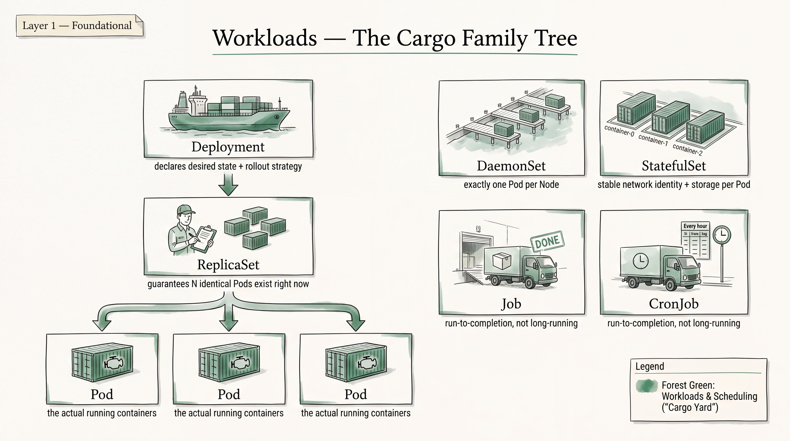
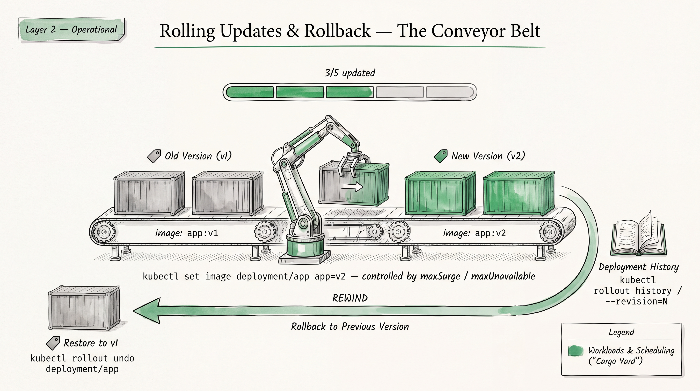
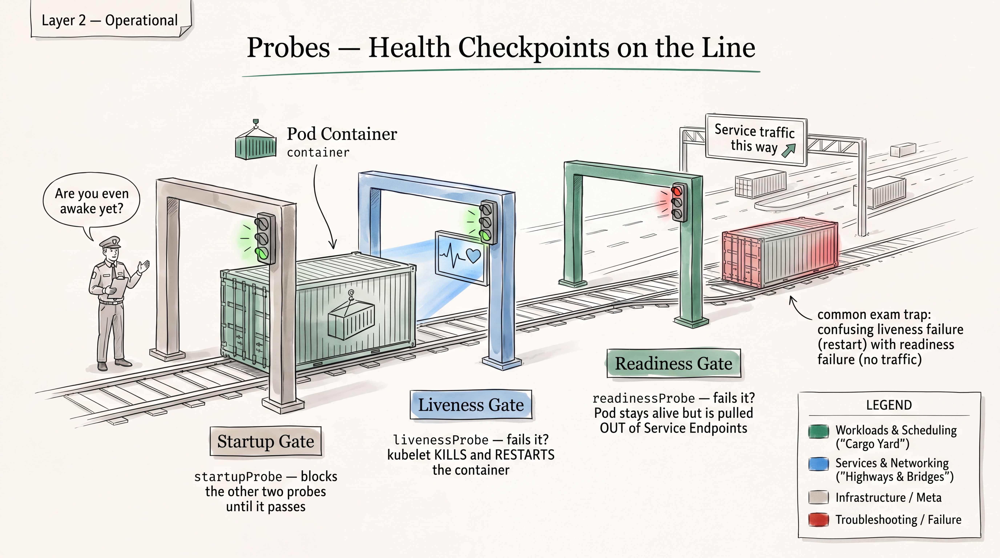

# Workloads — CKA Study Notes





**Domain:** Workloads & Scheduling — 15% of exam (this file covers the *Workloads* half; taints/tolerations, node affinity, priority classes, and HPA/autoscaling live in a separate Scheduling/Autoscaling file since the exam snapshot treats them as distinct P1 curriculum bullets under the same domain).

**Priority per `01-exam-snapshot-and-priorities.md`:** Core workload objects (Deployments/ReplicaSets/DaemonSets/Jobs/CronJobs) are rated **P2** — "common but heavy CKAD overlap... already mastered... low time cost." You already have this cold from CKAD. This file is deliberately a *refresh*, not first-time learning: it's optimized to re-sharpen exact syntax, flag the handful of genuinely CKA-flavored nuances (StatefulSet update mechanics, native sidecars, Job completion modes), and get you back to muscle memory fast — not to re-teach concepts. Spend your marginal study time on the P0 items (etcd, kubeadm, troubleshooting, RBAC) instead of over-indexing here.

Target Kubernetes version: v1.35 (per exam snapshot; re-verify close to booking).

---

# Part A — Rapid Knowledge Refresh

## Pods

### Concept
The atomic scheduling unit — one or more containers sharing network namespace (single IP), IPC, and optionally storage volumes. Everything else (Deployment, Job, StatefulSet) is a controller that manages Pods via a PodTemplate. `restartPolicy` at the Pod level is `Always` (default, used by Deployments), `OnFailure`, or `Never` (used by Jobs) — you cannot mix per-container restart policies except for sidecars (see below). Bare Pods are rarely the right exam answer unless the task explicitly asks for one — a Deployment gives you self-healing for free.

### Important objects
`Pod`, `PodTemplate` (embedded in Deployment/ReplicaSet/DaemonSet/StatefulSet/Job specs)

### Important YAML fields
`spec.containers[]`, `spec.initContainers[]`, `spec.restartPolicy`, `spec.terminationGracePeriodSeconds`, `spec.nodeName` (bypasses scheduler), `spec.securityContext`

### Important commands
```bash
k run mypod --image=nginx --restart=Never $do > pod.yaml
k get pod mypod -o yaml
k get pod mypod -o jsonpath='{.status.phase}'
k delete pod mypod --grace-period=0 --force   # last resort, exam sometimes needs this on stuck pods
```

### How to verify
`k get pods -o wide` (node, IP, restarts); `k describe pod` for events; `k get pod -o jsonpath='{.status.containerStatuses[*].restartCount}'`

### Common exam mistake
Editing a bare Pod's image/spec in place and expecting it to just work — most fields are immutable post-creation. If the task says "change the image," check whether it's actually a Deployment before reaching for `kubectl edit`.

### One mini exercise
Create a Pod named `busy1` running `busybox:1.36` that sleeps forever (`sleep 3600`), using `--dry-run=client -o yaml` to generate the base and editing the command in.

---

## Deployments & ReplicaSets

### Concept
Deployment → manages ReplicaSets → manages Pods. You almost never touch a ReplicaSet directly in the exam; it exists so the Deployment can keep an old RS around (scaled to 0) for rollback and can run two RS versions simultaneously during a rolling update. `.spec.selector.matchLabels` is immutable after creation and must match `.spec.template.metadata.labels` — a classic point of exam breakage.

### Important objects
`Deployment`, `ReplicaSet`

### Important YAML fields
`spec.replicas`, `spec.selector.matchLabels`, `spec.template`, `spec.strategy.type` (`RollingUpdate`|`Recreate`), `spec.strategy.rollingUpdate.maxUnavailable`/`maxSurge`, `spec.revisionHistoryLimit`, `spec.minReadySeconds`

### Important commands
```bash
k create deployment web --image=nginx:1.25 --replicas=3 $do > deploy.yaml
k get deploy web -o yaml
k describe deploy web
k get rs -l app=web
```

### How to verify
`k rollout status deployment/web`; `k get deploy web` (READY column, e.g. `3/3`); `k get rs` (only the current RS should have desired replicas > 0)

### Common exam mistake
Changing `spec.selector` after creation → apply fails immutable-field error. If you truly need to change the selector, you must delete and recreate the Deployment (fine for exam scratch objects, be careful on anything stateful).

### One mini exercise
Generate a Deployment `web` with 3 replicas of `nginx:1.25`, `--dry-run=client -o yaml`, then edit it to add `spec.strategy.rollingUpdate.maxSurge: 1` and `maxUnavailable: 0` before applying.

---

## Rolling Updates, Rollback, Image Changes, Rollout History

### Concept
`RollingUpdate` (default) replaces Pods incrementally, respecting `maxUnavailable`/`maxSurge`, and only proceeds past a batch once new Pods pass their readiness probe — this is *the* mechanism that makes probes matter operationally, not just conceptually. Every change to `.spec.template` creates a new ReplicaSet revision; changes elsewhere (e.g. `replicas` count) do **not** create a new revision. `kubectl rollout undo` works by re-activating a previous ReplicaSet's template, so revision history is only useful if `revisionHistoryLimit` hasn't pruned it and if you used `--record`/change-cause annotations to make history readable.

### Important objects
Deployment revisions (backed by ReplicaSets, distinguished by the `pod-template-hash` label)

### Important YAML fields
`spec.strategy.rollingUpdate.{maxSurge,maxUnavailable}`, `spec.revisionHistoryLimit`, annotation `kubernetes.io/change-cause`

### Important commands
```bash
k set image deployment/web nginx=nginx:1.27 --record        # --record is deprecated but still works in 1.35; annotate manually if it's stripped
k annotate deployment/web kubernetes.io/change-cause="bump to 1.27"
k rollout status deployment/web
k rollout history deployment/web
k rollout history deployment/web --revision=2
k rollout undo deployment/web
k rollout undo deployment/web --to-revision=2
k rollout pause deployment/web      # stop mid-rollout, edit more, then resume
k rollout resume deployment/web
```

### How to verify
`k rollout history deployment/web` shows correct revision + change-cause; `k get deploy web -o jsonpath='{.spec.template.spec.containers[0].image}'` matches expected tag; `k rollout status` returns "successfully rolled out"

### Common exam mistake
Forgetting `--record`/annotation, so `rollout history` shows `<none>` for every CHANGE-CAUSE column and you can't tell revisions apart under time pressure. Also: assuming `kubectl scale` bumps the revision — it doesn't, so `rollout undo` won't touch replica count.

### One mini exercise
Deploy `web` with `nginx:1.24`, update the image to `nginx:1.25` with a change-cause annotation, update again to a deliberately bad tag (e.g. `nginx:broken`), confirm rollout is stuck via `k rollout status` (it will hang — Ctrl+C), then `k rollout undo` back to the last good revision and confirm.

---

## Scaling

### Concept
Manual scaling changes `spec.replicas` directly and does not go through the rolling-update machinery — Pods are just added/removed to match the count using whatever strategy is already configured. Declarative scaling (editing YAML + apply) and imperative scaling (`kubectl scale`) both work; `kubectl scale` also supports a `--current-replicas` precondition useful for scripted safety checks. HPA-driven autoscaling is covered separately (Scheduling/Autoscaling file) since it's a distinct named curriculum bullet.

### Important objects
Deployment, ReplicaSet, StatefulSet (all support `.spec.replicas`)

### Important YAML fields
`spec.replicas`

### Important commands
```bash
k scale deployment/web --replicas=5
k scale deployment/web --current-replicas=3 --replicas=5   # only scales if current==3
k scale --replicas=5 -f deploy.yaml
```

### How to verify
`k get deploy web` READY column; `k get pods -l app=web --no-headers | wc -l`

### Common exam mistake
Scaling a Deployment to 0 to "pause" it, then forgetting that this is indistinguishable from a rollout failure at a glance — always check `spec.replicas`, not just the ready count, when a task says a workload seems "down."

### One mini exercise
Scale `web` to 0, verify no pods remain (`k get pods -l app=web` empty), scale back to 3, verify.

---

## DaemonSets

### Concept
Runs exactly one Pod per matching node (or all nodes if no `nodeSelector`/affinity is set), including nodes added later — used for node-level agents (log shippers, CNI plugins, monitoring agents). No `replicas` field; scaling is implicit via node count. Tolerates control-plane taints by default only if you add the matching toleration yourself — a stock DaemonSet will **not** schedule onto tainted control-plane nodes unless the manifest tolerates `node-role.kubernetes.io/control-plane`.

### Important objects
`DaemonSet`

### Important YAML fields
`spec.selector`, `spec.template`, `spec.updateStrategy.type` (`RollingUpdate`|`OnDelete`), `spec.updateStrategy.rollingUpdate.maxUnavailable`, `spec.template.spec.tolerations`

### Important commands
```bash
k get ds -A
k describe ds <name> -n <ns>
k rollout status daemonset/<name>
k rollout history daemonset/<name>
```

### How to verify
`k get ds` — DESIRED, CURRENT, READY, UP-TO-DATE, AVAILABLE should all match node count (minus intentionally excluded nodes)

### Common exam mistake
Expecting a DaemonSet to land on the control-plane node like any other workload — it won't, unless you explicitly tolerate the control-plane taint. This trips people diagnosing "why is my DaemonSet count less than total nodes."

### One mini exercise
Create a DaemonSet running `busybox` with `sleep 3600` on every node including control-plane (add the toleration), verify `DESIRED == CURRENT == number of nodes` via `k get ds`.

---

## StatefulSets

### Concept
Like a Deployment but for Pods needing **stable identity**: predictable ordinal names (`web-0`, `web-1`, ...), stable network identity via a required **headless Service** (`clusterIP: None`), and stable per-Pod storage via `volumeClaimTemplates` (each Pod gets its own PVC that survives Pod rescheduling). Default `podManagementPolicy` is `OrderedReady` (Pods created/terminated one at a time, in order, waiting for Ready) — set to `Parallel` if ordering doesn't matter and you want faster scaling. Rolling updates go in **reverse ordinal order** (highest number first) by default, and `spec.updateStrategy.rollingUpdate.partition` lets you do a canary by only updating Pods with ordinal ≥ partition.

### Important objects
`StatefulSet`, headless `Service`, auto-created `PersistentVolumeClaim`s (named `<volumeClaimTemplate-name>-<statefulset-name>-<ordinal>`)

### Important YAML fields
`spec.serviceName` (must match the headless Service), `spec.podManagementPolicy`, `spec.volumeClaimTemplates`, `spec.updateStrategy.rollingUpdate.partition`

### Important commands
```bash
k get statefulset
k get pvc -l app=<label>
k rollout status statefulset/<name>
k delete statefulset <name> --cascade=orphan   # keep pods running, remove only the controller
```

### How to verify
`k get pods -l app=<name> -o name` shows ordinal-named pods created in order; `k get pvc` shows one PVC per Pod that persists after `k delete pod web-0`

### Common exam mistake
Forgetting the headless Service entirely (`spec.clusterIP: None` + matching `spec.serviceName` in the StatefulSet) — without it, the StatefulSet still creates Pods but per-Pod DNS (`web-0.web.default.svc.cluster.local`) won't resolve, and the task's implicit verification (stable network identity) silently fails.

### One mini exercise
Create a headless Service `web` and a StatefulSet `web` with 3 replicas and a `volumeClaimTemplate` requesting 1Gi; verify `web-0`, `web-1`, `web-2` come up in order and each has its own bound PVC.

---

## Jobs

### Concept
Runs Pods to completion rather than indefinitely; Pod template `restartPolicy` must be `OnFailure` or `Never` (never `Always`). `completions` (total successful Pod completions needed) and `parallelism` (max concurrently running) default to 1 each — set both for a work-queue-style batch job. `backoffLimit` (default 6) caps retries before the Job is marked Failed. `completionMode: Indexed` gives each Pod a unique `JOB_COMPLETION_INDEX` env var, useful for partitioned work. `activeDeadlineSeconds` is a hard wall-clock timeout for the whole Job (kills it even if it would otherwise succeed).

### Important objects
`Job`

### Important YAML fields
`spec.completions`, `spec.parallelism`, `spec.backoffLimit`, `spec.activeDeadlineSeconds`, `spec.completionMode`, `spec.template.spec.restartPolicy`, `spec.ttlSecondsAfterFinished`

### Important commands
```bash
k create job myjob --image=busybox -- /bin/sh -c "echo hi; sleep 5"
k create job myjob --image=busybox $do -- /bin/sh -c "echo hi" > job.yaml
k get jobs
k logs job/myjob
k wait --for=condition=complete job/myjob --timeout=60s
```

### How to verify
`k get job myjob` — COMPLETIONS column shows `1/1` (or `N/N`); `k get pods -l job-name=myjob` shows Pod phase `Succeeded`

### Common exam mistake
Leaving `restartPolicy: Always` (the Pod-spec default) in a Job template — the API rejects it outright with a validation error, an easy silent time-sink if you generated the YAML from a Pod/Deployment example instead of `k create job`.

### One mini exercise
Create a Job `pi` with `completions: 3`, `parallelism: 2`, image `busybox`, command computing something trivial (`echo done`), and confirm via `k get job pi` that all 3 completions finish with max 2 running concurrently (watch with `k get pods -w`).

---

## CronJobs

### Concept
Wraps a Job template on a cron `schedule`. `concurrencyPolicy` controls overlap: `Allow` (default, can run concurrently), `Forbid` (skip new run if previous still active), `Replace` (kill current, start new). `startingDeadlineSeconds` bounds how late a missed schedule can still start (important if the controller was down). `successfulJobsHistoryLimit`/`failedJobsHistoryLimit` (defaults 3/1) control how many completed Job objects are kept for inspection. `spec.suspend: true` pauses future scheduling without deleting the CronJob. `spec.timeZone` (stable since 1.27) lets you set an explicit IANA timezone instead of relying on the controller's local time (UTC by default in-cluster).

### Important objects
`CronJob` → creates `Job` → creates `Pod`(s)

### Important YAML fields
`spec.schedule`, `spec.concurrencyPolicy`, `spec.startingDeadlineSeconds`, `spec.successfulJobsHistoryLimit`, `spec.failedJobsHistoryLimit`, `spec.suspend`, `spec.timeZone`, `spec.jobTemplate`

### Important commands
```bash
k create cronjob mycron --image=busybox --schedule="*/1 * * * *" -- /bin/sh -c "date"
k get cronjob
k get jobs --watch
k create job --from=cronjob/mycron manual-run-1   # trigger one-off run immediately
```

### How to verify
Wait one schedule interval, `k get jobs -l ...` shows a new Job created; `k get cronjob mycron` LAST SCHEDULE column updates; `k logs job/<generated-name>`

### Common exam mistake
Using `k create job --from=cronjob/x` to "test" and then treating that as evidence the CronJob's own scheduling works — it only proves the Job template is valid, not that the schedule string is correct. Always double-check standard 5-field cron syntax (`* * * * *` = min hour day month weekday); a stray extra field or wrong field order silently produces an invalid schedule.

### One mini exercise
Create a CronJob running every minute with `concurrencyPolicy: Forbid`, sleeping 90 seconds — observe (via `k get jobs`) that the second scheduled run is skipped because the first is still active.

---

## Probes (liveness / readiness / startup)

### Concept
Readiness gates whether a Pod receives Service traffic and whether a rolling update proceeds to the next batch — it does **not** restart the container. Liveness restarts the container on failure (via kubelet, respecting `restartPolicy`) — misconfigured liveness probes are a classic self-inflicted CrashLoopBackOff. Startup probes exist for slow-starting containers: while a startup probe is defined and not yet succeeded, liveness/readiness probes are disabled, avoiding premature liveness kills during a long init phase. All three support `httpGet`, `tcpSocket`, `exec`, and `grpc`; shared tuning fields are `initialDelaySeconds`, `periodSeconds`, `timeoutSeconds`, `successThreshold`, `failureThreshold`.

### Important objects
Container-level probe blocks inside any PodTemplate

### Important YAML fields
`livenessProbe`, `readinessProbe`, `startupProbe`, each with `httpGet.{path,port}` / `tcpSocket.port` / `exec.command` / `grpc.port`, plus `initialDelaySeconds`, `periodSeconds`, `failureThreshold`

### Important commands
```bash
k describe pod <name>   # Events show probe failures explicitly
k get pod <name> -o jsonpath='{.status.containerStatuses[0].ready}'
```

### How to verify
`k get pods` READY column (`1/1` means readiness passing); `k describe pod` Events for `Unhealthy` warnings; for liveness issues check `RESTARTS` count rising in `k get pods`

### Common exam mistake
Pointing a liveness probe at an endpoint/path that's valid only after slow startup completes, with no `startupProbe` or generous `initialDelaySeconds` — causes an infinite restart loop that looks like an application bug but is a probe-config bug. Always check `k describe pod` Events before assuming the app itself is broken.

### One mini exercise
Add a liveness probe (`httpGet /healthz` port 80) and a readiness probe (`httpGet / ` port 80) to an nginx Pod, then `k exec` in and rename `/usr/share/nginx/html/index.html` to force readiness to fail — confirm the Pod stays Running but drops to `0/1` READY and (if behind a Service) stops receiving traffic, without being restarted.

---

## Init Containers

### Concept
Run sequentially, to completion, before any regular container starts; each must exit 0 before the next (or the main containers) starts. Used for setup work (wait-for-dependency, populate a shared volume, run a migration) that must finish before the app runs. They have their own image/command and can use a different resource profile than the main container. A failing init container puts the Pod in `Init:Error`/`Init:CrashLoopBackOff` and blocks the rest of the Pod indefinitely (subject to `restartPolicy`).

### Important objects
`spec.initContainers[]` inside any PodTemplate

### Important YAML fields
`spec.initContainers[].{name,image,command,volumeMounts}`

### Important commands
```bash
k logs <pod> -c <init-container-name>
k describe pod <pod>   # shows Init:N/M progress and status
```

### How to verify
`k get pod <name>` shows status like `Init:0/1` while blocked, `Running` once all init containers succeed; `k logs <pod> -c <initname>` for its output

### Common exam mistake
Trying `k logs <pod>` without `-c <init-container-name>` and getting an error or the wrong container's logs once there are multiple containers — always name the container explicitly once a Pod has more than one.

### One mini exercise
Add an init container to a Pod that runs `sh -c "sleep 5 && echo ready > /work/ready"` writing to an `emptyDir` shared with the main container, which does `cat /work/ready`; confirm the Pod stays `Init:0/1` for ~5s then transitions to `Running`.

---

## Sidecars

### Concept
Two valid patterns exist, and the exam may test either: (1) the **classic pattern** — just another regular long-running container in `spec.containers[]` (e.g. a log-shipper) sharing volumes/network with the main container; (2) the **native sidecar** pattern (stable since v1.29) — an entry in `spec.initContainers[]` with `restartPolicy: Always` set at the container level. Native sidecars start before the main containers (like other init containers), keep running alongside them for the Pod's whole lifetime, and are terminated *after* main containers on Pod shutdown — this fixes the old classic-pattern problems where a Job could never complete because a sidecar kept it alive, and where sidecars started at the same time as (not before) the app.

### Important objects
Any container in `spec.containers[]` (classic) or `spec.initContainers[]` with `restartPolicy: Always` (native)

### Important YAML fields
`spec.initContainers[].restartPolicy: Always` (the field that makes it a native sidecar instead of a normal init container)

### Important commands
```bash
k get pod <name> -o jsonpath='{.spec.initContainers[*].restartPolicy}'
k logs <pod> -c <sidecar-name>
```

### How to verify
`k describe pod` shows the sidecar listed under Init Containers but with `Ready: True` and staying `Running` (not `Completed`) while the Pod itself is `Running`

### Common exam mistake
Assuming "add a sidecar" always means "add a second entry to `spec.containers`" — if the task is on a v1.29+ cluster and mentions the sidecar needing to be ready *before* the main app starts (e.g., a proxy or log-shipper the main container depends on), the intended answer is the native `initContainers` + `restartPolicy: Always` pattern, not a plain second container.

### One mini exercise
Convert a Pod's log-shipper sidecar from a plain second `containers[]` entry into a native sidecar (`initContainers[]` with `restartPolicy: Always`), confirm via `k describe pod` that it now starts before the main container and is categorized under Init Containers while still shown Running.

---

## Resource Requests / Limits

### Concept
`requests` drive scheduling (the scheduler only places a Pod on a node with enough allocatable capacity) and are used for QoS class assignment; `limits` are enforced at runtime (CPU is throttled, memory over-limit gets the container OOMKilled). Three QoS classes fall out automatically: `Guaranteed` (requests == limits for every resource, every container), `Burstable` (at least one request/limit set, not fully matching), `BestEffort` (no requests/limits set at all) — QoS class determines eviction order under node pressure. No `limits.cpu` means unbounded CPU burst; no `requests` means the scheduler treats it as effectively free to place (risky).

### Important objects
Container-level `resources` block; cluster-level `ResourceQuota` (namespace-wide caps) and `LimitRange` (per-object defaults/min/max) — both worth knowing exist even though authoring them in depth leans toward the Scheduling side of this domain.

### Important YAML fields
`resources.requests.{cpu,memory}`, `resources.limits.{cpu,memory}`

### Important commands
```bash
k top pod <name>
k top node
k describe node <name>   # Allocated resources section
k describe pod <name>    # shows QoS Class, and OOMKilled/reason on failure
```

### How to verify
`k describe pod` → `QoS Class:` field; `k get pod <name> -o jsonpath='{.status.containerStatuses[0].lastState.terminated.reason}'` shows `OOMKilled` if memory-limited death occurred; `Pending` Pod + `k describe pod` Events showing `Insufficient cpu/memory` confirms a scheduling-side resource failure

### Common exam mistake
Confusing a `Pending` Pod (scheduler couldn't find a node — check `requests` vs node capacity) with an `OOMKilled`/`CrashLoopBackOff` Pod (ran fine at first, then hit its `limits.memory` — check `limits`, not `requests`). These need opposite fixes and `k describe pod` Events tells you which one you're looking at within seconds if you read it.

### One mini exercise
Set a Pod's `resources.requests.memory` to `10Gi` (more than any real node has) and confirm it stays `Pending` with an `Insufficient memory` Event; then fix the request to something small but set `limits.memory: 20Mi` on a container that allocates more than that, and confirm it gets `OOMKilled`.

---

## Env Vars

### Concept
Set directly (`value:`), or dynamically sourced via `valueFrom` from a ConfigMap key, Secret key, or the Downward API (Pod/container metadata like name, namespace, resource requests). Order matters for `env[]` entries referencing each other via `$(VAR)` expansion. `envFrom` bulk-imports every key from a ConfigMap or Secret as an env var (with optional `prefix`), trading precision for convenience — collisions are resolved by later sources winning, and non-conforming key names are silently skipped with an Event, not a hard failure.

### Important objects
N/A — a container spec field, sourced from ConfigMap/Secret/Downward API

### Important YAML fields
`env[].value`, `env[].valueFrom.{configMapKeyRef,secretKeyRef,fieldRef,resourceFieldRef}`, `envFrom[].{configMapRef,secretRef,prefix}`

### Important commands
```bash
k set env deployment/web LOG_LEVEL=debug
k set env deployment/web --from=configmap/myconfig
k exec <pod> -- env
```

### How to verify
`k exec <pod> -- env | grep VARNAME`; `k describe pod` doesn't show resolved secret *values* (by design) but does show which keys/sources are wired

### Common exam mistake
Using `envFrom` with a ConfigMap/Secret that has keys with invalid env-var characters (e.g. `my.key` or `my-key` — dashes/dots aren't valid in shell env names) and being confused why the variable "isn't there" — check `k describe pod` Events for a silent `InvalidVariableNames` warning rather than assuming the whole envFrom failed.

### One mini exercise
Create a ConfigMap with keys `LOG_LEVEL=debug` and `bad.key=x`, wire it into a Pod via `envFrom`, and confirm via `k exec -- env` and `k describe pod` Events that `LOG_LEVEL` is present but `bad.key` was skipped with a warning.

---

## ConfigMaps as Consumed by Workloads

### Concept
Two consumption modes with very different update semantics: as **env vars** (snapshot at Pod creation — a ConfigMap update never propagates to already-running Pods, full stop) or as a **mounted volume** (kubelet syncs updated keys to the mounted files within roughly its sync period, typically under a minute, *without* restarting the Pod — but the app itself must watch the file or be restarted to pick up the change, since most apps only read config at startup). Mounting a single key via `subPath` breaks this auto-update entirely — `subPath`-mounted files do **not** get live-updated, a well-known sharp edge.

### Important objects
`ConfigMap`

### Important YAML fields
`spec.template.spec.volumes[].configMap.name`, `volumeMounts[].{mountPath,subPath}`, `env[].valueFrom.configMapKeyRef`

### Important commands
```bash
k create configmap myconfig --from-literal=key=value --from-file=app.conf
k get configmap myconfig -o yaml
k rollout restart deployment/web   # force pods to re-read config after edit, since ConfigMap changes alone don't restart pods
```

### How to verify
`k exec <pod> -- cat /path/to/mounted/file`; for env-based consumption, `k exec <pod> -- env` will show the *old* value until the Pod is recreated even after the ConfigMap is updated — this is expected, not a bug

### Common exam mistake
Updating a ConfigMap and expecting env-var-consuming Pods to pick up the change without a restart — they never will. If the task implies "the app should see the new config," you likely need `kubectl rollout restart` (or delete the Pods) after the ConfigMap edit, not just the edit itself.

### One mini exercise
Create a ConfigMap, mount it as a volume in a Deployment, `k exec` in to confirm the file content, edit the ConfigMap's value, wait ~60s, and confirm the mounted file updated in-place without a Pod restart — then repeat with the same key consumed via env var and confirm it does *not* update without `rollout restart`.

---

## Secrets as Consumed by Workloads

### Concept
Same two consumption modes (env / volume) and same update-propagation caveats as ConfigMaps, but with additional handling: values are base64-encoded at rest in the API (not encrypted by default — encryption-at-rest requires cluster-level `EncryptionConfiguration`, a Cluster Architecture concern), and `kubectl get secret -o yaml` shows the base64 form, not plaintext, by default. `type: kubernetes.io/tls`, `type: kubernetes.io/dockerconfigjson` (for `imagePullSecrets`), and `type: Opaque` (default, generic) are the exam-relevant built-in types. Mounted Secret volumes default `defaultMode` to `0644` if unset — set it explicitly (e.g. `0400`) if a task specifies exact file permissions on the mounted key.

### Important objects
`Secret`, referenced from `spec.imagePullSecrets` for private registries, or `serviceAccount.imagePullSecrets` to apply cluster/namespace-wide

### Important YAML fields
`type`, `data` (base64) vs `stringData` (plaintext, auto-encoded on write — easier to author by hand), `env[].valueFrom.secretKeyRef`, `volumes[].secret.secretName`, `volumes[].secret.defaultMode`, `spec.imagePullSecrets[].name`

### Important commands
```bash
k create secret generic mysecret --from-literal=password=abc123
k create secret docker-registry regcred --docker-server=<s> --docker-username=<u> --docker-password=<p> --docker-email=<e>
k create secret tls mytls --cert=path/to/cert --key=path/to/key
k get secret mysecret -o jsonpath='{.data.password}' | base64 -d
```

### How to verify
`k exec <pod> -- cat /mounted/secret/path` (should be plaintext content, decoded automatically by the kubelet); for image pull secrets, `k describe pod` shows no `ImagePullBackOff`/`Unauthorized` Events once wired correctly

### Common exam mistake
Hand-writing `data:` with plaintext instead of base64 (`k apply` will error or store garbage) — use `stringData:` if authoring by hand, or generate via `k create secret ... $do > secret.yaml` and never hand-encode. Also: forgetting to attach `imagePullSecrets` to the Pod spec *or* the ServiceAccount when a private-registry pull is failing — both are valid fixes depending on task wording.

### One mini exercise
Create a generic Secret with `stringData`, mount it as a volume in a Pod, confirm the decoded plaintext appears at the mount path via `k exec -- cat`; separately create a `docker-registry` secret and reference it via `spec.imagePullSecrets` on a Pod pulling from a (simulated) private image, confirming the Event changes from `Unauthorized`/`ImagePullBackOff` to a normal pull once wired.

---

# Part B — Task Patterns

## Pattern 1 — Generate, then fix, a Deployment to an exact spec

### Skill tested
Fast, correct YAML generation and editing under time pressure — the P1 community-confirmed workflow ("never hand-write YAML from scratch").

### What the task usually looks like
"Create a Deployment named X in namespace Y with N replicas of image Z, exposing port P, with resource requests/limits A/B, and label selector matching C." Often layered with a follow-up sub-task (add an env var, change replicas, add a probe) rather than one clean ask.

### Commands I need
```bash
k create deployment X -n Y --image=Z --replicas=N $do > deploy.yaml
# edit deploy.yaml for anything create can't set directly (resources, probes, selector tweaks)
k apply -f deploy.yaml
```

### Files/directories commonly involved
A scratch YAML file in the working directory the exam UI specifies per-task (read the task prompt for the exact required filename/path — a right answer in the wrong file scores zero).

### Kubernetes documentation page worth knowing
`kubernetes.io/docs/concepts/workloads/controllers/deployment/`

### Common mistakes
Not reading the exact required object name/namespace from the prompt (typos here are 100%-of-task-credit failures); leaving `$do`'s default `apiVersion`/`kind` untouched when the task wants a different one; forgetting `-n Y` and creating in `default`.

### Fastest solution strategy
Generate with `create deployment ... $do`, pipe straight to file, open in `vi`/`nano` only for the fields `create` can't express (resources, probes, extra labels), apply, verify with `k get deploy -n Y` and `k describe`.

### Typical troubleshooting variation
Task instead gives you a broken Deployment (wrong image tag, mismatched selector, missing namespace) and asks you to fix it — diagnose via `k describe deploy` / `k get deploy -o yaml` diffed mentally against the stated requirement, then `k edit` or `k apply -f` a corrected file.

### Estimated time target
3–5 minutes for a clean create; 5–8 minutes if it's a fix-the-broken-one variant.

### Original practice task
**Solve:** In namespace `shop`, create a Deployment `catalog` with 4 replicas of `nginx:1.25`, container port 8080, `resources.requests` of `100m`/`128Mi` and `limits` of `250m`/`256Mi`, and a readiness probe on `httpGet path=/ port=8080`.
```bash
k create ns shop
k create deployment catalog -n shop --image=nginx:1.25 --replicas=4 --port=8080 $do > catalog.yaml
# edit catalog.yaml: add resources block and readinessProbe under the container
k apply -f catalog.yaml
```
**Verify:**
```bash
k get deploy catalog -n shop                       # 4/4 ready
k get deploy catalog -n shop -o jsonpath='{.spec.template.spec.containers[0].resources}'
k describe pod -n shop -l app=catalog | grep -A3 Readiness
```

### Hard-mode version
Same task, but the Deployment must additionally use `maxSurge: 1`/`maxUnavailable: 0`, and once running you must perform a rolling image update to `nginx:1.27` and prove zero Pods ever dropped below Ready during the rollout (watch `k get pods -w` in a second terminal while updating).

---

## Pattern 2 — Rolling update, verify, and roll back on failure

### Skill tested
Full rollout lifecycle command fluency: trigger → monitor → history → undo.

### What the task usually looks like
"Update Deployment X's image to tag T. If the rollout doesn't succeed within N seconds / the new Pods aren't ready, roll back to the previous working revision." Sometimes phrased as two separate tasks (update; later, roll back) to test both directions independently.

### Commands I need
```bash
k set image deployment/X container=image:T
k rollout status deployment/X --timeout=60s
k rollout history deployment/X
k rollout undo deployment/X
```

### Files/directories commonly involved
None new — operates on the live cluster object; no file needed unless the task wants the final state exported (`k get deploy X -o yaml > result.yaml`).

### Kubernetes documentation page worth knowing
`kubernetes.io/docs/concepts/workloads/controllers/deployment/#updating-a-deployment`

### Common mistakes
Not knowing the exact container name inside the Pod template (`k set image` needs `containerName=image`, not just the Deployment name) — check with `k get deploy X -o jsonpath='{.spec.template.spec.containers[*].name}'` first if unsure. Also, treating a `rollout status` timeout as "done" — it means the rollout is stuck, and the task likely wants you to act on that (undo), not walk away.

### Fastest solution strategy
Always check container name before `set image`; always run `rollout status` with an explicit `--timeout` right after triggering the update so you get a clean pass/fail signal instead of guessing from `k get pods`.

### Typical troubleshooting variation
The "bad" image tag doesn't exist at all (`ImagePullBackOff` forever, not a readiness failure) — `rollout status` will simply hang; recognize this quickly via `k describe pod` Events rather than waiting out the full timeout.

### Estimated time target
3–4 minutes if it goes cleanly; budget up to 6 if you have to diagnose why a rollout is stuck before rolling back.

### Original practice task
**Solve:** Deployment `catalog` (from Pattern 1) is running `nginx:1.25`. Update it to `nginx:1.27`, confirm success, then update it again to the deliberately nonexistent tag `nginx:1.27-doesnotexist`, detect the stuck rollout, and roll back to the last good revision.
```bash
k set image deployment/catalog nginx=nginx:1.27 -n shop
k rollout status deployment/catalog -n shop --timeout=60s
k set image deployment/catalog nginx=nginx:1.27-doesnotexist -n shop
k rollout status deployment/catalog -n shop --timeout=30s || k rollout undo deployment/catalog -n shop
```
**Verify:**
```bash
k rollout history deployment/catalog -n shop
k get deploy catalog -n shop -o jsonpath='{.spec.template.spec.containers[0].image}'   # should be nginx:1.27, not the broken tag
```

### Hard-mode version
Do it with `--to-revision=<N>` targeting a specific historical revision (not just "the previous one"), after intentionally creating 4+ revisions, and confirm via `rollout history --revision=N` output that you landed on the exact intended revision's image.

---

## Pattern 3 — Diagnose and fix a broken Pod/Deployment (CrashLoopBackOff / ImagePullBackOff / Pending / Not Ready)

### Skill tested
The single highest-value overlap between Workloads (15%) and Troubleshooting (30%) — reading Events and status fields fast and mapping symptom to root cause.

### What the task usually looks like
A pre-existing broken workload in a namespace; the task says only "Pods in namespace X are not becoming Ready / are restarting / are stuck Pending — fix it" with no further hint.

### Commands I need
```bash
k get pods -n X -o wide
k describe pod <pod> -n X          # Events section is the answer key 90% of the time
k logs <pod> -n X --previous       # for CrashLoopBackOff, see why the last crash happened
k get events -n X --sort-by=.lastTimestamp
```

### Files/directories commonly involved
None typically — live-cluster diagnosis; you may `k edit` or `k apply -f <exported-and-fixed>.yaml` to remediate.

### Kubernetes documentation page worth knowing
`kubernetes.io/docs/tasks/debug/debug-application/debug-pods/` and `kubernetes.io/docs/tasks/debug/debug-application/determine-reason-pod-failure/`

### Common mistakes
Jumping straight to `k logs` on a Pod that's `Pending` (there's no container to have logs yet — the fix is in `describe pod` Events, a scheduling problem, not an app problem). Confusing `ImagePullBackOff` (image name/tag/registry-auth problem) with `CrashLoopBackOff` (image pulled fine, container exits — app or command/args/config problem).

### How to verify
`k get pods -n X` shows `Running`/`Ready` steady-state with `RESTARTS` no longer climbing over a short observation window.

### Fastest solution strategy
Triage order: `k get pods -o wide` (phase + restarts) → `k describe pod` (Events, read bottom-up for latest) → phase-specific next step (`Pending` → check Events for scheduling reason, taints, resource requests; `ImagePullBackOff` → check image string + `imagePullSecrets`; `CrashLoopBackOff` → `logs --previous` + check command/args/env/config mount).

### Typical troubleshooting variation
Root cause is actually a wrong/missing ConfigMap or Secret key referenced by `valueFrom` — the Pod won't even start (`CreateContainerConfigError`), which looks superficially like a CrashLoop but has a distinct reason string worth recognizing on sight.

### Estimated time target
5–8 minutes depending on how many layers deep the root cause is.

### Original practice task
**Solve:** Create a Deployment that references a Secret key (`valueFrom.secretKeyRef`) that doesn't exist in the referenced Secret, observe the failure mode, then fix it.
```bash
k create secret generic app-secret -n shop --from-literal=password=abc123
k create deployment broken -n shop --image=nginx $do > broken.yaml
# edit broken.yaml: add env: - name: DB_PASS valueFrom: secretKeyRef: {name: app-secret, key: does-not-exist}
k apply -f broken.yaml
k describe pod -n shop -l app=broken   # observe CreateContainerConfigError
# fix: change key to 'password', re-apply
```
**Verify:**
```bash
k get pods -n shop -l app=broken       # Running, 1/1
k describe pod -n shop -l app=broken | grep -i error   # no errors present
```

### Hard-mode version
Same drill but the missing dependency is a `configMapKeyRef` *inside a mounted volume* referencing a ConfigMap in the wrong namespace (silent `Pending`/`ContainerCreating` stuck state, different failure signature than the env-var case) — diagnose purely from `k describe pod` without being told what's wrong.

---

## Pattern 4 — Convert a single-container Pod/Deployment into a multi-container pattern (init container or sidecar)

### Skill tested
Correctly wiring shared volumes/lifecycle between containers in one Pod spec — Application Design competency carried over from CKAD, revalidated here because CKA expects you to also reason about *why* a pattern was chosen (ordering guarantees, lifecycle, native-sidecar vs classic).

### What the task usually looks like
"App container X reads a file that must be prepared by a setup step first" (init container) or "add a log-forwarding/proxy container that must be healthy before the main app starts and should keep running for the Pod's life" (native sidecar, if the task implies startup ordering).

### Commands I need
```bash
k get pod <name> -o yaml > pod.yaml
# edit: add initContainers[] (plain, or with restartPolicy: Always for native sidecar) + shared volumes
k apply -f pod.yaml
k logs <pod> -c <container-name>
```

### Files/directories commonly involved
Exported/edited Pod or Deployment YAML in the task's working directory.

### Kubernetes documentation page worth knowing
`kubernetes.io/docs/concepts/workloads/pods/init-containers/` and `kubernetes.io/docs/concepts/workloads/pods/sidecar-containers/`

### Common mistakes
Forgetting the shared `emptyDir` volume + matching `volumeMounts` in both containers (init container writes to a path the main container never mounts); using the classic sidecar pattern when the task explicitly needs pre-start ordering (native sidecar is the only pattern that guarantees the sidecar is ready before the main container starts).

### Fastest solution strategy
Decide up front: does the helper need to run *before* the app and then exit (init container, no `restartPolicy`), or run *alongside* the app for its whole life starting *before* it (native sidecar, `restartPolicy: Always` in `initContainers[]`), or is ordering irrelevant (classic sidecar, plain `containers[]` entry)? Pick the pattern from that decision, then wire the shared volume.

### Typical troubleshooting variation
A native sidecar defined without `restartPolicy: Always` behaves like a normal init container and blocks the Pod forever if it's written to run indefinitely (e.g., a `sleep infinity` "sidecar" that never exits) — recognize `Init:0/1` stuck forever as this specific misconfiguration.

### Estimated time target
5–7 minutes.

### Original practice task
**Solve:** Create a Pod `web` with a native sidecar container `log-agent` (`busybox`, `restartPolicy: Always`, command `sh -c "tail -f /logs/app.log"`) that must be Running before the main `nginx` container starts, sharing an `emptyDir` volume mounted at `/logs` in both, and have nginx configured (via a ConfigMap-mounted config) to log to `/logs/app.log`.
```bash
k run web -n shop --image=nginx $do > web.yaml
# edit web.yaml: add initContainers: [{name: log-agent, image: busybox, restartPolicy: Always,
#   command: ["sh","-c","tail -f /logs/app.log"], volumeMounts: [{name: logs, mountPath: /logs}]}]
# add volumes: [{name: logs, emptyDir: {}}] and matching volumeMount on the nginx container
k apply -f web.yaml
```
**Verify:**
```bash
k describe pod web -n shop   # log-agent listed under Init Containers, State: Running (not Completed)
k get pod web -n shop -o jsonpath='{.status.initContainerStatuses[0].started}'   # true
```

### Hard-mode version
Same setup, but the main nginx container must fail its readiness probe until the sidecar has written a specific marker line into the shared log file — forcing you to sequence a real dependency, not just a structural one.

---

## Pattern 5 — Author a Job/CronJob to an exact completion/concurrency spec

### Skill tested
Precise use of `completions`/`parallelism`/`backoffLimit`/`concurrencyPolicy` — an area where imprecise generation (`kubectl create job` alone) doesn't cover every field, forcing manual edits.

### What the task usually looks like
"Run image X to completion Y times with at most Z running concurrently" (Job), or "run this on a schedule, and if the previous run is still going, skip/replace it" (CronJob).

### Commands I need
```bash
k create job myjob --image=X $do -- <cmd> > job.yaml
# edit: completions, parallelism, backoffLimit
k create cronjob mycron --image=X --schedule="*/2 * * * *" $do -- <cmd> > cronjob.yaml
# edit: concurrencyPolicy, successfulJobsHistoryLimit, etc.
```

### Files/directories commonly involved
Scratch YAML in the task's working directory.

### Kubernetes documentation page worth knowing
`kubernetes.io/docs/concepts/workloads/controllers/job/` and `.../cron-jobs/`

### Common mistakes
Leaving `parallelism`/`completions` at their implicit default of 1 when the task specifies otherwise, since `kubectl create job` doesn't expose either flag — you must hand-edit. Also getting the 5-field cron string wrong (day-of-month vs day-of-week order is the most common slip).

### Fastest solution strategy
Generate the skeleton via `create job`/`create cronjob` (gets image/command/restartPolicy right for free), then hand-edit only the numeric/policy fields the generator can't set.

### Typical troubleshooting variation
A CronJob "isn't running" — check `spec.suspend` (may be `true`), then `k get events` for `startingDeadlineSeconds` misses if the controller was recently restarted, before assuming the schedule syntax itself is wrong.

### Estimated time target
4–6 minutes.

### Original practice task
**Solve:** Create a Job `batch-load` running `busybox` command `echo processing-$JOB_COMPLETION_INDEX`, with `completionMode: Indexed`, `completions: 5`, `parallelism: 2`, `backoffLimit: 2`.
```bash
k create job batch-load -n shop --image=busybox $do -- sh -c 'echo processing-$JOB_COMPLETION_INDEX' > batch-load.yaml
# edit: spec.completions=5, spec.parallelism=2, spec.backoffLimit=2, spec.completionMode=Indexed
k apply -f batch-load.yaml
```
**Verify:**
```bash
k get job batch-load -n shop            # COMPLETIONS 5/5 eventually
k get pods -n shop -l job-name=batch-load -o jsonpath='{range .items[*]}{.metadata.name}{" "}{.status.phase}{"\n"}{end}'
```

### Hard-mode version
Wrap the same work in a CronJob running every 2 minutes with `concurrencyPolicy: Forbid`, deliberately make one run take longer than the interval, and confirm (via `k get jobs` timestamps) that the overlapping scheduled run was correctly skipped rather than launched.

---

## Pattern 6 — Wire ConfigMap/Secret into a workload two ways and prove update semantics

### Skill tested
Precisely the "Application Environment" CKAD-overlap skill, retested here because CKA tasks often frame it as a troubleshooting scenario (stale config) rather than a build-from-scratch one — testing whether you know *when* a restart is required, not just how to mount things.

### What the task usually looks like
"Pods aren't picking up the latest config even though the ConfigMap/Secret was updated — fix it" or "wire this Secret in as both an env var and a mounted file, using different keys for each."

### Commands I need
```bash
k create configmap / k create secret generic ...
k set env deployment/X --from=configmap/Y
k rollout restart deployment/X
k exec <pod> -- env | grep KEY
k exec <pod> -- cat /mount/path/key
```

### Files/directories commonly involved
None required beyond the ConfigMap/Secret manifests themselves if hand-authored.

### Kubernetes documentation page worth knowing
`kubernetes.io/docs/concepts/configuration/configmap/` and `.../secret/`

### Common mistakes
"Fixing" a stale-config complaint by editing the ConfigMap again and walking away, without triggering `rollout restart` for env-var-based consumers — the task's verification will still see old values.

### Fastest solution strategy
Identify consumption mode first (`k get deploy -o yaml` — is it `env`/`envFrom` or a `volumeMount`?). Volume-mounted → just wait/re-check (auto-syncs). Env-based → edit the ConfigMap/Secret *and* `kubectl rollout restart` the workload.

### Typical troubleshooting variation
The Secret/ConfigMap reference has the right name but wrong namespace (works fine if same namespace as a leftover default from a copy-pasted manifest, fails silently — `CreateContainerConfigError` — if not).

### Estimated time target
4–5 minutes.

### Original practice task
**Solve:** Deployment `catalog` (namespace `shop`) currently has no config wiring. Add env var `FEATURE_FLAG` sourced from ConfigMap `flags` key `feature`, currently `off`. Prove the Deployment picks it up, then flip the ConfigMap value to `on` and prove Pods do *not* see the change until you `rollout restart`.
```bash
k create configmap flags -n shop --from-literal=feature=off
k patch deployment catalog -n shop --type=json -p '[{"op":"add","path":"/spec/template/spec/containers/0/env","value":[{"name":"FEATURE_FLAG","valueFrom":{"configMapKeyRef":{"name":"flags","key":"feature"}}}]}]'
k exec -n shop deploy/catalog -- env | grep FEATURE_FLAG   # off
k patch configmap flags -n shop --type=merge -p '{"data":{"feature":"on"}}'
k exec -n shop deploy/catalog -- env | grep FEATURE_FLAG   # still off — proves the point
k rollout restart deployment/catalog -n shop
k exec -n shop deploy/catalog -- env | grep FEATURE_FLAG   # now on
```
**Verify:**
```bash
k get deploy catalog -n shop -o jsonpath='{.spec.template.spec.containers[0].env}'
k exec -n shop deploy/catalog -- env | grep FEATURE_FLAG   # =on after restart
```

### Hard-mode version
Same drill, but the value must be consumed via a *mounted volume* instead of env, and you must prove the opposite behavior — that the mounted file updates within the kubelet sync window *without* any restart — including handling the `subPath` gotcha (mount the same key with `subPath` set and show that copy does *not* update, contrasting it with the non-`subPath` mount that does).
