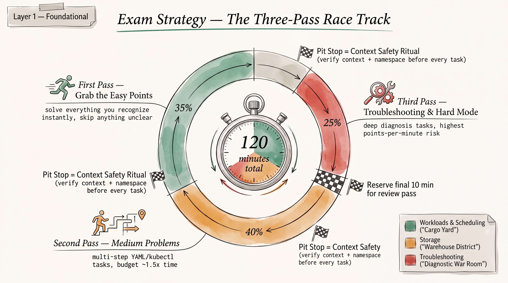
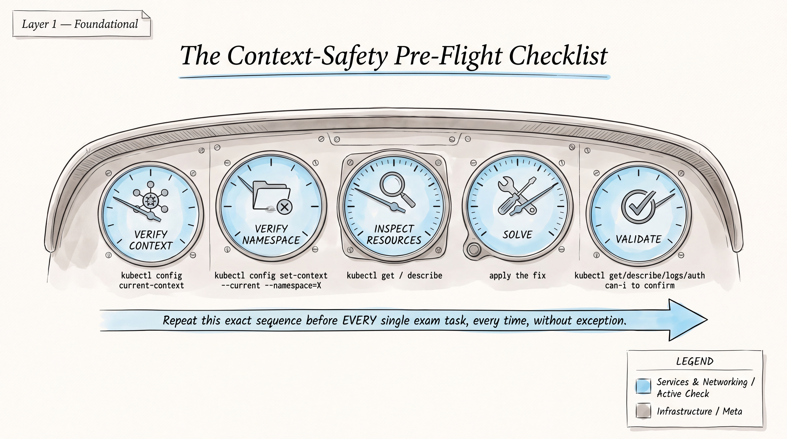

# CKA Exam Strategy — Time Management & Context Safety




*Built directly on the facts in `01-exam-snapshot-and-priorities.md`: 2-hour exam, 15–20 performance-based tasks, 66% pass bar, PSI Bridge delivery, `kubectl` pre-aliased to `k` with autocompletion, `yq`/`curl`/`wget`/man pages available, `sudo -i` available, and the cross-source-confirmed ~7-min/task average time pressure. The goal here is not to prove mastery — it's to maximize points scored inside a hard 120-minute clock. A perfectly-solved task 19 you never reached is worth zero; a partially-correct task 4 you banked in 4 minutes is worth real points.*

---

## Core principle: optimize for points, not completeness

Every task on the CKA carries an explicit point weight (visible in the task UI), and weights are **not equal** — a one-line `kubectl label` fix can be worth the same or more than a multi-step kubeadm upgrade. Before committing real time to a task, register its point value and let that — not how "interesting" or "solvable" it feels — decide priority order. A candidate who skips two Hard tasks entirely but banks all 13–16 remaining tasks cleanly will beat a candidate who solves 10 tasks perfectly and burns the clock fighting task 11.

This document assumes you already have the domain knowledge (see `01-exam-snapshot-and-priorities.md` and `02-topics/`). What follows is the meta-skill: **triage, sequencing, and not bleeding time**.

---

## The Three-Pass Framework

### Pass 0 — Initial scan (2–3 minutes, before solving anything)

Do not start solving task 1 immediately. Spend 2–3 minutes clicking through **every** task in the exam UI (left-hand task list in PSI Bridge) and, for each, jot on your scratch pad (or just mentally tag):

- Task number, point value, and **cluster/context** it targets (CKA exams run multiple clusters/contexts — tasks jump between them, they are not sequential by cluster)
- A one-word category tag: `etcd`, `kubeadm`, `RBAC`, `netpol`, `storage`, `troubleshoot`, `sched`, `helm/kustomize`
- A gut-feel difficulty flag: **E** (easy, instantly know the command), **M** (medium, need to think or look something up), **H** (hard/open-ended, e.g. "the cluster is broken, fix it")

This scan costs 2–3 minutes out of 120 (~2%) and pays for itself many times over — it prevents the single biggest time-waster: discovering task 14 was a 2-point trivial relabel *after* you've already burned 20 minutes stuck on task 6. Do **not** read every task in deep detail during this pass — just enough to tag it. Deep reading happens when you actually start the task.

### Pass 1 — First Pass: high-confidence easy points (target: ~45–50 minutes)

Work every task tagged **E** first, in whatever order groups by context/cluster (minimize context-switching overhead — see the ritual below). These are the tasks where you know the exact command or YAML shape without hesitation: Service creation, ConfigMap/Secret creation, basic Deployment scaling, straightforward RBAC Role/RoleBinding, a single-fault static-pod fix, a `kubectl label`/`taint` one-liner, cordoning a node.

- Cap each E-task at **5 minutes**. If an "easy" task is fighting you past 5 minutes, it was mis-tagged — downgrade it to M and move on (see abandonment rule below).
- Run the full **Context Safety Ritual** (below) before every single task, no exceptions, even ones that look trivial — most real point loss on "easy" tasks comes from solving the right YAML in the wrong namespace/context, not from wrong syntax.
- Bank points fast. By the end of Pass 1 you want 40–55% of total available points already secured with time still on the clock.

### Pass 2 — Second Pass: medium problems (target: ~40–45 minutes)

Move to **M**-tagged tasks: kubeadm upgrade sequencing, etcd backup/restore, NetworkPolicy with multiple peers, node affinity/anti-affinity, Kustomize overlays, multi-object storage (PV+PVC+StorageClass chains), CRD/operator behavior checks.

- Cap each M-task at **10–12 minutes** of active work. If you hit the cap without a working solution, apply the abandonment rule — flag it and move on. Coming back with fresh eyes after clearing more of the list is almost always faster than tunnel-visioning.
- These tasks are where allowed documentation (`kubernetes.io/docs/`, `helm.sh/docs/`, `gateway-api.sigs.k8s.io/` for CKA) earns its keep — don't be a hero and try to recall exact YAML fields from memory if a 30-second in-page doc search resolves it. But cap doc lookups too: if in-page search isn't surfacing the answer in ~60–90 seconds, your search terms are wrong — try the object kind + one exact field name instead of a prose question.

### Pass 3 — Third Pass: troubleshooting / hard problems (target: remaining time, ~20–30 minutes)

Only reach for **H**-tagged tasks once Pass 1 and Pass 2 have banked everything they can. These are open-ended diagnostic tasks (control-plane down, kubelet won't join, CNI misconfigured, cascading RBAC/NetworkPolicy interaction) where time cost is unpredictable and failure risk is highest.

- No hard time cap here beyond "whatever's left on the clock minus your final review reserve" — but work top-down by point value among the H tasks, not by task number.
- Use the standard troubleshooting order from `02-topics/troubleshooting-playbook.md` (events → logs → describe → crictl/journalctl) rather than guessing — random exploration on a hard task is exactly how 25 minutes disappears with nothing to show.
- If a hard task requires a fix you've only half-diagnosed with 3 minutes left before your review-reserve cutoff, apply a **partial-credit save**: commit whatever partial state you have (e.g., the manifest edit applied even if the pod isn't yet Running) rather than leaving the object completely untouched — some rubrics award partial credit for partially-correct object state, none award credit for an unattempted task.

---

## Skip and flag mechanics

**When to skip immediately (don't even start the clock on it):** the task's point value is low (visible in the UI) *and* your Pass-0 tag was H. Low-value + hard is the worst points-per-minute ratio on the exam — defer it to Pass 3 unconditionally.

**When to abandon a task already in progress:**
- E-task past 5 minutes with no working solution → abandon.
- M-task past 10–12 minutes with no working solution → abandon.
- Any task where you've made **three consecutive failed attempts** at the same fix (reapplying the same YAML, retrying the same command) → abandon regardless of elapsed time. Repeating the same failed approach is a sunk-cost trap, not persistence.

**How to flag for return (PSI Bridge mechanics):**
- Use the exam UI's own "flag"/"mark for review" control on the task list if the platform provides one (confirm this is present during your Pass-0 scan — don't assume, verify by right-clicking or checking the task-list sidebar the moment the exam starts).
- Regardless of the UI flag, keep your own scratch-pad line per abandoned task: task number, point value, context/cluster name, and **exactly where you got stuck** (e.g., "Task 11 — etcd restore — apiserver won't come back up after restore, check `--data-dir` flag matches new snapshot dir"). When you return in Pass 2/3, this one line saves you from re-diagnosing from scratch.
- Before abandoning, leave the resource state as close to correct as you got it — don't `kubectl delete` your half-fix on the way out unless it's actively breaking something else needed for a later task.

---

## Time budget summary

| Phase | Target duration | Cumulative clock | Purpose |
|---|---|---|---|
| Pass 0 — scan & tag | 2–3 min | ~0:03 | Triage every task by point value, context, difficulty |
| Pass 1 — Easy tasks | 45–50 min | ~0:50–0:55 | Bank 40–55% of points fast, low risk |
| Pass 2 — Medium tasks | 40–45 min | ~1:30–1:40 | Bank the bulk of remaining points |
| Pass 3 — Hard/troubleshooting | remaining time to ~1:50–1:52 | ~1:50–1:52 | Attack highest-value hard tasks in point order |
| **Final review reserve** | **8–10 min** | **2:00** | Re-verify flagged/uncertain tasks, re-run validation commands |

**Final review reserve (last 8–10 minutes):** do not spend this attempting a new hard task cold. Spend it exclusively on:
1. Re-running the **Validation Habit** commands (below) against every task you marked uncertain, especially ones you solved fast in Pass 1 under time pressure — cross-context mistakes hide well.
2. Confirming nothing was left in a broken intermediate state (e.g., a node still cordoned that should have been uncordoned, a scaled-to-zero Deployment you forgot to scale back).
3. Double-checking you solved each task **in the context/cluster the task actually specified** — the single most common late-exam error under fatigue.

---

## The Context Safety Ritual (run before EVERY question)

CKA tasks frequently specify a target cluster/context and/or namespace explicitly in the prompt, and PSI Bridge exams commonly involve more than one cluster. Solving a perfectly correct manifest in the wrong context scores zero. Run this exact 5-step ritual before touching any resource, no matter how trivial the task looks:

**1. Verify and switch context**
```bash
k config get-contexts
k config use-context <context-name-from-task>
k config current-context
```
Confirm `current-context` echoes back exactly what the task specified before proceeding — do not trust that the previous task left you in the right place.

**2. Verify namespace**
```bash
k config set-context --current --namespace=<ns-from-task>
k get ns
k config view --minify | grep namespace
```
If the task doesn't name a namespace explicitly, don't assume `default` — re-read the task for an implied namespace (e.g., "the `payments` deployment" implies you should check which namespace it actually lives in via `k get deploy -A | grep payments` first).

**3. Inspect existing resources before changing anything**
```bash
k get all -n <ns>
k get <kind> <name> -n <ns> -o yaml
k describe <kind> <name> -n <ns>
```
Never blind-`apply` a manifest you generated from a template without first confirming the existing object's current state — you may be about to overwrite fields (labels, selectors, existing env vars) the task expects you to preserve.

**4. Solve**
Generate, don't hand-write, per the priority matrix's standing guidance:
```bash
k create deployment ... --dry-run=client -o yaml > /tmp/task.yaml
k run ... --dry-run=client -o yaml > /tmp/task.yaml
k get <kind> <name> -o yaml > /tmp/task.yaml   # for editing an existing object
```
Edit the generated YAML, then:
```bash
k apply -f /tmp/task.yaml
```

**5. Validate before moving on**
```bash
k get <kind> <name> -n <ns> -o wide
k describe <kind> <name> -n <ns>
```
See the Validation Habit section below for task-type-specific checks — "it applied without an error" is not the same as "it did what the task asked."

**Ritual time cost:** steps 1–2 take under 15 seconds once muscle memory; do not skip them to save time — the failure mode they prevent (right YAML, wrong cluster/namespace) is a full zero on that task's points, which costs far more than 15 seconds.

---

## Validation Habit — exact commands per task type

Applying a manifest is not the task. The task is the *end state* the prompt describes. Run the matching validation block below before marking any task done in your head and moving on.

### Workload tasks (Pods, Deployments, ReplicaSets, DaemonSets, Jobs/CronJobs, HPA)
```bash
k get pods -n <ns> -o wide                     # confirm Running/Ready, correct node placement
k get deploy <name> -n <ns> -o wide             # confirm READY x/x matches desired replicas
k describe pod <name> -n <ns>                   # check Events for ImagePullBackOff, scheduling failures
k logs <pod> -n <ns> [-c <container>]           # confirm the app actually started, not just scheduled
k get hpa -n <ns>                               # confirm target metric + min/max if HPA was in scope
k rollout status deployment/<name> -n <ns>      # confirm rollout actually completed, not stuck mid-update
```

### Networking tasks (Services, NetworkPolicy, Ingress, Gateway API, DNS)
```bash
k get svc,endpoints <name> -n <ns>              # empty ENDPOINTS = selector/label mismatch, near-guaranteed trap
k describe svc <name> -n <ns>                   # confirm Selector matches pod labels exactly
k run tmp-curl --rm -it --image=busybox:1.36 --restart=Never -n <ns> -- wget -qO- <svc>.<ns>.svc.cluster.local:<port>
k exec -it <pod> -n <ns> -- curl -s <target>:<port>          # in-cluster connectivity check
k get networkpolicy -n <ns> -o yaml             # re-check policyTypes explicitly lists ingress/egress you intended
k exec -it <pod> -n <ns> -- nslookup kubernetes.default        # baseline DNS sanity check
k get pods -n kube-system -l k8s-app=kube-dns   # CoreDNS pods actually Running if DNS itself was in scope
```

### Storage tasks (PV, PVC, StorageClass, volumes)
```bash
k get pv,pvc -n <ns>                            # confirm STATUS is Bound, not Pending
k describe pvc <name> -n <ns>                   # Pending? check Events for the exact binding-criteria mismatch
k get storageclass                              # confirm which SC is (default) if task relies on default-SC behavior
k exec -it <pod> -n <ns> -- df -h <mountPath>   # confirm the volume is actually mounted where expected
k exec -it <pod> -n <ns> -- touch <mountPath>/testfile   # confirm write access matches intended accessMode
```

### RBAC / auth tasks (Roles, ClusterRoles, Bindings, ServiceAccounts)
```bash
k auth can-i <verb> <resource> --as=<user-or-sa> -n <ns>
k auth can-i <verb> <resource> --as=system:serviceaccount:<ns>:<sa-name> -n <ns>
k auth can-i --list --as=<user-or-sa> -n <ns>   # full effective-permissions view, catches over/under-grants
k describe role,rolebinding <name> -n <ns>      # confirm roleRef and subjects exactly match the task's ask
k describe clusterrole,clusterrolebinding <name>
```
Remember the `can-i` no-namespace-flag trap from the question bank: omitting `-n` checks against your *current* namespace context, not necessarily the one the task cares about — always pass `-n` explicitly when validating.

### Cluster admin tasks (kubeadm, etcd, certs, static pods, node lifecycle)
```bash
k get nodes -o wide                             # confirm Ready + correct version post-upgrade/join
kubeadm version ; kubectl version --short 2>/dev/null || kubectl version
k get pods -n kube-system -o wide               # confirm control-plane static pods Running post-change
etcdctl endpoint health --endpoints=<ep> --cacert=<ca> --cert=<cert> --key=<key>   # after backup, cluster still healthy
etcdutl snapshot status <file>.db               # after restore, sanity-check snapshot metadata
kubeadm certs check-expiration                  # after any cert operation
journalctl -u kubelet -n 50 --no-pager          # after any node/kubelet-level fix
crictl ps -a                                    # confirm container runtime sees expected containers post-fix
```

**Universal closing check for every task, regardless of type:** re-run `k get <kind> -n <ns>` (or the cluster-scoped equivalent) one final time and read the output as if you were the grader — does it show exactly what the prompt asked for, in the exact namespace/context named, with no leftover broken state from earlier attempts? If yes, move to the next task. If you're not sure, that uncertainty is itself the signal to spend 30 more seconds validating rather than assuming.
