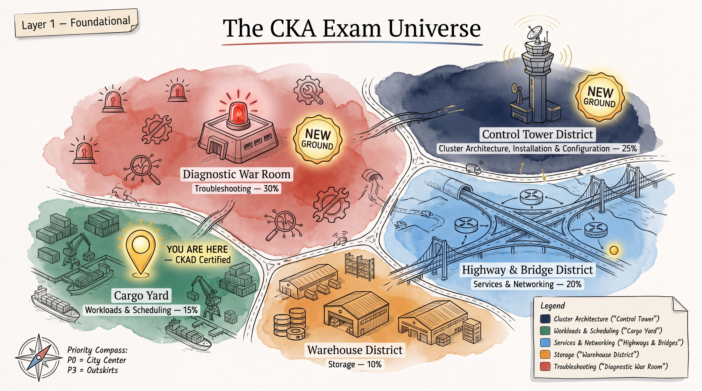

# CKA Study Program — Index

**Status: Phase 1 and Phase 2 complete.** This repo folder implements the research + rapid-refresh phases (Phase 1, roughly phases 1–10) *and* the practice/drilling/exam-simulation build-out (Phase 2, roughly phases 13–22) of the full CKA prep mission specified in [`researchtopic.txt`](./researchtopic.txt) — the deep-research brief that defines the complete 22-phase program (exam snapshot → community intel → priority matrix → topic refresh → command muscle memory → docs navigation → 100+ question bank → micro drills → troubleshooting scenarios → mock exams → study-day plans → cheat sheet → exam strategy → final-48-hours plan → GO/NO-GO gate). Phase 1 is the research and knowledge-refresh foundation; Phase 2 is the hands-on drilling, scenario, mock-exam, and readiness-gating layer built on top of it. See "Phase 2 Completion Audit" below for exactly what was verified before marking it done.

---

## Executive Summary

You don't need to re-learn Kubernetes — the CKAD baseline (Deployments, Services, ConfigMaps/Secrets, probes, basic NetworkPolicy) overlaps heavily with the lower-weighted CKA domains, and you already have that cold. What's actually being tested now is **administrator judgment under time pressure**: Troubleshooting is the single largest domain at 30% (the domain every independently-fetched 2026 source converges on), and Cluster Architecture, Installation & Configuration is 25%. Cluster Architecture is almost entirely new ground for a CKAD holder; within Troubleshooting, control-plane/node/CNI/kubelet diagnosis is the genuinely new part, while two of its five official bullets (monitoring resource usage, evaluating container logs) are app-level skills already exercised routinely from CKAD.

Highest-leverage prep: real `kubeadm` reps on actual multi-node VMs (not kind/minikube, which abstract away exactly what's tested), drilled until `kubeadm init/join/upgrade`, etcd snapshot backup/restore, cert inspection, and kubelet/CNI/DNS diagnosis are muscle memory rather than lookups. Generate YAML, don't hand-write it (`--dry-run=client -o yaml`, `kubectl get -o yaml`) — this matches the CKAD-era workflow already in use. Two nuances to internalize early: `etcdctl` backs up, `etcdutl` restores (not interchangeable), and Kustomize has no exam-allowed documentation domain, so `kubectl apply -k` fluency must be memorized, not looked up. Finally, treat the exam's Kubernetes version target (v1.35 per official pages as of 2026-08-15, with v1.36 already GA) as a moving target — re-verify on the live LF page within a week or two of booking.

Full detail, the verified exam snapshot table, "what changed recently," community intelligence, and the complete P0–P3 priority matrix live in [`01-exam-snapshot-and-priorities.md`](./01-exam-snapshot-and-priorities.md).

Phase 2 turns that priority matrix into reps: 127 original question-bank items, 69 micro-drills, 41 troubleshooting scenarios, 3 full 100-point mock exams, three ready-to-run study plans, and a strategy/mistakes/final-48-hours/GO-NO-GO layer that gates whether you should actually book the exam. File-by-file detail is in the File Index below.

---

## File Index

### Research (raw, validated)
| File | Contents |
|---|---|
| [`research/00-official-exam-snapshot.md`](./research/00-official-exam-snapshot.md) | Fact-checked pull of official LF/CNCF exam facts — domain weights, version, duration, passing score, delivery platform, allowed docs, retake/cert-validity rules, simulator details; every claim re-fetched directly from primary LF/CNCF pages on 2026-08-15. |
| [`research/01-reddit-community-intel.md`](./research/01-reddit-community-intel.md) | Fact-checked pass on community/forum-reported patterns; flags that Reddit itself was unfetchable in this environment, so findings are reframed around underlying competencies and cross-checked against fully-read blog sources instead of unverifiable thread citations. |
| [`research/02-blogs-and-articles.md`](./research/02-blogs-and-articles.md) | Analysis of fully-read (not just cited) 2026 blog/dev.to articles on the current CKA exam, cross-checked against official sources where possible. |
| [`research/03-github-and-lab-resources.md`](./research/03-github-and-lab-resources.md) | GitHub API-verified survey of public CKA lab repos/practice material, plus fetch-based verification of official curriculum pages. |
| [`research/04-lab-platforms-comparison.md`](./research/04-lab-platforms-comparison.md) | Comparison of practice/lab platforms (killer.sh, Killercoda, KodeKloud, etc.) for realism, cost, and best-use strategy. |

### Executive Summary & Priorities
| File | Contents |
|---|---|
| [`01-exam-snapshot-and-priorities.md`](./01-exam-snapshot-and-priorities.md) | The synthesized executive summary, verified current exam snapshot table, "what changed recently" (outdated advice vs. newer must-know areas), community intelligence signal-strength table, and the full P0–P3 skill priority matrix. This is the primary entry point for the whole research phase. |

### Topic Refreshers (`02-topics/`)
| File | Contents |
|---|---|
| [`cluster-architecture-kubeadm-etcd.md`](./02-topics/cluster-architecture-kubeadm-etcd.md) | Cluster Architecture, Installation & Configuration (25%) — kubeadm init/join/upgrade, static pods, certificate management, etcd backup/restore; rapid refresh + original task patterns. |
| [`workloads.md`](./02-topics/workloads.md) | Workloads half of the 15% Workloads & Scheduling domain — Deployments/ReplicaSets/DaemonSets/Jobs/CronJobs refresh, StatefulSet mechanics, native sidecars, Job completion modes. |
| [`scheduling.md`](./02-topics/scheduling.md) | Scheduling half of the 15% domain — node/pod affinity, taints/tolerations, resource requests/limits, priority classes, admission-and-scheduling curriculum bullet. |
| [`networking.md`](./02-topics/networking.md) | Services & Networking (20%) — Services, DNS/CoreDNS, NetworkPolicy, Ingress, Gateway API/HTTPRoute, CNI troubleshooting basics. |
| [`storage.md`](./02-topics/storage.md) | Storage (10%, smallest domain) — PV/PVC, StorageClass, access modes, reclaim policy, dynamic/static provisioning, admin-side focus. |
| [`rbac.md`](./02-topics/rbac.md) | RBAC — Roles/ClusterRoles/Bindings, ServiceAccounts, `kubectl auth can-i`, impersonation, fast `Forbidden`-error diagnosis. |
| [`troubleshooting-playbook.md`](./02-topics/troubleshooting-playbook.md) | Troubleshooting (30%, largest domain) — master decision tree plus control-plane/kubelet/CNI/DNS/static-pod/certificate diagnosis patterns via logs, events, `crictl`, `journalctl`. |

### Cheatsheets (`03-cheatsheets/`)
| File | Contents |
|---|---|
| [`command-muscle-memory.md`](./03-cheatsheets/command-muscle-memory.md) | High-value `kubectl`/imperative-generator command drills (get, describe, logs, exec, run, scale, rollout, patch, taint, drain, cordon, auth can-i, etc.) assuming the exam's pre-aliased `k` and `$do` shortcut. |
| [`docs-navigation-and-linux.md`](./03-cheatsheets/docs-navigation-and-linux.md) | Map of where each needed example lives in the exam-allowed docs (`kubernetes.io/docs`, `gateway-api.sigs.k8s.io`), plus one-line refreshers for exam-relevant Linux/sysadmin commands. |

### Question Bank & Drills (`04-question-bank/`)
127 original question-bank items across 5 domain files, plus a 69-item micro-drill deck and 41 troubleshooting scenarios across 2 files — 237 original hands-on items total in this directory. See "Phase 2 Completion Audit" below for how these counts were verified.

| File | Contents |
|---|---|
| [`01-cluster-architecture-maintenance.md`](./04-question-bank/01-cluster-architecture-maintenance.md) | 25 questions (17 P0 · 6 P1 · 2 P2) — kubeadm init/join/upgrade, static pods, certificates, etcd, node drain/cordon. |
| [`02-workloads-scheduling.md`](./04-question-bank/02-workloads-scheduling.md) | 25 questions (5 P0 · 11 P1 · 9 P2) — Deployments/StatefulSets/Jobs/CronJobs, rollouts, probes, affinity/taints, priority classes, HPA. |
| [`03-networking.md`](./04-question-bank/03-networking.md) | 24 questions (5 P0 · 17 P1 · 2 P2) — Services, DNS/CoreDNS, NetworkPolicy, Ingress, Gateway API/HTTPRoute. |
| [`04-storage-rbac.md`](./04-question-bank/04-storage-rbac.md) | 24 questions (13 P0 · 5 P1 · 6 P2) — 11 Storage (PV/PVC/StorageClass) + 13 RBAC (ServiceAccounts, Roles, Bindings, `auth can-i`). |
| [`05-troubleshooting.md`](./04-question-bank/05-troubleshooting.md) | 29 questions (19 P0 · 7 P1 · 3 P2) — control-plane/kubelet/static-pod/certificate/etcd/DNS diagnosis, the largest exam domain. |
| [`06-micro-drills.md`](./04-question-bank/06-micro-drills.md) | 69 pure command-recall drills across 30-second/1/2/3/5-minute tiers, tallied by domain against the priority matrix. |
| [`07-troubleshooting-scenarios-workload-network-storage.md`](./04-question-bank/07-troubleshooting-scenarios-workload-network-storage.md) | 20 "symptom only" broken-cluster scenarios spanning Workloads, Scheduling, Networking, and Storage. |
| [`08-troubleshooting-scenarios-cluster-security.md`](./04-question-bank/08-troubleshooting-scenarios-cluster-security.md) | 21 "broken cluster" scenarios spanning control-plane, kubelet, DNS, RBAC, certs, and etcd. |

### Mock Exams (`05-mock-exams/`)
Three full, timed, 120-minute mock exams of increasing difficulty, each independently scored to exactly 100 points and weighted to the official domain split (Troubleshooting 30 / Cluster Architecture 25 / Networking 20 / Workloads & Scheduling 15 / Storage 10).

| File | Contents |
|---|---|
| [`mock-exam-1-normal.md`](./05-mock-exams/mock-exam-1-normal.md) | 18 tasks, 100 points. On-ramp difficulty — mostly single-root-cause faults, generous time-per-task. |
| [`mock-exam-2-real-difficulty.md`](./05-mock-exams/mock-exam-2-real-difficulty.md) | 19 tasks, 100 points. Calibrated to match real-exam pacing (~6–7 min/task) and difficulty — the load-bearing mock for GO/NO-GO Gate 3. |
| [`mock-exam-3-hard-mode.md`](./05-mock-exams/mock-exam-3-hard-mode.md) | 20 tasks, 100 points. Deliberately harder than the real exam — stacked/compound faults, tighter pacing, intentionally ambiguous task text. |

### Strategy & Readiness (`06-strategy/`)
| File | Contents |
|---|---|
| [`study-plans-7-14-21-day.md`](./06-strategy/study-plans-7-14-21-day.md) | 7-day intensive, 14-day balanced, and 21-day thorough study plans, each with day-by-day (or week-by-week) breakdowns pointing at specific files and question numbers already in this repo. |
| [`exam-strategy-time-management.md`](./06-strategy/exam-strategy-time-management.md) | The Three-Pass Framework (initial scan → easy points → medium → hard/troubleshooting), skip-and-flag mechanics, time budget summary, the Context Safety Ritual, and per-task-type validation habits. |
| [`30-exam-mistakes-traps.md`](./06-strategy/30-exam-mistakes-traps.md) | Exactly 30 named exam mistakes/traps, ordered by where in the exam flow you'd hit them, each with the one-line habit that prevents it. |
| [`final-48-hours-plan.md`](./06-strategy/final-48-hours-plan.md) | Countdown plan with 48-hours-before, 24-hours-before, morning-of, and 30-minutes-before checklists. |
| [`go-no-go-checklist.md`](./06-strategy/go-no-go-checklist.md) | Objective, measurable pass-likelihood gate (environment sanity, P0 question-bank coverage, named-skill timing thresholds, mock-exam score minimums, optional killer.sh gate, final-week sanity checks) — every threshold ties to a specific file/question count that was cross-checked against the actual content (see audit below). |

### Final Cheat Sheet
| File | Contents |
|---|---|
| [`07-final-cheat-sheet.md`](./07-final-cheat-sheet.md) | The single consolidated, ultra-compact reference for the last hour before the exam — aliases/env vars, highest-frequency `kubectl` one-liners, imperative generators, YAML skeletons worth memorizing (NetworkPolicy, PV/PVC, affinity, RBAC, StatefulSet headless Service, Gateway API HTTPRoute), Linux/`crictl`/`journalctl` node-level commands, `kubeadm`/etcd commands, a troubleshooting symptom→cause map, and a documentation-search-keyword table. Distinct from the two topic-level cheatsheets in `03-cheatsheets/`. |

### Source Brief
| File | Contents |
|---|---|
| [`researchtopic.txt`](./researchtopic.txt) | The original 22-phase deep-research mission brief that defines the entire CKA prep program (this repo now implements Phases 1 and 2 of it). |

---

## Visual Companion (`images/`)

21 original, hand-sketched-style illustrated diagrams, generated at 4K resolution with `gemini-3-pro-image-preview` via `scripts/generate_cka_diagrams.py`. Theme: "Kubernetes Control Tower" — the cluster as a port city (Control Tower = control plane, Cargo Yard = Workloads & Scheduling, Highways & Bridges = Services & Networking, Warehouse District = Storage, Security Checkpoint = RBAC, Diagnostic War Room = Troubleshooting). Every diagram is captioned with the real Kubernetes object names/commands alongside the metaphor, and tagged by complexity layer (Foundational / Operational / Exam-Critical) so you can tell at a glance how deep it goes. Each image is already embedded inline in its matching topic file — this list is just the full index. All 21 were manually reviewed for technical accuracy after generation; no errors were found.

| # | Image | Embedded in |
|---|---|---|
| 00 | [The CKA Exam Universe](./images/cka-00-exam-universe-map.jpg) | `README.md` (top) |
| 00b | [Exam Strategy — The Three-Pass Race Track](./images/cka-00b-three-pass-race-track.jpg) | `06-strategy/exam-strategy-time-management.md` |
| 00c | [The Context-Safety Pre-Flight Checklist](./images/cka-00c-context-safety-preflight-checklist.jpg) | `06-strategy/exam-strategy-time-management.md` |
| 01 | [Control Plane — Inside the Control Tower](./images/cka-01-control-plane-cross-section.jpg) | `02-topics/cluster-architecture-kubeadm-etcd.md` |
| 02 | [kubeadm — Assembling the Control Tower](./images/cka-02-kubeadm-bootstrap-assembly-line.jpg) | `02-topics/cluster-architecture-kubeadm-etcd.md` |
| 03 | [etcd — Vault Deposits and Withdrawals](./images/cka-03-etcd-vault-backup-restore.jpg) | `02-topics/cluster-architecture-kubeadm-etcd.md` |
| 04 | [Static Pods — The Foreman's Bulletin Board](./images/cka-04-static-pod-mechanism.jpg) | `02-topics/cluster-architecture-kubeadm-etcd.md` |
| 05 | [Certificates — The Badge Issuing Office](./images/cka-05-certificate-trust-chain.jpg) | `02-topics/cluster-architecture-kubeadm-etcd.md` |
| 06 | [Workloads — The Cargo Family Tree](./images/cka-06-workload-family-tree.jpg) | `02-topics/workloads.md` |
| 07 | [Rolling Updates & Rollback — The Conveyor Belt](./images/cka-07-rolling-update-conveyor.jpg) | `02-topics/workloads.md` |
| 08 | [Probes — Health Checkpoints on the Line](./images/cka-08-probes-health-checkpoints.jpg) | `02-topics/workloads.md` |
| 09 | [Scheduling — The Matchmaker & the Bouncers](./images/cka-09-scheduling-matchmaking.jpg) | `02-topics/scheduling.md` |
| 10 | [Services — The Layered Highway System](./images/cka-10-services-highway-system.jpg) | `02-topics/networking.md` |
| 11 | [DNS — The CoreDNS Post Office](./images/cka-11-dns-resolution-post-office.jpg) | `02-topics/networking.md` |
| 12 | [NetworkPolicy — The Security Gates](./images/cka-12-networkpolicy-security-gates.jpg) | `02-topics/networking.md` |
| 13 | [Ingress vs Gateway API — Two Generations of Bridges](./images/cka-13-gateway-api-vs-ingress-bridges.jpg) | `02-topics/networking.md` |
| 14 | [Storage — The Warehouse Requisition Office](./images/cka-14-storage-warehouse-requisition.jpg) | `02-topics/storage.md` |
| 15 | [RBAC — The Security Checkpoint HQ](./images/cka-15-rbac-security-badges.jpg) | `02-topics/rbac.md` |
| 16 | [The Master Troubleshooting Decision Tree](./images/cka-16-troubleshooting-decision-tree.jpg) | `02-topics/troubleshooting-playbook.md` |
| 17 | [Pod Lifecycle — The Diagnostic Dashboard](./images/cka-17-pod-lifecycle-traffic-lights.jpg) | `02-topics/troubleshooting-playbook.md` |
| 18 | [Node NotReady — The Mechanic's Garage](./images/cka-18-node-notready-triage.jpg) | `02-topics/troubleshooting-playbook.md` |

To regenerate or add more: `python CKA/scripts/generate_cka_diagrams.py` (skips existing files) or `python CKA/scripts/generate_cka_diagrams.py <key>` to force-regenerate a specific one (keys are the `diagram("key", ...)` first arguments in the script).

---

## Phase 2 Completion Audit

This section records an honest, count-based audit of the Phase 2 deliverables — not just a checklist tick. Every number below was independently counted from the files themselves (heading counts, priority-tag counts, task-point sums), not taken from the files' own claimed totals.

**Question bank — target 100+, delivered 127.** Verified by counting `### Question N` headings in each of the 5 domain files: `01`=25, `02`=25, `03`=24, `04`=24, `05`=29 → 127 total, sequential and gap-free in every file. Priority-tag counts (`**Priority:** P0/P1/P2`) were also individually counted and cross-checked against each file's own stated distribution and against the P0/P1 totals cited in `06-strategy/go-no-go-checklist.md` (17+5+5+13+19 = 59 P0 items; 6+11+17+5+7 = 46 P1 items) — both matched exactly.

**Micro-drills — target 50+, delivered 69.** Verified by counting numbered drill items across all five time tiers (30-sec/1/2/3/5-min); matches the file's own "Drill Count by Domain" calibration table (69 total).

**Troubleshooting scenarios — target 30+, delivered 41.** Verified by counting `### Scenario N` headings: 20 in `07-...workload-network-storage.md` + 21 in `08-...cluster-security.md`.

**Mock exams — target 3, delivered 3.** Verified task counts by counting `## Task N` headings (each appears twice per file: once in the task list, once in the answer key) and confirmed each exam's point values sum to exactly 100: Mock 1 = 18 tasks/100 pts, Mock 2 = 19 tasks/100 pts, Mock 3 = 20 tasks/100 pts — all within the official 15–20 task range.

**Study plans, strategy, mistakes list, final-48-hours, GO/NO-GO — all present and structurally complete.** 7/14/21-day plans each have full day-by-day (21-day: week-by-week) breakdowns; `30-exam-mistakes-traps.md` contains exactly 30 numbered entries (counted, not assumed); `final-48-hours-plan.md` contains all four promised checkpoints (48h / 24h / morning-of / 30-min-before); `go-no-go-checklist.md`'s per-file P0/P1 thresholds were cross-checked against the real counts above and are accurate.

**Final cheat sheet — present, comprehensive, distinct from the Phase-1 cheatsheets** (428 lines covering aliases, `kubectl` one-liners, imperative generators, memorized YAML skeletons, Linux/`crictl`/etcd/`kubeadm` commands, a troubleshooting map, and a docs-search-keyword table).

**Shortfall / issue found and fixed:** `04-question-bank/07-troubleshooting-scenarios-workload-network-storage.md`'s intro paragraph did not state its scenario count (its sibling file, `08-...cluster-security.md`, states "21 original scenarios," but `07` just said "Original practice scenarios"). Fixed by adding the count ("20 original practice scenarios") for consistency. No other broken links, mis-stated counts, or volume shortfalls were found — every promised minimum was met or exceeded, and the cross-file count claims (question bank P0/P1 totals, the "237 original items across 8 files" figure in `study-plans-7-14-21-day.md`, and each mock exam's 100-point total) were independently re-derived from the raw content and confirmed accurate rather than trusted at face value.

---

## Sources

Key citations and dates pulled from the research files (all research compiled/fact-checked 2026-08-15):

- **Linux Foundation training/program page** — domain weights (Troubleshooting 30%, Cluster Architecture 25%, Services & Networking 20%, Workloads & Scheduling 15%, Storage 10%), exam duration (2h), passing score (66%), 15–20 performance-based tasks, PSI Bridge delivery platform. *(research/00)*
- **LF FAQ (`docs.linuxfoundation.org/tc-docs/certification/faq-cka-ckad-cks`)** — cert validity (2 years; 3 years if earned before 2024-04-01), one free retake, killer.sh simulator details (2 attempts, 36h access, 17 questions/session), CKA-SINGLE retake purchases exclude simulator access — re-fetched directly during the 2026-08-15 correction pass. *(research/00, 01-exam-snapshot-and-priorities.md)*
- **Official allowed-resources page** — `kubernetes.io/docs/`, `kubernetes.io/blog/`, `helm.sh/docs/`, and `gateway-api.sigs.k8s.io/` (CKA only) permitted; no allowed domain exists for Kustomize. *(research/00)*
- **CKA curriculum PDF (`CKA_Curriculum_v1.35.pdf`)** — confirms exam targets v1.35 as of this writing, despite v1.36 having shipped 2026-06-09 (over 8 weeks prior) — flagged as a possibly-stale/lagging FAQ page, re-verify near booking. *(research/00, 03)*
- **`chadmcrowell/CKA-Exercises`** (GitHub, last pushed 2025-10-08) — cited as an example of outdated "exam is on v1.31/v1.32" prose still circulating in recently-pushed repos. *(research/01, 03)*
- **`labs.play-with-k8s.com`** — confirmed dead via its own on-site banner, unavailable since 2026-03-01. *(research/02)*
- **passitexams.com article (Jan 2026)** — independently fetched and fully read; states killer.sh is "intentionally more difficult" than the real exam, and that ~7 min/task average is the most commonly cited time-pressure complaint. *(research/02)*
- **Two independently-fetched, fully-read 2026 blog/dev.to articles** — converge (without citing each other) on control-plane/kubelet/node/CNI/DNS troubleshooting via logs/events as the dominant exam time-sink, and both independently recommend generating YAML via `--dry-run=client -o yaml` rather than hand-writing it. *(research/01, 02)*
- **etcd v3.5 release notes / kubeadm etcd docs** — basis for the `etcdctl snapshot save` (backup) vs. `etcdutl snapshot restore` (restore) tool-boundary split; `etcdctl`'s own restore subcommand deprecated/removed since v3.5. *(research/00, 02-topics/cluster-architecture-kubeadm-etcd.md)*
- **Kubernetes v1.24 removal of dockershim (2022)** and **v1.25 removal of PodSecurityPolicy** — cited as reasons two pieces of older community advice (Docker-as-runtime, PSP-as-current-practice) are now outdated. *(research/00, 01-exam-snapshot-and-priorities.md)*
- **CNCF curriculum repo (`github.com/cncf/curriculum`)** — verified addition of Helm/Kustomize (cluster component installation), CRDs/operators, and Gateway API to the curriculum in a window of roughly Feb 2025 (exact date unverified). *(research/03)*

Full sourcing detail, per-claim verification status, and explicit UNVERIFIED/contradicted flags are preserved in the individual `research/00`–`04` files and in the "Sources" section of `01-exam-snapshot-and-priorities.md` — that document's own correction-pass addendum (2026-08-15) should be treated as the canonical record of what was re-verified versus what remains as originally sourced.
