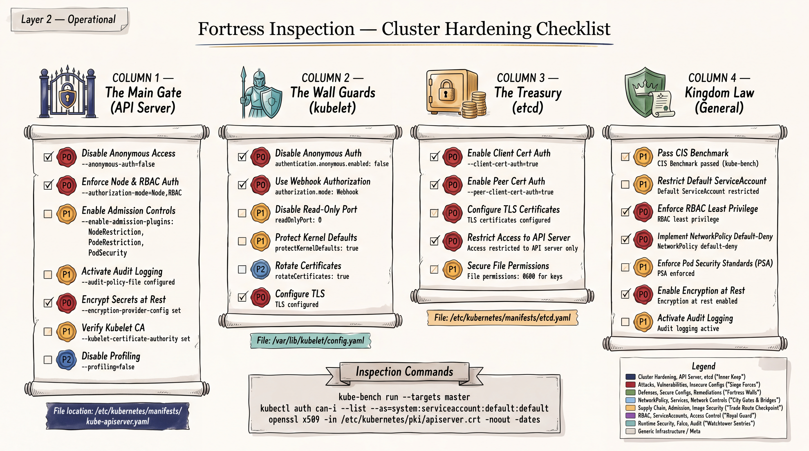
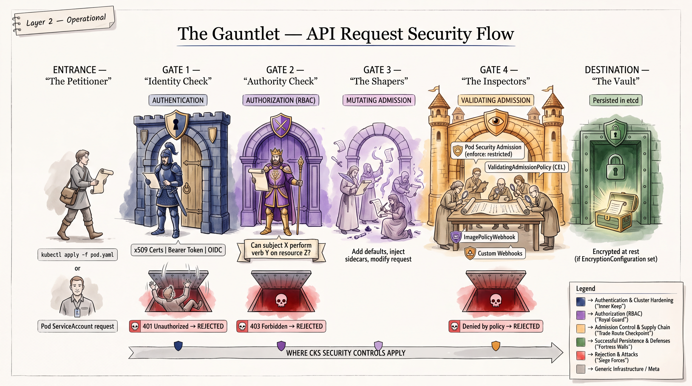
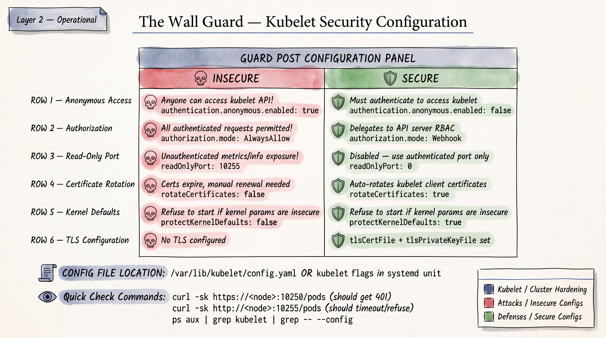
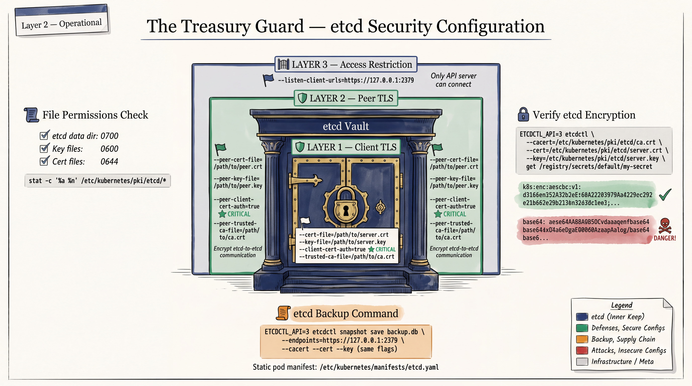
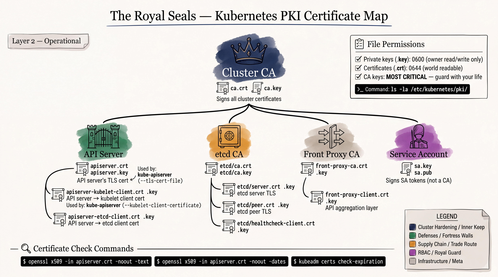

# CKS Exam Preparation: Cluster Hardening






> **Exam Weight:** ~15% of CKS score
> **Author:** Nirbhay Singh | **CKAD:** Certified (valid through Sep 2026)
> **Last Updated:** August 2026
> **CKS Exam Version:** Based on Kubernetes 1.30/1.31 curriculum

---

## Table of Contents

1. [Kubernetes Attack Surface Map](#1-kubernetes-attack-surface-map)
2. [Cluster Setup and Hardening](#2-cluster-setup-and-hardening)
3. [CIS Benchmark High-Value Controls](#3-cis-benchmark-high-value-controls)
4. [kube-bench](#4-kube-bench)

---

## 1. KUBERNETES ATTACK SURFACE MAP

### 1.1 API Server (kube-apiserver)

**Attack Surface:**
The API server is the single entry point for all cluster operations. Every kubectl command, controller action, and kubelet communication passes through it. If compromised, an attacker has full cluster control.

**Common Misconfiguration:**
```
# INSECURE: anonymous auth enabled, no authorization
--anonymous-auth=true
--authorization-mode=AlwaysAllow
--insecure-port=8080          # Deprecated and removed in 1.24+, but tested conceptually
```

**Security Consequence:**
- Unauthenticated users can list secrets, create privileged pods, exfiltrate data
- AlwaysAllow bypasses all RBAC checks
- Any network-reachable client gets cluster-admin equivalent access

**Detection:**
```bash
# Check running API server flags
ps aux | grep kube-apiserver
cat /etc/kubernetes/manifests/kube-apiserver.yaml | grep -E "anonymous-auth|authorization-mode|insecure-port"

# Test anonymous access
kubectl auth can-i --list --as=system:anonymous
curl -k https://<apiserver>:6443/api/v1/namespaces
```

**Remediation:**
```yaml
# /etc/kubernetes/manifests/kube-apiserver.yaml
spec:
  containers:
  - command:
    - kube-apiserver
    - --anonymous-auth=false
    - --authorization-mode=Node,RBAC
    - --enable-admission-plugins=NodeRestriction,PodSecurity
```

**CKS Task Example:**
> "The API server on controlplane node allows anonymous access. Disable anonymous authentication and ensure authorization uses Node,RBAC mode. Verify that anonymous users can no longer list pods."

---

### 1.2 kubelet

**Attack Surface:**
The kubelet runs on every node and manages pod lifecycle. It exposes an HTTPS API (port 10250) and a read-only HTTP API (port 10255). If the kubelet API is unauthenticated, an attacker with network access can execute commands inside any container on that node.

**Common Misconfiguration:**
```
# INSECURE kubelet config
--anonymous-auth=true
--authorization-mode=AlwaysAllow
--read-only-port=10255
```

**Security Consequence:**
- Port 10255 leaks pod metadata (env vars, mount paths, container names) without auth
- Unauthenticated port 10250 allows `exec`, `run`, `logs` on any pod on the node
- Attacker can read secrets mounted in pods, pivot through service accounts

**Detection:**
```bash
# Check kubelet flags
ps aux | grep kubelet
cat /var/lib/kubelet/config.yaml | grep -E "anonymous|authorization|readOnlyPort"

# Test anonymous access to kubelet
curl -sk https://<node-ip>:10250/pods
curl -s http://<node-ip>:10255/pods
```

**Remediation:**
```yaml
# /var/lib/kubelet/config.yaml
apiVersion: kubelet.config.k8s.io/v1beta1
kind: KubeletConfiguration
authentication:
  anonymous:
    enabled: false
  webhook:
    enabled: true
  x509:
    clientCAFile: /etc/kubernetes/pki/ca.crt
authorization:
  mode: Webhook
readOnlyPort: 0
```

```bash
# Restart kubelet after changes
systemctl daemon-reload
systemctl restart kubelet
```

**CKS Task Example:**
> "The kubelet on node01 is configured with anonymous authentication enabled. Update the kubelet configuration to disable anonymous access, enable webhook authentication and authorization, and disable the read-only port. Restart the kubelet and verify the changes."

---

### 1.3 etcd

**Attack Surface:**
etcd stores ALL cluster state: Secrets (base64-encoded), ConfigMaps, RBAC policies, service account tokens, certificates. Direct etcd access bypasses all Kubernetes RBAC.

**Common Misconfiguration:**
```
# INSECURE: No client cert auth, unencrypted communication
--client-cert-auth=false
--peer-client-cert-auth=false
# Missing --trusted-ca-file
# etcd listening on 0.0.0.0:2379 instead of 127.0.0.1
```

**Security Consequence:**
- All secrets readable in plaintext (base64 is encoding, not encryption)
- Cluster state can be modified directly (create admin ClusterRoleBindings)
- Complete cluster takeover without any Kubernetes authentication

**Detection:**
```bash
# Check etcd configuration
cat /etc/kubernetes/manifests/etcd.yaml | grep -E "client-cert-auth|trusted-ca|listen-client"

# Check if etcd is accessible without certs
curl http://127.0.0.1:2379/health

# Read secrets directly from etcd (proves the risk)
ETCDCTL_API=3 etcdctl \
  --endpoints=https://127.0.0.1:2379 \
  --cacert=/etc/kubernetes/pki/etcd/ca.crt \
  --cert=/etc/kubernetes/pki/etcd/server.crt \
  --key=/etc/kubernetes/pki/etcd/server.key \
  get /registry/secrets/default/my-secret
```

**Remediation:**
```yaml
# /etc/kubernetes/manifests/etcd.yaml
spec:
  containers:
  - command:
    - etcd
    - --client-cert-auth=true
    - --peer-client-cert-auth=true
    - --trusted-ca-file=/etc/kubernetes/pki/etcd/ca.crt
    - --cert-file=/etc/kubernetes/pki/etcd/server.crt
    - --key-file=/etc/kubernetes/pki/etcd/server.key
    - --listen-client-urls=https://127.0.0.1:2379
    - --advertise-client-urls=https://127.0.0.1:2379
```

**CKS Task Example:**
> "Verify that etcd is configured with TLS client certificate authentication. Ensure etcd only listens on the loopback interface. Enable encryption at rest for secrets in etcd."

---

### 1.4 Scheduler (kube-scheduler)

**Attack Surface:**
The scheduler determines pod placement. If compromised, an attacker could influence scheduling decisions to place pods on compromised nodes or cause denial of service.

**Common Misconfiguration:**
```
# Binding scheduler health/metrics endpoints to 0.0.0.0
--bind-address=0.0.0.0
# Missing authentication for the scheduler API
```

**Security Consequence:**
- Scheduler metrics exposed to the network can leak cluster topology
- Information about node capacity and pod distribution aids targeted attacks

**Detection:**
```bash
cat /etc/kubernetes/manifests/kube-scheduler.yaml | grep bind-address
curl -sk https://127.0.0.1:10259/healthz
```

**Remediation:**
```yaml
# /etc/kubernetes/manifests/kube-scheduler.yaml
spec:
  containers:
  - command:
    - kube-scheduler
    - --bind-address=127.0.0.1
    - --kubeconfig=/etc/kubernetes/scheduler.conf
    - --authentication-kubeconfig=/etc/kubernetes/scheduler.conf
    - --authorization-kubeconfig=/etc/kubernetes/scheduler.conf
```

**CKS Task Example:**
> "Ensure the kube-scheduler binds only to the loopback address and does not expose metrics to the network."

---

### 1.5 Controller Manager (kube-controller-manager)

**Attack Surface:**
The controller manager runs reconciliation loops (Deployments, ReplicaSets, ServiceAccounts, etc.). It holds the service account signing key and can create tokens.

**Common Misconfiguration:**
```
--bind-address=0.0.0.0
# Not using dedicated service account credentials
--use-service-account-credentials=false
```

**Security Consequence:**
- Exposed metrics/health endpoints leak cluster operational data
- Without `use-service-account-credentials=true`, all controllers share a single overprivileged credential

**Detection:**
```bash
cat /etc/kubernetes/manifests/kube-controller-manager.yaml | grep -E "bind-address|use-service-account"
```

**Remediation:**
```yaml
# /etc/kubernetes/manifests/kube-controller-manager.yaml
spec:
  containers:
  - command:
    - kube-controller-manager
    - --bind-address=127.0.0.1
    - --use-service-account-credentials=true
    - --service-account-private-key-file=/etc/kubernetes/pki/sa.key
    - --root-ca-file=/etc/kubernetes/pki/ca.crt
```

---

### 1.6 Container Runtime

**Attack Surface:**
The container runtime (containerd, CRI-O) executes containers. Vulnerabilities in the runtime can allow container escapes (e.g., CVE-2024-21626 runc breakout, CVE-2020-15257 containerd).

**Common Misconfiguration:**
- Running outdated runtime versions with known CVEs
- Not configuring seccomp/AppArmor defaults
- Using Docker shim (deprecated since K8s 1.24)

**Security Consequence:**
- Container escape to host filesystem and processes
- Privilege escalation to root on the node
- Lateral movement across the cluster

**Detection:**
```bash
# Check runtime version
containerd --version
crictl version
runc --version

# Check for known vulnerable versions
crictl info | grep -i version
```

**Remediation:**
- Keep runtime patched to latest stable version
- Configure default seccomp profile in containerd config:
```toml
# /etc/containerd/config.toml
[plugins."io.containerd.grpc.v1.cri"]
  [plugins."io.containerd.grpc.v1.cri".containerd]
    [plugins."io.containerd.grpc.v1.cri".containerd.default_runtime]
      [plugins."io.containerd.grpc.v1.cri".containerd.default_runtime.options]
        SeccompDefault = true
```

---

### 1.7 Worker Node

**Attack Surface:**
Worker nodes run the kubelet, kube-proxy, container runtime, and all workload pods. Compromising a node gives access to all pods on it, their secrets, service account tokens, and network access to other pods/services.

**Common Misconfiguration:**
- SSH keys with overly broad access
- Unnecessary services running on the node
- Weak file permissions on kubelet credentials
- No OS-level hardening

**Security Consequence:**
- Node compromise leads to pod compromise and lateral movement
- Access to kubelet credentials allows impersonating the node

**Detection:**
```bash
# Check file permissions on sensitive files
ls -la /etc/kubernetes/pki/
ls -la /var/lib/kubelet/
ls -la /etc/kubernetes/manifests/

# Check for unnecessary services
systemctl list-units --type=service --state=running

# Check SSH configuration
cat /etc/ssh/sshd_config | grep -E "PermitRootLogin|PasswordAuthentication"
```

**Remediation:**
```bash
# Restrict file permissions
chmod 600 /etc/kubernetes/pki/*.key
chmod 644 /etc/kubernetes/pki/*.crt
chmod 600 /var/lib/kubelet/config.yaml

# Disable root SSH login
# /etc/ssh/sshd_config
PermitRootLogin no
PasswordAuthentication no
```

---

### 1.8 Pod Security

**Attack Surface:**
Pods are the execution unit. Insecure pod configurations can grant host-level access, bypass network isolation, and enable privilege escalation.

**Common Misconfiguration:**
```yaml
# INSECURE pod spec - everything wrong
apiVersion: v1
kind: Pod
metadata:
  name: insecure-pod
spec:
  hostNetwork: true        # Shares host network namespace
  hostPID: true            # Can see all host processes
  hostIPC: true            # Shares host IPC namespace
  containers:
  - name: app
    image: myapp:latest
    securityContext:
      privileged: true           # Full host access
      runAsUser: 0               # Running as root
      allowPrivilegeEscalation: true
    volumeMounts:
    - name: host-root
      mountPath: /host
  volumes:
  - name: host-root
    hostPath:
      path: /                    # Mounts entire host filesystem
```

**Security Consequence per Flag:**

| Flag | Risk |
|------|------|
| `hostNetwork: true` | Pod uses host network stack; can sniff traffic, access node services on 127.0.0.1 |
| `hostPID: true` | Pod sees all host processes; can `kill`, `ptrace`, read `/proc/<pid>/environ` |
| `hostIPC: true` | Pod shares host IPC namespace; can read shared memory of other processes |
| `privileged: true` | Container has ALL Linux capabilities, access to host devices, can mount filesystems, load kernel modules |
| `hostPath: /` | Container can read/write entire host filesystem including `/etc/shadow`, kubelet creds |
| `allowPrivilegeEscalation: true` | Process inside container can gain more privileges than its parent (e.g., via setuid binaries) |

**Detection:**
```bash
# Find pods with dangerous settings
kubectl get pods -A -o json | jq '.items[] | select(.spec.hostNetwork==true) | .metadata.name'
kubectl get pods -A -o json | jq '.items[] | select(.spec.containers[].securityContext.privileged==true) | .metadata.name'

# Check with kubectl
kubectl get pods -A -o jsonpath='{range .items[*]}{.metadata.namespace}/{.metadata.name}: hostPID={.spec.hostPID}, hostNetwork={.spec.hostNetwork}{"\n"}{end}'
```

**Remediation - Secure Pod Template:**
```yaml
apiVersion: v1
kind: Pod
metadata:
  name: secure-pod
spec:
  automountServiceAccountToken: false    # Don't mount SA token unless needed
  securityContext:
    runAsNonRoot: true
    runAsUser: 1000
    runAsGroup: 3000
    fsGroup: 2000
    seccompProfile:
      type: RuntimeDefault
  containers:
  - name: app
    image: myapp:1.2.3                   # Pinned version, not :latest
    securityContext:
      allowPrivilegeEscalation: false
      readOnlyRootFilesystem: true
      capabilities:
        drop:
          - ALL
    resources:
      limits:
        memory: "128Mi"
        cpu: "500m"
      requests:
        memory: "64Mi"
        cpu: "250m"
```

**CKS Task Example:**
> "A pod named `web-app` in the `production` namespace is running with hostNetwork and privileged mode enabled. Modify the pod to disable hostNetwork, remove privileged mode, run as non-root user 1000, drop all capabilities, and set allowPrivilegeEscalation to false."

---

### 1.9 ServiceAccount

**Attack Surface:**
Every pod runs with a ServiceAccount. The default SA in each namespace gets a token automatically mounted. These tokens grant API access that may be overprivileged.

**Common Misconfiguration:**
```yaml
# Using default service account with auto-mounted token
# No RBAC bindings audited
# Default SA bound to cluster-admin (catastrophic)
```

**Security Consequence:**
- A compromised pod can use its SA token to query the API server
- If the SA has excessive RBAC permissions, attacker can escalate (read secrets, create pods, etc.)
- Default SA tokens auto-mounted in every pod create unnecessary attack surface

**Detection:**
```bash
# Check if default SA has any role bindings
kubectl get clusterrolebindings -o json | jq '.items[] | select(.subjects[]? | select(.name=="default" and .kind=="ServiceAccount")) | .metadata.name'

# Check which pods auto-mount tokens
kubectl get pods -A -o json | jq '.items[] | select(.spec.automountServiceAccountToken != false) | "\(.metadata.namespace)/\(.metadata.name)"'

# Check SA token permissions from inside a pod
kubectl auth can-i --list --as=system:serviceaccount:default:default
```

**Remediation:**
```yaml
# 1. Disable auto-mount on the ServiceAccount
apiVersion: v1
kind: ServiceAccount
metadata:
  name: default
  namespace: production
automountServiceAccountToken: false

# 2. Create dedicated SA with minimal permissions
apiVersion: v1
kind: ServiceAccount
metadata:
  name: app-sa
  namespace: production
automountServiceAccountToken: false

# 3. Or disable per-pod
apiVersion: v1
kind: Pod
spec:
  serviceAccountName: app-sa
  automountServiceAccountToken: false
```

**CKS Task Example:**
> "Ensure that the default ServiceAccount in the `production` namespace cannot be used to access the Kubernetes API. Disable automounting of service account tokens for the default SA. Create a new SA named `app-reader` that can only list and get pods in the `production` namespace."

---

### 1.10 Secrets

**Attack Surface:**
Kubernetes Secrets are base64-encoded (NOT encrypted) by default. They are stored in etcd, accessible via the API, and mounted into pods as files or environment variables.

**Common Misconfiguration:**
- No encryption at rest configured for etcd
- Secrets in environment variables (visible in `kubectl describe pod`, process listings)
- Overly broad RBAC allowing many users/SAs to read secrets
- Secrets stored in Git/version control

**Security Consequence:**
- Direct etcd access reveals all secrets in plaintext
- `kubectl get secret -o yaml` shows base64 content to anyone with `get` on secrets
- Env var secrets leak through crash dumps, logs, `/proc/<pid>/environ`

**Detection:**
```bash
# Check if encryption at rest is configured
cat /etc/kubernetes/manifests/kube-apiserver.yaml | grep encryption-provider-config

# Check the encryption config
cat /etc/kubernetes/enc/enc.yaml

# Check who can read secrets
kubectl auth can-i get secrets --as=system:serviceaccount:default:default -n default
kubectl auth can-i list secrets --all-namespaces --as=developer

# Verify a secret is encrypted in etcd
ETCDCTL_API=3 etcdctl \
  --endpoints=https://127.0.0.1:2379 \
  --cacert=/etc/kubernetes/pki/etcd/ca.crt \
  --cert=/etc/kubernetes/pki/etcd/server.crt \
  --key=/etc/kubernetes/pki/etcd/server.key \
  get /registry/secrets/default/my-secret | hexdump -C | head -20
# If encrypted, you'll see the encryption provider prefix (e.g., k8s:enc:aescbc:v1:key1)
# If NOT encrypted, you'll see the plaintext/base64 secret data
```

**Remediation - Encryption at Rest:**
```yaml
# /etc/kubernetes/enc/enc.yaml
apiVersion: apiserver.config.k8s.io/v1
kind: EncryptionConfiguration
resources:
  - resources:
      - secrets
    providers:
      - aescbc:
          keys:
            - name: key1
              secret: <base64-encoded-32-byte-key>  # Generate: head -c 32 /dev/urandom | base64
      - identity: {}   # Fallback to read existing unencrypted secrets
```

```yaml
# Add to kube-apiserver.yaml
spec:
  containers:
  - command:
    - kube-apiserver
    - --encryption-provider-config=/etc/kubernetes/enc/enc.yaml
    volumeMounts:
    - name: enc
      mountPath: /etc/kubernetes/enc
      readOnly: true
  volumes:
  - name: enc
    hostPath:
      path: /etc/kubernetes/enc
      type: DirectoryOrCreate
```

```bash
# After enabling encryption, re-encrypt all existing secrets
kubectl get secrets --all-namespaces -o json | kubectl replace -f -
```

**CKS Task Example:**
> "Enable encryption at rest for Secrets using aescbc provider. Create the EncryptionConfiguration, configure the API server, and verify that newly created secrets are encrypted in etcd."

---

### 1.11 RBAC (Role-Based Access Control)

**Attack Surface:**
RBAC controls who can do what in the cluster. Misconfigurations can grant excessive permissions, enable privilege escalation, or leave security-critical operations unprotected.

**Common Misconfiguration:**
```yaml
# INSECURE: Wildcard permissions
apiVersion: rbac.authorization.k8s.io/v1
kind: ClusterRole
metadata:
  name: overprivileged
rules:
- apiGroups: ["*"]
  resources: ["*"]
  verbs: ["*"]

# INSECURE: Binding to system:anonymous
apiVersion: rbac.authorization.k8s.io/v1
kind: ClusterRoleBinding
metadata:
  name: anon-admin
subjects:
- kind: User
  name: system:anonymous
  apiGroup: rbac.authorization.k8s.io
roleRef:
  kind: ClusterRole
  name: cluster-admin
  apiGroup: rbac.authorization.k8s.io
```

**Privilege Escalation Paths via RBAC:**

| Dangerous Permission | Escalation Path |
|----------------------|----------------|
| `create` on `pods` | Create privileged pod, mount host filesystem |
| `create` on `pods/exec` | Execute commands in any container |
| `get` on `secrets` | Read service account tokens, TLS certs |
| `create` on `serviceaccounts/token` | Generate tokens for any SA |
| `escalate` on `clusterroles` | Modify roles to add arbitrary permissions |
| `bind` on `clusterrolebindings` | Bind any role to any user |
| `impersonate` on `users/groups` | Act as any user including cluster-admin |

**Detection:**
```bash
# Find all ClusterRoleBindings to cluster-admin
kubectl get clusterrolebindings -o json | jq '.items[] | select(.roleRef.name=="cluster-admin") | {name: .metadata.name, subjects: .subjects}'

# Find roles with wildcard permissions
kubectl get clusterroles -o json | jq '.items[] | select(.rules[]? | select(.verbs[] == "*" or .resources[] == "*")) | .metadata.name'

# Check specific user permissions
kubectl auth can-i --list --as=developer
kubectl auth can-i create pods --as=system:serviceaccount:default:default
kubectl auth can-i get secrets --as=developer -n kube-system

# Find bindings for anonymous user
kubectl get clusterrolebindings -o json | jq '.items[] | select(.subjects[]? | select(.name=="system:anonymous")) | .metadata.name'
```

**Remediation - Principle of Least Privilege:**
```yaml
# Namespace-scoped Role (preferred over ClusterRole)
apiVersion: rbac.authorization.k8s.io/v1
kind: Role
metadata:
  name: pod-reader
  namespace: production
rules:
- apiGroups: [""]
  resources: ["pods"]
  verbs: ["get", "list", "watch"]
- apiGroups: [""]
  resources: ["pods/log"]
  verbs: ["get"]

---
apiVersion: rbac.authorization.k8s.io/v1
kind: RoleBinding
metadata:
  name: read-pods
  namespace: production
subjects:
- kind: ServiceAccount
  name: app-sa
  namespace: production
roleRef:
  kind: Role
  name: pod-reader
  apiGroup: rbac.authorization.k8s.io
```

**CKS Task Example:**
> "A ClusterRoleBinding named `dev-admin` gives the group `developers` cluster-admin access. Replace this with a Role and RoleBinding that only allows developers to get, list, and watch pods and services in the `dev` namespace. Remove the original ClusterRoleBinding."

---

### 1.12 Container Images

**Attack Surface:**
Container images may contain vulnerabilities, malware, hardcoded secrets, or unnecessary packages that increase attack surface.

**Common Misconfiguration:**
- Using `:latest` tag (unpinnable, unauditable)
- Using images from untrusted registries
- Not scanning for CVEs
- Running as root inside the image (USER directive missing)
- Including unnecessary tools (curl, wget, package managers) in production images

**Security Consequence:**
- Supply chain attacks through compromised base images
- Known CVEs exploitable from within the container
- Root in container + kernel vulnerability = container escape

**Detection:**
```bash
# Check image tags in running pods
kubectl get pods -A -o jsonpath='{range .items[*]}{.metadata.namespace}/{.metadata.name}: {range .spec.containers[*]}{.image}{", "}{end}{"\n"}{end}'

# Scan images with trivy
trivy image nginx:latest
trivy image --severity HIGH,CRITICAL myapp:1.2.3
```

**Remediation:**
- Use minimal base images (distroless, Alpine, scratch)
- Pin image digests: `image: nginx@sha256:abcdef...`
- Scan images in CI/CD pipeline
- Use admission controllers to enforce image policies (OPA/Gatekeeper, Kyverno)

---

### 1.13 Container Registry

**Attack Surface:**
Registries store and serve container images. Unauthenticated or unencrypted registry access allows image tampering, injection, or exfiltration.

**Common Misconfiguration:**
- Allowing pulls from any registry (no image policy)
- Not using TLS for private registries
- Storing registry credentials as plain Kubernetes Secrets without rotation
- No image signing or verification

**Detection:**
```bash
# Check imagePullSecrets
kubectl get pods -A -o json | jq '.items[] | select(.spec.imagePullSecrets) | {name: .metadata.name, secrets: .spec.imagePullSecrets}'

# Check if pods pull from unauthorized registries
kubectl get pods -A -o jsonpath='{range .items[*]}{.spec.containers[*].image}{"\n"}{end}' | sort -u
```

**Remediation:**
- Use private registries with TLS and authentication
- Implement admission control to restrict allowed registries
- Use image signing (cosign/sigstore) and verification
- Rotate imagePullSecrets regularly

---

### 1.14 Admission Control

**Attack Surface:**
Admission controllers intercept API requests after authentication/authorization but before persistence. They are the last line of defense to enforce security policies. Missing or misconfigured admission controllers allow insecure resources to be created.

**Key Admission Controllers for CKS:**

| Controller | Purpose | CKS Relevance |
|-----------|---------|---------------|
| `NodeRestriction` | Limits kubelet API access to its own Node/Pod objects | HIGH |
| `PodSecurity` | Enforces Pod Security Standards (replaced PodSecurityPolicy) | HIGH |
| `ImagePolicyWebhook` | External image validation | MEDIUM |
| `ValidatingAdmissionWebhook` | Custom validation (OPA/Gatekeeper, Kyverno) | HIGH |
| `MutatingAdmissionWebhook` | Custom mutation | MEDIUM |

**Detection:**
```bash
# Check enabled admission plugins
cat /etc/kubernetes/manifests/kube-apiserver.yaml | grep enable-admission-plugins

# Check if PodSecurity is enforced on namespaces
kubectl get ns --show-labels | grep pod-security
kubectl get ns -o json | jq '.items[] | select(.metadata.labels["pod-security.kubernetes.io/enforce"]) | .metadata.name'
```

**Remediation - Pod Security Standards:**
```bash
# Label namespace to enforce restricted standard
kubectl label namespace production \
  pod-security.kubernetes.io/enforce=restricted \
  pod-security.kubernetes.io/enforce-version=latest \
  pod-security.kubernetes.io/warn=restricted \
  pod-security.kubernetes.io/audit=restricted
```

**CKS Task Example:**
> "Enable the `NodeRestriction` and `PodSecurity` admission plugins on the API server. Label the `production` namespace to enforce the `restricted` Pod Security Standard. Verify that creating a privileged pod in that namespace is denied."

---

### 1.15 Networking

**Attack Surface:**
By default, all pods can communicate with all other pods across all namespaces. This flat network model means a compromised pod can reach any service, including databases, internal APIs, and the metadata service.

**Common Misconfiguration:**
- No NetworkPolicies defined (default allow-all)
- NetworkPolicies not applied to all namespaces
- CNI plugin that doesn't support NetworkPolicy (e.g., flannel without Calico)
- Pods can reach cloud metadata service (169.254.169.254)

**Detection:**
```bash
# Check if any NetworkPolicies exist
kubectl get networkpolicies -A

# Find namespaces without NetworkPolicies
for ns in $(kubectl get ns -o jsonpath='{.items[*].metadata.name}'); do
  count=$(kubectl get networkpolicies -n $ns --no-headers 2>/dev/null | wc -l)
  if [ "$count" -eq "0" ]; then
    echo "WARNING: No NetworkPolicy in namespace: $ns"
  fi
done
```

**Remediation - Default Deny + Allow Specific:**
```yaml
# Default deny all ingress and egress
apiVersion: networking.k8s.io/v1
kind: NetworkPolicy
metadata:
  name: default-deny-all
  namespace: production
spec:
  podSelector: {}
  policyTypes:
  - Ingress
  - Egress

---
# Allow specific traffic
apiVersion: networking.k8s.io/v1
kind: NetworkPolicy
metadata:
  name: allow-web-to-api
  namespace: production
spec:
  podSelector:
    matchLabels:
      app: api
  policyTypes:
  - Ingress
  ingress:
  - from:
    - podSelector:
        matchLabels:
          app: web
    ports:
    - protocol: TCP
      port: 8080
```

---

### 1.16 Host Filesystem (hostPath)

**Attack Surface:**
hostPath volumes mount directories from the host node's filesystem into a pod. This breaks container isolation and can expose sensitive host files.

**Common Misconfiguration:**
```yaml
volumes:
- name: host-root
  hostPath:
    path: /                    # Entire host filesystem
    type: Directory
```

**Dangerous hostPath Mounts:**

| Path | Risk |
|------|------|
| `/` | Complete host access |
| `/etc` | Read/modify host config, shadow, passwd |
| `/var/run/docker.sock` | Control container runtime, escape container |
| `/var/run/containerd/containerd.sock` | Control containerd, create new containers |
| `/etc/kubernetes` | Read all cluster certificates and configs |
| `/var/lib/kubelet` | Read kubelet credentials |
| `/proc` or `/sys` | Kernel parameter manipulation |

**Detection:**
```bash
kubectl get pods -A -o json | jq '.items[] | select(.spec.volumes[]? | select(.hostPath)) | {name: .metadata.name, namespace: .metadata.namespace, hostPaths: [.spec.volumes[] | select(.hostPath) | .hostPath.path]}'
```

---

### 1.17 Linux Capabilities

**Attack Surface:**
Linux capabilities divide root privileges into distinct units. Containers by default get a subset of capabilities. Granting additional capabilities can allow privilege escalation.

**Dangerous Capabilities:**

| Capability | Risk |
|-----------|------|
| `SYS_ADMIN` | Near-equivalent to full root; can mount filesystems, configure namespaces |
| `NET_ADMIN` | Modify routing, firewall rules; sniff traffic |
| `SYS_PTRACE` | Debug/trace other processes; read their memory |
| `NET_RAW` | Craft raw packets; ARP spoofing |
| `DAC_OVERRIDE` | Bypass file read/write permission checks |
| `SYS_MODULE` | Load kernel modules |

**Remediation:**
```yaml
securityContext:
  capabilities:
    drop:
      - ALL
    add:
      - NET_BIND_SERVICE   # Only if needed for ports < 1024
```

---

### 1.18 Kernel Security

**Attack Surface:**
The container shares the host kernel. Kernel vulnerabilities (e.g., Dirty COW, container escape CVEs) can be exploited from within containers.

**Mitigation Layers:**

1. **Seccomp** - Restricts which system calls a container can make
2. **AppArmor** - MAC (Mandatory Access Control) profile restricting file access, capabilities, network
3. **SELinux** - Alternative MAC system

```yaml
# Pod spec with seccomp profile
apiVersion: v1
kind: Pod
metadata:
  name: secure-pod
spec:
  securityContext:
    seccompProfile:
      type: RuntimeDefault        # Use the runtime's default seccomp profile
  containers:
  - name: app
    image: myapp:1.0
    securityContext:
      seccompProfile:
        type: RuntimeDefault
```

---

### 1.19 Privileged Containers

**Attack Surface:**
A privileged container has no security boundaries with the host. It gets ALL Linux capabilities, access to ALL host devices (under `/dev`), can mount any filesystem, modify kernel parameters, and load kernel modules.

**Why Privileged = Game Over:**
```bash
# From inside a privileged container, escaping is trivial:
# 1. Mount host filesystem
mkdir /tmp/host-root
mount /dev/sda1 /tmp/host-root
chroot /tmp/host-root

# 2. Or access host namespaces
nsenter --target 1 --mount --uts --ipc --net --pid -- /bin/bash

# 3. Or load a kernel module
insmod backdoor.ko
```

**Detection:**
```bash
kubectl get pods -A -o json | jq '.items[] | select(.spec.containers[].securityContext.privileged==true) | "\(.metadata.namespace)/\(.metadata.name)"'
```

---

### 1.20 Service Account Tokens

**Attack Surface:**
Service account tokens are JWT tokens automatically mounted at `/var/run/secrets/kubernetes.io/serviceaccount/token`. In Kubernetes 1.24+, bound tokens (time-limited, audience-scoped) are used by default, but legacy tokens may still exist.

**Common Misconfiguration:**
- Not disabling auto-mount when pods don't need API access
- Legacy long-lived tokens stored as Secrets
- Not using bound tokens

**Detection:**
```bash
# Find legacy (non-expiring) SA token secrets
kubectl get secrets -A -o json | jq '.items[] | select(.type=="kubernetes.io/service-account-token") | "\(.metadata.namespace)/\(.metadata.name)"'

# Check token from inside a pod
cat /var/run/secrets/kubernetes.io/serviceaccount/token | cut -d. -f2 | base64 -d 2>/dev/null | jq .
```

**Remediation:**
```yaml
# Disable auto-mount at the SA level
apiVersion: v1
kind: ServiceAccount
metadata:
  name: my-sa
automountServiceAccountToken: false

# Or at the pod level
spec:
  automountServiceAccountToken: false
```

---

### 1.21 API Credentials and kubeconfig

**Attack Surface:**
kubeconfig files contain cluster credentials (client certificates, bearer tokens, or OIDC tokens). If leaked, they provide direct cluster access.

**Common Locations:**
- `~/.kube/config` (default)
- `/etc/kubernetes/admin.conf` (cluster-admin on controlplane)
- `/etc/kubernetes/kubelet.conf` (kubelet credentials)
- `/etc/kubernetes/scheduler.conf`
- `/etc/kubernetes/controller-manager.conf`

**Detection:**
```bash
# Check file permissions on kubeconfig files
ls -la /etc/kubernetes/*.conf
ls -la ~/.kube/config

# Check if kubeconfig files are world-readable
find /etc/kubernetes -name "*.conf" -perm /o+r
```

**Remediation:**
```bash
chmod 600 /etc/kubernetes/admin.conf
chmod 600 ~/.kube/config
# These should be owned by root:root
chown root:root /etc/kubernetes/*.conf
```

---

## 2. CLUSTER SETUP AND HARDENING

### 2.1 API Server Security

#### 2.1.1 Anonymous Authentication

| Item | Detail |
|------|--------|
| **Insecure Config** | `--anonymous-auth=true` |
| **File Location** | `/etc/kubernetes/manifests/kube-apiserver.yaml` |
| **Security Impact** | Unauthenticated requests accepted as user `system:anonymous` in group `system:unauthenticated` |
| **Detection** | `cat /etc/kubernetes/manifests/kube-apiserver.yaml \| grep anonymous-auth` |
| **Secure Config** | `--anonymous-auth=false` |
| **Restart Required** | No (static pod auto-restarts when manifest changes) |
| **Verification** | `curl -sk https://localhost:6443/api/v1/pods` should return 401 Unauthorized |
| **Common Exam Mistake** | Forgetting that kubelet health checks may need anonymous auth; the CKAD/CKS exam environment typically does not require it |

**Important Note:** When you modify a static pod manifest in `/etc/kubernetes/manifests/`, the kubelet automatically detects the change and restarts the pod. You do NOT need to run `systemctl restart` for the API server. However, you should wait for it to come back up and verify with:

```bash
# Wait for API server to restart
watch crictl ps | grep kube-apiserver

# Or check directly
kubectl get nodes   # If this works, API server is back
```

#### 2.1.2 Authorization Mode

| Item | Detail |
|------|--------|
| **Insecure Config** | `--authorization-mode=AlwaysAllow` |
| **File Location** | `/etc/kubernetes/manifests/kube-apiserver.yaml` |
| **Security Impact** | All authenticated requests are authorized; no access control |
| **Detection** | `grep authorization-mode /etc/kubernetes/manifests/kube-apiserver.yaml` |
| **Secure Config** | `--authorization-mode=Node,RBAC` |
| **Verification** | `kubectl auth can-i --list --as=system:anonymous` should show minimal permissions |
| **Common Exam Mistake** | Forgetting `Node` authorizer; it restricts kubelet API access to only their own Node objects and Pods scheduled to them |

**Authorization Mode Chain:**
```
Request --> Node Authorizer --> RBAC Authorizer --> Deny
               |                    |
               v                    v
          (kubelet requests)   (all other requests)
```

The order matters: `Node,RBAC` means the Node authorizer handles kubelet-specific requests first, then RBAC handles everything else. If neither authorizer approves, the request is denied.

#### 2.1.3 Admission Plugins

| Item | Detail |
|------|--------|
| **Insecure Config** | Missing critical plugins from `--enable-admission-plugins` |
| **File Location** | `/etc/kubernetes/manifests/kube-apiserver.yaml` |
| **Security Impact** | Security policies not enforced at creation time |
| **Detection** | `grep enable-admission-plugins /etc/kubernetes/manifests/kube-apiserver.yaml` |
| **Secure Config** | `--enable-admission-plugins=NodeRestriction,PodSecurity` (add to existing) |
| **Common Exam Mistake** | Overwriting existing admission plugins instead of appending; always check the current list first |

**Critical Admission Plugins for CKS:**

```yaml
# Recommended minimum for security
--enable-admission-plugins=NodeRestriction,PodSecurity
```

- **NodeRestriction:** Prevents kubelets from modifying Node labels with `node-restriction.kubernetes.io/` prefix, and limits kubelets to only modifying their own Node object and Pods bound to their node. This prevents a compromised node from affecting other nodes.

- **PodSecurity:** Enforces Pod Security Standards at the namespace level. Replaces the deprecated PodSecurityPolicy (removed in K8s 1.25).

#### 2.1.4 Audit Logging

| Item | Detail |
|------|--------|
| **Insecure Config** | No audit policy configured |
| **File Location** | `/etc/kubernetes/manifests/kube-apiserver.yaml` + audit policy file |
| **Security Impact** | No record of API calls; cannot detect unauthorized access or investigate incidents |
| **Detection** | `grep audit /etc/kubernetes/manifests/kube-apiserver.yaml` |

**Secure Configuration:**

```yaml
# /etc/kubernetes/audit/audit-policy.yaml
apiVersion: audit.k8s.io/v1
kind: Policy
rules:
  # Don't log requests to the following
  - level: None
    resources:
    - group: ""
      resources: ["endpoints", "services", "services/status"]

  # Log secret access at Metadata level (don't log request/response body)
  - level: Metadata
    resources:
    - group: ""
      resources: ["secrets", "configmaps"]

  # Log all other resources at RequestResponse level
  - level: RequestResponse
    resources:
    - group: ""
      resources: ["pods", "deployments", "services"]

  # Catch-all: log everything else at Metadata level
  - level: Metadata
    omitStages:
    - RequestReceived
```

**Audit Levels (from least to most verbose):**
- `None` - don't log
- `Metadata` - log request metadata (user, timestamp, resource, verb) but not request/response body
- `Request` - log metadata + request body
- `RequestResponse` - log metadata + request body + response body

```yaml
# Add to kube-apiserver.yaml
spec:
  containers:
  - command:
    - kube-apiserver
    - --audit-policy-file=/etc/kubernetes/audit/audit-policy.yaml
    - --audit-log-path=/var/log/kubernetes/audit/audit.log
    - --audit-log-maxage=30
    - --audit-log-maxbackup=10
    - --audit-log-maxsize=100
    volumeMounts:
    - name: audit-policy
      mountPath: /etc/kubernetes/audit
      readOnly: true
    - name: audit-log
      mountPath: /var/log/kubernetes/audit
  volumes:
  - name: audit-policy
    hostPath:
      path: /etc/kubernetes/audit
      type: DirectoryOrCreate
  - name: audit-log
    hostPath:
      path: /var/log/kubernetes/audit
      type: DirectoryOrCreate
```

**Verification:**
```bash
# Check audit log is being written
tail -f /var/log/kubernetes/audit/audit.log | jq .

# Check a specific event
cat /var/log/kubernetes/audit/audit.log | jq 'select(.verb=="create" and .objectRef.resource=="secrets")'
```

**CKS Task Example:**
> "Configure audit logging for the API server. Use an audit policy that logs all access to Secrets at the Metadata level and all Pod create/delete events at the RequestResponse level. Write audit logs to `/var/log/kubernetes/audit/audit.log`."

#### 2.1.5 Encryption at Rest

Covered in detail in Section 1.10 (Secrets). Key API server flags:

```yaml
- --encryption-provider-config=/etc/kubernetes/enc/enc.yaml
```

**Encryption Providers (ordered by recommendation):**
1. `aescbc` - AES-CBC with PKCS#7 padding (most commonly tested on CKS)
2. `aesgcm` - AES-GCM (faster, but requires careful key rotation)
3. `secretbox` - XSalsa20-Poly1305 (recommended for new deployments)
4. `kms` - External KMS provider (production best practice)
5. `identity` - No encryption (plaintext; used as fallback for reading old data)

**Key Generation:**
```bash
# Generate a 32-byte random key, base64-encoded
head -c 32 /dev/urandom | base64
```

#### 2.1.6 Service Account Settings

```yaml
# API server flags for service account security
- --service-account-lookup=true            # Validate SA token exists (not deleted)
- --service-account-key-file=/etc/kubernetes/pki/sa.pub   # Public key for token verification
```

**Bound Service Account Tokens (K8s 1.22+):**
Tokens are now:
- **Time-bound:** Expire after 1 hour by default (configurable)
- **Audience-bound:** Scoped to specific audiences
- **Object-bound:** Bound to a specific pod; invalidated when pod is deleted

---

### 2.2 kubelet Security



#### 2.2.1 Complete Secure kubelet Configuration

```yaml
# /var/lib/kubelet/config.yaml
apiVersion: kubelet.config.k8s.io/v1beta1
kind: KubeletConfiguration

# Authentication
authentication:
  anonymous:
    enabled: false            # MUST be false
  webhook:
    enabled: true             # Use API server for auth
    cacheTTL: 2m0s
  x509:
    clientCAFile: /etc/kubernetes/pki/ca.crt

# Authorization
authorization:
  mode: Webhook              # MUST be Webhook (not AlwaysAllow)
  webhook:
    cacheAuthorizedTTL: 5m0s
    cacheUnauthorizedTTL: 30s

# Disable read-only port
readOnlyPort: 0               # MUST be 0

# Event recording
eventRecordQPS: 5

# File permissions
rotateCertificates: true       # Auto-rotate kubelet client certificates

# Protect kernel defaults
protectKernelDefaults: true

# Streaming settings
streamingConnectionIdleTimeout: 5m0s

# TLS configuration
tlsCertFile: /var/lib/kubelet/pki/kubelet.crt
tlsPrivateKeyFile: /var/lib/kubelet/pki/kubelet.key
tlsCipherSuites:
  - TLS_ECDHE_ECDSA_WITH_AES_128_GCM_SHA256
  - TLS_ECDHE_RSA_WITH_AES_128_GCM_SHA256
  - TLS_ECDHE_ECDSA_WITH_CHACHA20_POLY1305
  - TLS_ECDHE_RSA_WITH_AES_256_GCM_SHA384
  - TLS_ECDHE_RSA_WITH_CHACHA20_POLY1305
  - TLS_ECDHE_ECDSA_WITH_AES_256_GCM_SHA384
  - TLS_RSA_WITH_AES_256_GCM_SHA384
  - TLS_RSA_WITH_AES_128_GCM_SHA256
```

#### 2.2.2 kubelet Security Checklist

| Setting | Insecure | Secure | File |
|---------|----------|--------|------|
| `authentication.anonymous.enabled` | `true` | `false` | `/var/lib/kubelet/config.yaml` |
| `authentication.webhook.enabled` | `false` | `true` | `/var/lib/kubelet/config.yaml` |
| `authorization.mode` | `AlwaysAllow` | `Webhook` | `/var/lib/kubelet/config.yaml` |
| `readOnlyPort` | `10255` | `0` | `/var/lib/kubelet/config.yaml` |
| `rotateCertificates` | `false` | `true` | `/var/lib/kubelet/config.yaml` |
| `protectKernelDefaults` | `false` | `true` | `/var/lib/kubelet/config.yaml` |

**After Changes:**
```bash
systemctl daemon-reload
systemctl restart kubelet
systemctl status kubelet

# Verify
curl -sk https://localhost:10250/pods   # Should get 401
curl -s http://localhost:10255/pods     # Should get connection refused
```

**Common Exam Mistake:** Forgetting `systemctl daemon-reload` before `systemctl restart kubelet`. Unlike static pods (API server, etcd), the kubelet is a systemd service and requires an explicit restart.

---

### 2.3 etcd Security



#### 2.3.1 Complete Secure etcd Configuration

```yaml
# /etc/kubernetes/manifests/etcd.yaml
apiVersion: v1
kind: Pod
metadata:
  name: etcd
  namespace: kube-system
spec:
  containers:
  - command:
    - etcd
    # Client TLS
    - --cert-file=/etc/kubernetes/pki/etcd/server.crt
    - --key-file=/etc/kubernetes/pki/etcd/server.key
    - --trusted-ca-file=/etc/kubernetes/pki/etcd/ca.crt
    - --client-cert-auth=true

    # Peer TLS (for multi-node etcd clusters)
    - --peer-cert-file=/etc/kubernetes/pki/etcd/peer.crt
    - --peer-key-file=/etc/kubernetes/pki/etcd/peer.key
    - --peer-trusted-ca-file=/etc/kubernetes/pki/etcd/ca.crt
    - --peer-client-cert-auth=true

    # Listen addresses (restrict to loopback + control plane IP)
    - --listen-client-urls=https://127.0.0.1:2379,https://<CONTROLPLANE_IP>:2379
    - --advertise-client-urls=https://<CONTROLPLANE_IP>:2379
    - --listen-peer-urls=https://<CONTROLPLANE_IP>:2380

    # Data directory
    - --data-dir=/var/lib/etcd
```

#### 2.3.2 etcd Security Checklist

| Control | Check Command | Expected Result |
|---------|--------------|-----------------|
| Client cert auth | `grep client-cert-auth /etc/kubernetes/manifests/etcd.yaml` | `--client-cert-auth=true` |
| Peer cert auth | `grep peer-client-cert-auth /etc/kubernetes/manifests/etcd.yaml` | `--peer-client-cert-auth=true` |
| TLS cert | `grep cert-file /etc/kubernetes/manifests/etcd.yaml` | Path to valid cert |
| Trusted CA | `grep trusted-ca-file /etc/kubernetes/manifests/etcd.yaml` | Path to CA cert |
| Listen address | `grep listen-client-urls /etc/kubernetes/manifests/etcd.yaml` | NOT `0.0.0.0` |
| Data dir permissions | `ls -la /var/lib/etcd` | `drwx------` (700) |

#### 2.3.3 etcd Backup and Restore (CKS-Adjacent)

```bash
# Backup
ETCDCTL_API=3 etcdctl snapshot save /tmp/etcd-backup.db \
  --endpoints=https://127.0.0.1:2379 \
  --cacert=/etc/kubernetes/pki/etcd/ca.crt \
  --cert=/etc/kubernetes/pki/etcd/server.crt \
  --key=/etc/kubernetes/pki/etcd/server.key

# Verify backup
ETCDCTL_API=3 etcdctl snapshot status /tmp/etcd-backup.db --write-table

# Restore
ETCDCTL_API=3 etcdctl snapshot restore /tmp/etcd-backup.db \
  --data-dir=/var/lib/etcd-restored
```

---

### 2.4 Control Plane Certificate Security



#### 2.4.1 Certificate Locations

```
/etc/kubernetes/pki/
+-- ca.crt                    # Cluster CA certificate
+-- ca.key                    # Cluster CA private key (PROTECT THIS)
+-- apiserver.crt             # API server serving cert
+-- apiserver.key             # API server private key
+-- apiserver-kubelet-client.crt  # API server -> kubelet client cert
+-- apiserver-kubelet-client.key
+-- apiserver-etcd-client.crt     # API server -> etcd client cert
+-- apiserver-etcd-client.key
+-- front-proxy-ca.crt        # Front proxy CA
+-- front-proxy-ca.key
+-- front-proxy-client.crt    # Front proxy client cert
+-- front-proxy-client.key
+-- sa.key                    # ServiceAccount token signing key
+-- sa.pub                    # ServiceAccount token verification key
+-- etcd/
    +-- ca.crt                # etcd CA certificate
    +-- ca.key                # etcd CA private key
    +-- server.crt            # etcd server cert
    +-- server.key            # etcd server key
    +-- peer.crt              # etcd peer cert
    +-- peer.key              # etcd peer key
    +-- healthcheck-client.crt
    +-- healthcheck-client.key
```

#### 2.4.2 Certificate Inspection

```bash
# Check certificate expiry
openssl x509 -in /etc/kubernetes/pki/apiserver.crt -noout -dates

# Check certificate subject and SANs
openssl x509 -in /etc/kubernetes/pki/apiserver.crt -noout -subject -ext subjectAltName

# Check all certificate expiry dates
kubeadm certs check-expiration

# Renew certificates
kubeadm certs renew all

# Verify certificate chain
openssl verify -CAfile /etc/kubernetes/pki/ca.crt /etc/kubernetes/pki/apiserver.crt
```

#### 2.4.3 File Permissions (CIS Benchmark)

```bash
# Private keys should be 600, owned by root:root
chmod 600 /etc/kubernetes/pki/*.key
chmod 600 /etc/kubernetes/pki/etcd/*.key
chown root:root /etc/kubernetes/pki/*.key
chown root:root /etc/kubernetes/pki/etcd/*.key

# Certificates can be 644 (public)
chmod 644 /etc/kubernetes/pki/*.crt
chmod 644 /etc/kubernetes/pki/etcd/*.crt

# Manifests should be 600, owned by root:root
chmod 600 /etc/kubernetes/manifests/*.yaml
chown root:root /etc/kubernetes/manifests/*.yaml
```

**CKS Task Example:**
> "Check the expiration of the API server certificate. If it expires within 30 days, renew it using kubeadm. Verify the file permissions on all private key files under `/etc/kubernetes/pki/` are set to 600."

---

## 3. CIS BENCHMARK HIGH-VALUE CONTROLS

The CIS (Center for Internet Security) Kubernetes Benchmark provides a comprehensive set of security recommendations. As of the CKS exam, the CIS Kubernetes Benchmark v1.8/v1.9 (targeting Kubernetes 1.27-1.31) is relevant.

### 3.1 Control Plane Node Controls

#### 3.1.1 API Server (CIS 1.2.x)

| CIS ID | Control | What It Protects | Config Location | Detection Command | Fix | Restart? | Validation |
|--------|---------|-----------------|-----------------|-------------------|-----|----------|------------|
| 1.2.1 | `--anonymous-auth=false` | Prevents unauthenticated API access | `/etc/kubernetes/manifests/kube-apiserver.yaml` | `grep anonymous-auth` on manifest | Set flag to `false` | Auto (static pod) | `curl -sk https://localhost:6443/api` returns 401 |
| 1.2.2 | `--authorization-mode` includes `Node,RBAC` | Enforces least-privilege authorization | Same | `grep authorization-mode` | Set to `Node,RBAC` | Auto | `kubectl auth can-i` tests |
| 1.2.6 | `--kubelet-certificate-authority` set | API server verifies kubelet TLS cert | Same | `grep kubelet-certificate-authority` | Point to CA cert file | Auto | Kubelet communication works over verified TLS |
| 1.2.9 | `--enable-admission-plugins` includes `NodeRestriction` | Limits kubelet write access | Same | `grep enable-admission-plugins` | Add `NodeRestriction` | Auto | Kubelet cannot modify other nodes' labels |
| 1.2.15 | `--audit-log-path` set | API audit trail exists | Same | `grep audit-log-path` | Set path + create policy | Auto | Audit log file grows |
| 1.2.16 | `--audit-log-maxage=30` | Retains logs for investigation | Same | `grep audit-log-maxage` | Set to `30` | Auto | Verify flag |
| 1.2.18 | `--audit-log-maxsize=100` | Prevents disk exhaustion from unbounded logs | Same | `grep audit-log-maxsize` | Set to `100` | Auto | Verify flag |
| 1.2.20 | `--profiling=false` | Prevents information disclosure via profiling endpoint | Same | `grep profiling` | Set to `false` | Auto | `/debug/pprof/` returns 404 |
| 1.2.22 | `--encryption-provider-config` set | Secrets encrypted at rest | Same + enc config file | `grep encryption-provider-config` | Create EncryptionConfiguration | Auto | Check etcd for encrypted data |
| 1.2.24 | `--service-account-lookup=true` | Validates SA token against existing SA | Same | `grep service-account-lookup` | Set to `true` | Auto | Deleted SA tokens are rejected |

#### 3.1.2 Controller Manager (CIS 1.3.x)

| CIS ID | Control | Detection | Fix |
|--------|---------|-----------|-----|
| 1.3.2 | `--profiling=false` | `grep profiling` on cm manifest | Set to `false` |
| 1.3.3 | `--use-service-account-credentials=true` | `grep use-service-account` | Set to `true` |
| 1.3.4 | `--service-account-private-key-file` set | `grep service-account-private-key` | Point to `/etc/kubernetes/pki/sa.key` |
| 1.3.5 | `--root-ca-file` set | `grep root-ca-file` | Point to `/etc/kubernetes/pki/ca.crt` |
| 1.3.6 | `--bind-address=127.0.0.1` | `grep bind-address` | Set to `127.0.0.1` |

#### 3.1.3 Scheduler (CIS 1.4.x)

| CIS ID | Control | Detection | Fix |
|--------|---------|-----------|-----|
| 1.4.1 | `--profiling=false` | `grep profiling` on scheduler manifest | Set to `false` |
| 1.4.2 | `--bind-address=127.0.0.1` | `grep bind-address` | Set to `127.0.0.1` |

#### 3.1.4 etcd (CIS 2.x)

| CIS ID | Control | Detection | Fix |
|--------|---------|-----------|-----|
| 2.1 | `--cert-file` and `--key-file` set | `grep cert-file` on etcd manifest | Set TLS cert paths |
| 2.2 | `--client-cert-auth=true` | `grep client-cert-auth` | Set to `true` |
| 2.4 | `--peer-cert-file` and `--peer-key-file` set | `grep peer-cert-file` | Set peer TLS cert paths |
| 2.5 | `--peer-client-cert-auth=true` | `grep peer-client-cert-auth` | Set to `true` |
| 2.6 | `--peer-auto-tls=false` | `grep peer-auto-tls` | Ensure `false` (default) |
| 2.7 | `--trusted-ca-file` set | `grep trusted-ca-file` | Set to etcd CA cert path |

### 3.2 Worker Node Controls (CIS 4.x)

#### 3.2.1 kubelet (CIS 4.2.x)

| CIS ID | Control | Config File | Detection | Fix |
|--------|---------|-------------|-----------|-----|
| 4.2.1 | `authentication.anonymous.enabled=false` | `/var/lib/kubelet/config.yaml` | `grep -A2 anonymous` | Set to `false` |
| 4.2.2 | `authorization.mode=Webhook` | Same | `grep -A1 authorization` | Set to `Webhook` |
| 4.2.3 | Client CA file set | Same | `grep clientCAFile` | Set path |
| 4.2.4 | `readOnlyPort=0` | Same | `grep readOnlyPort` | Set to `0` |
| 4.2.6 | `protectKernelDefaults=true` | Same | `grep protectKernelDefaults` | Set to `true` |
| 4.2.10 | `rotateCertificates=true` | Same | `grep rotateCertificates` | Set to `true` |

**All kubelet config changes require:**
```bash
systemctl daemon-reload
systemctl restart kubelet
```

### 3.3 CIS Benchmark Quick-Reference Detection Script

```bash
#!/bin/bash
# Quick CIS check script for CKS exam practice

echo "=== API Server Checks ==="
echo "--- Anonymous Auth ---"
grep "anonymous-auth" /etc/kubernetes/manifests/kube-apiserver.yaml
echo "--- Authorization Mode ---"
grep "authorization-mode" /etc/kubernetes/manifests/kube-apiserver.yaml
echo "--- Admission Plugins ---"
grep "enable-admission-plugins" /etc/kubernetes/manifests/kube-apiserver.yaml
echo "--- Audit Logging ---"
grep "audit-log-path" /etc/kubernetes/manifests/kube-apiserver.yaml
echo "--- Encryption ---"
grep "encryption-provider-config" /etc/kubernetes/manifests/kube-apiserver.yaml
echo "--- Profiling ---"
grep "profiling" /etc/kubernetes/manifests/kube-apiserver.yaml

echo ""
echo "=== etcd Checks ==="
echo "--- Client Cert Auth ---"
grep "client-cert-auth" /etc/kubernetes/manifests/etcd.yaml
echo "--- Peer Client Cert Auth ---"
grep "peer-client-cert-auth" /etc/kubernetes/manifests/etcd.yaml
echo "--- TLS ---"
grep "cert-file\|key-file\|trusted-ca" /etc/kubernetes/manifests/etcd.yaml

echo ""
echo "=== kubelet Checks ==="
echo "--- Anonymous Auth ---"
grep -A2 "anonymous" /var/lib/kubelet/config.yaml
echo "--- Authorization Mode ---"
grep -A1 "authorization" /var/lib/kubelet/config.yaml
echo "--- Read-Only Port ---"
grep "readOnlyPort" /var/lib/kubelet/config.yaml

echo ""
echo "=== File Permissions ==="
echo "--- Private Keys ---"
ls -la /etc/kubernetes/pki/*.key 2>/dev/null
echo "--- etcd Private Keys ---"
ls -la /etc/kubernetes/pki/etcd/*.key 2>/dev/null
echo "--- Manifests ---"
ls -la /etc/kubernetes/manifests/ 2>/dev/null
echo "--- kubeconfig files ---"
ls -la /etc/kubernetes/*.conf 2>/dev/null

echo ""
echo "=== RBAC Checks ==="
echo "--- ClusterRoleBindings to cluster-admin ---"
kubectl get clusterrolebindings -o json 2>/dev/null | jq -r '.items[] | select(.roleRef.name=="cluster-admin") | .metadata.name'
```

---

## 4. KUBE-BENCH

### 4.1 What Is kube-bench?

kube-bench is an open-source tool (by Aqua Security) that checks whether Kubernetes is deployed according to the CIS Kubernetes Benchmark. It runs the CIS controls as automated checks and reports pass/fail/warn status with remediation guidance.

**CKS Relevance:** kube-bench is directly relevant to the CKS exam. You may be asked to:
- Run kube-bench and interpret results
- Fix specific findings identified by kube-bench
- Understand which CIS controls map to which configuration files

**GitHub:** https://github.com/aquasecurity/kube-bench

### 4.2 Installation

```bash
# Option 1: Download binary
curl -L https://github.com/aquasecurity/kube-bench/releases/download/v0.8.0/kube-bench_0.8.0_linux_amd64.tar.gz | tar xz
sudo mv kube-bench /usr/local/bin/

# Option 2: Run as a container (useful in exam if pre-installed)
kubectl apply -f https://raw.githubusercontent.com/aquasecurity/kube-bench/main/job.yaml

# Option 3: Run as a Docker container
docker run --pid=host --userns=host --net=host \
  -v /etc:/etc:ro -v /var:/var:ro \
  -v $(which kubectl):/usr/local/mount-from-host/bin/kubectl \
  -v /etc/kubernetes:/etc/kubernetes:ro \
  -t aquasec/kube-bench:latest run
```

### 4.3 Running kube-bench

```bash
# Run all checks on a control plane node
kube-bench run --targets=master

# Run all checks on a worker node
kube-bench run --targets=node

# Run specific CIS section
kube-bench run --targets=master --check=1.2      # API Server checks only
kube-bench run --targets=master --check=1.2.1     # Single specific check
kube-bench run --targets=master --check=2          # etcd checks

# Run with specific Kubernetes version
kube-bench run --targets=master --version=1.30

# Output as JSON for parsing
kube-bench run --targets=master --json | jq .

# Run checks for etcd
kube-bench run --targets=etcd

# Run checks for control plane components
kube-bench run --targets=controlplane

# Run checks for policies
kube-bench run --targets=policies
```

### 4.4 kube-bench Target Sections

| Target | CIS Section | What It Checks |
|--------|-------------|----------------|
| `master` / `controlplane` | 1.x | API server, controller manager, scheduler, configuration files |
| `etcd` | 2.x | etcd configuration and TLS |
| `node` | 4.x | kubelet and worker node configuration |
| `policies` | 5.x | RBAC, Pod Security, NetworkPolicies, Secrets |

### 4.5 Interpreting Results

kube-bench output uses these statuses:

```
[PASS] 1.2.1 Ensure that the --anonymous-auth argument is set to false
[FAIL] 1.2.2 Ensure that the --authorization-mode argument is not set to AlwaysAllow
[WARN] 1.2.3 Ensure that the --token-auth-file parameter is not set
[INFO] 1.2.4 Use ServiceAccount tokens or X.509 certificates for authentication
```

- **PASS:** The control is correctly configured
- **FAIL:** The control is misconfigured and needs remediation (exam focus)
- **WARN:** Manual verification needed; automated check cannot fully determine
- **INFO:** Informational; no automated check available

**Sample Output (Truncated):**
```
[INFO] 1 Control Plane Security Configuration
[INFO] 1.2 API Server
[PASS] 1.2.1 Ensure that the --anonymous-auth argument is set to false
[FAIL] 1.2.2 Ensure that the --authorization-mode argument includes Node
[FAIL] 1.2.2 Ensure that the --authorization-mode argument includes RBAC

== Remediations master ==
1.2.2 Edit the API server pod specification file /etc/kubernetes/manifests/kube-apiserver.yaml
on the control plane node and set the --authorization-mode parameter to a value that includes
Node and RBAC.
--authorization-mode=Node,RBAC

== Summary master ==
45 checks PASS
10 checks FAIL
12 checks WARN
0 checks INFO
```

### 4.6 Remediation Workflow

The standard workflow for fixing kube-bench findings:

```bash
# 1. Run kube-bench and identify failures
kube-bench run --targets=master 2>&1 | grep FAIL

# 2. Get remediation instructions for a specific failure
kube-bench run --targets=master --check=1.2.2

# 3. Edit the relevant configuration file
vim /etc/kubernetes/manifests/kube-apiserver.yaml
# Add or modify the flag as instructed

# 4. Wait for static pod to restart (for control plane components)
watch crictl ps

# 5. Re-run the specific check to verify
kube-bench run --targets=master --check=1.2.2

# 6. For kubelet changes
vim /var/lib/kubelet/config.yaml
systemctl daemon-reload
systemctl restart kubelet
kube-bench run --targets=node --check=4.2.1
```

### 4.7 Running kube-bench as a Kubernetes Job

```yaml
# kube-bench-job.yaml
apiVersion: batch/v1
kind: Job
metadata:
  name: kube-bench-master
spec:
  template:
    metadata:
      labels:
        app: kube-bench
    spec:
      hostPID: true
      nodeSelector:
        node-role.kubernetes.io/control-plane: ""
      tolerations:
      - key: node-role.kubernetes.io/control-plane
        operator: Exists
        effect: NoSchedule
      containers:
      - name: kube-bench
        image: aquasec/kube-bench:v0.8.0
        command: ["kube-bench", "run", "--targets", "master"]
        volumeMounts:
        - name: var-lib-etcd
          mountPath: /var/lib/etcd
          readOnly: true
        - name: etc-kubernetes
          mountPath: /etc/kubernetes
          readOnly: true
        - name: var-lib-kubelet
          mountPath: /var/lib/kubelet
          readOnly: true
      restartPolicy: Never
      volumes:
      - name: var-lib-etcd
        hostPath:
          path: /var/lib/etcd
      - name: etc-kubernetes
        hostPath:
          path: /etc/kubernetes
      - name: var-lib-kubelet
        hostPath:
          path: /var/lib/kubelet
  backoffLimit: 4
```

```bash
# Deploy and check results
kubectl apply -f kube-bench-job.yaml
kubectl logs job/kube-bench-master
```

### 4.8 Common kube-bench Findings and Fixes (CKS Exam Focus)

#### Finding: Anonymous Auth Enabled
```
[FAIL] 1.2.1 Ensure that the --anonymous-auth argument is set to false
```
**Fix:**
```yaml
# /etc/kubernetes/manifests/kube-apiserver.yaml
- --anonymous-auth=false
```

#### Finding: AlwaysAllow Authorization
```
[FAIL] 1.2.2 Ensure that the --authorization-mode argument includes Node and RBAC
```
**Fix:**
```yaml
# /etc/kubernetes/manifests/kube-apiserver.yaml
- --authorization-mode=Node,RBAC
```

#### Finding: Profiling Enabled
```
[FAIL] 1.2.18 Ensure that the --profiling argument is set to false
```
**Fix:**
```yaml
# /etc/kubernetes/manifests/kube-apiserver.yaml
- --profiling=false
# Also for controller-manager and scheduler
```

#### Finding: Audit Logging Not Configured
```
[FAIL] 1.2.15 Ensure that the --audit-log-path argument is set
```
**Fix:** See Section 2.1.4 for complete audit logging configuration.

#### Finding: kubelet Anonymous Auth
```
[FAIL] 4.2.1 Ensure that the --anonymous-auth argument is set to false
```
**Fix:**
```yaml
# /var/lib/kubelet/config.yaml
authentication:
  anonymous:
    enabled: false
```
Then: `systemctl daemon-reload && systemctl restart kubelet`

#### Finding: kubelet Read-Only Port
```
[FAIL] 4.2.4 Ensure that the --read-only-port argument is set to 0
```
**Fix:**
```yaml
# /var/lib/kubelet/config.yaml
readOnlyPort: 0
```
Then: `systemctl daemon-reload && systemctl restart kubelet`

#### Finding: etcd Auto-TLS
```
[FAIL] 2.6 Ensure that the --peer-auto-tls argument is not set to true
```
**Fix:**
```yaml
# /etc/kubernetes/manifests/etcd.yaml
- --peer-auto-tls=false
```

### 4.9 kube-bench Tips for the CKS Exam

1. **Know where configs live.** kube-bench tells you WHAT is wrong. You need to know WHERE to fix it:
   - API server, etcd, scheduler, controller-manager: `/etc/kubernetes/manifests/<component>.yaml`
   - kubelet: `/var/lib/kubelet/config.yaml` (or flags in systemd unit)
   - kubeconfig files: `/etc/kubernetes/*.conf`

2. **Static pods vs. systemd services.** Control plane components (API server, etcd, scheduler, controller-manager) are static pods -- they auto-restart when you edit the manifest. kubelet is a systemd service -- you must explicitly restart it.

3. **One fix at a time.** In the exam, fix one thing and verify before moving to the next. If you break the API server manifest, the entire cluster goes down.

4. **Backup before editing.** Always copy the manifest before editing:
   ```bash
   cp /etc/kubernetes/manifests/kube-apiserver.yaml /tmp/kube-apiserver.yaml.bak
   ```

5. **Watch for API server recovery.** After editing the API server manifest:
   ```bash
   watch crictl ps | grep kube-apiserver
   # Wait until the new container starts
   # Then verify:
   kubectl get nodes
   ```

6. **Common trap:** If the API server does not come back after your edit, you introduced a syntax error or referenced a non-existent file. Restore from backup:
   ```bash
   cp /tmp/kube-apiserver.yaml.bak /etc/kubernetes/manifests/kube-apiserver.yaml
   ```

---

## Quick Reference: Exam Cheat Sheet

### Files You MUST Know

| Component | Config File | Restart Method |
|-----------|------------|----------------|
| kube-apiserver | `/etc/kubernetes/manifests/kube-apiserver.yaml` | Auto (static pod) |
| etcd | `/etc/kubernetes/manifests/etcd.yaml` | Auto (static pod) |
| kube-scheduler | `/etc/kubernetes/manifests/kube-scheduler.yaml` | Auto (static pod) |
| kube-controller-manager | `/etc/kubernetes/manifests/kube-controller-manager.yaml` | Auto (static pod) |
| kubelet | `/var/lib/kubelet/config.yaml` | `systemctl daemon-reload && systemctl restart kubelet` |
| Cluster CA | `/etc/kubernetes/pki/ca.crt` | N/A |
| etcd certs | `/etc/kubernetes/pki/etcd/` | N/A |
| Encryption config | `/etc/kubernetes/enc/enc.yaml` (or custom path) | API server restart |
| Audit policy | `/etc/kubernetes/audit/audit-policy.yaml` (or custom path) | API server restart |
| admin kubeconfig | `/etc/kubernetes/admin.conf` | N/A |

### Critical Flags by Component

**API Server (must-know):**
```
--anonymous-auth=false
--authorization-mode=Node,RBAC
--enable-admission-plugins=NodeRestriction,PodSecurity
--encryption-provider-config=/etc/kubernetes/enc/enc.yaml
--audit-policy-file=/etc/kubernetes/audit/policy.yaml
--audit-log-path=/var/log/kubernetes/audit/audit.log
--profiling=false
--service-account-lookup=true
--kubelet-certificate-authority=/etc/kubernetes/pki/ca.crt
```

**kubelet (must-know):**
```yaml
authentication:
  anonymous:
    enabled: false
  webhook:
    enabled: true
authorization:
  mode: Webhook
readOnlyPort: 0
rotateCertificates: true
protectKernelDefaults: true
```

**etcd (must-know):**
```
--client-cert-auth=true
--peer-client-cert-auth=true
--trusted-ca-file=/etc/kubernetes/pki/etcd/ca.crt
--cert-file=/etc/kubernetes/pki/etcd/server.crt
--key-file=/etc/kubernetes/pki/etcd/server.key
```

### Pod Security Quick Template

```yaml
# Minimal secure pod for CKS exam
apiVersion: v1
kind: Pod
metadata:
  name: secure-app
spec:
  automountServiceAccountToken: false
  securityContext:
    runAsNonRoot: true
    runAsUser: 1000
    seccompProfile:
      type: RuntimeDefault
  containers:
  - name: app
    image: registry.example.com/app:1.2.3
    securityContext:
      allowPrivilegeEscalation: false
      readOnlyRootFilesystem: true
      capabilities:
        drop: ["ALL"]
    resources:
      limits:
        memory: "128Mi"
        cpu: "250m"
```

### Encryption at Rest Quick Setup

```bash
# 1. Generate key
KEY=$(head -c 32 /dev/urandom | base64)

# 2. Create encryption config
cat > /etc/kubernetes/enc/enc.yaml << EOF
apiVersion: apiserver.config.k8s.io/v1
kind: EncryptionConfiguration
resources:
  - resources:
      - secrets
    providers:
      - aescbc:
          keys:
            - name: key1
              secret: ${KEY}
      - identity: {}
EOF

# 3. Add to API server (edit manifest)
# --encryption-provider-config=/etc/kubernetes/enc/enc.yaml
# + volume mount for /etc/kubernetes/enc

# 4. Verify encryption works
kubectl create secret generic test-enc --from-literal=test=encrypted
ETCDCTL_API=3 etcdctl get /registry/secrets/default/test-enc \
  --endpoints=https://127.0.0.1:2379 \
  --cacert=/etc/kubernetes/pki/etcd/ca.crt \
  --cert=/etc/kubernetes/pki/etcd/server.crt \
  --key=/etc/kubernetes/pki/etcd/server.key | hexdump -C | head
# Should see "k8s:enc:aescbc:v1:key1" prefix, NOT readable secret data

# 5. Re-encrypt existing secrets
kubectl get secrets --all-namespaces -o json | kubectl replace -f -
```

### RBAC Audit One-Liners

```bash
# Who has cluster-admin?
kubectl get clusterrolebindings -o json | jq -r '.items[] | select(.roleRef.name=="cluster-admin") | "\(.metadata.name): \(.subjects)"'

# What can user X do?
kubectl auth can-i --list --as=developer

# What can SA default:default do?
kubectl auth can-i --list --as=system:serviceaccount:default:default

# Find roles with wildcard verbs
kubectl get clusterroles -o json | jq '.items[] | select(.rules[]? | .verbs[]? == "*") | .metadata.name'

# Find roles that can read secrets
kubectl get clusterroles -o json | jq '.items[] | select(.rules[]? | select(.resources[]? == "secrets" and (.verbs[]? == "get" or .verbs[]? == "*"))) | .metadata.name'
```

---

## Practice Scenarios

### Scenario 1: Full Cluster Hardening
You are given a cluster where:
- API server has `--anonymous-auth=true` and `--authorization-mode=AlwaysAllow`
- kubelet has anonymous auth enabled and read-only port 10255
- etcd has no client certificate authentication
- No encryption at rest
- Default SA in all namespaces has auto-mounted tokens

**Tasks:**
1. Fix API server: disable anonymous auth, set auth mode to Node,RBAC, add NodeRestriction admission plugin
2. Fix kubelet: disable anonymous auth, set Webhook authorization, disable read-only port
3. Fix etcd: enable client cert auth, verify TLS
4. Enable encryption at rest for Secrets
5. Disable auto-mount of SA tokens in `default` namespace

### Scenario 2: kube-bench Remediation
Run kube-bench on the control plane node. Fix all FAIL items in:
- Section 1.2 (API Server)
- Section 2 (etcd)
- Section 4.2 (kubelet)

Verify all checks pass after remediation.

### Scenario 3: RBAC Least Privilege
- Remove a ClusterRoleBinding that gives `system:authenticated` group access to `cluster-admin`
- Create a Role that allows a developer SA to only `get`, `list` pods in namespace `dev`
- Ensure the default SA in namespace `production` cannot access the API

### Scenario 4: Certificate Investigation
- Check all certificate expiry dates
- Identify any certificate expiring within 30 days
- Renew expired certificates using kubeadm
- Verify file permissions on all private keys are 600

---

## Key Differences: CKS vs CKAD for Cluster Hardening

| Aspect | CKAD (Already Earned) | CKS (Target) |
|--------|----------------------|---------------|
| Pod Security | Basic securityContext | Full Pod Security Standards, admission control, seccomp, AppArmor |
| RBAC | Create Roles/RoleBindings | Audit RBAC, detect privilege escalation paths, principle of least privilege |
| Secrets | Create and use Secrets | Encryption at rest, restrict access, etcd encryption verification |
| API Server | Use the API | Secure the API server configuration, audit logging |
| kubelet | N/A | Secure kubelet configuration, disable anonymous access |
| etcd | N/A | TLS configuration, access restrictions, direct etcd queries |
| Certificates | N/A | Inspect, renew, verify chain, file permissions |
| CIS Benchmark | N/A | Run kube-bench, interpret results, remediate findings |
| Networking | Basic Services/Ingress | NetworkPolicies for isolation, default-deny |

---

*End of Cluster Hardening study notes. Next recommended topics: System Hardening (AppArmor, seccomp, syscalls), Supply Chain Security (image scanning, admission control), and Runtime Security (Falco, audit logging, immutable containers).*
