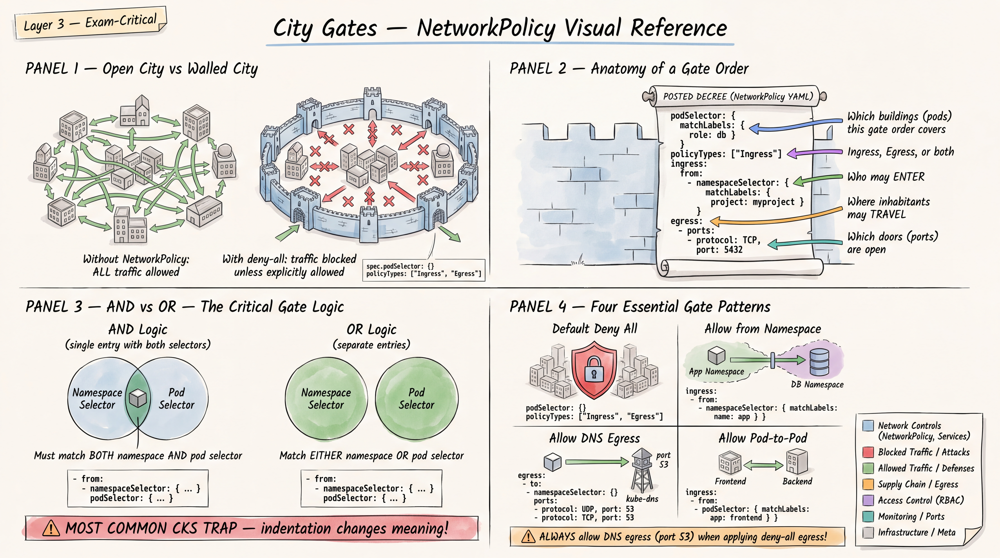
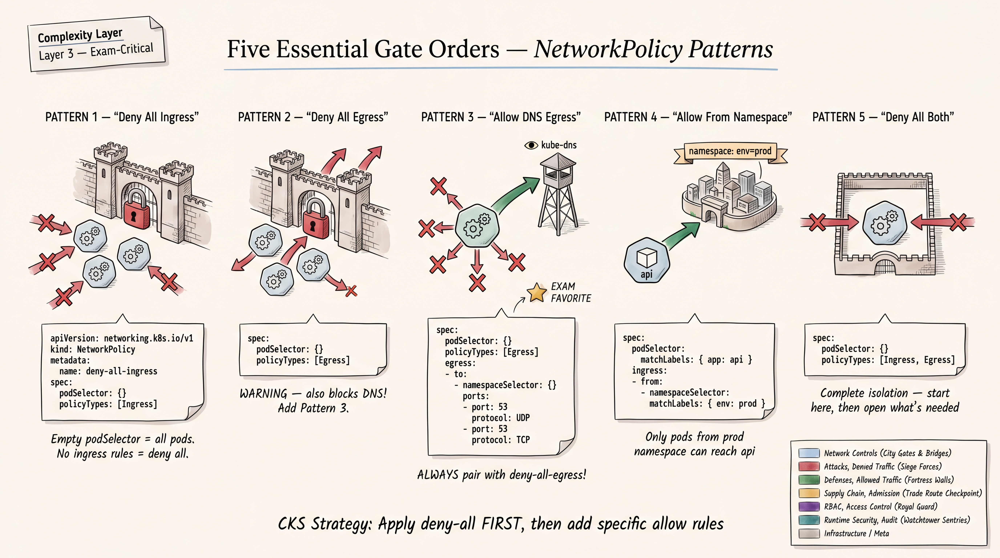

# CKS Network Policy Mastery -- Complete Exam Preparation Guide



**CKS Domain:** Minimize Microservice Vulnerabilities (~20%)
**Priority:** P0 -- Absolutely Master
**Exam Relevance:** NetworkPolicy appears in nearly every CKS exam according to candidate reports. It is one of the most hands-on, YAML-heavy topics and a consistent point earner.

---

## Table of Contents

1. [NetworkPolicy Technical Deep Dive](#1-networkpolicy-technical-deep-dive)
2. [Twenty Simple NetworkPolicy Drills](#2-twenty-simple-networkpolicy-drills)
3. [Twenty Exam-Level NetworkPolicy Tasks](#3-twenty-exam-level-networkpolicy-tasks)
4. [Ten Troubleshooting Scenarios](#4-ten-troubleshooting-scenarios)
5. [NetworkPolicy Diagnostic Workflow](#5-networkpolicy-diagnostic-workflow)
6. [YAML Speed Templates](#6-networkpolicy-yaml-speed-templates)
7. [Common Exam Mistakes](#7-common-exam-mistakes)

---

## 1. NetworkPolicy Technical Deep Dive

### 1.1 How NetworkPolicy Works

NetworkPolicy is a Kubernetes resource that controls traffic flow at the IP address or port level (OSI layer 3/4) for Pods. It is the primary mechanism for microsegmentation within a cluster.

**Key Architectural Facts:**

| Concept | Behavior |
|---|---|
| Default posture | All traffic is ALLOWED -- Pods accept connections from anywhere and can connect to anything |
| When a NetworkPolicy selects a Pod | Only the traffic explicitly allowed by that policy (and any other policies selecting the Pod) is permitted; everything else is DENIED |
| Additive behavior | Multiple policies selecting the same Pod are UNIONED -- they never conflict, they only add more allowed traffic |
| Enforcement | Performed by the CNI plugin, NOT by kube-apiserver or kubelet |
| CNI requirement | The cluster CNI must support NetworkPolicy (Calico, Cilium, Weave, Antrea do; Flannel does NOT by default) |
| Scope | NetworkPolicy is namespaced -- it lives in a namespace and its `spec.podSelector` selects Pods in that same namespace |
| No explicit deny rules | You cannot write "deny traffic from Pod X" -- you achieve denial by not including Pod X in any allow rule |
| Stateful | Connections are stateful -- if you allow traffic in one direction, the return traffic is automatically allowed |

**Critical Mental Model:**

```
No NetworkPolicy selecting a Pod  -->  All traffic allowed (default allow)
Any NetworkPolicy selecting a Pod -->  Only explicitly allowed traffic passes; everything else is denied
Multiple NetworkPolicies          -->  Union of all allowed traffic (additive)
```

### 1.2 The NetworkPolicy Spec Structure

```yaml
apiVersion: networking.k8s.io/v1
kind: NetworkPolicy
metadata:
  name: example-policy
  namespace: target-namespace          # Policy lives here; podSelector selects Pods here
spec:
  podSelector:                         # Which Pods in THIS namespace does this policy apply to?
    matchLabels:
      app: myapp
  policyTypes:                         # Which direction(s) does this policy govern?
    - Ingress                          # Inbound traffic rules
    - Egress                           # Outbound traffic rules
  ingress:                             # Rules for allowed inbound traffic
    - from:                            # Traffic sources (OR between list items)
        - podSelector:                 # Source pods (in same namespace by default)
            matchLabels:
              role: frontend
        - namespaceSelector:           # Source namespace
            matchLabels:
              env: production
      ports:                           # Allowed destination ports (AND with from)
        - protocol: TCP
          port: 80
  egress:                              # Rules for allowed outbound traffic
    - to:                              # Traffic destinations (OR between list items)
        - podSelector:
            matchLabels:
              role: database
      ports:
        - protocol: TCP
          port: 5432
```

### 1.3 podSelector (spec.podSelector)

The top-level `spec.podSelector` determines which Pods in the policy's namespace are **targeted** (governed) by this policy.

| Selector | Meaning |
|---|---|
| `podSelector: {}` | Selects ALL Pods in the namespace |
| `podSelector: {matchLabels: {app: web}}` | Selects only Pods with label `app=web` |
| `podSelector: {matchExpressions: [{key: tier, operator: In, values: [frontend, backend]}]}` | Selects Pods where tier is frontend OR backend |

### 1.4 policyTypes Field Behavior

This is one of the most misunderstood fields and a frequent source of exam errors.

**Rules:**

| policyTypes value | Effect |
|---|---|
| `[Ingress]` | Policy governs inbound traffic. If no `ingress` rules block is present, all ingress is DENIED. Egress is UNAFFECTED by this policy. |
| `[Egress]` | Policy governs outbound traffic. If no `egress` rules block is present, all egress is DENIED. Ingress is UNAFFECTED by this policy. |
| `[Ingress, Egress]` | Policy governs both directions. Missing rules block = deny for that direction. |
| Omitted entirely | Defaults: Ingress is always included. Egress is included ONLY IF an `egress` rules block exists in the spec. |

**EXAM TRAP:** If you write a policy with `policyTypes: [Ingress, Egress]` but only provide `ingress` rules, ALL egress from the selected Pods is denied (including DNS!). This is a classic gotcha.

**Implicit vs Explicit policyTypes:**

```yaml
# IMPLICIT: policyTypes defaults to [Ingress] because only ingress block exists
spec:
  podSelector: {}
  ingress:
    - from:
        - podSelector:
            matchLabels:
              role: frontend

# EXPLICIT: Always prefer this in exam for clarity
spec:
  podSelector: {}
  policyTypes:
    - Ingress
  ingress:
    - from:
        - podSelector:
            matchLabels:
              role: frontend
```

### 1.5 Ingress Rules

Ingress rules define which inbound traffic is allowed TO the selected Pods.

```yaml
ingress:
  - from:          # Each "- from:" is an OR rule (any matching source is allowed)
      - <peer1>    # Within "from:", list items are OR-ed
      - <peer2>
    ports:         # Ports are AND-ed with the from clause
      - port: 80
```

**No ingress block at all + policyTypes includes Ingress = ALL ingress denied.**
**Empty ingress block `ingress: []` = ALL ingress denied.**
**ingress block with empty rule `ingress: [{}]` = ALL ingress allowed (from anywhere on any port).**

### 1.6 Egress Rules

Egress rules define which outbound traffic is allowed FROM the selected Pods.

```yaml
egress:
  - to:            # Each "- to:" is an OR rule
      - <peer1>
    ports:
      - port: 443
```

Same empty-block semantics as ingress:
- No egress block + policyTypes includes Egress = ALL egress denied
- `egress: []` = ALL egress denied
- `egress: [{}]` = ALL egress allowed

### 1.7 Traffic Peers: podSelector, namespaceSelector, ipBlock

#### podSelector (within ingress.from / egress.to)

Selects Pods **within the policy's own namespace** (unless combined with namespaceSelector).

```yaml
from:
  - podSelector:
      matchLabels:
        role: frontend
```

#### namespaceSelector

Selects ALL Pods in namespaces matching the label selector.

```yaml
from:
  - namespaceSelector:
      matchLabels:
        env: production
```

This allows traffic from ANY Pod in ANY namespace that has the label `env=production`.

#### ipBlock

Allows traffic from/to specific CIDR ranges. Cannot select Pods by IP -- use for external traffic.

```yaml
from:
  - ipBlock:
      cidr: 192.168.1.0/24
      except:
        - 192.168.1.100/32
```

### 1.8 CRITICAL: AND vs OR Behavior (Combined Selectors)


This is the single most important semantic detail in NetworkPolicy and the most common exam error.

**OR (separate list items -- two dashes):**

```yaml
from:
  - podSelector:           # Rule 1: any Pod with role=frontend in SAME namespace
      matchLabels:
        role: frontend
  - namespaceSelector:     # Rule 2: any Pod in any namespace labeled env=prod
      matchLabels:
        env: prod
```

This means: allow from (Pods with role=frontend in same namespace) **OR** (any Pod in namespaces with env=prod). These are two separate rules, independently evaluated.

**AND (single list item -- one dash, both selectors together):**

```yaml
from:
  - podSelector:           # COMBINED: Pods with role=frontend
      matchLabels:         #   AND
        role: frontend     #   in namespaces with env=prod
    namespaceSelector:
      matchLabels:
        env: prod
```

This means: allow from Pods that have `role=frontend` **AND** are in a namespace labeled `env=prod`. Both conditions must be true.

**Visual comparison:**

```
# OR -- Two list items (two dashes under "from:")
from:
  - podSelector: {matchLabels: {role: frontend}}     # <-- dash = separate rule
  - namespaceSelector: {matchLabels: {env: prod}}    # <-- dash = separate rule

# AND -- One list item (one dash, two selectors at same level)
from:
  - podSelector: {matchLabels: {role: frontend}}     # <-- one dash
    namespaceSelector: {matchLabels: {env: prod}}    #     same item = AND
```

**EXAM TIP:** When you need AND semantics, triple-check your YAML indentation. The `namespaceSelector` must be at the SAME indentation level as `podSelector`, both under a SINGLE dash.

### 1.9 Empty Selector `{}` Semantics

| Selector | Meaning |
|---|---|
| `podSelector: {}` | All Pods in the relevant namespace |
| `namespaceSelector: {}` | All namespaces in the cluster |
| `podSelector: {} + namespaceSelector: {}` | All Pods in all namespaces (entire cluster) |

**Combined empty selectors for "allow from everywhere":**

```yaml
ingress:
  - from:
      - namespaceSelector: {}    # All namespaces
        podSelector: {}          # All pods -- AND combined
```

Or equivalently (since an empty from rule allows all):

```yaml
ingress:
  - {}    # Allow all ingress
```

### 1.10 Ports Specification

```yaml
ports:
  - protocol: TCP       # TCP (default), UDP, or SCTP
    port: 80             # Can be number or named port
  - protocol: TCP
    port: 443
  - protocol: TCP
    port: 8000
    endPort: 8999        # Port range (K8s 1.25+ stable) -- 8000-8999
```

- If `ports` is omitted from a rule, all ports are allowed for that rule.
- If `ports` is specified, only those ports are allowed.
- `protocol` defaults to TCP if omitted.
- Named ports reference the container port name in the Pod spec.

### 1.11 Default Deny Patterns



These are the most frequently needed patterns on the CKS exam.

**Default deny all ingress in a namespace:**

```yaml
apiVersion: networking.k8s.io/v1
kind: NetworkPolicy
metadata:
  name: default-deny-ingress
  namespace: target-ns
spec:
  podSelector: {}          # All pods in namespace
  policyTypes:
    - Ingress              # Governs ingress
  # No ingress rules = all ingress denied
```

**Default deny all egress in a namespace:**

```yaml
apiVersion: networking.k8s.io/v1
kind: NetworkPolicy
metadata:
  name: default-deny-egress
  namespace: target-ns
spec:
  podSelector: {}
  policyTypes:
    - Egress
  # No egress rules = all egress denied
```

**Default deny all traffic (both directions):**

```yaml
apiVersion: networking.k8s.io/v1
kind: NetworkPolicy
metadata:
  name: default-deny-all
  namespace: target-ns
spec:
  podSelector: {}
  policyTypes:
    - Ingress
    - Egress
```

### 1.12 Additive Policy Behavior -- Deep Explanation

When multiple NetworkPolicies select the same Pod, the UNION of all their rules determines allowed traffic.

**Example:** Pod `web` (labels: app=web) in namespace `prod`:

Policy A allows ingress from Pods with `role=frontend` on port 80.
Policy B allows ingress from Pods with `role=monitoring` on port 9090.

**Result:** Pod `web` accepts traffic from `role=frontend` on port 80 AND from `role=monitoring` on port 9090. Both policies contribute to the allowed set. Neither policy can "revoke" what the other allows.

**This means:** You CANNOT create a deny rule that overrides an allow rule. If any policy allows traffic, that traffic is allowed. The only way to deny traffic is to not include it in any policy's allow rules.

### 1.13 DNS Consideration

When you apply a default-deny egress policy, you block ALL outbound traffic, including DNS resolution (UDP/TCP port 53 to kube-dns/CoreDNS in `kube-system`). This causes Pods to fail hostname resolution, breaking most applications.

**Always pair deny-all egress with a DNS allow policy:**

```yaml
apiVersion: networking.k8s.io/v1
kind: NetworkPolicy
metadata:
  name: allow-dns
  namespace: target-ns
spec:
  podSelector: {}
  policyTypes:
    - Egress
  egress:
    - to:
        - namespaceSelector:
            matchLabels:
              kubernetes.io/metadata.name: kube-system
          podSelector:
            matchLabels:
              k8s-app: kube-dns
      ports:
        - protocol: UDP
          port: 53
        - protocol: TCP
          port: 53
```

**Note:** The namespace label `kubernetes.io/metadata.name` is automatically set by Kubernetes (since 1.21+) and always equals the namespace name. This is the most reliable way to target `kube-system`.

---

## 2. Twenty Simple NetworkPolicy Drills

Each exercise includes: objective, namespace setup, full YAML solution, and verification commands.

**Common setup for all exercises:**

```bash
# Create test namespaces
kubectl create namespace drill-ns
kubectl create namespace external-ns
kubectl label namespace external-ns env=external
kubectl label namespace drill-ns env=internal

# Deploy test pods
kubectl run web --image=nginx --port=80 -n drill-ns --labels="app=web,tier=frontend"
kubectl run api --image=nginx --port=80 -n drill-ns --labels="app=api,tier=backend"
kubectl run db --image=nginx --port=80 -n drill-ns --labels="app=db,tier=database"
kubectl run client --image=busybox -n drill-ns --labels="app=client,role=testing" -- sleep 3600
kubectl run ext-client --image=busybox -n external-ns --labels="app=ext-client" -- sleep 3600
```

---

### Drill 1: Default Deny All Ingress in a Namespace

**Objective:** Block all inbound traffic to all Pods in `drill-ns`.

**Solution:**

```yaml
# drill-01-default-deny-ingress.yaml
apiVersion: networking.k8s.io/v1
kind: NetworkPolicy
metadata:
  name: default-deny-ingress
  namespace: drill-ns
spec:
  podSelector: {}
  policyTypes:
    - Ingress
```

**Apply and Verify:**

```bash
kubectl apply -f drill-01-default-deny-ingress.yaml

# Before policy: should succeed
kubectl exec -n drill-ns client -- wget -qO- --timeout=3 http://web.drill-ns.svc.cluster.local

# After policy: should timeout/fail
kubectl exec -n drill-ns client -- wget -qO- --timeout=3 http://web.drill-ns.svc.cluster.local
# Expected: wget: download timed out

# Verify policy is applied
kubectl get networkpolicy -n drill-ns
kubectl describe networkpolicy default-deny-ingress -n drill-ns
```

---

### Drill 2: Default Deny All Egress in a Namespace

**Objective:** Block all outbound traffic from all Pods in `drill-ns`.

**Solution:**

```yaml
# drill-02-default-deny-egress.yaml
apiVersion: networking.k8s.io/v1
kind: NetworkPolicy
metadata:
  name: default-deny-egress
  namespace: drill-ns
spec:
  podSelector: {}
  policyTypes:
    - Egress
```

**Apply and Verify:**

```bash
kubectl apply -f drill-02-default-deny-egress.yaml

# Test from within a pod -- DNS will fail, connections will fail
kubectl exec -n drill-ns client -- wget -qO- --timeout=3 http://web.drill-ns.svc.cluster.local
# Expected: bad address / download timed out (DNS resolution fails first)

kubectl exec -n drill-ns client -- nslookup kubernetes.default
# Expected: fails -- no DNS egress allowed

kubectl get networkpolicy default-deny-egress -n drill-ns
```

---

### Drill 3: Default Deny All Traffic (Ingress + Egress)

**Objective:** Block all inbound AND outbound traffic for all Pods in `drill-ns`.

**Solution:**

```yaml
# drill-03-default-deny-all.yaml
apiVersion: networking.k8s.io/v1
kind: NetworkPolicy
metadata:
  name: default-deny-all
  namespace: drill-ns
spec:
  podSelector: {}
  policyTypes:
    - Ingress
    - Egress
```

**Apply and Verify:**

```bash
kubectl apply -f drill-03-default-deny-all.yaml

# Test ingress -- should fail
kubectl exec -n external-ns ext-client -- wget -qO- --timeout=3 http://web.drill-ns.svc.cluster.local

# Test egress -- should fail (DNS + connectivity)
kubectl exec -n drill-ns client -- wget -qO- --timeout=3 http://example.com

# Verify
kubectl describe networkpolicy default-deny-all -n drill-ns
```

---

### Drill 4: Allow Ingress from a Specific Pod

**Objective:** With default deny in place, allow only Pod `client` (label `app=client`) to reach Pod `web` (label `app=web`).

**Prerequisite:** Apply Drill 1 (default deny ingress) first.

**Solution:**

```yaml
# drill-04-allow-ingress-from-pod.yaml
apiVersion: networking.k8s.io/v1
kind: NetworkPolicy
metadata:
  name: allow-client-to-web
  namespace: drill-ns
spec:
  podSelector:
    matchLabels:
      app: web
  policyTypes:
    - Ingress
  ingress:
    - from:
        - podSelector:
            matchLabels:
              app: client
      ports:
        - protocol: TCP
          port: 80
```

**Apply and Verify:**

```bash
kubectl apply -f drill-04-allow-ingress-from-pod.yaml

# From client pod -- should SUCCEED
kubectl exec -n drill-ns client -- wget -qO- --timeout=3 http://web.drill-ns.svc.cluster.local

# From api pod -- should FAIL (not allowed by policy)
kubectl exec -n drill-ns api -- wget -qO- --timeout=3 http://web.drill-ns.svc.cluster.local

# Verify
kubectl describe networkpolicy allow-client-to-web -n drill-ns
```

---

### Drill 5: Allow Ingress from a Specific Namespace

**Objective:** Allow all Pods in namespace `external-ns` (labeled `env=external`) to reach Pod `web` in `drill-ns`.

**Prerequisite:** Default deny ingress in `drill-ns`.

**Solution:**

```yaml
# drill-05-allow-ingress-from-namespace.yaml
apiVersion: networking.k8s.io/v1
kind: NetworkPolicy
metadata:
  name: allow-from-external-ns
  namespace: drill-ns
spec:
  podSelector:
    matchLabels:
      app: web
  policyTypes:
    - Ingress
  ingress:
    - from:
        - namespaceSelector:
            matchLabels:
              env: external
      ports:
        - protocol: TCP
          port: 80
```

**Apply and Verify:**

```bash
kubectl apply -f drill-05-allow-ingress-from-namespace.yaml

# From external-ns -- should SUCCEED
kubectl exec -n external-ns ext-client -- wget -qO- --timeout=3 http://web.drill-ns.svc.cluster.local

# From drill-ns client -- should FAIL (different namespace, not allowed by THIS policy)
# (Unless another policy allows it)
kubectl exec -n drill-ns client -- wget -qO- --timeout=3 http://web.drill-ns.svc.cluster.local

kubectl describe networkpolicy allow-from-external-ns -n drill-ns
```

---

### Drill 6: Allow Ingress from Specific Namespace AND Specific Pod (AND Selector)

**Objective:** Allow only Pods with label `app=ext-client` in namespaces labeled `env=external` to reach `web`. This is an AND condition.

**Prerequisite:** Default deny ingress in `drill-ns`.

**Solution:**

```yaml
# drill-06-allow-ingress-and-selector.yaml
apiVersion: networking.k8s.io/v1
kind: NetworkPolicy
metadata:
  name: allow-specific-pod-from-specific-ns
  namespace: drill-ns
spec:
  podSelector:
    matchLabels:
      app: web
  policyTypes:
    - Ingress
  ingress:
    - from:
        - namespaceSelector:        # AND -- single list item
            matchLabels:
              env: external
          podSelector:              # AND -- same dash, same indentation level
            matchLabels:
              app: ext-client
      ports:
        - protocol: TCP
          port: 80
```

**CRITICAL:** Note the indentation -- `namespaceSelector` and `podSelector` are at the SAME level under a SINGLE dash (`-`). This creates AND logic.

**Apply and Verify:**

```bash
kubectl apply -f drill-06-allow-ingress-and-selector.yaml

# ext-client in external-ns -- should SUCCEED (both labels match)
kubectl exec -n external-ns ext-client -- wget -qO- --timeout=3 http://web.drill-ns.svc.cluster.local

# Create another pod in external-ns WITHOUT the matching label
kubectl run other-pod --image=busybox -n external-ns --labels="app=other" -- sleep 3600

# other-pod in external-ns -- should FAIL (pod label does not match)
kubectl exec -n external-ns other-pod -- wget -qO- --timeout=3 http://web.drill-ns.svc.cluster.local

# Cleanup
kubectl delete pod other-pod -n external-ns
```

---

### Drill 7: Allow Egress to a Specific Pod

**Objective:** With default deny egress in place, allow Pod `api` to send traffic only to Pod `db` on port 5432.

**Prerequisite:** Default deny egress + DNS allow in `drill-ns`.

**Solution:**

```yaml
# drill-07-allow-egress-to-pod.yaml
apiVersion: networking.k8s.io/v1
kind: NetworkPolicy
metadata:
  name: allow-api-to-db
  namespace: drill-ns
spec:
  podSelector:
    matchLabels:
      app: api
  policyTypes:
    - Egress
  egress:
    - to:
        - podSelector:
            matchLabels:
              app: db
      ports:
        - protocol: TCP
          port: 5432
```

**Apply and Verify:**

```bash
kubectl apply -f drill-07-allow-egress-to-pod.yaml

# Test egress from api to db on port 5432 -- should SUCCEED
# (Note: nginx listens on 80, not 5432, so connection will be refused but NOT timed out.
#  Timeout = blocked by policy. Connection refused = policy allows but no service on that port.)
kubectl exec -n drill-ns api -- wget -qO- --timeout=3 http://db:5432
# Expected: Connection refused (allowed by policy, but nginx is not on 5432)

# Test egress from api to web on port 80 -- should FAIL (timeout = blocked)
kubectl exec -n drill-ns api -- wget -qO- --timeout=3 http://web:80
# Expected: download timed out

kubectl describe networkpolicy allow-api-to-db -n drill-ns
```

---

### Drill 8: Allow Egress to DNS (Port 53 UDP/TCP to kube-system)

**Objective:** Allow DNS resolution for all Pods in `drill-ns` while maintaining deny-all egress.

**Solution:**

```yaml
# drill-08-allow-dns-egress.yaml
apiVersion: networking.k8s.io/v1
kind: NetworkPolicy
metadata:
  name: allow-dns
  namespace: drill-ns
spec:
  podSelector: {}
  policyTypes:
    - Egress
  egress:
    - to:
        - namespaceSelector:
            matchLabels:
              kubernetes.io/metadata.name: kube-system
          podSelector:
            matchLabels:
              k8s-app: kube-dns
      ports:
        - protocol: UDP
          port: 53
        - protocol: TCP
          port: 53
```

**Apply and Verify:**

```bash
kubectl apply -f drill-08-allow-dns-egress.yaml

# DNS should now resolve
kubectl exec -n drill-ns client -- nslookup kubernetes.default
# Expected: returns IP address

# But actual connections still blocked (only DNS is allowed)
kubectl exec -n drill-ns client -- wget -qO- --timeout=3 http://web.drill-ns.svc.cluster.local
# Expected: download timed out (DNS resolves, but TCP connection blocked)

# Verify kube-system namespace has the label
kubectl get namespace kube-system --show-labels
```

---

### Drill 9: Allow Ingress on a Specific Port

**Objective:** Allow all traffic to Pod `web` but ONLY on port 80/TCP.

**Prerequisite:** Default deny ingress in `drill-ns`.

**Solution:**

```yaml
# drill-09-allow-specific-port.yaml
apiVersion: networking.k8s.io/v1
kind: NetworkPolicy
metadata:
  name: allow-web-port-80
  namespace: drill-ns
spec:
  podSelector:
    matchLabels:
      app: web
  policyTypes:
    - Ingress
  ingress:
    - ports:
        - protocol: TCP
          port: 80
      # No "from" field = allow from any source on port 80
```

**Apply and Verify:**

```bash
kubectl apply -f drill-09-allow-specific-port.yaml

# Port 80 -- should SUCCEED
kubectl exec -n drill-ns client -- wget -qO- --timeout=3 http://web:80

# Port 443 -- should FAIL (not allowed)
kubectl exec -n drill-ns client -- wget -qO- --timeout=3 https://web:443

kubectl describe networkpolicy allow-web-port-80 -n drill-ns
```

---

### Drill 10: Allow from Multiple Sources (OR Logic)

**Objective:** Allow ingress to Pod `api` from both `app=web` Pods AND `app=client` Pods (OR logic -- either source is acceptable).

**Prerequisite:** Default deny ingress in `drill-ns`.

**Solution:**

```yaml
# drill-10-allow-multiple-sources-or.yaml
apiVersion: networking.k8s.io/v1
kind: NetworkPolicy
metadata:
  name: allow-multi-source-to-api
  namespace: drill-ns
spec:
  podSelector:
    matchLabels:
      app: api
  policyTypes:
    - Ingress
  ingress:
    - from:
        - podSelector:             # Source 1 -- OR
            matchLabels:
              app: web
        - podSelector:             # Source 2 -- OR
            matchLabels:
              app: client
      ports:
        - protocol: TCP
          port: 80
```

**Apply and Verify:**

```bash
kubectl apply -f drill-10-allow-multiple-sources-or.yaml

# From web -- should SUCCEED
kubectl exec -n drill-ns web -- wget -qO- --timeout=3 http://api:80

# From client -- should SUCCEED
kubectl exec -n drill-ns client -- wget -qO- --timeout=3 http://api:80

# From db -- should FAIL
kubectl exec -n drill-ns db -- wget -qO- --timeout=3 http://api:80

kubectl describe networkpolicy allow-multi-source-to-api -n drill-ns
```

---

### Drill 11: Allow Egress to Specific CIDR

**Objective:** Allow Pod `web` to reach external IPs in range `10.0.0.0/8` only.

**Prerequisite:** Default deny egress + DNS allow in `drill-ns`.

**Solution:**

```yaml
# drill-11-allow-egress-cidr.yaml
apiVersion: networking.k8s.io/v1
kind: NetworkPolicy
metadata:
  name: allow-egress-internal-cidr
  namespace: drill-ns
spec:
  podSelector:
    matchLabels:
      app: web
  policyTypes:
    - Egress
  egress:
    - to:
        - ipBlock:
            cidr: 10.0.0.0/8
```

**Apply and Verify:**

```bash
kubectl apply -f drill-11-allow-egress-cidr.yaml

# Test connectivity to a 10.x.x.x address (within cluster -- depends on your cluster CIDR)
kubectl exec -n drill-ns web -- wget -qO- --timeout=3 http://10.96.0.1:443
# May succeed or show connection refused (allowed by policy)

# Test connectivity to an external IP (e.g., 8.8.8.8) -- should FAIL
kubectl exec -n drill-ns web -- wget -qO- --timeout=3 http://8.8.8.8
# Expected: download timed out

kubectl describe networkpolicy allow-egress-internal-cidr -n drill-ns
```

---

### Drill 12: Deny Egress Except to Internal IPs

**Objective:** Block all egress to external IPs while allowing internal cluster communication and DNS.

**Solution:**

```yaml
# drill-12-deny-egress-except-internal.yaml
apiVersion: networking.k8s.io/v1
kind: NetworkPolicy
metadata:
  name: deny-external-egress
  namespace: drill-ns
spec:
  podSelector: {}
  policyTypes:
    - Egress
  egress:
    # Allow DNS
    - to:
        - namespaceSelector:
            matchLabels:
              kubernetes.io/metadata.name: kube-system
          podSelector:
            matchLabels:
              k8s-app: kube-dns
      ports:
        - protocol: UDP
          port: 53
        - protocol: TCP
          port: 53
    # Allow internal RFC1918 ranges
    - to:
        - ipBlock:
            cidr: 10.0.0.0/8
        - ipBlock:
            cidr: 172.16.0.0/12
        - ipBlock:
            cidr: 192.168.0.0/16
```

**Apply and Verify:**

```bash
kubectl apply -f drill-12-deny-egress-except-internal.yaml

# DNS should work
kubectl exec -n drill-ns client -- nslookup kubernetes.default

# Internal cluster IPs should work
kubectl exec -n drill-ns client -- wget -qO- --timeout=3 http://web.drill-ns.svc.cluster.local

# External IPs should FAIL
kubectl exec -n drill-ns client -- wget -qO- --timeout=3 http://1.1.1.1
# Expected: download timed out
```

---

### Drill 13: Allow Ingress from Pods with a Specific Label

**Objective:** Allow ingress to `db` only from Pods labeled `role=backend` in the same namespace.

**Prerequisite:** Default deny ingress in `drill-ns`.

**Solution:**

```yaml
# drill-13-allow-ingress-by-label.yaml
apiVersion: networking.k8s.io/v1
kind: NetworkPolicy
metadata:
  name: allow-backend-to-db
  namespace: drill-ns
spec:
  podSelector:
    matchLabels:
      app: db
  policyTypes:
    - Ingress
  ingress:
    - from:
        - podSelector:
            matchLabels:
              role: backend
      ports:
        - protocol: TCP
          port: 5432
```

**Apply and Verify:**

```bash
# Label the api pod as backend
kubectl label pod api -n drill-ns role=backend

kubectl apply -f drill-13-allow-ingress-by-label.yaml

# From api (now labeled role=backend) -- should be allowed by policy
# (Connection refused because nginx is not on 5432, but NOT timed out)
kubectl exec -n drill-ns api -- wget -qO- --timeout=3 http://db:5432

# From client (no role=backend label) -- should TIMEOUT (blocked by policy)
kubectl exec -n drill-ns client -- wget -qO- --timeout=3 http://db:5432
```

---

### Drill 14: Allow Ingress from Any Namespace with a Label

**Objective:** Allow ingress to Pod `web` from any Pod in any namespace that has the label `purpose=monitoring`.

**Prerequisite:** Default deny ingress in `drill-ns`.

**Solution:**

```yaml
# drill-14-allow-ingress-labeled-namespace.yaml
apiVersion: networking.k8s.io/v1
kind: NetworkPolicy
metadata:
  name: allow-from-monitoring-ns
  namespace: drill-ns
spec:
  podSelector:
    matchLabels:
      app: web
  policyTypes:
    - Ingress
  ingress:
    - from:
        - namespaceSelector:
            matchLabels:
              purpose: monitoring
      ports:
        - protocol: TCP
          port: 80
```

**Apply and Verify:**

```bash
# Create a monitoring namespace and label it
kubectl create namespace monitoring
kubectl label namespace monitoring purpose=monitoring
kubectl run monitor --image=busybox -n monitoring -- sleep 3600

kubectl apply -f drill-14-allow-ingress-labeled-namespace.yaml

# From monitoring namespace -- should SUCCEED
kubectl exec -n monitoring monitor -- wget -qO- --timeout=3 http://web.drill-ns.svc.cluster.local

# From external-ns (no purpose=monitoring label) -- should FAIL
kubectl exec -n external-ns ext-client -- wget -qO- --timeout=3 http://web.drill-ns.svc.cluster.local

# Verify namespace labels
kubectl get namespaces --show-labels | grep monitoring
```

---

### Drill 15: Allow Only HTTP (Port 80) Ingress

**Objective:** Pod `web` should accept traffic on port 80/TCP only, from any source.

**Prerequisite:** Default deny ingress in `drill-ns`.

**Solution:**

```yaml
# drill-15-allow-http-only.yaml
apiVersion: networking.k8s.io/v1
kind: NetworkPolicy
metadata:
  name: allow-http-only
  namespace: drill-ns
spec:
  podSelector:
    matchLabels:
      app: web
  policyTypes:
    - Ingress
  ingress:
    - ports:
        - protocol: TCP
          port: 80
      # No "from" clause -- allows from any source
```

**Apply and Verify:**

```bash
kubectl apply -f drill-15-allow-http-only.yaml

# Port 80 from anywhere -- should SUCCEED
kubectl exec -n drill-ns client -- wget -qO- --timeout=3 http://web:80
kubectl exec -n external-ns ext-client -- wget -qO- --timeout=3 http://web.drill-ns.svc.cluster.local:80

# Port 443 -- should FAIL (not allowed)
kubectl exec -n drill-ns client -- wget -qO- --timeout=3 https://web:443
```

---

### Drill 16: Allow Egress Only to a Database Pod on Port 5432

**Objective:** Pod `api` can only send traffic to Pod `db` on port 5432. All other egress is blocked (except DNS).

**Prerequisite:** Default deny egress in `drill-ns`.

**Solution:**

```yaml
# drill-16-allow-egress-to-db-only.yaml
apiVersion: networking.k8s.io/v1
kind: NetworkPolicy
metadata:
  name: api-egress-to-db
  namespace: drill-ns
spec:
  podSelector:
    matchLabels:
      app: api
  policyTypes:
    - Egress
  egress:
    # Allow DNS
    - to:
        - namespaceSelector:
            matchLabels:
              kubernetes.io/metadata.name: kube-system
          podSelector:
            matchLabels:
              k8s-app: kube-dns
      ports:
        - protocol: UDP
          port: 53
        - protocol: TCP
          port: 53
    # Allow to db on 5432
    - to:
        - podSelector:
            matchLabels:
              app: db
      ports:
        - protocol: TCP
          port: 5432
```

**Apply and Verify:**

```bash
kubectl apply -f drill-16-allow-egress-to-db-only.yaml

# api to db on 5432 -- allowed (connection refused but not timeout)
kubectl exec -n drill-ns api -- wget -qO- --timeout=3 http://db:5432

# api to web on 80 -- BLOCKED (timeout)
kubectl exec -n drill-ns api -- wget -qO- --timeout=3 http://web:80

# api DNS -- should work
kubectl exec -n drill-ns api -- nslookup db.drill-ns.svc.cluster.local
```

---

### Drill 17: Combined Ingress and Egress Policy

**Objective:** Create a single policy for Pod `api` that:
- Allows ingress from `app=web` on port 8080
- Allows egress to `app=db` on port 5432
- Allows DNS egress

**Solution:**

```yaml
# drill-17-combined-ingress-egress.yaml
apiVersion: networking.k8s.io/v1
kind: NetworkPolicy
metadata:
  name: api-combined-policy
  namespace: drill-ns
spec:
  podSelector:
    matchLabels:
      app: api
  policyTypes:
    - Ingress
    - Egress
  ingress:
    - from:
        - podSelector:
            matchLabels:
              app: web
      ports:
        - protocol: TCP
          port: 8080
  egress:
    - to:
        - namespaceSelector:
            matchLabels:
              kubernetes.io/metadata.name: kube-system
          podSelector:
            matchLabels:
              k8s-app: kube-dns
      ports:
        - protocol: UDP
          port: 53
        - protocol: TCP
          port: 53
    - to:
        - podSelector:
            matchLabels:
              app: db
      ports:
        - protocol: TCP
          port: 5432
```

**Apply and Verify:**

```bash
kubectl apply -f drill-17-combined-ingress-egress.yaml

# Ingress from web on 8080 -- allowed (connection refused, not timeout)
kubectl exec -n drill-ns web -- wget -qO- --timeout=3 http://api:8080

# Ingress from client -- BLOCKED
kubectl exec -n drill-ns client -- wget -qO- --timeout=3 http://api:8080

# Egress to db on 5432 -- allowed
kubectl exec -n drill-ns api -- wget -qO- --timeout=3 http://db:5432

# Egress to web on 80 -- BLOCKED
kubectl exec -n drill-ns api -- wget -qO- --timeout=3 http://web:80

# DNS works
kubectl exec -n drill-ns api -- nslookup kubernetes.default
```

---

### Drill 18: Allow from Same Namespace Only

**Objective:** Pod `web` accepts traffic only from Pods within the same namespace (`drill-ns`). Cross-namespace traffic is denied.

**Prerequisite:** Default deny ingress in `drill-ns`.

**Solution:**

```yaml
# drill-18-allow-same-namespace.yaml
apiVersion: networking.k8s.io/v1
kind: NetworkPolicy
metadata:
  name: allow-same-namespace
  namespace: drill-ns
spec:
  podSelector:
    matchLabels:
      app: web
  policyTypes:
    - Ingress
  ingress:
    - from:
        - podSelector: {}           # All pods in same namespace (drill-ns)
      ports:
        - protocol: TCP
          port: 80
```

**Key Point:** `podSelector: {}` without a `namespaceSelector` means "all Pods in the policy's own namespace."

**Apply and Verify:**

```bash
kubectl apply -f drill-18-allow-same-namespace.yaml

# From same namespace -- should SUCCEED
kubectl exec -n drill-ns client -- wget -qO- --timeout=3 http://web:80

# From different namespace -- should FAIL
kubectl exec -n external-ns ext-client -- wget -qO- --timeout=3 http://web.drill-ns.svc.cluster.local:80
```

---

### Drill 19: Allow from Specific IP Range

**Objective:** Allow ingress to Pod `web` from IP range `192.168.0.0/16`, excluding `192.168.1.0/24`.

**Prerequisite:** Default deny ingress in `drill-ns`.

**Solution:**

```yaml
# drill-19-allow-ip-range.yaml
apiVersion: networking.k8s.io/v1
kind: NetworkPolicy
metadata:
  name: allow-ip-range
  namespace: drill-ns
spec:
  podSelector:
    matchLabels:
      app: web
  policyTypes:
    - Ingress
  ingress:
    - from:
        - ipBlock:
            cidr: 192.168.0.0/16
            except:
              - 192.168.1.0/24
      ports:
        - protocol: TCP
          port: 80
```

**Apply and Verify:**

```bash
kubectl apply -f drill-19-allow-ip-range.yaml

# Verify the policy description shows the correct CIDR
kubectl describe networkpolicy allow-ip-range -n drill-ns

# Test from a Pod whose IP falls in 192.168.x.x range (depends on cluster)
# Check Pod IP first
kubectl get pod client -n drill-ns -o wide
```

---

### Drill 20: Multi-Port Policy

**Objective:** Allow ingress to Pod `web` on ports 80 (HTTP), 443 (HTTPS), and 8443 (admin) from any source.

**Prerequisite:** Default deny ingress in `drill-ns`.

**Solution:**

```yaml
# drill-20-multi-port.yaml
apiVersion: networking.k8s.io/v1
kind: NetworkPolicy
metadata:
  name: allow-multi-port
  namespace: drill-ns
spec:
  podSelector:
    matchLabels:
      app: web
  policyTypes:
    - Ingress
  ingress:
    - ports:
        - protocol: TCP
          port: 80
        - protocol: TCP
          port: 443
        - protocol: TCP
          port: 8443
      # No "from" = allow from any source on these ports
```

**Apply and Verify:**

```bash
kubectl apply -f drill-20-multi-port.yaml

# Port 80 -- should SUCCEED
kubectl exec -n drill-ns client -- wget -qO- --timeout=3 http://web:80

# Port 443 -- allowed by policy (connection behavior depends on nginx config)
kubectl exec -n drill-ns client -- wget -qO- --timeout=3 https://web:443

# Port 9090 -- should FAIL (not in allowed ports)
kubectl exec -n drill-ns client -- wget -qO- --timeout=3 http://web:9090

kubectl describe networkpolicy allow-multi-port -n drill-ns
```

---

## 3. Twenty Exam-Level NetworkPolicy Tasks

These tasks combine multiple concepts, cross-namespace communication, and realistic application architectures. Each simulates CKS exam difficulty.

**Setup for exam-level tasks:**

```bash
# Create namespaces with labels
kubectl create namespace frontend
kubectl create namespace backend
kubectl create namespace database
kubectl create namespace monitoring
kubectl create namespace logging
kubectl label namespace frontend tier=frontend env=production
kubectl label namespace backend tier=backend env=production
kubectl label namespace database tier=database env=production
kubectl label namespace monitoring purpose=monitoring
kubectl label namespace logging purpose=logging

# Deploy application pods
kubectl run web -n frontend --image=nginx --port=80 --labels="app=web,tier=frontend"
kubectl run web2 -n frontend --image=nginx --port=80 --labels="app=web2,tier=frontend"
kubectl run api -n backend --image=nginx --port=80 --labels="app=api,tier=backend,version=v1"
kubectl run api-v2 -n backend --image=nginx --port=80 --labels="app=api,tier=backend,version=v2"
kubectl run worker -n backend --image=nginx --port=80 --labels="app=worker,tier=backend"
kubectl run postgres -n database --image=nginx --port=5432 --labels="app=postgres,tier=database"
kubectl run redis -n database --image=nginx --port=6379 --labels="app=redis,tier=database"
kubectl run prometheus -n monitoring --image=busybox --labels="app=prometheus" -- sleep 3600
kubectl run grafana -n monitoring --image=busybox --labels="app=grafana" -- sleep 3600
kubectl run fluentd -n logging --image=busybox --labels="app=fluentd" -- sleep 3600
```

---

### Task 1: Three-Tier Application Isolation

**Scenario:** Implement network segmentation for a three-tier application:
- `frontend` namespace: web pods accept traffic from anywhere on port 80
- `backend` namespace: api pods accept traffic ONLY from frontend namespace on port 8080
- `database` namespace: postgres accepts traffic ONLY from backend namespace on port 5432
- All namespaces have default deny ingress
- All pods can reach DNS

**Solution:**

```yaml
# task-01a-default-deny-frontend.yaml
apiVersion: networking.k8s.io/v1
kind: NetworkPolicy
metadata:
  name: default-deny-ingress
  namespace: frontend
spec:
  podSelector: {}
  policyTypes:
    - Ingress
---
# task-01b-default-deny-backend.yaml
apiVersion: networking.k8s.io/v1
kind: NetworkPolicy
metadata:
  name: default-deny-ingress
  namespace: backend
spec:
  podSelector: {}
  policyTypes:
    - Ingress
---
# task-01c-default-deny-database.yaml
apiVersion: networking.k8s.io/v1
kind: NetworkPolicy
metadata:
  name: default-deny-ingress
  namespace: database
spec:
  podSelector: {}
  policyTypes:
    - Ingress
---
# task-01d-allow-web-from-anywhere.yaml
apiVersion: networking.k8s.io/v1
kind: NetworkPolicy
metadata:
  name: allow-web-ingress
  namespace: frontend
spec:
  podSelector:
    matchLabels:
      app: web
  policyTypes:
    - Ingress
  ingress:
    - ports:
        - protocol: TCP
          port: 80
---
# task-01e-allow-api-from-frontend.yaml
apiVersion: networking.k8s.io/v1
kind: NetworkPolicy
metadata:
  name: allow-api-from-frontend
  namespace: backend
spec:
  podSelector:
    matchLabels:
      app: api
  policyTypes:
    - Ingress
  ingress:
    - from:
        - namespaceSelector:
            matchLabels:
              tier: frontend
      ports:
        - protocol: TCP
          port: 8080
---
# task-01f-allow-postgres-from-backend.yaml
apiVersion: networking.k8s.io/v1
kind: NetworkPolicy
metadata:
  name: allow-postgres-from-backend
  namespace: database
spec:
  podSelector:
    matchLabels:
      app: postgres
  policyTypes:
    - Ingress
  ingress:
    - from:
        - namespaceSelector:
            matchLabels:
              tier: backend
      ports:
        - protocol: TCP
          port: 5432
```

**Verification:**

```bash
# Apply all
kubectl apply -f task-01a-default-deny-frontend.yaml
kubectl apply -f task-01b-default-deny-backend.yaml
kubectl apply -f task-01c-default-deny-database.yaml
kubectl apply -f task-01d-allow-web-from-anywhere.yaml
kubectl apply -f task-01e-allow-api-from-frontend.yaml
kubectl apply -f task-01f-allow-postgres-from-backend.yaml

# Test: frontend -> backend (should SUCCEED on port 8080)
kubectl exec -n frontend web -- wget -qO- --timeout=3 http://api.backend.svc.cluster.local:8080

# Test: backend -> database (should SUCCEED on port 5432)
kubectl exec -n backend api -- wget -qO- --timeout=3 http://postgres.database.svc.cluster.local:5432

# Test: frontend -> database (should FAIL -- no direct path)
kubectl exec -n frontend web -- wget -qO- --timeout=3 http://postgres.database.svc.cluster.local:5432

# Test: database -> backend (should FAIL -- no ingress rule allows this)
kubectl exec -n database postgres -- wget -qO- --timeout=3 http://api.backend.svc.cluster.local:8080
```

---

### Task 2: Deny All + Allow DNS + Allow Specific Egress

**Scenario:** In `backend` namespace:
1. Deny all egress by default
2. Allow DNS resolution
3. Allow api pods to reach postgres in database namespace on port 5432
4. Allow api pods to reach redis in database namespace on port 6379
5. No other egress is permitted

**Solution:**

```yaml
# task-02a-deny-all-egress-backend.yaml
apiVersion: networking.k8s.io/v1
kind: NetworkPolicy
metadata:
  name: default-deny-egress
  namespace: backend
spec:
  podSelector: {}
  policyTypes:
    - Egress
---
# task-02b-allow-dns-backend.yaml
apiVersion: networking.k8s.io/v1
kind: NetworkPolicy
metadata:
  name: allow-dns
  namespace: backend
spec:
  podSelector: {}
  policyTypes:
    - Egress
  egress:
    - to:
        - namespaceSelector:
            matchLabels:
              kubernetes.io/metadata.name: kube-system
          podSelector:
            matchLabels:
              k8s-app: kube-dns
      ports:
        - protocol: UDP
          port: 53
        - protocol: TCP
          port: 53
---
# task-02c-allow-api-to-databases.yaml
apiVersion: networking.k8s.io/v1
kind: NetworkPolicy
metadata:
  name: allow-api-to-databases
  namespace: backend
spec:
  podSelector:
    matchLabels:
      app: api
  policyTypes:
    - Egress
  egress:
    - to:
        - namespaceSelector:
            matchLabels:
              tier: database
          podSelector:
            matchLabels:
              app: postgres
      ports:
        - protocol: TCP
          port: 5432
    - to:
        - namespaceSelector:
            matchLabels:
              tier: database
          podSelector:
            matchLabels:
              app: redis
      ports:
        - protocol: TCP
          port: 6379
```

**Verification:**

```bash
# DNS should work
kubectl exec -n backend api -- nslookup postgres.database.svc.cluster.local

# api -> postgres on 5432 -- allowed
kubectl exec -n backend api -- wget -qO- --timeout=3 http://postgres.database.svc.cluster.local:5432

# api -> redis on 6379 -- allowed
kubectl exec -n backend api -- wget -qO- --timeout=3 http://redis.database.svc.cluster.local:6379

# api -> external -- BLOCKED
kubectl exec -n backend api -- wget -qO- --timeout=3 http://1.1.1.1

# worker -> postgres -- BLOCKED (only api is allowed, not worker)
kubectl exec -n backend worker -- wget -qO- --timeout=3 http://postgres.database.svc.cluster.local:5432
```

---

### Task 3: Cross-Namespace Monitoring Access

**Scenario:** Prometheus in `monitoring` namespace must be able to scrape metrics from ALL Pods in `frontend`, `backend`, and `database` namespaces on port 9090. All three namespaces have default deny ingress. Do not allow any other cross-namespace traffic.

**Solution:**

```yaml
# task-03-allow-prometheus-scrape-frontend.yaml
apiVersion: networking.k8s.io/v1
kind: NetworkPolicy
metadata:
  name: allow-prometheus-scrape
  namespace: frontend
spec:
  podSelector: {}
  policyTypes:
    - Ingress
  ingress:
    - from:
        - namespaceSelector:
            matchLabels:
              purpose: monitoring
          podSelector:
            matchLabels:
              app: prometheus
      ports:
        - protocol: TCP
          port: 9090
---
# task-03-allow-prometheus-scrape-backend.yaml
apiVersion: networking.k8s.io/v1
kind: NetworkPolicy
metadata:
  name: allow-prometheus-scrape
  namespace: backend
spec:
  podSelector: {}
  policyTypes:
    - Ingress
  ingress:
    - from:
        - namespaceSelector:
            matchLabels:
              purpose: monitoring
          podSelector:
            matchLabels:
              app: prometheus
      ports:
        - protocol: TCP
          port: 9090
---
# task-03-allow-prometheus-scrape-database.yaml
apiVersion: networking.k8s.io/v1
kind: NetworkPolicy
metadata:
  name: allow-prometheus-scrape
  namespace: database
spec:
  podSelector: {}
  policyTypes:
    - Ingress
  ingress:
    - from:
        - namespaceSelector:
            matchLabels:
              purpose: monitoring
          podSelector:
            matchLabels:
              app: prometheus
      ports:
        - protocol: TCP
          port: 9090
```

**Verification:**

```bash
# Prometheus -> frontend on 9090 -- should be allowed
kubectl exec -n monitoring prometheus -- wget -qO- --timeout=3 http://web.frontend.svc.cluster.local:9090

# Prometheus -> backend on 9090 -- should be allowed
kubectl exec -n monitoring prometheus -- wget -qO- --timeout=3 http://api.backend.svc.cluster.local:9090

# Prometheus -> backend on 80 -- should FAIL (only 9090 allowed)
kubectl exec -n monitoring prometheus -- wget -qO- --timeout=3 http://api.backend.svc.cluster.local:80

# Grafana -> backend -- should FAIL (only prometheus Pod is allowed)
kubectl exec -n monitoring grafana -- wget -qO- --timeout=3 http://api.backend.svc.cluster.local:9090
```

---

### Task 4: Complete Namespace Isolation

**Scenario:** Completely isolate the `database` namespace:
- Deny all ingress and egress by default
- Allow DNS egress
- Allow ingress ONLY from backend namespace on ports 5432 and 6379
- Allow egress ONLY to respond (stateful -- automatic) and to DNS

**Solution:**

```yaml
# task-04a-database-deny-all.yaml
apiVersion: networking.k8s.io/v1
kind: NetworkPolicy
metadata:
  name: default-deny-all
  namespace: database
spec:
  podSelector: {}
  policyTypes:
    - Ingress
    - Egress
---
# task-04b-database-allow-dns.yaml
apiVersion: networking.k8s.io/v1
kind: NetworkPolicy
metadata:
  name: allow-dns
  namespace: database
spec:
  podSelector: {}
  policyTypes:
    - Egress
  egress:
    - to:
        - namespaceSelector:
            matchLabels:
              kubernetes.io/metadata.name: kube-system
          podSelector:
            matchLabels:
              k8s-app: kube-dns
      ports:
        - protocol: UDP
          port: 53
        - protocol: TCP
          port: 53
---
# task-04c-database-allow-from-backend.yaml
apiVersion: networking.k8s.io/v1
kind: NetworkPolicy
metadata:
  name: allow-from-backend
  namespace: database
spec:
  podSelector: {}
  policyTypes:
    - Ingress
  ingress:
    - from:
        - namespaceSelector:
            matchLabels:
              tier: backend
      ports:
        - protocol: TCP
          port: 5432
        - protocol: TCP
          port: 6379
```

**Verification:**

```bash
# backend -> database on 5432 -- ALLOWED
kubectl exec -n backend api -- wget -qO- --timeout=3 http://postgres.database.svc.cluster.local:5432

# frontend -> database -- BLOCKED
kubectl exec -n frontend web -- wget -qO- --timeout=3 http://postgres.database.svc.cluster.local:5432

# database -> external -- BLOCKED (except DNS)
kubectl exec -n database postgres -- wget -qO- --timeout=3 http://1.1.1.1

# database DNS works
kubectl exec -n database postgres -- nslookup kubernetes.default
```

---

### Task 5: Allow Only Specific API Version

**Scenario:** In `backend` namespace, only Pods with label `version=v2` should receive traffic from frontend. Pods with `version=v1` should be blocked from frontend access (canary deployment scenario).

**Prerequisite:** Default deny ingress in `backend`.

**Solution:**

```yaml
# task-05-allow-only-v2.yaml
apiVersion: networking.k8s.io/v1
kind: NetworkPolicy
metadata:
  name: allow-frontend-to-api-v2-only
  namespace: backend
spec:
  podSelector:
    matchLabels:
      app: api
      version: v2
  policyTypes:
    - Ingress
  ingress:
    - from:
        - namespaceSelector:
            matchLabels:
              tier: frontend
      ports:
        - protocol: TCP
          port: 80
```

**Verification:**

```bash
# frontend -> api-v2 -- should SUCCEED
kubectl exec -n frontend web -- wget -qO- --timeout=3 http://api-v2.backend.svc.cluster.local:80

# frontend -> api (v1) -- should FAIL (no policy allows it, default deny is in place)
kubectl exec -n frontend web -- wget -qO- --timeout=3 http://api.backend.svc.cluster.local:80
```

---

### Task 6: Logging Infrastructure Access

**Scenario:** Fluentd in `logging` namespace needs to:
- Collect logs from ALL Pods in ALL namespaces on port 24224 (Fluentd forward protocol)
- Send logs to an external log aggregator at CIDR `10.200.0.0/16` on port 9200
- DNS must work

Implement egress policy on `logging` namespace and ingress allowance on application namespaces.

**Solution:**

```yaml
# task-06a-logging-egress.yaml
apiVersion: networking.k8s.io/v1
kind: NetworkPolicy
metadata:
  name: fluentd-egress
  namespace: logging
spec:
  podSelector:
    matchLabels:
      app: fluentd
  policyTypes:
    - Egress
  egress:
    # DNS
    - to:
        - namespaceSelector:
            matchLabels:
              kubernetes.io/metadata.name: kube-system
          podSelector:
            matchLabels:
              k8s-app: kube-dns
      ports:
        - protocol: UDP
          port: 53
        - protocol: TCP
          port: 53
    # External log aggregator
    - to:
        - ipBlock:
            cidr: 10.200.0.0/16
      ports:
        - protocol: TCP
          port: 9200
    # Collect from all pods in all namespaces
    - to:
        - namespaceSelector: {}
      ports:
        - protocol: TCP
          port: 24224
---
# task-06b-allow-fluentd-ingress-frontend.yaml
apiVersion: networking.k8s.io/v1
kind: NetworkPolicy
metadata:
  name: allow-fluentd-collect
  namespace: frontend
spec:
  podSelector: {}
  policyTypes:
    - Ingress
  ingress:
    - from:
        - namespaceSelector:
            matchLabels:
              purpose: logging
          podSelector:
            matchLabels:
              app: fluentd
      ports:
        - protocol: TCP
          port: 24224
```

**(Repeat the ingress policy for backend and database namespaces.)**

**Verification:**

```bash
# Verify fluentd can reach pods on 24224
kubectl exec -n logging fluentd -- wget -qO- --timeout=3 http://web.frontend.svc.cluster.local:24224

# Verify fluentd cannot reach pods on other ports
kubectl exec -n logging fluentd -- wget -qO- --timeout=3 http://web.frontend.svc.cluster.local:80
```

---

### Task 7: Multi-Tenant Namespace Isolation

**Scenario:** Two tenants share a cluster. Each tenant's namespace should be completely isolated from the other, but Pods within each namespace can communicate freely.

- `tenant-a` namespace (label: `tenant=a`)
- `tenant-b` namespace (label: `tenant=b`)

**Solution:**

```yaml
# task-07a-tenant-a-isolation.yaml
apiVersion: networking.k8s.io/v1
kind: NetworkPolicy
metadata:
  name: tenant-isolation
  namespace: tenant-a
spec:
  podSelector: {}
  policyTypes:
    - Ingress
    - Egress
  ingress:
    - from:
        - podSelector: {}         # Same namespace only
  egress:
    # DNS
    - to:
        - namespaceSelector:
            matchLabels:
              kubernetes.io/metadata.name: kube-system
          podSelector:
            matchLabels:
              k8s-app: kube-dns
      ports:
        - protocol: UDP
          port: 53
        - protocol: TCP
          port: 53
    # Same namespace only
    - to:
        - podSelector: {}
---
# task-07b-tenant-b-isolation.yaml
apiVersion: networking.k8s.io/v1
kind: NetworkPolicy
metadata:
  name: tenant-isolation
  namespace: tenant-b
spec:
  podSelector: {}
  policyTypes:
    - Ingress
    - Egress
  ingress:
    - from:
        - podSelector: {}
  egress:
    - to:
        - namespaceSelector:
            matchLabels:
              kubernetes.io/metadata.name: kube-system
          podSelector:
            matchLabels:
              k8s-app: kube-dns
      ports:
        - protocol: UDP
          port: 53
        - protocol: TCP
          port: 53
    - to:
        - podSelector: {}
```

**Verification:**

```bash
# Create test resources
kubectl create namespace tenant-a
kubectl create namespace tenant-b
kubectl label namespace tenant-a tenant=a
kubectl label namespace tenant-b tenant=b
kubectl run app1 --image=busybox -n tenant-a --labels="app=app1" -- sleep 3600
kubectl run app2 --image=nginx -n tenant-a --labels="app=app2" --port=80
kubectl run app3 --image=busybox -n tenant-b --labels="app=app3" -- sleep 3600

# Within tenant-a -- should SUCCEED
kubectl exec -n tenant-a app1 -- wget -qO- --timeout=3 http://app2:80

# Cross-tenant -- should FAIL
kubectl exec -n tenant-b app3 -- wget -qO- --timeout=3 http://app2.tenant-a.svc.cluster.local:80
```

---

### Task 8: Allow Ingress Controller Access Only

**Scenario:** Only the ingress controller (namespace `ingress-nginx`, label `app.kubernetes.io/name=ingress-nginx`) should be able to reach web Pods in `frontend` namespace on port 80. All other ingress is denied.

**Solution:**

```yaml
# task-08-ingress-controller-only.yaml
apiVersion: networking.k8s.io/v1
kind: NetworkPolicy
metadata:
  name: allow-ingress-controller-only
  namespace: frontend
spec:
  podSelector:
    matchLabels:
      app: web
  policyTypes:
    - Ingress
  ingress:
    - from:
        - namespaceSelector:
            matchLabels:
              kubernetes.io/metadata.name: ingress-nginx
          podSelector:
            matchLabels:
              app.kubernetes.io/name: ingress-nginx
      ports:
        - protocol: TCP
          port: 80
```

**Verification:**

```bash
# From ingress-nginx namespace -- should be allowed (if the namespace and pods exist)
# From any other namespace -- should FAIL
kubectl exec -n backend api -- wget -qO- --timeout=3 http://web.frontend.svc.cluster.local:80
# Expected: timeout

kubectl describe networkpolicy allow-ingress-controller-only -n frontend
```

---

### Task 9: Database Read Replicas

**Scenario:** In the `database` namespace:
- `postgres` (primary) accepts connections from `backend` on port 5432
- `postgres-replica` accepts connections from BOTH `backend` AND `frontend` on port 5432 (read replicas serve read traffic directly)
- Default deny ingress is in place

**Solution:**

```yaml
# task-09a-primary-from-backend-only.yaml
apiVersion: networking.k8s.io/v1
kind: NetworkPolicy
metadata:
  name: postgres-primary-ingress
  namespace: database
spec:
  podSelector:
    matchLabels:
      app: postgres
      role: primary
  policyTypes:
    - Ingress
  ingress:
    - from:
        - namespaceSelector:
            matchLabels:
              tier: backend
      ports:
        - protocol: TCP
          port: 5432
---
# task-09b-replica-from-backend-and-frontend.yaml
apiVersion: networking.k8s.io/v1
kind: NetworkPolicy
metadata:
  name: postgres-replica-ingress
  namespace: database
spec:
  podSelector:
    matchLabels:
      app: postgres
      role: replica
  policyTypes:
    - Ingress
  ingress:
    - from:
        - namespaceSelector:
            matchLabels:
              tier: backend
        - namespaceSelector:
            matchLabels:
              tier: frontend
      ports:
        - protocol: TCP
          port: 5432
```

**Verification:**

```bash
# Create replica pod
kubectl run postgres-replica -n database --image=nginx --port=5432 \
  --labels="app=postgres,role=replica,tier=database"
kubectl label pod postgres -n database role=primary

# frontend -> replica (should SUCCEED)
kubectl exec -n frontend web -- wget -qO- --timeout=3 http://postgres-replica.database.svc.cluster.local:5432

# frontend -> primary (should FAIL)
kubectl exec -n frontend web -- wget -qO- --timeout=3 http://postgres.database.svc.cluster.local:5432

# backend -> both (should SUCCEED)
kubectl exec -n backend api -- wget -qO- --timeout=3 http://postgres.database.svc.cluster.local:5432
kubectl exec -n backend api -- wget -qO- --timeout=3 http://postgres-replica.database.svc.cluster.local:5432
```

---

### Task 10: Restrict Egress to Specific External API

**Scenario:** Pod `api` in `backend` namespace needs to call an external payment gateway at `203.0.113.0/24` on port 443. Block all other external egress. Internal cluster communication and DNS must work.

**Solution:**

```yaml
# task-10-restrict-external-egress.yaml
apiVersion: networking.k8s.io/v1
kind: NetworkPolicy
metadata:
  name: api-restricted-egress
  namespace: backend
spec:
  podSelector:
    matchLabels:
      app: api
  policyTypes:
    - Egress
  egress:
    # DNS
    - to:
        - namespaceSelector:
            matchLabels:
              kubernetes.io/metadata.name: kube-system
          podSelector:
            matchLabels:
              k8s-app: kube-dns
      ports:
        - protocol: UDP
          port: 53
        - protocol: TCP
          port: 53
    # Internal cluster communication
    - to:
        - namespaceSelector: {}
    # External payment gateway only
    - to:
        - ipBlock:
            cidr: 203.0.113.0/24
      ports:
        - protocol: TCP
          port: 443
```

**Verification:**

```bash
# DNS works
kubectl exec -n backend api -- nslookup kubernetes.default

# Internal cluster communication works
kubectl exec -n backend api -- wget -qO- --timeout=3 http://postgres.database.svc.cluster.local:5432

# External payment gateway CIDR -- allowed on 443
# (Will timeout if no actual service exists there, but policy allows it)

# Random external IP -- BLOCKED
kubectl exec -n backend api -- wget -qO- --timeout=3 http://8.8.8.8
```

---

### Task 11: Multiple Policies Working Together

**Scenario:** In `backend` namespace, two teams manage separate policies:
- Team A: Default deny all ingress
- Team B: Allow ingress from `frontend` on port 80
- Team C: Allow ingress from `monitoring` on port 9090
- Verify that the union of all policies produces correct behavior

**Solution:**

```yaml
# task-11a-team-a-deny.yaml
apiVersion: networking.k8s.io/v1
kind: NetworkPolicy
metadata:
  name: team-a-default-deny
  namespace: backend
spec:
  podSelector: {}
  policyTypes:
    - Ingress
---
# task-11b-team-b-allow-frontend.yaml
apiVersion: networking.k8s.io/v1
kind: NetworkPolicy
metadata:
  name: team-b-allow-frontend
  namespace: backend
spec:
  podSelector:
    matchLabels:
      app: api
  policyTypes:
    - Ingress
  ingress:
    - from:
        - namespaceSelector:
            matchLabels:
              tier: frontend
      ports:
        - protocol: TCP
          port: 80
---
# task-11c-team-c-allow-monitoring.yaml
apiVersion: networking.k8s.io/v1
kind: NetworkPolicy
metadata:
  name: team-c-allow-monitoring
  namespace: backend
spec:
  podSelector:
    matchLabels:
      app: api
  policyTypes:
    - Ingress
  ingress:
    - from:
        - namespaceSelector:
            matchLabels:
              purpose: monitoring
      ports:
        - protocol: TCP
          port: 9090
```

**Verification:**

```bash
# frontend -> api on 80: ALLOWED (Team B policy)
kubectl exec -n frontend web -- wget -qO- --timeout=3 http://api.backend.svc.cluster.local:80

# monitoring -> api on 9090: ALLOWED (Team C policy)
kubectl exec -n monitoring prometheus -- wget -qO- --timeout=3 http://api.backend.svc.cluster.local:9090

# frontend -> api on 9090: BLOCKED (Team B only allows port 80)
kubectl exec -n frontend web -- wget -qO- --timeout=3 http://api.backend.svc.cluster.local:9090

# database -> api on 80: BLOCKED (no policy allows from database)
kubectl exec -n database postgres -- wget -qO- --timeout=3 http://api.backend.svc.cluster.local:80

# frontend -> worker on 80: BLOCKED (policies only select app=api, worker has default deny only)
kubectl exec -n frontend web -- wget -qO- --timeout=3 http://worker.backend.svc.cluster.local:80
```

---

### Task 12: Secure Service Mesh Sidecar Communication

**Scenario:** Pods with sidecar proxies communicate on port 15001 (outbound) and 15006 (inbound). Create policies that:
- Allow all Pods to send/receive on sidecar ports within the mesh
- Only allow application ports as specifically defined
- Backend api accepts application traffic on port 8080 only from frontend

**Solution:**

```yaml
# task-12-mesh-policy.yaml
apiVersion: networking.k8s.io/v1
kind: NetworkPolicy
metadata:
  name: mesh-and-app-policy
  namespace: backend
spec:
  podSelector:
    matchLabels:
      app: api
  policyTypes:
    - Ingress
  ingress:
    # Sidecar mesh traffic from any mesh pod
    - from:
        - namespaceSelector:
            matchLabels:
              env: production
      ports:
        - protocol: TCP
          port: 15006
    # Application traffic from frontend only
    - from:
        - namespaceSelector:
            matchLabels:
              tier: frontend
      ports:
        - protocol: TCP
          port: 8080
```

**Verification:**

```bash
# Frontend -> api on 8080: ALLOWED
kubectl exec -n frontend web -- wget -qO- --timeout=3 http://api.backend.svc.cluster.local:8080

# Any production ns -> api on 15006: ALLOWED (mesh)
kubectl exec -n database postgres -- wget -qO- --timeout=3 http://api.backend.svc.cluster.local:15006

# Frontend -> api on 80: BLOCKED (only 8080 and 15006 allowed)
kubectl exec -n frontend web -- wget -qO- --timeout=3 http://api.backend.svc.cluster.local:80
```

---

### Task 13: Emergency Pod Quarantine

**Scenario:** Pod `compromised-pod` in `backend` namespace has been flagged as compromised. Immediately isolate it by blocking ALL ingress AND egress, including DNS. This is an incident response action.

**Solution:**

```yaml
# task-13-quarantine.yaml
apiVersion: networking.k8s.io/v1
kind: NetworkPolicy
metadata:
  name: quarantine-compromised-pod
  namespace: backend
spec:
  podSelector:
    matchLabels:
      app: compromised-pod
  policyTypes:
    - Ingress
    - Egress
  # No ingress or egress rules = ALL traffic blocked in both directions
```

**Apply quickly (CKS speed):**

```bash
# First, label the pod for quarantine (or match its existing labels)
kubectl label pod compromised-pod -n backend quarantine=true

# Apply the quarantine policy matching app=compromised-pod
kubectl apply -f task-13-quarantine.yaml

# Alternative: apply directly from command line using heredoc for speed
cat <<EOF | kubectl apply -f -
apiVersion: networking.k8s.io/v1
kind: NetworkPolicy
metadata:
  name: quarantine-compromised-pod
  namespace: backend
spec:
  podSelector:
    matchLabels:
      app: compromised-pod
  policyTypes:
    - Ingress
    - Egress
EOF

# Verify total isolation
kubectl exec -n backend compromised-pod -- wget -qO- --timeout=3 http://kubernetes.default
# Expected: timeout (all egress blocked)
```

---

### Task 14: Allow Kubernetes API Server Access

**Scenario:** Certain Pods (labeled `needs-api=true`) in `backend` namespace need to call the Kubernetes API server. Allow egress to the API server (typically `10.96.0.1:443` or the `kubernetes.default.svc` endpoint). All other egress is denied except DNS.

**Solution:**

```yaml
# task-14-allow-api-server.yaml
apiVersion: networking.k8s.io/v1
kind: NetworkPolicy
metadata:
  name: allow-api-server-access
  namespace: backend
spec:
  podSelector:
    matchLabels:
      needs-api: "true"
  policyTypes:
    - Egress
  egress:
    # DNS
    - to:
        - namespaceSelector:
            matchLabels:
              kubernetes.io/metadata.name: kube-system
          podSelector:
            matchLabels:
              k8s-app: kube-dns
      ports:
        - protocol: UDP
          port: 53
        - protocol: TCP
          port: 53
    # Kubernetes API server (by IP)
    - to:
        - ipBlock:
            cidr: 10.96.0.1/32
      ports:
        - protocol: TCP
          port: 443
```

**Verification:**

```bash
# Find the actual API server ClusterIP
kubectl get svc kubernetes -n default -o jsonpath='{.spec.clusterIP}'

# Label a pod
kubectl label pod api -n backend needs-api=true

# Test API server access
kubectl exec -n backend api -- wget -qO- --timeout=3 --no-check-certificate https://10.96.0.1:443/api
# Should get a response (might be 403 Forbidden, but NOT timeout)

# Test other egress -- should be BLOCKED
kubectl exec -n backend api -- wget -qO- --timeout=3 http://web.frontend.svc.cluster.local:80
```

---

### Task 15: Allow Health Check Probes from Kubelet

**Scenario:** After applying a restrictive ingress policy on Pods, liveness/readiness probes from kubelet are being blocked. Kubelet health checks come from the node IP. Allow traffic from the node CIDR on the probe port.

**Note:** In practice, kubelet health checks come from the node's IP and NetworkPolicy usually allows them because the traffic originates from the host network, which bypasses Pod-level network policies in most CNI implementations. However, this exercise practices the pattern.

**Solution:**

```yaml
# task-15-allow-health-checks.yaml
apiVersion: networking.k8s.io/v1
kind: NetworkPolicy
metadata:
  name: allow-kubelet-health-checks
  namespace: backend
spec:
  podSelector:
    matchLabels:
      app: api
  policyTypes:
    - Ingress
  ingress:
    # Application traffic
    - from:
        - namespaceSelector:
            matchLabels:
              tier: frontend
      ports:
        - protocol: TCP
          port: 80
    # Health check from node CIDR
    - from:
        - ipBlock:
            cidr: 10.0.0.0/8          # Adjust to your node CIDR
      ports:
        - protocol: TCP
          port: 8080                   # Health check port
```

**Verification:**

```bash
# Check node IPs
kubectl get nodes -o wide

# Verify probe is working
kubectl describe pod api -n backend | grep -A5 "Liveness\|Readiness"
```

---

### Task 16: Bidirectional Communication Between Two Specific Pods

**Scenario:** Pod `api` in `backend` and Pod `postgres` in `database` need bidirectional communication on port 5432. Both namespaces have default deny for both ingress and egress. Implement complete connectivity with DNS.

**Solution:**

```yaml
# task-16a-backend-egress-to-db.yaml
apiVersion: networking.k8s.io/v1
kind: NetworkPolicy
metadata:
  name: api-egress-to-postgres
  namespace: backend
spec:
  podSelector:
    matchLabels:
      app: api
  policyTypes:
    - Egress
  egress:
    # DNS
    - to:
        - namespaceSelector:
            matchLabels:
              kubernetes.io/metadata.name: kube-system
          podSelector:
            matchLabels:
              k8s-app: kube-dns
      ports:
        - protocol: UDP
          port: 53
        - protocol: TCP
          port: 53
    # To postgres
    - to:
        - namespaceSelector:
            matchLabels:
              tier: database
          podSelector:
            matchLabels:
              app: postgres
      ports:
        - protocol: TCP
          port: 5432
---
# task-16b-database-ingress-from-api.yaml
apiVersion: networking.k8s.io/v1
kind: NetworkPolicy
metadata:
  name: postgres-ingress-from-api
  namespace: database
spec:
  podSelector:
    matchLabels:
      app: postgres
  policyTypes:
    - Ingress
  ingress:
    - from:
        - namespaceSelector:
            matchLabels:
              tier: backend
          podSelector:
            matchLabels:
              app: api
      ports:
        - protocol: TCP
          port: 5432
```

**Key Insight:** Because NetworkPolicy is stateful, you do NOT need to create an explicit egress rule on the database side for return traffic. The return packets from postgres to api are automatically allowed because the connection was initiated by api and allowed by policy.

**What you DO need:**
1. Egress policy on `backend/api` to allow outbound to `database/postgres:5432`
2. Ingress policy on `database/postgres` to allow inbound from `backend/api` on port 5432

**Verification:**

```bash
# api -> postgres on 5432: should SUCCEED
kubectl exec -n backend api -- wget -qO- --timeout=3 http://postgres.database.svc.cluster.local:5432

# postgres -> api: should FAIL (no ingress policy on api allows from database)
kubectl exec -n database postgres -- wget -qO- --timeout=3 http://api.backend.svc.cluster.local:80
```

---

### Task 17: Restrict Pod to Internal Services Only

**Scenario:** Pod `worker` in `backend` processes background jobs. It should:
- Only communicate with other Pods inside the cluster (any namespace)
- Never reach external IPs outside RFC1918 ranges
- Have DNS access

**Solution:**

```yaml
# task-17-internal-only.yaml
apiVersion: networking.k8s.io/v1
kind: NetworkPolicy
metadata:
  name: worker-internal-only
  namespace: backend
spec:
  podSelector:
    matchLabels:
      app: worker
  policyTypes:
    - Egress
  egress:
    # DNS
    - to:
        - namespaceSelector:
            matchLabels:
              kubernetes.io/metadata.name: kube-system
          podSelector:
            matchLabels:
              k8s-app: kube-dns
      ports:
        - protocol: UDP
          port: 53
        - protocol: TCP
          port: 53
    # Allow all cluster-internal (Pod-to-Pod via namespaceSelector)
    - to:
        - namespaceSelector: {}
    # Allow RFC1918 ranges (covers most cluster CIDRs)
    - to:
        - ipBlock:
            cidr: 10.0.0.0/8
        - ipBlock:
            cidr: 172.16.0.0/12
        - ipBlock:
            cidr: 192.168.0.0/16
```

**Verification:**

```bash
# Internal communication -- should work
kubectl exec -n backend worker -- wget -qO- --timeout=3 http://api.backend.svc.cluster.local:80

# External -- should FAIL
kubectl exec -n backend worker -- wget -qO- --timeout=3 http://8.8.8.8
```

---

### Task 18: Policy with Named Ports

**Scenario:** Create a policy allowing ingress to Pod `api` on its named port `http-api` (which resolves to 8080 in the container spec).

**Solution:**

```yaml
# task-18-named-port.yaml
apiVersion: networking.k8s.io/v1
kind: NetworkPolicy
metadata:
  name: allow-named-port
  namespace: backend
spec:
  podSelector:
    matchLabels:
      app: api
  policyTypes:
    - Ingress
  ingress:
    - from:
        - namespaceSelector:
            matchLabels:
              tier: frontend
      ports:
        - protocol: TCP
          port: http-api        # Named port -- resolves from target Pod's containerPort
```

**Important:** Named ports resolve to the actual port number defined in the TARGET Pod's container spec, NOT the source Pod. The target Pod must have a `containerPort` with `name: http-api`.

**Setup and Verification:**

```bash
# Create a pod with a named port
cat <<EOF | kubectl apply -f -
apiVersion: v1
kind: Pod
metadata:
  name: api-named
  namespace: backend
  labels:
    app: api
spec:
  containers:
    - name: api
      image: nginx
      ports:
        - containerPort: 8080
          name: http-api
          protocol: TCP
EOF

kubectl apply -f task-18-named-port.yaml

kubectl describe networkpolicy allow-named-port -n backend
```

---

### Task 19: Except Clause in ipBlock

**Scenario:** Allow egress from `api` to the entire `10.0.0.0/8` range EXCEPT the sensitive subnet `10.100.0.0/16` which contains the etcd cluster.

**Solution:**

```yaml
# task-19-ipblock-except.yaml
apiVersion: networking.k8s.io/v1
kind: NetworkPolicy
metadata:
  name: api-egress-except-etcd
  namespace: backend
spec:
  podSelector:
    matchLabels:
      app: api
  policyTypes:
    - Egress
  egress:
    # DNS
    - to:
        - namespaceSelector:
            matchLabels:
              kubernetes.io/metadata.name: kube-system
          podSelector:
            matchLabels:
              k8s-app: kube-dns
      ports:
        - protocol: UDP
          port: 53
        - protocol: TCP
          port: 53
    # Internal range except etcd subnet
    - to:
        - ipBlock:
            cidr: 10.0.0.0/8
            except:
              - 10.100.0.0/16
```

**Verification:**

```bash
kubectl apply -f task-19-ipblock-except.yaml
kubectl describe networkpolicy api-egress-except-etcd -n backend
# Verify the except clause is shown correctly in the description
```

---

### Task 20: Complete Zero-Trust Namespace

**Scenario:** Implement full zero-trust networking for `backend` namespace:
1. Default deny ALL traffic (ingress + egress)
2. Allow DNS for all Pods
3. Allow `api` to receive from `frontend` on port 8080
4. Allow `api` to send to `database` postgres on port 5432
5. Allow `worker` to receive from `api` on port 9000
6. Allow `worker` to send to `database` redis on port 6379
7. Allow prometheus scraping on port 9090 from `monitoring` for all Pods
8. No other traffic is permitted

**Solution:**

```yaml
# task-20a-zero-trust-deny-all.yaml
apiVersion: networking.k8s.io/v1
kind: NetworkPolicy
metadata:
  name: zero-trust-deny-all
  namespace: backend
spec:
  podSelector: {}
  policyTypes:
    - Ingress
    - Egress
---
# task-20b-allow-dns.yaml
apiVersion: networking.k8s.io/v1
kind: NetworkPolicy
metadata:
  name: allow-dns
  namespace: backend
spec:
  podSelector: {}
  policyTypes:
    - Egress
  egress:
    - to:
        - namespaceSelector:
            matchLabels:
              kubernetes.io/metadata.name: kube-system
          podSelector:
            matchLabels:
              k8s-app: kube-dns
      ports:
        - protocol: UDP
          port: 53
        - protocol: TCP
          port: 53
---
# task-20c-api-ingress.yaml
apiVersion: networking.k8s.io/v1
kind: NetworkPolicy
metadata:
  name: api-ingress
  namespace: backend
spec:
  podSelector:
    matchLabels:
      app: api
  policyTypes:
    - Ingress
  ingress:
    - from:
        - namespaceSelector:
            matchLabels:
              tier: frontend
      ports:
        - protocol: TCP
          port: 8080
---
# task-20d-api-egress.yaml
apiVersion: networking.k8s.io/v1
kind: NetworkPolicy
metadata:
  name: api-egress
  namespace: backend
spec:
  podSelector:
    matchLabels:
      app: api
  policyTypes:
    - Egress
  egress:
    - to:
        - namespaceSelector:
            matchLabels:
              tier: database
          podSelector:
            matchLabels:
              app: postgres
      ports:
        - protocol: TCP
          port: 5432
---
# task-20e-worker-ingress.yaml
apiVersion: networking.k8s.io/v1
kind: NetworkPolicy
metadata:
  name: worker-ingress
  namespace: backend
spec:
  podSelector:
    matchLabels:
      app: worker
  policyTypes:
    - Ingress
  ingress:
    - from:
        - podSelector:
            matchLabels:
              app: api
      ports:
        - protocol: TCP
          port: 9000
---
# task-20f-worker-egress.yaml
apiVersion: networking.k8s.io/v1
kind: NetworkPolicy
metadata:
  name: worker-egress
  namespace: backend
spec:
  podSelector:
    matchLabels:
      app: worker
  policyTypes:
    - Egress
  egress:
    - to:
        - namespaceSelector:
            matchLabels:
              tier: database
          podSelector:
            matchLabels:
              app: redis
      ports:
        - protocol: TCP
          port: 6379
---
# task-20g-prometheus-scrape.yaml
apiVersion: networking.k8s.io/v1
kind: NetworkPolicy
metadata:
  name: allow-prometheus-scrape
  namespace: backend
spec:
  podSelector: {}
  policyTypes:
    - Ingress
  ingress:
    - from:
        - namespaceSelector:
            matchLabels:
              purpose: monitoring
          podSelector:
            matchLabels:
              app: prometheus
      ports:
        - protocol: TCP
          port: 9090
```

**Verification:**

```bash
# Apply all policies
kubectl apply -f task-20a-zero-trust-deny-all.yaml
kubectl apply -f task-20b-allow-dns.yaml
kubectl apply -f task-20c-api-ingress.yaml
kubectl apply -f task-20d-api-egress.yaml
kubectl apply -f task-20e-worker-ingress.yaml
kubectl apply -f task-20f-worker-egress.yaml
kubectl apply -f task-20g-prometheus-scrape.yaml

# List all policies
kubectl get networkpolicy -n backend

# Test matrix:
# frontend -> api:8080       = ALLOWED
kubectl exec -n frontend web -- wget -qO- --timeout=3 http://api.backend.svc.cluster.local:8080

# api -> postgres:5432       = ALLOWED
kubectl exec -n backend api -- wget -qO- --timeout=3 http://postgres.database.svc.cluster.local:5432

# api -> worker:9000         = ALLOWED (api egress is not restricted to only db, 
#                              but worker ingress allows from api on 9000)
kubectl exec -n backend api -- wget -qO- --timeout=3 http://worker:9000

# worker -> redis:6379       = ALLOWED
kubectl exec -n backend worker -- wget -qO- --timeout=3 http://redis.database.svc.cluster.local:6379

# worker -> postgres         = BLOCKED (worker egress only allows redis)
kubectl exec -n backend worker -- wget -qO- --timeout=3 http://postgres.database.svc.cluster.local:5432

# prometheus -> api:9090     = ALLOWED
kubectl exec -n monitoring prometheus -- wget -qO- --timeout=3 http://api.backend.svc.cluster.local:9090

# database -> api            = BLOCKED
kubectl exec -n database postgres -- wget -qO- --timeout=3 http://api.backend.svc.cluster.local:80

# api -> external            = BLOCKED
kubectl exec -n backend api -- wget -qO- --timeout=3 http://8.8.8.8
```

---

## 4. Ten Troubleshooting Scenarios

Each scenario presents symptoms, provides investigation steps, identifies the root cause, shows the fix, and includes verification commands.

---

### Scenario 1: Pod Blocked by Overly Restrictive Policy

**Symptoms:** After deploying a NetworkPolicy, Pod `api` in `backend` cannot receive traffic from Pod `web` in `frontend`, even though a policy was created to allow it.

**Existing Policy (Broken):**

```yaml
apiVersion: networking.k8s.io/v1
kind: NetworkPolicy
metadata:
  name: allow-frontend-access
  namespace: backend
spec:
  podSelector:
    matchLabels:
      app: api
  policyTypes:
    - Ingress
    - Egress            # <-- BUG: Egress included but no egress rules
  ingress:
    - from:
        - namespaceSelector:
            matchLabels:
              tier: frontend
      ports:
        - protocol: TCP
          port: 80
```

**Investigation:**

```bash
# Step 1: Check the policy
kubectl describe networkpolicy allow-frontend-access -n backend

# Step 2: Notice policyTypes includes Egress but no egress rules
# This means ALL egress from the api pod is DENIED

# Step 3: Test ingress (may work if only testing ingress)
kubectl exec -n frontend web -- wget -qO- --timeout=3 http://api.backend.svc.cluster.local:80

# Step 4: Test egress from api (DNS fails, outbound fails)
kubectl exec -n backend api -- nslookup kubernetes.default
# FAILS -- no DNS egress
```

**Root Cause:** The policy includes `Egress` in `policyTypes` but provides no egress rules. This denies ALL egress from the `api` Pod, including DNS. While ingress from frontend works, the api Pod itself cannot make any outbound connections.

**Fix:**

```yaml
apiVersion: networking.k8s.io/v1
kind: NetworkPolicy
metadata:
  name: allow-frontend-access
  namespace: backend
spec:
  podSelector:
    matchLabels:
      app: api
  policyTypes:
    - Ingress               # Only Ingress -- don't affect egress
  ingress:
    - from:
        - namespaceSelector:
            matchLabels:
              tier: frontend
      ports:
        - protocol: TCP
          port: 80
```

**Verification:**

```bash
kubectl apply -f fixed-policy.yaml
kubectl exec -n backend api -- nslookup kubernetes.default    # Should work now
kubectl exec -n frontend web -- wget -qO- --timeout=3 http://api.backend.svc.cluster.local:80  # Should work
```

---

### Scenario 2: Incorrect Namespace Label Preventing Match

**Symptoms:** NetworkPolicy allows ingress from namespace with label `env=production`, but traffic from the `frontend` namespace is still blocked.

**Existing Policy:**

```yaml
apiVersion: networking.k8s.io/v1
kind: NetworkPolicy
metadata:
  name: allow-from-prod
  namespace: backend
spec:
  podSelector:
    matchLabels:
      app: api
  policyTypes:
    - Ingress
  ingress:
    - from:
        - namespaceSelector:
            matchLabels:
              env: production
      ports:
        - protocol: TCP
          port: 80
```

**Investigation:**

```bash
# Step 1: Check the policy -- looks correct
kubectl describe networkpolicy allow-from-prod -n backend

# Step 2: Check the namespace labels
kubectl get namespace frontend --show-labels
# OUTPUT: NAME       STATUS   AGE   LABELS
#         frontend   Active   1d    kubernetes.io/metadata.name=frontend,tier=frontend

# Step 3: FOUND IT -- namespace does NOT have label "env=production"!
# It has "tier=frontend" but not "env=production"
```

**Root Cause:** The `frontend` namespace does not have the label `env=production` that the NetworkPolicy's `namespaceSelector` requires.

**Fix:**

```bash
# Option A: Add the label to the namespace
kubectl label namespace frontend env=production

# Option B: Fix the policy to use the correct existing label
```

```yaml
# Option B: Fix policy
apiVersion: networking.k8s.io/v1
kind: NetworkPolicy
metadata:
  name: allow-from-prod
  namespace: backend
spec:
  podSelector:
    matchLabels:
      app: api
  policyTypes:
    - Ingress
  ingress:
    - from:
        - namespaceSelector:
            matchLabels:
              tier: frontend          # Use the label that actually exists
      ports:
        - protocol: TCP
          port: 80
```

**Verification:**

```bash
kubectl get namespace frontend --show-labels   # Verify label exists
kubectl exec -n frontend web -- wget -qO- --timeout=3 http://api.backend.svc.cluster.local:80
```

---

### Scenario 3: Missing DNS Egress Causing Resolution Failure

**Symptoms:** After applying a deny-all egress policy, Pods can no longer resolve hostnames. `wget http://api:80` fails with "bad address" even though an egress policy allowing traffic to `api` was created.

**Existing Policies:**

```yaml
# Policy 1: Default deny egress
apiVersion: networking.k8s.io/v1
kind: NetworkPolicy
metadata:
  name: default-deny-egress
  namespace: backend
spec:
  podSelector: {}
  policyTypes:
    - Egress
---
# Policy 2: Allow to database
apiVersion: networking.k8s.io/v1
kind: NetworkPolicy
metadata:
  name: allow-to-database
  namespace: backend
spec:
  podSelector:
    matchLabels:
      app: api
  policyTypes:
    - Egress
  egress:
    - to:
        - namespaceSelector:
            matchLabels:
              tier: database
      ports:
        - protocol: TCP
          port: 5432
```

**Investigation:**

```bash
# Step 1: Test DNS
kubectl exec -n backend api -- nslookup postgres.database.svc.cluster.local
# FAILS: bad address / server can't find

# Step 2: Test by IP (bypassing DNS)
kubectl get pod postgres -n database -o wide   # Get the Pod IP
kubectl exec -n backend api -- wget -qO- --timeout=3 http://<POD_IP>:5432
# This might work (connection refused from nginx) -- proving network path is open

# Step 3: Check egress policies for DNS allowance
kubectl get networkpolicy -n backend
kubectl describe networkpolicy allow-to-database -n backend
# No DNS egress rule found!
```

**Root Cause:** The deny-all egress policy blocks ALL outbound traffic including DNS (UDP/TCP port 53). The second policy only allows traffic to database Pods on port 5432 but does not include DNS.

**Fix:** Add a DNS egress policy:

```yaml
apiVersion: networking.k8s.io/v1
kind: NetworkPolicy
metadata:
  name: allow-dns
  namespace: backend
spec:
  podSelector: {}
  policyTypes:
    - Egress
  egress:
    - to:
        - namespaceSelector:
            matchLabels:
              kubernetes.io/metadata.name: kube-system
          podSelector:
            matchLabels:
              k8s-app: kube-dns
      ports:
        - protocol: UDP
          port: 53
        - protocol: TCP
          port: 53
```

**Verification:**

```bash
kubectl apply -f allow-dns.yaml
kubectl exec -n backend api -- nslookup postgres.database.svc.cluster.local
# Should now resolve successfully

kubectl exec -n backend api -- wget -qO- --timeout=3 http://postgres.database.svc.cluster.local:5432
```

---

### Scenario 4: Wrong Selector Syntax (OR Instead of AND)

**Symptoms:** A policy intended to allow traffic only from Pods with `role=frontend` in the `production` namespace is actually allowing traffic from ANY Pod in the production namespace AND from ANY Pod with `role=frontend` in the local namespace.

**Existing Policy (Broken):**

```yaml
apiVersion: networking.k8s.io/v1
kind: NetworkPolicy
metadata:
  name: allow-prod-frontend
  namespace: backend
spec:
  podSelector:
    matchLabels:
      app: api
  policyTypes:
    - Ingress
  ingress:
    - from:
        - namespaceSelector:         # <-- First dash = separate rule (OR)
            matchLabels:
              env: production
        - podSelector:               # <-- Second dash = separate rule (OR)
            matchLabels:
              role: frontend
      ports:
        - protocol: TCP
          port: 80
```

**Investigation:**

```bash
# Step 1: Describe the policy
kubectl describe networkpolicy allow-prod-frontend -n backend
# Notice: two separate "from" entries -- OR logic

# Step 2: Test from a pod WITHOUT role=frontend in production namespace
kubectl run rogue --image=busybox -n frontend -- sleep 3600
kubectl exec -n frontend rogue -- wget -qO- --timeout=3 http://api.backend.svc.cluster.local:80
# SUCCEEDS -- because ANY pod in production namespace is allowed (OR logic)

# Step 3: Test from local namespace with role=frontend
kubectl run local-fe --image=busybox -n backend --labels="role=frontend" -- sleep 3600
kubectl exec -n backend local-fe -- wget -qO- --timeout=3 http://api:80
# SUCCEEDS -- because ANY pod with role=frontend in same namespace is allowed
```

**Root Cause:** Two dashes in the `from:` list create OR logic. The intent was AND (Pods with `role=frontend` that are IN `production` namespace), but the YAML creates two separate rules.

**Fix:** Combine into a single list item (one dash):

```yaml
apiVersion: networking.k8s.io/v1
kind: NetworkPolicy
metadata:
  name: allow-prod-frontend
  namespace: backend
spec:
  podSelector:
    matchLabels:
      app: api
  policyTypes:
    - Ingress
  ingress:
    - from:
        - namespaceSelector:         # AND -- single dash
            matchLabels:
              env: production
          podSelector:               # AND -- same indentation, no dash
            matchLabels:
              role: frontend
      ports:
        - protocol: TCP
          port: 80
```

**Verification:**

```bash
kubectl apply -f fixed-policy.yaml

# Pod without role=frontend in production namespace -- should now FAIL
kubectl exec -n frontend rogue -- wget -qO- --timeout=3 http://api.backend.svc.cluster.local:80
# Expected: timeout

# Pod WITH role=frontend in production namespace -- should SUCCEED
kubectl label pod web -n frontend role=frontend
kubectl exec -n frontend web -- wget -qO- --timeout=3 http://api.backend.svc.cluster.local:80
```

---

### Scenario 5: Missing policyTypes Causing Unexpected Behavior

**Symptoms:** A policy meant to deny all egress actually only denies ingress. Pods can still make outbound connections.

**Existing Policy (Broken):**

```yaml
apiVersion: networking.k8s.io/v1
kind: NetworkPolicy
metadata:
  name: restrict-pod
  namespace: backend
spec:
  podSelector:
    matchLabels:
      app: api
  # policyTypes is MISSING
  # No ingress or egress rules
```

**Investigation:**

```bash
# Step 1: Describe the policy
kubectl describe networkpolicy restrict-pod -n backend
# Check the "Policy Types" line

# Step 2: Test egress
kubectl exec -n backend api -- wget -qO- --timeout=3 http://example.com
# SUCCEEDS -- egress is NOT restricted!

# Step 3: Test ingress
kubectl exec -n frontend web -- wget -qO- --timeout=3 http://api.backend.svc.cluster.local:80
# FAILS -- ingress IS restricted (denied)
```

**Root Cause:** When `policyTypes` is omitted:
- Ingress is ALWAYS included by default (because the policy has no ingress rules, it denies all ingress)
- Egress is ONLY included if an `egress` block exists in the spec

Since neither an `egress` block nor explicit `policyTypes: [Egress]` is present, egress is NOT governed by this policy. Pods retain default-allow egress.

**Fix:**

```yaml
apiVersion: networking.k8s.io/v1
kind: NetworkPolicy
metadata:
  name: restrict-pod
  namespace: backend
spec:
  podSelector:
    matchLabels:
      app: api
  policyTypes:
    - Ingress
    - Egress
  # No rules = deny all ingress AND egress
```

**Verification:**

```bash
kubectl apply -f fixed-policy.yaml

kubectl exec -n backend api -- wget -qO- --timeout=3 http://example.com
# Expected: timeout (egress now blocked)

kubectl exec -n frontend web -- wget -qO- --timeout=3 http://api.backend.svc.cluster.local:80
# Expected: timeout (ingress still blocked)
```

---

### Scenario 6: Incorrect Port Specification

**Symptoms:** Policy allows ingress on port 80, but the application runs on port 8080. Traffic is being blocked.

**Existing Policy (Broken):**

```yaml
apiVersion: networking.k8s.io/v1
kind: NetworkPolicy
metadata:
  name: allow-web-traffic
  namespace: backend
spec:
  podSelector:
    matchLabels:
      app: api
  policyTypes:
    - Ingress
  ingress:
    - from:
        - namespaceSelector:
            matchLabels:
              tier: frontend
      ports:
        - protocol: TCP
          port: 80             # <-- BUG: app listens on 8080, not 80
```

**Investigation:**

```bash
# Step 1: Check what port the pod actually listens on
kubectl get pod api -n backend -o jsonpath='{.spec.containers[*].ports[*].containerPort}'
# Output: 8080

# Step 2: Check the network policy port
kubectl describe networkpolicy allow-web-traffic -n backend
# Shows: port 80/TCP

# Step 3: Test on port 80 vs 8080
kubectl exec -n frontend web -- wget -qO- --timeout=3 http://api.backend.svc.cluster.local:80
# May timeout or connection refused

kubectl exec -n frontend web -- wget -qO- --timeout=3 http://api.backend.svc.cluster.local:8080
# Timeout -- policy does not allow port 8080

# Step 4: MISMATCH FOUND -- policy allows 80, app listens on 8080
```

**Root Cause:** The NetworkPolicy allows traffic on port 80, but the application container listens on port 8080.

**Fix:**

```yaml
apiVersion: networking.k8s.io/v1
kind: NetworkPolicy
metadata:
  name: allow-web-traffic
  namespace: backend
spec:
  podSelector:
    matchLabels:
      app: api
  policyTypes:
    - Ingress
  ingress:
    - from:
        - namespaceSelector:
            matchLabels:
              tier: frontend
      ports:
        - protocol: TCP
          port: 8080           # Fixed: matches actual container port
```

**Verification:**

```bash
kubectl apply -f fixed-policy.yaml
kubectl exec -n frontend web -- wget -qO- --timeout=3 http://api.backend.svc.cluster.local:8080
```

---

### Scenario 7: Namespace Selector Not Matching -- Namespace Lacks Label

**Symptoms:** Policy allows from namespaces with label `team=platform`, but no traffic is getting through from the `infra` namespace.

**Investigation:**

```bash
# Step 1: Check the policy
kubectl describe networkpolicy allow-platform -n backend
# Shows: namespaceSelector matching team=platform

# Step 2: Check namespace labels
kubectl get namespace infra --show-labels
# Output: NAME    STATUS   AGE   LABELS
#         infra   Active   5d    kubernetes.io/metadata.name=infra
# MISSING: team=platform label!

# Step 3: List all namespaces with this label
kubectl get namespaces -l team=platform
# No resources found -- no namespace has this label
```

**Root Cause:** The `infra` namespace does not have the label `team=platform`. Namespace labels are NOT automatically set (except `kubernetes.io/metadata.name`).

**Fix:**

```bash
kubectl label namespace infra team=platform
```

**Verification:**

```bash
kubectl get namespace infra --show-labels
# Should now show team=platform

kubectl exec -n infra some-pod -- wget -qO- --timeout=3 http://api.backend.svc.cluster.local:80
# Should now succeed
```

---

### Scenario 8: Egress Blocked but Policy Only Specifies Ingress policyType

**Symptoms:** Developer created a policy to control egress from a Pod but egress is not being restricted. Pods can still connect to anything.

**Existing Policy (Broken):**

```yaml
apiVersion: networking.k8s.io/v1
kind: NetworkPolicy
metadata:
  name: restrict-egress
  namespace: backend
spec:
  podSelector:
    matchLabels:
      app: worker
  policyTypes:
    - Ingress              # <-- BUG: Should be Egress, not Ingress
  egress:                  # These rules are IGNORED because Egress is not in policyTypes
    - to:
        - podSelector:
            matchLabels:
              app: db
      ports:
        - protocol: TCP
          port: 5432
```

**Investigation:**

```bash
# Step 1: Check the policy
kubectl describe networkpolicy restrict-egress -n backend
# Policy Types: Ingress
# NOTE: Egress rules exist but policyTypes says Ingress only!

# Step 2: Test egress
kubectl exec -n backend worker -- wget -qO- --timeout=3 http://example.com
# SUCCEEDS -- egress is NOT restricted

# Step 3: Realize the mismatch between policyTypes and rules
```

**Root Cause:** `policyTypes` specifies `Ingress` but the intent is to restrict `Egress`. The `egress` rules block exists but because `policyTypes` does not include `Egress`, it is effectively ignored. The policy only affects ingress (denying all ingress because there are no ingress rules and policyTypes includes Ingress).

**Fix:**

```yaml
apiVersion: networking.k8s.io/v1
kind: NetworkPolicy
metadata:
  name: restrict-egress
  namespace: backend
spec:
  podSelector:
    matchLabels:
      app: worker
  policyTypes:
    - Egress               # Fixed: now governs egress
  egress:
    - to:
        - podSelector:
            matchLabels:
              app: db
      ports:
        - protocol: TCP
          port: 5432
```

**Verification:**

```bash
kubectl apply -f fixed-policy.yaml
kubectl exec -n backend worker -- wget -qO- --timeout=3 http://example.com
# Expected: timeout (egress now properly restricted)
```

---

### Scenario 9: Multiple Policies with Conflicting Intent

**Symptoms:** Security team wants to deny Pod `rogue` from accessing `api`, but another policy already allows all Pods in the namespace to reach `api`. The deny is not working.

**Existing Policies:**

```yaml
# Policy A: Allow all pods in namespace to reach api
apiVersion: networking.k8s.io/v1
kind: NetworkPolicy
metadata:
  name: allow-all-internal
  namespace: backend
spec:
  podSelector:
    matchLabels:
      app: api
  policyTypes:
    - Ingress
  ingress:
    - from:
        - podSelector: {}         # All pods in namespace
      ports:
        - protocol: TCP
          port: 80
---
# Policy B: "Deny" rogue pod (BROKEN -- this does NOT deny)
apiVersion: networking.k8s.io/v1
kind: NetworkPolicy
metadata:
  name: deny-rogue
  namespace: backend
spec:
  podSelector:
    matchLabels:
      app: api
  policyTypes:
    - Ingress
  # Intent: deny traffic from app=rogue
  # But... no deny rules exist in NetworkPolicy
```

**Investigation:**

```bash
# Step 1: List policies selecting api
kubectl get networkpolicy -n backend

# Step 2: Understand that Policy B does NOT deny rogue
# It simply does not ADD any new allow rules
# But Policy A already allows ALL pods in the namespace (including rogue)

# Step 3: Test
kubectl exec -n backend rogue -- wget -qO- --timeout=3 http://api:80
# SUCCEEDS -- Policy A allows it; Policy B cannot override

# Step 4: Understand additive behavior -- no NetworkPolicy can deny what another allows
```

**Root Cause:** NetworkPolicy is ADDITIVE. You cannot create a "deny from Pod X" rule. Policy B adds no new allow rules, but Policy A already allows all Pods in the namespace. The union of both policies means rogue can still access api.

**Fix:** Restructure to use label-based allow rules that exclude the rogue Pod:

```yaml
# Replace Policy A with a more specific policy
apiVersion: networking.k8s.io/v1
kind: NetworkPolicy
metadata:
  name: allow-trusted-pods
  namespace: backend
spec:
  podSelector:
    matchLabels:
      app: api
  policyTypes:
    - Ingress
  ingress:
    - from:
        - podSelector:
            matchLabels:
              trusted: "true"       # Only pods with trusted=true label
      ports:
        - protocol: TCP
          port: 80
```

Then label all legitimate Pods (but NOT rogue):

```bash
kubectl label pod worker -n backend trusted=true
kubectl label pod api -n backend trusted=true
# Do NOT label rogue pod

# Delete the old overly permissive policy
kubectl delete networkpolicy allow-all-internal -n backend
kubectl delete networkpolicy deny-rogue -n backend
kubectl apply -f allow-trusted-pods.yaml

# Verify
kubectl exec -n backend rogue -- wget -qO- --timeout=3 http://api:80
# Expected: timeout (rogue does not have trusted=true label)
```

---

### Scenario 10: Service Unreachable Due to Missing Port in Policy

**Symptoms:** A Kubernetes Service exposes Pod `api` on port 80 (Service port) mapping to targetPort 8080 (container port). The NetworkPolicy allows port 80, but traffic through the Service is blocked.

**Existing Policy:**

```yaml
apiVersion: networking.k8s.io/v1
kind: NetworkPolicy
metadata:
  name: allow-api-ingress
  namespace: backend
spec:
  podSelector:
    matchLabels:
      app: api
  policyTypes:
    - Ingress
  ingress:
    - from:
        - podSelector: {}
      ports:
        - protocol: TCP
          port: 80                 # Service port, but NetworkPolicy works at POD level
```

**Investigation:**

```bash
# Step 1: Check the Service
kubectl get svc api-service -n backend -o yaml
# port: 80
# targetPort: 8080

# Step 2: Understand that NetworkPolicy operates at the POD level, not Service level
# Traffic arrives at the Pod on port 8080 (the targetPort), NOT port 80

# Step 3: Test direct Pod IP on port 8080
kubectl get pod api -n backend -o wide
kubectl exec -n backend client -- wget -qO- --timeout=3 http://<POD_IP>:8080
# Timeout -- policy only allows port 80, but traffic arrives on 8080

# Step 4: The port in NetworkPolicy must match the CONTAINER/POD port (targetPort)
```

**Root Cause:** NetworkPolicy operates at the Pod level. When a Service receives traffic on port 80, it forwards to the Pod's `targetPort` (8080). The NetworkPolicy must allow port 8080 (the Pod port), not port 80 (the Service port).

**Fix:**

```yaml
apiVersion: networking.k8s.io/v1
kind: NetworkPolicy
metadata:
  name: allow-api-ingress
  namespace: backend
spec:
  podSelector:
    matchLabels:
      app: api
  policyTypes:
    - Ingress
  ingress:
    - from:
        - podSelector: {}
      ports:
        - protocol: TCP
          port: 8080               # Must match the POD's containerPort / targetPort
```

**Verification:**

```bash
kubectl apply -f fixed-policy.yaml
kubectl exec -n backend client -- wget -qO- --timeout=3 http://api-service:80
# Should now succeed (Service port 80 -> Pod port 8080, allowed by policy)
```

---

## 5. NetworkPolicy Diagnostic Workflow

Use this systematic approach whenever Pod communication fails after NetworkPolicy is involved.

### Flowchart

```
Pod A cannot communicate with Pod B
|
+---> Step 1: VERIFY BASIC CONNECTIVITY
|     kubectl get pod <pod-a> -n <ns-a> -o wide        # Pod A IP and status
|     kubectl get pod <pod-b> -n <ns-b> -o wide        # Pod B IP and status
|     Are both Pods Running? If not, fix Pod first.
|
+---> Step 2: CHECK POD LABELS
|     kubectl get pod <pod-a> -n <ns-a> --show-labels
|     kubectl get pod <pod-b> -n <ns-b> --show-labels
|     Do labels match what NetworkPolicies expect?
|
+---> Step 3: CHECK NAMESPACE LABELS
|     kubectl get namespace <ns-a> --show-labels
|     kubectl get namespace <ns-b> --show-labels
|     Do namespace labels match namespaceSelector in policies?
|
+---> Step 4: LIST ALL NETWORKPOLICIES
|     kubectl get networkpolicy -n <ns-a>               # Policies governing Pod A (egress)
|     kubectl get networkpolicy -n <ns-b>               # Policies governing Pod B (ingress)
|     kubectl get networkpolicy -A                       # All policies in cluster
|
+---> Step 5: IDENTIFY POLICIES SELECTING EACH POD
|     kubectl describe networkpolicy <name> -n <ns>
|     Does spec.podSelector match the Pod's labels?
|     What policyTypes are listed?
|
+---> Step 6: CHECK EGRESS RULES ON SOURCE (Pod A's namespace)
|     Does any policy with policyTypes: Egress select Pod A?
|       YES --> Check if egress rules allow destination (Pod B's namespace + labels + port)
|       NO  --> Egress is default-allow (not the problem)
|
+---> Step 7: CHECK INGRESS RULES ON DESTINATION (Pod B's namespace)
|     Does any policy with policyTypes: Ingress select Pod B?
|       YES --> Check if ingress rules allow source (Pod A's namespace + labels)
|       NO  --> Ingress is default-allow (not the problem)
|
+---> Step 8: CHECK DNS (Port 53)
|     kubectl exec -n <ns-a> <pod-a> -- nslookup kubernetes.default
|     If DNS fails:
|       Is there a deny-all egress policy?
|       Is there a DNS egress allowance?
|
+---> Step 9: CHECK PORTS
|     Does the NetworkPolicy port match the CONTAINER port (not Service port)?
|     kubectl get pod <pod-b> -n <ns-b> -o jsonpath='{.spec.containers[*].ports}'
|
+---> Step 10: VERIFY policyTypes
|     Is policyTypes explicit or implicit?
|     If Egress is in policyTypes but no egress rules exist = ALL egress denied
|     If only Ingress in policyTypes = egress unaffected by this policy
|
+---> Step 11: TEST WITH kubectl exec
|     # Test by Service name (involves DNS)
|     kubectl exec -n <ns-a> <pod-a> -- wget -qO- --timeout=3 http://<service>.<ns-b>.svc.cluster.local:<port>
|
|     # Test by Pod IP (bypasses DNS)
|     kubectl exec -n <ns-a> <pod-a> -- wget -qO- --timeout=3 http://<pod-b-ip>:<container-port>
|
|     # Interpret results:
|     #   Timeout = blocked by NetworkPolicy (or network issue)
|     #   Connection refused = policy allows, but nothing listening on that port
|     #   Response = working correctly
|
+---> Step 12: CHECK CNI
      Does the CNI support NetworkPolicy?
      kubectl get pods -n kube-system | grep -E 'calico|cilium|weave|antrea'
      If using Flannel without NetworkPolicy support, policies exist but are NOT enforced!
```

### Quick Diagnostic Commands

```bash
# One-liner: show all policies and their selectors across all namespaces
kubectl get networkpolicy -A -o custom-columns=\
'NAMESPACE:.metadata.namespace,NAME:.metadata.name,POD-SELECTOR:.spec.podSelector,POLICY-TYPES:.spec.policyTypes'

# Check if a specific Pod is selected by any policy
kubectl get networkpolicy -n <namespace> -o json | \
  jq '.items[] | select(.spec.podSelector.matchLabels | to_entries | 
  all(. as $e | env.POD_LABELS | fromjson | .[$e.key] == $e.value)) | .metadata.name'

# Simple: describe all policies in a namespace
kubectl describe networkpolicy -n <namespace>

# Check namespace labels
kubectl get namespaces --show-labels

# Check pod labels
kubectl get pods -n <namespace> --show-labels

# Quick connectivity test
kubectl exec -n <ns> <pod> -- wget -qO- --timeout=2 http://<target>:<port>

# DNS test
kubectl exec -n <ns> <pod> -- nslookup <service-name>
```

---

## 6. NetworkPolicy YAML Speed Templates

Copy-paste templates for the CKS exam. Memorize the structure; adapt labels and ports.

### Template 1: Default Deny Ingress

```yaml
apiVersion: networking.k8s.io/v1
kind: NetworkPolicy
metadata:
  name: default-deny-ingress
  namespace: NAMESPACE
spec:
  podSelector: {}
  policyTypes:
    - Ingress
```

### Template 2: Default Deny Egress

```yaml
apiVersion: networking.k8s.io/v1
kind: NetworkPolicy
metadata:
  name: default-deny-egress
  namespace: NAMESPACE
spec:
  podSelector: {}
  policyTypes:
    - Egress
```

### Template 3: Default Deny All

```yaml
apiVersion: networking.k8s.io/v1
kind: NetworkPolicy
metadata:
  name: default-deny-all
  namespace: NAMESPACE
spec:
  podSelector: {}
  policyTypes:
    - Ingress
    - Egress
```

### Template 4: Allow DNS Egress (Pair with Deny Egress)

```yaml
apiVersion: networking.k8s.io/v1
kind: NetworkPolicy
metadata:
  name: allow-dns
  namespace: NAMESPACE
spec:
  podSelector: {}
  policyTypes:
    - Egress
  egress:
    - to:
        - namespaceSelector:
            matchLabels:
              kubernetes.io/metadata.name: kube-system
          podSelector:
            matchLabels:
              k8s-app: kube-dns
      ports:
        - protocol: UDP
          port: 53
        - protocol: TCP
          port: 53
```

### Template 5: Allow Ingress from Specific Namespace on Specific Port

```yaml
apiVersion: networking.k8s.io/v1
kind: NetworkPolicy
metadata:
  name: allow-from-SRCNS
  namespace: NAMESPACE
spec:
  podSelector:
    matchLabels:
      app: TARGET_APP
  policyTypes:
    - Ingress
  ingress:
    - from:
        - namespaceSelector:
            matchLabels:
              LABEL_KEY: LABEL_VALUE
      ports:
        - protocol: TCP
          port: PORT
```

### Template 6: Allow Ingress from Specific Pod in Specific Namespace (AND)

```yaml
apiVersion: networking.k8s.io/v1
kind: NetworkPolicy
metadata:
  name: allow-specific-pod-ns
  namespace: NAMESPACE
spec:
  podSelector:
    matchLabels:
      app: TARGET_APP
  policyTypes:
    - Ingress
  ingress:
    - from:
        - namespaceSelector:
            matchLabels:
              NS_LABEL_KEY: NS_LABEL_VALUE
          podSelector:
            matchLabels:
              POD_LABEL_KEY: POD_LABEL_VALUE
      ports:
        - protocol: TCP
          port: PORT
```

### Template 7: Allow Egress to Specific Destination

```yaml
apiVersion: networking.k8s.io/v1
kind: NetworkPolicy
metadata:
  name: allow-egress-to-DEST
  namespace: NAMESPACE
spec:
  podSelector:
    matchLabels:
      app: SOURCE_APP
  policyTypes:
    - Egress
  egress:
    - to:
        - namespaceSelector:
            matchLabels:
              NS_LABEL_KEY: NS_LABEL_VALUE
          podSelector:
            matchLabels:
              POD_LABEL_KEY: POD_LABEL_VALUE
      ports:
        - protocol: TCP
          port: PORT
```

### Template 8: Complete Pod Policy (Ingress + Egress + DNS)

```yaml
apiVersion: networking.k8s.io/v1
kind: NetworkPolicy
metadata:
  name: PODNAME-policy
  namespace: NAMESPACE
spec:
  podSelector:
    matchLabels:
      app: PODNAME
  policyTypes:
    - Ingress
    - Egress
  ingress:
    - from:
        - namespaceSelector:
            matchLabels:
              INGRESS_NS_LABEL: VALUE
      ports:
        - protocol: TCP
          port: INGRESS_PORT
  egress:
    - to:
        - namespaceSelector:
            matchLabels:
              kubernetes.io/metadata.name: kube-system
          podSelector:
            matchLabels:
              k8s-app: kube-dns
      ports:
        - protocol: UDP
          port: 53
        - protocol: TCP
          port: 53
    - to:
        - namespaceSelector:
            matchLabels:
              EGRESS_NS_LABEL: VALUE
          podSelector:
            matchLabels:
              EGRESS_POD_LABEL: VALUE
      ports:
        - protocol: TCP
          port: EGRESS_PORT
```

### Template 9: Allow from Same Namespace Only

```yaml
apiVersion: networking.k8s.io/v1
kind: NetworkPolicy
metadata:
  name: same-namespace-only
  namespace: NAMESPACE
spec:
  podSelector: {}
  policyTypes:
    - Ingress
  ingress:
    - from:
        - podSelector: {}
```

### Template 10: Allow from CIDR with Exceptions

```yaml
apiVersion: networking.k8s.io/v1
kind: NetworkPolicy
metadata:
  name: allow-cidr
  namespace: NAMESPACE
spec:
  podSelector:
    matchLabels:
      app: TARGET_APP
  policyTypes:
    - Ingress
  ingress:
    - from:
        - ipBlock:
            cidr: CIDR
            except:
              - EXCLUDED_CIDR
      ports:
        - protocol: TCP
          port: PORT
```

### Exam Speed: Generate Base Policy with kubectl

NetworkPolicy cannot be generated with `kubectl create`, but you can speed up with heredoc:

```bash
# Fastest way to create a NetworkPolicy during exam
cat <<EOF | kubectl apply -f -
apiVersion: networking.k8s.io/v1
kind: NetworkPolicy
metadata:
  name: my-policy
  namespace: target-ns
spec:
  podSelector:
    matchLabels:
      app: myapp
  policyTypes:
    - Ingress
  ingress:
    - from:
        - podSelector:
            matchLabels:
              role: allowed
      ports:
        - protocol: TCP
          port: 80
EOF
```

### Exam Tip: Copy from Kubernetes Docs

During the CKS exam, you can access https://kubernetes.io/docs. The fastest path to NetworkPolicy YAML:

**Search:** "network policy" -> Navigate to "Network Policies" -> Scroll to examples

**Direct URL to bookmark mentally:** `kubernetes.io/docs/concepts/services-networking/network-policies/`

---

## 7. Common Exam Mistakes

### Mistake 1: Forgetting DNS Egress When Applying Deny-All Egress

**What happens:** You apply a default-deny-egress policy. All Pods lose DNS resolution. Services cannot be reached by name. Applications crash.

**Prevention:** ALWAYS create a DNS allow policy immediately after any deny-all egress policy. Make it a reflex:

```
deny-all-egress  -->  IMMEDIATELY create allow-dns policy
```

### Mistake 2: Using Wrong Selector Field

**What happens:** You use `podSelector` when you meant `namespaceSelector` (or vice versa).

```yaml
# WRONG -- this selects pods in same namespace with label env=production
from:
  - podSelector:
      matchLabels:
        env: production

# RIGHT -- this selects pods from namespaces with label env=production
from:
  - namespaceSelector:
      matchLabels:
        env: production
```

**Prevention:** Ask: "Am I selecting Pods or Namespaces?" Pods have app/role labels. Namespaces have environment/team labels.

### Mistake 3: Not Understanding Additive Policy Behavior

**What happens:** You create a "deny" policy expecting it to block specific traffic, but another policy already allows that traffic. The union of policies means the traffic is still allowed.

**Prevention:** Remember: NetworkPolicy can only ADD allowed traffic. It cannot revoke or deny traffic that another policy allows. To deny specific traffic, you must ensure NO policy allows it.

### Mistake 4: Forgetting to Label Namespaces

**What happens:** Your `namespaceSelector` references a label like `env=production`, but you never labeled the namespace. The policy matches nothing.

**Prevention:** Always verify namespace labels:

```bash
kubectl get namespaces --show-labels
kubectl label namespace <ns> <key>=<value>
```

### Mistake 5: Wrong API Version

**What happens:** Using an old or incorrect API version.

```yaml
# WRONG
apiVersion: extensions/v1beta1    # Removed in K8s 1.22

# WRONG
apiVersion: networking.k8s.io/v1beta1  # Removed

# RIGHT
apiVersion: networking.k8s.io/v1
```

**Prevention:** Always use `networking.k8s.io/v1`. This has been the stable API since Kubernetes 1.7.

### Mistake 6: Incorrect Indentation for AND vs OR

**What happens:** You intend AND logic (Pod in specific namespace) but accidentally create OR logic (Pod in same namespace OR any Pod in specific namespace).

```yaml
# OR (two dashes) -- WRONG if you wanted AND
from:
  - podSelector:
      matchLabels:
        role: frontend
  - namespaceSelector:
      matchLabels:
        env: production

# AND (one dash) -- CORRECT for combined selector
from:
  - podSelector:
      matchLabels:
        role: frontend
    namespaceSelector:
      matchLabels:
        env: production
```

**Prevention:** Count your dashes. One dash = AND. Two dashes = OR. Triple-check indentation.

### Mistake 7: Confusing Service Port with Pod Port

**What happens:** You specify the Service port (e.g., 80) in the NetworkPolicy, but the Pod's container listens on a different port (e.g., 8080). NetworkPolicy operates at the Pod level, so it needs the container port.

**Prevention:** Always check the actual container port:

```bash
kubectl get pod <pod> -o jsonpath='{.spec.containers[*].ports[*].containerPort}'
```

### Mistake 8: Applying Policy to Wrong Namespace

**What happens:** You create the policy in namespace A but the target Pods are in namespace B.

**Prevention:** A NetworkPolicy's `spec.podSelector` ONLY selects Pods in the namespace where the policy lives. Always verify:

```yaml
metadata:
  namespace: <must match where target pods are>
```

### Mistake 9: Forgetting policyTypes Field

**What happens:** You omit `policyTypes` and assume the policy governs egress because you have an `egress` block. This mostly works (implicit behavior), but omitting `policyTypes` when you want ONLY egress control means ingress is also implicitly included, which may deny ingress unexpectedly.

**Prevention:** ALWAYS explicitly specify `policyTypes`. Never rely on implicit behavior during the exam.

### Mistake 10: Empty vs Missing Rules Blocks

**What happens:** Confusion between these three very different states:

```yaml
# State 1: No ingress block at all (+ Ingress in policyTypes) = DENY ALL ingress
spec:
  podSelector: {}
  policyTypes:
    - Ingress

# State 2: Empty ingress list = DENY ALL ingress
spec:
  podSelector: {}
  policyTypes:
    - Ingress
  ingress: []

# State 3: Ingress with empty rule = ALLOW ALL ingress
spec:
  podSelector: {}
  policyTypes:
    - Ingress
  ingress:
    - {}                  # This allows everything!
```

**Prevention:** States 1 and 2 deny all. State 3 allows all. The difference between `ingress: []` (deny all) and `ingress: [{}]` (allow all) is critical.

### Mistake 11: Not Verifying the Policy Works

**What happens:** You apply the policy and move to the next question without testing. A subtle YAML error means the policy does not work as intended.

**Prevention:** ALWAYS verify with `kubectl exec`:

```bash
# Quick verification pattern
kubectl exec -n <source-ns> <source-pod> -- wget -qO- --timeout=2 http://<target>:<port>
```

### Mistake 12: Forgetting That NetworkPolicy Requires CNI Support

**What happens:** You create a NetworkPolicy in a cluster running Flannel (without Calico/Canal). The policy is accepted by the API server but NOT enforced.

**Prevention:** Check the CNI in the exam environment:

```bash
kubectl get pods -n kube-system | grep -iE 'calico|cilium|weave|antrea|canal'
```

Most CKS exam environments use a CNI that supports NetworkPolicy.

---

## Quick Reference Card

```
+-------------------------------------------------------------------+
|              NETWORKPOLICY QUICK REFERENCE                         |
+-------------------------------------------------------------------+
| API Version:  networking.k8s.io/v1                                |
| Kind:         NetworkPolicy                                       |
| Scope:        Namespaced                                          |
+-------------------------------------------------------------------+
| DEFAULT:      All traffic allowed                                 |
| WITH POLICY:  Only allowed traffic passes (implicit deny)         |
| MULTIPLE:     UNION (additive, never conflict)                    |
| STATEFUL:     Return traffic automatically allowed                |
+-------------------------------------------------------------------+
| podSelector: {}         = all pods in namespace                   |
| namespaceSelector: {}   = all namespaces                          |
| One dash (AND):  ns + pod selector under single "-"              |
| Two dashes (OR): separate "-" for each selector                   |
+-------------------------------------------------------------------+
| policyTypes: [Ingress]          = governs inbound only            |
| policyTypes: [Egress]           = governs outbound only           |
| policyTypes: [Ingress, Egress]  = governs both directions         |
| Omitted: Ingress always; Egress only if egress block exists       |
+-------------------------------------------------------------------+
| DENY ALL EGRESS --> ALWAYS ADD DNS ALLOW POLICY                   |
| Port in policy  --> Must match CONTAINER port, not Service port   |
| Namespace label --> Must exist BEFORE policy can match it         |
+-------------------------------------------------------------------+
| VERIFY: kubectl exec -n NS POD -- wget -qO- --timeout=2 URL      |
| DNS:    kubectl exec -n NS POD -- nslookup SERVICE                |
| LABELS: kubectl get pod --show-labels                             |
|         kubectl get namespace --show-labels                       |
+-------------------------------------------------------------------+
```

---

## Appendix: Key Kubernetes Documentation Searches

During the CKS exam, use these search terms on kubernetes.io/docs:

| Topic | Search Term |
|---|---|
| NetworkPolicy overview | `network policies` |
| Default deny examples | `network policy default deny` |
| NetworkPolicy API reference | `networkpolicy v1 networking` |
| Declaring NetworkPolicy | `declare network policy` |
| Network Policy recipes | `network policy recipes` (external, but useful for practice) |

**Direct Documentation Path:**
Concepts -> Services, Load Balancing, and Networking -> Network Policies

---

*This document is part of CKS exam preparation materials. All YAML manifests use `networking.k8s.io/v1` API and have been validated against current Kubernetes NetworkPolicy behavior. Created August 2026.*
