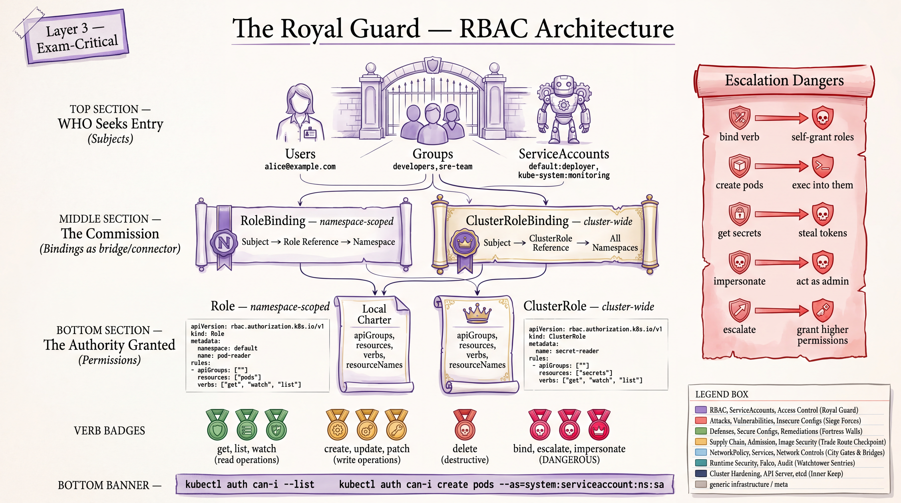
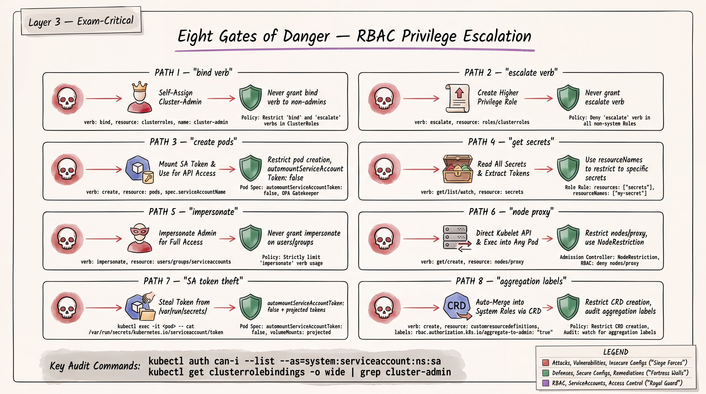
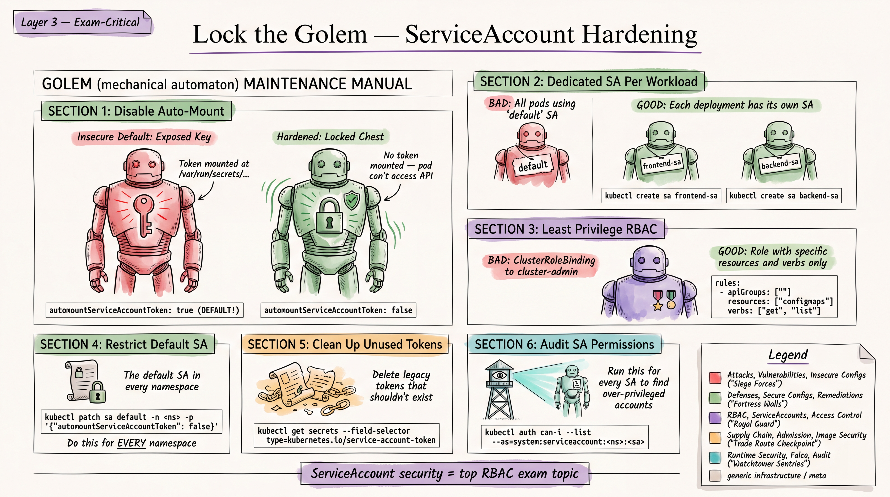
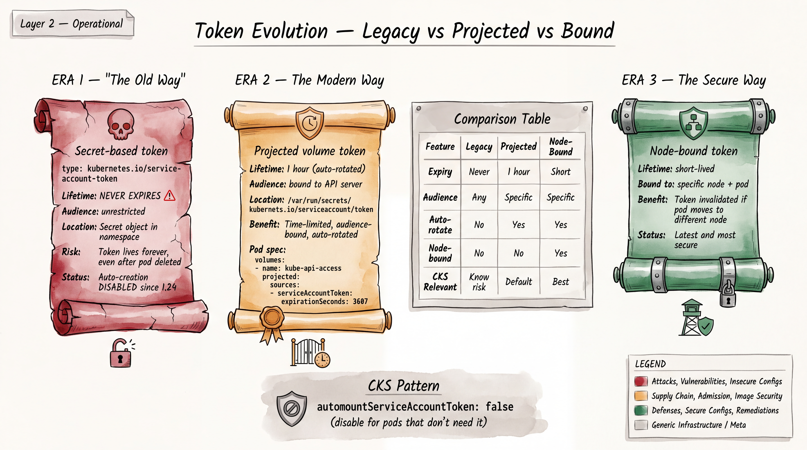

# CKS Study Guide: RBAC & ServiceAccount Security



> **Author:** Nirbhay Singh | **Exam Target:** CKS (Certified Kubernetes Security Specialist)
> **Prerequisite:** CKAD Certified (valid through Sep 2026)
> **Last Updated:** 2026-08-15

---

## Table of Contents

1. [RBAC Mastery](#1-rbac-mastery)
2. [RBAC Privilege Escalation Patterns](#2-rbac-privilege-escalation-patterns)
3. [ServiceAccount Security](#3-serviceaccount-security)
4. [RBAC Troubleshooting](#4-rbac-troubleshooting)
5. [RBAC YAML Templates](#5-rbac-yaml-templates)
6. [RBAC Exercises (15)](#6-rbac-exercises)
7. [ServiceAccount Security Exercises (15)](#7-serviceaccount-security-exercises)

---

## 1. RBAC Mastery

### 1.1 Core RBAC Objects

RBAC authorization uses `rbac.authorization.k8s.io/v1` (stable since Kubernetes 1.8). There are four object kinds:

| Object | Scope | Purpose |
|---|---|---|
| `Role` | Namespace | Defines permissions within a single namespace |
| `ClusterRole` | Cluster | Defines permissions cluster-wide or for non-namespaced resources |
| `RoleBinding` | Namespace | Grants a Role or ClusterRole's permissions within a namespace |
| `ClusterRoleBinding` | Cluster | Grants a ClusterRole's permissions cluster-wide |

**Critical rule:** A RoleBinding can reference a ClusterRole but will only grant permissions within the RoleBinding's namespace. This is a common pattern for reusing ClusterRoles across namespaces.

### 1.2 Role and ClusterRole

```yaml
# Role: namespace-scoped permissions
apiVersion: rbac.authorization.k8s.io/v1
kind: Role
metadata:
  namespace: production
  name: pod-reader
rules:
- apiGroups: [""]          # "" = core API group
  resources: ["pods"]
  verbs: ["get", "watch", "list"]
```

```yaml
# ClusterRole: cluster-scoped permissions
apiVersion: rbac.authorization.k8s.io/v1
kind: ClusterRole
metadata:
  name: secret-reader
rules:
- apiGroups: [""]
  resources: ["secrets"]
  verbs: ["get", "watch", "list"]
```

### 1.3 Complete Verb Reference

| Verb | HTTP Method | Description |
|---|---|---|
| `get` | GET (individual) | Read a single resource |
| `list` | GET (collection) | List resources |
| `watch` | GET (watch) | Watch for changes |
| `create` | POST | Create a resource |
| `update` | PUT | Replace a resource |
| `patch` | PATCH | Partially modify a resource |
| `delete` | DELETE (individual) | Delete a resource |
| `deletecollection` | DELETE (collection) | Delete a collection of resources |

**Special verbs (not mapped to HTTP):**
| Verb | Purpose | Security Implication |
|---|---|---|
| `bind` | Bind a Role/ClusterRole | Can grant permissions you don't have |
| `escalate` | Modify a Role/ClusterRole beyond your own permissions | Privilege escalation vector |
| `impersonate` | Act as another user/group/SA | Full identity takeover |
| `use` | Use a PodSecurityPolicy (deprecated) / Use a resource | Context-dependent |

### 1.4 API Groups

```yaml
rules:
# Core API group (pods, services, configmaps, secrets, nodes, namespaces, PVs, PVCs)
- apiGroups: [""]
  resources: ["pods", "services", "configmaps", "secrets"]
  verbs: ["get", "list"]

# apps group (deployments, statefulsets, daemonsets, replicasets)
- apiGroups: ["apps"]
  resources: ["deployments", "statefulsets", "daemonsets"]
  verbs: ["get", "list", "create", "update", "delete"]

# batch group (jobs, cronjobs)
- apiGroups: ["batch"]
  resources: ["jobs", "cronjobs"]
  verbs: ["get", "list", "create"]

# networking.k8s.io (networkpolicies, ingresses)
- apiGroups: ["networking.k8s.io"]
  resources: ["networkpolicies", "ingresses"]
  verbs: ["get", "list"]

# rbac.authorization.k8s.io (roles, rolebindings, clusterroles, clusterrolebindings)
- apiGroups: ["rbac.authorization.k8s.io"]
  resources: ["roles", "rolebindings"]
  verbs: ["get", "list"]

# policy group (poddisruptionbudgets)
- apiGroups: ["policy"]
  resources: ["poddisruptionbudgets"]
  verbs: ["get", "list"]

# certificates.k8s.io (certificatesigningrequests)
- apiGroups: ["certificates.k8s.io"]
  resources: ["certificatesigningrequests"]
  verbs: ["get", "list"]
```

### 1.5 Subresources

Subresources require explicit permission. They are specified with a slash:

```yaml
rules:
# Allow exec into pods
- apiGroups: [""]
  resources: ["pods/exec"]
  verbs: ["create"]

# Allow reading pod logs
- apiGroups: [""]
  resources: ["pods/log"]
  verbs: ["get"]

# Allow port-forwarding
- apiGroups: [""]
  resources: ["pods/portforward"]
  verbs: ["create"]

# Allow reading pod status
- apiGroups: [""]
  resources: ["pods/status"]
  verbs: ["get"]

# Node proxy access (DANGEROUS)
- apiGroups: [""]
  resources: ["nodes/proxy"]
  verbs: ["get", "create"]
```

### 1.6 resourceNames -- Restricting to Specific Objects

```yaml
apiVersion: rbac.authorization.k8s.io/v1
kind: Role
metadata:
  namespace: production
  name: configmap-updater
rules:
- apiGroups: [""]
  resources: ["configmaps"]
  resourceNames: ["app-config", "feature-flags"]  # ONLY these two ConfigMaps
  verbs: ["get", "update"]
```

**Important:** `resourceNames` cannot be used with `list`, `watch`, `create`, or `deletecollection` verbs because these operate on collections, not individual named resources.

### 1.7 RoleBinding and ClusterRoleBinding

```yaml
apiVersion: rbac.authorization.k8s.io/v1
kind: RoleBinding
metadata:
  name: read-pods
  namespace: production
subjects:
# User
- kind: User
  name: jane
  apiGroup: rbac.authorization.k8s.io
# Group
- kind: Group
  name: developers
  apiGroup: rbac.authorization.k8s.io
# ServiceAccount (note: apiGroup is "" for ServiceAccounts)
- kind: ServiceAccount
  name: monitoring-sa
  namespace: monitoring    # MUST specify namespace for cross-namespace SA references
roleRef:
  kind: Role              # or ClusterRole
  name: pod-reader
  apiGroup: rbac.authorization.k8s.io
```

**Critical points for CKS:**
- `roleRef` is immutable -- you cannot change it after creation. You must delete and recreate the binding.
- A `RoleBinding` referencing a `ClusterRole` constrains the permissions to the RoleBinding's namespace.
- A `ClusterRoleBinding` can ONLY reference a `ClusterRole` (never a `Role`).
- ServiceAccount subjects require `namespace` field when the SA is in a different namespace.

### 1.8 Namespace vs Cluster Scope

**Namespaced resources** (use Role + RoleBinding):
- pods, services, deployments, statefulsets, daemonsets, replicasets
- configmaps, secrets
- jobs, cronjobs
- roles, rolebindings
- serviceaccounts
- networkpolicies, ingresses
- PVCs, resourcequotas, limitranges

**Cluster-scoped resources** (require ClusterRole + ClusterRoleBinding):
- nodes
- persistentvolumes
- clusterroles, clusterrolebindings
- namespaces
- storageclasses
- certificatesigningrequests
- customresourcedefinitions

```bash
# List all namespaced resources
kubectl api-resources --namespaced=true

# List all cluster-scoped resources
kubectl api-resources --namespaced=false
```

### 1.9 Aggregation Rules

ClusterRoles can be composed from other ClusterRoles using aggregation labels. The API server automatically fills in the `rules` field by combining rules from ClusterRoles matching the label selector.

```yaml
# Aggregated ClusterRole (the "parent")
apiVersion: rbac.authorization.k8s.io/v1
kind: ClusterRole
metadata:
  name: monitoring-aggregate
aggregationRule:
  clusterRoleSelectors:
  - matchLabels:
      rbac.example.com/aggregate-to-monitoring: "true"
rules: []  # Rules are auto-filled by the controller
```

```yaml
# Contributing ClusterRole (the "child")
apiVersion: rbac.authorization.k8s.io/v1
kind: ClusterRole
metadata:
  name: monitoring-pods
  labels:
    rbac.example.com/aggregate-to-monitoring: "true"
rules:
- apiGroups: [""]
  resources: ["pods"]
  verbs: ["get", "list", "watch"]
```

**Built-in aggregated ClusterRoles:**
- `admin` aggregates ClusterRoles with label `rbac.authorization.k8s.io/aggregate-to-admin: "true"`
- `edit` aggregates ClusterRoles with label `rbac.authorization.k8s.io/aggregate-to-edit: "true"`
- `view` aggregates ClusterRoles with label `rbac.authorization.k8s.io/aggregate-to-view: "true"`

**CKS implication:** An attacker who can create ClusterRoles can inject permissions into `admin`, `edit`, or `view` by adding the appropriate aggregation label. This is a privilege escalation vector.

### 1.10 Impersonation

Users with impersonation permissions can act as another user, group, or ServiceAccount:

```yaml
apiVersion: rbac.authorization.k8s.io/v1
kind: ClusterRole
metadata:
  name: impersonator
rules:
- apiGroups: [""]
  resources: ["users", "groups", "serviceaccounts"]
  verbs: ["impersonate"]
# Optionally restrict which extras can be impersonated
- apiGroups: ["authentication.k8s.io"]
  resources: ["userextras/scopes"]
  verbs: ["impersonate"]
```

```bash
# Impersonate a user
kubectl auth can-i create pods --as=jane

# Impersonate a ServiceAccount
kubectl auth can-i create pods --as=system:serviceaccount:default:my-sa

# Impersonate a group
kubectl auth can-i create pods --as=jane --as-group=system:masters

# Impersonate and run a command
kubectl get pods --as=system:serviceaccount:kube-system:default
```

**CKS security consideration:** Impersonation is equivalent to identity theft. Any subject with unrestricted `impersonate` permissions on `users` or `groups` can become `system:masters` and gain full cluster admin access. Always restrict with `resourceNames`.

```yaml
# Safe: restrict impersonation to specific users only
rules:
- apiGroups: [""]
  resources: ["users"]
  verbs: ["impersonate"]
  resourceNames: ["jane", "bob"]   # Can only impersonate these users
```

### 1.11 Essential kubectl Commands for RBAC

```bash
# ===== Permission Checking =====

# Can I do this?
kubectl auth can-i create deployments
kubectl auth can-i create deployments --namespace=production

# Can a specific user do this?
kubectl auth can-i create deployments --as=jane

# Can a ServiceAccount do this?
kubectl auth can-i get secrets --as=system:serviceaccount:default:my-sa

# List ALL permissions for a user
kubectl auth can-i --list --as=jane
kubectl auth can-i --list --as=system:serviceaccount:default:my-sa

# List permissions in a specific namespace
kubectl auth can-i --list --as=jane --namespace=production

# ===== Viewing RBAC Objects =====

# List all ClusterRoles
kubectl get clusterroles

# List all ClusterRoleBindings with subjects
kubectl get clusterrolebindings -o wide

# List all RoleBindings in all namespaces
kubectl get rolebindings --all-namespaces -o wide

# Describe a specific role to see its rules
kubectl describe clusterrole admin
kubectl describe role pod-reader -n production

# ===== Creating RBAC Objects Imperatively =====

# Create a Role
kubectl create role pod-reader --verb=get,list,watch --resource=pods -n production

# Create a ClusterRole
kubectl create clusterrole secret-reader --verb=get,list --resource=secrets

# Create a RoleBinding
kubectl create rolebinding read-pods \
  --role=pod-reader \
  --user=jane \
  --namespace=production

# Create a RoleBinding for a ServiceAccount
kubectl create rolebinding sa-pod-reader \
  --role=pod-reader \
  --serviceaccount=default:my-sa \
  --namespace=production

# Create a ClusterRoleBinding
kubectl create clusterrolebinding cluster-admin-binding \
  --clusterrole=cluster-admin \
  --user=jane

# Create a ClusterRoleBinding for a ServiceAccount
kubectl create clusterrolebinding sa-cluster-reader \
  --clusterrole=view \
  --serviceaccount=monitoring:prometheus-sa

# ===== Dry-run for YAML generation =====
kubectl create role pod-reader --verb=get,list --resource=pods \
  --dry-run=client -o yaml > role.yaml

kubectl create rolebinding read-pods --role=pod-reader --user=jane \
  --dry-run=client -o yaml > rolebinding.yaml
```

---

## 2. RBAC Privilege Escalation Patterns



### 2.1 The `bind` Verb Escalation

**Attack path:** A user with the `bind` verb on Roles or ClusterRoles can create RoleBindings/ClusterRoleBindings that reference ANY Role/ClusterRole, including `cluster-admin`, even if the user does not have those permissions themselves.

```yaml
# DANGEROUS: allows binding any role
apiVersion: rbac.authorization.k8s.io/v1
kind: ClusterRole
metadata:
  name: dangerous-binder
rules:
- apiGroups: ["rbac.authorization.k8s.io"]
  resources: ["clusterrolebindings"]
  verbs: ["create"]
- apiGroups: ["rbac.authorization.k8s.io"]
  resources: ["clusterroles"]
  verbs: ["bind"]     # Can bind ANY ClusterRole
```

**Exploit:**
```bash
# Attacker binds cluster-admin to themselves
kubectl create clusterrolebinding pwned \
  --clusterrole=cluster-admin \
  --user=attacker
```

**Detection:**
```bash
# Find who has the bind verb on roles/clusterroles
kubectl auth can-i bind clusterroles --as=jane
kubectl get clusterrolebindings -o json | \
  jq '.items[] | select(.roleRef.name == "cluster-admin") | .subjects'
```

**Remediation:** Restrict `bind` with `resourceNames`:
```yaml
rules:
- apiGroups: ["rbac.authorization.k8s.io"]
  resources: ["clusterroles"]
  verbs: ["bind"]
  resourceNames: ["pod-reader", "log-reader"]  # Can ONLY bind these specific roles
```

### 2.2 The `escalate` Verb

**Attack path:** A user with the `escalate` verb on Roles/ClusterRoles can modify a Role or ClusterRole to add ANY permissions, even permissions they do not hold themselves. Without the `escalate` verb, the API server prevents a user from granting permissions they don't have.

```yaml
# DANGEROUS: allows escalation
apiVersion: rbac.authorization.k8s.io/v1
kind: ClusterRole
metadata:
  name: dangerous-escalator
rules:
- apiGroups: ["rbac.authorization.k8s.io"]
  resources: ["clusterroles"]
  verbs: ["get", "update", "escalate"]
```

**Exploit:**
```bash
# Attacker modifies a ClusterRole they are bound to, adding cluster-admin level permissions
kubectl edit clusterrole some-role
# Add: resources: ["*"], verbs: ["*"], apiGroups: ["*"]
```

**Detection:**
```bash
kubectl auth can-i escalate clusterroles --as=jane
kubectl auth can-i escalate roles --as=system:serviceaccount:default:my-sa -n production
```

**Remediation:** Never grant the `escalate` verb. It should only be held by cluster administrators (the `system:masters` group implicitly has this).

### 2.3 Pod Creation Escalation (create pods/exec)

**Attack path:** A user who can create pods in a namespace can mount any Secret in that namespace, use any ServiceAccount in that namespace, and run arbitrary code. Combined with `pods/exec`, they have a shell in the cluster network.

```yaml
# The user has this role:
rules:
- apiGroups: [""]
  resources: ["pods"]
  verbs: ["create"]
- apiGroups: [""]
  resources: ["pods/exec"]
  verbs: ["create"]
```

**Exploit:**
```yaml
# Attacker creates a pod with a privileged SA and mounts secrets
apiVersion: v1
kind: Pod
metadata:
  name: attacker-pod
  namespace: production
spec:
  serviceAccountName: admin-sa    # Uses a high-privilege SA in the namespace
  containers:
  - name: shell
    image: busybox
    command: ["sleep", "3600"]
    volumeMounts:
    - name: secret-vol
      mountPath: /secrets
  volumes:
  - name: secret-vol
    secret:
      secretName: database-credentials  # Mounts any secret in the namespace
```

**Detection:**
```bash
# Find who can create pods
kubectl auth can-i create pods --as=jane -n production
# Find who can exec into pods
kubectl auth can-i create pods/exec --as=jane -n production
# Find high-privilege ServiceAccounts
kubectl auth can-i --list --as=system:serviceaccount:production:admin-sa -n production
```

**Remediation:**
- Restrict pod creation to CI/CD service accounts only
- Use admission controllers (OPA/Gatekeeper, Kyverno) to restrict which ServiceAccounts can be specified
- Set `automountServiceAccountToken: false` on ServiceAccounts not needed by pods
- Use Pod Security Standards (restricted profile) to prevent privileged pods

### 2.4 Secrets Access Escalation

**Attack path:** A user who can read Secrets in a namespace can read ServiceAccount tokens (legacy, pre-1.24), TLS certificates, database credentials, and any other sensitive data stored as Secrets.

```yaml
# DANGEROUS: broad secret access
rules:
- apiGroups: [""]
  resources: ["secrets"]
  verbs: ["get", "list", "watch"]
```

**Exploit:**
```bash
# Read all secrets
kubectl get secrets -n production -o yaml
# Extract SA token (if legacy token secret exists)
kubectl get secret sa-token-xxxxx -n production -o jsonpath='{.data.token}' | base64 -d
```

**Detection:**
```bash
kubectl auth can-i get secrets --as=jane -n production
kubectl auth can-i list secrets --as=jane -n production
# Audit: find all bindings granting secret access
kubectl get clusterrolebindings -o json | \
  jq -r '.items[] | select(.roleRef.name | test("admin|edit|cluster-admin")) | 
  "\(.metadata.name) -> \(.roleRef.name): \(.subjects // [] | map(.name) | join(", "))"'
```

**Remediation:**
- Use `resourceNames` to restrict to specific secrets
- Separate sensitive secrets into dedicated namespaces with restricted access
- Use external secret management (Vault, Sealed Secrets, External Secrets Operator)
- Audit secret access via audit logging

### 2.5 Impersonation Escalation

**Attack path:** A user with unrestricted `impersonate` permissions can impersonate `system:masters` group members or any ServiceAccount, effectively gaining cluster-admin access.

```yaml
# EXTREMELY DANGEROUS
rules:
- apiGroups: [""]
  resources: ["users", "groups"]
  verbs: ["impersonate"]
  # No resourceNames restriction = can impersonate ANYONE
```

**Exploit:**
```bash
# Become cluster-admin
kubectl get secrets --all-namespaces --as=admin --as-group=system:masters
```

**Detection:**
```bash
kubectl auth can-i impersonate users --as=jane
kubectl auth can-i impersonate groups --as=jane
# Check for unrestricted impersonation
kubectl get clusterroles -o json | \
  jq '.items[] | select(.rules[]? | select(.resources[]? == "users" and 
  (.verbs[]? == "impersonate") and (.resourceNames == null or .resourceNames == [])))'
```

**Remediation:**
```yaml
# Safe: restrict impersonation to specific identities
rules:
- apiGroups: [""]
  resources: ["users"]
  verbs: ["impersonate"]
  resourceNames: ["jane", "bob"]
- apiGroups: [""]
  resources: ["groups"]
  verbs: ["impersonate"]
  resourceNames: ["developers"]  # Never allow system:masters
```

### 2.6 Node Proxy Escalation

**Attack path:** Access to the `nodes/proxy` subresource allows direct API calls to the kubelet on any node, bypassing RBAC entirely. The kubelet API provides access to exec into any pod on the node, read pod logs, and more.

```yaml
# DANGEROUS
rules:
- apiGroups: [""]
  resources: ["nodes/proxy"]
  verbs: ["get", "create"]
```

**Exploit:**
```bash
# Direct kubelet API access -- exec into any pod on the node
curl -k https://<node-ip>:10250/run/<namespace>/<pod-name>/<container-name> \
  -X POST -d "cmd=cat /etc/shadow"
```

**Detection:**
```bash
kubectl auth can-i get nodes/proxy --as=jane
kubectl auth can-i create nodes/proxy --as=jane
```

**Remediation:**
- Never grant `nodes/proxy` to non-admin users
- Enable kubelet authentication and authorization (`--authorization-mode=Webhook`)
- Disable anonymous kubelet access (`--anonymous-auth=false`)

### 2.7 ServiceAccount Token Theft

**Attack path:** Legacy ServiceAccount token Secrets (auto-generated before Kubernetes 1.24) contain non-expiring tokens. If an attacker gains access to these Secrets or to a pod with a mounted token, they can authenticate as that ServiceAccount indefinitely.

**Exploit:**
```bash
# From inside a compromised pod
cat /var/run/secrets/kubernetes.io/serviceaccount/token
# Use the token externally
curl -k -H "Authorization: Bearer <token>" https://kubernetes.default/api/v1/namespaces
```

**Detection:**
```bash
# Find legacy SA token secrets (type kubernetes.io/service-account-token)
kubectl get secrets --all-namespaces -o json | \
  jq '.items[] | select(.type == "kubernetes.io/service-account-token") | 
  "\(.metadata.namespace)/\(.metadata.name)"'

# Find pods with auto-mounted tokens
kubectl get pods --all-namespaces -o json | \
  jq '.items[] | select(.spec.automountServiceAccountToken != false) | 
  "\(.metadata.namespace)/\(.metadata.name)"'
```

**Remediation:**
- Set `automountServiceAccountToken: false` on ServiceAccounts and Pods that don't need API access
- Delete legacy token Secrets (Kubernetes 1.24+ no longer auto-creates them)
- Use projected (bound, time-limited) tokens instead
- Rotate tokens regularly
- Use NetworkPolicies to restrict access to the API server

### 2.8 Aggregation Label Injection

**Attack path:** A user who can create ClusterRoles can inject permissions into the built-in `admin`, `edit`, or `view` ClusterRoles by adding the aggregation label.

```yaml
# Attacker creates this ClusterRole
apiVersion: rbac.authorization.k8s.io/v1
kind: ClusterRole
metadata:
  name: innocent-looking-role
  labels:
    rbac.authorization.k8s.io/aggregate-to-view: "true"  # Injected into "view"
rules:
- apiGroups: [""]
  resources: ["secrets"]     # Now every "view" user can read secrets
  verbs: ["get", "list"]
```

**Detection:**
```bash
# Check what is aggregated into built-in roles
kubectl get clusterroles -l rbac.authorization.k8s.io/aggregate-to-admin=true
kubectl get clusterroles -l rbac.authorization.k8s.io/aggregate-to-edit=true
kubectl get clusterroles -l rbac.authorization.k8s.io/aggregate-to-view=true

# Review actual permissions of aggregated roles
kubectl describe clusterrole view
```

**Remediation:**
- Restrict ClusterRole creation to cluster administrators
- Use admission controllers to block creation of ClusterRoles with aggregation labels
- Regularly audit aggregated ClusterRoles

---

## 3. ServiceAccount Security



### 3.1 ServiceAccount Fundamentals

Every namespace gets a `default` ServiceAccount automatically. Every pod that does not specify a `serviceAccountName` uses the `default` SA. ServiceAccounts are namespaced resources.

```bash
# List ServiceAccounts
kubectl get serviceaccounts -n production
kubectl get sa -n production

# Create a ServiceAccount
kubectl create serviceaccount my-app-sa -n production

# View details
kubectl describe sa my-app-sa -n production
```

### 3.2 Default ServiceAccount Risks

The `default` ServiceAccount in every namespace is a security risk because:

1. **Shared identity:** All pods without an explicit SA share the same identity
2. **Auto-mounted token:** By default, the token is mounted into every pod
3. **Discovery permissions:** The default SA often has discovery API permissions
4. **Blast radius:** If any pod using `default` is compromised, the token is shared across all pods

**CKS best practice:** Never use the `default` ServiceAccount for workloads.

### 3.3 automountServiceAccountToken

This field controls whether the SA token is automatically mounted at `/var/run/secrets/kubernetes.io/serviceaccount/` in pods.

**Set at the ServiceAccount level (affects all pods using this SA):**
```yaml
apiVersion: v1
kind: ServiceAccount
metadata:
  name: my-app-sa
  namespace: production
automountServiceAccountToken: false
```

**Set at the Pod level (overrides ServiceAccount setting):**
```yaml
apiVersion: v1
kind: Pod
metadata:
  name: my-app
  namespace: production
spec:
  serviceAccountName: my-app-sa
  automountServiceAccountToken: false   # Pod-level takes precedence
  containers:
  - name: app
    image: my-app:1.0
```

**Precedence rules:**
1. If the Pod spec sets `automountServiceAccountToken`, that value wins
2. If the Pod spec does not set it, the ServiceAccount setting is used
3. If neither sets it, the default is `true` (token IS mounted)

**CKS recommendation:** Set `automountServiceAccountToken: false` on the `default` ServiceAccount in every namespace:

```bash
kubectl patch serviceaccount default -n production \
  -p '{"automountServiceAccountToken": false}'
```

### 3.4 Token Types: Legacy vs Projected (Bound)



#### Legacy Tokens (pre-Kubernetes 1.24)

Before 1.24, creating a ServiceAccount auto-generated a Secret of type `kubernetes.io/service-account-token` containing a JWT token.

**Problems with legacy tokens:**
- **Non-expiring:** Token never expires
- **Not audience-bound:** Token is valid for any audience
- **Stored as Secret:** Accessible to anyone with Secret read permissions
- **Not automatically rotated**

```yaml
# Legacy token secret (DO NOT CREATE THESE)
apiVersion: v1
kind: Secret
metadata:
  name: my-sa-token-xxxxx
  annotations:
    kubernetes.io/service-account.name: my-sa
type: kubernetes.io/service-account-token
```

#### Projected (Bound) Tokens (Kubernetes 1.20+, default from 1.22+)

Modern Kubernetes uses the `TokenRequest` API to issue projected service account tokens that are:
- **Time-limited:** Default expiration of 1 hour (configurable, auto-refreshed by kubelet)
- **Audience-bound:** Scoped to a specific audience
- **Not stored as Secrets:** Generated on demand
- **Auto-rotated:** kubelet refreshes the token before expiration

```yaml
# Projected volume with SA token (this is what modern K8s does automatically)
apiVersion: v1
kind: Pod
metadata:
  name: my-app
spec:
  serviceAccountName: my-app-sa
  containers:
  - name: app
    image: my-app:1.0
    volumeMounts:
    - name: token
      mountPath: /var/run/secrets/kubernetes.io/serviceaccount
      readOnly: true
  volumes:
  - name: token
    projected:
      sources:
      - serviceAccountToken:
          path: token
          expirationSeconds: 3600    # 1 hour
          audience: api              # Audience binding
      - configMap:
          name: kube-root-ca.crt
          items:
          - key: ca.crt
            path: ca.crt
      - downwardAPI:
          items:
          - path: namespace
            fieldRef:
              fieldPath: metadata.namespace
```

#### Token Auto-Revocation

Projected tokens are automatically invalidated approximately **60 seconds** after the pod's `.metadata.deletionTimestamp` is set. This means that even if a token is exfiltrated, it becomes useless shortly after the pod is deleted.

#### Node-Bound Tokens (Kubernetes 1.31+)

Starting in Kubernetes 1.31, tokens can be bound to a specific node, adding an additional layer of security:

```bash
# Create a node-bound token
kubectl create token my-app-sa -n production \
  --bound-object-kind Node \
  --bound-object-name worker-node-1
```

Node-bound tokens are automatically invalidated if the referenced node is deleted, providing stronger revocation guarantees.

#### Manually Creating a Token (Kubernetes 1.24+)

```bash
# Create a short-lived token (expires in 1 hour by default)
kubectl create token my-app-sa -n production

# Create a token with custom expiration
kubectl create token my-app-sa -n production --duration=10m

# Create a token with specific audience
kubectl create token my-app-sa -n production --audience=https://my-service.example.com
```

**Important deprecation:** The field `.spec.serviceAccount` is deprecated. Always use `.spec.serviceAccountName` in pod specs.

**If you absolutely need a long-lived token** (not recommended, but may appear on CKS exam):
```yaml
apiVersion: v1
kind: Secret
metadata:
  name: my-long-lived-token
  namespace: production
  annotations:
    kubernetes.io/service-account.name: my-app-sa
type: kubernetes.io/service-account-token
# Token is auto-populated by the token controller
```

### 3.5 Workloads That Do Not Need API Access

Most application workloads do NOT need to talk to the Kubernetes API. Always disable token mounting unless the workload specifically requires it:

**Workloads that typically DO need API access:**
- Operators and controllers
- In-cluster service discovery clients (though DNS is preferred)
- CI/CD runners creating/managing K8s resources
- Monitoring agents (Prometheus, etc.)
- Ingress controllers

**Workloads that typically DO NOT need API access:**
- Web applications
- Databases
- Message queues
- Batch processing jobs
- Stateless microservices
- Cron jobs doing non-K8s work

### 3.6 RBAC and ServiceAccount Relationship

ServiceAccounts are subjects in RBAC bindings. The subject format is:

```yaml
subjects:
- kind: ServiceAccount
  name: my-app-sa
  namespace: production    # Required for cross-namespace references
```

The system-recognized username for a ServiceAccount is:
```
system:serviceaccount:<namespace>:<name>
```

The system-recognized group for all SAs in a namespace:
```
system:serviceaccounts:<namespace>
```

The system-recognized group for ALL SAs in the cluster:
```
system:serviceaccounts
```

**Example: Bind to all SAs in a namespace:**
```yaml
apiVersion: rbac.authorization.k8s.io/v1
kind: RoleBinding
metadata:
  name: all-sa-readers
  namespace: production
subjects:
- kind: Group
  name: system:serviceaccounts:production   # All SAs in "production" namespace
  apiGroup: rbac.authorization.k8s.io
roleRef:
  kind: Role
  name: pod-reader
  apiGroup: rbac.authorization.k8s.io
```

### 3.7 Token Exposure Risks

| Risk | Description | Mitigation |
|---|---|---|
| Environment variable leaks | Token path leaked in logs or error messages | Don't log mount paths |
| Container escape | Compromised container reads token from filesystem | `automountServiceAccountToken: false` |
| Image with secrets | Token baked into container image | Never embed tokens in images |
| Sidecar containers | All containers in a pod share the same SA token | Use separate pods for different trust levels |
| Volume mounts | Token accessible via shared volumes | Mount token read-only, restrict volume access |
| Debug endpoints | Token exposed via debug/profiling endpoints | Disable debug endpoints in production |
| Log aggregation | Token logged by application or sidecar | Scrub tokens from log pipelines |

---

## 4. RBAC Troubleshooting

### 4.1 Diagnosing "Forbidden" Errors

When you see an error like:
```
Error from server (Forbidden): pods is forbidden: User "jane" cannot list resource "pods" in API group "" in the namespace "production"
```

**Step-by-step diagnosis:**

```bash
# Step 1: Confirm the exact permissions the user has
kubectl auth can-i --list --as=jane -n production

# Step 2: Check if the user can do the specific action
kubectl auth can-i list pods --as=jane -n production

# Step 3: Find all RoleBindings in the namespace
kubectl get rolebindings -n production -o wide

# Step 4: Find all ClusterRoleBindings that might apply
kubectl get clusterrolebindings -o wide | grep -E "jane|developers"

# Step 5: Check what the referenced Role/ClusterRole actually grants
kubectl describe role <role-name> -n production
kubectl describe clusterrole <clusterrole-name>

# Step 6: Verify the user's identity and groups
# (check authentication -- the user might be in a different group than expected)
kubectl auth whoami  # Kubernetes 1.27+
```

### 4.2 Finding Permissions for a ServiceAccount

```bash
# List all permissions for a ServiceAccount
kubectl auth can-i --list \
  --as=system:serviceaccount:production:my-app-sa \
  -n production

# Check a specific permission
kubectl auth can-i get secrets \
  --as=system:serviceaccount:production:my-app-sa \
  -n production

# Find all RoleBindings referencing this SA (in the namespace)
kubectl get rolebindings -n production -o json | \
  jq -r '.items[] | select(.subjects[]? | 
  select(.kind == "ServiceAccount" and .name == "my-app-sa")) | .metadata.name'

# Find all ClusterRoleBindings referencing this SA
kubectl get clusterrolebindings -o json | \
  jq -r '.items[] | select(.subjects[]? | 
  select(.kind == "ServiceAccount" and .name == "my-app-sa" and 
  .namespace == "production")) | .metadata.name'
```

### 4.3 Finding Bindings That Reference a Specific Role

```bash
# Find all RoleBindings that reference a specific Role
kubectl get rolebindings --all-namespaces -o json | \
  jq -r '.items[] | select(.roleRef.name == "pod-reader") | 
  "\(.metadata.namespace)/\(.metadata.name) -> subjects: \(.subjects | map(.name) | join(", "))"'

# Find all ClusterRoleBindings that reference a specific ClusterRole
kubectl get clusterrolebindings -o json | \
  jq -r '.items[] | select(.roleRef.name == "cluster-admin") | 
  "\(.metadata.name) -> subjects: \(.subjects // [] | map(.kind + ":" + .name) | join(", "))"'
```

### 4.4 Auditing Cluster-Wide Permissions

```bash
# ===== Dangerous Permission Audit =====

# Find all cluster-admin bindings
kubectl get clusterrolebindings -o json | \
  jq -r '.items[] | select(.roleRef.name == "cluster-admin") | 
  "\(.metadata.name): \(.subjects // [] | map(.kind + "/" + .name) | join(", "))"'

# Find all subjects with wildcard permissions
kubectl get clusterroles -o json | \
  jq '.items[] | select(.rules[]? | select(
  (.verbs[]? == "*") and (.resources[]? == "*") and (.apiGroups[]? == "*"))) | 
  .metadata.name'

# Find all subjects that can read secrets cluster-wide
kubectl get clusterrolebindings -o json | \
  jq -r '.items[] as $binding | 
  ($binding.roleRef.name) as $role |
  $binding.subjects[]? | 
  "\($role) -> \(.kind)/\(.name)"' | sort

# Find ServiceAccounts with dangerous permissions
for ns in $(kubectl get ns -o jsonpath='{.items[*].metadata.name}'); do
  for sa in $(kubectl get sa -n $ns -o jsonpath='{.items[*].metadata.name}'); do
    perms=$(kubectl auth can-i --list --as=system:serviceaccount:$ns:$sa -n $ns 2>/dev/null | grep -v "^Resources")
    if echo "$perms" | grep -q "secrets.*get\|secrets.*list\|\*.*\*"; then
      echo "WARNING: $ns/$sa has sensitive permissions"
      echo "$perms" | grep -E "secrets|\*"
      echo "---"
    fi
  done
done

# ===== Quick Audit Commands =====

# Count of ClusterRoleBindings per ClusterRole
kubectl get clusterrolebindings -o json | \
  jq -r '[.items[] | .roleRef.name] | group_by(.) | map({role: .[0], count: length}) | 
  sort_by(-.count) | .[] | "\(.role): \(.count)"'

# Find RoleBindings/ClusterRoleBindings with no subjects (orphaned)
kubectl get clusterrolebindings -o json | \
  jq -r '.items[] | select(.subjects == null or (.subjects | length) == 0) | .metadata.name'
```

### 4.5 Using Audit Logs for RBAC

Kubernetes audit logs record all API requests including authorization decisions. Enable audit logging with a policy:

```yaml
# Audit policy to log RBAC-related events
apiVersion: audit.k8s.io/v1
kind: Policy
rules:
# Log all RBAC changes at RequestResponse level
- level: RequestResponse
  resources:
  - group: "rbac.authorization.k8s.io"
    resources: ["roles", "rolebindings", "clusterroles", "clusterrolebindings"]
# Log secret access at Metadata level (not the secret content)
- level: Metadata
  resources:
  - group: ""
    resources: ["secrets"]
# Log ServiceAccount token requests
- level: Metadata
  resources:
  - group: "authentication.k8s.io"
    resources: ["tokenreviews"]
```

---

## 5. RBAC YAML Templates

### 5.1 Minimal Read-Only Role (Namespace-Scoped)

```yaml
apiVersion: rbac.authorization.k8s.io/v1
kind: Role
metadata:
  namespace: production
  name: readonly
rules:
- apiGroups: [""]
  resources: ["pods", "services", "configmaps"]
  verbs: ["get", "list", "watch"]
- apiGroups: ["apps"]
  resources: ["deployments", "replicasets"]
  verbs: ["get", "list", "watch"]
```

### 5.2 Role for Specific Resource and Verb

```yaml
apiVersion: rbac.authorization.k8s.io/v1
kind: Role
metadata:
  namespace: production
  name: deployment-manager
rules:
- apiGroups: ["apps"]
  resources: ["deployments"]
  verbs: ["get", "list", "watch", "create", "update", "patch"]
- apiGroups: ["apps"]
  resources: ["deployments/scale"]
  verbs: ["update", "patch"]
```

### 5.3 ClusterRole for Cluster-Wide Read Access

```yaml
apiVersion: rbac.authorization.k8s.io/v1
kind: ClusterRole
metadata:
  name: cluster-reader
rules:
- apiGroups: [""]
  resources: ["nodes", "namespaces", "persistentvolumes"]
  verbs: ["get", "list", "watch"]
- apiGroups: ["apps"]
  resources: ["deployments", "statefulsets", "daemonsets"]
  verbs: ["get", "list", "watch"]
- apiGroups: [""]
  resources: ["pods", "services", "configmaps"]
  verbs: ["get", "list", "watch"]
# Explicitly NOT including secrets
```

### 5.4 RoleBinding Template

```yaml
apiVersion: rbac.authorization.k8s.io/v1
kind: RoleBinding
metadata:
  name: readonly-binding
  namespace: production
subjects:
- kind: User
  name: jane
  apiGroup: rbac.authorization.k8s.io
- kind: ServiceAccount
  name: monitoring-sa
  namespace: monitoring
roleRef:
  kind: Role
  name: readonly
  apiGroup: rbac.authorization.k8s.io
```

### 5.5 ClusterRoleBinding Template

```yaml
apiVersion: rbac.authorization.k8s.io/v1
kind: ClusterRoleBinding
metadata:
  name: cluster-reader-binding
subjects:
- kind: Group
  name: platform-team
  apiGroup: rbac.authorization.k8s.io
roleRef:
  kind: ClusterRole
  name: cluster-reader
  apiGroup: rbac.authorization.k8s.io
```

### 5.6 ServiceAccount with Restricted Permissions (Complete Example)

```yaml
# 1. Create the ServiceAccount
apiVersion: v1
kind: ServiceAccount
metadata:
  name: app-sa
  namespace: production
automountServiceAccountToken: false   # Don't auto-mount unless needed
---
# 2. Create a minimal Role
apiVersion: rbac.authorization.k8s.io/v1
kind: Role
metadata:
  name: app-role
  namespace: production
rules:
- apiGroups: [""]
  resources: ["configmaps"]
  resourceNames: ["app-config"]     # Only this specific ConfigMap
  verbs: ["get", "watch"]
---
# 3. Bind the Role to the ServiceAccount
apiVersion: rbac.authorization.k8s.io/v1
kind: RoleBinding
metadata:
  name: app-rolebinding
  namespace: production
subjects:
- kind: ServiceAccount
  name: app-sa
  namespace: production
roleRef:
  kind: Role
  name: app-role
  apiGroup: rbac.authorization.k8s.io
---
# 4. Use in a Pod (explicitly mount token only if needed)
apiVersion: v1
kind: Pod
metadata:
  name: my-app
  namespace: production
spec:
  serviceAccountName: app-sa
  automountServiceAccountToken: true   # Override SA setting because this pod needs API access
  containers:
  - name: app
    image: my-app:1.0
    resources:
      limits:
        memory: "128Mi"
        cpu: "250m"
```

### 5.7 CKS Exam Quick-Reference: Imperative Commands

```bash
# === ServiceAccount ===
kubectl create sa my-sa -n production
kubectl create token my-sa -n production --duration=1h

# === Role ===
kubectl create role pod-reader \
  --verb=get,list,watch \
  --resource=pods \
  -n production

kubectl create role secret-access \
  --verb=get \
  --resource=secrets \
  --resource-name=my-secret \
  -n production

# === ClusterRole ===
kubectl create clusterrole node-reader \
  --verb=get,list,watch \
  --resource=nodes

# === RoleBinding ===
kubectl create rolebinding my-binding \
  --role=pod-reader \
  --serviceaccount=production:my-sa \
  -n production

# === ClusterRoleBinding ===
kubectl create clusterrolebinding my-cluster-binding \
  --clusterrole=node-reader \
  --serviceaccount=production:my-sa

# === Verify ===
kubectl auth can-i get pods \
  --as=system:serviceaccount:production:my-sa \
  -n production

kubectl auth can-i --list \
  --as=system:serviceaccount:production:my-sa \
  -n production

# === Patch default SA ===
kubectl patch sa default -n production \
  -p '{"automountServiceAccountToken": false}'

# === Generate YAML ===
kubectl create role pod-reader --verb=get,list --resource=pods \
  -n production --dry-run=client -o yaml
```

---

## 6. RBAC Exercises (15)

### Exercise 1: Identify Excessive Permissions

**Scenario:** A developer has this ClusterRoleBinding:
```yaml
apiVersion: rbac.authorization.k8s.io/v1
kind: ClusterRoleBinding
metadata:
  name: dev-binding
subjects:
- kind: User
  name: developer-jane
  apiGroup: rbac.authorization.k8s.io
roleRef:
  kind: ClusterRole
  name: cluster-admin
  apiGroup: rbac.authorization.k8s.io
```

**Task:** Jane only needs to read pods and logs in the `development` namespace. Fix this.

**Solution:**
```bash
# Delete the overly broad binding
kubectl delete clusterrolebinding dev-binding

# Create a namespace-scoped role
kubectl create role dev-reader \
  --verb=get,list,watch \
  --resource=pods \
  -n development

# Add log access
cat <<EOF | kubectl apply -f -
apiVersion: rbac.authorization.k8s.io/v1
kind: Role
metadata:
  name: dev-reader
  namespace: development
rules:
- apiGroups: [""]
  resources: ["pods"]
  verbs: ["get", "list", "watch"]
- apiGroups: [""]
  resources: ["pods/log"]
  verbs: ["get"]
EOF

# Bind to jane
kubectl create rolebinding jane-dev-reader \
  --role=dev-reader \
  --user=developer-jane \
  -n development
```

**Verification:**
```bash
kubectl auth can-i list pods --as=developer-jane -n development        # yes
kubectl auth can-i get pods/log --as=developer-jane -n development     # yes
kubectl auth can-i create pods --as=developer-jane -n development      # no
kubectl auth can-i list secrets --as=developer-jane -n development     # no
kubectl auth can-i list pods --as=developer-jane -n production         # no
```

---

### Exercise 2: Create a Minimal Secret Reader

**Scenario:** A backup service needs read-only access to secrets named `db-credentials` and `tls-cert` in the `production` namespace. Nothing else.

**Task:** Create the most restrictive RBAC setup possible.

**Solution:**
```yaml
apiVersion: v1
kind: ServiceAccount
metadata:
  name: backup-sa
  namespace: production
automountServiceAccountToken: false
---
apiVersion: rbac.authorization.k8s.io/v1
kind: Role
metadata:
  name: backup-secret-reader
  namespace: production
rules:
- apiGroups: [""]
  resources: ["secrets"]
  resourceNames: ["db-credentials", "tls-cert"]
  verbs: ["get"]
---
apiVersion: rbac.authorization.k8s.io/v1
kind: RoleBinding
metadata:
  name: backup-secret-reader-binding
  namespace: production
subjects:
- kind: ServiceAccount
  name: backup-sa
  namespace: production
roleRef:
  kind: Role
  name: backup-secret-reader
  apiGroup: rbac.authorization.k8s.io
```

**Verification:**
```bash
kubectl auth can-i get secrets/db-credentials \
  --as=system:serviceaccount:production:backup-sa -n production      # yes
kubectl auth can-i get secrets/tls-cert \
  --as=system:serviceaccount:production:backup-sa -n production      # yes
kubectl auth can-i list secrets \
  --as=system:serviceaccount:production:backup-sa -n production      # no
kubectl auth can-i get secrets/other-secret \
  --as=system:serviceaccount:production:backup-sa -n production      # no
```

---

### Exercise 3: Fix Overly Broad ClusterRole

**Scenario:** This ClusterRole was created for a monitoring tool:
```yaml
apiVersion: rbac.authorization.k8s.io/v1
kind: ClusterRole
metadata:
  name: monitoring-role
rules:
- apiGroups: ["*"]
  resources: ["*"]
  verbs: ["*"]
```

**Task:** The monitoring tool only needs to read pods, nodes, services, and endpoints. Fix the ClusterRole.

**Solution:**
```yaml
apiVersion: rbac.authorization.k8s.io/v1
kind: ClusterRole
metadata:
  name: monitoring-role
rules:
- apiGroups: [""]
  resources: ["pods", "nodes", "services", "endpoints"]
  verbs: ["get", "list", "watch"]
- apiGroups: [""]
  resources: ["pods/log"]
  verbs: ["get"]
- apiGroups: ["metrics.k8s.io"]
  resources: ["pods", "nodes"]
  verbs: ["get", "list"]
```

**Verification:**
```bash
kubectl describe clusterrole monitoring-role
# Confirm only the specified resources and verbs are listed
```

---

### Exercise 4: Detect Privilege Escalation via bind

**Scenario:** Audit the cluster. The following ClusterRole exists:
```yaml
apiVersion: rbac.authorization.k8s.io/v1
kind: ClusterRole
metadata:
  name: role-manager
rules:
- apiGroups: ["rbac.authorization.k8s.io"]
  resources: ["roles", "clusterroles"]
  verbs: ["get", "list", "create", "update", "bind"]
- apiGroups: ["rbac.authorization.k8s.io"]
  resources: ["rolebindings", "clusterrolebindings"]
  verbs: ["get", "list", "create"]
```

**Task:** Identify the escalation path and fix it.

**Problem:** The `bind` verb without `resourceNames` restriction allows the subject to bind ANY ClusterRole, including `cluster-admin`. Combined with `create` on `clusterrolebindings`, they can make themselves cluster-admin.

**Solution:**
```yaml
apiVersion: rbac.authorization.k8s.io/v1
kind: ClusterRole
metadata:
  name: role-manager
rules:
- apiGroups: ["rbac.authorization.k8s.io"]
  resources: ["roles", "clusterroles"]
  verbs: ["get", "list"]
  # Removed: create, update, bind
- apiGroups: ["rbac.authorization.k8s.io"]
  resources: ["rolebindings", "clusterrolebindings"]
  verbs: ["get", "list"]
  # Removed: create
```

If the subject genuinely needs to create bindings for specific roles:
```yaml
rules:
- apiGroups: ["rbac.authorization.k8s.io"]
  resources: ["roles", "clusterroles"]
  verbs: ["get", "list"]
- apiGroups: ["rbac.authorization.k8s.io"]
  resources: ["clusterroles"]
  verbs: ["bind"]
  resourceNames: ["pod-reader", "log-reader"]   # ONLY these roles
- apiGroups: ["rbac.authorization.k8s.io"]
  resources: ["rolebindings"]
  verbs: ["create"]
  # Restricting to RoleBindings (not ClusterRoleBindings) limits scope to namespace
```

**Verification:**
```bash
# Confirm bind is restricted
kubectl describe clusterrole role-manager
# Attempt escalation (should fail)
kubectl auth can-i bind clusterroles/cluster-admin \
  --as=<subject> 
```

---

### Exercise 5: Aggregation Label Injection Detection

**Scenario:** During an audit, you find an unexpected ClusterRole:
```yaml
apiVersion: rbac.authorization.k8s.io/v1
kind: ClusterRole
metadata:
  name: custom-crds-viewer
  labels:
    rbac.authorization.k8s.io/aggregate-to-view: "true"
rules:
- apiGroups: [""]
  resources: ["secrets"]
  verbs: ["get", "list", "watch"]
```

**Task:** What is wrong? Fix it.

**Problem:** This ClusterRole has the `aggregate-to-view` label, which means its rules are automatically merged into the built-in `view` ClusterRole. Every user/SA bound to `view` now has full read access to secrets, which `view` deliberately excludes by default.

**Solution:**
```bash
# Remove the aggregation label
kubectl label clusterrole custom-crds-viewer \
  rbac.authorization.k8s.io/aggregate-to-view-

# Or delete the ClusterRole if it is malicious
kubectl delete clusterrole custom-crds-viewer

# Verify the view role no longer includes secrets
kubectl describe clusterrole view | grep secrets
# Should show no secret-related rules
```

**Verification:**
```bash
# List all ClusterRoles aggregating into view
kubectl get clusterroles -l rbac.authorization.k8s.io/aggregate-to-view=true
# Verify view permissions
kubectl describe clusterrole view
```

---

### Exercise 6: Cross-Namespace ServiceAccount Access

**Scenario:** A pod in the `monitoring` namespace needs to list pods in the `production` namespace using its ServiceAccount.

**Task:** Create the RBAC configuration. Use least privilege.

**Solution:**
```yaml
# ServiceAccount in monitoring namespace (already exists or create it)
apiVersion: v1
kind: ServiceAccount
metadata:
  name: monitor-sa
  namespace: monitoring
---
# Role in the TARGET namespace (production)
apiVersion: rbac.authorization.k8s.io/v1
kind: Role
metadata:
  name: pod-lister
  namespace: production
rules:
- apiGroups: [""]
  resources: ["pods"]
  verbs: ["get", "list", "watch"]
---
# RoleBinding in the TARGET namespace, referencing the SA from monitoring
apiVersion: rbac.authorization.k8s.io/v1
kind: RoleBinding
metadata:
  name: monitor-pod-lister
  namespace: production       # Binding is in production
subjects:
- kind: ServiceAccount
  name: monitor-sa
  namespace: monitoring       # SA is in monitoring -- cross-namespace reference
roleRef:
  kind: Role
  name: pod-lister
  apiGroup: rbac.authorization.k8s.io
```

**Verification:**
```bash
kubectl auth can-i list pods \
  --as=system:serviceaccount:monitoring:monitor-sa \
  -n production                                           # yes
kubectl auth can-i list pods \
  --as=system:serviceaccount:monitoring:monitor-sa \
  -n default                                              # no
kubectl auth can-i list secrets \
  --as=system:serviceaccount:monitoring:monitor-sa \
  -n production                                           # no
```

---

### Exercise 7: Impersonation Lockdown

**Scenario:** A CI/CD system has this ClusterRole:
```yaml
apiVersion: rbac.authorization.k8s.io/v1
kind: ClusterRole
metadata:
  name: ci-impersonator
rules:
- apiGroups: [""]
  resources: ["users", "groups", "serviceaccounts"]
  verbs: ["impersonate"]
```

**Task:** This is dangerous. The CI system only needs to impersonate the `deployer` user and the `ci-runners` group. Fix it.

**Solution:**
```yaml
apiVersion: rbac.authorization.k8s.io/v1
kind: ClusterRole
metadata:
  name: ci-impersonator
rules:
- apiGroups: [""]
  resources: ["users"]
  verbs: ["impersonate"]
  resourceNames: ["deployer"]
- apiGroups: [""]
  resources: ["groups"]
  verbs: ["impersonate"]
  resourceNames: ["ci-runners"]
# Removed: serviceaccounts impersonation entirely
```

**Verification:**
```bash
# These should succeed
kubectl auth can-i impersonate users/deployer --as=ci-sa
# These should fail
kubectl auth can-i impersonate users/admin --as=ci-sa
kubectl auth can-i impersonate groups/system:masters --as=ci-sa
```

---

### Exercise 8: Namespace Admin Without Secrets

**Scenario:** You need to give a team full admin access to the `staging` namespace, but they should NOT be able to read secrets.

**Task:** Create the RBAC setup. You cannot use the built-in `admin` ClusterRole because it includes secret access.

**Solution:**
```yaml
apiVersion: rbac.authorization.k8s.io/v1
kind: Role
metadata:
  name: ns-admin-no-secrets
  namespace: staging
rules:
# Full access to common workload resources
- apiGroups: [""]
  resources: ["pods", "services", "configmaps", "persistentvolumeclaims",
              "endpoints", "serviceaccounts"]
  verbs: ["get", "list", "watch", "create", "update", "patch", "delete"]
- apiGroups: [""]
  resources: ["pods/exec", "pods/log", "pods/portforward"]
  verbs: ["get", "create"]
- apiGroups: ["apps"]
  resources: ["deployments", "statefulsets", "daemonsets", "replicasets"]
  verbs: ["get", "list", "watch", "create", "update", "patch", "delete"]
- apiGroups: ["batch"]
  resources: ["jobs", "cronjobs"]
  verbs: ["get", "list", "watch", "create", "update", "patch", "delete"]
- apiGroups: ["networking.k8s.io"]
  resources: ["ingresses", "networkpolicies"]
  verbs: ["get", "list", "watch", "create", "update", "patch", "delete"]
- apiGroups: ["autoscaling"]
  resources: ["horizontalpodautoscalers"]
  verbs: ["get", "list", "watch", "create", "update", "patch", "delete"]
# Explicitly NO rules for secrets
---
apiVersion: rbac.authorization.k8s.io/v1
kind: RoleBinding
metadata:
  name: team-ns-admin
  namespace: staging
subjects:
- kind: Group
  name: staging-team
  apiGroup: rbac.authorization.k8s.io
roleRef:
  kind: Role
  name: ns-admin-no-secrets
  apiGroup: rbac.authorization.k8s.io
```

**Verification:**
```bash
kubectl auth can-i create deployments --as-group=staging-team --as=member -n staging  # yes
kubectl auth can-i delete pods --as-group=staging-team --as=member -n staging          # yes
kubectl auth can-i get secrets --as-group=staging-team --as=member -n staging           # no
kubectl auth can-i list secrets --as-group=staging-team --as=member -n staging          # no
```

---

### Exercise 9: Read-Only Access to CRDs

**Scenario:** A compliance tool needs to read CustomResourceDefinitions and all custom resources of type `policies.security.example.com`.

**Task:** Create the minimal ClusterRole.

**Solution:**
```yaml
apiVersion: rbac.authorization.k8s.io/v1
kind: ClusterRole
metadata:
  name: compliance-reader
rules:
# Read CRD definitions
- apiGroups: ["apiextensions.k8s.io"]
  resources: ["customresourcedefinitions"]
  verbs: ["get", "list", "watch"]
# Read the custom resources themselves
- apiGroups: ["security.example.com"]
  resources: ["policies"]
  verbs: ["get", "list", "watch"]
```

**Verification:**
```bash
kubectl auth can-i list customresourcedefinitions --as=compliance-sa  # yes
kubectl auth can-i list policies.security.example.com --as=compliance-sa  # yes
kubectl auth can-i create policies.security.example.com --as=compliance-sa  # no
```

---

### Exercise 10: Restrict exec to Specific Pods

**Scenario:** An SRE needs to exec into pods labeled `debug-allowed=true` in the `production` namespace. However, Kubernetes RBAC cannot filter by label (only by `resourceNames`).

**Task:** What is the most restrictive approach?

**Solution:** Since RBAC does not support label selectors, you have two options:

**Option A: Use resourceNames (if pod names are known/predictable):**
```yaml
apiVersion: rbac.authorization.k8s.io/v1
kind: Role
metadata:
  name: limited-exec
  namespace: production
rules:
- apiGroups: [""]
  resources: ["pods/exec"]
  verbs: ["create"]
  resourceNames: ["debug-pod-1", "debug-pod-2"]
- apiGroups: [""]
  resources: ["pods"]
  verbs: ["get"]
  resourceNames: ["debug-pod-1", "debug-pod-2"]
```

**Option B: Use an admission controller (recommended for CKS):**
Use OPA/Gatekeeper or Kyverno to enforce label-based exec restrictions:
```yaml
# Kyverno policy to restrict exec to labeled pods
apiVersion: kyverno.io/v1
kind: ClusterPolicy
metadata:
  name: restrict-exec
spec:
  validationFailureAction: Enforce
  rules:
  - name: restrict-exec-to-labeled-pods
    match:
      any:
      - resources:
          kinds:
          - Pod/exec
    preconditions:
      all:
      - key: "{{request.object.metadata.labels.debug-allowed || 'false'}}"
        operator: NotEquals
        value: "true"
    validate:
      message: "exec is only allowed on pods with debug-allowed=true"
      deny: {}
```

**Verification:**
```bash
# Option A
kubectl auth can-i create pods/exec --as=sre-user -n production \
  --subresource=exec  # depends on resourceNames
kubectl exec debug-pod-1 -n production --as=sre-user -- whoami  # should work
kubectl exec other-pod -n production --as=sre-user -- whoami    # should fail
```

---

### Exercise 11: Detect All cluster-admin Bindings

**Task:** Write a command to find ALL subjects (users, groups, SAs) that have cluster-admin access.

**Solution:**
```bash
# Find all ClusterRoleBindings referencing cluster-admin
kubectl get clusterrolebindings -o json | jq -r '
  .items[] | 
  select(.roleRef.name == "cluster-admin") | 
  .subjects[]? | 
  "\(.kind)\t\(.namespace // "cluster-scoped")\t\(.name)"
' | column -t

# Also check for wildcard ClusterRoles (effective cluster-admin without the name)
kubectl get clusterroles -o json | jq -r '
  .items[] | 
  select(.rules[]? | 
    select((.verbs | index("*")) and (.resources | index("*")) and (.apiGroups | index("*")))
  ) | 
  .metadata.name
'

# Then find bindings for those wildcard roles
for role in $(kubectl get clusterroles -o json | jq -r '.items[] | select(.rules[]? | select((.verbs | index("*")) and (.resources | index("*")) and (.apiGroups | index("*")))) | .metadata.name'); do
  echo "=== $role ==="
  kubectl get clusterrolebindings -o json | jq -r ".items[] | select(.roleRef.name == \"$role\") | .subjects[]? | \"\(.kind)/\(.name)\""
done
```

**Verification:** Review the output and ensure only expected subjects have cluster-admin access.

---

### Exercise 12: Prevent Token Mounting on Default SA

**Task:** Patch the `default` ServiceAccount in namespaces `production`, `staging`, and `development` to disable automatic token mounting.

**Solution:**
```bash
for ns in production staging development; do
  kubectl patch serviceaccount default -n $ns \
    -p '{"automountServiceAccountToken": false}'
done
```

**Verification:**
```bash
for ns in production staging development; do
  echo "=== $ns ==="
  kubectl get sa default -n $ns -o jsonpath='{.automountServiceAccountToken}'
  echo ""
done
# All should output: false
```

---

### Exercise 13: Create a Deployment Manager Role

**Scenario:** A CI/CD pipeline ServiceAccount needs to:
- Create, update, and rollback Deployments in `production`
- View (but not modify) Services and ConfigMaps
- Read pod logs for debugging
- Cannot access Secrets, cannot exec into pods

**Task:** Create the complete RBAC setup.

**Solution:**
```yaml
apiVersion: v1
kind: ServiceAccount
metadata:
  name: cicd-deployer
  namespace: production
automountServiceAccountToken: false
---
apiVersion: rbac.authorization.k8s.io/v1
kind: Role
metadata:
  name: deployment-manager
  namespace: production
rules:
- apiGroups: ["apps"]
  resources: ["deployments"]
  verbs: ["get", "list", "watch", "create", "update", "patch"]
- apiGroups: ["apps"]
  resources: ["deployments/rollback"]
  verbs: ["create"]
- apiGroups: ["apps"]
  resources: ["replicasets"]
  verbs: ["get", "list", "watch"]
- apiGroups: [""]
  resources: ["services", "configmaps"]
  verbs: ["get", "list", "watch"]
- apiGroups: [""]
  resources: ["pods"]
  verbs: ["get", "list", "watch"]
- apiGroups: [""]
  resources: ["pods/log"]
  verbs: ["get"]
# Explicitly NO: secrets, pods/exec
---
apiVersion: rbac.authorization.k8s.io/v1
kind: RoleBinding
metadata:
  name: cicd-deployment-manager
  namespace: production
subjects:
- kind: ServiceAccount
  name: cicd-deployer
  namespace: production
roleRef:
  kind: Role
  name: deployment-manager
  apiGroup: rbac.authorization.k8s.io
```

**Verification:**
```bash
SA="system:serviceaccount:production:cicd-deployer"
NS="production"

kubectl auth can-i create deployments --as=$SA -n $NS      # yes
kubectl auth can-i update deployments --as=$SA -n $NS      # yes
kubectl auth can-i get services --as=$SA -n $NS            # yes
kubectl auth can-i get pods/log --as=$SA -n $NS            # yes
kubectl auth can-i create pods/exec --as=$SA -n $NS        # no
kubectl auth can-i get secrets --as=$SA -n $NS             # no
kubectl auth can-i delete services --as=$SA -n $NS         # no
```

---

### Exercise 14: RoleBinding Referencing ClusterRole

**Scenario:** You have a ClusterRole called `pod-reader` that you want to reuse across multiple namespaces, but you want to limit its effect to those namespaces only.

**Task:** Create RoleBindings in `dev`, `staging`, and `prod` that all reference the same ClusterRole but only grant access within each respective namespace.

**Solution:**
```yaml
# ClusterRole (already exists or create it)
apiVersion: rbac.authorization.k8s.io/v1
kind: ClusterRole
metadata:
  name: pod-reader
rules:
- apiGroups: [""]
  resources: ["pods"]
  verbs: ["get", "list", "watch"]
---
# RoleBinding in dev
apiVersion: rbac.authorization.k8s.io/v1
kind: RoleBinding
metadata:
  name: pod-reader-binding
  namespace: dev
subjects:
- kind: Group
  name: developers
  apiGroup: rbac.authorization.k8s.io
roleRef:
  kind: ClusterRole    # References a ClusterRole
  name: pod-reader
  apiGroup: rbac.authorization.k8s.io
---
# RoleBinding in staging
apiVersion: rbac.authorization.k8s.io/v1
kind: RoleBinding
metadata:
  name: pod-reader-binding
  namespace: staging
subjects:
- kind: Group
  name: developers
  apiGroup: rbac.authorization.k8s.io
roleRef:
  kind: ClusterRole
  name: pod-reader
  apiGroup: rbac.authorization.k8s.io
---
# RoleBinding in prod
apiVersion: rbac.authorization.k8s.io/v1
kind: RoleBinding
metadata:
  name: pod-reader-binding
  namespace: prod
subjects:
- kind: Group
  name: developers
  apiGroup: rbac.authorization.k8s.io
roleRef:
  kind: ClusterRole
  name: pod-reader
  apiGroup: rbac.authorization.k8s.io
```

**Verification:**
```bash
for ns in dev staging prod; do
  echo "=== $ns ==="
  kubectl auth can-i list pods --as=dev1 --as-group=developers -n $ns
done
# All should say "yes"

kubectl auth can-i list pods --as=dev1 --as-group=developers -n kube-system
# Should say "no"
```

**Key point:** A RoleBinding referencing a ClusterRole constrains the ClusterRole's permissions to the RoleBinding's namespace. This is the standard pattern for reusing roles across namespaces without granting cluster-wide access.

---

### Exercise 15: Full RBAC Audit

**Task:** Perform a complete RBAC security audit of a cluster. Document each step and what to look for.

**Solution:**
```bash
#!/bin/bash
# RBAC Security Audit Script

echo "=== 1. cluster-admin bindings ==="
kubectl get clusterrolebindings -o json | jq -r '
  .items[] | select(.roleRef.name == "cluster-admin") |
  "\(.metadata.name): \(.subjects // [] | map("\(.kind)/\(.name)") | join(", "))"'

echo ""
echo "=== 2. Wildcard permission ClusterRoles ==="
kubectl get clusterroles -o json | jq -r '
  .items[] | select(.rules[]? |
  select((.verbs | index("*")) and (.resources | index("*")))) |
  .metadata.name'

echo ""
echo "=== 3. Roles with secrets access ==="
for ns in $(kubectl get ns -o jsonpath='{.items[*].metadata.name}'); do
  roles=$(kubectl get roles -n $ns -o json 2>/dev/null | jq -r '
    .items[] | select(.rules[]? | select(.resources[]? == "secrets")) |
    .metadata.name' 2>/dev/null)
  if [ -n "$roles" ]; then
    echo "Namespace $ns: $roles"
  fi
done

echo ""
echo "=== 4. ClusterRoles with dangerous verbs (bind, escalate, impersonate) ==="
kubectl get clusterroles -o json | jq -r '
  .items[] | select(.rules[]? |
  select(.verbs[]? | test("bind|escalate|impersonate"))) |
  "\(.metadata.name): \([.rules[] | select(.verbs[]? | test("bind|escalate|impersonate")) | .verbs[]] | unique)"'

echo ""
echo "=== 5. ServiceAccounts with auto-mounted tokens ==="
for ns in $(kubectl get ns -o jsonpath='{.items[*].metadata.name}'); do
  kubectl get sa -n $ns -o json | jq -r "
    .items[] | select(.automountServiceAccountToken != false) |
    \"$ns/\(.metadata.name)\""
done

echo ""
echo "=== 6. Aggregation label check ==="
for label in admin edit view; do
  echo "--- aggregate-to-$label ---"
  kubectl get clusterroles \
    -l rbac.authorization.k8s.io/aggregate-to-$label=true \
    -o custom-columns=NAME:.metadata.name,RULES:.rules
done

echo ""
echo "=== 7. Orphaned bindings (no subjects) ==="
kubectl get clusterrolebindings -o json | jq -r '
  .items[] | select(.subjects == null or (.subjects | length) == 0) |
  .metadata.name'
kubectl get rolebindings --all-namespaces -o json | jq -r '
  .items[] | select(.subjects == null or (.subjects | length) == 0) |
  "\(.metadata.namespace)/\(.metadata.name)"'

echo ""
echo "=== 8. Legacy SA token secrets ==="
kubectl get secrets --all-namespaces -o json | jq -r '
  .items[] | select(.type == "kubernetes.io/service-account-token") |
  "\(.metadata.namespace)/\(.metadata.name)"'
```

**What to look for:**
1. Unexpected subjects with `cluster-admin` access
2. Wildcard ClusterRoles that are effectively cluster-admin
3. Non-admin roles with secret access
4. Any role with `bind`, `escalate`, or `impersonate` verbs
5. Default ServiceAccounts with tokens auto-mounted
6. Unexpected ClusterRoles aggregating into built-in roles
7. Orphaned bindings that might be reactivated
8. Legacy non-expiring token secrets that should be migrated

---

## 7. ServiceAccount Security Exercises (15)

### SA Exercise 1: Default SA Token Exposure

**Insecure scenario:**
```yaml
apiVersion: v1
kind: Pod
metadata:
  name: web-app
  namespace: production
spec:
  containers:
  - name: nginx
    image: nginx:1.25
```

**What is wrong:** The pod uses the `default` ServiceAccount and auto-mounts its token. The nginx container has no need for Kubernetes API access, but the SA token is mounted at `/var/run/secrets/kubernetes.io/serviceaccount/token`. If the container is compromised, the attacker gets API access.

**Fix:**
```yaml
apiVersion: v1
kind: Pod
metadata:
  name: web-app
  namespace: production
spec:
  serviceAccountName: web-app-sa        # Dedicated SA
  automountServiceAccountToken: false    # No token needed
  containers:
  - name: nginx
    image: nginx:1.25
```

Also create the dedicated SA:
```bash
kubectl create sa web-app-sa -n production
kubectl patch sa web-app-sa -n production \
  -p '{"automountServiceAccountToken": false}'
```

**Verification:**
```bash
kubectl exec web-app -n production -- \
  cat /var/run/secrets/kubernetes.io/serviceaccount/token 2>&1
# Should fail: "No such file or directory"
```

---

### SA Exercise 2: Overprivileged ServiceAccount

**Insecure scenario:**
```yaml
apiVersion: v1
kind: ServiceAccount
metadata:
  name: app-sa
  namespace: production
---
apiVersion: rbac.authorization.k8s.io/v1
kind: ClusterRoleBinding
metadata:
  name: app-sa-admin
subjects:
- kind: ServiceAccount
  name: app-sa
  namespace: production
roleRef:
  kind: ClusterRole
  name: cluster-admin
  apiGroup: rbac.authorization.k8s.io
```

**What is wrong:** An application ServiceAccount has `cluster-admin` access. If any pod using this SA is compromised, the attacker has full cluster control.

**Fix:**
```bash
# Delete the dangerous binding
kubectl delete clusterrolebinding app-sa-admin

# Create a namespace-scoped role with only needed permissions
kubectl create role app-role \
  --verb=get,list \
  --resource=configmaps \
  -n production

kubectl create rolebinding app-sa-binding \
  --role=app-role \
  --serviceaccount=production:app-sa \
  -n production
```

**Verification:**
```bash
kubectl auth can-i --list \
  --as=system:serviceaccount:production:app-sa -n production
# Should show only configmap get/list, not wildcard permissions

kubectl auth can-i create pods \
  --as=system:serviceaccount:production:app-sa -n production
# Should say "no"
```

---

### SA Exercise 3: Legacy Token Secret Cleanup

**Insecure scenario:**
```yaml
apiVersion: v1
kind: Secret
metadata:
  name: legacy-sa-token
  namespace: production
  annotations:
    kubernetes.io/service-account.name: app-sa
type: kubernetes.io/service-account-token
```

**What is wrong:** This is a legacy, non-expiring ServiceAccount token Secret. The token never expires, is not audience-bound, and persists even if it is leaked.

**Fix:**
```bash
# Delete the legacy token secret
kubectl delete secret legacy-sa-token -n production

# Instead, use TokenRequest API for short-lived tokens
kubectl create token app-sa -n production --duration=1h

# Or in code, use the projected token volume (default in K8s 1.22+)
```

**Verification:**
```bash
# Ensure no legacy token secrets remain
kubectl get secrets -n production -o json | \
  jq '.items[] | select(.type == "kubernetes.io/service-account-token") | .metadata.name'
# Should return nothing (or only expected entries)
```

---

### SA Exercise 4: Shared ServiceAccount Across Workloads

**Insecure scenario:**
```yaml
# Multiple different workloads using the same SA
apiVersion: apps/v1
kind: Deployment
metadata:
  name: frontend
  namespace: production
spec:
  template:
    spec:
      serviceAccountName: shared-sa
      containers:
      - name: frontend
        image: frontend:1.0
---
apiVersion: apps/v1
kind: Deployment
metadata:
  name: backend-admin
  namespace: production
spec:
  template:
    spec:
      serviceAccountName: shared-sa    # Same SA!
      containers:
      - name: backend
        image: backend:1.0
```

Where `shared-sa` has permissions to manage secrets (needed by backend only).

**What is wrong:** The frontend and backend share a ServiceAccount. The frontend does not need secret management access, but it gets it through the shared SA. Compromising the frontend gives the attacker backend-level permissions.

**Fix:**
```yaml
# Separate ServiceAccounts
apiVersion: v1
kind: ServiceAccount
metadata:
  name: frontend-sa
  namespace: production
automountServiceAccountToken: false   # Frontend needs no API access
---
apiVersion: v1
kind: ServiceAccount
metadata:
  name: backend-sa
  namespace: production
---
# Update frontend deployment
apiVersion: apps/v1
kind: Deployment
metadata:
  name: frontend
  namespace: production
spec:
  template:
    spec:
      serviceAccountName: frontend-sa
      automountServiceAccountToken: false
      containers:
      - name: frontend
        image: frontend:1.0
---
# Update backend deployment
apiVersion: apps/v1
kind: Deployment
metadata:
  name: backend-admin
  namespace: production
spec:
  template:
    spec:
      serviceAccountName: backend-sa
      containers:
      - name: backend
        image: backend:1.0
```

Bind the secret management role ONLY to `backend-sa`.

**Verification:**
```bash
kubectl auth can-i get secrets \
  --as=system:serviceaccount:production:frontend-sa -n production   # no
kubectl auth can-i get secrets \
  --as=system:serviceaccount:production:backend-sa -n production    # yes
```

---

### SA Exercise 5: Pod with SA Token and No Network Policy

**Insecure scenario:**
```yaml
apiVersion: v1
kind: Pod
metadata:
  name: data-processor
  namespace: production
spec:
  serviceAccountName: data-sa
  containers:
  - name: processor
    image: processor:1.0
```
No NetworkPolicy restricts egress from this pod.

**What is wrong:** The pod has a mounted SA token and unrestricted network access. A compromised container can reach the API server at `kubernetes.default.svc` using the mounted token.

**Fix:**
```yaml
# Option 1: Disable token mounting if API access is not needed
apiVersion: v1
kind: Pod
metadata:
  name: data-processor
  namespace: production
spec:
  serviceAccountName: data-sa
  automountServiceAccountToken: false
  containers:
  - name: processor
    image: processor:1.0
---
# Option 2: If API access IS needed, restrict network access
apiVersion: networking.k8s.io/v1
kind: NetworkPolicy
metadata:
  name: restrict-data-processor
  namespace: production
spec:
  podSelector:
    matchLabels:
      app: data-processor
  policyTypes:
  - Egress
  egress:
  # Allow DNS
  - to: []
    ports:
    - protocol: UDP
      port: 53
  # Allow API server only (if needed)
  - to:
    - ipBlock:
        cidr: 10.96.0.1/32   # API server ClusterIP (adjust for your cluster)
    ports:
    - protocol: TCP
      port: 443
```

**Verification:**
```bash
# Check if token is mounted
kubectl exec data-processor -n production -- \
  ls /var/run/secrets/kubernetes.io/serviceaccount/ 2>&1
# With Option 1: should fail

# Check network policies
kubectl get networkpolicy -n production
kubectl describe networkpolicy restrict-data-processor -n production
```

---

### SA Exercise 6: Multi-Container Pod Token Sharing

**Insecure scenario:**
```yaml
apiVersion: v1
kind: Pod
metadata:
  name: multi-app
  namespace: production
spec:
  serviceAccountName: admin-sa    # High-privilege SA
  containers:
  - name: app
    image: trusted-app:1.0
  - name: logging-sidecar
    image: third-party-logger:latest    # Third-party image
```

**What is wrong:** Both containers share the same SA token mount. The third-party logging sidecar has access to the `admin-sa` token, which has high privileges. If the third-party image is compromised or malicious, it gains admin access.

**Fix:**
```yaml
# Option 1: Use separate pods with different SAs (preferred)
# Split into two pods -- app with admin-sa, sidecar with restricted-sa

# Option 2: If sidecar must be in the same pod, reduce SA privileges
apiVersion: v1
kind: Pod
metadata:
  name: multi-app
  namespace: production
spec:
  serviceAccountName: app-sa    # Minimal permissions
  containers:
  - name: app
    image: trusted-app:1.0
    volumeMounts:
    - name: sa-token
      mountPath: /var/run/secrets/kubernetes.io/serviceaccount
      readOnly: true
  - name: logging-sidecar
    image: third-party-logger:latest
    # Do NOT mount the SA token in this container
  automountServiceAccountToken: false  # Disable auto-mount
  volumes:
  - name: sa-token
    projected:
      sources:
      - serviceAccountToken:
          path: token
          expirationSeconds: 600    # Short-lived
          audience: api
      - configMap:
          name: kube-root-ca.crt
          items:
          - key: ca.crt
            path: ca.crt
      - downwardAPI:
          items:
          - path: namespace
            fieldRef:
              fieldPath: metadata.namespace
```

**Verification:**
```bash
# Check that sidecar cannot access the token
kubectl exec multi-app -c logging-sidecar -n production -- \
  cat /var/run/secrets/kubernetes.io/serviceaccount/token 2>&1
# Should fail
```

---

### SA Exercise 7: ServiceAccount in Wrong Namespace Binding

**Insecure scenario:**
```yaml
apiVersion: rbac.authorization.k8s.io/v1
kind: ClusterRoleBinding
metadata:
  name: metrics-reader-binding
subjects:
- kind: ServiceAccount
  name: metrics-sa
  # Missing namespace field!
roleRef:
  kind: ClusterRole
  name: metrics-reader
  apiGroup: rbac.authorization.k8s.io
```

**What is wrong:** The `namespace` field is missing from the ServiceAccount subject. This defaults to the `default` namespace. If `metrics-sa` is actually in the `monitoring` namespace, this binding is either:
- Granting permissions to the wrong SA (if a `metrics-sa` exists in `default`)
- Non-functional (if no `metrics-sa` exists in `default`)

**Fix:**
```yaml
apiVersion: rbac.authorization.k8s.io/v1
kind: ClusterRoleBinding
metadata:
  name: metrics-reader-binding
subjects:
- kind: ServiceAccount
  name: metrics-sa
  namespace: monitoring    # Always specify namespace explicitly
roleRef:
  kind: ClusterRole
  name: metrics-reader
  apiGroup: rbac.authorization.k8s.io
```

**Verification:**
```bash
kubectl auth can-i list pods \
  --as=system:serviceaccount:monitoring:metrics-sa   # Should work with correct binding
kubectl auth can-i list pods \
  --as=system:serviceaccount:default:metrics-sa      # Should NOT work
```

---

### SA Exercise 8: Token Exfiltration via Environment Variable

**Insecure scenario:**
```yaml
apiVersion: v1
kind: Pod
metadata:
  name: app
  namespace: production
spec:
  serviceAccountName: app-sa
  containers:
  - name: app
    image: app:1.0
    env:
    - name: K8S_TOKEN
      value: "$(cat /var/run/secrets/kubernetes.io/serviceaccount/token)"
    command:
    - sh
    - -c
    - |
      echo "Starting with token: $K8S_TOKEN"
      # ... rest of app
```

**What is wrong:** The SA token is being placed into an environment variable and logged to stdout. Environment variables can be exposed via `kubectl describe pod` (in the spec), crash dumps, or log aggregation systems.

**Fix:**
```yaml
apiVersion: v1
kind: Pod
metadata:
  name: app
  namespace: production
spec:
  serviceAccountName: app-sa
  containers:
  - name: app
    image: app:1.0
    # Read token from file at runtime, never log it
    command:
    - sh
    - -c
    - |
      # Read token from mounted file only when needed
      # Never echo or log the token
      exec /app/start
```

Better: If the app does not need API access:
```yaml
spec:
  automountServiceAccountToken: false
```

**Verification:**
```bash
# Ensure token is not in environment variables
kubectl describe pod app -n production | grep -i token
# Should not show any token values in env section
```

---

### SA Exercise 9: Default SA with Broad Permissions

**Insecure scenario:**
```yaml
apiVersion: rbac.authorization.k8s.io/v1
kind: RoleBinding
metadata:
  name: default-sa-admin
  namespace: production
subjects:
- kind: ServiceAccount
  name: default
  namespace: production
roleRef:
  kind: ClusterRole
  name: admin
  apiGroup: rbac.authorization.k8s.io
```

**What is wrong:** The `default` ServiceAccount in `production` is bound to the `admin` ClusterRole. EVERY pod in `production` that does not specify a `serviceAccountName` gets admin privileges in the namespace, including secret access.

**Fix:**
```bash
# Delete the dangerous binding
kubectl delete rolebinding default-sa-admin -n production

# Disable auto-mount on default SA
kubectl patch sa default -n production \
  -p '{"automountServiceAccountToken": false}'

# Create dedicated SAs for workloads that actually need permissions
kubectl create sa app-specific-sa -n production
```

**Verification:**
```bash
kubectl auth can-i --list \
  --as=system:serviceaccount:production:default -n production
# Should show minimal/no permissions

kubectl get rolebindings -n production -o json | \
  jq '.items[] | select(.subjects[]? | select(.name == "default" and .kind == "ServiceAccount"))'
# Should return nothing (or very minimal bindings)
```

---

### SA Exercise 10: TokenRequest with Wrong Audience

**Insecure scenario:**
```bash
# Creating a token without audience restriction
kubectl create token my-sa -n production
```

**What is wrong:** Without specifying an audience, the token is valid for the Kubernetes API server audience. If this token is intended for a different service (e.g., a vault server), it should be audience-scoped to prevent the token from being reused against the API server if intercepted.

**Fix:**
```bash
# Create an audience-scoped token
kubectl create token my-sa -n production \
  --audience=https://vault.example.com \
  --duration=10m

# In a pod spec, use projected volume with audience
```

```yaml
volumes:
- name: vault-token
  projected:
    sources:
    - serviceAccountToken:
        path: token
        expirationSeconds: 600
        audience: https://vault.example.com    # Audience-bound
```

**Verification:**
```bash
# Decode the token and check the audience claim
kubectl create token my-sa -n production --audience=https://vault.example.com | \
  cut -d. -f2 | base64 -d 2>/dev/null | jq '.aud'
# Should show ["https://vault.example.com"]
```

---

### SA Exercise 11: ServiceAccount Used Across Namespaces

**Insecure scenario:**
```yaml
# SA exists in 'tools' namespace
apiVersion: rbac.authorization.k8s.io/v1
kind: ClusterRoleBinding
metadata:
  name: tools-sa-everywhere
subjects:
- kind: ServiceAccount
  name: deploy-sa
  namespace: tools
roleRef:
  kind: ClusterRole
  name: edit
  apiGroup: rbac.authorization.k8s.io
```

**What is wrong:** A ServiceAccount from the `tools` namespace has `edit` permissions cluster-wide via a ClusterRoleBinding. This means any pod using this SA can modify resources in ANY namespace, including `kube-system`.

**Fix:**
```bash
# Delete the ClusterRoleBinding
kubectl delete clusterrolebinding tools-sa-everywhere

# Create namespace-scoped RoleBindings only where needed
for ns in staging production; do
  kubectl create rolebinding deploy-sa-binding \
    --clusterrole=edit \
    --serviceaccount=tools:deploy-sa \
    -n $ns
done
```

**Verification:**
```bash
kubectl auth can-i create deployments \
  --as=system:serviceaccount:tools:deploy-sa -n staging       # yes
kubectl auth can-i create deployments \
  --as=system:serviceaccount:tools:deploy-sa -n production    # yes
kubectl auth can-i create deployments \
  --as=system:serviceaccount:tools:deploy-sa -n kube-system   # no
```

---

### SA Exercise 12: Sidecar Init Container Token Access

**Insecure scenario:**
```yaml
apiVersion: v1
kind: Pod
metadata:
  name: app-with-init
  namespace: production
spec:
  serviceAccountName: setup-sa    # Has create/delete permissions
  initContainers:
  - name: setup
    image: setup:1.0    # Needs SA token to create ConfigMaps
  containers:
  - name: app
    image: app:1.0      # Does NOT need SA token
```

**What is wrong:** The main `app` container inherits the SA token from `setup-sa`, which has create/delete permissions. The init container legitimately needs these permissions for setup, but the long-running app container does not. If the app is compromised, the attacker gets create/delete permissions.

**Fix:**
```yaml
apiVersion: v1
kind: Pod
metadata:
  name: app-with-init
  namespace: production
spec:
  serviceAccountName: setup-sa
  automountServiceAccountToken: false   # Disable global auto-mount
  initContainers:
  - name: setup
    image: setup:1.0
    volumeMounts:
    - name: setup-token
      mountPath: /var/run/secrets/kubernetes.io/serviceaccount
      readOnly: true
  containers:
  - name: app
    image: app:1.0
    # No SA token mounted here
  volumes:
  - name: setup-token
    projected:
      sources:
      - serviceAccountToken:
          path: token
          expirationSeconds: 300   # 5 minutes -- enough for init
          audience: api
      - configMap:
          name: kube-root-ca.crt
          items:
          - key: ca.crt
            path: ca.crt
      - downwardAPI:
          items:
          - path: namespace
            fieldRef:
              fieldPath: metadata.namespace
```

**Note:** In practice, the projected volume is still mounted in the app container's filesystem if you use the same `volumes` spec. The cleanest approach is to use separate pods. However, the short `expirationSeconds` (300s) mitigates the risk since the token expires shortly after the init container finishes.

**Verification:**
```bash
# After init completes, the token in the main container will expire in 5 minutes
# Check if token is accessible (it is, but expired)
kubectl exec app-with-init -c app -n production -- \
  cat /var/run/secrets/kubernetes.io/serviceaccount/token 2>&1
# If automountServiceAccountToken: false and the volume is only mounted in initContainers,
# this should fail
```

---

### SA Exercise 13: ServiceAccount Discovery Permissions

**Insecure scenario:** After creating a ServiceAccount and not binding any roles, you assume it has no permissions. However:

```bash
kubectl auth can-i --list --as=system:serviceaccount:production:my-sa
```

Shows discovery permissions like:
```
selfsubjectaccessreviews.authorization.k8s.io   []   []   [create]
selfsubjectrulesreviews.authorization.k8s.io     []   []   [create]
```

**What is wrong:** By default, all authenticated users (including ServiceAccounts) have access to the discovery API and self-subject review APIs. While not dangerous in isolation, these allow an attacker to enumerate what permissions they have and discover API endpoints.

**Fix:** For maximum security, restrict discovery access via the `system:discovery` and `system:basic-user` ClusterRoleBindings:

```bash
# View the default discovery binding
kubectl get clusterrolebinding system:discovery -o yaml
kubectl get clusterrolebinding system:basic-user -o yaml

# WARNING: Removing these can break legitimate tools. Only do this in
# high-security environments. Instead, focus on preventing token access.
```

The practical fix is to prevent token mounting:
```yaml
automountServiceAccountToken: false
```

**Verification:**
```bash
kubectl auth can-i --list \
  --as=system:serviceaccount:production:my-sa -n production
# Review the output and ensure only discovery APIs are listed
```

---

### SA Exercise 14: ServiceAccount Token in CI/CD Pipeline

**Insecure scenario:** A CI/CD pipeline stores a long-lived SA token as a pipeline secret:

```bash
# Token was created manually and stored in CI
kubectl create secret generic ci-token \
  --from-literal=token=eyJhbGciOiJSUzI1NiIs...
  -n ci-system
```

**What is wrong:**
- The token is long-lived (never expires)
- It is stored as a Kubernetes Secret AND in the CI/CD system (two places to secure)
- If the CI/CD system is compromised, the token provides persistent access
- The token cannot be rotated without updating the CI/CD secret

**Fix:**
```bash
# Delete the long-lived token secret
kubectl delete secret ci-token -n ci-system

# Use short-lived tokens via TokenRequest API
# In the CI/CD pipeline, generate a token on-demand:
TOKEN=$(kubectl create token ci-sa -n ci-system --duration=15m)

# Or use projected volumes if the CI runner is a K8s pod:
```

```yaml
apiVersion: v1
kind: Pod
metadata:
  name: ci-runner
  namespace: ci-system
spec:
  serviceAccountName: ci-sa
  containers:
  - name: runner
    image: ci-runner:1.0
    volumeMounts:
    - name: token
      mountPath: /var/run/secrets/kubernetes.io/serviceaccount
      readOnly: true
  volumes:
  - name: token
    projected:
      sources:
      - serviceAccountToken:
          path: token
          expirationSeconds: 900     # 15 minutes
          audience: api
      - configMap:
          name: kube-root-ca.crt
          items:
          - key: ca.crt
            path: ca.crt
      - downwardAPI:
          items:
          - path: namespace
            fieldRef:
              fieldPath: metadata.namespace
```

**Verification:**
```bash
# Ensure no legacy token secrets exist
kubectl get secrets -n ci-system -o json | \
  jq '.items[] | select(.type == "kubernetes.io/service-account-token")'

# Verify projected token expires
kubectl exec ci-runner -n ci-system -- \
  cat /var/run/secrets/kubernetes.io/serviceaccount/token | \
  cut -d. -f2 | base64 -d 2>/dev/null | jq '.exp'
# Check that expiry is within 15 minutes
```

---

### SA Exercise 15: Complete ServiceAccount Security Hardening

**Task:** Given a namespace `secure-app`, implement a complete ServiceAccount security posture.

**Solution:**

```bash
# Step 1: Create the namespace
kubectl create namespace secure-app

# Step 2: Patch the default SA to disable auto-mount
kubectl patch sa default -n secure-app \
  -p '{"automountServiceAccountToken": false}'

# Step 3: Create a dedicated SA for the workload
cat <<EOF | kubectl apply -f -
apiVersion: v1
kind: ServiceAccount
metadata:
  name: app-sa
  namespace: secure-app
automountServiceAccountToken: false
EOF

# Step 4: Create a minimal role
cat <<EOF | kubectl apply -f -
apiVersion: rbac.authorization.k8s.io/v1
kind: Role
metadata:
  name: app-role
  namespace: secure-app
rules:
- apiGroups: [""]
  resources: ["configmaps"]
  resourceNames: ["app-config"]
  verbs: ["get", "watch"]
EOF

# Step 5: Bind the role
kubectl create rolebinding app-binding \
  --role=app-role \
  --serviceaccount=secure-app:app-sa \
  -n secure-app

# Step 6: Deploy the application with security best practices
cat <<EOF | kubectl apply -f -
apiVersion: apps/v1
kind: Deployment
metadata:
  name: secure-app
  namespace: secure-app
spec:
  replicas: 2
  selector:
    matchLabels:
      app: secure-app
  template:
    metadata:
      labels:
        app: secure-app
    spec:
      serviceAccountName: app-sa
      automountServiceAccountToken: false  # App doesn't need API access
      securityContext:
        runAsNonRoot: true
        runAsUser: 1000
        fsGroup: 2000
      containers:
      - name: app
        image: app:1.0
        securityContext:
          allowPrivilegeEscalation: false
          readOnlyRootFilesystem: true
          capabilities:
            drop:
            - ALL
        resources:
          limits:
            memory: "128Mi"
            cpu: "250m"
          requests:
            memory: "64Mi"
            cpu: "125m"
EOF

# Step 7: Add NetworkPolicy to restrict API server access
cat <<EOF | kubectl apply -f -
apiVersion: networking.k8s.io/v1
kind: NetworkPolicy
metadata:
  name: deny-api-server
  namespace: secure-app
spec:
  podSelector:
    matchLabels:
      app: secure-app
  policyTypes:
  - Egress
  egress:
  # Allow DNS
  - ports:
    - protocol: UDP
      port: 53
    - protocol: TCP
      port: 53
  # Allow application-specific egress (e.g., database)
  - to:
    - namespaceSelector:
        matchLabels:
          name: database
    ports:
    - protocol: TCP
      port: 5432
  # Explicitly NOT allowing API server access (443 to API server IP)
EOF
```

**Verification:**
```bash
# Verify default SA is patched
kubectl get sa default -n secure-app \
  -o jsonpath='{.automountServiceAccountToken}'
# Output: false

# Verify app SA has minimal permissions
kubectl auth can-i --list \
  --as=system:serviceaccount:secure-app:app-sa -n secure-app
# Should show only configmap/app-config get/watch

# Verify no token is mounted in pods
kubectl exec -n secure-app deploy/secure-app -- \
  ls /var/run/secrets/kubernetes.io/serviceaccount/ 2>&1
# Should fail: No such file or directory

# Verify network policy exists
kubectl get networkpolicy -n secure-app

# Verify no legacy token secrets
kubectl get secrets -n secure-app -o json | \
  jq '.items[] | select(.type == "kubernetes.io/service-account-token")'
# Should return nothing

# Verify pod security context
kubectl get pod -n secure-app -o json | \
  jq '.items[0].spec.securityContext'
# Should show runAsNonRoot: true, etc.
```

---

## Quick Reference Card

### RBAC Security Checklist for CKS Exam

```
[ ] No unnecessary cluster-admin bindings
[ ] No wildcard (*) verbs/resources in non-system roles
[ ] No bind/escalate/impersonate without resourceNames
[ ] No aggregation label injection into admin/edit/view
[ ] Default SA has automountServiceAccountToken: false in all namespaces
[ ] Every workload uses a dedicated ServiceAccount
[ ] Workloads that don't need API access have automountServiceAccountToken: false
[ ] No legacy (non-expiring) SA token secrets
[ ] ServiceAccount subjects in bindings always specify namespace
[ ] RoleBindings preferred over ClusterRoleBindings where possible
[ ] secrets access restricted with resourceNames where possible
[ ] nodes/proxy not granted to non-admin subjects
[ ] pods/exec restricted to specific users/roles
[ ] Audit logging enabled for RBAC and secret access
[ ] NetworkPolicies restrict API server access for non-API workloads
```

### Key Differences: Role vs ClusterRole

```
Role:
  - Namespace-scoped
  - Can only grant access to resources in its namespace
  - Referenced by RoleBinding

ClusterRole:
  - Cluster-scoped
  - Can grant access to cluster-scoped resources (nodes, PVs, namespaces)
  - Can grant access to non-resource endpoints (/healthz, /metrics)
  - Can be referenced by RoleBinding (scoped to namespace) OR ClusterRoleBinding (cluster-wide)
  - Supports aggregation rules
```

### Key Differences: RoleBinding vs ClusterRoleBinding

```
RoleBinding:
  - Namespace-scoped
  - Can reference Role OR ClusterRole
  - When referencing a ClusterRole, permissions are scoped to the namespace
  - Safer default choice

ClusterRoleBinding:
  - Cluster-scoped
  - Can ONLY reference a ClusterRole (never a Role)
  - Grants permissions across ALL namespaces
  - Use sparingly and audit regularly
```

### Token Types Quick Reference

```
Legacy Token (kubernetes.io/service-account-token Secret):
  - Non-expiring
  - Not audience-bound
  - Stored as Secret object
  - Auto-created pre-K8s 1.24
  - INSECURE: delete these

Projected (Bound) Token:
  - Time-limited (default 1h, auto-rotated by kubelet)
  - Audience-bound
  - Not stored as Secret
  - Default from K8s 1.22+
  - SECURE: use these

TokenRequest API (kubectl create token):
  - On-demand generation
  - Custom duration (--duration flag)
  - Custom audience (--audience flag)
  - SECURE: use for external access
```
