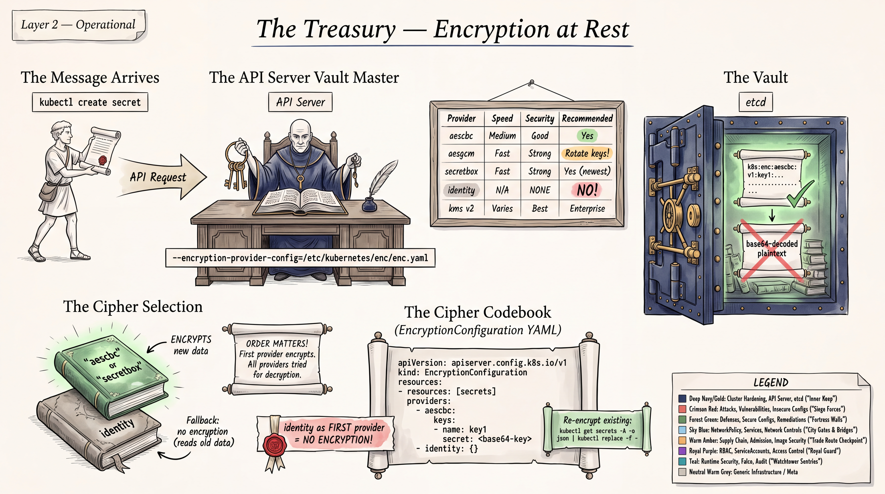
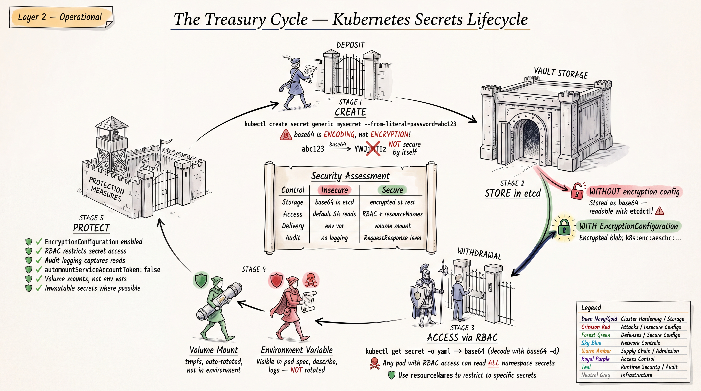
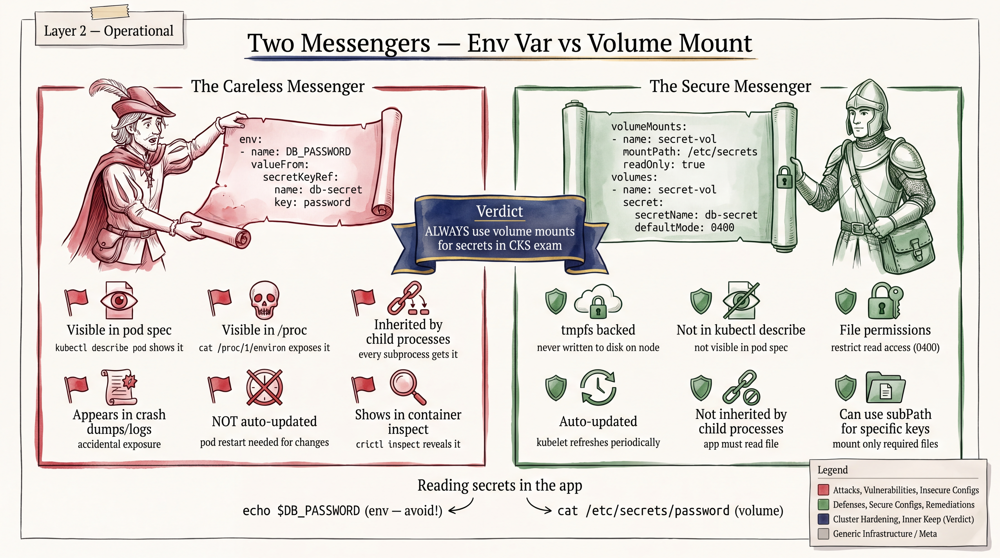

# CKS Study Guide: Secrets, Encryption at Rest, etcd Security & TLS





## CKS Exam Relevance

These topics fall under the CKS domain **"Minimize Microservice Vulnerabilities"** (20%) and **"Cluster Hardening"** (15%). Secrets management, encryption at rest, etcd security, and certificate management are consistently tested on the CKS exam. You will be expected to:
- Configure EncryptionConfiguration for secrets at rest
- Verify secrets are encrypted in etcd using etcdctl
- Understand etcd TLS and access restrictions
- Inspect certificates with openssl
- Apply RBAC restrictions to Secret access

---

## PART 1: SECRETS SECURITY

### 1.1 How Kubernetes Secrets Work

Kubernetes Secrets store sensitive data (passwords, tokens, keys) as base64-encoded values. **Critical point: base64 is encoding, NOT encryption.** Anyone with access to the Secret object can decode it trivially.

```bash
# base64 is trivially reversible
echo "cGFzc3dvcmQxMjM=" | base64 -d
# Output: password123
```

### 1.2 How Secrets Are Stored in etcd

By default, Secrets are stored **unencrypted** in etcd. This means:
- Anyone with direct etcd access can read all Secrets
- etcd database backups contain all Secrets in plaintext
- etcd data files on disk contain Secrets in plaintext

```bash
# Prove Secrets are stored unencrypted in etcd (requires etcd access)
ETCDCTL_API=3 etcdctl get /registry/secrets/default/my-secret \
  --cacert=/etc/kubernetes/pki/etcd/ca.crt \
  --cert=/etc/kubernetes/pki/etcd/server.crt \
  --key=/etc/kubernetes/pki/etcd/server.key \
  | hexdump -C | head -20

# If NOT encrypted, you will see the Secret value in plaintext in the output
# If encrypted, you will see a prefix like "k8s:enc:aescbc:v1:key1" followed by binary data
```

### 1.3 Secret Delivery: Environment Variables vs Volume Mounts



#### Environment Variables (LESS SECURE)

```yaml
apiVersion: v1
kind: Pod
metadata:
  name: env-secret-pod
spec:
  containers:
  - name: app
    image: nginx:1.25
    env:
    - name: DB_PASSWORD
      valueFrom:
        secretKeyRef:
          name: db-credentials
          key: password
```

**Risks of environment variables:**
- Exposed in `kubectl describe pod` output
- Exposed in container crash dumps and core dumps
- Inherited by child processes (any process in the container can read them)
- May appear in application logs if the app prints environment
- Visible via `/proc/<pid>/environ` inside the container
- Not updated when the Secret changes (pod restart required)

#### Volume Mounts (MORE SECURE)

```yaml
apiVersion: v1
kind: Pod
metadata:
  name: volume-secret-pod
spec:
  containers:
  - name: app
    image: nginx:1.25
    volumeMounts:
    - name: secret-volume
      mountPath: /etc/secrets
      readOnly: true
  volumes:
  - name: secret-volume
    secret:
      secretName: db-credentials
      defaultMode: 0400    # Read-only for owner
```

**Advantages of volume mounts:**
- Files have restrictive permissions (configurable via `defaultMode`)
- Mounted as tmpfs (in-memory filesystem, never written to disk on node)
- Automatically updated when the Secret changes (kubelet sync period)
- Not visible in `kubectl describe pod`
- Can mount individual keys as specific files

```yaml
# Mount specific keys only
volumes:
- name: secret-volume
  secret:
    secretName: db-credentials
    items:
    - key: password
      path: db-password        # Mounted as /etc/secrets/db-password
      mode: 0400
    - key: username
      path: db-username
```

### 1.4 RBAC Restrictions on Secrets Access

**Principle of least privilege** -- only grant Secret access where absolutely needed.

#### Restrict Secret Access by Namespace

```yaml
apiVersion: rbac.authorization.k8s.io/v1
kind: Role
metadata:
  namespace: production
  name: secret-reader
rules:
- apiGroups: [""]
  resources: ["secrets"]
  verbs: ["get"]              # Only get, NOT list or watch
  resourceNames: ["app-tls"]  # Only specific secrets, NOT all
```

```yaml
apiVersion: rbac.authorization.k8s.io/v1
kind: RoleBinding
metadata:
  name: read-app-tls
  namespace: production
subjects:
- kind: ServiceAccount
  name: app-sa
  namespace: production
roleRef:
  kind: Role
  name: secret-reader
  apiGroup: rbac.authorization.k8s.io
```

#### Dangerous RBAC Configurations to Audit

```bash
# Find ClusterRoleBindings that grant wildcard access to secrets
kubectl get clusterrolebindings -o json | jq -r '
  .items[] |
  select(.roleRef.name == "cluster-admin" or .roleRef.name == "admin") |
  .metadata.name + " -> " + (.subjects[]? | .kind + "/" + .name)
'

# Check who can access secrets in a namespace
kubectl auth can-i get secrets --as=system:serviceaccount:default:default -n default
kubectl auth can-i list secrets --as=system:serviceaccount:default:default -n default
kubectl auth can-i watch secrets --as=system:serviceaccount:default:default -n default
```

**CKS Key Point:** `list` and `watch` on secrets are even more dangerous than `get` because they can retrieve ALL secrets in a namespace, not just specific ones.

### 1.5 ServiceAccount Access to Secrets

Every pod runs with a ServiceAccount. The default ServiceAccount in each namespace may have more permissions than necessary.

```yaml
# Restrict automounting of ServiceAccount tokens
apiVersion: v1
kind: ServiceAccount
metadata:
  name: restricted-sa
  namespace: default
automountServiceAccountToken: false
```

```yaml
# Pod-level override to prevent token mount
apiVersion: v1
kind: Pod
metadata:
  name: no-token-pod
spec:
  automountServiceAccountToken: false
  containers:
  - name: app
    image: nginx:1.25
```

**CKS Exam Tip:** In Kubernetes 1.24+, the `LegacyServiceAccountTokenNoAutoGeneration` feature is GA. Tokens are no longer auto-created as Secrets. Instead, bound tokens are projected via the TokenRequest API, which are time-limited and audience-bound.

### 1.6 Secret Exposure Vectors

| Exposure Vector | Risk Level | Mitigation |
|---|---|---|
| `kubectl describe pod` | Medium | Use volume mounts, not env vars |
| Application logs | High | Never log environment variables |
| etcd plaintext | Critical | Enable encryption at rest |
| etcd backup files | Critical | Encrypt backups, restrict access |
| Container crash dumps | Medium | Use volume mounts |
| API server audit logs | Medium | Redact Secret data in audit policy |
| Git repository | Critical | Never commit Secrets to Git |
| `/proc/<pid>/environ` | Medium | Use volume mounts |
| Node filesystem (tmpfs) | Low | tmpfs is in-memory only |

#### Audit Policy to Redact Secret Data

```yaml
apiVersion: audit.k8s.io/v1
kind: Policy
rules:
# Do not log Secret data at request/response level
- level: Metadata
  resources:
  - group: ""
    resources: ["secrets"]
# Log everything else at RequestResponse level
- level: RequestResponse
```

### 1.7 Best Practices for Secret Management (CKS Context)

1. **Enable encryption at rest** (EncryptionConfiguration) -- see Part 3
2. **Use volume mounts** over environment variables
3. **Restrict RBAC** -- use `resourceNames` to limit which secrets can be accessed
4. **Disable automountServiceAccountToken** where not needed
5. **Use short-lived tokens** (TokenRequest API) instead of long-lived Secret-based tokens
6. **Encrypt etcd communication** with TLS -- see Part 2
7. **Restrict etcd access** to only the API server
8. **Audit Secret access** via Kubernetes audit logging
9. **Rotate Secrets regularly** and use external secret managers (Vault, AWS Secrets Manager)
10. **Never commit Secrets to version control** -- use SealedSecrets or external-secrets-operator
11. **Set `defaultMode: 0400`** on Secret volume mounts for restrictive permissions
12. **Use `immutable: true`** on Secrets that should never change (prevents tampering, improves performance)

```yaml
apiVersion: v1
kind: Secret
metadata:
  name: immutable-secret
type: Opaque
data:
  api-key: YXBpLWtleS12YWx1ZQ==
immutable: true    # Cannot be modified after creation
```

### 1.8 Secrets Security Exercises

**Exercise S1: Create a Secret and mount it as a volume**
```
Task: Create a Secret named "app-credentials" with keys username=admin and
password=CKS-Pass-2024 in namespace "secure". Create a pod named "secret-pod"
using image nginx:1.25 that mounts this secret at /opt/credentials with
file permissions 0400.

Verify the secret is accessible inside the container.
```

<details>
<summary>Solution S1</summary>

```bash
kubectl create namespace secure
kubectl create secret generic app-credentials \
  --from-literal=username=admin \
  --from-literal=password=CKS-Pass-2024 \
  -n secure
```

```yaml
apiVersion: v1
kind: Pod
metadata:
  name: secret-pod
  namespace: secure
spec:
  containers:
  - name: app
    image: nginx:1.25
    volumeMounts:
    - name: creds
      mountPath: /opt/credentials
      readOnly: true
  volumes:
  - name: creds
    secret:
      secretName: app-credentials
      defaultMode: 0400
```

```bash
kubectl apply -f secret-pod.yaml
kubectl exec -n secure secret-pod -- cat /opt/credentials/username
kubectl exec -n secure secret-pod -- cat /opt/credentials/password
kubectl exec -n secure secret-pod -- ls -la /opt/credentials/
```
</details>

**Exercise S2: RBAC -- restrict Secret access to specific secrets only**
```
Task: Create a ServiceAccount "app-reader" in namespace "production".
Create a Role that allows ONLY reading the secret named "app-config"
(not all secrets). Bind the role to the ServiceAccount.

Verify the ServiceAccount CAN read "app-config" but CANNOT read other secrets.
```

<details>
<summary>Solution S2</summary>

```bash
kubectl create namespace production
kubectl create sa app-reader -n production
kubectl create secret generic app-config --from-literal=key=value -n production
kubectl create secret generic other-secret --from-literal=key=value -n production
```

```yaml
apiVersion: rbac.authorization.k8s.io/v1
kind: Role
metadata:
  namespace: production
  name: app-config-reader
rules:
- apiGroups: [""]
  resources: ["secrets"]
  verbs: ["get"]
  resourceNames: ["app-config"]
---
apiVersion: rbac.authorization.k8s.io/v1
kind: RoleBinding
metadata:
  name: app-config-reader-binding
  namespace: production
subjects:
- kind: ServiceAccount
  name: app-reader
  namespace: production
roleRef:
  kind: Role
  name: app-config-reader
  apiGroup: rbac.authorization.k8s.io
```

```bash
# Verify access
kubectl auth can-i get secrets/app-config \
  --as=system:serviceaccount:production:app-reader -n production
# Output: yes

kubectl auth can-i get secrets/other-secret \
  --as=system:serviceaccount:production:app-reader -n production
# Output: no

kubectl auth can-i list secrets \
  --as=system:serviceaccount:production:app-reader -n production
# Output: no
```
</details>

**Exercise S3: Disable ServiceAccount token auto-mounting**
```
Task: Create a ServiceAccount "no-token-sa" with automountServiceAccountToken
set to false. Create a pod using this ServiceAccount and verify no token is
mounted at /var/run/secrets/kubernetes.io/serviceaccount/.
```

<details>
<summary>Solution S3</summary>

```yaml
apiVersion: v1
kind: ServiceAccount
metadata:
  name: no-token-sa
  namespace: default
automountServiceAccountToken: false
---
apiVersion: v1
kind: Pod
metadata:
  name: no-token-pod
spec:
  serviceAccountName: no-token-sa
  containers:
  - name: app
    image: nginx:1.25
```

```bash
kubectl apply -f no-token.yaml
kubectl exec no-token-pod -- ls /var/run/secrets/kubernetes.io/serviceaccount/ 2>&1
# Should return: No such file or directory
```
</details>

**Exercise S4: Identify Secret exposure through environment variables**
```
Task: A pod named "leaky-pod" exposes secrets via environment variables.
Find the secret values using kubectl commands (without exec into the pod).
Then fix the pod to use volume mounts instead.
```

<details>
<summary>Solution S4</summary>

```bash
# See the secret values exposed in pod description
kubectl describe pod leaky-pod | grep -A5 "Environment"
# Environment variables from secrets are visible here!

# Fix: recreate with volume mount
kubectl get pod leaky-pod -o yaml > leaky-pod.yaml
# Edit to change from env vars to volume mounts
kubectl delete pod leaky-pod
kubectl apply -f leaky-pod-fixed.yaml
```
</details>

**Exercise S5: Create an immutable Secret**
```
Task: Create a Secret named "static-config" with immutable: true.
Verify that attempting to update the secret fails.
```

<details>
<summary>Solution S5</summary>

```yaml
apiVersion: v1
kind: Secret
metadata:
  name: static-config
type: Opaque
data:
  api-key: c3VwZXItc2VjcmV0LWtleQ==
immutable: true
```

```bash
kubectl apply -f static-secret.yaml

# Attempt to modify -- this should fail
kubectl patch secret static-config -p '{"data":{"api-key":"bmV3LXZhbHVl"}}'
# Error: the Secret "static-config" is immutable

# Only deletion works
kubectl delete secret static-config
```
</details>

**Exercise S6: Audit who has access to secrets in a namespace**
```
Task: List all subjects (users, groups, service accounts) that have access
to secrets in the "kube-system" namespace. Identify any overly permissive
bindings.
```

<details>
<summary>Solution S6</summary>

```bash
# Check various access patterns
kubectl auth can-i get secrets -n kube-system --list

# Check specific service accounts
kubectl get rolebindings,clusterrolebindings -A -o json | \
  jq -r '.items[] | select(
    .roleRef.name == "cluster-admin" or
    .roleRef.name == "admin" or
    .roleRef.name == "edit"
  ) | "\(.metadata.name) -> \(.subjects[]? | .kind + "/" + .name)"'

# Check if default SA has secret access
kubectl auth can-i get secrets \
  --as=system:serviceaccount:kube-system:default -n kube-system
```
</details>

**Exercise S7: Create an audit policy that redacts Secret data**
```
Task: Create a Kubernetes audit policy that logs Secret access at Metadata
level only (not RequestResponse, to avoid logging secret values). Log all
other resource access at RequestResponse level.
```

<details>
<summary>Solution S7</summary>

```yaml
# /etc/kubernetes/audit-policy.yaml
apiVersion: audit.k8s.io/v1
kind: Policy
rules:
# Don't log read-only requests to certain non-resource URLs
- level: None
  nonResourceURLs:
  - "/healthz*"
  - "/readyz*"
  - "/livez*"

# Log Secret operations at Metadata level only (no request/response body)
- level: Metadata
  resources:
  - group: ""
    resources: ["secrets"]

# Log configmap access at Metadata level
- level: Metadata
  resources:
  - group: ""
    resources: ["configmaps"]

# Log everything else at RequestResponse
- level: RequestResponse
```

API server flags:
```
--audit-policy-file=/etc/kubernetes/audit-policy.yaml
--audit-log-path=/var/log/kubernetes/audit.log
--audit-log-maxage=30
--audit-log-maxbackup=3
--audit-log-maxsize=100
```
</details>

**Exercise S8: Mount only specific keys from a Secret**
```
Task: A Secret "multi-key-secret" contains keys: db-host, db-port,
db-username, db-password. Create a pod that mounts ONLY db-username and
db-password (not host/port) at /etc/db-creds/ with permissions 0400.
```

<details>
<summary>Solution S8</summary>

```bash
kubectl create secret generic multi-key-secret \
  --from-literal=db-host=db.example.com \
  --from-literal=db-port=5432 \
  --from-literal=db-username=admin \
  --from-literal=db-password=secret123
```

```yaml
apiVersion: v1
kind: Pod
metadata:
  name: selective-mount-pod
spec:
  containers:
  - name: app
    image: nginx:1.25
    volumeMounts:
    - name: db-creds
      mountPath: /etc/db-creds
      readOnly: true
  volumes:
  - name: db-creds
    secret:
      secretName: multi-key-secret
      defaultMode: 0400
      items:
      - key: db-username
        path: username
      - key: db-password
        path: password
```

```bash
kubectl apply -f selective-mount.yaml
kubectl exec selective-mount-pod -- ls /etc/db-creds/
# Output: username  password  (NOT db-host or db-port)
```
</details>

**Exercise S9: Verify Secret type and encoding**
```
Task: Create three different secret types: Opaque, kubernetes.io/tls,
and kubernetes.io/dockerconfigjson. Verify their types and decode the data.
```

<details>
<summary>Solution S9</summary>

```bash
# Opaque secret
kubectl create secret generic opaque-secret \
  --from-literal=key=value

# TLS secret (requires cert and key files)
openssl req -x509 -newkey rsa:2048 -keyout tls.key -out tls.crt \
  -days 365 -nodes -subj "/CN=example.com"
kubectl create secret tls tls-secret --cert=tls.crt --key=tls.key

# Docker registry secret
kubectl create secret docker-registry registry-secret \
  --docker-server=registry.example.com \
  --docker-username=user \
  --docker-password=pass

# Verify types
kubectl get secrets opaque-secret tls-secret registry-secret
# NAME              TYPE                             DATA
# opaque-secret     Opaque                           1
# tls-secret        kubernetes.io/tls                2
# registry-secret   kubernetes.io/dockerconfigjson   1

# Decode
kubectl get secret opaque-secret -o jsonpath='{.data.key}' | base64 -d
kubectl get secret tls-secret -o jsonpath='{.data.tls\.crt}' | base64 -d | openssl x509 -text -noout
```
</details>

**Exercise S10: Find and fix a pod with insecure Secret usage**
```
Task: A pod has the following security issues:
1. Secrets exposed as environment variables
2. ServiceAccount token auto-mounted unnecessarily
3. Secret volume mounted without read-only flag
4. No restrictive file permissions on secret mount

Fix all issues.
```

<details>
<summary>Solution S10</summary>

Before (insecure):
```yaml
apiVersion: v1
kind: Pod
metadata:
  name: insecure-pod
spec:
  serviceAccountName: default
  containers:
  - name: app
    image: nginx:1.25
    env:
    - name: DB_PASS
      valueFrom:
        secretKeyRef:
          name: db-secret
          key: password
    volumeMounts:
    - name: secret-vol
      mountPath: /etc/secrets
  volumes:
  - name: secret-vol
    secret:
      secretName: db-secret
```

After (secure):
```yaml
apiVersion: v1
kind: Pod
metadata:
  name: secure-pod
spec:
  serviceAccountName: default
  automountServiceAccountToken: false     # Fix #2
  containers:
  - name: app
    image: nginx:1.25
    # Fix #1: removed env vars, secret is only via volume
    volumeMounts:
    - name: secret-vol
      mountPath: /etc/secrets
      readOnly: true                      # Fix #3
  volumes:
  - name: secret-vol
    secret:
      secretName: db-secret
      defaultMode: 0400                   # Fix #4
```
</details>

---

## PART 2: ETCD SECURITY

### 2.1 What is etcd in Kubernetes

etcd is the distributed key-value store that serves as Kubernetes' backing store for **all cluster data**. This includes:
- All Secrets, ConfigMaps, and other API objects
- Cluster state, node registrations
- RBAC policies and bindings
- Service accounts and tokens

**If etcd is compromised, the entire cluster is compromised.**

### 2.2 etcd File Locations

```
/etc/kubernetes/pki/etcd/
  ca.crt                  # etcd CA certificate
  ca.key                  # etcd CA private key
  server.crt              # etcd server certificate
  server.key              # etcd server private key
  peer.crt                # etcd peer certificate (for multi-node etcd)
  peer.key                # etcd peer private key
  healthcheck-client.crt  # Health check client certificate
  healthcheck-client.key  # Health check client key

/etc/kubernetes/pki/
  apiserver-etcd-client.crt   # API server's client cert for etcd
  apiserver-etcd-client.key   # API server's client key for etcd

/etc/kubernetes/manifests/
  etcd.yaml               # etcd static pod manifest
```

### 2.3 etcd TLS Configuration

etcd should use TLS for all communication:
- **Client-to-server:** API server communicating with etcd
- **Peer-to-peer:** etcd nodes communicating with each other (HA setup)

#### etcd Static Pod Manifest with TLS

```yaml
# /etc/kubernetes/manifests/etcd.yaml
apiVersion: v1
kind: Pod
metadata:
  name: etcd
  namespace: kube-system
spec:
  containers:
  - name: etcd
    image: registry.k8s.io/etcd:3.5.15-0
    command:
    - etcd
    # Client TLS (API server -> etcd)
    - --cert-file=/etc/kubernetes/pki/etcd/server.crt
    - --key-file=/etc/kubernetes/pki/etcd/server.key
    - --trusted-ca-file=/etc/kubernetes/pki/etcd/ca.crt
    - --client-cert-auth=true                              # REQUIRE client certs

    # Peer TLS (etcd node -> etcd node)
    - --peer-cert-file=/etc/kubernetes/pki/etcd/peer.crt
    - --peer-key-file=/etc/kubernetes/pki/etcd/peer.key
    - --peer-trusted-ca-file=/etc/kubernetes/pki/etcd/ca.crt
    - --peer-client-cert-auth=true                         # REQUIRE peer client certs

    # Listen addresses -- use HTTPS, not HTTP
    - --listen-client-urls=https://127.0.0.1:2379,https://10.0.0.10:2379
    - --advertise-client-urls=https://10.0.0.10:2379
    - --listen-peer-urls=https://10.0.0.10:2380

    # Data directory
    - --data-dir=/var/lib/etcd
    volumeMounts:
    - name: etcd-data
      mountPath: /var/lib/etcd
    - name: etcd-certs
      mountPath: /etc/kubernetes/pki/etcd
      readOnly: true
  hostNetwork: true
  volumes:
  - name: etcd-data
    hostPath:
      path: /var/lib/etcd
      type: DirectoryOrCreate
  - name: etcd-certs
    hostPath:
      path: /etc/kubernetes/pki/etcd
      type: DirectoryOrCreate
```

#### API Server etcd Client Configuration

The kube-apiserver connects to etcd as a TLS client:

```
# In /etc/kubernetes/manifests/kube-apiserver.yaml
- --etcd-servers=https://127.0.0.1:2379
- --etcd-cafile=/etc/kubernetes/pki/etcd/ca.crt
- --etcd-certfile=/etc/kubernetes/pki/apiserver-etcd-client.crt
- --etcd-keyfile=/etc/kubernetes/pki/apiserver-etcd-client.key
```

### 2.4 etcd Access Restrictions

**Only the kube-apiserver should have access to etcd.** No other component should communicate with etcd directly.

#### Security Measures:

1. **Network isolation:** etcd should only listen on localhost or the control plane node's IP
2. **Firewall rules:** Block port 2379 (client) and 2380 (peer) from non-control-plane nodes
3. **Client certificate authentication:** `--client-cert-auth=true` forces all clients to present valid certificates
4. **Separate etcd CA:** Use a dedicated CA for etcd certificates, separate from the Kubernetes CA
5. **File permissions:** Restrict etcd data directory and certificate files

```bash
# Verify etcd is not exposed externally
ss -tlnp | grep 2379
# Should show only 127.0.0.1:2379 or control-plane-IP:2379

# Check certificate permissions
ls -la /etc/kubernetes/pki/etcd/
# Keys should be 0600, certs 0644

# Verify client-cert-auth is enabled
cat /etc/kubernetes/manifests/etcd.yaml | grep client-cert-auth
# Should show: --client-cert-auth=true
```

### 2.5 Verifying etcd Encryption

```bash
# Set up etcdctl with proper credentials
export ETCDCTL_API=3
export ETCDCTL_CACERT=/etc/kubernetes/pki/etcd/ca.crt
export ETCDCTL_CERT=/etc/kubernetes/pki/etcd/server.crt
export ETCDCTL_KEY=/etc/kubernetes/pki/etcd/server.key

# Create a test secret
kubectl create secret generic test-encryption \
  --from-literal=mykey=myvalue -n default

# Read the secret directly from etcd
etcdctl get /registry/secrets/default/test-encryption | hexdump -C

# UNENCRYPTED output: you will see "myvalue" in plaintext
# ENCRYPTED output: you will see "k8s:enc:aescbc:v1:key1" prefix followed by binary
```

### 2.6 etcd Backup Security

```bash
# Create a snapshot
ETCDCTL_API=3 etcdctl snapshot save /tmp/etcd-backup.db \
  --cacert=/etc/kubernetes/pki/etcd/ca.crt \
  --cert=/etc/kubernetes/pki/etcd/server.crt \
  --key=/etc/kubernetes/pki/etcd/server.key

# Verify the snapshot
ETCDCTL_API=3 etcdctl snapshot status /tmp/etcd-backup.db --write-table
```

**Backup security considerations:**
- Backup files contain ALL cluster data including Secrets
- Encrypt backups at the storage level (GPG, encrypted volumes)
- Restrict access to backup files (chmod 0600)
- Store backups in a secure, access-controlled location
- Rotate and delete old backups
- Even with encryption at rest enabled, etcd backups may contain decrypted data depending on the backup method

### 2.7 etcd Security Exercises

**Exercise E1: Verify etcd TLS configuration**
```
Task: Examine the etcd static pod manifest and verify:
1. Client TLS is configured (cert-file, key-file, trusted-ca-file)
2. Peer TLS is configured
3. client-cert-auth is enabled
4. Listen URLs use HTTPS, not HTTP
```

<details>
<summary>Solution E1</summary>

```bash
# Check the etcd manifest
cat /etc/kubernetes/manifests/etcd.yaml

# Verify TLS flags
grep -E "(cert-file|key-file|trusted-ca-file|client-cert-auth|listen-client-urls)" \
  /etc/kubernetes/manifests/etcd.yaml

# Expected output should show:
# --cert-file=/etc/kubernetes/pki/etcd/server.crt
# --key-file=/etc/kubernetes/pki/etcd/server.key
# --trusted-ca-file=/etc/kubernetes/pki/etcd/ca.crt
# --client-cert-auth=true
# --listen-client-urls=https://...

# Verify NO http:// in listen URLs
grep "http://" /etc/kubernetes/manifests/etcd.yaml
# Should return nothing (all should be https://)
```
</details>

**Exercise E2: Read a Secret directly from etcd**
```
Task: Create a secret named "etcd-test" with value "supersecret" in the
default namespace. Read it directly from etcd using etcdctl. Determine if
encryption at rest is configured.
```

<details>
<summary>Solution E2</summary>

```bash
kubectl create secret generic etcd-test --from-literal=data=supersecret

ETCDCTL_API=3 etcdctl get /registry/secrets/default/etcd-test \
  --cacert=/etc/kubernetes/pki/etcd/ca.crt \
  --cert=/etc/kubernetes/pki/etcd/server.crt \
  --key=/etc/kubernetes/pki/etcd/server.key \
  | hexdump -C | head -30

# If you see "supersecret" in the output, encryption is NOT configured
# If you see "k8s:enc:aescbc:v1:" prefix, encryption IS configured
```
</details>

**Exercise E3: Verify etcd is not exposed on external interfaces**
```
Task: Check that etcd is only listening on localhost or the control plane
IP, not on 0.0.0.0.
```

<details>
<summary>Solution E3</summary>

```bash
# Check listening addresses
ss -tlnp | grep 2379
ss -tlnp | grep 2380

# Should NOT show 0.0.0.0:2379
# Should show 127.0.0.1:2379 and/or <control-plane-ip>:2379

# Also verify in the manifest
grep listen-client-urls /etc/kubernetes/manifests/etcd.yaml
grep listen-peer-urls /etc/kubernetes/manifests/etcd.yaml

# If you see 0.0.0.0, this is a security issue -- fix by specifying explicit IPs
```
</details>

**Exercise E4: Verify etcd certificate permissions**
```
Task: Check file permissions on all etcd certificates and keys.
Keys should be 0600 (owner read/write only). Fix any overly permissive files.
```

<details>
<summary>Solution E4</summary>

```bash
# Check permissions
ls -la /etc/kubernetes/pki/etcd/

# Keys should be:
# -rw------- (0600) for .key files
# -rw-r--r-- (0644) for .crt files

# Fix overly permissive keys
chmod 0600 /etc/kubernetes/pki/etcd/server.key
chmod 0600 /etc/kubernetes/pki/etcd/peer.key
chmod 0600 /etc/kubernetes/pki/etcd/ca.key
chmod 0600 /etc/kubernetes/pki/etcd/healthcheck-client.key

# Verify API server etcd client key
chmod 0600 /etc/kubernetes/pki/apiserver-etcd-client.key
```
</details>

**Exercise E5: Create a secure etcd backup**
```
Task: Create an etcd snapshot, verify its integrity, and secure the backup file.
```

<details>
<summary>Solution E5</summary>

```bash
# Create snapshot
ETCDCTL_API=3 etcdctl snapshot save /opt/etcd-backup-$(date +%Y%m%d).db \
  --cacert=/etc/kubernetes/pki/etcd/ca.crt \
  --cert=/etc/kubernetes/pki/etcd/server.crt \
  --key=/etc/kubernetes/pki/etcd/server.key

# Verify snapshot
ETCDCTL_API=3 etcdctl snapshot status /opt/etcd-backup-*.db --write-table

# Secure the backup
chmod 0600 /opt/etcd-backup-*.db
chown root:root /opt/etcd-backup-*.db

# Optional: encrypt the backup
gpg --symmetric --cipher-algo AES256 /opt/etcd-backup-*.db
# This creates a .gpg encrypted file
rm /opt/etcd-backup-*.db   # Remove unencrypted version
```
</details>

---

## PART 3: ENCRYPTION AT REST -- COMPREHENSIVE

### 3.1 Overview

By default, Kubernetes stores all API objects (including Secrets) **unencrypted** in etcd. The **EncryptionConfiguration** resource allows you to configure encryption at rest, ensuring Secrets (and optionally other resources) are encrypted before being written to etcd.

### 3.2 EncryptionConfiguration Resource

```yaml
# /etc/kubernetes/enc/encryption-config.yaml
apiVersion: apiserver.config.k8s.io/v1
kind: EncryptionConfiguration
resources:
  - resources:
      - secrets
    providers:
      - aescbc:
          keys:
            - name: key1
              secret: <base64-encoded-32-byte-key>
      - identity: {}    # Fallback: allows reading unencrypted secrets
```

### 3.3 Encryption Providers

| Provider | Encryption | Strength | Speed | Key Length | CKS Relevance |
|---|---|---|---|---|---|
| `identity` | None | N/A | Fastest | N/A | Default, no encryption |
| `aescbc` | AES-CBC with PKCS#7 padding | Strong | Fast | 32 bytes | **Most commonly tested** |
| `aesgcm` | AES-GCM | Strong | Fastest | 16, 24, or 32 bytes | Must rotate frequently |
| `secretbox` | XSalsa20 + Poly1305 | Strong | Fast | 32 bytes | Modern, recommended |
| `kms` v1 | Envelope encryption via KMS | Strongest | Moderate | Managed by KMS | Enterprise |
| `kms` v2 | Envelope encryption via KMS v2 | Strongest | Fast | Managed by KMS | GA in 1.29+ |

#### Provider Details

**identity** -- No encryption (default)
```yaml
providers:
- identity: {}
```
- Data is stored as-is in etcd
- This is the default behavior when no EncryptionConfiguration is specified
- When listed as the LAST provider, it allows the API server to read unencrypted data (important during migration)

**aescbc** -- AES-CBC (most commonly tested on CKS)
```yaml
providers:
- aescbc:
    keys:
    - name: key1
      secret: <base64-encoded-32-byte-key>
```
- Each Secret is encrypted with a unique random IV
- Padding: PKCS#7
- Not authenticated (vulnerable to padding oracle attacks in theory, but acceptable for at-rest encryption)
- **This is the provider most commonly seen on the CKS exam**

**aesgcm** -- AES-GCM
```yaml
providers:
- aesgcm:
    keys:
    - name: key1
      secret: <base64-encoded-key>     # 16, 24, or 32 bytes
```
- Authenticated encryption (provides integrity checking)
- **MUST rotate keys frequently** -- nonce reuse with the same key is catastrophic
- Recommended only when you have an automated key rotation mechanism

**secretbox** -- XSalsa20-Poly1305
```yaml
providers:
- secretbox:
    keys:
    - name: key1
      secret: <base64-encoded-32-byte-key>
```
- Modern authenticated encryption
- Better performance than aescbc
- Recommended over aescbc for new configurations

**kms v2** -- Envelope Encryption (GA in 1.29+)
```yaml
providers:
- kms:
    apiVersion: v2
    name: my-kms-plugin
    endpoint: unix:///var/run/kms-plugin/socket.sock
```
- Data Encryption Key (DEK) encrypts the data
- Key Encryption Key (KEK) in external KMS encrypts the DEK
- Most secure option: key material never stored in Kubernetes config files
- Integrates with cloud KMS (AWS KMS, GCP KMS, Azure Key Vault, HashiCorp Vault)

### 3.4 Provider Ordering -- CRITICAL CONCEPT

```yaml
resources:
  - resources:
      - secrets
    providers:
      - aescbc:           # FIRST provider = used for ENCRYPTION (writing)
          keys:
            - name: key1
              secret: <key>
      - identity: {}      # SECOND provider = fallback for DECRYPTION (reading)
```

**Rules:**
1. The **first provider** in the list is used to **encrypt** new data written to etcd
2. **All providers** are tried in order when **decrypting** data read from etcd
3. If `identity: {}` is listed last, the API server can still read unencrypted Secrets (critical during migration from unencrypted to encrypted)
4. If `identity: {}` is listed first, data is stored **unencrypted** (effectively disabling encryption)

**Dangerous misconfiguration:**
```yaml
# BAD: identity first means no encryption!
providers:
  - identity: {}      # This is used for writing -- NO encryption!
  - aescbc:
      keys:
        - name: key1
          secret: <key>
```

### 3.5 Generating Encryption Keys

```bash
# Generate a random 32-byte key and base64 encode it
head -c 32 /dev/urandom | base64

# Example output: kY3V4bGluZXNzIG9mIHRoaXMga2V5IGlzIDMyIGJ5dGVz

# Alternative using openssl
openssl rand -base64 32
```

### 3.6 Complete Setup: Enable Encryption at Rest

#### Step 1: Generate the key

```bash
ENCRYPTION_KEY=$(head -c 32 /dev/urandom | base64)
echo $ENCRYPTION_KEY
```

#### Step 2: Create the EncryptionConfiguration file

```bash
mkdir -p /etc/kubernetes/enc
```

```yaml
# /etc/kubernetes/enc/encryption-config.yaml
apiVersion: apiserver.config.k8s.io/v1
kind: EncryptionConfiguration
resources:
  - resources:
      - secrets
    providers:
      - aescbc:
          keys:
            - name: key1
              secret: <paste-your-base64-key-here>
      - identity: {}
```

```bash
# Set restrictive permissions
chmod 0600 /etc/kubernetes/enc/encryption-config.yaml
```

#### Step 3: Configure the API server

Edit `/etc/kubernetes/manifests/kube-apiserver.yaml`:

```yaml
apiVersion: v1
kind: Pod
metadata:
  name: kube-apiserver
  namespace: kube-system
spec:
  containers:
  - name: kube-apiserver
    command:
    - kube-apiserver
    # ... existing flags ...
    - --encryption-provider-config=/etc/kubernetes/enc/encryption-config.yaml   # ADD THIS
    volumeMounts:
    # ... existing volume mounts ...
    - name: enc-config                          # ADD THIS
      mountPath: /etc/kubernetes/enc
      readOnly: true
  volumes:
  # ... existing volumes ...
  - name: enc-config                            # ADD THIS
    hostPath:
      path: /etc/kubernetes/enc
      type: DirectoryOrCreate
```

#### Step 4: Wait for API server to restart

```bash
# The kubelet watches /etc/kubernetes/manifests/ and restarts the static pod
# Wait for the API server to come back
watch crictl ps | grep kube-apiserver

# Or check with kubectl (may take 30-60 seconds)
kubectl get pods -n kube-system
```

#### Step 5: Verify encryption is working

```bash
# Create a new secret (will be encrypted)
kubectl create secret generic encryption-test \
  --from-literal=testkey=testvalue

# Read directly from etcd
ETCDCTL_API=3 etcdctl get /registry/secrets/default/encryption-test \
  --cacert=/etc/kubernetes/pki/etcd/ca.crt \
  --cert=/etc/kubernetes/pki/etcd/server.crt \
  --key=/etc/kubernetes/pki/etcd/server.key \
  | hexdump -C | head -20

# You should see the prefix: k8s:enc:aescbc:v1:key1
# followed by binary (encrypted) data
# You should NOT see "testvalue" in plaintext
```

### 3.7 Re-encrypting Existing Secrets

After enabling encryption, **existing Secrets are still unencrypted.** You must re-encrypt them:

```bash
# Re-encrypt ALL secrets in ALL namespaces
kubectl get secrets --all-namespaces -o json | kubectl replace -f -

# Verify a specific pre-existing secret is now encrypted
ETCDCTL_API=3 etcdctl get /registry/secrets/default/<pre-existing-secret-name> \
  --cacert=/etc/kubernetes/pki/etcd/ca.crt \
  --cert=/etc/kubernetes/pki/etcd/server.crt \
  --key=/etc/kubernetes/pki/etcd/server.key \
  | hexdump -C | head -20
```

### 3.8 Key Rotation

To rotate encryption keys without downtime:

#### Step 1: Add the new key as the FIRST key under the EXISTING provider

```yaml
apiVersion: apiserver.config.k8s.io/v1
kind: EncryptionConfiguration
resources:
  - resources:
      - secrets
    providers:
      - aescbc:
          keys:
            - name: key2              # NEW key (first = used for encryption)
              secret: <new-base64-key>
            - name: key1              # OLD key (kept for decryption)
              secret: <old-base64-key>
      - identity: {}
```

#### Step 2: Restart the API server

```bash
# Touch the manifest to trigger restart, or kill the container
crictl ps | grep kube-apiserver
# Wait for restart
```

#### Step 3: Re-encrypt all Secrets with the new key

```bash
kubectl get secrets --all-namespaces -o json | kubectl replace -f -
```

#### Step 4: Remove the old key (after verifying all Secrets are re-encrypted)

```yaml
apiVersion: apiserver.config.k8s.io/v1
kind: EncryptionConfiguration
resources:
  - resources:
      - secrets
    providers:
      - aescbc:
          keys:
            - name: key2              # Only new key remains
              secret: <new-base64-key>
      - identity: {}
```

#### Step 5: Restart API server again

### 3.9 Encrypting Multiple Resource Types

You can encrypt resources beyond Secrets:

```yaml
apiVersion: apiserver.config.k8s.io/v1
kind: EncryptionConfiguration
resources:
  - resources:
      - secrets
      - configmaps
    providers:
      - aescbc:
          keys:
            - name: key1
              secret: <base64-key>
      - identity: {}
  - resources:
      - persistentvolumeclaims
    providers:
      - secretbox:
          keys:
            - name: key1
              secret: <base64-key>
      - identity: {}
```

### 3.10 Disabling Encryption (Reverting to Identity)

```yaml
# Step 1: Put identity first (new writes will be unencrypted)
apiVersion: apiserver.config.k8s.io/v1
kind: EncryptionConfiguration
resources:
  - resources:
      - secrets
    providers:
      - identity: {}         # First = used for writing (no encryption)
      - aescbc:               # Kept for reading previously encrypted secrets
          keys:
            - name: key1
              secret: <key>
```

```bash
# Step 2: Restart API server
# Step 3: Re-write all secrets (now stored unencrypted)
kubectl get secrets --all-namespaces -o json | kubectl replace -f -

# Step 4: Remove the EncryptionConfiguration entirely
# Step 5: Remove --encryption-provider-config from API server manifest
# Step 6: Restart API server
```

### 3.11 Encryption Configuration Exercises

**Exercise EC1: Configure encryption for Secrets using aescbc**
```
Task: Enable encryption at rest for Secrets using the aescbc provider.
Generate a 32-byte key, create the EncryptionConfiguration file, configure
the API server, and verify it works.
```

<details>
<summary>Solution EC1</summary>

```bash
# Generate key
ENCRYPTION_KEY=$(head -c 32 /dev/urandom | base64)

# Create config directory
mkdir -p /etc/kubernetes/enc

# Create encryption config
cat > /etc/kubernetes/enc/encryption-config.yaml <<EOF
apiVersion: apiserver.config.k8s.io/v1
kind: EncryptionConfiguration
resources:
  - resources:
      - secrets
    providers:
      - aescbc:
          keys:
            - name: key1
              secret: ${ENCRYPTION_KEY}
      - identity: {}
EOF

chmod 0600 /etc/kubernetes/enc/encryption-config.yaml
```

Edit API server manifest:
```bash
vi /etc/kubernetes/manifests/kube-apiserver.yaml
# Add: --encryption-provider-config=/etc/kubernetes/enc/encryption-config.yaml
# Add volume mount for /etc/kubernetes/enc
# Add hostPath volume for /etc/kubernetes/enc
```

Verify:
```bash
# Wait for API server restart
kubectl get pods -n kube-system

# Create test secret
kubectl create secret generic enc-test --from-literal=key=value

# Check etcd
ETCDCTL_API=3 etcdctl get /registry/secrets/default/enc-test \
  --cacert=/etc/kubernetes/pki/etcd/ca.crt \
  --cert=/etc/kubernetes/pki/etcd/server.crt \
  --key=/etc/kubernetes/pki/etcd/server.key \
  | hexdump -C | head -20
# Should see k8s:enc:aescbc:v1:key1 prefix
```
</details>

**Exercise EC2: Verify secrets are encrypted in etcd**
```
Task: Given an existing cluster, determine if encryption at rest is configured.
Check the API server flags, find the encryption config file, and verify
by reading a secret directly from etcd.
```

<details>
<summary>Solution EC2</summary>

```bash
# Check API server flags
cat /etc/kubernetes/manifests/kube-apiserver.yaml | grep encryption-provider-config

# If the flag exists, find the config file path
# Example: --encryption-provider-config=/etc/kubernetes/enc/encryption-config.yaml

# Read the config
cat /etc/kubernetes/enc/encryption-config.yaml

# Check which provider is FIRST (that's what's used for encryption)
# If identity is first, secrets are NOT encrypted

# Verify by reading from etcd
kubectl create secret generic verify-test --from-literal=data=checkme

ETCDCTL_API=3 etcdctl get /registry/secrets/default/verify-test \
  --cacert=/etc/kubernetes/pki/etcd/ca.crt \
  --cert=/etc/kubernetes/pki/etcd/server.crt \
  --key=/etc/kubernetes/pki/etcd/server.key

# Look for the encryption prefix or plaintext "checkme"
```
</details>

**Exercise EC3: Rotate encryption keys**
```
Task: The current encryption uses aescbc with key named "key1".
Generate a new key "key2", add it as the primary encryption key,
re-encrypt all secrets, then remove the old key.
```

<details>
<summary>Solution EC3</summary>

```bash
# Generate new key
NEW_KEY=$(head -c 32 /dev/urandom | base64)

# Read current config to get old key
cat /etc/kubernetes/enc/encryption-config.yaml
```

Update config (add new key FIRST):
```yaml
apiVersion: apiserver.config.k8s.io/v1
kind: EncryptionConfiguration
resources:
  - resources:
      - secrets
    providers:
      - aescbc:
          keys:
            - name: key2
              secret: <NEW_KEY>
            - name: key1
              secret: <OLD_KEY>
      - identity: {}
```

```bash
# Restart API server (it's a static pod, kubelet watches the manifest)
# Wait for restart
crictl ps | grep kube-apiserver

# Re-encrypt all secrets
kubectl get secrets --all-namespaces -o json | kubectl replace -f -

# Now remove old key from config
# Edit to keep only key2

# Restart API server again
```
</details>

**Exercise EC4: Add encryption for ConfigMaps**
```
Task: Encryption is already configured for Secrets. Extend the configuration
to also encrypt ConfigMaps using the same aescbc key.
```

<details>
<summary>Solution EC4</summary>

```bash
cat /etc/kubernetes/enc/encryption-config.yaml
```

Update to include configmaps:
```yaml
apiVersion: apiserver.config.k8s.io/v1
kind: EncryptionConfiguration
resources:
  - resources:
      - secrets
      - configmaps        # Added
    providers:
      - aescbc:
          keys:
            - name: key1
              secret: <existing-key>
      - identity: {}
```

```bash
# Restart API server
# Wait for it to come back

# Re-encrypt existing configmaps
kubectl get configmaps --all-namespaces -o json | kubectl replace -f -

# Verify
kubectl create configmap enc-cm-test --from-literal=data=testvalue
ETCDCTL_API=3 etcdctl get /registry/configmaps/default/enc-cm-test \
  --cacert=/etc/kubernetes/pki/etcd/ca.crt \
  --cert=/etc/kubernetes/pki/etcd/server.crt \
  --key=/etc/kubernetes/pki/etcd/server.key \
  | hexdump -C | head -20
```
</details>

**Exercise EC5: Fix broken encryption configuration**
```
Task: The API server is not starting. The encryption configuration has errors.
Diagnose and fix the following configuration:

apiVersion: apiserver.config.k8s.io/v1
kind: EncryptionConfiguration
resources:
  - resources:
      - secrets
    providers:
      - aescbc:
          keys:
            - name: key1
              secret: short-key      # Problem: not base64, not 32 bytes
      - identity: {}
```

<details>
<summary>Solution EC5</summary>

The problem: The key value must be a base64-encoded 32-byte key.
"short-key" is:
1. Not base64-encoded properly
2. Not 32 bytes when decoded

Fix:
```bash
# Generate a proper key
NEW_KEY=$(head -c 32 /dev/urandom | base64)

# Update the config
cat > /etc/kubernetes/enc/encryption-config.yaml <<EOF
apiVersion: apiserver.config.k8s.io/v1
kind: EncryptionConfiguration
resources:
  - resources:
      - secrets
    providers:
      - aescbc:
          keys:
            - name: key1
              secret: ${NEW_KEY}
      - identity: {}
EOF

# Check API server logs for errors
crictl logs $(crictl ps -a | grep kube-apiserver | awk '{print $1}') 2>&1 | tail -20

# If the API server container won't start, check:
docker logs $(docker ps -a | grep kube-apiserver | awk '{print $1}') 2>&1 | tail -20
# or
journalctl -u kubelet | tail -50
```
</details>

**Exercise EC6: Migrate from identity (unencrypted) to aescbc**
```
Task: The cluster currently has no encryption at rest configured.
Existing secrets are stored unencrypted in etcd. Enable aescbc encryption
and ensure ALL existing secrets are re-encrypted.
```

<details>
<summary>Solution EC6</summary>

```bash
# Step 1: Generate key
ENCRYPTION_KEY=$(head -c 32 /dev/urandom | base64)

# Step 2: Create encryption config
mkdir -p /etc/kubernetes/enc
cat > /etc/kubernetes/enc/encryption-config.yaml <<EOF
apiVersion: apiserver.config.k8s.io/v1
kind: EncryptionConfiguration
resources:
  - resources:
      - secrets
    providers:
      - aescbc:
          keys:
            - name: key1
              secret: ${ENCRYPTION_KEY}
      - identity: {}         # IMPORTANT: keep this to read existing unencrypted secrets
EOF
chmod 0600 /etc/kubernetes/enc/encryption-config.yaml

# Step 3: Edit API server manifest
vi /etc/kubernetes/manifests/kube-apiserver.yaml
# Add --encryption-provider-config=/etc/kubernetes/enc/encryption-config.yaml
# Add volume/volumeMount for /etc/kubernetes/enc

# Step 4: Wait for API server restart
watch crictl ps

# Step 5: Verify API server is healthy
kubectl get nodes

# Step 6: Re-encrypt ALL existing secrets
kubectl get secrets --all-namespaces -o json | kubectl replace -f -

# Step 7: Verify an existing secret is now encrypted
ETCDCTL_API=3 etcdctl get /registry/secrets/kube-system/default-token-xxxxx \
  --cacert=/etc/kubernetes/pki/etcd/ca.crt \
  --cert=/etc/kubernetes/pki/etcd/server.crt \
  --key=/etc/kubernetes/pki/etcd/server.key \
  | hexdump -C | head -20

# Should show k8s:enc:aescbc:v1:key1 prefix
```
</details>

**Exercise EC7: Configure secretbox provider instead of aescbc**
```
Task: Replace the existing aescbc encryption with secretbox (XSalsa20-Poly1305).
Ensure existing secrets remain readable during migration.
```

<details>
<summary>Solution EC7</summary>

```bash
# Generate new key for secretbox (32 bytes)
NEW_KEY=$(head -c 32 /dev/urandom | base64)
```

Step 1: Add secretbox as first provider, keep aescbc for reading:
```yaml
apiVersion: apiserver.config.k8s.io/v1
kind: EncryptionConfiguration
resources:
  - resources:
      - secrets
    providers:
      - secretbox:             # New: used for encryption
          keys:
            - name: sb-key1
              secret: <NEW_KEY>
      - aescbc:                # Old: kept for decryption of existing secrets
          keys:
            - name: key1
              secret: <OLD_KEY>
      - identity: {}
```

```bash
# Restart API server
# Re-encrypt all secrets (now encrypted with secretbox)
kubectl get secrets --all-namespaces -o json | kubectl replace -f -

# Verify
ETCDCTL_API=3 etcdctl get /registry/secrets/default/some-secret \
  --cacert=/etc/kubernetes/pki/etcd/ca.crt \
  --cert=/etc/kubernetes/pki/etcd/server.crt \
  --key=/etc/kubernetes/pki/etcd/server.key \
  | hexdump -C | head -20
# Should show k8s:enc:secretbox:v1:sb-key1 prefix
```

Step 2: After all secrets are re-encrypted, remove aescbc:
```yaml
apiVersion: apiserver.config.k8s.io/v1
kind: EncryptionConfiguration
resources:
  - resources:
      - secrets
    providers:
      - secretbox:
          keys:
            - name: sb-key1
              secret: <NEW_KEY>
      - identity: {}
```
</details>

**Exercise EC8: Troubleshoot API server not starting after encryption config change**
```
Task: After modifying the encryption configuration, the API server won't start.
kubectl commands are failing. Diagnose and fix the issue.
```

<details>
<summary>Solution EC8</summary>

```bash
# Step 1: Check kubelet logs for API server errors
journalctl -u kubelet | tail -50

# Step 2: Check API server container logs
crictl ps -a | grep kube-apiserver
crictl logs <container-id> 2>&1 | tail -30

# Common issues:
# 1. Invalid YAML syntax in encryption config
# 2. Key not properly base64-encoded
# 3. Wrong key length (must be 32 bytes for aescbc/secretbox)
# 4. Volume mount missing in API server manifest
# 5. File path mismatch between --encryption-provider-config and actual file
# 6. File permissions too restrictive (API server can't read)
# 7. Wrong apiVersion in EncryptionConfiguration

# Step 3: Validate the config file
cat /etc/kubernetes/enc/encryption-config.yaml

# Step 4: Check volume mount in API server manifest
cat /etc/kubernetes/manifests/kube-apiserver.yaml | grep -A5 enc

# Step 5: Check file exists and is readable
ls -la /etc/kubernetes/enc/encryption-config.yaml

# Step 6: Validate key length
echo "<key-from-config>" | base64 -d | wc -c
# Must be exactly 32 for aescbc and secretbox

# Step 7: If totally broken, temporarily remove --encryption-provider-config
# from the API server manifest to get the cluster back, then fix the config
```
</details>

**Exercise EC9: Verify encryption provider config is loaded by the API server**
```
Task: Confirm that the API server is actively using the encryption configuration.
Check both the process flags and the actual encryption behavior.
```

<details>
<summary>Solution EC9</summary>

```bash
# Method 1: Check API server process flags
ps aux | grep kube-apiserver | grep encryption-provider-config

# Method 2: Check the static pod manifest
grep encryption-provider-config /etc/kubernetes/manifests/kube-apiserver.yaml

# Method 3: Check API server pod spec
kubectl get pod kube-apiserver-<node> -n kube-system -o yaml | grep encryption

# Method 4: Functional verification
kubectl create secret generic config-verify-test --from-literal=test=verified

ETCDCTL_API=3 etcdctl get /registry/secrets/default/config-verify-test \
  --cacert=/etc/kubernetes/pki/etcd/ca.crt \
  --cert=/etc/kubernetes/pki/etcd/server.crt \
  --key=/etc/kubernetes/pki/etcd/server.key \
  | hexdump -C | head

# If encrypted, you'll see:
# k8s:enc:aescbc:v1:key1 (for aescbc)
# k8s:enc:secretbox:v1:key1 (for secretbox)
# k8s:enc:aesgcm:v1:key1 (for aesgcm)

# Clean up
kubectl delete secret config-verify-test
```
</details>

**Exercise EC10: Multi-provider encryption configuration**
```
Task: Create an EncryptionConfiguration that:
1. Encrypts secrets with aescbc
2. Encrypts configmaps with secretbox
3. Uses different keys for each resource type
Verify both are working correctly.
```

<details>
<summary>Solution EC10</summary>

```bash
# Generate two different keys
SECRET_KEY=$(head -c 32 /dev/urandom | base64)
CM_KEY=$(head -c 32 /dev/urandom | base64)
```

```yaml
# /etc/kubernetes/enc/encryption-config.yaml
apiVersion: apiserver.config.k8s.io/v1
kind: EncryptionConfiguration
resources:
  - resources:
      - secrets
    providers:
      - aescbc:
          keys:
            - name: secret-key1
              secret: <SECRET_KEY>
      - identity: {}
  - resources:
      - configmaps
    providers:
      - secretbox:
          keys:
            - name: cm-key1
              secret: <CM_KEY>
      - identity: {}
```

```bash
# Restart API server
# Verify secrets encryption
kubectl create secret generic multi-enc-test --from-literal=s=secretdata
ETCDCTL_API=3 etcdctl get /registry/secrets/default/multi-enc-test \
  --cacert=/etc/kubernetes/pki/etcd/ca.crt \
  --cert=/etc/kubernetes/pki/etcd/server.crt \
  --key=/etc/kubernetes/pki/etcd/server.key \
  | hexdump -C | head
# Should show: k8s:enc:aescbc:v1:secret-key1

# Verify configmaps encryption
kubectl create configmap multi-enc-cm --from-literal=c=configdata
ETCDCTL_API=3 etcdctl get /registry/configmaps/default/multi-enc-cm \
  --cacert=/etc/kubernetes/pki/etcd/ca.crt \
  --cert=/etc/kubernetes/pki/etcd/server.crt \
  --key=/etc/kubernetes/pki/etcd/server.key \
  | hexdump -C | head
# Should show: k8s:enc:secretbox:v1:cm-key1
```
</details>

---

## PART 4: TLS AND CERTIFICATES

### 4.1 Kubernetes PKI File Locations

```
/etc/kubernetes/pki/
  ca.crt                          # Kubernetes CA certificate
  ca.key                          # Kubernetes CA private key
  apiserver.crt                   # API server serving certificate
  apiserver.key                   # API server serving key
  apiserver-kubelet-client.crt    # API server -> kubelet client cert
  apiserver-kubelet-client.key    # API server -> kubelet client key
  apiserver-etcd-client.crt       # API server -> etcd client cert
  apiserver-etcd-client.key       # API server -> etcd client key
  front-proxy-ca.crt              # Front proxy CA
  front-proxy-ca.key
  front-proxy-client.crt          # Front proxy client cert
  front-proxy-client.key
  sa.key                          # ServiceAccount signing key
  sa.pub                          # ServiceAccount verification key
  etcd/
    ca.crt                        # etcd CA certificate
    ca.key
    server.crt                    # etcd server certificate
    server.key
    peer.crt                      # etcd peer certificate
    peer.key
    healthcheck-client.crt
    healthcheck-client.key
```

### 4.2 OpenSSL Certificate Inspection Commands

These are critical for the CKS exam -- you will need to inspect certificates to troubleshoot issues.

#### View full certificate details

```bash
openssl x509 -in /etc/kubernetes/pki/apiserver.crt -text -noout
```

#### Check expiration dates

```bash
openssl x509 -in /etc/kubernetes/pki/apiserver.crt -noout -dates
# Output:
# notBefore=Jan  1 00:00:00 2024 GMT
# notAfter=Jan  1 00:00:00 2025 GMT
```

#### Check subject and issuer

```bash
openssl x509 -in /etc/kubernetes/pki/apiserver.crt -noout -subject -issuer
# Output:
# subject= /CN=kube-apiserver
# issuer= /O=kubernetes/CN=kubernetes
```

#### Check Subject Alternative Names (SANs)

```bash
openssl x509 -in /etc/kubernetes/pki/apiserver.crt -noout -text | grep -A1 "Subject Alternative Name"
# Output:
# X509v3 Subject Alternative Name:
#     DNS:kubernetes, DNS:kubernetes.default, DNS:kubernetes.default.svc,
#     DNS:kubernetes.default.svc.cluster.local, DNS:controlplane,
#     IP Address:10.96.0.1, IP Address:10.0.0.10
```

#### Check certificate validity (is it currently valid?)

```bash
openssl x509 -in /etc/kubernetes/pki/apiserver.crt -noout -checkend 0
# Certificate will not expire  (if valid)
# Certificate will expire      (if expired)

# Check if it expires within 30 days (2592000 seconds)
openssl x509 -in /etc/kubernetes/pki/apiserver.crt -noout -checkend 2592000
```

#### Verify certificate chain

```bash
# Verify API server cert is signed by the Kubernetes CA
openssl verify -CAfile /etc/kubernetes/pki/ca.crt /etc/kubernetes/pki/apiserver.crt
# Output: /etc/kubernetes/pki/apiserver.crt: OK

# Verify etcd server cert is signed by the etcd CA
openssl verify -CAfile /etc/kubernetes/pki/etcd/ca.crt /etc/kubernetes/pki/etcd/server.crt
```

#### Check certificate key match

```bash
# Verify that a certificate and key pair match
openssl x509 -in /etc/kubernetes/pki/apiserver.crt -noout -modulus | md5sum
openssl rsa -in /etc/kubernetes/pki/apiserver.key -noout -modulus | md5sum
# Both md5sums should be identical
```

### 4.3 API Server Certificate Configuration

```yaml
# In /etc/kubernetes/manifests/kube-apiserver.yaml
spec:
  containers:
  - command:
    - kube-apiserver
    # Serving certificate (for HTTPS)
    - --tls-cert-file=/etc/kubernetes/pki/apiserver.crt
    - --tls-private-key-file=/etc/kubernetes/pki/apiserver.key

    # Client CA (for authenticating clients via certificates)
    - --client-ca-file=/etc/kubernetes/pki/ca.crt

    # Kubelet client certificate (API server authenticates to kubelet)
    - --kubelet-client-certificate=/etc/kubernetes/pki/apiserver-kubelet-client.crt
    - --kubelet-client-key=/etc/kubernetes/pki/apiserver-kubelet-client.key

    # etcd client certificate
    - --etcd-cafile=/etc/kubernetes/pki/etcd/ca.crt
    - --etcd-certfile=/etc/kubernetes/pki/apiserver-etcd-client.crt
    - --etcd-keyfile=/etc/kubernetes/pki/apiserver-etcd-client.key

    # ServiceAccount signing
    - --service-account-key-file=/etc/kubernetes/pki/sa.pub
    - --service-account-signing-key-file=/etc/kubernetes/pki/sa.key

    # Front proxy
    - --requestheader-client-ca-file=/etc/kubernetes/pki/front-proxy-ca.crt
    - --proxy-client-cert-file=/etc/kubernetes/pki/front-proxy-client.crt
    - --proxy-client-key-file=/etc/kubernetes/pki/front-proxy-client.key
```

### 4.4 Kubelet Certificate Configuration

```yaml
# /var/lib/kubelet/config.yaml
apiVersion: kubelet.config.k8s.io/v1beta1
kind: KubeletConfiguration
authentication:
  x509:
    clientCAFile: /etc/kubernetes/pki/ca.crt     # Verify client certs
  webhook:
    enabled: true                                 # Use TokenReview API
  anonymous:
    enabled: false                                # Disable anonymous access
authorization:
  mode: Webhook                                   # Use SubjectAccessReview API
tlsCertFile: /var/lib/kubelet/pki/kubelet.crt     # Kubelet server cert
tlsPrivateKeyFile: /var/lib/kubelet/pki/kubelet.key
rotateCertificates: true                          # Auto-rotate kubelet certs
serverTLSBootstrap: true                          # Request serving cert from API
```

**CKS Key Points:**
- `anonymous.enabled: false` -- critical for security
- `authorization.mode: Webhook` -- use RBAC, not AlwaysAllow
- `rotateCertificates: true` -- kubelet will auto-renew its client certificate

### 4.5 Certificate Renewal with kubeadm

```bash
# Check expiration of all certificates
kubeadm certs check-expiration

# Output shows expiration for:
# admin.conf, apiserver, apiserver-etcd-client, apiserver-kubelet-client,
# controller-manager.conf, etcd-healthcheck-client, etcd-peer, etcd-server,
# front-proxy-client, scheduler.conf

# Renew all certificates
kubeadm certs renew all

# Renew specific certificate
kubeadm certs renew apiserver
```

### 4.6 TLS Troubleshooting Exercises

**Exercise T1: Identify an expired certificate**
```
Task: The API server is not responding. Check all certificates in
/etc/kubernetes/pki/ and identify which one has expired.
```

<details>
<summary>Solution T1</summary>

```bash
# Quick check all certificates
for cert in /etc/kubernetes/pki/*.crt; do
  echo "=== $cert ==="
  openssl x509 -in $cert -noout -dates -subject
  echo
done

# Check etcd certs too
for cert in /etc/kubernetes/pki/etcd/*.crt; do
  echo "=== $cert ==="
  openssl x509 -in $cert -noout -dates -subject
  echo
done

# Or use kubeadm
kubeadm certs check-expiration

# Check if any expire within 0 seconds (already expired)
for cert in /etc/kubernetes/pki/*.crt /etc/kubernetes/pki/etcd/*.crt; do
  if ! openssl x509 -in $cert -noout -checkend 0 2>/dev/null; then
    echo "EXPIRED: $cert"
  fi
done
```
</details>

**Exercise T2: Verify the API server certificate has the correct SANs**
```
Task: A new node can't connect to the API server at IP 10.0.0.20.
Check if the API server certificate includes this IP in its SANs.
```

<details>
<summary>Solution T2</summary>

```bash
# Check SANs
openssl x509 -in /etc/kubernetes/pki/apiserver.crt -noout -text | \
  grep -A1 "Subject Alternative Name"

# If 10.0.0.20 is NOT listed, the certificate needs to be regenerated
# with the additional SAN

# Regenerate with kubeadm (backup first!)
cp /etc/kubernetes/pki/apiserver.{crt,key} /tmp/

# Remove old cert (kubeadm won't overwrite)
rm /etc/kubernetes/pki/apiserver.{crt,key}

# Add the IP to kubeadm config and regenerate
kubeadm init phase certs apiserver --config=/etc/kubernetes/kubeadm-config.yaml

# The kubeadm config should include:
# apiServer:
#   certSANs:
#     - "10.0.0.20"
#     - "kubernetes.custom.dns"

# Restart API server
crictl rm $(crictl ps -q --name kube-apiserver)
```
</details>

**Exercise T3: Verify certificate chain trust**
```
Task: Verify that the API server certificate, etcd server certificate,
and kubelet client certificate are all properly signed by their respective CAs.
```

<details>
<summary>Solution T3</summary>

```bash
# API server cert signed by Kubernetes CA
openssl verify -CAfile /etc/kubernetes/pki/ca.crt \
  /etc/kubernetes/pki/apiserver.crt
# Expected: OK

# API server kubelet client cert signed by Kubernetes CA
openssl verify -CAfile /etc/kubernetes/pki/ca.crt \
  /etc/kubernetes/pki/apiserver-kubelet-client.crt
# Expected: OK

# etcd server cert signed by etcd CA
openssl verify -CAfile /etc/kubernetes/pki/etcd/ca.crt \
  /etc/kubernetes/pki/etcd/server.crt
# Expected: OK

# API server etcd client cert signed by etcd CA
openssl verify -CAfile /etc/kubernetes/pki/etcd/ca.crt \
  /etc/kubernetes/pki/apiserver-etcd-client.crt
# Expected: OK

# etcd peer cert signed by etcd CA
openssl verify -CAfile /etc/kubernetes/pki/etcd/ca.crt \
  /etc/kubernetes/pki/etcd/peer.crt
# Expected: OK

# Front proxy client cert signed by front proxy CA
openssl verify -CAfile /etc/kubernetes/pki/front-proxy-ca.crt \
  /etc/kubernetes/pki/front-proxy-client.crt
# Expected: OK
```
</details>

**Exercise T4: Check certificate-key pair mismatch**
```
Task: After a certificate renewal, the API server won't start with TLS errors.
Verify that the certificate and key files match for all component certificates.
```

<details>
<summary>Solution T4</summary>

```bash
# Check each cert-key pair
check_pair() {
  CERT_MOD=$(openssl x509 -in "$1" -noout -modulus 2>/dev/null | md5sum | awk '{print $1}')
  KEY_MOD=$(openssl rsa -in "$2" -noout -modulus 2>/dev/null | md5sum | awk '{print $1}')
  if [ "$CERT_MOD" == "$KEY_MOD" ]; then
    echo "MATCH: $1"
  else
    echo "MISMATCH: $1 <-> $2"
  fi
}

check_pair /etc/kubernetes/pki/apiserver.crt /etc/kubernetes/pki/apiserver.key
check_pair /etc/kubernetes/pki/apiserver-kubelet-client.crt /etc/kubernetes/pki/apiserver-kubelet-client.key
check_pair /etc/kubernetes/pki/apiserver-etcd-client.crt /etc/kubernetes/pki/apiserver-etcd-client.key
check_pair /etc/kubernetes/pki/front-proxy-client.crt /etc/kubernetes/pki/front-proxy-client.key
check_pair /etc/kubernetes/pki/etcd/server.crt /etc/kubernetes/pki/etcd/server.key
check_pair /etc/kubernetes/pki/etcd/peer.crt /etc/kubernetes/pki/etcd/peer.key
check_pair /etc/kubernetes/pki/etcd/healthcheck-client.crt /etc/kubernetes/pki/etcd/healthcheck-client.key

# Fix any mismatched pair by regenerating
# Example: if apiserver cert/key mismatch:
rm /etc/kubernetes/pki/apiserver.{crt,key}
kubeadm init phase certs apiserver
```
</details>

**Exercise T5: Secure the kubelet**
```
Task: The kubelet on a worker node has anonymous authentication enabled
and authorization mode set to AlwaysAllow. Fix both issues and verify.
```

<details>
<summary>Solution T5</summary>

```bash
# Check current kubelet config
cat /var/lib/kubelet/config.yaml | grep -A3 authentication
cat /var/lib/kubelet/config.yaml | grep -A1 authorization
```

Fix the kubelet configuration:
```yaml
# /var/lib/kubelet/config.yaml
apiVersion: kubelet.config.k8s.io/v1beta1
kind: KubeletConfiguration
authentication:
  anonymous:
    enabled: false           # Was: true -- FIXED
  webhook:
    enabled: true
  x509:
    clientCAFile: /etc/kubernetes/pki/ca.crt
authorization:
  mode: Webhook              # Was: AlwaysAllow -- FIXED
```

```bash
# Restart kubelet
systemctl restart kubelet

# Verify anonymous access is denied
curl -sk https://localhost:10250/pods
# Should return 401 Unauthorized (was returning pod list before)

# Verify authorized access still works (via API server)
kubectl get nodes
```
</details>

---

## PART 5: VERIFICATION COMMANDS -- QUICK REFERENCE

### 5.1 Verify Secrets Are Encrypted at Rest

```bash
# 1. Check if encryption-provider-config is set
ps aux | grep kube-apiserver | grep encryption-provider-config

# 2. Read the encryption config
cat $(ps aux | grep kube-apiserver | grep -oP '(?<=encryption-provider-config=)\S+')

# 3. Check which provider is first (that's what encrypts new data)
# identity first = NOT encrypted
# aescbc/aesgcm/secretbox/kms first = encrypted

# 4. Functional test
kubectl create secret generic verify-enc --from-literal=test=value
ETCDCTL_API=3 etcdctl get /registry/secrets/default/verify-enc \
  --cacert=/etc/kubernetes/pki/etcd/ca.crt \
  --cert=/etc/kubernetes/pki/etcd/server.crt \
  --key=/etc/kubernetes/pki/etcd/server.key \
  | hexdump -C | grep -c "test"    # 0 = encrypted, >0 = NOT encrypted
kubectl delete secret verify-enc
```

### 5.2 Verify etcd TLS

```bash
# 1. Check etcd manifest for TLS flags
grep -E "(cert-file|key-file|trusted-ca-file|client-cert-auth)" \
  /etc/kubernetes/manifests/etcd.yaml

# 2. Verify HTTPS in listen URLs
grep "listen-client-urls" /etc/kubernetes/manifests/etcd.yaml
# Should show https://, NOT http://

# 3. Test TLS connection
openssl s_client -connect 127.0.0.1:2379 \
  -CAfile /etc/kubernetes/pki/etcd/ca.crt \
  -cert /etc/kubernetes/pki/etcd/server.crt \
  -key /etc/kubernetes/pki/etcd/server.key </dev/null 2>/dev/null | \
  grep "Verify return code"
# Expected: Verify return code: 0 (ok)

# 4. Verify client cert is required (try without cert)
ETCDCTL_API=3 etcdctl get / --endpoints=https://127.0.0.1:2379 2>&1
# Should fail with certificate error if client-cert-auth=true
```

### 5.3 Verify Certificate Expiry

```bash
# All Kubernetes certificates at once
kubeadm certs check-expiration

# Specific certificate
openssl x509 -in /etc/kubernetes/pki/apiserver.crt -noout -enddate

# Check all certs, highlight those expiring within 30 days
for cert in /etc/kubernetes/pki/*.crt /etc/kubernetes/pki/etcd/*.crt; do
  EXPIRY=$(openssl x509 -in "$cert" -noout -enddate 2>/dev/null | cut -d= -f2)
  REMAINING=$(openssl x509 -in "$cert" -noout -checkend 2592000 2>/dev/null)
  echo "$cert: expires $EXPIRY ${REMAINING}"
done
```

### 5.4 Verify Encryption Provider Config Is Loaded

```bash
# Method 1: Check process arguments
ps aux | grep kube-apiserver | grep encryption-provider-config
# Should show the flag with a file path

# Method 2: Check the pod spec
kubectl get pod -n kube-system kube-apiserver-$(hostname) \
  -o jsonpath='{.spec.containers[0].command}' | tr ',' '\n' | grep encryption

# Method 3: Check API server logs for encryption-related messages
crictl logs $(crictl ps -q --name kube-apiserver) 2>&1 | grep -i encrypt

# Method 4: Verify volume mount exists
kubectl get pod -n kube-system kube-apiserver-$(hostname) \
  -o jsonpath='{.spec.volumes}' | python3 -m json.tool | grep -A3 enc
```

### 5.5 Combined Security Verification Script

```bash
#!/bin/bash
echo "=== SECRETS ENCRYPTION VERIFICATION ==="

echo -e "\n[1] Encryption Provider Config:"
if ps aux | grep -q "encryption-provider-config" | grep -v grep; then
  echo "  PASS: encryption-provider-config flag is set"
  CONFIG=$(ps aux | grep kube-apiserver | grep -oP '(?<=encryption-provider-config=)\S+')
  echo "  Config file: $CONFIG"
  FIRST_PROVIDER=$(grep -A1 "providers:" "$CONFIG" | tail -1 | awk -F: '{print $1}' | tr -d ' -')
  echo "  First provider: $FIRST_PROVIDER"
  if [ "$FIRST_PROVIDER" == "identity" ]; then
    echo "  WARNING: identity is first provider -- secrets are NOT encrypted!"
  fi
else
  echo "  FAIL: encryption-provider-config not set -- secrets stored in plaintext"
fi

echo -e "\n[2] etcd TLS:"
if grep -q "client-cert-auth=true" /etc/kubernetes/manifests/etcd.yaml 2>/dev/null; then
  echo "  PASS: Client certificate authentication enabled"
else
  echo "  FAIL: Client certificate authentication NOT enabled"
fi

if grep "listen-client-urls" /etc/kubernetes/manifests/etcd.yaml 2>/dev/null | grep -q "http://"; then
  echo "  FAIL: etcd using HTTP (unencrypted)"
else
  echo "  PASS: etcd using HTTPS"
fi

echo -e "\n[3] Certificate Expiry:"
for cert in /etc/kubernetes/pki/apiserver.crt /etc/kubernetes/pki/etcd/server.crt; do
  if [ -f "$cert" ]; then
    EXPIRY=$(openssl x509 -in "$cert" -noout -enddate 2>/dev/null | cut -d= -f2)
    if openssl x509 -in "$cert" -noout -checkend 2592000 2>/dev/null; then
      echo "  OK: $cert expires $EXPIRY"
    else
      echo "  WARNING: $cert expires $EXPIRY (within 30 days!)"
    fi
  fi
done

echo -e "\n[4] Kubelet Security:"
if grep -q "enabled: false" /var/lib/kubelet/config.yaml 2>/dev/null; then
  echo "  PASS: Anonymous authentication likely disabled"
fi
if grep -q "mode: Webhook" /var/lib/kubelet/config.yaml 2>/dev/null; then
  echo "  PASS: Authorization mode is Webhook"
fi
```

---

## QUICK REFERENCE CARD

| What to Check | Command |
|---|---|
| Is encryption at rest configured? | `grep encryption-provider-config /etc/kubernetes/manifests/kube-apiserver.yaml` |
| What provider is used? | `cat /etc/kubernetes/enc/encryption-config.yaml` |
| Is a secret encrypted in etcd? | `ETCDCTL_API=3 etcdctl get /registry/secrets/<ns>/<name> ... \| hexdump -C` |
| Encryption prefix for aescbc | `k8s:enc:aescbc:v1:<key-name>` |
| Encryption prefix for secretbox | `k8s:enc:secretbox:v1:<key-name>` |
| Encryption prefix for aesgcm | `k8s:enc:aesgcm:v1:<key-name>` |
| Re-encrypt all secrets | `kubectl get secrets -A -o json \| kubectl replace -f -` |
| Generate 32-byte key | `head -c 32 /dev/urandom \| base64` |
| Check cert expiry | `openssl x509 -in cert.crt -noout -dates` |
| Check cert SANs | `openssl x509 -in cert.crt -noout -text \| grep -A1 "Subject Alternative"` |
| Verify cert chain | `openssl verify -CAfile ca.crt cert.crt` |
| Check all cert expiry | `kubeadm certs check-expiration` |
| Renew all certs | `kubeadm certs renew all` |
| etcd TLS check | `grep client-cert-auth /etc/kubernetes/manifests/etcd.yaml` |
| etcd listen check | `ss -tlnp \| grep 2379` |
| Kubelet anon check | `grep "anonymous" /var/lib/kubelet/config.yaml` |
| Who can access secrets? | `kubectl auth can-i get secrets --as=<user> -n <ns>` |

---

## CKS EXAM TIPS FOR THIS TOPIC

1. **Time management:** Encryption at rest configuration is multi-step (generate key, create config, edit API server manifest, verify). Practice until you can do it in under 5 minutes.

2. **Know the etcdctl command by heart:**
   ```bash
   ETCDCTL_API=3 etcdctl get /registry/secrets/<namespace>/<name> \
     --cacert=/etc/kubernetes/pki/etcd/ca.crt \
     --cert=/etc/kubernetes/pki/etcd/server.crt \
     --key=/etc/kubernetes/pki/etcd/server.key
   ```

3. **Remember the API server flag:** `--encryption-provider-config=<path>`

4. **Remember to add BOTH the volume AND volumeMount** to the API server static pod manifest.

5. **Provider order matters:** First provider = encryption. All providers = decryption fallback.

6. **After enabling encryption, re-encrypt existing secrets:** `kubectl get secrets -A -o json | kubectl replace -f -`

7. **Common mistake:** Forgetting the `identity: {}` fallback provider when first enabling encryption. Without it, pre-existing unencrypted secrets become unreadable.

8. **The exam environment uses kubeadm clusters.** Know where all files are located.

9. **Use `hexdump -C` after etcdctl get** to visually verify encryption. Look for the `k8s:enc:` prefix.

10. **Certificate inspection:** `openssl x509 -in <file> -text -noout` is your best friend. Know the flags `-dates`, `-subject`, `-issuer`.
