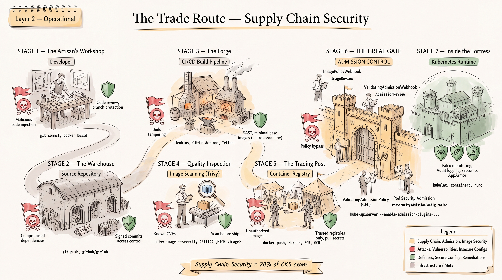
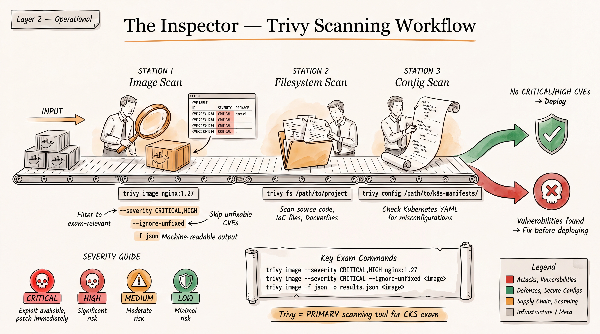
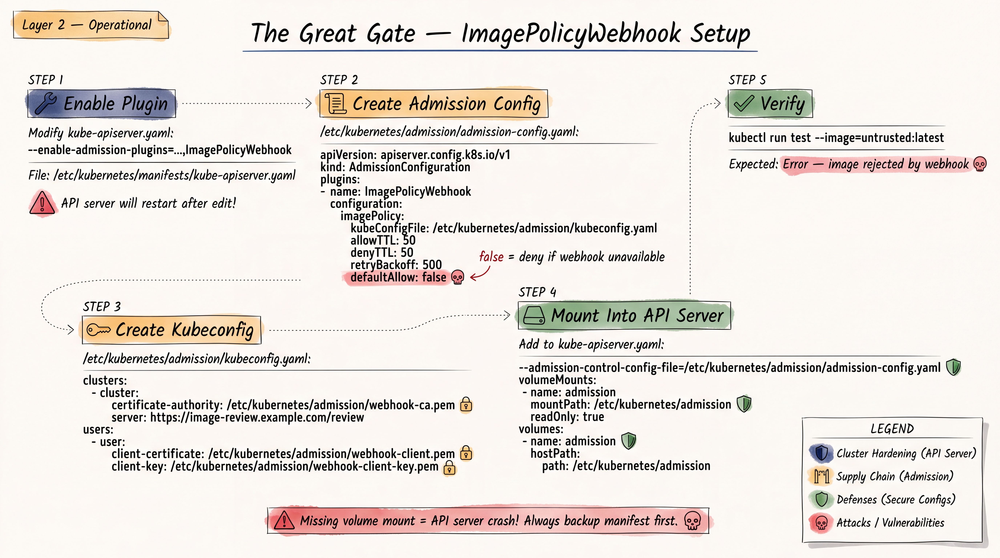
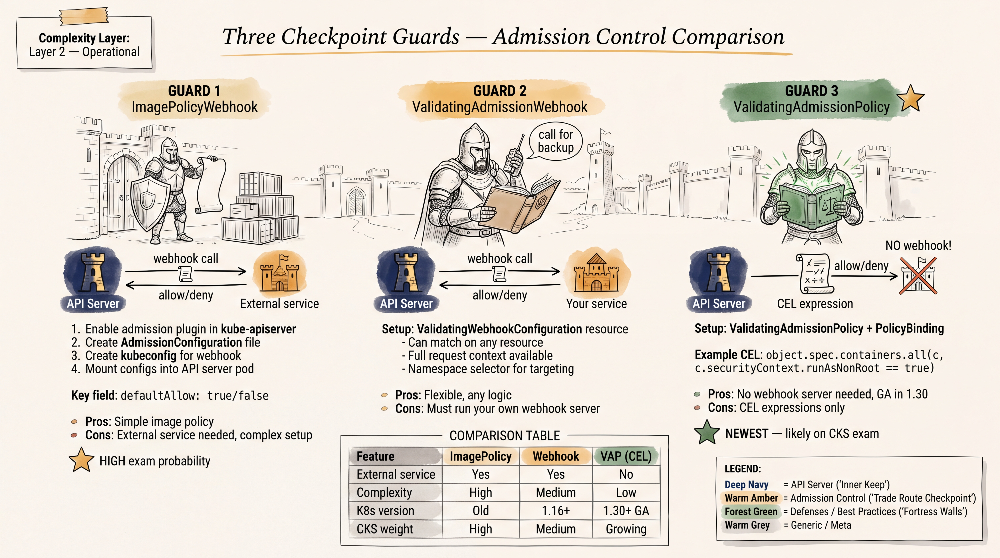

# CKS Study Guide: Supply Chain Security & Admission Control



> **Exam relevance:** Supply Chain Security = **20%** of CKS exam  
> **Kubernetes version:** v1.35 (current CKS exam environment)  
> **Prerequisite:** CKA certification required  
> **Last verified:** August 2026 against CKS Curriculum v1.34

---

## VERIFICATION STATUS

The following CKS exam relevance was verified against the official CNCF CKS curriculum
(v1.34) and the Linux Foundation certification page:

| Topic | CKS Status | Source |
|-------|-----------|--------|
| Base image minimization | **VERIFIED ON EXAM** | Official curriculum: "Minimize base image footprint" |
| Supply chain concepts (SBOM, CI/CD) | **VERIFIED ON EXAM** | Official curriculum: "Understand supply chain (SBOM, CI/CD, artifact repos)" |
| Permitted registries / artifact signing | **VERIFIED ON EXAM** | Official curriculum: "Supply chain security (permitted registries, signing)" |
| Kubesec (static analysis) | **VERIFIED ON EXAM** | Official curriculum explicitly names Kubesec |
| KubeLinter (static analysis) | **VERIFIED ON EXAM** | Official curriculum explicitly names KubeLinter |
| Trivy (image scanning) | **VERIFIED ON EXAM** | Listed in official CKS study resources, widely tested |
| ImagePolicyWebhook | **VERIFIED ON EXAM** | Listed in CKS study resources for image whitelisting |
| Pod Security Admission | **VERIFIED ON EXAM** | Official curriculum: "Pod security standards" |
| ValidatingAdmissionWebhook | **VERIFIED ON EXAM** | Core Kubernetes admission mechanism |
| MutatingAdmissionWebhook | **VERIFIED ON EXAM** | Core Kubernetes admission mechanism |
| ValidatingAdmissionPolicy (CEL) | **LIKELY ON EXAM** | GA since v1.30, enabled by default in v1.35+ |
| OPA Gatekeeper | **SUPPLEMENTARY** | Referenced in study resources but not in official curriculum |
| Cosign/Sigstore | **SUPPLEMENTARY** | Concepts relevant, but tools not explicitly on curriculum |

---

## TABLE OF CONTENTS

1. [Supply Chain Security Map](#1-supply-chain-security-map)
2. [Trivy / Image Scanning](#2-trivy--image-scanning)
3. [Static Analysis](#3-static-analysis)
4. [Image Policy / Trusted Registries](#4-image-policy--trusted-registries)
5. [Admission Control Comprehensive](#5-admission-control-comprehensive)
6. [OPA / Gatekeeper](#6-opa--gatekeeper)
7. [Secure Software Supply Chain](#7-secure-software-supply-chain)

---

## 1. SUPPLY CHAIN SECURITY MAP

**CKS Exam Weight: Part of Supply Chain Security (20%)**

The software supply chain encompasses every stage from code authoring to runtime.
Securing each stage prevents attacks from propagating downstream.

### Full Supply Chain Attack Surface

```
Developer --> Source --> CI --> Build --> Image --> Registry --> Admission --> K8s --> Runtime
    |           |        |       |         |          |            |           |        |
  Laptop     Git repo  Pipeline Compiler Container  Docker Hub  API Server  Cluster  Process
```

### Stage-by-Stage Analysis

| Stage | Attack Risk | Security Control | CKS Relevance |
|-------|------------|------------------|----------------|
| **Developer** | Compromised credentials, malicious code insertion | MFA, signed commits, code review | LOW - not directly tested |
| **Source** | Repo tampering, dependency confusion, malicious dependencies | Branch protection, dependency scanning, lock files | LOW - conceptual only |
| **CI** | Pipeline poisoning, secret exfiltration, compromised build agents | Isolated runners, least-privilege CI service accounts, secret management | LOW - conceptual only |
| **Build** | Compromised build tools, injected malicious layers | Multi-stage builds, minimal base images, reproducible builds | **HIGH** - base image minimization |
| **Image** | Vulnerable packages, embedded secrets, bloated images | Vulnerability scanning (Trivy), minimal images, no secrets in layers | **HIGH** - Trivy scanning, image hardening |
| **Registry** | Unauthorized images, image tampering, registry compromise | Private registries, image signing, permitted registries list | **HIGH** - permitted registries, signing |
| **Admission** | Unapproved images deployed, policy bypass | ImagePolicyWebhook, ValidatingAdmissionWebhook, Pod Security Admission | **HIGH** - admission controllers |
| **K8s** | Overprivileged pods, insecure configurations | Security contexts, RBAC, network policies, static analysis | **HIGH** - Kubesec, KubeLinter |
| **Runtime** | Container escape, malicious process execution, cryptomining | Falco, seccomp, AppArmor, immutable containers | **HIGH** - but separate CKS domain |

### Key Principle: Defense in Depth

No single control secures the entire chain. The CKS exam tests your ability to apply
controls at multiple stages, particularly:
- **Build stage**: Minimize base image footprint
- **Image stage**: Scan with Trivy for vulnerabilities
- **Admission stage**: Enforce image policies and pod security standards
- **Config stage**: Static analysis of manifests before deployment

---

## 2. TRIVY / IMAGE SCANNING



**CKS Status: VERIFIED ON EXAM**

Trivy (by Aqua Security) is the primary image scanning tool tested on the CKS exam.
It scans container images for known vulnerabilities (CVEs) in OS packages and
language-specific dependencies.

### 2.1 Core Trivy Commands

```bash
# Basic image scan (default: table output, all severities)
trivy image nginx:1.25

# Scan with severity filter (CRITICAL exam technique)
trivy image --severity CRITICAL,HIGH nginx:1.25

# Scan and ignore unfixed vulnerabilities
trivy image --ignore-unfixed nginx:1.25

# Scan with both severity filter and ignore unfixed
trivy image --severity CRITICAL,HIGH --ignore-unfixed python:3.11

# Scan a specific image from a private registry
trivy image myregistry.example.com/myapp:v2.1

# JSON output for programmatic analysis
trivy image --format json nginx:1.25

# Scan and output only specific package types
trivy image --pkg-types os nginx:1.25          # Only OS packages
trivy image --pkg-types library node:18         # Only language libraries
```

### 2.2 Understanding Trivy Output

```
nginx:1.25 (debian 12.4)
=========================
Total: 142 (UNKNOWN: 0, LOW: 85, MEDIUM: 41, HIGH: 14, CRITICAL: 2)

+------------------+------------------+----------+-------------------+---------------+
|     LIBRARY      | VULNERABILITY    | SEVERITY | INSTALLED VERSION | FIXED VERSION |
+------------------+------------------+----------+-------------------+---------------+
| libssl3          | CVE-2024-XXXXX   | CRITICAL | 3.0.11-1          | 3.0.13-1      |
| libcurl4         | CVE-2024-YYYYY   | HIGH     | 7.88.1-10         | 7.88.1-11     |
+------------------+------------------+----------+-------------------+---------------+
```

Key columns:
- **LIBRARY**: The vulnerable package
- **VULNERABILITY**: The CVE identifier
- **SEVERITY**: CRITICAL > HIGH > MEDIUM > LOW > UNKNOWN
- **INSTALLED VERSION**: What the image currently has
- **FIXED VERSION**: The version that patches the vulnerability (empty = no fix available)

### 2.3 Image Selection Best Practices

```
LEAST SECURE                                              MOST SECURE
ubuntu:22.04 --> python:3.11 --> python:3.11-slim --> python:3.11-alpine --> distroless
  (large)        (full)          (minimal)             (very small)          (minimal)
  ~200 CVEs      ~150 CVEs       ~50 CVEs              ~10 CVEs              ~2 CVEs
```

**Image selection hierarchy (prefer right side):**
1. **Full OS images** (ubuntu, debian) - largest attack surface, most CVEs
2. **Language runtime images** (python:3.11, node:18) - still large
3. **Slim variants** (python:3.11-slim) - reduced packages
4. **Alpine variants** (python:3.11-alpine) - musl-based, minimal packages
5. **Distroless images** (gcr.io/distroless/static) - no shell, no package manager

**CKS exam tip:** When asked to reduce vulnerabilities, replace full images with
slim/alpine/distroless alternatives.

### 2.4 Trivy Configuration Scanning

```bash
# Scan Kubernetes manifests for misconfigurations
trivy config ./manifests/

# Scan a specific YAML file
trivy config deployment.yaml

# Scan with severity filter
trivy config --severity CRITICAL,HIGH ./manifests/

# Scan a Dockerfile
trivy config Dockerfile
```

### 2.5 Exercises: Trivy / Image Scanning (10 Exercises)

**Exercise 2.1: Basic Image Scan**
```
TASK: Scan the image nginx:1.21 for vulnerabilities and identify the total number
of CRITICAL vulnerabilities.

COMMAND:
  trivy image --severity CRITICAL nginx:1.21

EXPECTED: Review output, count CRITICAL entries in the table.
```

**Exercise 2.2: Severity Filtering**
```
TASK: Scan the image python:3.9 and show only HIGH and CRITICAL vulnerabilities.
Identify the vulnerable package with the most severe CVE.

COMMAND:
  trivy image --severity CRITICAL,HIGH python:3.9

EXPECTED: Look at the top of the output for CRITICAL entries first, then HIGH.
```

**Exercise 2.3: Compare Two Images**
```
TASK: Compare nginx:1.21 and nginx:1.25-alpine for security.
Determine which image has fewer CRITICAL vulnerabilities.

COMMANDS:
  trivy image --severity CRITICAL nginx:1.21
  trivy image --severity CRITICAL nginx:1.25-alpine

EXPECTED: The alpine variant should have significantly fewer vulnerabilities.
The "Total" line at the top shows the count for each severity.
```

**Exercise 2.4: Find the Most Vulnerable Image in a Namespace**
```
TASK: Multiple pods are running in namespace "production" with different images.
Find the pod running the image with the most CRITICAL CVEs.

COMMANDS:
  # Step 1: List all images in the namespace
  kubectl get pods -n production -o jsonpath='{range .items[*]}{.metadata.name}{"\t"}{.spec.containers[*].image}{"\n"}{end}'

  # Step 2: Scan each image
  trivy image --severity CRITICAL <image1>
  trivy image --severity CRITICAL <image2>
  trivy image --severity CRITICAL <image3>

  # Step 3: Compare CRITICAL counts and identify the worst

EXPECTED: The image with the highest "CRITICAL" count in the Total line is the answer.
```

**Exercise 2.5: Replace a Vulnerable Image**
```
TASK: The deployment "webapp" in namespace "default" uses the image python:3.8.
It has 5 CRITICAL vulnerabilities. Replace it with a more secure image variant.

COMMANDS:
  # Verify current vulnerabilities
  trivy image --severity CRITICAL python:3.8

  # Check alternative images
  trivy image --severity CRITICAL python:3.11-slim
  trivy image --severity CRITICAL python:3.11-alpine

  # Update the deployment with the more secure image
  kubectl set image deployment/webapp webapp=python:3.11-alpine -n default

EXPECTED: The new image should have 0 or very few CRITICAL vulnerabilities.
```

**Exercise 2.6: Ignore Unfixed Vulnerabilities**
```
TASK: Scan the image node:18 and identify which CRITICAL vulnerabilities have
available fixes vs. which are unfixed.

COMMANDS:
  # Show all CRITICAL vulnerabilities
  trivy image --severity CRITICAL node:18

  # Show only fixable CRITICAL vulnerabilities
  trivy image --severity CRITICAL --ignore-unfixed node:18

EXPECTED: Compare the two outputs. The difference = unfixed vulnerabilities.
Unfixed vulnerabilities have an empty "FIXED VERSION" column.
```

**Exercise 2.7: JSON Output Analysis**
```
TASK: Generate a JSON vulnerability report for the image redis:7.0 and determine
the total number of HIGH severity vulnerabilities.

COMMAND:
  trivy image --severity HIGH --format json redis:7.0 > redis-report.json

EXPECTED: Parse the JSON output. Vulnerabilities are in
Results[].Vulnerabilities[] with Severity field.
```

**Exercise 2.8: Scan a Private Registry Image**
```
TASK: Scan an image from a private registry at internal.registry.io/app:v1.0.
The registry requires authentication.

COMMANDS:
  # Set registry credentials (if needed)
  export TRIVY_USERNAME=myuser
  export TRIVY_PASSWORD=mypassword

  # Scan the image
  trivy image internal.registry.io/app:v1.0

EXPECTED: Trivy authenticates with the registry and scans the image.
If credentials are already configured in Docker, Trivy uses those automatically.
```

**Exercise 2.9: OS Package vs Library Vulnerabilities**
```
TASK: Scan the image node:18 and identify whether most vulnerabilities come from
OS packages or Node.js library dependencies.

COMMANDS:
  # Scan only OS packages
  trivy image --pkg-types os --severity CRITICAL,HIGH node:18

  # Scan only language libraries
  trivy image --pkg-types library --severity CRITICAL,HIGH node:18

EXPECTED: Compare the counts. OS packages typically have more CVEs in
full images. This demonstrates why slim/distroless images are preferred.
```

**Exercise 2.10: Manifest Config Scanning with Trivy**
```
TASK: Use Trivy to scan the following Kubernetes deployment manifest for
misconfigurations. Identify what security issues it finds.

Given file deployment.yaml:
---
apiVersion: apps/v1
kind: Deployment
metadata:
  name: insecure-app
spec:
  replicas: 1
  selector:
    matchLabels:
      app: insecure
  template:
    metadata:
      labels:
        app: insecure
    spec:
      containers:
      - name: app
        image: nginx
        securityContext:
          privileged: true
          runAsUser: 0

COMMAND:
  trivy config deployment.yaml

EXPECTED: Trivy should flag:
  - privileged: true (container running in privileged mode)
  - runAsUser: 0 (running as root)
  - Missing resource limits
  - Missing readOnlyRootFilesystem
  - Image tag not specified (using latest)
```

---

## 3. STATIC ANALYSIS

**CKS Status: VERIFIED ON EXAM - Kubesec and KubeLinter explicitly named in curriculum**

Static analysis examines Kubernetes manifests BEFORE deployment to find security
misconfigurations. This is a pre-admission control -- catching issues before they
reach the cluster.

### 3.1 What to Look For: Insecure Manifest Patterns

These are the critical security anti-patterns you must identify:

```yaml
# DANGEROUS: Privileged container (full host access)
securityContext:
  privileged: true

# DANGEROUS: Running as root
securityContext:
  runAsUser: 0

# DANGEROUS: Allow privilege escalation (default is true!)
securityContext:
  allowPrivilegeEscalation: true

# DANGEROUS: Host namespace sharing
hostPID: true      # Access to host process IDs
hostNetwork: true  # Access to host network stack
hostIPC: true      # Access to host inter-process communication

# DANGEROUS: Excessive capabilities
securityContext:
  capabilities:
    add: ["SYS_ADMIN"]    # Nearly equivalent to privileged
    add: ["NET_ADMIN"]    # Can modify network settings
    add: ["ALL"]          # All capabilities -- never do this

# DANGEROUS: Writable root filesystem
# (Missing readOnlyRootFilesystem: true)

# DANGEROUS: Sensitive host path mounts
volumes:
- name: host-root
  hostPath:
    path: /           # Mounting entire host filesystem
- name: docker-sock
  hostPath:
    path: /var/run/docker.sock  # Container escape vector
```

### 3.2 kubectl + grep for Finding Insecure Manifests

```bash
# Find pods running as privileged
kubectl get pods -A -o jsonpath='{range .items[*]}{.metadata.namespace}{"/"}{.metadata.name}{": "}{range .spec.containers[*]}{.securityContext.privileged}{" "}{end}{"\n"}{end}' | grep true

# Find pods running as root (UID 0)
kubectl get pods -A -o jsonpath='{range .items[*]}{.metadata.namespace}{"/"}{.metadata.name}{": "}{range .spec.containers[*]}{.securityContext.runAsUser}{" "}{end}{"\n"}{end}' | grep "^.*: 0"

# Find pods with hostPID
kubectl get pods -A -o json | jq -r '.items[] | select(.spec.hostPID==true) | "\(.metadata.namespace)/\(.metadata.name)"'

# Find pods with hostNetwork
kubectl get pods -A -o json | jq -r '.items[] | select(.spec.hostNetwork==true) | "\(.metadata.namespace)/\(.metadata.name)"'

# Quick scan: get all pods with their security-relevant settings
kubectl get pods -A -o json | jq -r '
  .items[] |
  {
    name: "\(.metadata.namespace)/\(.metadata.name)",
    privileged: [.spec.containers[].securityContext.privileged // false] | any,
    hostPID: (.spec.hostPID // false),
    hostNetwork: (.spec.hostNetwork // false),
    hostIPC: (.spec.hostIPC // false)
  } |
  select(.privileged or .hostPID or .hostNetwork or .hostIPC) |
  "\(.name) privileged=\(.privileged) hostPID=\(.hostPID) hostNetwork=\(.hostNetwork) hostIPC=\(.hostIPC)"
'
```

### 3.3 Kubesec

**CKS Status: VERIFIED ON EXAM -- explicitly named in curriculum**

Kubesec performs risk analysis on Kubernetes resource YAML and returns a numerical
score with explanations.

```bash
# Scan a manifest file
kubesec scan pod.yaml

# Scan via stdin
cat pod.yaml | kubesec scan -

# Scan via the hosted API
curl -sSX POST --data-binary @pod.yaml https://v2.kubesec.io/scan

# Example output:
# [
#   {
#     "object": "Pod/insecure-pod.default",
#     "valid": true,
#     "fileName": "pod.yaml",
#     "message": "Failed with a score of -30 points",
#     "score": -30,
#     "scoring": {
#       "critical": [
#         {
#           "id": "Privileged",
#           "selector": "containers[] .securityContext .privileged == true",
#           "reason": "Privileged containers share namespaces with the host",
#           "points": -30
#         }
#       ],
#       "advise": [
#         {
#           "id": "ReadOnlyRootFilesystem",
#           "selector": "containers[] .securityContext .readOnlyRootFilesystem == true",
#           "reason": "An immutable root filesystem prevents ...",
#           "points": 1
#         }
#       ]
#     }
#   }
# ]
```

**Kubesec scoring:**
- **Negative scores** = critical security issues found
- **Positive scores** = security best practices applied
- **Critical findings** = immediate action required
- **Advise findings** = recommended improvements

### 3.4 KubeLinter

**CKS Status: VERIFIED ON EXAM -- explicitly named in curriculum**

KubeLinter (by StackRox/Red Hat) performs static analysis on Kubernetes YAML files
and Helm charts.

```bash
# Scan a single file
kube-linter lint deployment.yaml

# Scan a directory of manifests
kube-linter lint ./manifests/

# Scan Helm charts
kube-linter lint ./my-chart/

# List all available checks
kube-linter checks list

# Example output:
# deployment.yaml: (object: default/insecure-app apps/v1, Kind=Deployment)
# - container "app" does not have a read-only root file system
#   (check: no-read-only-root-fs, remediation: Set readOnlyRootFilesystem to true)
# - container "app" is running as root
#   (check: run-as-non-root, remediation: Set runAsNonRoot to true)
# - container "app" has cpu limit set but memory limit is not set
#   (check: unset-memory-requirements)
```

### 3.5 Exercises: Static Analysis (10 Exercises)

**Exercise 3.1: Manual Manifest Review**
```
TASK: Review the following pod manifest and list ALL security issues.

apiVersion: v1
kind: Pod
metadata:
  name: insecure-pod
spec:
  hostPID: true
  hostNetwork: true
  containers:
  - name: app
    image: nginx
    securityContext:
      privileged: true
      runAsUser: 0
    volumeMounts:
    - name: host-fs
      mountPath: /host
  volumes:
  - name: host-fs
    hostPath:
      path: /

ANSWER:
  1. hostPID: true -- can see all host processes
  2. hostNetwork: true -- shares host network namespace
  3. privileged: true -- full host access
  4. runAsUser: 0 -- running as root
  5. hostPath volume mounting / -- entire host filesystem accessible
  6. No resource limits set
  7. No readOnlyRootFilesystem
  8. allowPrivilegeEscalation not explicitly set to false (defaults to true)
  9. No image tag specified (defaults to :latest)
```

**Exercise 3.2: Kubesec Scan**
```
TASK: Use kubesec to scan the following deployment and fix all critical findings.

apiVersion: apps/v1
kind: Deployment
metadata:
  name: web
spec:
  replicas: 1
  selector:
    matchLabels:
      app: web
  template:
    metadata:
      labels:
        app: web
    spec:
      containers:
      - name: web
        image: nginx:1.25
        securityContext:
          privileged: true

COMMANDS:
  kubesec scan deployment.yaml
  # Fix: Remove privileged: true, add security hardening

FIXED VERSION:
  spec:
    containers:
    - name: web
      image: nginx:1.25
      securityContext:
        privileged: false
        runAsNonRoot: true
        runAsUser: 1000
        readOnlyRootFilesystem: true
        allowPrivilegeEscalation: false
        capabilities:
          drop: ["ALL"]
      resources:
        limits:
          memory: "128Mi"
          cpu: "250m"
        requests:
          memory: "64Mi"
          cpu: "100m"
```

**Exercise 3.3: Find Privileged Pods in a Cluster**
```
TASK: Find all pods running with privileged: true across all namespaces.
Delete the ones NOT in kube-system namespace.

COMMANDS:
  # Find privileged pods
  kubectl get pods -A -o json | jq -r '
    .items[] |
    select(.spec.containers[].securityContext.privileged == true) |
    "\(.metadata.namespace)/\(.metadata.name)"'

  # Delete non-kube-system privileged pods
  kubectl delete pod <pod-name> -n <namespace>
```

**Exercise 3.4: Find Pods with hostPath Volumes**
```
TASK: Identify all pods mounting sensitive host paths
(/var/run/docker.sock, /etc/shadow, /).

COMMANDS:
  kubectl get pods -A -o json | jq -r '
    .items[] |
    select(.spec.volumes[]?.hostPath.path != null) |
    "\(.metadata.namespace)/\(.metadata.name): \([.spec.volumes[].hostPath.path // empty])"'
```

**Exercise 3.5: KubeLinter Scan and Fix**
```
TASK: Run kube-linter on the manifests directory and fix all findings.

COMMANDS:
  kube-linter lint ./manifests/

  # Common fixes:
  # - Add readOnlyRootFilesystem: true
  # - Add runAsNonRoot: true
  # - Set resource limits
  # - Drop all capabilities
  # - Set allowPrivilegeEscalation: false
```

**Exercise 3.6: Find Containers Running as Root**
```
TASK: Find all containers running as root (UID 0) or without runAsNonRoot set.

COMMANDS:
  # Find explicit root
  kubectl get pods -A -o json | jq -r '
    .items[] |
    select(.spec.containers[].securityContext.runAsUser == 0) |
    "\(.metadata.namespace)/\(.metadata.name)"'

  # Find pods without runAsNonRoot
  kubectl get pods -A -o json | jq -r '
    .items[] |
    select(
      (.spec.securityContext.runAsNonRoot != true) and
      (.spec.containers[] | .securityContext.runAsNonRoot != true)
    ) |
    "\(.metadata.namespace)/\(.metadata.name)"'
```

**Exercise 3.7: Identify Excessive Capabilities**
```
TASK: Find all pods with SYS_ADMIN or ALL capabilities added.

COMMANDS:
  kubectl get pods -A -o json | jq -r '
    .items[] |
    select(.spec.containers[].securityContext.capabilities.add // [] |
      any(. == "SYS_ADMIN" or . == "ALL")) |
    "\(.metadata.namespace)/\(.metadata.name)"'
```

**Exercise 3.8: Trivy Config Scan of Manifests Directory**
```
TASK: Use trivy config to scan a directory of manifests and identify the file
with the most CRITICAL misconfigurations.

COMMANDS:
  trivy config --severity CRITICAL ./manifests/

EXPECTED: Output shows each file with its misconfigurations sorted by severity.
```

**Exercise 3.9: Fix allowPrivilegeEscalation**
```
TASK: Find all pods where allowPrivilegeEscalation is not explicitly set to false.
Fix the deployment "backend" to prevent privilege escalation.

COMMANDS:
  # Find pods (note: if not set, it defaults to true)
  kubectl get pods -A -o json | jq -r '
    .items[] |
    select(.spec.containers[] |
      .securityContext.allowPrivilegeEscalation != false) |
    "\(.metadata.namespace)/\(.metadata.name)"'

  # Fix by editing the deployment
  kubectl edit deployment backend
  # Add under container securityContext:
  #   allowPrivilegeEscalation: false
```

**Exercise 3.10: Comprehensive Security Audit**
```
TASK: Perform a full security audit of namespace "production". For each pod,
check: privileged, hostPID, hostNetwork, runAsRoot, capabilities, hostPath volumes.
Report all findings.

COMMANDS:
  kubectl get pods -n production -o json | jq '
    .items[] | {
      pod: .metadata.name,
      privileged: [.spec.containers[].securityContext.privileged // false] | any,
      hostPID: (.spec.hostPID // false),
      hostNetwork: (.spec.hostNetwork // false),
      hostIPC: (.spec.hostIPC // false),
      runAsRoot: [.spec.containers[].securityContext.runAsUser == 0] | any,
      capabilities: [.spec.containers[].securityContext.capabilities.add // []],
      hostPaths: [.spec.volumes[]? | select(.hostPath) | .hostPath.path]
    }'
```

---

## 4. IMAGE POLICY / TRUSTED REGISTRIES



**CKS Status: VERIFIED ON EXAM**

Restricting which container registries pods can pull from is a critical supply chain
security control. The CKS exam tests multiple approaches.

### 4.1 The Problem

Without image policy enforcement, any user with pod creation privileges can deploy
images from ANY public registry, including:
- Malicious images from Docker Hub
- Backdoored images mimicking legitimate ones (typosquatting)
- Images with known critical vulnerabilities
- Images without proper provenance

### 4.2 Approach 1: ImagePolicyWebhook Admission Controller

**CKS Status: VERIFIED ON EXAM**

ImagePolicyWebhook is a built-in admission controller that consults an external
webhook service to approve or deny images.

#### How It Works

```
Pod CREATE request
       |
       v
API Server extracts image names from pod spec
       |
       v
Sends ImageReview to external webhook
       |
       v
Webhook responds: allowed: true/false
       |
       v
Pod admitted or rejected
```

#### Step 1: Enable the Admission Controller

Edit the API server manifest:
```bash
# /etc/kubernetes/manifests/kube-apiserver.yaml
spec:
  containers:
  - command:
    - kube-apiserver
    - --enable-admission-plugins=NodeRestriction,ImagePolicyWebhook
    - --admission-control-config-file=/etc/kubernetes/admission/admission-config.yaml
```

#### Step 2: Create the Admission Configuration

```yaml
# /etc/kubernetes/admission/admission-config.yaml
apiVersion: apiserver.config.k8s.io/v1
kind: AdmissionConfiguration
plugins:
- name: ImagePolicyWebhook
  configuration:
    imagePolicy:
      kubeConfigFile: /etc/kubernetes/admission/imagepolicy-kubeconfig.yaml
      allowTTL: 50
      denyTTL: 50
      retryBackoff: 500
      defaultAllow: false  # CRITICAL: deny if webhook is unreachable
```

**IMPORTANT:** `defaultAllow: false` is the secure option. If the webhook server
is down and `defaultAllow: true`, ALL images would be allowed.

#### Step 3: Create the Kubeconfig for the Webhook

```yaml
# /etc/kubernetes/admission/imagepolicy-kubeconfig.yaml
apiVersion: v1
kind: Config
clusters:
- name: image-policy-webhook
  cluster:
    server: https://image-policy-service.webhook-ns.svc:443/image-policy
    certificate-authority: /etc/kubernetes/admission/webhook-ca.crt
users:
- name: api-server
  user:
    client-certificate: /etc/kubernetes/admission/apiserver-client.crt
    client-key: /etc/kubernetes/admission/apiserver-client.key
current-context: image-policy
contexts:
- context:
    cluster: image-policy-webhook
    user: api-server
  name: image-policy
```

#### Step 4: Mount the Admission Config into API Server

```yaml
# In kube-apiserver.yaml, add volume mounts:
spec:
  containers:
  - name: kube-apiserver
    volumeMounts:
    - name: admission-config
      mountPath: /etc/kubernetes/admission
      readOnly: true
  volumes:
  - name: admission-config
    hostPath:
      path: /etc/kubernetes/admission
      type: DirectoryOrCreate
```

#### ImageReview Request/Response Format

The API server sends to the webhook:
```json
{
  "apiVersion": "imagepolicy.k8s.io/v1alpha1",
  "kind": "ImageReview",
  "spec": {
    "containers": [
      { "image": "nginx:1.25" }
    ],
    "namespace": "default"
  }
}
```

The webhook responds:
```json
{
  "apiVersion": "imagepolicy.k8s.io/v1alpha1",
  "kind": "ImageReview",
  "status": {
    "allowed": false,
    "reason": "Image nginx:1.25 is not from an approved registry"
  }
}
```

### 4.3 Approach 2: ValidatingAdmissionWebhook for Image Restriction

A more flexible alternative using dynamic admission control:

```yaml
apiVersion: admissionregistration.k8s.io/v1
kind: ValidatingWebhookConfiguration
metadata:
  name: image-registry-policy
webhooks:
- name: "image-policy.example.com"
  rules:
  - apiGroups: [""]
    apiVersions: ["v1"]
    operations: ["CREATE", "UPDATE"]
    resources: ["pods"]
    scope: "Namespaced"
  clientConfig:
    service:
      namespace: "policy-system"
      name: "image-policy-webhook"
      path: "/validate"
    caBundle: <BASE64_CA_BUNDLE>
  admissionReviewVersions: ["v1"]
  sideEffects: None
  failurePolicy: Fail
  namespaceSelector:
    matchExpressions:
    - key: kubernetes.io/metadata.name
      operator: NotIn
      values: ["kube-system"]   # Don't block system namespace
```

### 4.4 Approach 3: ValidatingAdmissionPolicy (CEL-Based)

**No external webhook required.** GA since Kubernetes v1.30.

```yaml
# Policy: Only allow images from approved registries
apiVersion: admissionregistration.k8s.io/v1
kind: ValidatingAdmissionPolicy
metadata:
  name: restrict-image-registries
spec:
  failurePolicy: Fail
  matchConstraints:
    resourceRules:
    - apiGroups: [""]
      apiVersions: ["v1"]
      operations: ["CREATE", "UPDATE"]
      resources: ["pods"]
  validations:
  - expression: >
      object.spec.containers.all(c,
        c.image.startsWith('myregistry.example.com/') ||
        c.image.startsWith('gcr.io/my-project/')
      )
    message: "All containers must use images from approved registries (myregistry.example.com or gcr.io/my-project)"
  - expression: >
      !has(object.spec.initContainers) ||
      object.spec.initContainers.all(c,
        c.image.startsWith('myregistry.example.com/') ||
        c.image.startsWith('gcr.io/my-project/')
      )
    message: "All init containers must use images from approved registries"
---
apiVersion: admissionregistration.k8s.io/v1
kind: ValidatingAdmissionPolicyBinding
metadata:
  name: restrict-image-registries-binding
spec:
  policyName: restrict-image-registries
  validationActions: [Deny]
  matchResources:
    namespaceSelector:
      matchExpressions:
      - key: kubernetes.io/metadata.name
        operator: NotIn
        values: ["kube-system", "kube-public"]
```

### 4.5 Approach Comparison

| Feature | ImagePolicyWebhook | ValidatingAdmissionWebhook | ValidatingAdmissionPolicy |
|---------|-------------------|---------------------------|--------------------------|
| External service needed | Yes | Yes | **No** |
| Configuration location | API server config file | Kubernetes API resource | Kubernetes API resource |
| Logic | External webhook code | External webhook code | **Inline CEL expressions** |
| Flexibility | High | Very High | Medium (CEL limitations) |
| Complexity | Medium | High | **Low** |
| CKS relevance | Verified | Verified | Likely (GA, default enabled) |

### 4.6 Exercises: Image Policy / Trusted Registries (5 Exercises)

**Exercise 4.1: Configure ImagePolicyWebhook**
```
TASK: Configure the API server to use ImagePolicyWebhook admission controller.
The webhook service is running at https://image-checker.policy-system.svc:443/check.
Set defaultAllow to false.

STEPS:
  1. Create /etc/kubernetes/admission/admission-config.yaml
  2. Create /etc/kubernetes/admission/imagepolicy-kubeconfig.yaml
  3. Update /etc/kubernetes/manifests/kube-apiserver.yaml:
     --enable-admission-plugins=NodeRestriction,ImagePolicyWebhook
     --admission-control-config-file=/etc/kubernetes/admission/admission-config.yaml
  4. Add volume mounts for admission config directory
  5. Wait for API server to restart
  6. Verify: kubectl run test --image=unauthorized-registry.io/app:v1
     Expected: Pod rejected
```

**Exercise 4.2: ValidatingAdmissionPolicy for Registry Restriction**
```
TASK: Create a ValidatingAdmissionPolicy that only allows images from
docker.io/library/ and gcr.io/google-containers/.
Apply it to namespace "production".

STEPS:
  1. Create the ValidatingAdmissionPolicy with CEL expression
  2. Create the ValidatingAdmissionPolicyBinding targeting namespace "production"
  3. Label the namespace: kubectl label namespace production environment=production
  4. Test: kubectl run test --image=nginx -n production (should succeed - docker.io/library/)
  5. Test: kubectl run test2 --image=malicious-registry.io/backdoor -n production (should fail)
```

**Exercise 4.3: Deny Images Without Tags**
```
TASK: Create a policy that denies pods using images without explicit tags
(i.e., using :latest or no tag at all).

ValidatingAdmissionPolicy:
  validations:
  - expression: >
      object.spec.containers.all(c,
        c.image.contains(':') && !c.image.endsWith(':latest')
      )
    message: "Images must have explicit tags and cannot use :latest"
```

**Exercise 4.4: Fix ImagePolicyWebhook defaultAllow**
```
TASK: The ImagePolicyWebhook admission controller is configured but pods from
unauthorized registries are still being admitted. The webhook service is temporarily
unreachable. Find and fix the misconfiguration.

INVESTIGATION:
  1. Check admission config: cat /etc/kubernetes/admission/admission-config.yaml
  2. Look for: defaultAllow: true
  3. Change to: defaultAllow: false
  4. Restart API server (it auto-restarts as a static pod)

ROOT CAUSE: When defaultAllow is true and webhook is unreachable, all images pass.
```

**Exercise 4.5: Multi-Registry Allow List**
```
TASK: Create a comprehensive image policy that:
  - Allows images from: mycompany.azurecr.io, gcr.io/myproject, docker.io/library
  - Denies all other registries
  - Applies to all namespaces except kube-system
  - Logs violations in audit mode for namespace "staging"
  - Denies violations in enforce mode for namespace "production"

STEPS:
  1. Create the ValidatingAdmissionPolicy
  2. Create two bindings:
     - production-binding with validationActions: [Deny]
     - staging-binding with validationActions: [Audit, Warn]
  3. Test in both namespaces
```

---

## 5. ADMISSION CONTROL COMPREHENSIVE



**CKS Status: VERIFIED ON EXAM -- core exam topic across multiple domains**

### 5.1 The Admission Control Flow

```
Client Request
      |
      v
+------------------+
| AUTHENTICATION   |  Who are you? (certs, tokens, OIDC)
+------------------+
      |
      v
+------------------+
| AUTHORIZATION    |  Are you allowed? (RBAC, ABAC, Node, Webhook)
+------------------+
      |
      v
+------------------+
| MUTATING         |  Modify the request (add defaults, inject sidecars)
| ADMISSION        |  MutatingAdmissionWebhook runs here
+------------------+
      |
      v
+------------------+
| OBJECT SCHEMA    |  Is the modified object valid K8s schema?
| VALIDATION       |
+------------------+
      |
      v
+------------------+
| VALIDATING       |  Accept or reject? (enforce policies)
| ADMISSION        |  ValidatingAdmissionWebhook runs here
|                  |  ValidatingAdmissionPolicy (CEL) runs here
+------------------+
      |
      v
+------------------+
| PERSIST TO ETCD  |  Object stored in etcd
+------------------+
```

**Key points:**
- Mutating admission runs BEFORE validating admission
- A mutating webhook can modify the object, then validating webhooks see the modified version
- If ANY validating admission controller rejects, the entire request is denied
- Read operations (GET, LIST, WATCH) do NOT go through admission control

### 5.2 Built-in Admission Controllers

**Default enabled in Kubernetes v1.35+:**

```
CertificateApproval, CertificateSigning, CertificateSubjectRestriction,
DefaultIngressClass, DefaultStorageClass, DefaultTolerationSeconds, LimitRanger,
MutatingAdmissionWebhook, NamespaceLifecycle, PersistentVolumeClaimResize,
PodSecurity, Priority, ResourceQuota, RuntimeClass, ServiceAccount,
StorageObjectInUseProtection, TaintNodesByCondition, ValidatingAdmissionPolicy,
ValidatingAdmissionWebhook
```

**CKS-relevant admission controllers:**

| Controller | Type | CKS Relevance | Function |
|-----------|------|---------------|----------|
| **PodSecurity** | Validating+Mutating | **HIGH** | Enforces Pod Security Standards |
| **ValidatingAdmissionWebhook** | Validating | **HIGH** | Custom validation via webhooks |
| **MutatingAdmissionWebhook** | Mutating | **HIGH** | Custom mutation via webhooks |
| **ValidatingAdmissionPolicy** | Validating | **HIGH** | CEL-based validation (no webhook) |
| **ImagePolicyWebhook** | Validating | **HIGH** | External image approval webhook |
| **AlwaysPullImages** | Mutating | MEDIUM | Forces imagePullPolicy=Always |
| **LimitRanger** | Mutating+Validating | MEDIUM | Enforces resource limits |
| **ResourceQuota** | Validating | MEDIUM | Enforces namespace quotas |
| **ServiceAccount** | Mutating | MEDIUM | Auto-mounts SA tokens |
| **NodeRestriction** | Validating | MEDIUM | Limits kubelet node/pod modifications |

### 5.3 Enabling/Disabling Admission Plugins

```bash
# In kube-apiserver manifest: /etc/kubernetes/manifests/kube-apiserver.yaml

# Enable specific plugins
--enable-admission-plugins=NodeRestriction,PodSecurity,ImagePolicyWebhook

# Disable specific plugins
--disable-admission-plugins=AlwaysAdmit

# View currently enabled plugins (check API server flags)
cat /etc/kubernetes/manifests/kube-apiserver.yaml | grep enable-admission

# After modifying the static pod manifest, the API server auto-restarts
# Wait and verify:
kubectl get pods -n kube-system | grep kube-apiserver
```

**CRITICAL EXAM TIP:** After modifying `/etc/kubernetes/manifests/kube-apiserver.yaml`,
the kubelet detects the change and restarts the API server. Wait for it to come back.
If it does not restart, check `/var/log/pods/` for error logs.

### 5.4 MutatingAdmissionWebhook

Mutating webhooks modify incoming objects before they are validated and persisted.

**Common use cases:**
- Inject sidecar containers (e.g., Istio sidecar injection)
- Add default labels or annotations
- Set default resource limits
- Add imagePullSecrets

```yaml
apiVersion: admissionregistration.k8s.io/v1
kind: MutatingWebhookConfiguration
metadata:
  name: sidecar-injector
webhooks:
- name: "sidecar.inject.example.com"
  rules:
  - apiGroups: [""]
    apiVersions: ["v1"]
    operations: ["CREATE"]
    resources: ["pods"]
    scope: "Namespaced"
  clientConfig:
    service:
      namespace: "sidecar-system"
      name: "sidecar-injector"
      path: "/inject"
      port: 443
    caBundle: <BASE64_CA_BUNDLE>
  admissionReviewVersions: ["v1"]
  sideEffects: None
  failurePolicy: Fail
  reinvocationPolicy: IfNeeded
  namespaceSelector:
    matchLabels:
      sidecar-injection: enabled
```

**Key fields:**
- `rules`: Which API requests trigger the webhook
- `clientConfig`: How to reach the webhook service (service reference or URL)
- `caBundle`: Base64-encoded CA certificate to verify the webhook's TLS cert
- `failurePolicy`: `Fail` (reject if webhook unreachable) or `Ignore` (allow if unreachable)
- `sideEffects`: `None` means the webhook has no out-of-band effects
- `namespaceSelector`: Label-based namespace filtering
- `reinvocationPolicy`: `IfNeeded` re-runs if other webhooks modified the object

### 5.5 ValidatingAdmissionWebhook

Validating webhooks accept or reject requests but CANNOT modify objects.

```yaml
apiVersion: admissionregistration.k8s.io/v1
kind: ValidatingWebhookConfiguration
metadata:
  name: pod-security-policy
webhooks:
- name: "validate.security.example.com"
  rules:
  - apiGroups: [""]
    apiVersions: ["v1"]
    operations: ["CREATE", "UPDATE"]
    resources: ["pods"]
    scope: "Namespaced"
  clientConfig:
    service:
      namespace: "security-system"
      name: "pod-validator"
      path: "/validate-pods"
      port: 443
    caBundle: <BASE64_CA_BUNDLE>
  admissionReviewVersions: ["v1"]
  sideEffects: None
  failurePolicy: Fail
  timeoutSeconds: 5
  matchPolicy: Equivalent
```

**AdmissionReview flow:**

```
API Server                          Webhook Service
    |                                    |
    |-- POST AdmissionReview ----------->|
    |   {                                |
    |     request: {                     |
    |       uid: "...",                  |
    |       kind: {kind: "Pod"},        |
    |       operation: "CREATE",        |
    |       object: { ... pod spec },   |  Webhook logic:
    |       oldObject: null,            |  - Check security context
    |       userInfo: { ... }           |  - Validate image registry
    |     }                              |  - Check labels
    |   }                                |
    |                                    |
    |<-- 200 OK AdmissionReview ---------|
    |   {                                |
    |     response: {                    |
    |       uid: "...",                  |
    |       allowed: false,             |
    |       status: {                   |
    |         message: "Denied: ..."    |
    |       }                           |
    |     }                              |
    |   }                                |
```

### 5.6 ValidatingAdmissionPolicy (CEL-Based)

**Status: GA since Kubernetes v1.30, enabled by default**

ValidatingAdmissionPolicy provides declarative, in-process validation using
Common Expression Language (CEL) -- NO external webhook service needed.

#### Components

```
ValidatingAdmissionPolicy          ValidatingAdmissionPolicyBinding
+--------------------------+       +--------------------------------+
| - matchConstraints       |       | - policyName                   |
| - validations (CEL)      |<------| - validationActions [Deny/     |
| - failurePolicy          |       |   Warn/Audit]                  |
| - paramKind (optional)   |       | - matchResources               |
+--------------------------+       | - paramRef (optional)           |
                                   +--------------------------------+
```

#### Example: Require Labels on Deployments

```yaml
apiVersion: admissionregistration.k8s.io/v1
kind: ValidatingAdmissionPolicy
metadata:
  name: require-team-label
spec:
  failurePolicy: Fail
  matchConstraints:
    resourceRules:
    - apiGroups: ["apps"]
      apiVersions: ["v1"]
      operations: ["CREATE", "UPDATE"]
      resources: ["deployments"]
  validations:
  - expression: "has(object.metadata.labels) && has(object.metadata.labels.team)"
    message: "All deployments must have a 'team' label"
---
apiVersion: admissionregistration.k8s.io/v1
kind: ValidatingAdmissionPolicyBinding
metadata:
  name: require-team-label-binding
spec:
  policyName: require-team-label
  validationActions: [Deny]
  matchResources: {}
```

#### Example: Enforce Non-Root Containers

```yaml
apiVersion: admissionregistration.k8s.io/v1
kind: ValidatingAdmissionPolicy
metadata:
  name: enforce-nonroot
spec:
  failurePolicy: Fail
  matchConstraints:
    resourceRules:
    - apiGroups: [""]
      apiVersions: ["v1"]
      operations: ["CREATE"]
      resources: ["pods"]
  validations:
  - expression: >
      object.spec.containers.all(c,
        has(c.securityContext) &&
        has(c.securityContext.runAsNonRoot) &&
        c.securityContext.runAsNonRoot == true
      )
    message: "All containers must set runAsNonRoot: true"
  - expression: >
      object.spec.containers.all(c,
        has(c.securityContext) &&
        has(c.securityContext.allowPrivilegeEscalation) &&
        c.securityContext.allowPrivilegeEscalation == false
      )
    message: "All containers must set allowPrivilegeEscalation: false"
---
apiVersion: admissionregistration.k8s.io/v1
kind: ValidatingAdmissionPolicyBinding
metadata:
  name: enforce-nonroot-binding
spec:
  policyName: enforce-nonroot
  validationActions: [Deny]
  matchResources:
    namespaceSelector:
      matchExpressions:
      - key: kubernetes.io/metadata.name
        operator: NotIn
        values: ["kube-system", "kube-public", "kube-node-lease"]
```

#### Example: Parameterized Policy with ConfigMap

```yaml
apiVersion: admissionregistration.k8s.io/v1
kind: ValidatingAdmissionPolicy
metadata:
  name: max-replicas
spec:
  failurePolicy: Fail
  paramKind:
    apiVersion: v1
    kind: ConfigMap
  matchConstraints:
    resourceRules:
    - apiGroups: ["apps"]
      apiVersions: ["v1"]
      operations: ["CREATE", "UPDATE"]
      resources: ["deployments"]
  validations:
  - expression: "object.spec.replicas <= int(params.data.maxReplicas)"
    messageExpression: "'Replicas ' + string(object.spec.replicas) + ' exceeds max ' + params.data.maxReplicas"
---
apiVersion: v1
kind: ConfigMap
metadata:
  name: max-replicas-config
  namespace: default
data:
  maxReplicas: "5"
---
apiVersion: admissionregistration.k8s.io/v1
kind: ValidatingAdmissionPolicyBinding
metadata:
  name: max-replicas-binding
spec:
  policyName: max-replicas
  paramRef:
    name: max-replicas-config
    namespace: default
  validationActions: [Deny]
  matchResources: {}
```

#### Useful CEL Expressions for CKS

```yaml
# Check if a field exists
has(object.metadata.labels)

# String operations
object.spec.containers[0].image.startsWith('myregistry.com/')
object.metadata.name.matches('^[a-z][a-z0-9-]*$')

# Array operations (all/exists)
object.spec.containers.all(c, c.image.contains(':'))
object.spec.containers.exists(c, c.name == 'sidecar')

# Numeric comparisons
object.spec.replicas <= 10

# Null safety
!has(object.spec.hostNetwork) || object.spec.hostNetwork == false

# Checking for privileged containers
object.spec.containers.all(c,
  !has(c.securityContext) ||
  !has(c.securityContext.privileged) ||
  c.securityContext.privileged == false
)
```

### 5.7 Pod Security Admission (PSA)

**CKS Status: VERIFIED ON EXAM**

Pod Security Admission enforces the Pod Security Standards at the namespace level.
It is a built-in admission controller (PodSecurity), enabled by default.

#### Three Security Levels

| Level | Description | What It Blocks |
|-------|------------|---------------|
| **privileged** | Unrestricted (no restrictions) | Nothing |
| **baseline** | Minimally restrictive, prevents known escalations | hostNetwork, hostPID, privileged containers, certain capabilities |
| **restricted** | Heavily restricted, hardening best practices | Running as root, privilege escalation, non-default capabilities, hostPath volumes |

#### Three Enforcement Modes

| Mode | Action on Violation |
|------|-------------------|
| **enforce** | Reject the pod |
| **audit** | Allow the pod, log an audit annotation |
| **warn** | Allow the pod, send a warning to the user |

#### Namespace Configuration

```yaml
apiVersion: v1
kind: Namespace
metadata:
  name: production
  labels:
    # Enforce restricted standard -- reject non-compliant pods
    pod-security.kubernetes.io/enforce: restricted
    pod-security.kubernetes.io/enforce-version: v1.35

    # Also audit and warn on baseline violations (for visibility)
    pod-security.kubernetes.io/audit: restricted
    pod-security.kubernetes.io/audit-version: v1.35
    pod-security.kubernetes.io/warn: restricted
    pod-security.kubernetes.io/warn-version: v1.35
```

```bash
# Apply via kubectl
kubectl label namespace production \
  pod-security.kubernetes.io/enforce=restricted \
  pod-security.kubernetes.io/enforce-version=v1.35 \
  pod-security.kubernetes.io/warn=restricted \
  pod-security.kubernetes.io/warn-version=v1.35

# Test: this pod should be REJECTED in a restricted namespace
kubectl run test --image=nginx -n production
# Warning/Error: would violate PodSecurity "restricted:v1.35"

# This pod should be ALLOWED (compliant with restricted)
kubectl apply -n production -f - <<EOF
apiVersion: v1
kind: Pod
metadata:
  name: secure-pod
spec:
  securityContext:
    runAsNonRoot: true
    runAsUser: 1000
    seccompProfile:
      type: RuntimeDefault
  containers:
  - name: app
    image: nginx:1.25
    securityContext:
      allowPrivilegeEscalation: false
      capabilities:
        drop: ["ALL"]
      readOnlyRootFilesystem: true
    resources:
      limits:
        memory: "128Mi"
        cpu: "250m"
EOF
```

#### What "restricted" Level Requires

| Requirement | Setting |
|------------|---------|
| Must NOT run as privileged | `privileged: false` (or not set) |
| Must NOT allow privilege escalation | `allowPrivilegeEscalation: false` |
| Must NOT run as root | `runAsNonRoot: true` |
| Must drop ALL capabilities | `capabilities: { drop: ["ALL"] }` |
| Must NOT use hostNetwork/hostPID/hostIPC | Not set or false |
| Must NOT use hostPath volumes | No hostPath volumes |
| Must have seccomp profile | `seccompProfile: { type: RuntimeDefault }` |
| Must NOT use certain volume types | Only configMap, emptyDir, projected, secret, etc. |

### 5.8 How to Configure Admission Plugins on the API Server

```bash
# Location of API server manifest (kubeadm-based clusters)
/etc/kubernetes/manifests/kube-apiserver.yaml

# Key flags for admission control:

# 1. Enable/disable admission plugins
--enable-admission-plugins=NodeRestriction,PodSecurity,ImagePolicyWebhook
--disable-admission-plugins=AlwaysAdmit

# 2. Admission control configuration file (for ImagePolicyWebhook, etc.)
--admission-control-config-file=/etc/kubernetes/admission/admission-config.yaml

# 3. After editing, wait for API server restart
watch kubectl get pods -n kube-system

# 4. Debug: check pod logs if API server fails to start
crictl logs <container-id>
# or
cat /var/log/pods/kube-system_kube-apiserver-*/kube-apiserver/*.log
```

**Volume mount pattern for admission config:**
```yaml
# In kube-apiserver.yaml
spec:
  containers:
  - name: kube-apiserver
    command:
    - kube-apiserver
    - --admission-control-config-file=/etc/kubernetes/admission/admission-config.yaml
    - --enable-admission-plugins=NodeRestriction,ImagePolicyWebhook
    volumeMounts:
    - name: admission
      mountPath: /etc/kubernetes/admission
      readOnly: true
  volumes:
  - name: admission
    hostPath:
      path: /etc/kubernetes/admission
      type: DirectoryOrCreate
```

### 5.9 Exercises: Admission Control (10 Exercises)

**Exercise 5.1: Enable an Admission Plugin**
```
TASK: Enable the ImagePolicyWebhook admission plugin on the API server.
The admission configuration is already at /etc/kubernetes/admission/admission-config.yaml.

STEPS:
  1. Edit /etc/kubernetes/manifests/kube-apiserver.yaml
  2. Find --enable-admission-plugins flag
  3. Add ImagePolicyWebhook to the comma-separated list
  4. Add --admission-control-config-file=/etc/kubernetes/admission/admission-config.yaml
  5. Ensure volume mount exists for /etc/kubernetes/admission
  6. Wait for API server to restart: watch crictl ps | grep apiserver
```

**Exercise 5.2: Configure Pod Security Admission**
```
TASK: Configure namespace "secure-ns" to:
  - Enforce the "restricted" Pod Security Standard
  - Warn on "restricted" violations
  - Audit "baseline" violations

COMMANDS:
  kubectl create namespace secure-ns
  kubectl label namespace secure-ns \
    pod-security.kubernetes.io/enforce=restricted \
    pod-security.kubernetes.io/warn=restricted \
    pod-security.kubernetes.io/audit=baseline

  # Verify
  kubectl get namespace secure-ns -o yaml

  # Test with a non-compliant pod
  kubectl run test --image=nginx -n secure-ns
  # Should be rejected with PodSecurity violation
```

**Exercise 5.3: Create a ValidatingAdmissionPolicy**
```
TASK: Create a ValidatingAdmissionPolicy that prevents Deployments with
more than 10 replicas. Apply it cluster-wide.

SOLUTION:
  apiVersion: admissionregistration.k8s.io/v1
  kind: ValidatingAdmissionPolicy
  metadata:
    name: max-replicas
  spec:
    failurePolicy: Fail
    matchConstraints:
      resourceRules:
      - apiGroups: ["apps"]
        apiVersions: ["v1"]
        operations: ["CREATE", "UPDATE"]
        resources: ["deployments"]
    validations:
    - expression: "object.spec.replicas <= 10"
      message: "Deployments cannot have more than 10 replicas"
  ---
  apiVersion: admissionregistration.k8s.io/v1
  kind: ValidatingAdmissionPolicyBinding
  metadata:
    name: max-replicas-binding
  spec:
    policyName: max-replicas
    validationActions: [Deny]
    matchResources: {}
```

**Exercise 5.4: Create a ValidatingWebhookConfiguration**
```
TASK: Create a ValidatingWebhookConfiguration that sends all Pod CREATE
requests in namespace "monitored" to a webhook service at
webhook-svc.webhook-system.svc on port 443, path /validate.

SOLUTION:
  apiVersion: admissionregistration.k8s.io/v1
  kind: ValidatingWebhookConfiguration
  metadata:
    name: pod-validator
  webhooks:
  - name: "validate.pods.example.com"
    rules:
    - apiGroups: [""]
      apiVersions: ["v1"]
      operations: ["CREATE"]
      resources: ["pods"]
    clientConfig:
      service:
        namespace: "webhook-system"
        name: "webhook-svc"
        path: "/validate"
        port: 443
      caBundle: <BASE64_CA_CERT>
    admissionReviewVersions: ["v1"]
    sideEffects: None
    failurePolicy: Fail
    namespaceSelector:
      matchLabels:
        name: monitored
```

**Exercise 5.5: Debug a Failing Admission Webhook**
```
TASK: Pods in namespace "app" are being rejected with "connection refused" from
a validating webhook. The webhook service is temporarily down. Determine how to
allow pods while the webhook is being fixed.

INVESTIGATION:
  # Check webhook configurations
  kubectl get validatingwebhookconfigurations

  # Examine the webhook
  kubectl get validatingwebhookconfiguration <name> -o yaml

  # Options:
  # Option A: Change failurePolicy from Fail to Ignore (temporary)
  kubectl patch validatingwebhookconfiguration <name> \
    --type='json' -p='[{"op":"replace","path":"/webhooks/0/failurePolicy","value":"Ignore"}]'

  # Option B: Delete the webhook configuration (emergency)
  # Option C: Fix the webhook service (proper fix)

  # Check if webhook service is running
  kubectl get pods -n <webhook-namespace>
  kubectl get svc -n <webhook-namespace>
```

**Exercise 5.6: MutatingAdmissionWebhook for Sidecar Injection**
```
TASK: Create a MutatingWebhookConfiguration that injects a sidecar into all pods
created in namespaces labeled with "inject-sidecar=true".

SOLUTION:
  apiVersion: admissionregistration.k8s.io/v1
  kind: MutatingWebhookConfiguration
  metadata:
    name: sidecar-injector
  webhooks:
  - name: "inject.sidecar.example.com"
    rules:
    - apiGroups: [""]
      apiVersions: ["v1"]
      operations: ["CREATE"]
      resources: ["pods"]
    clientConfig:
      service:
        namespace: "sidecar-system"
        name: "sidecar-injector-svc"
        path: "/inject"
        port: 443
      caBundle: <BASE64_CA_CERT>
    admissionReviewVersions: ["v1"]
    sideEffects: None
    failurePolicy: Ignore
    reinvocationPolicy: IfNeeded
    namespaceSelector:
      matchLabels:
        inject-sidecar: "true"
```

**Exercise 5.7: List and Verify Enabled Admission Plugins**
```
TASK: Determine which admission plugins are currently enabled on the API server.
Verify that PodSecurity and NodeRestriction are enabled.

COMMANDS:
  # Check API server flags
  cat /etc/kubernetes/manifests/kube-apiserver.yaml | grep admission

  # Or check the running process
  ps aux | grep kube-apiserver | grep admission

  # Or use kubectl
  kubectl -n kube-system describe pod kube-apiserver-<node> | grep admission
```

**Exercise 5.8: ValidatingAdmissionPolicy -- Block Privileged Containers**
```
TASK: Create a CEL-based ValidatingAdmissionPolicy that blocks any pod with
privileged: true on any container.

SOLUTION:
  apiVersion: admissionregistration.k8s.io/v1
  kind: ValidatingAdmissionPolicy
  metadata:
    name: deny-privileged
  spec:
    failurePolicy: Fail
    matchConstraints:
      resourceRules:
      - apiGroups: [""]
        apiVersions: ["v1"]
        operations: ["CREATE", "UPDATE"]
        resources: ["pods"]
    validations:
    - expression: >
        object.spec.containers.all(c,
          !has(c.securityContext) ||
          !has(c.securityContext.privileged) ||
          c.securityContext.privileged == false
        )
      message: "Privileged containers are not allowed"
  ---
  apiVersion: admissionregistration.k8s.io/v1
  kind: ValidatingAdmissionPolicyBinding
  metadata:
    name: deny-privileged-binding
  spec:
    policyName: deny-privileged
    validationActions: [Deny]
    matchResources:
      namespaceSelector:
        matchExpressions:
        - key: kubernetes.io/metadata.name
          operator: NotIn
          values: ["kube-system"]
```

**Exercise 5.9: Admission Control Order of Operations**
```
TASK: Explain what happens in order when a user runs:
  kubectl create deployment nginx --image=nginx --replicas=3

ANSWER:
  1. AUTHENTICATION: kubectl presents kubeconfig credentials (cert/token)
  2. AUTHORIZATION: RBAC checks if user can create Deployments in default namespace
  3. MUTATING ADMISSION:
     - ServiceAccount: Sets default service account if not specified
     - DefaultTolerationSeconds: Adds default tolerations
     - MutatingAdmissionWebhook: Any custom mutating webhooks run
  4. OBJECT SCHEMA VALIDATION: API server validates the Deployment schema
  5. VALIDATING ADMISSION:
     - ValidatingAdmissionWebhook: Any custom validating webhooks run
     - ValidatingAdmissionPolicy: Any CEL-based policies run
     - PodSecurity: Checks pod template against namespace PSS level
     - ResourceQuota: Checks if deployment would exceed namespace quota
  6. PERSIST: Object written to etcd
  7. CONTROLLER: Deployment controller creates ReplicaSet, which creates Pods
     (each Pod creation goes through the SAME admission flow again)
```

**Exercise 5.10: Secure an API Server's Admission Configuration**
```
TASK: Given an API server with only --enable-admission-plugins=NodeRestriction,
add the following security-critical admission plugins:
  - PodSecurity
  - ValidatingAdmissionWebhook
  - MutatingAdmissionWebhook

Also ensure ImagePolicyWebhook is enabled with the config at
/etc/kubernetes/admission/admission-config.yaml.

STEPS:
  1. Edit /etc/kubernetes/manifests/kube-apiserver.yaml
  2. Update the flag:
     --enable-admission-plugins=NodeRestriction,PodSecurity,MutatingAdmissionWebhook,ValidatingAdmissionWebhook,ImagePolicyWebhook
  3. Add:
     --admission-control-config-file=/etc/kubernetes/admission/admission-config.yaml
  4. Add volume and volumeMount for /etc/kubernetes/admission
  5. Save and wait for API server restart
  6. Verify: kubectl get pods -n kube-system | grep apiserver
```

---

## 6. OPA / GATEKEEPER

### 6.1 Current CKS Status

**Status: SUPPLEMENTARY -- NOT explicitly in the official CKS curriculum**

OPA Gatekeeper is referenced in some CKS study resources but is NOT listed in the
official CNCF CKS curriculum (v1.34). The curriculum instead focuses on:
- Pod Security Standards (built-in)
- Static analysis tools (Kubesec, KubeLinter)
- ValidatingAdmissionPolicy (CEL-based, now GA and default-enabled)

However, understanding Gatekeeper is valuable because:
- It may still appear as context in exam questions
- It remains widely used in production
- The concepts (ConstraintTemplates, Constraints) map to ValidatingAdmissionPolicy concepts
- Some study guides and practice exams still include it

### 6.2 What Is OPA Gatekeeper

OPA (Open Policy Agent) is a CNCF graduated project for general-purpose policy
enforcement. Gatekeeper is the Kubernetes-native integration that runs as a
ValidatingAdmissionWebhook.

```
Pod CREATE request
       |
       v
API Server
       |
       v
Gatekeeper Webhook (ValidatingAdmissionWebhook)
       |
       v
Evaluates Rego policies (ConstraintTemplates)
       |
       v
Returns allowed/denied
```

### 6.3 Key Components

#### ConstraintTemplate (Defines the policy logic in Rego)

```yaml
apiVersion: templates.gatekeeper.sh/v1
kind: ConstraintTemplate
metadata:
  name: k8srequiredlabels
spec:
  crd:
    spec:
      names:
        kind: K8sRequiredLabels
      validation:
        openAPIV3Schema:
          type: object
          properties:
            labels:
              type: array
              items:
                type: string
  targets:
  - target: admission.k8s.gatekeeper.sh
    rego: |
      package k8srequiredlabels

      violation[{"msg": msg}] {
        provided := {label | input.review.object.metadata.labels[label]}
        required := {label | label := input.parameters.labels[_]}
        missing := required - provided
        count(missing) > 0
        msg := sprintf("Missing required labels: %v", [missing])
      }
```

#### Constraint (Instantiates the template with parameters)

```yaml
apiVersion: constraints.gatekeeper.sh/v1beta1
kind: K8sRequiredLabels
metadata:
  name: require-team-label
spec:
  match:
    kinds:
    - apiGroups: [""]
      kinds: ["Namespace"]
  parameters:
    labels: ["team", "environment"]
```

### 6.4 Gatekeeper vs ValidatingAdmissionPolicy

| Feature | OPA Gatekeeper | ValidatingAdmissionPolicy |
|---------|---------------|--------------------------|
| Language | Rego | CEL |
| Deployment | External webhook + CRDs | Built into API server |
| Installation | Helm chart / manifest | Nothing to install (built-in) |
| CRDs required | Yes (ConstraintTemplate, Constraint) | No (native API resources) |
| Audit capability | Yes (scans existing resources) | Yes (Audit validationAction) |
| Mutation support | Yes (v3.10+) | No (validating only) |
| Learning curve | Steep (Rego) | Moderate (CEL) |
| CKS exam | Supplementary | Likely on exam (GA, default-enabled) |

### 6.5 Modern Alternative: Use ValidatingAdmissionPolicy

The Gatekeeper example above (require labels) in CEL/ValidatingAdmissionPolicy:

```yaml
apiVersion: admissionregistration.k8s.io/v1
kind: ValidatingAdmissionPolicy
metadata:
  name: require-team-label
spec:
  failurePolicy: Fail
  matchConstraints:
    resourceRules:
    - apiGroups: [""]
      apiVersions: ["v1"]
      operations: ["CREATE", "UPDATE"]
      resources: ["namespaces"]
  validations:
  - expression: >
      has(object.metadata.labels) &&
      has(object.metadata.labels.team) &&
      has(object.metadata.labels.environment)
    message: "Namespaces must have 'team' and 'environment' labels"
---
apiVersion: admissionregistration.k8s.io/v1
kind: ValidatingAdmissionPolicyBinding
metadata:
  name: require-team-label-binding
spec:
  policyName: require-team-label
  validationActions: [Deny]
  matchResources: {}
```

**Result:** Same policy enforcement, zero external dependencies, simpler to manage.

---

## 7. SECURE SOFTWARE SUPPLY CHAIN

**CKS Status: VERIFIED ON EXAM (20% of exam weight)**

### 7.1 Container Image Best Practices

#### Use Minimal Base Images

```dockerfile
# BAD: Full Ubuntu image (~200 CVEs, ~130MB)
FROM ubuntu:22.04

# BETTER: Slim variant (~50 CVEs, ~80MB)
FROM python:3.11-slim

# BEST: Alpine-based (~10 CVEs, ~5MB)
FROM python:3.11-alpine

# BEST: Distroless (no shell, no package manager, ~2 CVEs)
FROM gcr.io/distroless/static-debian12
```

**CKS exam tip:** You may be asked to modify a Dockerfile or identify which base
image should be used to minimize the attack surface.

#### Multi-Stage Builds

```dockerfile
# Stage 1: Build (full toolchain available)
FROM golang:1.22 AS builder
WORKDIR /app
COPY . .
RUN CGO_ENABLED=0 go build -o /myapp

# Stage 2: Runtime (minimal image, no build tools)
FROM gcr.io/distroless/static-debian12
COPY --from=builder /myapp /myapp
USER 65534:65534
ENTRYPOINT ["/myapp"]
```

**Why multi-stage builds matter:**
- Build tools, compilers, and source code are NOT in the final image
- Dramatically reduces attack surface
- Final image contains only the application binary and minimal runtime

#### Run as Non-Root

```dockerfile
# Create a non-root user
FROM nginx:1.25-alpine
RUN addgroup -S appgroup && adduser -S appuser -G appgroup

# Set ownership and switch to non-root
COPY --chown=appuser:appgroup . /app
USER appuser

# Or use numeric UID (preferred for K8s)
USER 1000:1000
```

**In Kubernetes:**
```yaml
spec:
  securityContext:
    runAsNonRoot: true
    runAsUser: 1000
    runAsGroup: 1000
    fsGroup: 1000
  containers:
  - name: app
    image: myapp:v1
    securityContext:
      allowPrivilegeEscalation: false
      readOnlyRootFilesystem: true
      capabilities:
        drop: ["ALL"]
```

### 7.2 Dockerfile Security Practices

```dockerfile
# 1. Pin exact image versions (never use :latest)
FROM nginx:1.25.3-alpine3.18  # NOT nginx:latest

# 2. Use COPY instead of ADD (ADD can auto-extract tarballs, fetch URLs)
COPY app.py /app/app.py        # NOT ADD app.py /app/app.py

# 3. Don't store secrets in images
# BAD:
ENV API_KEY=supersecretkey123
COPY credentials.json /app/

# GOOD: Use Kubernetes Secrets and mount at runtime

# 4. Minimize layers and clean up
RUN apt-get update && \
    apt-get install -y --no-install-recommends curl && \
    rm -rf /var/lib/apt/lists/*

# 5. Use .dockerignore to exclude unnecessary files
# .dockerignore:
# .git
# .env
# *.md
# Dockerfile
# node_modules

# 6. Set health check
HEALTHCHECK --interval=30s --timeout=3s CMD curl -f http://localhost/ || exit 1

# 7. Use read-only filesystem where possible
# Set in Kubernetes securityContext.readOnlyRootFilesystem: true

# 8. Don't run package manager updates in production images
# Scan with Trivy instead of relying on apt-get upgrade
```

### 7.3 Supply Chain Concepts for CKS

#### SBOM (Software Bill of Materials)

**CKS curriculum:** "Understand supply chain (SBOM, CI/CD, artifact repositories)"

An SBOM is a formal record of all components (packages, libraries, dependencies) in
a software artifact. Think of it as an ingredients list.

```bash
# Generate SBOM with Trivy
trivy image --format spdx-json nginx:1.25 > nginx-sbom.json
trivy image --format cyclonedx nginx:1.25 > nginx-sbom-cdx.json

# SBOM formats:
# - SPDX (Linux Foundation standard)
# - CycloneDX (OWASP standard)
```

**Why SBOMs matter for security:**
- Quickly identify if your images contain a newly discovered vulnerable package
- Compliance and audit requirements
- Software supply chain transparency

#### Artifact Signing and Verification

**CKS curriculum:** "Supply chain security (permitted registries, artifact signing/validation)"

```bash
# Conceptual flow (cosign/sigstore):
# 1. Developer builds image
docker build -t myregistry.com/myapp:v1.0 .

# 2. Sign the image
cosign sign myregistry.com/myapp:v1.0

# 3. Verify the image before deployment
cosign verify myregistry.com/myapp:v1.0

# 4. In Kubernetes: admission controller verifies signatures before admitting pods
```

**Note:** The CKS exam focuses on understanding the CONCEPTS of artifact signing.
You likely will not need to use cosign/sigstore tools directly, but you should
understand the workflow and why it matters.

#### Permitted Registries

```
Untrusted                                    Trusted
+------------------+                         +------------------+
| docker.io        |  -- BLOCK -->           | mycompany.acr.io |
| quay.io          |                         | gcr.io/myproject |
| ghcr.io          |                         | approved-reg.io  |
| random.registry  |                         |                  |
+------------------+                         +------------------+

Enforcement methods:
1. ImagePolicyWebhook (external webhook)
2. ValidatingAdmissionPolicy (CEL-based, built-in)
3. ValidatingAdmissionWebhook (custom webhook)
4. OPA Gatekeeper (external, supplementary)
```

### 7.4 Supply Chain Security Checklist for CKS

```
PRE-BUILD:
  [ ] Use minimal base images (alpine, distroless, slim)
  [ ] Pin image versions to specific digests or tags
  [ ] Use multi-stage builds to exclude build tools
  [ ] Don't embed secrets in images
  [ ] Use .dockerignore

IMAGE SCANNING:
  [ ] Scan images with Trivy for vulnerabilities
  [ ] Filter for CRITICAL and HIGH severity
  [ ] Replace images with many CVEs with secure alternatives
  [ ] Scan regularly (not just at build time)

MANIFEST ANALYSIS:
  [ ] Run kubesec scan on all manifests
  [ ] Run kube-linter lint on manifests directory
  [ ] Check for privileged, hostPID, hostNetwork, runAsRoot
  [ ] Ensure readOnlyRootFilesystem, runAsNonRoot, drop ALL capabilities

ADMISSION CONTROL:
  [ ] Enforce permitted registries (ImagePolicyWebhook or ValidatingAdmissionPolicy)
  [ ] Enable Pod Security Admission with "restricted" level
  [ ] Block privileged containers via admission policy
  [ ] Set failurePolicy: Fail on security-critical webhooks

RUNTIME:
  [ ] Use imagePullPolicy: Always in multi-tenant clusters
  [ ] Verify image signatures (if implemented)
  [ ] Monitor for unexpected image pulls (audit logging)
```

---

## QUICK REFERENCE: CKS EXAM COMMANDS

```bash
# --- IMAGE SCANNING ---
trivy image <image>                                     # Scan image
trivy image --severity CRITICAL,HIGH <image>            # Filter severity
trivy image --ignore-unfixed <image>                    # Only fixable CVEs
trivy config <file-or-directory>                        # Scan K8s manifests

# --- STATIC ANALYSIS ---
kubesec scan <file.yaml>                                # Kubesec risk analysis
kube-linter lint <file-or-directory>                    # KubeLinter checks

# --- FIND INSECURE PODS ---
kubectl get pods -A -o json | jq '.items[] |            # Find privileged
  select(.spec.containers[].securityContext.privileged==true) |
  "\(.metadata.namespace)/\(.metadata.name)"'

# --- POD SECURITY ADMISSION ---
kubectl label ns <ns> pod-security.kubernetes.io/enforce=restricted
kubectl label ns <ns> pod-security.kubernetes.io/warn=restricted

# --- ADMISSION CONTROL ---
kubectl get validatingwebhookconfigurations              # List validating webhooks
kubectl get mutatingwebhookconfigurations                # List mutating webhooks
kubectl get validatingadmissionpolicies                  # List CEL policies
kubectl get validatingadmissionpolicybindings            # List policy bindings

# --- API SERVER CONFIG ---
cat /etc/kubernetes/manifests/kube-apiserver.yaml        # View API server config
# After editing, API server auto-restarts (static pod)
# Check logs: /var/log/pods/kube-system_kube-apiserver-*/

# --- IMAGE REGISTRIES ---
kubectl get pods -A -o jsonpath='{range .items[*]}{.spec.containers[*].image}{"\n"}{end}' | sort -u
# List all unique images in the cluster
```

---

## CROSS-REFERENCE: RELATED CKS DOMAINS

| This Guide's Topic | Related CKS Domain | Guide Section |
|--------------------|--------------------|---------------|
| Trivy image scanning | Supply Chain Security (20%) | Section 2 |
| Kubesec, KubeLinter | Supply Chain Security (20%) | Section 3 |
| ImagePolicyWebhook | Supply Chain Security (20%) | Section 4 |
| Pod Security Admission | Minimize Microservice Vulnerabilities (20%) | Section 5.7 |
| ValidatingAdmissionPolicy | Supply Chain Security / Microservice Vulns | Section 5.6 |
| Base image minimization | Supply Chain Security (20%) | Section 7 |
| SBOM, artifact signing | Supply Chain Security (20%) | Section 7.3 |
| AppArmor, Seccomp | System Hardening (10%) | Separate guide |
| Falco runtime detection | Monitoring, Logging, Runtime Security (20%) | Separate guide |
| RBAC, Service Accounts | Cluster Hardening (15%) | Separate guide |
| Network Policies | Cluster Setup (15%) | Separate guide |

---

*Study guide generated for Nirbhay Singh -- CKS exam preparation*
*Verified against CKS Curriculum v1.34 and Kubernetes v1.35 documentation*
*Topics marked VERIFIED are confirmed on the official exam curriculum*
*Topics marked SUPPLEMENTARY are useful knowledge but may not be directly tested*
