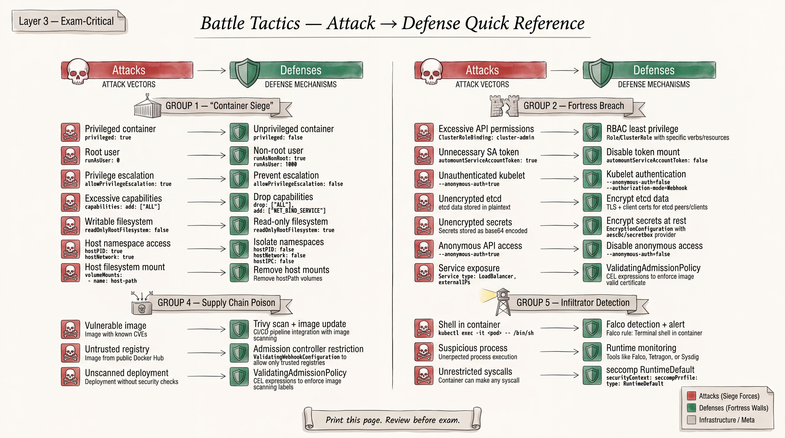

# CKS Exam Question Bank



> **151 hands-on tasks** mapped to the current CKS exam curriculum (Kubernetes v1.30+)
> Built for performance-based practice -- every task is executable in a real cluster.

## Exam Domain Weights and Task Distribution

| Domain | Weight | Tasks | Numbers |
|--------|--------|-------|---------|
| Cluster Setup | 15% | 23 | 1 -- 23 |
| Cluster Hardening | 15% | 23 | 24 -- 46 |
| System Hardening | 10% | 15 | 47 -- 61 |
| Minimize Microservice Vulnerabilities | 20% | 30 | 62 -- 91 |
| Supply Chain Security | 20% | 30 | 92 -- 121 |
| Monitoring, Logging and Runtime Security | 20% | 30 | 122 -- 151 |
| **Total** | **100%** | **151** | |

## Difficulty Distribution

| Difficulty | Count | Percentage |
|------------|-------|------------|
| Easy | ~44 | ~29% |
| Medium | ~67 | ~44% |
| Hard | ~40 | ~27% |

## How to Use This Question Bank

1. **Timed Practice:** Set a timer per task (use the Time Limit field). Aim to finish under the limit.
2. **Domain Focus:** Filter by domain header to target weak areas.
3. **Priority Order:** P0 tasks cover the most frequently tested topics. Start there.
4. **Blind Attempt First:** Try each task without looking at the solution. Then compare.
5. **Verification Always:** Run the Verification commands to confirm your solution actually works.

## Exam Environment Notes

- You get access to `kubernetes.io/docs` during the exam -- use it.
- `kubectl explain <resource>` is your best friend for field names.
- Alias setup: `alias k=kubectl` and `export do="--dry-run=client -o yaml"`
- The exam uses multiple clusters -- pay attention to context switching.
- Use `kubectl config use-context <context>` at the start of each task.

---

# Domain 1: Cluster Setup (15%)

Tasks 1 -- 23 | Topics: Network Policies, CIS Benchmarks, Ingress TLS, API Server Hardening, etcd Security, Node Metadata Protection, Binary Verification, External Access Restriction

---

### Task 1: Default Deny All Ingress Traffic in a Namespace
**Domain:** Cluster Setup
**Context:** A namespace `production` exists with several running pods. Currently, all pods can receive traffic from any source.
**Security Objective:** Apply a default-deny ingress NetworkPolicy so that no pod in the `production` namespace can receive traffic unless explicitly allowed.
**Task:**
1. Create a NetworkPolicy named `default-deny-ingress` in the `production` namespace.
2. The policy must select all pods in the namespace.
3. It must deny all ingress traffic by default.
**Time Limit:** 3 minutes
**Difficulty:** Easy
**Priority:** P0

---

**Solution:**
```bash
kubectl create namespace production --dry-run=client -o yaml | kubectl apply -f -
```
```yaml
apiVersion: networking.k8s.io/v1
kind: NetworkPolicy
metadata:
  name: default-deny-ingress
  namespace: production
spec:
  podSelector: {}
  policyTypes:
  - Ingress
```
```bash
kubectl apply -f default-deny-ingress.yaml
```

**Fast Solution:**
```bash
cat <<EOF | kubectl apply -f -
apiVersion: networking.k8s.io/v1
kind: NetworkPolicy
metadata:
  name: default-deny-ingress
  namespace: production
spec:
  podSelector: {}
  policyTypes:
  - Ingress
EOF
```

**Verification:**
```bash
kubectl get netpol -n production
kubectl describe netpol default-deny-ingress -n production
# Test: try to curl a pod from another namespace — it should be blocked
```

**Why It Matters:** Without a default-deny policy, any pod in the cluster can reach any other pod. This is the foundational building block for a zero-trust network model inside Kubernetes. CKS expects you to know this cold.

**Common Trap:** Using `podSelector: matchLabels: {}` instead of just `podSelector: {}`. An empty `podSelector` selects ALL pods. Adding `matchLabels: {}` is equivalent but candidates sometimes add a specific label, which only protects matching pods.

---

### Task 2: Allow Specific Ingress Traffic Between Pods
**Domain:** Cluster Setup
**Context:** Namespace `payments` has a default-deny ingress policy already in place. A pod `api-gateway` (label: `app: api-gateway`) needs to reach pod `payment-processor` (label: `app: payment-processor`) on port 8443.
**Security Objective:** Allow only the `api-gateway` pod to communicate with `payment-processor` on the required port while keeping all other traffic blocked.
**Task:**
1. Create a NetworkPolicy named `allow-gateway-to-processor` in the `payments` namespace.
2. Allow ingress to pods with label `app: payment-processor` on TCP port 8443.
3. Only from pods with label `app: api-gateway` in the same namespace.
**Time Limit:** 4 minutes
**Difficulty:** Easy
**Priority:** P0

---

**Solution:**
```yaml
apiVersion: networking.k8s.io/v1
kind: NetworkPolicy
metadata:
  name: allow-gateway-to-processor
  namespace: payments
spec:
  podSelector:
    matchLabels:
      app: payment-processor
  policyTypes:
  - Ingress
  ingress:
  - from:
    - podSelector:
        matchLabels:
          app: api-gateway
    ports:
    - protocol: TCP
      port: 8443
```
```bash
kubectl apply -f allow-gateway-to-processor.yaml
```

**Fast Solution:**
```bash
cat <<EOF | kubectl apply -f -
apiVersion: networking.k8s.io/v1
kind: NetworkPolicy
metadata:
  name: allow-gateway-to-processor
  namespace: payments
spec:
  podSelector:
    matchLabels:
      app: payment-processor
  policyTypes:
  - Ingress
  ingress:
  - from:
    - podSelector:
        matchLabels:
          app: api-gateway
    ports:
    - protocol: TCP
      port: 8443
EOF
```

**Verification:**
```bash
kubectl describe netpol allow-gateway-to-processor -n payments
# From api-gateway pod:
kubectl exec -n payments api-gateway -- curl -k https://payment-processor:8443 --max-time 3
# From any other pod — should timeout:
kubectl exec -n payments some-other-pod -- curl -k https://payment-processor:8443 --max-time 3
```

**Why It Matters:** Granular ingress rules implement the principle of least privilege at the network layer. In payment-processing scenarios, limiting which pods can talk to sensitive services reduces the blast radius of a compromised pod.

**Common Trap:** Forgetting to include `policyTypes: [Ingress]`. While it's inferred when `ingress` rules are present, being explicit avoids confusion and is best practice. Also, mixing up `from` and `ports` indentation — they must be at the same level under the `ingress` list item to be ANDed together.

---

### Task 3: Restrict Egress to DNS Only
**Domain:** Cluster Setup
**Context:** Namespace `restricted` contains a pod `sandbox-app` (label: `app: sandbox`) that should not be allowed to make any outbound connections except DNS queries.
**Security Objective:** Prevent data exfiltration by blocking all egress except DNS resolution.
**Task:**
1. Create a NetworkPolicy named `egress-dns-only` in the `restricted` namespace.
2. Select pods with label `app: sandbox`.
3. Allow egress only to UDP port 53 and TCP port 53 (DNS).
4. Block all other egress traffic.
**Time Limit:** 4 minutes
**Difficulty:** Medium
**Priority:** P0

---

**Solution:**
```yaml
apiVersion: networking.k8s.io/v1
kind: NetworkPolicy
metadata:
  name: egress-dns-only
  namespace: restricted
spec:
  podSelector:
    matchLabels:
      app: sandbox
  policyTypes:
  - Egress
  egress:
  - ports:
    - protocol: UDP
      port: 53
    - protocol: TCP
      port: 53
```
```bash
kubectl apply -f egress-dns-only.yaml
```

**Fast Solution:**
```bash
cat <<EOF | kubectl apply -f -
apiVersion: networking.k8s.io/v1
kind: NetworkPolicy
metadata:
  name: egress-dns-only
  namespace: restricted
spec:
  podSelector:
    matchLabels:
      app: sandbox
  policyTypes:
  - Egress
  egress:
  - ports:
    - protocol: UDP
      port: 53
    - protocol: TCP
      port: 53
EOF
```

**Verification:**
```bash
kubectl describe netpol egress-dns-only -n restricted
# DNS should work:
kubectl exec -n restricted sandbox-app -- nslookup kubernetes.default
# HTTP should be blocked:
kubectl exec -n restricted sandbox-app -- curl -m 3 http://example.com
```

**Why It Matters:** Egress restrictions prevent compromised pods from exfiltrating data or calling out to command-and-control servers. Allowing DNS-only is the minimum required for pods that need name resolution but should not reach external services.

**Common Trap:** Forgetting TCP port 53. DNS uses UDP by default but falls back to TCP for large responses (zone transfers, DNSSEC). Blocking TCP 53 can cause intermittent DNS failures that are hard to debug.

---

### Task 4: Cross-Namespace NetworkPolicy for Monitoring
**Domain:** Cluster Setup
**Context:** Namespace `monitoring` runs Prometheus (pod label: `app: prometheus`). Namespace `backend` has application pods (label: `app: backend-api`). A default-deny ingress policy exists in `backend`.
**Security Objective:** Allow Prometheus in the `monitoring` namespace to scrape metrics from `backend-api` pods on port 9090 without opening traffic from other namespaces.
**Task:**
1. Label the `monitoring` namespace with `purpose: monitoring`.
2. Create a NetworkPolicy named `allow-prometheus-scrape` in the `backend` namespace.
3. Allow ingress to pods with label `app: backend-api` on TCP port 9090.
4. Only from pods with label `app: prometheus` in namespaces labeled `purpose: monitoring`.
**Time Limit:** 5 minutes
**Difficulty:** Medium
**Priority:** P1

---

**Solution:**
```bash
kubectl label namespace monitoring purpose=monitoring --overwrite
```
```yaml
apiVersion: networking.k8s.io/v1
kind: NetworkPolicy
metadata:
  name: allow-prometheus-scrape
  namespace: backend
spec:
  podSelector:
    matchLabels:
      app: backend-api
  policyTypes:
  - Ingress
  ingress:
  - from:
    - namespaceSelector:
        matchLabels:
          purpose: monitoring
      podSelector:
        matchLabels:
          app: prometheus
    ports:
    - protocol: TCP
      port: 9090
```
```bash
kubectl apply -f allow-prometheus-scrape.yaml
```

**Fast Solution:**
```bash
kubectl label ns monitoring purpose=monitoring --overwrite
cat <<EOF | kubectl apply -f -
apiVersion: networking.k8s.io/v1
kind: NetworkPolicy
metadata:
  name: allow-prometheus-scrape
  namespace: backend
spec:
  podSelector:
    matchLabels:
      app: backend-api
  policyTypes:
  - Ingress
  ingress:
  - from:
    - namespaceSelector:
        matchLabels:
          purpose: monitoring
      podSelector:
        matchLabels:
          app: prometheus
    ports:
    - protocol: TCP
      port: 9090
EOF
```

**Verification:**
```bash
kubectl describe netpol allow-prometheus-scrape -n backend
# From prometheus pod in monitoring namespace:
kubectl exec -n monitoring prometheus-pod -- curl http://backend-api.backend.svc:9090/metrics --max-time 3
# From a random pod in another namespace — should fail:
kubectl exec -n default test-pod -- curl http://backend-api.backend.svc:9090/metrics --max-time 3
```

**Why It Matters:** Cross-namespace policies are essential for observability stacks. You need to open exactly the right ports to the right namespace without creating a blanket allow-all rule. This is a very common CKS exam pattern.

**Common Trap:** The critical pitfall is the difference between AND and OR in `from` rules. When `namespaceSelector` and `podSelector` are under the **same** `from` list item (same `-`), they are ANDed. If they are separate list items (separate `-`), they are ORed — meaning any pod in the monitoring namespace OR any prometheus-labeled pod in any namespace could connect.

---

### Task 5: Fix a Broken NetworkPolicy
**Domain:** Cluster Setup
**Context:** Namespace `webapp` has a pod `frontend` (label: `app: frontend`, `tier: web`) and a pod `backend-db` (label: `app: backend-db`, `tier: data`). The following NetworkPolicy exists but is not working — `frontend` cannot reach `backend-db` on port 5432:
```yaml
apiVersion: networking.k8s.io/v1
kind: NetworkPolicy
metadata:
  name: allow-frontend-to-db
  namespace: webapp
spec:
  podSelector:
    matchLabels:
      app: frontend
  policyTypes:
  - Ingress
  ingress:
  - from:
    - podSelector:
        matchLabels:
          app: backend-db
    ports:
    - protocol: TCP
      port: 5432
```
**Security Objective:** Fix the NetworkPolicy so `frontend` pods can reach `backend-db` on port 5432.
**Task:**
1. Identify the bug in the existing NetworkPolicy.
2. Fix it so that `frontend` can connect to `backend-db` on TCP 5432.
3. Ensure the fix does not open traffic more broadly than necessary.
**Time Limit:** 4 minutes
**Difficulty:** Medium
**Priority:** P0

---

**Solution:**
The policy selects `frontend` pods and allows ingress FROM `backend-db`. This is backwards — it should select `backend-db` and allow ingress FROM `frontend`.

```yaml
apiVersion: networking.k8s.io/v1
kind: NetworkPolicy
metadata:
  name: allow-frontend-to-db
  namespace: webapp
spec:
  podSelector:
    matchLabels:
      app: backend-db
  policyTypes:
  - Ingress
  ingress:
  - from:
    - podSelector:
        matchLabels:
          app: frontend
    ports:
    - protocol: TCP
      port: 5432
```
```bash
kubectl apply -f fixed-policy.yaml
```

**Fast Solution:**
```bash
kubectl get netpol allow-frontend-to-db -n webapp -o yaml > /tmp/fix.yaml
# Edit: swap podSelector to backend-db, swap from to frontend
kubectl apply -f /tmp/fix.yaml
```

**Verification:**
```bash
kubectl exec -n webapp frontend -- nc -zv backend-db 5432 -w 3
kubectl describe netpol allow-frontend-to-db -n webapp
```

**Why It Matters:** NetworkPolicy `podSelector` defines which pods the policy applies TO (the target). The `ingress.from` defines which pods can send traffic TO those targets. Confusing the direction is the single most common NetworkPolicy mistake in production and on the exam.

**Common Trap:** The podSelector selects the DESTINATION pods, not the SOURCE. Candidates who don't understand this directionality will keep debugging the wrong thing. Always think: "this policy protects [podSelector] pods and allows traffic from [ingress.from] pods."

---

### Task 6: Default Deny All Egress and Ingress
**Domain:** Cluster Setup
**Context:** A new namespace `high-security` has been created for a regulated workload. No NetworkPolicies exist yet.
**Security Objective:** Implement a complete network lockdown — deny all ingress AND all egress traffic for every pod in the namespace.
**Task:**
1. Create a single NetworkPolicy named `deny-all` in the `high-security` namespace.
2. It must select all pods.
3. It must deny both ingress and egress traffic.
**Time Limit:** 3 minutes
**Difficulty:** Easy
**Priority:** P0

---

**Solution:**
```yaml
apiVersion: networking.k8s.io/v1
kind: NetworkPolicy
metadata:
  name: deny-all
  namespace: high-security
spec:
  podSelector: {}
  policyTypes:
  - Ingress
  - Egress
```
```bash
kubectl apply -f deny-all.yaml
```

**Fast Solution:**
```bash
cat <<EOF | kubectl apply -f -
apiVersion: networking.k8s.io/v1
kind: NetworkPolicy
metadata:
  name: deny-all
  namespace: high-security
spec:
  podSelector: {}
  policyTypes:
  - Ingress
  - Egress
EOF
```

**Verification:**
```bash
kubectl describe netpol deny-all -n high-security
# Confirm: no ingress or egress rules listed — meaning all traffic is denied
# Test from a pod:
kubectl run test --image=busybox -n high-security --restart=Never -- sleep 3600
kubectl exec -n high-security test -- wget -qO- http://kubernetes.default --timeout=3
# Should timeout
```

**Why It Matters:** Complete network isolation is required for highly sensitive workloads. This is the starting point for building allowlists — start with deny-all, then add only the specific flows required.

**Common Trap:** Omitting `Egress` from `policyTypes`. If you only specify `Ingress`, egress is left wide open. You must explicitly list both policy types.

---

### Task 7: Run kube-bench and Remediate Control Plane Findings
**Domain:** Cluster Setup
**Context:** You have SSH access to the control plane node `controlplane`. kube-bench is installed at `/usr/local/bin/kube-bench`.
**Security Objective:** Run CIS benchmark checks against the control plane and fix critical failures related to the API server.
**Task:**
1. Run kube-bench on the control plane node targeting the master checks.
2. Identify findings related to `--authorization-mode` and `--profiling` on the API server.
3. Remediate the findings by editing the API server manifest.
4. Ensure the API server restarts successfully.
**Time Limit:** 8 minutes
**Difficulty:** Medium
**Priority:** P0

---

**Solution:**
```bash
# SSH to control plane
ssh controlplane

# Run kube-bench master checks
kube-bench run --targets=master

# Check current API server config
cat /etc/kubernetes/manifests/kube-apiserver.yaml | grep -E "authorization-mode|profiling"

# Edit the API server manifest
sudo vi /etc/kubernetes/manifests/kube-apiserver.yaml
```
Ensure these flags are set in the `command` section:
```yaml
spec:
  containers:
  - command:
    - kube-apiserver
    - --authorization-mode=Node,RBAC
    - --profiling=false
    # ... other flags
```
```bash
# Wait for API server to restart (kubelet watches the manifest)
# Watch for it to come back:
watch crictl ps | grep kube-apiserver

# Verify:
kubectl get nodes
```

**Fast Solution:**
```bash
ssh controlplane
kube-bench run --targets=master 2>/dev/null | grep -A 3 "FAIL"
# Edit manifest directly:
sudo sed -i 's/--profiling=true/--profiling=false/' /etc/kubernetes/manifests/kube-apiserver.yaml
# If --authorization-mode is missing Node or RBAC, add:
# --authorization-mode=Node,RBAC
```

**Verification:**
```bash
kube-bench run --targets=master 2>/dev/null | grep -E "authorization-mode|profiling"
kubectl get nodes  # API server is healthy
```

**Why It Matters:** CIS Kubernetes Benchmark (run via kube-bench) is the industry standard for Kubernetes hardening. The API server is the most critical component — disabling profiling prevents information leakage, and enforcing Node+RBAC authorization prevents unauthorized access.

**Common Trap:** After editing `/etc/kubernetes/manifests/kube-apiserver.yaml`, the API server pod is restarted by kubelet. If you introduce a YAML syntax error, the API server won't come back and kubectl will stop working. Always validate YAML before saving. Also, don't restart kubelet — it's unnecessary; the static pod manager watches the manifests directory.

---

### Task 8: Run kube-bench Worker Node Checks
**Domain:** Cluster Setup
**Context:** Worker node `node01` is running. kube-bench is installed. You need to verify the kubelet configuration meets CIS benchmarks.
**Security Objective:** Ensure the kubelet configuration on the worker node is hardened according to CIS benchmarks.
**Task:**
1. SSH to `node01` and run kube-bench targeting worker node checks.
2. Find the kubelet configuration file location.
3. Fix any findings related to `--anonymous-auth` and `--authorization-mode`.
4. Restart kubelet after changes.
**Time Limit:** 7 minutes
**Difficulty:** Medium
**Priority:** P0

---

**Solution:**
```bash
ssh node01

# Run kube-bench for worker
kube-bench run --targets=node

# Find kubelet config
ps aux | grep kubelet | grep config
# Typically: --config=/var/lib/kubelet/config.yaml

# Edit kubelet config
sudo vi /var/lib/kubelet/config.yaml
```
Ensure these settings in the kubelet config:
```yaml
authentication:
  anonymous:
    enabled: false
  webhook:
    enabled: true
authorization:
  mode: Webhook
```
```bash
# Restart kubelet
sudo systemctl restart kubelet
sudo systemctl status kubelet
```

**Fast Solution:**
```bash
ssh node01
sudo sed -i 's/enabled: true/enabled: false/' /var/lib/kubelet/config.yaml  # for anonymous auth
# Verify mode is Webhook in authorization section
sudo systemctl restart kubelet
```

**Verification:**
```bash
kube-bench run --targets=node 2>/dev/null | grep -E "anonymous|authorization"
sudo systemctl status kubelet
kubectl get nodes  # node01 should be Ready
```

**Why It Matters:** An unauthenticated kubelet API allows anyone with network access to the node to list pods, exec into containers, and extract secrets. Webhook authorization delegates decisions to the API server, ensuring RBAC is enforced consistently.

**Common Trap:** Editing the wrong file — kubelet can be configured via command-line flags OR a config file. Check `ps aux | grep kubelet` to see which config file is in use. Also, forgetting to restart kubelet after changes — unlike the API server, kubelet does not auto-reload its config.

---

### Task 9: Fix kube-bench Findings for etcd
**Domain:** Cluster Setup
**Context:** kube-bench reports FAIL for etcd peer communication encryption. The etcd static pod manifest is at `/etc/kubernetes/manifests/etcd.yaml` on the control plane node.
**Security Objective:** Ensure etcd peer-to-peer communication uses TLS.
**Task:**
1. Run kube-bench targeting etcd checks.
2. Identify the failing check related to peer TLS.
3. Verify or add the correct `--peer-cert-file`, `--peer-key-file`, `--peer-client-cert-auth`, and `--peer-trusted-ca-file` flags to the etcd manifest.
4. Ensure etcd restarts successfully.
**Time Limit:** 7 minutes
**Difficulty:** Hard
**Priority:** P0

---

**Solution:**
```bash
ssh controlplane

# Run etcd checks
kube-bench run --targets=etcd

# Check current etcd manifest
cat /etc/kubernetes/manifests/etcd.yaml | grep peer

# Edit etcd manifest
sudo vi /etc/kubernetes/manifests/etcd.yaml
```
Ensure these flags exist in the etcd command:
```yaml
spec:
  containers:
  - command:
    - etcd
    - --peer-cert-file=/etc/kubernetes/pki/etcd/peer.crt
    - --peer-key-file=/etc/kubernetes/pki/etcd/peer.key
    - --peer-client-cert-auth=true
    - --peer-trusted-ca-file=/etc/kubernetes/pki/etcd/ca.crt
    # ... other flags
```
```bash
# Wait for etcd to restart
watch crictl ps | grep etcd
# Verify cluster health
kubectl get cs
```

**Fast Solution:**
```bash
# Verify cert files exist first
ls /etc/kubernetes/pki/etcd/peer.* /etc/kubernetes/pki/etcd/ca.crt
# Add missing flags to etcd manifest
sudo vi /etc/kubernetes/manifests/etcd.yaml
# Add --peer-client-cert-auth=true if missing
```

**Verification:**
```bash
kube-bench run --targets=etcd 2>/dev/null | grep -i peer
cat /etc/kubernetes/manifests/etcd.yaml | grep peer
kubectl get pods -n kube-system | grep etcd
```

**Why It Matters:** etcd stores all cluster state including Secrets. If peer communication is unencrypted, an attacker with network access between etcd nodes can eavesdrop on all cluster data including credentials and secrets.

**Common Trap:** The cert files must actually exist on disk and be mounted into the etcd pod. Check `ls /etc/kubernetes/pki/etcd/` before referencing them. If the paths are wrong, etcd will crash and take the entire cluster down.

---

### Task 10: Configure TLS for Ingress
**Domain:** Cluster Setup
**Context:** An Ingress controller is running in the cluster. An application `web-app` (Service: `web-app-svc`, port 80) is deployed in namespace `apps`. It is currently exposed via HTTP through an Ingress resource.
**Security Objective:** Configure the Ingress to terminate TLS so the application is only accessible over HTTPS.
**Task:**
1. Create a TLS Secret named `web-app-tls` in namespace `apps` using the provided certificate at `/opt/certs/web-app.crt` and key at `/opt/certs/web-app.key`.
2. Create or update the Ingress resource named `web-app-ingress` in namespace `apps`.
3. The Ingress must serve `web-app.example.com` over HTTPS using the TLS secret.
4. Route traffic to `web-app-svc` on port 80.
**Time Limit:** 5 minutes
**Difficulty:** Easy
**Priority:** P0

---

**Solution:**
```bash
# Create TLS secret
kubectl create secret tls web-app-tls \
  --cert=/opt/certs/web-app.crt \
  --key=/opt/certs/web-app.key \
  -n apps
```
```yaml
apiVersion: networking.k8s.io/v1
kind: Ingress
metadata:
  name: web-app-ingress
  namespace: apps
spec:
  tls:
  - hosts:
    - web-app.example.com
    secretName: web-app-tls
  rules:
  - host: web-app.example.com
    http:
      paths:
      - path: /
        pathType: Prefix
        backend:
          service:
            name: web-app-svc
            port:
              number: 80
```
```bash
kubectl apply -f web-app-ingress.yaml
```

**Fast Solution:**
```bash
kubectl create secret tls web-app-tls --cert=/opt/certs/web-app.crt --key=/opt/certs/web-app.key -n apps
cat <<EOF | kubectl apply -f -
apiVersion: networking.k8s.io/v1
kind: Ingress
metadata:
  name: web-app-ingress
  namespace: apps
spec:
  tls:
  - hosts:
    - web-app.example.com
    secretName: web-app-tls
  rules:
  - host: web-app.example.com
    http:
      paths:
      - path: /
        pathType: Prefix
        backend:
          service:
            name: web-app-svc
            port:
              number: 80
EOF
```

**Verification:**
```bash
kubectl get ingress web-app-ingress -n apps
kubectl describe ingress web-app-ingress -n apps
kubectl get secret web-app-tls -n apps
# Test:
curl -k https://web-app.example.com --resolve web-app.example.com:443:<INGRESS_IP>
```

**Why It Matters:** Exposing applications over HTTP means credentials and data traverse the network in plaintext. TLS termination at the Ingress is the standard approach to securing external-facing services in Kubernetes.

**Common Trap:** Creating the secret in the wrong namespace. The TLS secret MUST be in the same namespace as the Ingress resource. Also, `pathType` is required in networking.k8s.io/v1 — omitting it causes a validation error.

---

### Task 11: Configure Ingress with TLS and Redirect HTTP to HTTPS
**Domain:** Cluster Setup
**Context:** Namespace `public` has an Ingress resource `app-ingress` that serves `app.example.com`. TLS is configured but HTTP traffic is still accepted on port 80.
**Security Objective:** Force all HTTP traffic to redirect to HTTPS so no plaintext communication is possible.
**Task:**
1. Update the Ingress `app-ingress` in namespace `public` to redirect HTTP to HTTPS.
2. Use the appropriate annotation for the Ingress controller in use (nginx).
3. Ensure the TLS configuration remains intact.
**Time Limit:** 3 minutes
**Difficulty:** Easy
**Priority:** P1

---

**Solution:**
```bash
kubectl edit ingress app-ingress -n public
```
Add the annotation:
```yaml
apiVersion: networking.k8s.io/v1
kind: Ingress
metadata:
  name: app-ingress
  namespace: public
  annotations:
    nginx.ingress.kubernetes.io/ssl-redirect: "true"
    nginx.ingress.kubernetes.io/force-ssl-redirect: "true"
spec:
  tls:
  - hosts:
    - app.example.com
    secretName: app-tls
  rules:
  - host: app.example.com
    http:
      paths:
      - path: /
        pathType: Prefix
        backend:
          service:
            name: app-svc
            port:
              number: 80
```

**Fast Solution:**
```bash
kubectl annotate ingress app-ingress -n public \
  nginx.ingress.kubernetes.io/ssl-redirect="true" \
  nginx.ingress.kubernetes.io/force-ssl-redirect="true" --overwrite
```

**Verification:**
```bash
kubectl describe ingress app-ingress -n public | grep -i annotation
# Test HTTP redirect:
curl -I http://app.example.com --resolve app.example.com:80:<INGRESS_IP>
# Should return 308 Permanent Redirect with Location: https://...
```

**Why It Matters:** Even with TLS configured, if HTTP is still accepted, users can accidentally send credentials in plaintext. Forcing redirect ensures all communication is encrypted regardless of how the user accesses the application.

**Common Trap:** The annotation name varies by Ingress controller. For nginx it's `nginx.ingress.kubernetes.io/ssl-redirect`. For Traefik or HAProxy, the annotation is completely different. Check which controller is running before applying annotations.

---

### Task 12: Secure Ingress with Specific TLS Version
**Domain:** Cluster Setup
**Context:** Namespace `secure-web` has an Ingress using nginx Ingress controller. Security policy requires TLS 1.2 as the minimum version and disallows weak cipher suites.
**Security Objective:** Harden the Ingress TLS configuration to enforce minimum TLS 1.2 and strong ciphers.
**Task:**
1. Update the Ingress `secure-ingress` in namespace `secure-web` with annotations to enforce minimum TLS 1.2.
2. Configure the allowed cipher suites to only include strong ciphers.
**Time Limit:** 4 minutes
**Difficulty:** Medium
**Priority:** P1

---

**Solution:**
```bash
kubectl annotate ingress secure-ingress -n secure-web \
  nginx.ingress.kubernetes.io/ssl-protocols="TLSv1.2 TLSv1.3" \
  nginx.ingress.kubernetes.io/ssl-ciphers="ECDHE-ECDSA-AES128-GCM-SHA256:ECDHE-RSA-AES128-GCM-SHA256:ECDHE-ECDSA-AES256-GCM-SHA384:ECDHE-RSA-AES256-GCM-SHA384" \
  --overwrite
```

Alternatively, configure via ConfigMap for cluster-wide settings:
```yaml
apiVersion: v1
kind: ConfigMap
metadata:
  name: ingress-nginx-controller
  namespace: ingress-nginx
data:
  ssl-protocols: "TLSv1.2 TLSv1.3"
  ssl-ciphers: "ECDHE-ECDSA-AES128-GCM-SHA256:ECDHE-RSA-AES128-GCM-SHA256:ECDHE-ECDSA-AES256-GCM-SHA384:ECDHE-RSA-AES256-GCM-SHA384"
```

**Fast Solution:**
```bash
kubectl annotate ingress secure-ingress -n secure-web \
  nginx.ingress.kubernetes.io/ssl-protocols="TLSv1.2 TLSv1.3" \
  nginx.ingress.kubernetes.io/ssl-ciphers="ECDHE-ECDSA-AES128-GCM-SHA256:ECDHE-RSA-AES128-GCM-SHA256:ECDHE-ECDSA-AES256-GCM-SHA384:ECDHE-RSA-AES256-GCM-SHA384" \
  --overwrite
```

**Verification:**
```bash
kubectl describe ingress secure-ingress -n secure-web | grep -i ssl
# Test with openssl:
openssl s_client -connect <INGRESS_IP>:443 -tls1_1 -servername secure-web.example.com
# Should fail (TLS 1.1 not allowed)
openssl s_client -connect <INGRESS_IP>:443 -tls1_2 -servername secure-web.example.com
# Should succeed
```

**Why It Matters:** TLS 1.0 and 1.1 have known vulnerabilities (BEAST, POODLE). Compliance frameworks like PCI-DSS require TLS 1.2 minimum. Weak cipher suites can be exploited even with newer TLS versions.

**Common Trap:** Annotation-level TLS settings only apply to that specific Ingress. If you need cluster-wide enforcement, use the nginx ConfigMap. Also, overly restrictive cipher suites may break compatibility with legitimate clients.

---

### Task 13: Disable Anonymous Authentication on API Server
**Domain:** Cluster Setup
**Context:** The API server on the control plane node is configured with default settings. Anonymous authentication is enabled.
**Security Objective:** Disable anonymous authentication to prevent unauthenticated access to the API server.
**Task:**
1. SSH to the control plane node.
2. Edit the API server manifest at `/etc/kubernetes/manifests/kube-apiserver.yaml`.
3. Set `--anonymous-auth=false`.
4. Ensure the API server restarts and is healthy.
**Time Limit:** 4 minutes
**Difficulty:** Easy
**Priority:** P0

---

**Solution:**
```bash
ssh controlplane

# Backup manifest
sudo cp /etc/kubernetes/manifests/kube-apiserver.yaml /tmp/kube-apiserver-backup.yaml

# Edit manifest
sudo vi /etc/kubernetes/manifests/kube-apiserver.yaml
```
Add or modify in the command section:
```yaml
spec:
  containers:
  - command:
    - kube-apiserver
    - --anonymous-auth=false
    # ... other existing flags
```
```bash
# Wait for restart
watch crictl ps | grep kube-apiserver
kubectl get nodes
```

**Fast Solution:**
```bash
ssh controlplane
# Check if flag exists
grep anonymous-auth /etc/kubernetes/manifests/kube-apiserver.yaml
# Add or modify the flag
sudo sed -i '/--enable-admission-plugins/a\    - --anonymous-auth=false' /etc/kubernetes/manifests/kube-apiserver.yaml
# Wait for restart
sleep 30 && kubectl get nodes
```

**Verification:**
```bash
kubectl get nodes  # Should work with kubeconfig
# Anonymous access should fail:
curl -k https://localhost:6443/api/v1/namespaces --header "Authorization: Bearer invalid"
# Should return 401 Unauthorized
```

**Why It Matters:** Anonymous authentication allows unauthenticated requests to reach the API server. While RBAC should block most operations, defense-in-depth requires disabling anonymous access to prevent information leakage through discovery endpoints.

**Common Trap:** Some health check components (like the liveness probe) may depend on anonymous auth. If the API server fails to start after disabling anonymous auth, check if the liveness probe URL requires authentication. In kubeadm clusters, the liveness probe typically uses `--livez` endpoint which works without authentication, but verify.

---

### Task 14: Restrict API Server Admission Controllers
**Domain:** Cluster Setup
**Context:** The API server is running with a minimal set of admission controllers. Security policy requires additional admission controllers to be enabled.
**Security Objective:** Enable critical security admission controllers: NodeRestriction, PodSecurity, and EventRateLimit.
**Task:**
1. SSH to the control plane node.
2. Check the current admission controller configuration.
3. Add `NodeRestriction` to the `--enable-admission-plugins` flag.
4. Ensure `PodSecurity` is also in the list.
5. Verify the API server restarts successfully.
**Time Limit:** 5 minutes
**Difficulty:** Medium
**Priority:** P0

---

**Solution:**
```bash
ssh controlplane

# Check current admission plugins
grep enable-admission-plugins /etc/kubernetes/manifests/kube-apiserver.yaml

# Edit manifest
sudo vi /etc/kubernetes/manifests/kube-apiserver.yaml
```
Update the admission plugins line:
```yaml
- --enable-admission-plugins=NodeRestriction,PodSecurity,NamespaceLifecycle,ServiceAccount,LimitRanger,DefaultStorageClass,ResourceQuota
```
```bash
# Wait for restart
watch crictl ps | grep apiserver
kubectl get nodes
```

**Fast Solution:**
```bash
ssh controlplane
# View current setting:
grep enable-admission-plugins /etc/kubernetes/manifests/kube-apiserver.yaml
# Edit and add NodeRestriction,PodSecurity to the comma-separated list
sudo vi /etc/kubernetes/manifests/kube-apiserver.yaml
```

**Verification:**
```bash
kubectl -n kube-system describe pod kube-apiserver-controlplane | grep admission
# Or:
ps aux | grep kube-apiserver | grep admission
```

**Why It Matters:** NodeRestriction prevents compromised nodes from modifying objects belonging to other nodes. PodSecurity (successor to PodSecurityPolicy) enforces pod security standards. Without these controllers, security policies are not enforced at admission time.

**Common Trap:** Don't remove existing admission controllers from the list — only add new ones. Removing defaults like `NamespaceLifecycle` or `ServiceAccount` can break cluster functionality. Also, admission plugin names are case-sensitive.

---

### Task 15: Disable Insecure API Server Flags
**Domain:** Cluster Setup
**Context:** A security audit has flagged the API server for having insecure configuration options enabled.
**Security Objective:** Remove insecure flags and ensure only secure communication is possible with the API server.
**Task:**
1. SSH to the control plane node.
2. Edit `/etc/kubernetes/manifests/kube-apiserver.yaml`.
3. Ensure `--insecure-port=0` is set (or the flag is absent, as it's deprecated and disabled by default in v1.24+).
4. Ensure `--profiling=false` is set.
5. Ensure `--audit-log-path` is configured (set to `/var/log/kubernetes/audit.log` if not present).
6. Ensure `--audit-log-maxage=30` is set.
**Time Limit:** 6 minutes
**Difficulty:** Medium
**Priority:** P0

---

**Solution:**
```bash
ssh controlplane
sudo vi /etc/kubernetes/manifests/kube-apiserver.yaml
```
Ensure these flags are present:
```yaml
spec:
  containers:
  - command:
    - kube-apiserver
    - --profiling=false
    - --audit-log-path=/var/log/kubernetes/audit.log
    - --audit-log-maxage=30
    # Remove any --insecure-port or --insecure-bind-address flags
    # ... other flags
```
Also ensure the hostPath volume for audit logs is mounted:
```yaml
  volumeMounts:
  - mountPath: /var/log/kubernetes
    name: audit-log
    # ...
  volumes:
  - hostPath:
      path: /var/log/kubernetes
      type: DirectoryOrCreate
    name: audit-log
```
```bash
# Create the directory if it doesn't exist
sudo mkdir -p /var/log/kubernetes
# Wait for restart
watch crictl ps | grep apiserver
```

**Fast Solution:**
```bash
ssh controlplane
sudo mkdir -p /var/log/kubernetes
sudo vi /etc/kubernetes/manifests/kube-apiserver.yaml
# Add flags and volume mount, wait for restart
```

**Verification:**
```bash
ps aux | grep kube-apiserver | tr ' ' '\n' | grep -E "profiling|audit|insecure"
kubectl get nodes
ls -la /var/log/kubernetes/audit.log
```

**Why It Matters:** Profiling endpoints expose internal performance data. The insecure port (deprecated) allowed unauthenticated, unencrypted access. Audit logging is essential for forensics — without it, you have no record of who did what in the cluster.

**Common Trap:** If you add `--audit-log-path` but forget to mount the volume into the API server pod, the container won't have access to the host path and the API server will fail to start. Always add both the volumeMount and the volume definition.

---

### Task 16: Configure etcd Encryption at Rest
**Domain:** Cluster Setup
**Context:** Secrets stored in etcd are currently in plaintext. You need to enable encryption at rest for Secret resources.
**Security Objective:** Encrypt all Secret data stored in etcd using AES-CBC encryption.
**Task:**
1. Create an EncryptionConfiguration file at `/etc/kubernetes/enc/encryption-config.yaml`.
2. Configure it to encrypt `secrets` resources using `aescbc` provider.
3. Generate a 32-byte base64-encoded key for the encryption.
4. Update the API server to use the encryption configuration.
5. Verify that new secrets are encrypted.
**Time Limit:** 10 minutes
**Difficulty:** Hard
**Priority:** P0

---

**Solution:**
```bash
ssh controlplane

# Generate a 32-byte encryption key
ENCRYPTION_KEY=$(head -c 32 /dev/urandom | base64)
echo $ENCRYPTION_KEY

# Create directory
sudo mkdir -p /etc/kubernetes/enc

# Create encryption config
sudo tee /etc/kubernetes/enc/encryption-config.yaml <<EOF
apiVersion: apiserver.config.k8s.io/v1
kind: EncryptionConfiguration
resources:
  - resources:
      - secrets
    providers:
      - aescbc:
          keys:
            - name: key1
              secret: ${ENCRYPTION_KEY}
      - identity: {}
EOF

# Edit API server manifest
sudo vi /etc/kubernetes/manifests/kube-apiserver.yaml
```
Add to the API server command:
```yaml
- --encryption-provider-config=/etc/kubernetes/enc/encryption-config.yaml
```
Add volume and volumeMount:
```yaml
  volumeMounts:
  - mountPath: /etc/kubernetes/enc
    name: enc-config
    readOnly: true
  volumes:
  - hostPath:
      path: /etc/kubernetes/enc
      type: DirectoryOrCreate
    name: enc-config
```
```bash
# Wait for restart
watch crictl ps | grep apiserver

# Re-encrypt existing secrets
kubectl get secrets --all-namespaces -o json | kubectl replace -f -
```

**Fast Solution:**
```bash
ssh controlplane
ENCRYPTION_KEY=$(head -c 32 /dev/urandom | base64)
sudo mkdir -p /etc/kubernetes/enc
cat <<EOF | sudo tee /etc/kubernetes/enc/encryption-config.yaml
apiVersion: apiserver.config.k8s.io/v1
kind: EncryptionConfiguration
resources:
  - resources:
      - secrets
    providers:
      - aescbc:
          keys:
            - name: key1
              secret: ${ENCRYPTION_KEY}
      - identity: {}
EOF
# Add --encryption-provider-config flag and volume to API server manifest
sudo vi /etc/kubernetes/manifests/kube-apiserver.yaml
```

**Verification:**
```bash
# Create a test secret
kubectl create secret generic test-enc-secret --from-literal=mykey=mydata

# Read it directly from etcd — should be encrypted
sudo ETCDCTL_API=3 etcdctl \
  --cacert=/etc/kubernetes/pki/etcd/ca.crt \
  --cert=/etc/kubernetes/pki/etcd/server.crt \
  --key=/etc/kubernetes/pki/etcd/server.key \
  get /registry/secrets/default/test-enc-secret | hexdump -C | head -20
# Should show "k8s:enc:aescbc:v1:key1" prefix, not plaintext
```

**Why It Matters:** By default, Kubernetes stores Secrets base64-encoded but NOT encrypted in etcd. Anyone with etcd access can read all secrets. Encryption at rest ensures that even if etcd data is compromised, secrets remain confidential.

**Common Trap:** The `identity: {}` provider at the bottom is critical — it allows reading secrets that were stored before encryption was enabled. Without it, pre-existing secrets become unreadable. Also, after enabling encryption, existing secrets are NOT automatically re-encrypted — you must do `kubectl get secrets --all-namespaces -o json | kubectl replace -f -`.

---

### Task 17: Restrict etcd Access to API Server Only
**Domain:** Cluster Setup
**Context:** etcd is running on the control plane node and is accessible to other components besides the API server.
**Security Objective:** Ensure only the API server can communicate with etcd by verifying client certificate authentication.
**Task:**
1. SSH to the control plane node.
2. Verify etcd is configured with client certificate authentication (`--client-cert-auth=true`).
3. Verify etcd only listens on `127.0.0.1:2379` (not `0.0.0.0:2379`).
4. Verify the API server uses the correct etcd client certificates.
5. Fix any issues found.
**Time Limit:** 6 minutes
**Difficulty:** Medium
**Priority:** P0

---

**Solution:**
```bash
ssh controlplane

# Check etcd configuration
cat /etc/kubernetes/manifests/etcd.yaml | grep -E "listen-client|client-cert-auth|trusted-ca"

# Verify listen address
grep listen-client-urls /etc/kubernetes/manifests/etcd.yaml
# Should show: --listen-client-urls=https://127.0.0.1:2379,https://<node-ip>:2379
# If it shows 0.0.0.0, change to specific IPs

# Verify client cert auth
grep client-cert-auth /etc/kubernetes/manifests/etcd.yaml
# Should show: --client-cert-auth=true
```
If `--client-cert-auth=true` is missing:
```bash
sudo vi /etc/kubernetes/manifests/etcd.yaml
# Add: --client-cert-auth=true
```
Verify API server etcd client certs:
```bash
grep etcd /etc/kubernetes/manifests/kube-apiserver.yaml
# Should show:
# --etcd-certfile=/etc/kubernetes/pki/apiserver-etcd-client.crt
# --etcd-keyfile=/etc/kubernetes/pki/apiserver-etcd-client.key
# --etcd-cafile=/etc/kubernetes/pki/etcd/ca.crt
```

**Fast Solution:**
```bash
ssh controlplane
grep -E "client-cert-auth|listen-client" /etc/kubernetes/manifests/etcd.yaml
# Add --client-cert-auth=true if missing
# Change 0.0.0.0 to 127.0.0.1 if needed
```

**Verification:**
```bash
# From control plane:
sudo ETCDCTL_API=3 etcdctl --endpoints=https://127.0.0.1:2379 \
  --cacert=/etc/kubernetes/pki/etcd/ca.crt \
  --cert=/etc/kubernetes/pki/etcd/server.crt \
  --key=/etc/kubernetes/pki/etcd/server.key \
  member list
# Without certs — should fail:
sudo ETCDCTL_API=3 etcdctl --endpoints=https://127.0.0.1:2379 member list
```

**Why It Matters:** etcd contains all cluster state. If it accepts connections without client certificates or listens on all interfaces, any process on the network can dump the entire cluster database including secrets, tokens, and configuration.

**Common Trap:** Don't change the advertise-client-urls to 127.0.0.1 — that's the address other etcd members (in HA setups) use to reach this node. Only `listen-client-urls` should be restricted. Also, kubeadm-provisioned clusters often listen on both 127.0.0.1 and the node IP, which is acceptable if client cert auth is enabled.

---

### Task 18: Secure etcd Data Directory Permissions
**Domain:** Cluster Setup
**Context:** The etcd data directory on the control plane node has overly permissive file permissions.
**Security Objective:** Restrict etcd data directory permissions so only the etcd user/process can access the data.
**Task:**
1. SSH to the control plane node.
2. Find the etcd data directory (usually `/var/lib/etcd`).
3. Set the directory permissions to `700` (owner only).
4. Verify the ownership is correct (should be `etcd:etcd` or `root:root` depending on setup).
**Time Limit:** 3 minutes
**Difficulty:** Easy
**Priority:** P1

---

**Solution:**
```bash
ssh controlplane

# Find etcd data directory
grep data-dir /etc/kubernetes/manifests/etcd.yaml
# Typically: --data-dir=/var/lib/etcd

# Check current permissions
ls -ld /var/lib/etcd

# Fix permissions
sudo chmod 700 /var/lib/etcd

# Verify ownership (in kubeadm, usually root:root since etcd runs as root in container)
ls -ld /var/lib/etcd
```

**Fast Solution:**
```bash
ssh controlplane
sudo chmod 700 /var/lib/etcd
ls -ld /var/lib/etcd
```

**Verification:**
```bash
ls -ld /var/lib/etcd
# Should show: drwx------ (700)
stat -c '%a %U:%G' /var/lib/etcd
# Should show: 700 root:root (or etcd:etcd)
```

**Why It Matters:** CIS Benchmark 2.1 requires etcd data directory to have 700 permissions. Overly permissive access allows any local user to read the raw etcd database files, which contain all cluster secrets in their stored form.

**Common Trap:** Don't change ownership if etcd is running inside a container (as in kubeadm). The etcd process in the container runs as root, so the host directory should be owned by root. Changing to etcd:etcd user (which may not exist on the host) would break etcd.

---

### Task 19: Protect Cloud Node Metadata
**Domain:** Cluster Setup
**Context:** The cluster runs on a cloud provider (AWS/GCP). Pods can access the node's cloud metadata endpoint at `169.254.169.254`, which exposes IAM credentials and sensitive instance information.
**Security Objective:** Block pods from accessing the cloud metadata endpoint using a NetworkPolicy.
**Task:**
1. Create a NetworkPolicy named `deny-metadata-access` in the `default` namespace.
2. Block all egress traffic to `169.254.169.254/32` from all pods.
3. Allow all other egress traffic to remain functional.
**Time Limit:** 5 minutes
**Difficulty:** Medium
**Priority:** P0

---

**Solution:**
```yaml
apiVersion: networking.k8s.io/v1
kind: NetworkPolicy
metadata:
  name: deny-metadata-access
  namespace: default
spec:
  podSelector: {}
  policyTypes:
  - Egress
  egress:
  - to:
    - ipBlock:
        cidr: 0.0.0.0/0
        except:
        - 169.254.169.254/32
```
```bash
kubectl apply -f deny-metadata-access.yaml
```

**Fast Solution:**
```bash
cat <<EOF | kubectl apply -f -
apiVersion: networking.k8s.io/v1
kind: NetworkPolicy
metadata:
  name: deny-metadata-access
  namespace: default
spec:
  podSelector: {}
  policyTypes:
  - Egress
  egress:
  - to:
    - ipBlock:
        cidr: 0.0.0.0/0
        except:
        - 169.254.169.254/32
EOF
```

**Verification:**
```bash
kubectl describe netpol deny-metadata-access
# Test from a pod:
kubectl run test-metadata --image=busybox --restart=Never -- wget -qO- http://169.254.169.254 --timeout=3
kubectl logs test-metadata
# Should timeout/fail
# Test normal egress still works:
kubectl run test-egress --image=busybox --restart=Never -- wget -qO- http://kubernetes.default --timeout=3
```

**Why It Matters:** Cloud metadata endpoints expose IAM credentials, instance identity tokens, and cloud provider API keys. This is one of the most exploited attack vectors in cloud-hosted Kubernetes — an attacker who compromises a pod can escalate privileges by grabbing node IAM credentials.

**Common Trap:** This policy must be applied to EVERY namespace, not just `default`. A single unprotected namespace is enough for an attacker. Also, this approach uses "allow everything except metadata" — an alternative is to combine with a default-deny egress policy and only allow specific destinations.

---

### Task 20: Block Node Metadata Access Using Multiple Namespaces
**Domain:** Cluster Setup
**Context:** The cluster has namespaces `frontend`, `backend`, and `data`. All need to be protected from cloud metadata access. The metadata endpoint is `169.254.169.254`.
**Security Objective:** Apply metadata protection across all application namespaces without affecting system namespaces.
**Task:**
1. Create a NetworkPolicy template that blocks egress to `169.254.169.254/32`.
2. Apply it to all three namespaces: `frontend`, `backend`, and `data`.
3. Verify the policy is active in all namespaces.
**Time Limit:** 5 minutes
**Difficulty:** Easy
**Priority:** P0

---

**Solution:**
```bash
for ns in frontend backend data; do
cat <<EOF | kubectl apply -f -
apiVersion: networking.k8s.io/v1
kind: NetworkPolicy
metadata:
  name: deny-cloud-metadata
  namespace: ${ns}
spec:
  podSelector: {}
  policyTypes:
  - Egress
  egress:
  - to:
    - ipBlock:
        cidr: 0.0.0.0/0
        except:
        - 169.254.169.254/32
EOF
done
```

**Fast Solution:**
```bash
for ns in frontend backend data; do
cat <<EOF | kubectl apply -f -
apiVersion: networking.k8s.io/v1
kind: NetworkPolicy
metadata:
  name: deny-cloud-metadata
  namespace: ${ns}
spec:
  podSelector: {}
  policyTypes:
  - Egress
  egress:
  - to:
    - ipBlock:
        cidr: 0.0.0.0/0
        except:
        - 169.254.169.254/32
EOF
done
```

**Verification:**
```bash
for ns in frontend backend data; do
  echo "=== $ns ==="
  kubectl get netpol -n $ns
done
# Test from each namespace:
for ns in frontend backend data; do
  kubectl run test-meta-$ns --image=busybox -n $ns --restart=Never -- wget -qO- http://169.254.169.254 --timeout=3
  kubectl logs test-meta-$ns -n $ns
done
```

**Why It Matters:** A single namespace without metadata protection is enough for an attacker to escalate privileges. Systematic application across all application namespaces ensures consistent protection.

**Common Trap:** Don't apply to `kube-system` — system components may legitimately need cloud metadata access (e.g., cloud-controller-manager, node-problem-detector). Focus on application namespaces.

---

### Task 21: Verify Kubernetes Binary Integrity
**Domain:** Cluster Setup
**Context:** A new worker node has been provisioned. You need to verify that the kubectl, kubelet, and kubeadm binaries installed on it are genuine and have not been tampered with.
**Security Objective:** Verify the SHA-512 checksums of Kubernetes binaries against the official release checksums.
**Task:**
1. SSH to `node01`.
2. Determine the installed Kubernetes version.
3. Download the official SHA-512 checksum file for that version.
4. Compare the checksums of `/usr/bin/kubelet`, `/usr/bin/kubectl`, and `/usr/bin/kubeadm` against the official values.
5. Report whether the binaries are genuine.
**Time Limit:** 7 minutes
**Difficulty:** Medium
**Priority:** P1

---

**Solution:**
```bash
ssh node01

# Determine version
kubelet --version
# Example output: Kubernetes v1.30.0

VERSION="v1.30.0"

# Download official checksums
curl -LO "https://dl.k8s.io/${VERSION}/bin/linux/amd64/kubectl.sha256"
curl -LO "https://dl.k8s.io/${VERSION}/bin/linux/amd64/kubelet.sha256"
curl -LO "https://dl.k8s.io/${VERSION}/bin/linux/amd64/kubeadm.sha256"

# Calculate local checksums and compare
echo "$(cat kubectl.sha256)  /usr/bin/kubectl" | sha256sum --check
echo "$(cat kubelet.sha256)  /usr/bin/kubelet" | sha256sum --check
echo "$(cat kubeadm.sha256)  /usr/bin/kubeadm" | sha256sum --check
```

**Fast Solution:**
```bash
ssh node01
VERSION=$(kubelet --version | awk '{print $2}')
for bin in kubectl kubelet kubeadm; do
  curl -sLO "https://dl.k8s.io/${VERSION}/bin/linux/amd64/${bin}.sha256"
  echo "$(cat ${bin}.sha256)  /usr/bin/${bin}" | sha256sum --check
done
```

**Verification:**
```bash
# Each check should output: /usr/bin/<binary>: OK
# If any shows FAILED, the binary has been tampered with
```

**Why It Matters:** Supply chain attacks can involve replacing Kubernetes binaries with backdoored versions. Verifying checksums against official releases ensures that the binaries running on your nodes are authentic and have not been modified.

**Common Trap:** Using sha512sum vs sha256sum — Kubernetes officially provides sha256 checksums. Also, the binary path might differ (`/usr/local/bin/` vs `/usr/bin/`). Check with `which kubelet` first. Don't forget to verify over HTTPS to prevent the checksum itself from being tampered with.

---

### Task 22: Restrict NodePort Service Range
**Domain:** Cluster Setup
**Context:** The API server currently allows NodePort services to use the default range (30000-32767). Security policy requires restricting this range to 31000-31999 to limit exposed ports.
**Security Objective:** Restrict the NodePort range to minimize the attack surface on worker nodes.
**Task:**
1. SSH to the control plane node.
2. Edit the API server manifest to set `--service-node-port-range=31000-31999`.
3. Verify the API server restarts successfully.
4. Confirm that creating a NodePort service outside the range is rejected.
**Time Limit:** 5 minutes
**Difficulty:** Medium
**Priority:** P1

---

**Solution:**
```bash
ssh controlplane

# Edit API server manifest
sudo vi /etc/kubernetes/manifests/kube-apiserver.yaml
```
Add or modify:
```yaml
spec:
  containers:
  - command:
    - kube-apiserver
    - --service-node-port-range=31000-31999
    # ... other flags
```
```bash
# Wait for restart
watch crictl ps | grep apiserver
kubectl get nodes
```

**Fast Solution:**
```bash
ssh controlplane
sudo grep service-node-port-range /etc/kubernetes/manifests/kube-apiserver.yaml
# If not present, add it:
sudo sed -i '/--service-cluster-ip-range/a\    - --service-node-port-range=31000-31999' /etc/kubernetes/manifests/kube-apiserver.yaml
```

**Verification:**
```bash
kubectl get nodes  # API server is healthy
# Try creating a NodePort service with port outside range:
kubectl create service nodeport test-svc --tcp=80:80 --node-port=30000
# Should fail with: provided port is not in the valid range
# Valid range:
kubectl create service nodeport test-svc --tcp=80:80 --node-port=31500
# Should succeed
kubectl delete service test-svc
```

**Why It Matters:** Every open NodePort is a potential entry point on every worker node. Restricting the range reduces the number of ports that could be exposed, and makes it easier to configure firewall rules on the nodes.

**Common Trap:** Existing NodePort services outside the new range will continue to work (they were already allocated), but they cannot be recreated if deleted. Check for existing services before changing the range to avoid disruption.

---

### Task 23: Restrict API Server Access to Specific Networks
**Domain:** Cluster Setup
**Context:** The API server is currently accessible from any IP address. Company policy requires that API server access is restricted to the corporate network (10.0.0.0/8) and the pod network (172.16.0.0/12).
**Security Objective:** Use firewall rules or API server configuration to restrict which networks can reach the API server.
**Task:**
1. SSH to the control plane node.
2. Configure iptables rules to only allow traffic to the API server port (6443) from:
   - The corporate network: `10.0.0.0/8`
   - The pod network: `172.16.0.0/12`
   - Localhost: `127.0.0.1/8`
3. Drop all other traffic to port 6443.
4. Verify that the cluster still functions correctly.
**Time Limit:** 8 minutes
**Difficulty:** Hard
**Priority:** P1

---

**Solution:**
```bash
ssh controlplane

# Allow from corporate network
sudo iptables -A INPUT -p tcp --dport 6443 -s 10.0.0.0/8 -j ACCEPT
# Allow from pod network
sudo iptables -A INPUT -p tcp --dport 6443 -s 172.16.0.0/12 -j ACCEPT
# Allow localhost
sudo iptables -A INPUT -p tcp --dport 6443 -s 127.0.0.0/8 -j ACCEPT
# Allow established connections
sudo iptables -A INPUT -p tcp --dport 6443 -m state --state ESTABLISHED,RELATED -j ACCEPT
# Drop all other traffic to 6443
sudo iptables -A INPUT -p tcp --dport 6443 -j DROP

# Persist rules
sudo iptables-save > /etc/iptables/rules.v4
```

**Fast Solution:**
```bash
ssh controlplane
sudo iptables -A INPUT -p tcp --dport 6443 -s 10.0.0.0/8 -j ACCEPT
sudo iptables -A INPUT -p tcp --dport 6443 -s 172.16.0.0/12 -j ACCEPT
sudo iptables -A INPUT -p tcp --dport 6443 -s 127.0.0.0/8 -j ACCEPT
sudo iptables -A INPUT -p tcp --dport 6443 -m state --state ESTABLISHED,RELATED -j ACCEPT
sudo iptables -A INPUT -p tcp --dport 6443 -j DROP
```

**Verification:**
```bash
# From control plane (should work):
kubectl get nodes

# Check iptables rules:
sudo iptables -L INPUT -n --line-numbers | grep 6443

# From an allowed network:
curl -k https://controlplane:6443/healthz  # Should return ok

# From outside the allowed ranges — should timeout:
# (test from a machine not in 10.0.0.0/8 or 172.16.0.0/12)
```

**Why It Matters:** The API server is the most critical attack surface. Restricting network access to known-good networks prevents external attackers from reaching it, even if they have valid credentials. This is a defense-in-depth measure.

**Common Trap:** Forgetting the ESTABLISHED,RELATED rule can break existing connections including the kubelet-to-apiserver communication. Also, forgetting to allow the service network — if you restrict too aggressively, in-cluster components like CoreDNS and the controller-manager may lose API server access. Always test immediately after applying rules.

---

# Domain 2: Cluster Hardening (15%)

Tasks 24 -- 46 | Topics: RBAC, ServiceAccount Hardening, API Access Restriction, Kubernetes Upgrades, Kubelet Hardening, Anonymous Authentication, Certificate Management

---

### Task 24: Create a Least-Privilege Role for Pod Reader
**Domain:** Cluster Hardening
**Context:** A namespace `app-team` exists. A developer needs read-only access to pods in that namespace only.
**Security Objective:** Apply least-privilege RBAC — grant only `get`, `list`, `watch` on pods, nothing more.
**Task:**
1. Create a Role named `pod-reader` in namespace `app-team` that allows only `get`, `list`, and `watch` on the `pods` resource.
2. Create a RoleBinding named `dev-pod-reader` in namespace `app-team` that binds user `jane` to the `pod-reader` Role.
**Time Limit:** 3 minutes
**Difficulty:** Easy
**Priority:** P0

---

**Solution:**
```bash
kubectl create namespace app-team

kubectl create role pod-reader \
  --verb=get,list,watch \
  --resource=pods \
  -n app-team

kubectl create rolebinding dev-pod-reader \
  --role=pod-reader \
  --user=jane \
  -n app-team
```

**Fast Solution:**
```bash
kubectl create ns app-team
kubectl create role pod-reader --verb=get,list,watch --resource=pods -n app-team
kubectl create rolebinding dev-pod-reader --role=pod-reader --user=jane -n app-team
```

**Verification:**
```bash
kubectl auth can-i get pods -n app-team --as jane
# Expected: yes

kubectl auth can-i delete pods -n app-team --as jane
# Expected: no

kubectl auth can-i get pods -n default --as jane
# Expected: no
```

**Why It Matters:** Least-privilege RBAC prevents lateral movement. If a developer's credentials are compromised, the attacker can only read pods in one namespace instead of having broad cluster access.

**Common Trap:** Using a ClusterRole + ClusterRoleBinding instead of a namespace-scoped Role + RoleBinding, which would grant access across all namespaces.

---

### Task 25: Remove Dangerous ClusterRoleBinding for Group `system:unauthenticated`
**Domain:** Cluster Hardening
**Context:** A cluster audit found a ClusterRoleBinding named `anon-access` that binds the ClusterRole `edit` to the group `system:unauthenticated`.
**Security Objective:** Remove unauthenticated access to the Kubernetes API.
**Task:**
1. Identify the ClusterRoleBinding that grants `edit` privileges to `system:unauthenticated`.
2. Delete it.
3. Verify that unauthenticated users can no longer edit resources.
**Time Limit:** 2 minutes
**Difficulty:** Easy
**Priority:** P0

---

**Solution:**
```bash
# Find the offending binding
kubectl get clusterrolebindings -o json | \
  jq -r '.items[] | select(.subjects[]? | .name == "system:unauthenticated") | .metadata.name'

# Delete it
kubectl delete clusterrolebinding anon-access
```

**Fast Solution:**
```bash
kubectl delete clusterrolebinding anon-access
```

**Verification:**
```bash
# Attempt API access without credentials
kubectl auth can-i list pods --as system:anonymous
# Expected: no
```

**Why It Matters:** Binding any role to `system:unauthenticated` means anyone who can reach the API server can perform those actions without authenticating — effectively an open door.

**Common Trap:** Forgetting to check for multiple bindings to `system:unauthenticated`. There might be more than one — always search for all of them.

---

### Task 26: Restrict a ClusterRole to Specific API Groups
**Domain:** Cluster Hardening
**Context:** A ClusterRole named `deploy-manager` currently grants `get`, `list`, `create`, `update`, `delete` on all resources (`*`) in all API groups (`*`).
**Security Objective:** Scope the ClusterRole to only manage Deployments and ReplicaSets in the `apps` API group.
**Task:**
1. Edit the ClusterRole `deploy-manager` to restrict it to:
   - API groups: `apps`
   - Resources: `deployments`, `replicasets`
   - Verbs: `get`, `list`, `create`, `update`, `delete`
2. Remove all other rules.
**Time Limit:** 4 minutes
**Difficulty:** Medium
**Priority:** P0

---

**Solution:**
```bash
kubectl edit clusterrole deploy-manager
```
```yaml
apiVersion: rbac.authorization.k8s.io/v1
kind: ClusterRole
metadata:
  name: deploy-manager
rules:
- apiGroups: ["apps"]
  resources: ["deployments", "replicasets"]
  verbs: ["get", "list", "create", "update", "delete"]
```

**Fast Solution:**
```bash
kubectl replace -f - <<EOF
apiVersion: rbac.authorization.k8s.io/v1
kind: ClusterRole
metadata:
  name: deploy-manager
rules:
- apiGroups: ["apps"]
  resources: ["deployments", "replicasets"]
  verbs: ["get", "list", "create", "update", "delete"]
EOF
```

**Verification:**
```bash
kubectl describe clusterrole deploy-manager
# Should show only apps group, deployments, replicasets

kubectl auth can-i create deployments --as system:serviceaccount:default:deploy-sa
# depends on binding, but the role is now scoped

kubectl auth can-i create secrets --as system:serviceaccount:default:deploy-sa
# Expected: no (if bound via this role)
```

**Why It Matters:** A wildcard ClusterRole (`*` on all resources/groups) is effectively cluster-admin. Scoping to specific resources and API groups limits what a compromised account can touch.

**Common Trap:** Forgetting the `apiGroups` field — Deployments and ReplicaSets are in the `apps` group, not the core (`""`) group. Omitting this means the role won't match those resources.

---

### Task 27: Create an Aggregated ClusterRole for Monitoring
**Domain:** Cluster Hardening
**Context:** You need a ClusterRole `monitoring-view` that automatically aggregates rules from any ClusterRole labeled `rbac.example.com/aggregate-to-monitoring: "true"`.
**Security Objective:** Use RBAC aggregation to build modular, composable roles instead of a single monolithic cluster-admin-like role.
**Task:**
1. Create a ClusterRole named `monitoring-view` with an `aggregationRule` that selects ClusterRoles with label `rbac.example.com/aggregate-to-monitoring: "true"`.
2. Create a component ClusterRole named `monitoring-pods` with the label `rbac.example.com/aggregate-to-monitoring: "true"` that grants `get`, `list`, `watch` on `pods` and `pods/log`.
3. Create a component ClusterRole named `monitoring-events` with the same label that grants `get`, `list`, `watch` on `events`.
**Time Limit:** 5 minutes
**Difficulty:** Medium
**Priority:** P1

---

**Solution:**
```yaml
# monitoring-view (aggregating role)
apiVersion: rbac.authorization.k8s.io/v1
kind: ClusterRole
metadata:
  name: monitoring-view
aggregationRule:
  clusterRoleSelectors:
  - matchLabels:
      rbac.example.com/aggregate-to-monitoring: "true"
rules: []  # rules are auto-filled by aggregation
---
# Component: pods
apiVersion: rbac.authorization.k8s.io/v1
kind: ClusterRole
metadata:
  name: monitoring-pods
  labels:
    rbac.example.com/aggregate-to-monitoring: "true"
rules:
- apiGroups: [""]
  resources: ["pods", "pods/log"]
  verbs: ["get", "list", "watch"]
---
# Component: events
apiVersion: rbac.authorization.k8s.io/v1
kind: ClusterRole
metadata:
  name: monitoring-events
  labels:
    rbac.example.com/aggregate-to-monitoring: "true"
rules:
- apiGroups: [""]
  resources: ["events"]
  verbs: ["get", "list", "watch"]
```
```bash
kubectl apply -f monitoring-roles.yaml
```

**Fast Solution:**
```bash
cat <<EOF | kubectl apply -f -
apiVersion: rbac.authorization.k8s.io/v1
kind: ClusterRole
metadata:
  name: monitoring-view
aggregationRule:
  clusterRoleSelectors:
  - matchLabels:
      rbac.example.com/aggregate-to-monitoring: "true"
rules: []
---
apiVersion: rbac.authorization.k8s.io/v1
kind: ClusterRole
metadata:
  name: monitoring-pods
  labels:
    rbac.example.com/aggregate-to-monitoring: "true"
rules:
- apiGroups: [""]
  resources: ["pods", "pods/log"]
  verbs: ["get", "list", "watch"]
---
apiVersion: rbac.authorization.k8s.io/v1
kind: ClusterRole
metadata:
  name: monitoring-events
  labels:
    rbac.example.com/aggregate-to-monitoring: "true"
rules:
- apiGroups: [""]
  resources: ["events"]
  verbs: ["get", "list", "watch"]
EOF
```

**Verification:**
```bash
kubectl describe clusterrole monitoring-view
# Should show aggregated rules from both component roles
```

**Why It Matters:** Aggregated ClusterRoles keep RBAC modular. Teams can independently add permissions to a composite role without editing a single monolithic ClusterRole, which reduces change risk and follows separation of concerns.

**Common Trap:** Manually adding rules to the aggregating ClusterRole — they will be overwritten by the aggregation controller. Only the component ClusterRoles' rules matter.

---

### Task 28: Restrict RBAC to Specific Resource Names
**Domain:** Cluster Hardening
**Context:** Namespace `production` has ConfigMaps named `app-config`, `db-config`, and `cache-config`. A service account `config-reader` should only read `app-config`.
**Security Objective:** Use RBAC `resourceNames` to restrict access to a specific named resource.
**Task:**
1. Create a Role named `app-config-reader` in namespace `production` that allows `get` and `list` on ConfigMaps, but only for the resource named `app-config`.
2. Create a RoleBinding named `config-reader-binding` binding ServiceAccount `config-reader` in namespace `production` to this Role.
**Time Limit:** 3 minutes
**Difficulty:** Medium
**Priority:** P1

---

**Solution:**
```yaml
apiVersion: rbac.authorization.k8s.io/v1
kind: Role
metadata:
  name: app-config-reader
  namespace: production
rules:
- apiGroups: [""]
  resources: ["configmaps"]
  resourceNames: ["app-config"]
  verbs: ["get"]
```
```bash
kubectl apply -f role.yaml

kubectl create rolebinding config-reader-binding \
  --role=app-config-reader \
  --serviceaccount=production:config-reader \
  -n production
```

**Fast Solution:**
```bash
cat <<EOF | kubectl apply -f -
apiVersion: rbac.authorization.k8s.io/v1
kind: Role
metadata:
  name: app-config-reader
  namespace: production
rules:
- apiGroups: [""]
  resources: ["configmaps"]
  resourceNames: ["app-config"]
  verbs: ["get"]
---
apiVersion: rbac.authorization.k8s.io/v1
kind: RoleBinding
metadata:
  name: config-reader-binding
  namespace: production
subjects:
- kind: ServiceAccount
  name: config-reader
  namespace: production
roleRef:
  kind: Role
  name: app-config-reader
  apiGroup: rbac.authorization.k8s.io
EOF
```

**Verification:**
```bash
kubectl auth can-i get configmap/app-config -n production \
  --as system:serviceaccount:production:config-reader
# Expected: yes

kubectl auth can-i get configmap/db-config -n production \
  --as system:serviceaccount:production:config-reader
# Expected: no

kubectl auth can-i list configmaps -n production \
  --as system:serviceaccount:production:config-reader
# Expected: no (list cannot be restricted by resourceNames)
```

**Why It Matters:** `resourceNames` provides the finest granularity in RBAC. Even if a namespace has many ConfigMaps (some with secrets), this ensures the account can only read the one it needs.

**Common Trap:** Adding `list` to verbs with `resourceNames` — `list` cannot be restricted by `resourceNames` (it always lists all resources the subject can access). The `list` verb should be removed to avoid granting broader access than intended.

---

### Task 29: Audit and Remove Unused ClusterRoleBindings
**Domain:** Cluster Hardening
**Context:** A security scan found ClusterRoleBindings that bind `cluster-admin` to ServiceAccounts that no longer exist or are in deleted namespaces.
**Security Objective:** Remove stale cluster-admin bindings to reduce attack surface.
**Task:**
1. List all ClusterRoleBindings that reference the `cluster-admin` ClusterRole.
2. For each, check if the referenced ServiceAccount or User still exists.
3. Delete any ClusterRoleBindings where the subject ServiceAccount's namespace no longer exists. Specifically, delete `legacy-admin-binding` which binds `cluster-admin` to ServiceAccount `deploy-bot` in namespace `old-project` (namespace deleted).
**Time Limit:** 4 minutes
**Difficulty:** Medium
**Priority:** P0

---

**Solution:**
```bash
# List all cluster-admin bindings
kubectl get clusterrolebindings -o json | \
  jq -r '.items[] | select(.roleRef.name == "cluster-admin") | 
    "\(.metadata.name) -> \([.subjects[]? | "\(.kind)/\(.namespace // "cluster")/\(.name)"] | join(", "))"'

# Check if namespace exists
kubectl get namespace old-project
# Expected: Error — namespace not found

# Delete the stale binding
kubectl delete clusterrolebinding legacy-admin-binding
```

**Fast Solution:**
```bash
kubectl get clusterrolebindings -o json | \
  jq -r '.items[] | select(.roleRef.name == "cluster-admin") | .metadata.name'
kubectl delete clusterrolebinding legacy-admin-binding
```

**Verification:**
```bash
kubectl get clusterrolebinding legacy-admin-binding
# Expected: NotFound error

# Confirm remaining cluster-admin bindings are all valid
kubectl get clusterrolebindings -o json | \
  jq -r '.items[] | select(.roleRef.name == "cluster-admin") | .metadata.name'
```

**Why It Matters:** Stale ClusterRoleBindings referencing `cluster-admin` are dormant backdoors. If someone recreates the namespace and ServiceAccount with the same name, they instantly get cluster-admin privileges.

**Common Trap:** Deleting the `system:masters` or built-in controller ClusterRoleBindings that also reference `cluster-admin`. These are required for cluster operation — only remove user/application-created bindings.

---

### Task 30: Prevent Privilege Escalation in RBAC
**Domain:** Cluster Hardening
**Context:** A user `dev-lead` has the ability to create RoleBindings in namespace `team-alpha`. They should NOT be able to escalate their own privileges by binding to a ClusterRole they don't already have.
**Security Objective:** Ensure RBAC escalation prevention is in effect and understand its mechanics.
**Task:**
1. Verify that user `dev-lead` cannot create a RoleBinding in `team-alpha` that binds to ClusterRole `cluster-admin` (since they don't hold those permissions).
2. Create a Role `binding-creator` in namespace `team-alpha` that allows `dev-lead` to create and delete RoleBindings.
3. Create a Role `dev-permissions` in namespace `team-alpha` that grants `get`, `list`, `create`, `update`, `delete` on `pods`, `deployments`, and `services`.
4. Bind `dev-lead` to both roles. Verify they can create a RoleBinding referencing `dev-permissions` but NOT `cluster-admin`.
**Time Limit:** 6 minutes
**Difficulty:** Hard
**Priority:** P0

---

**Solution:**
```bash
kubectl create namespace team-alpha

# Role that allows creating RoleBindings
cat <<EOF | kubectl apply -f -
apiVersion: rbac.authorization.k8s.io/v1
kind: Role
metadata:
  name: binding-creator
  namespace: team-alpha
rules:
- apiGroups: ["rbac.authorization.k8s.io"]
  resources: ["rolebindings"]
  verbs: ["create", "delete", "get", "list"]
---
apiVersion: rbac.authorization.k8s.io/v1
kind: Role
metadata:
  name: dev-permissions
  namespace: team-alpha
rules:
- apiGroups: [""]
  resources: ["pods", "services"]
  verbs: ["get", "list", "create", "update", "delete"]
- apiGroups: ["apps"]
  resources: ["deployments"]
  verbs: ["get", "list", "create", "update", "delete"]
---
apiVersion: rbac.authorization.k8s.io/v1
kind: RoleBinding
metadata:
  name: dev-lead-binding-creator
  namespace: team-alpha
subjects:
- kind: User
  name: dev-lead
  apiGroup: rbac.authorization.k8s.io
roleRef:
  kind: Role
  name: binding-creator
  apiGroup: rbac.authorization.k8s.io
---
apiVersion: rbac.authorization.k8s.io/v1
kind: RoleBinding
metadata:
  name: dev-lead-permissions
  namespace: team-alpha
subjects:
- kind: User
  name: dev-lead
  apiGroup: rbac.authorization.k8s.io
roleRef:
  kind: Role
  name: dev-permissions
  apiGroup: rbac.authorization.k8s.io
EOF
```

**Fast Solution:**
Same as above — this requires multiple resources.

**Verification:**
```bash
# Can create bindings
kubectl auth can-i create rolebindings -n team-alpha --as dev-lead
# Expected: yes

# Can bind to dev-permissions (holds these permissions)
kubectl auth can-i bind roles/dev-permissions -n team-alpha --as dev-lead
# Expected: yes (implicit — they hold the permissions)

# Cannot bind to cluster-admin (escalation prevention)
kubectl auth can-i bind clusterroles/cluster-admin -n team-alpha --as dev-lead
# Expected: no
```

**Why It Matters:** Kubernetes RBAC has built-in escalation prevention — you cannot grant permissions you don't already have. This is critical because without it, any user with `create rolebindings` could promote themselves to `cluster-admin`.

**Common Trap:** Assuming that granting `create` on `rolebindings` is enough for a user to bind to any role. The RBAC escalation prevention check requires the user to already hold (or have `bind`/`escalate` verbs on) the role they're trying to reference.

---

### Task 31: Disable ServiceAccount Token Automount on a Pod
**Domain:** Cluster Hardening
**Context:** Namespace `web-apps`. A pod named `static-site` runs a static HTML server (`nginx:1.27`) that never needs to call the Kubernetes API.
**Security Objective:** Prevent the pod from receiving a ServiceAccount token to limit blast radius if the pod is compromised.
**Task:**
1. Create a pod named `static-site` in namespace `web-apps` using image `nginx:1.27`.
2. The pod must have `automountServiceAccountToken: false`.
3. Verify no ServiceAccount token is mounted inside the pod.
**Time Limit:** 3 minutes
**Difficulty:** Easy
**Priority:** P0

---

**Solution:**
```bash
kubectl create namespace web-apps
```
```yaml
apiVersion: v1
kind: Pod
metadata:
  name: static-site
  namespace: web-apps
spec:
  automountServiceAccountToken: false
  containers:
  - name: nginx
    image: nginx:1.27
```
```bash
kubectl apply -f static-site.yaml
```

**Fast Solution:**
```bash
kubectl create ns web-apps
kubectl run static-site --image=nginx:1.27 -n web-apps --dry-run=client -o yaml | \
  sed '/^spec:/a\  automountServiceAccountToken: false' | kubectl apply -f -
```

**Verification:**
```bash
kubectl exec static-site -n web-apps -- ls /var/run/secrets/kubernetes.io/serviceaccount/
# Expected: ls: cannot access ... No such file or directory

kubectl get pod static-site -n web-apps -o jsonpath='{.spec.automountServiceAccountToken}'
# Expected: false
```

**Why It Matters:** A mounted ServiceAccount token allows any process in the container to authenticate to the API server. For pods that don't need API access, disabling automount reduces the blast radius of container escape or RCE vulnerabilities.

**Common Trap:** Setting `automountServiceAccountToken` at the container level instead of the pod spec level. This field only exists at `spec.automountServiceAccountToken` (pod level) or on the ServiceAccount object itself.

---

### Task 32: Harden the Default ServiceAccount
**Domain:** Cluster Hardening
**Context:** Namespace `payments`. All pods that don't specify a ServiceAccount use `default`, which currently automounts its token.
**Security Objective:** Prevent the `default` ServiceAccount from automounting tokens, so pods must explicitly opt in.
**Task:**
1. Patch the `default` ServiceAccount in namespace `payments` to set `automountServiceAccountToken: false`.
2. Verify new pods created without specifying a ServiceAccount do not get a token mounted.
**Time Limit:** 3 minutes
**Difficulty:** Easy
**Priority:** P0

---

**Solution:**
```bash
kubectl create namespace payments

kubectl patch serviceaccount default -n payments \
  -p '{"automountServiceAccountToken": false}'

# Create a test pod
kubectl run test-pod --image=busybox:1.36 -n payments -- sleep 3600
```

**Fast Solution:**
```bash
kubectl patch sa default -n payments -p '{"automountServiceAccountToken": false}'
```

**Verification:**
```bash
kubectl get sa default -n payments -o yaml | grep automount
# Expected: automountServiceAccountToken: false

# Wait for pod to be running, then check
kubectl exec test-pod -n payments -- ls /var/run/secrets/kubernetes.io/serviceaccount/ 2>&1
# Expected: No such file or directory
```

**Why It Matters:** The `default` ServiceAccount is used by every pod that doesn't specify one. Disabling its automount is a namespace-wide security baseline — it forces developers to explicitly request API access when they need it.

**Common Trap:** Forgetting to do this for every namespace. Each namespace has its own `default` ServiceAccount, and each must be patched individually.

---

### Task 33: Create a Dedicated ServiceAccount with Minimal Permissions
**Domain:** Cluster Hardening
**Context:** Namespace `monitoring`. A pod named `metric-collector` needs to `get` and `list` pods across the cluster to scrape metrics.
**Security Objective:** Use a dedicated ServiceAccount with a narrowly scoped ClusterRole instead of `default` or `cluster-admin`.
**Task:**
1. Create a ServiceAccount named `metric-collector-sa` in namespace `monitoring`.
2. Create a ClusterRole named `pod-metrics-reader` that allows `get`, `list` on `pods` and `nodes` (core API group).
3. Bind the ClusterRole to the ServiceAccount using a ClusterRoleBinding named `metric-collector-binding`.
4. Create a pod named `metric-collector` using image `busybox:1.36` with command `sleep 3600`, using the `metric-collector-sa` ServiceAccount. Ensure `automountServiceAccountToken: true` so the pod can use its token.
**Time Limit:** 5 minutes
**Difficulty:** Medium
**Priority:** P0

---

**Solution:**
```bash
kubectl create namespace monitoring
kubectl create serviceaccount metric-collector-sa -n monitoring

kubectl create clusterrole pod-metrics-reader \
  --verb=get,list --resource=pods,nodes

kubectl create clusterrolebinding metric-collector-binding \
  --clusterrole=pod-metrics-reader \
  --serviceaccount=monitoring:metric-collector-sa
```
```yaml
apiVersion: v1
kind: Pod
metadata:
  name: metric-collector
  namespace: monitoring
spec:
  serviceAccountName: metric-collector-sa
  automountServiceAccountToken: true
  containers:
  - name: collector
    image: busybox:1.36
    command: ["sleep", "3600"]
```
```bash
kubectl apply -f metric-collector.yaml
```

**Fast Solution:**
```bash
kubectl create ns monitoring
kubectl create sa metric-collector-sa -n monitoring
kubectl create clusterrole pod-metrics-reader --verb=get,list --resource=pods,nodes
kubectl create clusterrolebinding metric-collector-binding \
  --clusterrole=pod-metrics-reader --serviceaccount=monitoring:metric-collector-sa
kubectl run metric-collector --image=busybox:1.36 -n monitoring \
  --overrides='{"spec":{"serviceAccountName":"metric-collector-sa"}}' -- sleep 3600
```

**Verification:**
```bash
kubectl auth can-i list pods --as system:serviceaccount:monitoring:metric-collector-sa
# Expected: yes

kubectl auth can-i delete pods --as system:serviceaccount:monitoring:metric-collector-sa
# Expected: no

kubectl auth can-i list secrets --as system:serviceaccount:monitoring:metric-collector-sa
# Expected: no
```

**Why It Matters:** Using dedicated ServiceAccounts with minimal ClusterRoles follows the principle of least privilege. If the metric-collector pod is compromised, the attacker can only list pods and nodes — not modify them or access secrets.

**Common Trap:** Using a namespace-scoped RoleBinding when the pod needs cross-namespace access. For cluster-wide pod listing, a ClusterRoleBinding is required.

---

### Task 34: Restrict ServiceAccount Token Audience
**Domain:** Cluster Hardening
**Context:** Namespace `api-gateway`. A pod needs a ServiceAccount token projected with a specific audience `https://api.internal.example.com` and a short expiry of 3600 seconds.
**Security Objective:** Use projected ServiceAccount tokens with audience restriction and short TTL instead of long-lived default tokens.
**Task:**
1. Create a ServiceAccount named `gateway-sa` in namespace `api-gateway` with `automountServiceAccountToken: false`.
2. Create a pod named `api-gateway` using image `nginx:1.27` that mounts a projected token volume with:
   - Audience: `https://api.internal.example.com`
   - Expiration: `3600` seconds
   - Mount path: `/var/run/secrets/tokens`
**Time Limit:** 5 minutes
**Difficulty:** Hard
**Priority:** P1

---

**Solution:**
```bash
kubectl create namespace api-gateway
kubectl create serviceaccount gateway-sa -n api-gateway
kubectl patch sa gateway-sa -n api-gateway -p '{"automountServiceAccountToken": false}'
```
```yaml
apiVersion: v1
kind: Pod
metadata:
  name: api-gateway
  namespace: api-gateway
spec:
  serviceAccountName: gateway-sa
  automountServiceAccountToken: false
  containers:
  - name: nginx
    image: nginx:1.27
    volumeMounts:
    - name: token-vol
      mountPath: /var/run/secrets/tokens
      readOnly: true
  volumes:
  - name: token-vol
    projected:
      sources:
      - serviceAccountToken:
          audience: "https://api.internal.example.com"
          expirationSeconds: 3600
          path: token
```
```bash
kubectl apply -f api-gateway-pod.yaml
```

**Fast Solution:**
Same — this requires a YAML manifest for the projected volume.

**Verification:**
```bash
kubectl exec api-gateway -n api-gateway -- cat /var/run/secrets/tokens/token
# Should output a JWT token

# Decode the JWT to check audience
kubectl exec api-gateway -n api-gateway -- cat /var/run/secrets/tokens/token | \
  cut -d. -f2 | base64 -d 2>/dev/null | python3 -m json.tool
# Look for "aud": ["https://api.internal.example.com"]

# Confirm no default token is mounted
kubectl exec api-gateway -n api-gateway -- ls /var/run/secrets/kubernetes.io/serviceaccount/ 2>&1
# Expected: No such file or directory
```

**Why It Matters:** Default ServiceAccount tokens are long-lived and have no audience restriction, meaning a stolen token can be used from anywhere, indefinitely. Projected tokens with audience and expiry limits drastically reduce the window of exploitation.

**Common Trap:** Forgetting to set `automountServiceAccountToken: false` on both the ServiceAccount and the pod spec. If the default token is still mounted, attackers can use that one instead of the restricted projected token.

---

### Task 35: Restrict API Server Access with NodeRestriction Admission Controller
**Domain:** Cluster Hardening
**Context:** A kubeadm cluster. The API server is currently running without the `NodeRestriction` admission controller.
**Security Objective:** Enable NodeRestriction so that kubelets can only modify their own Node object and pods bound to their node.
**Task:**
1. SSH to the control plane node.
2. Edit the kube-apiserver manifest to enable the `NodeRestriction` admission plugin.
3. Ensure the API server restarts successfully with the new configuration.
**Time Limit:** 4 minutes
**Difficulty:** Medium
**Priority:** P0

---

**Solution:**
```bash
# SSH to the control plane
ssh controlplane

# Edit the API server static pod manifest
sudo vi /etc/kubernetes/manifests/kube-apiserver.yaml
```
Find the `--enable-admission-plugins` flag and add `NodeRestriction`:
```yaml
# In the kube-apiserver container command/args:
- --enable-admission-plugins=NodeRestriction
# If other plugins exist already:
- --enable-admission-plugins=NodeRestriction,NamespaceLifecycle,LimitRanger,...
```
```bash
# Wait for API server to restart (kubelet watches the manifest)
# The API server pod will be recreated automatically

# If it doesn't come back, check:
sudo crictl ps | grep kube-apiserver
sudo crictl logs <container-id>
```

**Fast Solution:**
```bash
ssh controlplane
sudo sed -i 's/--enable-admission-plugins=\(.*\)/--enable-admission-plugins=NodeRestriction,\1/' \
  /etc/kubernetes/manifests/kube-apiserver.yaml
# Wait ~30s for API server restart
kubectl get nodes
```

**Verification:**
```bash
kubectl -n kube-system get pod kube-apiserver-controlplane -o yaml | grep -A1 admission
# Should show NodeRestriction in the list

# Or check the API server process
ps aux | grep kube-apiserver | grep NodeRestriction
```

**Why It Matters:** Without NodeRestriction, a compromised kubelet could modify labels on other nodes (e.g., adding a `node-role.kubernetes.io/control-plane` label) or modify pods scheduled on other nodes, enabling lateral movement across the cluster.

**Common Trap:** Typos in the manifest that prevent the API server from restarting. Since it's a static pod, the kubelet will keep trying, but the API will be down. Always double-check the YAML and have `crictl` ready to debug.

---

### Task 36: Restrict API Server Access to Specific CIDR Ranges
**Domain:** Cluster Hardening
**Context:** The Kubernetes API server is currently accessible from any IP address. Only the corporate network `10.0.0.0/8` and the CI/CD CIDR `172.16.100.0/24` should be allowed.
**Security Objective:** Limit which networks can reach the Kubernetes API.
**Task:**
1. Configure the API server to only accept connections from `10.0.0.0/8` and `172.16.100.0/24` using the `--authorized-client-cidr` approach (or firewall rules / cloud provider security groups as appropriate).
2. For a kubeadm cluster, use `--anonymous-auth=false` combined with firewall rules on the API server port (6443).
**Time Limit:** 5 minutes
**Difficulty:** Medium
**Priority:** P1

---

**Solution:**
```bash
# Approach: Use iptables on the control plane to restrict access to port 6443
ssh controlplane

# Flush existing rules for port 6443 (be careful)
sudo iptables -D INPUT -p tcp --dport 6443 -j ACCEPT 2>/dev/null

# Allow from corporate network
sudo iptables -A INPUT -p tcp --dport 6443 -s 10.0.0.0/8 -j ACCEPT

# Allow from CI/CD
sudo iptables -A INPUT -p tcp --dport 6443 -s 172.16.100.0/24 -j ACCEPT

# Allow localhost (for kubelet, controller-manager, scheduler)
sudo iptables -A INPUT -p tcp --dport 6443 -s 127.0.0.1 -j ACCEPT

# Allow from pod CIDR (for in-cluster service accounts)
sudo iptables -A INPUT -p tcp --dport 6443 -s 192.168.0.0/16 -j ACCEPT

# Drop everything else to port 6443
sudo iptables -A INPUT -p tcp --dport 6443 -j DROP

# Persist rules
sudo iptables-save | sudo tee /etc/iptables/rules.v4
```

**Fast Solution:**
```bash
# Same iptables commands — there's no shortcut for firewall rules
```

**Verification:**
```bash
# From an allowed IP:
curl -k https://<api-server-ip>:6443/healthz
# Expected: ok

# From a non-allowed IP:
curl -k --connect-timeout 5 https://<api-server-ip>:6443/healthz
# Expected: connection timeout/refused
```

**Why It Matters:** The API server is the brain of the cluster. If attackers can reach it from the internet, they can attempt credential stuffing, exploit unpatched CVEs, or use stolen credentials. Network-level restrictions are a fundamental layer of defense.

**Common Trap:** Forgetting to allow localhost and pod CIDR. The kubelet, controller-manager, and scheduler all connect to the API server locally, and pods using in-cluster ServiceAccount tokens connect from the pod network.

---

### Task 37: Disable Anonymous API Server Authentication
**Domain:** Cluster Hardening
**Context:** A kubeadm cluster has the default API server configuration. Anonymous authentication is enabled (Kubernetes default for health checks).
**Security Objective:** Disable anonymous authentication to prevent unauthenticated API access.
**Task:**
1. Modify the API server manifest to set `--anonymous-auth=false`.
2. Ensure the API server restarts successfully.
3. Verify that unauthenticated requests are rejected.
**Time Limit:** 3 minutes
**Difficulty:** Easy
**Priority:** P0

---

**Solution:**
```bash
ssh controlplane

sudo vi /etc/kubernetes/manifests/kube-apiserver.yaml
```
Add the flag to the API server command:
```yaml
- --anonymous-auth=false
```
```bash
# Wait for restart
sleep 30
kubectl get nodes
```

**Fast Solution:**
```bash
ssh controlplane
# Add the flag if not present
grep -q 'anonymous-auth' /etc/kubernetes/manifests/kube-apiserver.yaml || \
  sudo sed -i '/- --etcd-servers/a\    - --anonymous-auth=false' \
    /etc/kubernetes/manifests/kube-apiserver.yaml
```

**Verification:**
```bash
# Without credentials — should be rejected
curl -k https://localhost:6443/api
# Expected: 401 Unauthorized

# With credentials — should work
kubectl get nodes
# Expected: normal output
```

**Why It Matters:** With anonymous auth enabled, anyone who can reach the API server can make requests as `system:anonymous`. Combined with overly permissive RBAC, this can expose cluster information or even allow writes.

**Common Trap:** Some components (like the kubelet liveness probes) may use anonymous auth to hit health check endpoints. If disabling anonymous auth breaks `livenessProbe` on the API server, you may need to configure a different health check mechanism — but in CKS exam environments, this is typically not an issue.

---

### Task 38: Disable Anonymous Kubelet Authentication
**Domain:** Cluster Hardening
**Context:** Worker node `node01`. The kubelet currently accepts anonymous requests.
**Security Objective:** Disable anonymous authentication on the kubelet and require webhook-based authorization.
**Task:**
1. SSH to `node01`.
2. Edit the kubelet configuration to set:
   - `authentication.anonymous.enabled: false`
   - `authentication.webhook.enabled: true`
   - `authorization.mode: Webhook`
3. Restart the kubelet and verify the configuration.
**Time Limit:** 4 minutes
**Difficulty:** Medium
**Priority:** P0

---

**Solution:**
```bash
ssh node01

# Find the kubelet config file
ps aux | grep kubelet | grep -- --config
# Typically: /var/lib/kubelet/config.yaml

sudo vi /var/lib/kubelet/config.yaml
```
```yaml
# Ensure these settings are present:
authentication:
  anonymous:
    enabled: false
  webhook:
    enabled: true
    cacheTTL: 0s
authorization:
  mode: Webhook
  webhook:
    cacheAuthorizedTTL: 0s
    cacheUnauthorizedTTL: 0s
```
```bash
sudo systemctl restart kubelet
sudo systemctl status kubelet
```

**Fast Solution:**
```bash
ssh node01
sudo sed -i 's/enabled: true/enabled: false/' /var/lib/kubelet/config.yaml
# Verify the change is correct (only anonymous.enabled should be false)
sudo grep -A2 anonymous /var/lib/kubelet/config.yaml
sudo systemctl restart kubelet
```

**Verification:**
```bash
# From the control plane, try to access the kubelet API anonymously
curl -k https://node01:10250/pods
# Expected: 401 Unauthorized

# Verify kubelet is running
ssh node01 sudo systemctl status kubelet
# Expected: active (running)
```

**Why It Matters:** The kubelet API (port 10250) can expose running pod information, execute commands in containers, and retrieve container logs. Anonymous access to the kubelet API means anyone on the network can do these things without authentication.

**Common Trap:** Using `sed` carelessly — the kubelet config may have `enabled: true` for webhook authentication too. You only want to change the `anonymous.enabled` to `false`, not the `webhook.enabled`.

---

### Task 39: Upgrade Kubernetes to Patch a CVE
**Domain:** Cluster Hardening
**Context:** A kubeadm cluster is running Kubernetes v1.30.2. A CVE has been published that is fixed in v1.30.5.
**Security Objective:** Upgrade the control plane and worker nodes to v1.30.5 to patch the vulnerability.
**Task:**
1. Upgrade the control plane node from v1.30.2 to v1.30.5 using kubeadm.
2. Upgrade the kubelet and kubectl on the control plane node.
3. Upgrade worker node `node01`.
**Time Limit:** 10 minutes
**Difficulty:** Hard
**Priority:** P0

---

**Solution:**
```bash
# === CONTROL PLANE ===
ssh controlplane

# Update package repos to get new version
sudo apt-get update
sudo apt-cache madison kubeadm | grep 1.30.5

# Install new kubeadm
sudo apt-get install -y kubeadm=1.30.5-1.1

# Verify upgrade plan
sudo kubeadm upgrade plan

# Apply upgrade
sudo kubeadm upgrade apply v1.30.5 --yes

# Drain the control plane (optional if single-node)
kubectl drain controlplane --ignore-daemonsets --delete-emptydir-data

# Upgrade kubelet and kubectl
sudo apt-get install -y kubelet=1.30.5-1.1 kubectl=1.30.5-1.1
sudo systemctl daemon-reload
sudo systemctl restart kubelet

# Uncordon
kubectl uncordon controlplane

# === WORKER NODE ===
ssh node01

# Install new kubeadm
sudo apt-get update
sudo apt-get install -y kubeadm=1.30.5-1.1

# Upgrade node config
sudo kubeadm upgrade node

# Back on control plane: drain worker
# (exit node01 first)
kubectl drain node01 --ignore-daemonsets --delete-emptydir-data

# On node01: upgrade kubelet
ssh node01
sudo apt-get install -y kubelet=1.30.5-1.1 kubectl=1.30.5-1.1
sudo systemctl daemon-reload
sudo systemctl restart kubelet

# Back on control plane: uncordon
kubectl uncordon node01
```

**Fast Solution:**
Same — no shortcut for a kubeadm upgrade. The sequence must be followed.

**Verification:**
```bash
kubectl get nodes
# Both nodes should show v1.30.5 and Ready status

kubeadm version
kubectl version --short
kubelet --version
# All should report v1.30.5
```

**Why It Matters:** Known CVEs in Kubernetes components (API server, kubelet, etcd) are actively exploited. Staying on a patched version is a fundamental security requirement. The CKS exam tests that you can perform this procedure quickly and correctly.

**Common Trap:** Forgetting to drain the node before upgrading the kubelet. Also forgetting to run `systemctl daemon-reload` after installing the new kubelet package — without it, systemd continues running the old binary.

---

### Task 40: Verify Kubernetes Version for Known Vulnerabilities
**Domain:** Cluster Hardening
**Context:** You need to check the current cluster version and identify if it's affected by any known high-severity CVEs.
**Security Objective:** Determine the cluster version and verify it's not running a version with known critical vulnerabilities.
**Task:**
1. Check the Kubernetes version of all components (API server, kubelet, kubectl).
2. Verify the version of etcd.
3. Document the versions and determine if the cluster is running the latest patch version of its minor release.
**Time Limit:** 3 minutes
**Difficulty:** Easy
**Priority:** P1

---

**Solution:**
```bash
# API server version
kubectl version -o yaml

# Node versions (kubelet)
kubectl get nodes -o wide

# etcd version
kubectl -n kube-system get pod -l component=etcd -o jsonpath='{.items[0].spec.containers[0].image}'

# All control plane component versions
kubectl -n kube-system get pods -o custom-columns=\
'NAME:.metadata.name,IMAGE:.spec.containers[0].image'

# kubectl version
kubectl version --client -o yaml
```

**Fast Solution:**
```bash
kubectl version -o yaml
kubectl get nodes -o wide
kubectl -n kube-system get pods -o jsonpath='{range .items[*]}{.metadata.name}{"\t"}{.spec.containers[0].image}{"\n"}{end}'
```

**Verification:**
```bash
# Compare output versions against:
# https://kubernetes.io/releases/
# Check for CVEs at: https://www.cvedetails.com/vulnerability-list/vendor_id-15867/product_id-34016/Kubernetes-Kubernetes.html
```

**Why It Matters:** Version awareness is the first step in vulnerability management. You can't patch what you don't know is vulnerable. The CKS exam expects you to quickly identify component versions and understand the upgrade path.

**Common Trap:** Only checking `kubectl version` and assuming all components match. The API server, kubelet, and etcd can be at different versions — always verify each independently.

---

### Task 41: Restrict Kubelet Read-Only Port
**Domain:** Cluster Hardening
**Context:** Worker node `node01` has the kubelet read-only port (`10255`) enabled, which exposes pod information without authentication.
**Security Objective:** Disable the unauthenticated kubelet read-only port.
**Task:**
1. SSH to `node01`.
2. Set `readOnlyPort: 0` in the kubelet configuration.
3. Restart the kubelet.
4. Verify port 10255 is no longer listening.
**Time Limit:** 3 minutes
**Difficulty:** Easy
**Priority:** P0

---

**Solution:**
```bash
ssh node01

sudo vi /var/lib/kubelet/config.yaml
```
```yaml
# Set or add:
readOnlyPort: 0
```
```bash
sudo systemctl restart kubelet
```

**Fast Solution:**
```bash
ssh node01
sudo sed -i 's/readOnlyPort:.*/readOnlyPort: 0/' /var/lib/kubelet/config.yaml
sudo systemctl restart kubelet
```

**Verification:**
```bash
# Check port is not listening
ss -tlnp | grep 10255
# Expected: no output (port not listening)

# Verify kubelet is still healthy
sudo systemctl status kubelet
kubectl get nodes
```

**Why It Matters:** Port 10255 exposes the kubelet metrics and pod info endpoint without any authentication. An attacker on the node network can enumerate all pods, their environment variables (which may contain secrets), and resource usage — all without credentials.

**Common Trap:** Confusing port `10255` (read-only, unauthenticated) with port `10250` (read-write, authenticated). You want to disable `10255` while keeping `10250` functional (with proper auth).

---

### Task 42: Restrict Kubelet to Only Allow API Server Certificate
**Domain:** Cluster Hardening
**Context:** Worker node `node01`. The kubelet accepts any client certificate for its HTTPS endpoint.
**Security Objective:** Configure the kubelet to only accept client certificates signed by the cluster CA.
**Task:**
1. SSH to `node01`.
2. Ensure the kubelet configuration has `authentication.x509.clientCAFile` set to the cluster CA certificate (`/etc/kubernetes/pki/ca.crt`).
3. Restart the kubelet.
**Time Limit:** 3 minutes
**Difficulty:** Medium
**Priority:** P0

---

**Solution:**
```bash
ssh node01

sudo vi /var/lib/kubelet/config.yaml
```
```yaml
authentication:
  x509:
    clientCAFile: /etc/kubernetes/pki/ca.crt
  anonymous:
    enabled: false
  webhook:
    enabled: true
```
```bash
sudo systemctl restart kubelet
```

**Fast Solution:**
```bash
ssh node01
grep -q clientCAFile /var/lib/kubelet/config.yaml || \
  sudo sed -i '/authentication:/a\  x509:\n    clientCAFile: /etc/kubernetes/pki/ca.crt' /var/lib/kubelet/config.yaml
sudo systemctl restart kubelet
```

**Verification:**
```bash
# Verify the config
sudo grep -A5 authentication /var/lib/kubelet/config.yaml

# Try to access kubelet with a random certificate (should fail)
curl -k https://node01:10250/pods
# Expected: 401 Unauthorized (anonymous disabled)

# Kubelet should still be healthy
sudo systemctl status kubelet
```

**Why It Matters:** Without `clientCAFile`, the kubelet may accept any client certificate (or none at all). By specifying the cluster CA, only certificates signed by the Kubernetes CA — such as those used by the API server — are accepted, preventing rogue clients from issuing commands to the kubelet.

**Common Trap:** The CA file path differs between distributions. On kubeadm clusters it's `/etc/kubernetes/pki/ca.crt`, but other installers may place it elsewhere. Always verify the path with `ps aux | grep kubelet`.

---

### Task 43: Restrict Access to Kubernetes Dashboard
**Domain:** Cluster Hardening
**Context:** The Kubernetes Dashboard is deployed in namespace `kubernetes-dashboard` and is exposed via a NodePort service on port 30443. It's currently accessible without authentication.
**Security Objective:** Restrict dashboard access by changing the service type and requiring authentication.
**Task:**
1. Change the dashboard service type from `NodePort` to `ClusterIP` to remove external access.
2. Verify the dashboard is no longer accessible on the node port.
3. Create a ServiceAccount `dashboard-admin` with `cluster-admin` privileges for authorized access (this is for admin use only — document that read-only accounts should be used for regular users).
**Time Limit:** 5 minutes
**Difficulty:** Medium
**Priority:** P0

---

**Solution:**
```bash
# Change service type to ClusterIP
kubectl -n kubernetes-dashboard patch svc kubernetes-dashboard \
  -p '{"spec": {"type": "ClusterIP", "ports": [{"port": 443, "targetPort": 8443}]}}'

# Remove the nodePort field
kubectl -n kubernetes-dashboard edit svc kubernetes-dashboard
# Remove: nodePort: 30443

# Create admin ServiceAccount for authorized use
kubectl create serviceaccount dashboard-admin -n kubernetes-dashboard

kubectl create clusterrolebinding dashboard-admin-binding \
  --clusterrole=cluster-admin \
  --serviceaccount=kubernetes-dashboard:dashboard-admin

# Generate a token for login
kubectl create token dashboard-admin -n kubernetes-dashboard --duration=1h
```

**Fast Solution:**
```bash
kubectl -n kubernetes-dashboard patch svc kubernetes-dashboard \
  --type='json' -p='[
    {"op": "replace", "path": "/spec/type", "value": "ClusterIP"},
    {"op": "remove", "path": "/spec/ports/0/nodePort"}
  ]'
kubectl create sa dashboard-admin -n kubernetes-dashboard
kubectl create clusterrolebinding dashboard-admin-binding \
  --clusterrole=cluster-admin --serviceaccount=kubernetes-dashboard:dashboard-admin
```

**Verification:**
```bash
# NodePort should be gone
kubectl get svc -n kubernetes-dashboard
# Should show ClusterIP, not NodePort

# Attempt to access via old NodePort (should fail)
curl -k https://<node-ip>:30443
# Expected: connection refused

# Access via kubectl proxy instead
kubectl proxy &
curl http://localhost:8001/api/v1/namespaces/kubernetes-dashboard/services/https:kubernetes-dashboard:/proxy/
```

**Why It Matters:** The Kubernetes Dashboard with skip-login or token-less access has been the cause of multiple real-world breaches (including the Tesla cryptojacking incident). Removing external exposure and requiring authentication is essential.

**Common Trap:** Forgetting to also check for `--enable-skip-login` argument in the dashboard Deployment. Even with authentication enabled, this flag allows users to bypass the login screen.

---

### Task 44: Inspect and Verify API Server Certificates
**Domain:** Cluster Hardening
**Context:** A kubeadm cluster. You need to verify that the API server TLS certificates are valid, not expired, and using appropriate key sizes.
**Security Objective:** Ensure certificate hygiene — no expired certs, adequate key lengths, correct SANs.
**Task:**
1. Check the expiration date of the API server certificate.
2. Verify the certificate has appropriate Subject Alternative Names (SANs).
3. Check the key size (should be at least 2048-bit RSA or 256-bit ECDSA).
4. List all kubeadm-managed certificates and their expiration dates.
**Time Limit:** 4 minutes
**Difficulty:** Medium
**Priority:** P1

---

**Solution:**
```bash
# Check API server certificate details
sudo openssl x509 -in /etc/kubernetes/pki/apiserver.crt -text -noout

# Check expiration specifically
sudo openssl x509 -in /etc/kubernetes/pki/apiserver.crt -noout -enddate

# Check SANs
sudo openssl x509 -in /etc/kubernetes/pki/apiserver.crt -noout -ext subjectAltName

# Check key size
sudo openssl x509 -in /etc/kubernetes/pki/apiserver.crt -noout -text | grep "Public-Key"

# List all kubeadm certificate expirations
sudo kubeadm certs check-expiration
```

**Fast Solution:**
```bash
sudo kubeadm certs check-expiration
sudo openssl x509 -in /etc/kubernetes/pki/apiserver.crt -noout -enddate -ext subjectAltName
```

**Verification:**
```bash
# All certificates should show future expiration dates
sudo kubeadm certs check-expiration
# Look for any certificates expiring soon

# Verify the API server is using the correct certificate
echo | openssl s_client -connect localhost:6443 2>/dev/null | openssl x509 -noout -dates
```

**Why It Matters:** Expired certificates cause cluster outages. Weak key sizes can be brute-forced. Missing SANs prevent legitimate clients from connecting. Certificate management is a silent but critical security function.

**Common Trap:** Only checking the API server certificate. Kubeadm manages many certificates (etcd, front-proxy, kubelet client, etc.) — any one of them expiring can cause failures. Always use `kubeadm certs check-expiration` to get the full picture.

---

### Task 45: Renew Kubernetes Certificates with kubeadm
**Domain:** Cluster Hardening
**Context:** `kubeadm certs check-expiration` shows that the API server certificate expires in 15 days.
**Security Objective:** Renew certificates before they expire to prevent cluster outage and maintain TLS security.
**Task:**
1. Renew the API server certificate using kubeadm.
2. Renew all kubeadm-managed certificates.
3. Restart the control plane components to pick up the new certificates.
4. Update the kubeconfig files used by the admin.
**Time Limit:** 5 minutes
**Difficulty:** Hard
**Priority:** P0

---

**Solution:**
```bash
ssh controlplane

# Renew just the API server certificate
sudo kubeadm certs renew apiserver

# Or renew all certificates at once
sudo kubeadm certs renew all

# Restart control plane static pods to use new certs
# Option 1: Move manifests away and back
sudo mv /etc/kubernetes/manifests/*.yaml /tmp/
sleep 10
sudo mv /tmp/kube-apiserver.yaml /etc/kubernetes/manifests/
sudo mv /tmp/kube-controller-manager.yaml /etc/kubernetes/manifests/
sudo mv /tmp/kube-scheduler.yaml /etc/kubernetes/manifests/
sudo mv /tmp/etcd.yaml /etc/kubernetes/manifests/
sleep 30

# Option 2: Kill the containers directly
sudo crictl ps | grep kube-apiserver | awk '{print $1}' | xargs sudo crictl stop
sudo crictl ps | grep kube-controller-manager | awk '{print $1}' | xargs sudo crictl stop
sudo crictl ps | grep kube-scheduler | awk '{print $1}' | xargs sudo crictl stop
# kubelet will recreate them

# Update admin kubeconfig
sudo kubeadm certs renew admin.conf
sudo cp /etc/kubernetes/admin.conf ~/.kube/config
sudo chown $(id -u):$(id -g) ~/.kube/config
```

**Fast Solution:**
```bash
sudo kubeadm certs renew all
sudo crictl ps -q --name kube-apiserver | xargs sudo crictl stop
sudo crictl ps -q --name kube-controller | xargs sudo crictl stop
sudo crictl ps -q --name kube-scheduler | xargs sudo crictl stop
sudo cp /etc/kubernetes/admin.conf ~/.kube/config
```

**Verification:**
```bash
# Check new expiration dates
sudo kubeadm certs check-expiration
# All should show ~1 year from now

# Verify cluster is functional
kubectl get nodes
kubectl get pods -n kube-system
```

**Why It Matters:** Certificate expiration is the most common cause of Kubernetes cluster outages. Proactive renewal prevents downtime and ensures all TLS connections remain secure. The CKS exam tests your ability to perform this operation under time pressure.

**Common Trap:** Forgetting to restart the control plane components after renewing certificates. The static pods continue using the old (in-memory) certificates until they're restarted. Also, forgetting to update `~/.kube/config` which embeds client certificates.

---

### Task 46: Restrict Kubelet Certificate Rotation
**Domain:** Cluster Hardening
**Context:** A kubeadm cluster where worker node kubelets should automatically rotate their serving and client certificates.
**Security Objective:** Enable automatic kubelet certificate rotation to prevent expired certificates and reduce operational overhead.
**Task:**
1. On worker node `node01`, enable kubelet server certificate rotation by setting `serverTLSBootstrap: true` in the kubelet config.
2. Enable kubelet client certificate rotation by setting `rotateCertificates: true`.
3. Restart the kubelet.
4. Approve any pending CSRs (Certificate Signing Requests) on the control plane.
**Time Limit:** 5 minutes
**Difficulty:** Hard
**Priority:** P1

---

**Solution:**
```bash
ssh node01

sudo vi /var/lib/kubelet/config.yaml
```
```yaml
# Add or update these fields:
serverTLSBootstrap: true
rotateCertificates: true
```
```bash
sudo systemctl restart kubelet
```

On the control plane:
```bash
# Check for pending CSRs
kubectl get csr

# Approve pending CSRs from the kubelet
kubectl get csr | grep Pending | awk '{print $1}' | xargs kubectl certificate approve

# Or approve a specific CSR
kubectl certificate approve csr-<hash>
```

**Fast Solution:**
```bash
ssh node01
sudo sed -i '/^kind:/i serverTLSBootstrap: true\nrotateCertificates: true' /var/lib/kubelet/config.yaml
sudo systemctl restart kubelet
exit
kubectl get csr | grep Pending | awk '{print $1}' | xargs kubectl certificate approve
```

**Verification:**
```bash
# Check that CSRs were approved
kubectl get csr
# Should show Approved,Issued

# Verify kubelet is running with rotation
ssh node01
sudo grep -E 'rotateCertificates|serverTLSBootstrap' /var/lib/kubelet/config.yaml
# Both should be true

# Check kubelet logs for rotation messages
ssh node01
sudo journalctl -u kubelet | grep -i "certificate rotation"
```

**Why It Matters:** Without rotation, kubelet certificates eventually expire, causing the node to become NotReady. Automatic rotation ensures continuous operation. `serverTLSBootstrap` also means the kubelet gets a proper CA-signed serving certificate instead of self-signing, which improves webhook and metrics-server trust chains.

**Common Trap:** Forgetting to approve the CSR on the control plane after enabling `serverTLSBootstrap`. The kubelet will generate a CSR but cannot use the new certificate until it's approved. In production, you'd configure automatic approval — but on the CKS exam, you approve manually.

---

# Domain 3: System Hardening (10%)

Tasks 47 -- 61 | Topics: Host OS Footprint, Node Access, AppArmor Profiles, Seccomp Profiles, Syscall/Capability Restriction, IAM/External Access

---

### Task 47: Identify and Disable Unnecessary Services on a Worker Node
**Domain:** System Hardening
**Context:** A worker node `node01` is running several services that are not required for Kubernetes operation: `rpcbind`, `avahi-daemon`, and `cups`. You have SSH access to the node.
**Security Objective:** Reduce the attack surface of the worker node by disabling unnecessary services.
**Task:**
1. SSH into `node01`
2. List all active services
3. Stop and permanently disable `rpcbind`, `avahi-daemon`, and `cups`
4. Verify only Kubernetes-essential services remain active
**Time Limit:** 5 minutes
**Difficulty:** Easy
**Priority:** P1

---

**Solution:**
```bash
# SSH into the node
ssh node01

# List all active services
systemctl list-units --type=service --state=running

# Stop and disable unnecessary services
sudo systemctl stop rpcbind avahi-daemon cups
sudo systemctl disable rpcbind avahi-daemon cups

# Mask the services to prevent them from being started by other services
sudo systemctl mask rpcbind avahi-daemon cups
```

**Fast Solution:**
```bash
ssh node01
for svc in rpcbind avahi-daemon cups; do sudo systemctl disable --now $svc && sudo systemctl mask $svc; done
```

**Verification:**
```bash
systemctl is-active rpcbind avahi-daemon cups
# Should all return "inactive"

systemctl is-enabled rpcbind avahi-daemon cups
# Should all return "masked"
```

**Why It Matters:** Every running service is a potential attack vector. Services like `rpcbind` have a history of remote exploits. CIS Benchmarks for Kubernetes require disabling non-essential services on nodes.

**Common Trap:** Using `disable` without `mask`. A masked service cannot be started even as a dependency, while a merely disabled service can be pulled in by another unit.

---

### Task 48: Remove Unnecessary Packages and Restrict Package Installation
**Domain:** System Hardening
**Context:** Worker node `node02` (Ubuntu 22.04) has packages installed that are not needed for Kubernetes operation: `wget`, `netcat-openbsd`, `tcpdump`, and `nmap`. The node should only have essential tools.
**Security Objective:** Minimize installed software to reduce attack surface and prevent attackers from using pre-installed tools during a compromise.
**Task:**
1. SSH into `node02`
2. Remove `wget`, `netcat-openbsd`, `tcpdump`, and `nmap`
3. Verify the packages are removed
**Time Limit:** 5 minutes
**Difficulty:** Easy
**Priority:** P1

---

**Solution:**
```bash
ssh node02

# Remove the unnecessary packages
sudo apt-get purge -y wget netcat-openbsd tcpdump nmap

# Clean up
sudo apt-get autoremove -y
```

**Fast Solution:**
```bash
ssh node02
sudo apt-get purge -y wget netcat-openbsd tcpdump nmap && sudo apt-get autoremove -y
```

**Verification:**
```bash
dpkg -l | grep -E "wget|netcat|tcpdump|nmap"
# Should return nothing or show "deinstall" / "rc" status

which wget netcat tcpdump nmap
# Should return "not found" for all
```

**Why It Matters:** Attackers who gain a foothold on a node frequently use pre-installed tools like `netcat` (reverse shells), `nmap` (network scanning), and `tcpdump` (packet sniffing). Removing these tools forces attackers to bring their own, which is noisier and more detectable.

**Common Trap:** Using `apt-get remove` instead of `apt-get purge`. The `remove` command leaves config files behind. Use `purge` to fully clean up.

---

### Task 49: Restrict SSH Access to Kubernetes Nodes
**Domain:** System Hardening
**Context:** Cluster nodes currently allow SSH access from any IP using password authentication. The security team requires that SSH access be restricted to a bastion host at `10.0.1.50` and password authentication be disabled.
**Security Objective:** Limit SSH access to the cluster nodes to only authorized sources and methods.
**Task:**
1. SSH into `node01`
2. Modify the SSH configuration to:
   - Disable password authentication
   - Disable root login
   - Allow SSH connections only from `10.0.1.50`
3. Restart the SSH service
**Time Limit:** 7 minutes
**Difficulty:** Medium
**Priority:** P0

---

**Solution:**
```bash
ssh node01

# Edit SSH configuration
sudo vi /etc/ssh/sshd_config
```
Add or modify these lines in `/etc/ssh/sshd_config`:
```
PermitRootLogin no
PasswordAuthentication no
AllowUsers *@10.0.1.50
MaxAuthTries 3
```

```bash
# Restart SSH
sudo systemctl restart sshd

# Verify the config is valid
sudo sshd -t
```

**Fast Solution:**
```bash
ssh node01
sudo sed -i 's/^#*PermitRootLogin.*/PermitRootLogin no/' /etc/ssh/sshd_config
sudo sed -i 's/^#*PasswordAuthentication.*/PasswordAuthentication no/' /etc/ssh/sshd_config
echo "AllowUsers *@10.0.1.50" | sudo tee -a /etc/ssh/sshd_config
sudo systemctl restart sshd
```

**Verification:**
```bash
# Verify config syntax
sudo sshd -t

# Check applied settings
sudo sshd -T | grep -E "permitrootlogin|passwordauthentication|allowusers"
# Expected:
# permitrootlogin no
# passwordauthentication no
# allowusers *@10.0.1.50
```

**Why It Matters:** SSH is the primary management interface for nodes. Unrestricted SSH access with password auth is a top CIS finding. Restricting to a bastion host creates a chokepoint for auditing and access control.

**Common Trap:** Forgetting to run `sshd -t` before restarting. A syntax error in `sshd_config` will prevent SSH from restarting and lock you out of the node.

---

### Task 50: Configure UFW Firewall Rules on a Worker Node
**Domain:** System Hardening
**Context:** Worker node `node01` has no firewall rules configured. You need to configure `ufw` to allow only Kubernetes-required traffic and SSH from the bastion.
**Security Objective:** Restrict network access to the node to only necessary ports.
**Task:**
1. SSH into `node01`
2. Configure `ufw` to:
   - Default deny incoming
   - Allow SSH (22) from `10.0.1.50` only
   - Allow kubelet API (10250) from the control plane subnet `10.0.0.0/24`
   - Allow NodePort range (30000-32767) from any
   - Allow flannel/calico VXLAN (8472/UDP) from `10.0.0.0/16`
3. Enable the firewall
**Time Limit:** 7 minutes
**Difficulty:** Medium
**Priority:** P1

---

**Solution:**
```bash
ssh node01

# Set default policies
sudo ufw default deny incoming
sudo ufw default allow outgoing

# Allow SSH from bastion only
sudo ufw allow from 10.0.1.50 to any port 22 proto tcp

# Allow kubelet API from control plane
sudo ufw allow from 10.0.0.0/24 to any port 10250 proto tcp

# Allow NodePort range
sudo ufw allow 30000:32767/tcp

# Allow VXLAN overlay traffic
sudo ufw allow from 10.0.0.0/16 to any port 8472 proto udp

# Enable firewall
sudo ufw --force enable
```

**Fast Solution:**
```bash
ssh node01
sudo ufw default deny incoming && sudo ufw default allow outgoing
sudo ufw allow from 10.0.1.50 to any port 22 proto tcp
sudo ufw allow from 10.0.0.0/24 to any port 10250 proto tcp
sudo ufw allow 30000:32767/tcp
sudo ufw allow from 10.0.0.0/16 to any port 8472 proto udp
sudo ufw --force enable
```

**Verification:**
```bash
sudo ufw status verbose
# Should list all rules with "ALLOW IN" from correct sources

sudo ufw status numbered
# Review each rule number
```

**Why It Matters:** Host-level firewalls provide defense-in-depth beyond NetworkPolicies. Even if an attacker bypasses Kubernetes networking, host firewall rules still block direct access to node services.

**Common Trap:** Forgetting the VXLAN or overlay port breaks pod-to-pod communication across nodes. Always check your CNI's required ports before locking down the firewall.

---

### Task 51: Apply an AppArmor Profile to a Pod
**Domain:** System Hardening
**Context:** A custom AppArmor profile named `k8s-deny-write` is loaded on all nodes at `/etc/apparmor.d/k8s-deny-write`. The profile denies all file write operations. A pod named `writer-pod` in namespace `secure-ns` needs to be restricted with this profile.
**Security Objective:** Confine a pod using AppArmor to prevent unauthorized file writes.
**Task:**
1. Verify the `k8s-deny-write` AppArmor profile is loaded on the nodes
2. Create the pod `writer-pod` in namespace `secure-ns` with image `nginx:1.27` that uses the `k8s-deny-write` AppArmor profile on its container named `web`
3. Use the GA `securityContext.appArmorProfile` field (not the deprecated annotation)
**Time Limit:** 7 minutes
**Difficulty:** Medium
**Priority:** P0

---

**Solution:**
```bash
# Verify profile is loaded on nodes
ssh node01
sudo aa-status | grep k8s-deny-write
```

```yaml
# writer-pod.yaml
apiVersion: v1
kind: Pod
metadata:
  name: writer-pod
  namespace: secure-ns
spec:
  containers:
  - name: web
    image: nginx:1.27
    securityContext:
      appArmorProfile:
        type: Localhost
        localhostProfile: k8s-deny-write
```

```bash
kubectl create namespace secure-ns --dry-run=client -o yaml | kubectl apply -f -
kubectl apply -f writer-pod.yaml
```

**Fast Solution:**
```bash
kubectl create ns secure-ns
cat <<EOF | kubectl apply -f -
apiVersion: v1
kind: Pod
metadata:
  name: writer-pod
  namespace: secure-ns
spec:
  containers:
  - name: web
    image: nginx:1.27
    securityContext:
      appArmorProfile:
        type: Localhost
        localhostProfile: k8s-deny-write
EOF
```

**Verification:**
```bash
kubectl get pod writer-pod -n secure-ns -o yaml | grep -A3 appArmorProfile
# Should show type: Localhost and localhostProfile: k8s-deny-write

# Test that writes are blocked
kubectl exec -n secure-ns writer-pod -- touch /tmp/testfile
# Should be denied by AppArmor
```

**Why It Matters:** AppArmor provides mandatory access control at the kernel level, confining processes to a limited set of resources regardless of the user running them. Even if an attacker gains code execution inside a container, AppArmor restricts what they can do.

**Common Trap:** Using the old annotation `container.apparmor.security.beta.kubernetes.io/web: localhost/k8s-deny-write` instead of the GA `securityContext.appArmorProfile` field. The annotation is deprecated since Kubernetes v1.30.

---

### Task 52: Create and Load a Custom AppArmor Profile for a Database Pod
**Domain:** System Hardening
**Context:** A MySQL pod needs an AppArmor profile that allows read/write only to `/var/lib/mysql/**` and denies network raw access. The profile should be named `k8s-mysql-restricted`. Node: `node01`.
**Security Objective:** Create a least-privilege AppArmor profile for a database container.
**Task:**
1. SSH into `node01` and create the AppArmor profile at `/etc/apparmor.d/k8s-mysql-restricted`
2. Load the profile
3. Create a pod named `mysql-secure` in namespace `databases` with image `mysql:8.0`, environment variable `MYSQL_ROOT_PASSWORD=exam123`, that uses the `k8s-mysql-restricted` profile
**Time Limit:** 10 minutes
**Difficulty:** Hard
**Priority:** P1

---

**Solution:**
```bash
ssh node01

# Create the AppArmor profile
sudo tee /etc/apparmor.d/k8s-mysql-restricted <<'PROFILE'
#include <tunables/global>

profile k8s-mysql-restricted flags=(attach_disconnected,mediate_deleted) {
  #include <abstractions/base>
  #include <abstractions/nameservice>

  # Allow read/write to MySQL data directory
  /var/lib/mysql/** rw,
  /var/lib/mysql/ r,

  # Allow reading config
  /etc/mysql/** r,

  # Allow tmp for sorting
  /tmp/** rw,

  # Allow running mysqld
  /usr/sbin/mysqld ix,
  /usr/bin/mysql ix,

  # Deny network raw access
  deny network raw,

  # Allow TCP/UDP for MySQL connections
  network tcp,
  network udp,

  # Deny everything else by default (implicit)
}
PROFILE

# Load the profile
sudo apparmor_parser -r /etc/apparmor.d/k8s-mysql-restricted

# Verify it's loaded
sudo aa-status | grep k8s-mysql-restricted
```

```yaml
# mysql-secure.yaml
apiVersion: v1
kind: Pod
metadata:
  name: mysql-secure
  namespace: databases
spec:
  containers:
  - name: mysql
    image: mysql:8.0
    env:
    - name: MYSQL_ROOT_PASSWORD
      value: "exam123"
    securityContext:
      appArmorProfile:
        type: Localhost
        localhostProfile: k8s-mysql-restricted
```

```bash
kubectl create namespace databases
kubectl apply -f mysql-secure.yaml
```

**Fast Solution:**
```bash
# On node01 - create and load profile in one step
ssh node01 'sudo tee /etc/apparmor.d/k8s-mysql-restricted <<PROF
#include <tunables/global>
profile k8s-mysql-restricted flags=(attach_disconnected,mediate_deleted) {
  #include <abstractions/base>
  #include <abstractions/nameservice>
  /var/lib/mysql/** rw,
  /var/lib/mysql/ r,
  /etc/mysql/** r,
  /tmp/** rw,
  /usr/sbin/mysqld ix,
  deny network raw,
  network tcp,
  network udp,
}
PROF
sudo apparmor_parser -r /etc/apparmor.d/k8s-mysql-restricted'

kubectl create ns databases
cat <<EOF | kubectl apply -f -
apiVersion: v1
kind: Pod
metadata:
  name: mysql-secure
  namespace: databases
spec:
  containers:
  - name: mysql
    image: mysql:8.0
    env:
    - name: MYSQL_ROOT_PASSWORD
      value: "exam123"
    securityContext:
      appArmorProfile:
        type: Localhost
        localhostProfile: k8s-mysql-restricted
EOF
```

**Verification:**
```bash
# Check pod is running
kubectl get pod mysql-secure -n databases

# Verify AppArmor profile is applied
kubectl get pod mysql-secure -n databases -o jsonpath='{.spec.containers[0].securityContext.appArmorProfile}'
# Should show {"localhostProfile":"k8s-mysql-restricted","type":"Localhost"}

# Test raw network is denied
kubectl exec -n databases mysql-secure -- ping -c 1 8.8.8.8
# Should fail (raw network denied)
```

**Why It Matters:** Database containers handle sensitive data and are high-value targets. A purpose-built AppArmor profile limits the blast radius if the container is compromised — the attacker cannot read arbitrary host files, use raw sockets for scanning, or write outside the expected data directory.

**Common Trap:** Forgetting `flags=(attach_disconnected,mediate_deleted)` in the profile. Without these flags, containers that use overlay filesystems will fail to start under the profile. This is required for containerized workloads.

---

### Task 53: Troubleshoot a Pod Failing Due to AppArmor
**Domain:** System Hardening
**Context:** A pod `blocked-app` in namespace `debug-ns` is stuck in `Blocked` / `CreateContainerError` state. The pod spec references an AppArmor profile named `k8s-custom-nginx`. You need to investigate and fix the issue.
**Security Objective:** Ensure AppArmor profiles are correctly loaded and referenced.
**Task:**
1. Examine why `blocked-app` is failing
2. Identify the root cause (profile not loaded, wrong profile name, wrong node, etc.)
3. Fix the issue so the pod runs successfully with the AppArmor profile applied
**Time Limit:** 8 minutes
**Difficulty:** Medium
**Priority:** P0

---

**Solution:**
```bash
# Step 1: Check pod status
kubectl describe pod blocked-app -n debug-ns
# Look for events mentioning AppArmor profile not found

# Step 2: Check what profile the pod expects
kubectl get pod blocked-app -n debug-ns -o jsonpath='{.spec.containers[*].securityContext.appArmorProfile}'

# Step 3: Check which node the pod is scheduled on
kubectl get pod blocked-app -n debug-ns -o jsonpath='{.spec.nodeName}'

# Step 4: SSH to that node and check loaded profiles
ssh <node-name>
sudo aa-status | grep k8s-custom-nginx
# If not found, the profile isn't loaded

# Step 5: Create and load the profile on the node
sudo tee /etc/apparmor.d/k8s-custom-nginx <<'PROFILE'
#include <tunables/global>
profile k8s-custom-nginx flags=(attach_disconnected,mediate_deleted) {
  #include <abstractions/base>
  network inet tcp,
  network inet udp,
  /etc/nginx/** r,
  /var/log/nginx/** rw,
  /usr/sbin/nginx ix,
  deny /proc/** w,
  deny /sys/** w,
}
PROFILE
sudo apparmor_parser -r /etc/apparmor.d/k8s-custom-nginx

# Step 6: Delete and recreate the pod (or delete to let controller recreate)
kubectl delete pod blocked-app -n debug-ns
# If managed by a deployment, it will recreate automatically
```

**Fast Solution:**
```bash
NODE=$(kubectl get pod blocked-app -n debug-ns -o jsonpath='{.spec.nodeName}')
ssh $NODE 'sudo aa-status | grep k8s-custom-nginx || (echo "Profile missing - creating..." && sudo tee /etc/apparmor.d/k8s-custom-nginx <<PROF
#include <tunables/global>
profile k8s-custom-nginx flags=(attach_disconnected,mediate_deleted) {
  #include <abstractions/base>
  network inet tcp,
  network inet udp,
  /etc/nginx/** r,
  /var/log/nginx/** rw,
  /usr/sbin/nginx ix,
  deny /proc/** w,
  deny /sys/** w,
}
PROF
sudo apparmor_parser -r /etc/apparmor.d/k8s-custom-nginx)'
kubectl delete pod blocked-app -n debug-ns
```

**Verification:**
```bash
# Wait for pod to be recreated
kubectl get pod blocked-app -n debug-ns -w
# Should transition to Running

kubectl describe pod blocked-app -n debug-ns | grep -i apparmor
# No error events related to AppArmor
```

**Why It Matters:** AppArmor profile mismatches are a common cause of pod startup failures in hardened clusters. Understanding the troubleshooting workflow (describe → check node → check profile → fix) is essential for the CKS exam.

**Common Trap:** Loading the profile on the wrong node. If the pod is scheduled on `node02` but you load the profile on `node01`, it still won't start. Always check `spec.nodeName` first.

---

### Task 54: Apply a Seccomp Profile to Restrict System Calls
**Domain:** System Hardening
**Context:** A seccomp profile file `audit.json` exists on all nodes at `/var/lib/kubelet/seccomp/profiles/audit.json`. A pod named `seccomp-test` needs to be created in namespace `hardened` using this custom profile.
**Security Objective:** Apply a seccomp profile to a pod to restrict available system calls.
**Task:**
1. Create a pod named `seccomp-test` in namespace `hardened` with image `nginx:1.27`
2. Apply the seccomp profile located at `profiles/audit.json` (relative to the kubelet's seccomp profile root) to the pod
3. Use the `securityContext.seccompProfile` field
**Time Limit:** 5 minutes
**Difficulty:** Easy
**Priority:** P0

---

**Solution:**
```yaml
# seccomp-test.yaml
apiVersion: v1
kind: Pod
metadata:
  name: seccomp-test
  namespace: hardened
spec:
  securityContext:
    seccompProfile:
      type: Localhost
      localhostProfile: profiles/audit.json
  containers:
  - name: web
    image: nginx:1.27
```

```bash
kubectl create namespace hardened
kubectl apply -f seccomp-test.yaml
```

**Fast Solution:**
```bash
kubectl create ns hardened
cat <<EOF | kubectl apply -f -
apiVersion: v1
kind: Pod
metadata:
  name: seccomp-test
  namespace: hardened
spec:
  securityContext:
    seccompProfile:
      type: Localhost
      localhostProfile: profiles/audit.json
  containers:
  - name: web
    image: nginx:1.27
EOF
```

**Verification:**
```bash
kubectl get pod seccomp-test -n hardened
# Should be Running

kubectl get pod seccomp-test -n hardened -o jsonpath='{.spec.securityContext.seccompProfile}'
# {"localhostProfile":"profiles/audit.json","type":"Localhost"}
```

**Why It Matters:** Seccomp (secure computing mode) restricts the system calls a container process can make to the kernel. This reduces the kernel attack surface — even if an attacker achieves code execution, they cannot use dangerous syscalls like `mount`, `reboot`, or `ptrace`.

**Common Trap:** Getting the `localhostProfile` path wrong. The path is relative to the kubelet's configured seccomp profile root directory (default: `/var/lib/kubelet/seccomp/`), not an absolute filesystem path.

---

### Task 55: Create a Custom Seccomp Profile That Blocks Dangerous Syscalls
**Domain:** System Hardening
**Context:** You need to create a custom seccomp profile that blocks dangerous syscalls (`mount`, `umount2`, `ptrace`, `reboot`, `sethostname`) while allowing all others. The profile should be deployed to all nodes and applied to a pod.
**Security Objective:** Create a deny-list seccomp profile to block specific dangerous system calls.
**Task:**
1. Create a seccomp profile JSON file at `/var/lib/kubelet/seccomp/profiles/block-dangerous.json` on `node01`
2. The profile should use `SCMP_ACT_ALLOW` as default and `SCMP_ACT_ERRNO` for the listed dangerous syscalls
3. Create a pod named `safe-app` in namespace `hardened` with image `busybox:1.36` (command: `sleep 3600`) using this profile
**Time Limit:** 10 minutes
**Difficulty:** Medium
**Priority:** P0

---

**Solution:**
```bash
# SSH to node and create the profile
ssh node01
sudo mkdir -p /var/lib/kubelet/seccomp/profiles

sudo tee /var/lib/kubelet/seccomp/profiles/block-dangerous.json <<'EOF'
{
  "defaultAction": "SCMP_ACT_ALLOW",
  "architectures": [
    "SCMP_ARCH_X86_64",
    "SCMP_ARCH_X86",
    "SCMP_ARCH_AARCH64"
  ],
  "syscalls": [
    {
      "names": [
        "mount",
        "umount2",
        "ptrace",
        "reboot",
        "sethostname"
      ],
      "action": "SCMP_ACT_ERRNO",
      "args": [],
      "comment": "Block dangerous syscalls"
    }
  ]
}
EOF
```

```yaml
# safe-app.yaml
apiVersion: v1
kind: Pod
metadata:
  name: safe-app
  namespace: hardened
spec:
  nodeName: node01
  securityContext:
    seccompProfile:
      type: Localhost
      localhostProfile: profiles/block-dangerous.json
  containers:
  - name: app
    image: busybox:1.36
    command: ["sleep", "3600"]
```

```bash
kubectl apply -f safe-app.yaml
```

**Fast Solution:**
```bash
ssh node01 "sudo mkdir -p /var/lib/kubelet/seccomp/profiles && sudo tee /var/lib/kubelet/seccomp/profiles/block-dangerous.json" <<'EOF'
{"defaultAction":"SCMP_ACT_ALLOW","syscalls":[{"names":["mount","umount2","ptrace","reboot","sethostname"],"action":"SCMP_ACT_ERRNO"}]}
EOF

cat <<EOF | kubectl apply -f -
apiVersion: v1
kind: Pod
metadata:
  name: safe-app
  namespace: hardened
spec:
  nodeName: node01
  securityContext:
    seccompProfile:
      type: Localhost
      localhostProfile: profiles/block-dangerous.json
  containers:
  - name: app
    image: busybox:1.36
    command: ["sleep", "3600"]
EOF
```

**Verification:**
```bash
kubectl get pod safe-app -n hardened
# Should be Running

# Test that mount is blocked
kubectl exec -n hardened safe-app -- mount -t tmpfs tmpfs /mnt
# Should fail with "Operation not permitted"

# Test that hostname change is blocked
kubectl exec -n hardened safe-app -- hostname newname
# Should fail with "Operation not permitted"
```

**Why It Matters:** Default-allow seccomp profiles with targeted denials are practical for real-world workloads where a full allowlist would be too restrictive. Blocking `ptrace` prevents container escape via process tracing, `mount` prevents filesystem manipulation, and `sethostname` prevents UTS namespace changes.

**Common Trap:** Forgetting to specify `nodeName` (or use a nodeSelector) when the profile is only deployed to specific nodes. If the pod schedules on a node without the profile file, it fails with a `cannot load seccomp profile` error.

---

### Task 56: Apply the RuntimeDefault Seccomp Profile Cluster-Wide
**Domain:** System Hardening
**Context:** The cluster has no default seccomp profile applied. Many pods are running with `Unconfined` seccomp, which allows all system calls. You need to enforce the `RuntimeDefault` seccomp profile.
**Security Objective:** Ensure all pods run with at least the container runtime's default seccomp profile.
**Task:**
1. Configure the kubelet on `node01` to apply the `RuntimeDefault` seccomp profile to all pods that don't explicitly set one
2. Create a pod named `default-seccomp-pod` in namespace `hardened` with image `nginx:1.27` and verify it has `RuntimeDefault` applied
**Time Limit:** 8 minutes
**Difficulty:** Medium
**Priority:** P0

---

**Solution:**
```bash
# SSH to node01
ssh node01

# Edit the kubelet config
sudo vi /var/lib/kubelet/config.yaml
```

Add or update in `/var/lib/kubelet/config.yaml`:
```yaml
seccompDefault: true
```

```bash
# Restart kubelet
sudo systemctl restart kubelet
sudo systemctl status kubelet
```

```yaml
# default-seccomp-pod.yaml
apiVersion: v1
kind: Pod
metadata:
  name: default-seccomp-pod
  namespace: hardened
spec:
  nodeName: node01
  containers:
  - name: web
    image: nginx:1.27
```

```bash
kubectl apply -f default-seccomp-pod.yaml
```

**Fast Solution:**
```bash
ssh node01
# Add seccompDefault: true if not present
grep -q 'seccompDefault' /var/lib/kubelet/config.yaml && \
  sudo sed -i 's/seccompDefault:.*/seccompDefault: true/' /var/lib/kubelet/config.yaml || \
  echo 'seccompDefault: true' | sudo tee -a /var/lib/kubelet/config.yaml
sudo systemctl restart kubelet

cat <<EOF | kubectl apply -f -
apiVersion: v1
kind: Pod
metadata:
  name: default-seccomp-pod
  namespace: hardened
spec:
  nodeName: node01
  containers:
  - name: web
    image: nginx:1.27
EOF
```

**Verification:**
```bash
# Check kubelet has the flag
ssh node01 "ps aux | grep kubelet | grep seccomp"

# Verify the pod's effective seccomp profile
kubectl get pod default-seccomp-pod -n hardened -o jsonpath='{.spec.securityContext.seccompProfile}'
# May be empty in spec, but runtime enforces RuntimeDefault

# Confirm via crictl on the node
ssh node01
CONTAINER_ID=$(sudo crictl ps --name web -q)
sudo crictl inspect $CONTAINER_ID | grep -A5 seccomp
```

**Why It Matters:** The `RuntimeDefault` seccomp profile blocks ~44 dangerous syscalls out of ~300+ available. Without it, containers run `Unconfined` by default, giving them access to syscalls like `reboot`, `kexec_load`, and others that could be used for container escapes.

**Common Trap:** Forgetting to restart the kubelet after editing the config. Changes to `/var/lib/kubelet/config.yaml` do not take effect until the kubelet process is restarted.

---

### Task 57: Drop All Linux Capabilities and Add Only Required Ones
**Domain:** System Hardening
**Context:** A web server pod named `minimal-caps` in namespace `secure-ns` is running with default capabilities. The container only needs `NET_BIND_SERVICE` (to bind to port 80) and nothing else.
**Security Objective:** Apply the principle of least privilege by dropping all capabilities and adding only the required ones.
**Task:**
1. Create (or update) the pod `minimal-caps` in namespace `secure-ns` with image `nginx:1.27`
2. Drop all Linux capabilities
3. Add back only `NET_BIND_SERVICE`
4. Run as non-root user (UID 101 — nginx user)
**Time Limit:** 5 minutes
**Difficulty:** Easy
**Priority:** P0

---

**Solution:**
```yaml
# minimal-caps.yaml
apiVersion: v1
kind: Pod
metadata:
  name: minimal-caps
  namespace: secure-ns
spec:
  containers:
  - name: web
    image: nginx:1.27
    securityContext:
      runAsUser: 101
      runAsNonRoot: true
      allowPrivilegeEscalation: false
      capabilities:
        drop:
          - ALL
        add:
          - NET_BIND_SERVICE
```

```bash
kubectl apply -f minimal-caps.yaml
```

**Fast Solution:**
```bash
cat <<EOF | kubectl apply -f -
apiVersion: v1
kind: Pod
metadata:
  name: minimal-caps
  namespace: secure-ns
spec:
  containers:
  - name: web
    image: nginx:1.27
    securityContext:
      runAsUser: 101
      runAsNonRoot: true
      allowPrivilegeEscalation: false
      capabilities:
        drop: ["ALL"]
        add: ["NET_BIND_SERVICE"]
EOF
```

**Verification:**
```bash
kubectl get pod minimal-caps -n secure-ns
# Should be Running

# Verify capabilities
kubectl exec -n secure-ns minimal-caps -- cat /proc/1/status | grep -i cap
# CapBnd should show only NET_BIND_SERVICE bit

# Verify running as non-root
kubectl exec -n secure-ns minimal-caps -- id
# uid=101(nginx)
```

**Why It Matters:** Linux capabilities break down root's power into discrete units. Default containers get ~14 capabilities including `NET_RAW` (for ARP spoofing), `SETUID`/`SETGID` (for privilege escalation). Dropping all and adding only what's needed is the single most effective container hardening step.

**Common Trap:** Forgetting that capability names in Kubernetes don't include the `CAP_` prefix. Use `NET_BIND_SERVICE`, not `CAP_NET_BIND_SERVICE`.

---

### Task 58: Prevent Privilege Escalation in All Pods in a Namespace
**Domain:** System Hardening
**Context:** Namespace `production` allows pods to be created with `allowPrivilegeEscalation: true` by default. This permits processes inside containers to gain more privileges than their parent process (e.g., via SUID binaries).
**Security Objective:** Ensure no pod in the `production` namespace can escalate privileges.
**Task:**
1. Create a Pod Security Admission configuration that enforces the `restricted` profile on the `production` namespace (which inherently blocks privilege escalation)
2. Verify that a pod attempting to use `allowPrivilegeEscalation: true` is rejected
**Time Limit:** 5 minutes
**Difficulty:** Easy
**Priority:** P0

---

**Solution:**
```bash
# Label the namespace with Pod Security Admission
kubectl label namespace production \
  pod-security.kubernetes.io/enforce=restricted \
  pod-security.kubernetes.io/warn=restricted \
  pod-security.kubernetes.io/audit=restricted \
  --overwrite
```

```yaml
# test-escalation.yaml — this pod should be REJECTED
apiVersion: v1
kind: Pod
metadata:
  name: escalation-test
  namespace: production
spec:
  containers:
  - name: test
    image: nginx:1.27
    securityContext:
      allowPrivilegeEscalation: true
      runAsNonRoot: true
      runAsUser: 1000
```

```bash
kubectl apply -f test-escalation.yaml
# Expected: rejected by PodSecurity "restricted"
```

**Fast Solution:**
```bash
kubectl label ns production pod-security.kubernetes.io/enforce=restricted --overwrite
kubectl run escalation-test -n production --image=nginx:1.27 --dry-run=server -o yaml
# Should be rejected
```

**Verification:**
```bash
# Verify labels
kubectl get ns production --show-labels | grep pod-security

# Test: a compliant pod should succeed
cat <<EOF | kubectl apply -f -
apiVersion: v1
kind: Pod
metadata:
  name: compliant-pod
  namespace: production
spec:
  securityContext:
    runAsNonRoot: true
    runAsUser: 1000
    seccompProfile:
      type: RuntimeDefault
  containers:
  - name: app
    image: nginx:1.27
    securityContext:
      allowPrivilegeEscalation: false
      capabilities:
        drop: ["ALL"]
EOF
# Should succeed
```

**Why It Matters:** `allowPrivilegeEscalation` controls the `no_new_privs` flag in the Linux kernel. Without it, SUID binaries inside a container (like `su`, `sudo`, `newgrp`) can grant root privileges to an unprivileged process. The `restricted` PSA profile blocks this across the entire namespace.

**Common Trap:** Applying only `enforce` without `warn` and `audit`. While `enforce` blocks violating pods, adding `warn` shows warnings to developers and `audit` logs violations — both are valuable for rollout visibility.

---

### Task 59: Restrict a Container From Using Specific Dangerous Capabilities
**Domain:** System Hardening
**Context:** A deployment named `app-deploy` in namespace `secure-ns` uses the `SYS_ADMIN` and `NET_RAW` capabilities. Security review flagged these as dangerous and unnecessary.
**Security Objective:** Remove dangerous capabilities from the deployment without adding unnecessary restrictions.
**Task:**
1. Edit the deployment `app-deploy` in namespace `secure-ns`
2. Explicitly drop `SYS_ADMIN`, `NET_RAW`, `SYS_PTRACE`, and `MKNOD` capabilities
3. Set `allowPrivilegeEscalation: false`
4. Do not break the application — keep all other settings intact
**Time Limit:** 5 minutes
**Difficulty:** Medium
**Priority:** P0

---

**Solution:**
```bash
kubectl edit deployment app-deploy -n secure-ns
```

Update the container spec's securityContext:
```yaml
        securityContext:
          allowPrivilegeEscalation: false
          capabilities:
            drop:
              - SYS_ADMIN
              - NET_RAW
              - SYS_PTRACE
              - MKNOD
```

Or via patch:
```bash
kubectl patch deployment app-deploy -n secure-ns --type=json -p='[
  {"op": "add", "path": "/spec/template/spec/containers/0/securityContext", "value": {
    "allowPrivilegeEscalation": false,
    "capabilities": {
      "drop": ["SYS_ADMIN", "NET_RAW", "SYS_PTRACE", "MKNOD"]
    }
  }}
]'
```

**Fast Solution:**
```bash
kubectl patch deployment app-deploy -n secure-ns --type=strategic -p '{
  "spec":{"template":{"spec":{"containers":[{
    "name":"app",
    "securityContext":{
      "allowPrivilegeEscalation":false,
      "capabilities":{"drop":["SYS_ADMIN","NET_RAW","SYS_PTRACE","MKNOD"]}
    }
  }]}}}
}'
```

**Verification:**
```bash
# Check the rollout
kubectl rollout status deployment app-deploy -n secure-ns

# Verify the pod spec
kubectl get deployment app-deploy -n secure-ns -o jsonpath='{.spec.template.spec.containers[0].securityContext}' | jq .
# Should show the dropped capabilities and allowPrivilegeEscalation: false

# Verify in the running pod
POD=$(kubectl get pods -n secure-ns -l app=app-deploy -o jsonpath='{.items[0].metadata.name}')
kubectl exec -n secure-ns $POD -- cat /proc/1/status | grep Cap
```

**Why It Matters:** `SYS_ADMIN` is essentially root-equivalent — it allows mounting filesystems, loading kernel modules, and manipulating namespaces. `NET_RAW` enables ARP spoofing and ICMP flooding. `SYS_PTRACE` allows process tracing for credential theft. These are the most commonly exploited capabilities in container escapes.

**Common Trap:** When patching a deployment, forgetting to specify the correct container `name` in a strategic merge patch. If the name doesn't match, Kubernetes adds a new container instead of updating the existing one.

---

### Task 60: Restrict Cloud IAM Permissions for Worker Nodes
**Domain:** System Hardening
**Context:** Worker nodes in an EKS/GKE cluster have overly permissive IAM roles attached. The node IAM role has `s3:*` / `storage.admin` permissions, but pods only need `s3:GetObject` / `storage.objectViewer` for a specific bucket. You need to restrict this using Kubernetes-native mechanisms.
**Security Objective:** Prevent pods from inheriting the node's broad IAM permissions and instead assign fine-grained per-pod credentials.
**Task:**
1. Block pods from accessing the node's instance metadata service (IMDS) using a NetworkPolicy
2. Create a ServiceAccount `s3-reader` in namespace `data-ns` annotated for IAM Roles for Service Accounts (IRSA) / Workload Identity with read-only permissions
3. Create a pod that uses this ServiceAccount instead of inheriting node-level IAM
**Time Limit:** 10 minutes
**Difficulty:** Hard
**Priority:** P0

---

**Solution:**
```yaml
# Step 1: Block IMDS access for all pods in the namespace
# block-imds-netpol.yaml
apiVersion: networking.k8s.io/v1
kind: NetworkPolicy
metadata:
  name: block-cloud-metadata
  namespace: data-ns
spec:
  podSelector: {}
  policyTypes:
    - Egress
  egress:
    - to:
        - ipBlock:
            cidr: 0.0.0.0/0
            except:
              - 169.254.169.254/32
```

```yaml
# Step 2: Create ServiceAccount with IRSA/Workload Identity annotation
# (AWS IRSA example)
apiVersion: v1
kind: ServiceAccount
metadata:
  name: s3-reader
  namespace: data-ns
  annotations:
    eks.amazonaws.com/role-arn: "arn:aws:iam::123456789012:role/s3-readonly-role"
```

```yaml
# Step 3: Pod using the restricted ServiceAccount
apiVersion: v1
kind: Pod
metadata:
  name: data-reader
  namespace: data-ns
spec:
  serviceAccountName: s3-reader
  automountServiceAccountToken: true
  containers:
  - name: reader
    image: amazon/aws-cli:2.15.0
    command: ["sleep", "3600"]
```

```bash
kubectl create namespace data-ns
kubectl apply -f block-imds-netpol.yaml
kubectl apply -f s3-reader-sa.yaml
kubectl apply -f data-reader-pod.yaml
```

**Fast Solution:**
```bash
kubectl create ns data-ns
cat <<EOF | kubectl apply -f -
apiVersion: networking.k8s.io/v1
kind: NetworkPolicy
metadata:
  name: block-cloud-metadata
  namespace: data-ns
spec:
  podSelector: {}
  policyTypes: [Egress]
  egress:
  - to:
    - ipBlock:
        cidr: 0.0.0.0/0
        except: [169.254.169.254/32]
---
apiVersion: v1
kind: ServiceAccount
metadata:
  name: s3-reader
  namespace: data-ns
  annotations:
    eks.amazonaws.com/role-arn: "arn:aws:iam::123456789012:role/s3-readonly-role"
---
apiVersion: v1
kind: Pod
metadata:
  name: data-reader
  namespace: data-ns
spec:
  serviceAccountName: s3-reader
  containers:
  - name: reader
    image: amazon/aws-cli:2.15.0
    command: ["sleep", "3600"]
EOF
```

**Verification:**
```bash
# Verify IMDS is blocked
kubectl exec -n data-ns data-reader -- curl -s --max-time 3 http://169.254.169.254/latest/meta-data/
# Should timeout / fail

# Verify ServiceAccount is attached
kubectl get pod data-reader -n data-ns -o jsonpath='{.spec.serviceAccountName}'
# s3-reader

# Verify IRSA token is mounted
kubectl exec -n data-ns data-reader -- ls /var/run/secrets/eks.amazonaws.com/serviceaccount/
# Should show token file
```

**Why It Matters:** Node IAM roles are inherited by all pods on that node via the cloud instance metadata service (169.254.169.254). This means any compromised pod can steal the node's cloud credentials — which often include permissions to access S3 buckets, manage EC2 instances, or even escalate to admin. Blocking IMDS and using per-pod identity is a critical cloud-Kubernetes security boundary.

**Common Trap:** Creating the NetworkPolicy without `policyTypes: [Egress]`. Without explicit egress policy type, the NetworkPolicy only applies to ingress, and IMDS access remains open. Also, forgetting to allow DNS egress (port 53) alongside the IMDS block can break DNS resolution.

---

### Task 61: Restrict External Access to the Kubernetes API Server
**Domain:** System Hardening
**Context:** The Kubernetes API server is currently accessible from any IP address. The security team requires it to be accessible only from the corporate VPN CIDR `10.100.0.0/16` and the cluster's internal pod CIDR `10.244.0.0/16`.
**Security Objective:** Restrict API server network access to authorized networks only.
**Task:**
1. Modify the API server configuration to restrict access using `--authorized-networks` or equivalent
2. For a kubeadm cluster: update the API server manifest to add IP-based restrictions
3. Verify the restriction works
**Time Limit:** 10 minutes
**Difficulty:** Hard
**Priority:** P0

---

**Solution:**
```bash
# For kubeadm clusters, update the API server static pod manifest
sudo vi /etc/kubernetes/manifests/kube-apiserver.yaml
```

There are multiple approaches:

**Approach A: Using API server admission + firewall (most common for on-prem)**
```bash
# Configure iptables rules on the control plane node
sudo iptables -A INPUT -p tcp --dport 6443 -s 10.100.0.0/16 -j ACCEPT
sudo iptables -A INPUT -p tcp --dport 6443 -s 10.244.0.0/16 -j ACCEPT
sudo iptables -A INPUT -p tcp --dport 6443 -s 127.0.0.1 -j ACCEPT
sudo iptables -A INPUT -p tcp --dport 6443 -j DROP

# Save iptables rules to persist across reboots
sudo apt-get install -y iptables-persistent
sudo netfilter-persistent save
```

**Approach B: For managed Kubernetes (EKS/GKE/AKS)**
```bash
# EKS example
aws eks update-cluster-config \
  --name my-cluster \
  --resources-vpc-config \
  endpointPublicAccess=true,publicAccessCidrs="10.100.0.0/16",endpointPrivateAccess=true

# GKE example
gcloud container clusters update my-cluster \
  --enable-master-authorized-networks \
  --master-authorized-networks 10.100.0.0/16
```

**Approach C: For kubeadm — OIDC is not network restriction, so use firewall or cloud provider**
```yaml
# /etc/kubernetes/manifests/kube-apiserver.yaml
# Add to spec.containers[0].command:
    - --permit-address-service # (Note: K8s doesn't have built-in IP allowlisting for API server)
    # Use iptables approach above for kubeadm clusters
```

**Fast Solution:**
```bash
# Fastest for kubeadm: iptables
sudo iptables -I INPUT -p tcp --dport 6443 -s 10.100.0.0/16 -j ACCEPT
sudo iptables -I INPUT -p tcp --dport 6443 -s 10.244.0.0/16 -j ACCEPT
sudo iptables -I INPUT -p tcp --dport 6443 -s 127.0.0.1 -j ACCEPT
sudo iptables -A INPUT -p tcp --dport 6443 -j DROP
```

**Verification:**
```bash
# From an allowed network
curl -k https://<api-server-ip>:6443/healthz
# Should return "ok"

# From a non-allowed network (if you have access to test)
curl -k --max-time 5 https://<api-server-ip>:6443/healthz
# Should timeout or be refused

# Check iptables rules
sudo iptables -L INPUT -n -v | grep 6443
```

**Why It Matters:** The Kubernetes API server is the most critical component — it controls the entire cluster. Unrestricted API server access means anyone who discovers the endpoint can attempt authentication attacks, exploit CVEs, or use stolen credentials. Network restrictions are the first line of defense.

**Common Trap:** Forgetting to allow `127.0.0.1` (localhost) access when applying iptables rules. The kubelet, controller-manager, and scheduler all communicate with the API server locally. Blocking localhost access will break the control plane.

---

# Domain 4: Minimize Microservice Vulnerabilities (20%)

Tasks 62 -- 91 | Topics: Pod Security Admission, SecurityContext, Secrets Management, Container Sandboxing, mTLS, OPA Gatekeeper/Kyverno, Volume Restrictions, Base Image Hardening

---

### Task 62: Enforce Baseline Pod Security Standard on a Namespace
**Domain:** Minimize Microservice Vulnerabilities
**Context:** A namespace `payments` exists in the cluster. Developers are deploying pods with hostNetwork and privileged containers.
**Security Objective:** Prevent any pod that violates the `baseline` Pod Security Standard from being admitted into the `payments` namespace.
**Task:**
1. Label the `payments` namespace to enforce the `baseline` Pod Security Standard at version `latest`.
2. Also add an `audit` label for the `restricted` standard so violations are logged.
3. Verify that a privileged pod is rejected when you attempt to create it.
**Time Limit:** 5 minutes
**Difficulty:** Easy
**Priority:** P0

---

**Solution:**
```bash
# Create the namespace if it doesn't exist
kubectl create namespace payments --dry-run=client -o yaml | kubectl apply -f -

# Label the namespace for enforcement and auditing
kubectl label namespace payments \
  pod-security.kubernetes.io/enforce=baseline \
  pod-security.kubernetes.io/enforce-version=latest \
  pod-security.kubernetes.io/audit=restricted \
  pod-security.kubernetes.io/audit-version=latest \
  --overwrite
```

**Fast Solution:**
```bash
kubectl label ns payments \
  pod-security.kubernetes.io/enforce=baseline \
  pod-security.kubernetes.io/enforce-version=latest \
  pod-security.kubernetes.io/audit=restricted \
  pod-security.kubernetes.io/audit-version=latest --overwrite
```

**Verification:**
```bash
# Confirm labels
kubectl get ns payments --show-labels

# Attempt to create a privileged pod — should be rejected
kubectl run priv-test --image=nginx -n payments --dry-run=server \
  --overrides='{"spec":{"containers":[{"name":"nginx","image":"nginx","securityContext":{"privileged":true}}]}}'
# Expected: Error — violates "baseline" enforce policy
```

**Why It Matters:** Pod Security Admission replaced PodSecurityPolicy as the built-in admission controller for enforcing security standards. Without namespace-level enforcement, developers can deploy privileged or hostNetwork pods that can escape container boundaries and compromise the node.

**Common Trap:** Forgetting to set `enforce-version`. Without it, the version defaults to `latest`, which is usually fine, but on the exam specifying it explicitly shows intent and avoids ambiguity if the question asks for a specific Kubernetes version.

---

### Task 63: Apply Restricted Pod Security Standard with Warn Mode
**Domain:** Minimize Microservice Vulnerabilities
**Context:** Namespace `staging` is used for pre-production testing. The team wants visibility into pods that would violate the `restricted` standard but does not want to block deployments yet.
**Security Objective:** Warn on all restricted-standard violations without rejecting pods.
**Task:**
1. Label the `staging` namespace so that any pod violating the `restricted` standard triggers a warning to the user and an audit log entry.
2. Do NOT enforce — pods should still be admitted.
3. Deploy a pod with `runAsNonRoot: false` and confirm that a warning is returned but the pod is created.
**Time Limit:** 5 minutes
**Difficulty:** Easy
**Priority:** P1

---

**Solution:**
```bash
kubectl create namespace staging --dry-run=client -o yaml | kubectl apply -f -

kubectl label namespace staging \
  pod-security.kubernetes.io/warn=restricted \
  pod-security.kubernetes.io/warn-version=latest \
  pod-security.kubernetes.io/audit=restricted \
  pod-security.kubernetes.io/audit-version=latest \
  --overwrite
```

```yaml
# test-pod.yaml
apiVersion: v1
kind: Pod
metadata:
  name: warn-test
  namespace: staging
spec:
  containers:
  - name: nginx
    image: nginx:1.27
    securityContext:
      runAsNonRoot: false
```

```bash
kubectl apply -f test-pod.yaml
# You should see a warning message but the pod will be created
```

**Fast Solution:**
```bash
kubectl label ns staging pod-security.kubernetes.io/warn=restricted pod-security.kubernetes.io/warn-version=latest --overwrite
kubectl run warn-test --image=nginx -n staging
# Warning appears but pod is admitted
```

**Verification:**
```bash
kubectl get pods -n staging
# warn-test should be Running
kubectl get ns staging -o jsonpath='{.metadata.labels}' | python3 -m json.tool
```

**Why It Matters:** Warn and audit modes let teams progressively adopt stricter standards. You can first observe violations, fix workloads, then switch to enforce — minimizing disruption while improving security posture.

**Common Trap:** Confusing `warn` with `enforce`. If you accidentally set `enforce=restricted`, legitimate workloads like nginx (which runs as root by default) will be blocked. The question specifically says "do not block."

---

### Task 64: Migrate a Namespace from Baseline to Restricted Enforcement
**Domain:** Minimize Microservice Vulnerabilities
**Context:** Namespace `finance` currently enforces the `baseline` standard. All pods in the namespace have been updated to comply with `restricted`. Management wants to upgrade the enforcement level.
**Security Objective:** Enforce the strictest built-in security standard on the `finance` namespace.
**Task:**
1. Dry-run the label change to check which existing pods would violate the `restricted` standard.
2. Apply the `restricted` enforce label.
3. Verify the change and confirm existing compliant pods are unaffected.
**Time Limit:** 5 minutes
**Difficulty:** Medium
**Priority:** P0

---

**Solution:**
```bash
# Dry-run: apply the label with --dry-run=server to see violations
kubectl label namespace finance \
  pod-security.kubernetes.io/enforce=restricted \
  pod-security.kubernetes.io/enforce-version=latest \
  --dry-run=server --overwrite

# If no warnings, apply for real
kubectl label namespace finance \
  pod-security.kubernetes.io/enforce=restricted \
  pod-security.kubernetes.io/enforce-version=latest \
  --overwrite
```

**Fast Solution:**
```bash
kubectl label ns finance pod-security.kubernetes.io/enforce=restricted --overwrite
```

**Verification:**
```bash
kubectl get ns finance --show-labels | grep pod-security
kubectl get pods -n finance
# All existing pods should still be Running (they are not re-evaluated, only new pods are)
```

**Why It Matters:** The `restricted` standard is the most secure built-in profile, requiring `runAsNonRoot`, dropping all capabilities, using `seccompProfile`, and disallowing privilege escalation. Migrating to it significantly reduces the attack surface of workloads.

**Common Trap:** Expecting existing pods to be evicted after changing the enforcement label. Pod Security Admission only evaluates pods at admission time — running pods are not affected. You should still verify compliance separately using `warn` or `audit` mode before switching.

---

### Task 65: Configure Pod Security Admission at Cluster Level
**Domain:** Minimize Microservice Vulnerabilities
**Context:** The cluster needs a default security posture. The admin wants all new namespaces to default to `baseline` enforcement unless explicitly overridden.
**Security Objective:** Set cluster-wide default Pod Security Admission configuration.
**Task:**
1. Create an AdmissionConfiguration file that sets `baseline` as the default enforce level for all namespaces.
2. Exempt the `kube-system`, `kube-public`, and `kube-node-lease` namespaces from enforcement.
3. Place the configuration at `/etc/kubernetes/psa/admission-config.yaml` and update the API server to reference it.
**Time Limit:** 10 minutes
**Difficulty:** Hard
**Priority:** P1

---

**Solution:**
```yaml
# /etc/kubernetes/psa/admission-config.yaml
apiVersion: apiserver.config.k8s.io/v1
kind: AdmissionConfiguration
plugins:
- name: PodSecurity
  configuration:
    apiVersion: pod-security.admission.config.k8s.io/v1
    kind: PodSecurityConfiguration
    defaults:
      enforce: "baseline"
      enforce-version: "latest"
      audit: "restricted"
      audit-version: "latest"
      warn: "restricted"
      warn-version: "latest"
    exemptions:
      usernames: []
      runtimeClasses: []
      namespaces:
      - kube-system
      - kube-public
      - kube-node-lease
```

```bash
# Create the directory
sudo mkdir -p /etc/kubernetes/psa

# Write the config file (use heredoc or vi)
sudo tee /etc/kubernetes/psa/admission-config.yaml << 'EOF'
apiVersion: apiserver.config.k8s.io/v1
kind: AdmissionConfiguration
plugins:
- name: PodSecurity
  configuration:
    apiVersion: pod-security.admission.config.k8s.io/v1
    kind: PodSecurityConfiguration
    defaults:
      enforce: "baseline"
      enforce-version: "latest"
      audit: "restricted"
      audit-version: "latest"
      warn: "restricted"
      warn-version: "latest"
    exemptions:
      usernames: []
      runtimeClasses: []
      namespaces:
      - kube-system
      - kube-public
      - kube-node-lease
EOF

# Edit API server manifest to add admission config
sudo vi /etc/kubernetes/manifests/kube-apiserver.yaml
# Add to spec.containers[0].command:
#   --admission-control-config-file=/etc/kubernetes/psa/admission-config.yaml
# Add volume mount for /etc/kubernetes/psa
```

```yaml
# Relevant additions to kube-apiserver.yaml
# Under spec.containers[0].command, add:
#   - --admission-control-config-file=/etc/kubernetes/psa/admission-config.yaml
# Under spec.containers[0].volumeMounts, add:
    - mountPath: /etc/kubernetes/psa
      name: psa-config
      readOnly: true
# Under spec.volumes, add:
    - hostPath:
        path: /etc/kubernetes/psa
        type: DirectoryOrCreate
      name: psa-config
```

**Fast Solution:**
```bash
sudo mkdir -p /etc/kubernetes/psa
# Write the AdmissionConfiguration YAML
# Edit kube-apiserver.yaml: add --admission-control-config-file flag + volume/mount
# Wait for API server to restart
```

**Verification:**
```bash
# Wait for API server to come back
kubectl get pods -n kube-system | grep kube-apiserver

# Create a new namespace and try deploying a privileged pod
kubectl create ns test-psa
kubectl run priv --image=nginx -n test-psa \
  --overrides='{"spec":{"containers":[{"name":"nginx","image":"nginx","securityContext":{"privileged":true}}]}}'
# Should be rejected since default enforce=baseline blocks privileged containers
kubectl delete ns test-psa
```

**Why It Matters:** Cluster-level PSA configuration provides defense-in-depth by ensuring all namespaces have a security baseline even if namespace labels are not set. This prevents an "open-by-default" posture where new namespaces have zero restrictions.

**Common Trap:** Forgetting to exempt `kube-system` — system components like kube-proxy and CNI pods often need privileged access. Enforcing `baseline` or `restricted` on `kube-system` without exemptions can break the cluster.

---

### Task 66: Enforce Pod Security for Multiple Modes Simultaneously
**Domain:** Minimize Microservice Vulnerabilities
**Context:** Namespace `api-gateway` needs the strongest practical security configuration: enforce `baseline`, warn and audit at `restricted` level.
**Security Objective:** Apply a layered Pod Security Admission configuration with all three modes active.
**Task:**
1. Label the `api-gateway` namespace with all three PSA modes: enforce `baseline`, warn `restricted`, audit `restricted`.
2. Deploy a pod with `hostNetwork: true` and confirm it is rejected (violates baseline).
3. Deploy a pod without `seccompProfile` and confirm it is admitted but generates a warning (violates restricted but not baseline).
**Time Limit:** 7 minutes
**Difficulty:** Medium
**Priority:** P0

---

**Solution:**
```bash
kubectl create namespace api-gateway --dry-run=client -o yaml | kubectl apply -f -

kubectl label namespace api-gateway \
  pod-security.kubernetes.io/enforce=baseline \
  pod-security.kubernetes.io/enforce-version=latest \
  pod-security.kubernetes.io/warn=restricted \
  pod-security.kubernetes.io/warn-version=latest \
  pod-security.kubernetes.io/audit=restricted \
  pod-security.kubernetes.io/audit-version=latest \
  --overwrite
```

```yaml
# hostnet-pod.yaml — should be REJECTED
apiVersion: v1
kind: Pod
metadata:
  name: hostnet-test
  namespace: api-gateway
spec:
  hostNetwork: true
  containers:
  - name: nginx
    image: nginx:1.27
---
# no-seccomp-pod.yaml — should be ADMITTED with WARNING
apiVersion: v1
kind: Pod
metadata:
  name: no-seccomp-test
  namespace: api-gateway
spec:
  containers:
  - name: nginx
    image: nginx:1.27
    securityContext:
      runAsNonRoot: true
      runAsUser: 1000
      allowPrivilegeEscalation: false
      capabilities:
        drop: ["ALL"]
    # Note: no seccompProfile — violates restricted but passes baseline
```

**Fast Solution:**
```bash
kubectl label ns api-gateway \
  pod-security.kubernetes.io/enforce=baseline \
  pod-security.kubernetes.io/warn=restricted \
  pod-security.kubernetes.io/audit=restricted --overwrite
kubectl run hostnet --image=nginx -n api-gateway --overrides='{"spec":{"hostNetwork":true,"containers":[{"name":"c","image":"nginx"}]}}'
# Rejected
kubectl run no-seccomp --image=nginx -n api-gateway --overrides='{"spec":{"containers":[{"name":"c","image":"nginx","securityContext":{"runAsNonRoot":true,"runAsUser":1000,"allowPrivilegeEscalation":false,"capabilities":{"drop":["ALL"]}}}]}}'
# Admitted with warning
```

**Verification:**
```bash
kubectl get pods -n api-gateway
# hostnet-test should NOT exist, no-seccomp-test should be Running/CrashLoopBackOff
kubectl get events -n api-gateway | grep -i security
```

**Why It Matters:** Layered PSA modes give immediate protection (enforce) while providing visibility into what else needs fixing (warn/audit). This progressive approach is critical for migrating production namespaces toward the `restricted` standard without breaking running services.

**Common Trap:** Assuming `restricted` includes all `baseline` checks — it does, but candidates often confuse which specific fields each standard requires. `baseline` blocks hostNetwork/privileged but doesn't require seccomp or capability dropping.

---

### Task 67: Set runAsNonRoot on All Containers in a Pod
**Domain:** Minimize Microservice Vulnerabilities
**Context:** A pod `web-app` in namespace `production` runs nginx as root (UID 0). The security team requires all pods to run as non-root users.
**Security Objective:** Ensure the container process cannot run as root.
**Task:**
1. Edit the pod specification to set `runAsNonRoot: true` at the pod level.
2. Set `runAsUser: 1000` and `runAsGroup: 3000` for the container.
3. Use the `nginx:1.27-alpine` image and configure nginx to work as non-root (listen on port 8080 instead of 80).
**Time Limit:** 7 minutes
**Difficulty:** Medium
**Priority:** P0

---

**Solution:**
```bash
# Delete the existing pod
kubectl delete pod web-app -n production --grace-period=0 --force 2>/dev/null
```

```yaml
# web-app.yaml
apiVersion: v1
kind: Pod
metadata:
  name: web-app
  namespace: production
spec:
  securityContext:
    runAsNonRoot: true
    runAsUser: 1000
    runAsGroup: 3000
    fsGroup: 2000
  containers:
  - name: nginx
    image: nginxinc/nginx-unprivileged:1.27-alpine
    ports:
    - containerPort: 8080
    securityContext:
      allowPrivilegeEscalation: false
      capabilities:
        drop: ["ALL"]
```

```bash
kubectl apply -f web-app.yaml
```

**Fast Solution:**
```bash
kubectl run web-app -n production --image=nginxinc/nginx-unprivileged:1.27-alpine \
  --dry-run=client -o yaml | \
  sed 's/resources: {}/securityContext:\n          runAsNonRoot: true\n          runAsUser: 1000\n          allowPrivilegeEscalation: false/' | \
  kubectl apply -f -
```

**Verification:**
```bash
kubectl get pod web-app -n production -o jsonpath='{.spec.securityContext}'
kubectl exec web-app -n production -- id
# Should show uid=1000, not uid=0
kubectl exec web-app -n production -- whoami
# Should NOT be "root"
```

**Why It Matters:** Running as root inside a container means that if an attacker escapes the container, they have root on the node. `runAsNonRoot: true` is a hard gate — the kubelet refuses to start the container if the image's USER directive resolves to UID 0.

**Common Trap:** Using the standard `nginx` image with `runAsNonRoot: true` — it will fail because official nginx binds to port 80 (requires root). You need `nginxinc/nginx-unprivileged` or a custom config. On the exam, read the error message carefully if the pod enters CrashLoopBackOff.

---

### Task 68: Make a Container's Filesystem Read-Only
**Domain:** Minimize Microservice Vulnerabilities
**Context:** A pod `cache-service` in namespace `backend` runs Redis. The security team wants to prevent any writes to the container filesystem to block malware persistence.
**Security Objective:** Set the container root filesystem to read-only while still allowing Redis to function.
**Task:**
1. Set `readOnlyRootFilesystem: true` on the container.
2. Mount an `emptyDir` volume at `/data` for Redis data persistence.
3. Mount another `emptyDir` at `/tmp` since Redis needs a writable temp directory.
4. Ensure the pod starts successfully.
**Time Limit:** 7 minutes
**Difficulty:** Medium
**Priority:** P0

---

**Solution:**
```yaml
# cache-service.yaml
apiVersion: v1
kind: Pod
metadata:
  name: cache-service
  namespace: backend
spec:
  securityContext:
    runAsNonRoot: true
    runAsUser: 999
    runAsGroup: 999
  containers:
  - name: redis
    image: redis:7-alpine
    ports:
    - containerPort: 6379
    securityContext:
      readOnlyRootFilesystem: true
      allowPrivilegeEscalation: false
      capabilities:
        drop: ["ALL"]
    volumeMounts:
    - name: redis-data
      mountPath: /data
    - name: tmp
      mountPath: /tmp
  volumes:
  - name: redis-data
    emptyDir: {}
  - name: tmp
    emptyDir:
      medium: Memory
      sizeLimit: 64Mi
```

```bash
kubectl apply -f cache-service.yaml
```

**Fast Solution:**
```bash
kubectl run cache-service -n backend --image=redis:7-alpine \
  --dry-run=client -o yaml > /tmp/cache.yaml
# Edit to add readOnlyRootFilesystem: true and emptyDir mounts for /data and /tmp
kubectl apply -f /tmp/cache.yaml
```

**Verification:**
```bash
kubectl get pod cache-service -n backend
kubectl exec cache-service -n backend -- touch /etc/test 2>&1
# Should fail: Read-only file system
kubectl exec cache-service -n backend -- touch /data/test
# Should succeed
kubectl exec cache-service -n backend -- redis-cli PING
# Should return PONG
```

**Why It Matters:** A read-only root filesystem prevents attackers from writing malicious binaries, scripts, or cron jobs into the container. If a process is compromised, the attacker cannot persist their tooling. Writable mounts are limited to specific directories, reducing the blast radius.

**Common Trap:** Forgetting to mount `/tmp` or `/data` as writable emptyDir volumes. Many applications (Redis, Python apps, Java) need at least `/tmp` to be writable. Without it, the container will crash with "Read-only file system" errors.

---

### Task 69: Drop All Capabilities and Add Only Required Ones
**Domain:** Minimize Microservice Vulnerabilities
**Context:** A pod `packet-analyzer` in namespace `network-tools` needs the `NET_RAW` capability to perform packet capture but currently runs with all default Linux capabilities.
**Security Objective:** Apply the principle of least privilege by dropping all capabilities and adding back only what is needed.
**Task:**
1. Create the pod with all capabilities dropped.
2. Add back only `NET_RAW`.
3. Set `allowPrivilegeEscalation: false`.
4. Verify the pod can capture packets but cannot perform other privileged operations.
**Time Limit:** 5 minutes
**Difficulty:** Easy
**Priority:** P0

---

**Solution:**
```yaml
# packet-analyzer.yaml
apiVersion: v1
kind: Pod
metadata:
  name: packet-analyzer
  namespace: network-tools
spec:
  containers:
  - name: tcpdump
    image: nicolaka/netshoot:latest
    command: ["sleep", "3600"]
    securityContext:
      runAsUser: 0
      allowPrivilegeEscalation: false
      capabilities:
        drop: ["ALL"]
        add: ["NET_RAW"]
```

```bash
kubectl create namespace network-tools --dry-run=client -o yaml | kubectl apply -f -
kubectl apply -f packet-analyzer.yaml
```

**Fast Solution:**
```bash
kubectl create ns network-tools 2>/dev/null
cat <<EOF | kubectl apply -f -
apiVersion: v1
kind: Pod
metadata:
  name: packet-analyzer
  namespace: network-tools
spec:
  containers:
  - name: tcpdump
    image: nicolaka/netshoot:latest
    command: ["sleep","3600"]
    securityContext:
      allowPrivilegeEscalation: false
      capabilities:
        drop: ["ALL"]
        add: ["NET_RAW"]
EOF
```

**Verification:**
```bash
kubectl exec packet-analyzer -n network-tools -- capsh --print | grep Current
# Should show only cap_net_raw
kubectl exec packet-analyzer -n network-tools -- tcpdump -c 3 -i eth0
# Should work
kubectl exec packet-analyzer -n network-tools -- chown nobody /tmp 2>&1
# Should fail — CAP_CHOWN is dropped
```

**Why It Matters:** Linux capabilities break root privilege into granular units. The default Docker capability set includes `NET_RAW`, `CHOWN`, `SETUID`, `SETGID`, and others that an attacker could abuse. Dropping all and adding only what's needed drastically limits what a compromised container can do.

**Common Trap:** Writing `drop: ["all"]` in lowercase — the correct value is `drop: ["ALL"]` (uppercase). Also, some candidates forget that `add` and `drop` are lists, not single values.

---

### Task 70: Prevent Privilege Escalation in a Deployment
**Domain:** Minimize Microservice Vulnerabilities
**Context:** A Deployment `order-service` in namespace `ecommerce` has 3 replicas. None of the containers set `allowPrivilegeEscalation`.
**Security Objective:** Ensure no container in the Deployment can gain more privileges than its parent process.
**Task:**
1. Edit the Deployment to add `allowPrivilegeEscalation: false` to every container.
2. Also set `runAsNonRoot: true` and `runAsUser: 1000`.
3. Ensure the rollout completes successfully.
**Time Limit:** 5 minutes
**Difficulty:** Easy
**Priority:** P0

---

**Solution:**
```bash
kubectl get deployment order-service -n ecommerce -o yaml > /tmp/order-service.yaml
```

```yaml
# Modified Deployment spec (relevant portion)
apiVersion: apps/v1
kind: Deployment
metadata:
  name: order-service
  namespace: ecommerce
spec:
  replicas: 3
  selector:
    matchLabels:
      app: order-service
  template:
    metadata:
      labels:
        app: order-service
    spec:
      securityContext:
        runAsNonRoot: true
        runAsUser: 1000
        runAsGroup: 1000
      containers:
      - name: order-service
        image: hashicorp/http-echo:latest
        args: ["-text=order-service", "-listen=:8080"]
        ports:
        - containerPort: 8080
        securityContext:
          allowPrivilegeEscalation: false
          capabilities:
            drop: ["ALL"]
          readOnlyRootFilesystem: true
```

```bash
kubectl apply -f /tmp/order-service.yaml
kubectl rollout status deployment order-service -n ecommerce
```

**Fast Solution:**
```bash
kubectl patch deployment order-service -n ecommerce --type=json \
  -p='[{"op":"add","path":"/spec/template/spec/containers/0/securityContext","value":{"allowPrivilegeEscalation":false,"capabilities":{"drop":["ALL"]}}}]'
kubectl patch deployment order-service -n ecommerce --type=json \
  -p='[{"op":"add","path":"/spec/template/spec/securityContext","value":{"runAsNonRoot":true,"runAsUser":1000}}]'
```

**Verification:**
```bash
kubectl rollout status deployment order-service -n ecommerce
kubectl get pods -n ecommerce -l app=order-service
kubectl get deployment order-service -n ecommerce -o jsonpath='{.spec.template.spec.containers[0].securityContext}'
# Should show allowPrivilegeEscalation:false
```

**Why It Matters:** `allowPrivilegeEscalation: false` sets the `no_new_privs` flag in the Linux kernel, which prevents a process from gaining additional privileges via setuid binaries, filesystem capabilities, or other mechanisms. This is a critical defense against container escape techniques.

**Common Trap:** Setting securityContext at the pod level but not at the container level. `allowPrivilegeEscalation` is a container-level field and must be set in `spec.containers[].securityContext`, not `spec.securityContext`.

---

### Task 71: Apply a Complete Restricted SecurityContext to a Pod
**Domain:** Minimize Microservice Vulnerabilities
**Context:** A new pod `audit-logger` must be deployed in namespace `compliance`. The namespace enforces the `restricted` Pod Security Standard.
**Security Objective:** Create a pod that fully complies with the restricted standard.
**Task:**
1. Create a pod named `audit-logger` in namespace `compliance` using image `busybox:1.36` with command `["sleep","86400"]`.
2. The pod must pass all `restricted` standard checks:
   - `runAsNonRoot: true`
   - `runAsUser: 65534`
   - `allowPrivilegeEscalation: false`
   - `capabilities.drop: ["ALL"]`
   - `seccompProfile.type: RuntimeDefault`
   - `readOnlyRootFilesystem: true`
**Time Limit:** 5 minutes
**Difficulty:** Easy
**Priority:** P0

---

**Solution:**
```yaml
# audit-logger.yaml
apiVersion: v1
kind: Pod
metadata:
  name: audit-logger
  namespace: compliance
spec:
  securityContext:
    runAsNonRoot: true
    runAsUser: 65534
    runAsGroup: 65534
    seccompProfile:
      type: RuntimeDefault
  containers:
  - name: audit-logger
    image: busybox:1.36
    command: ["sleep", "86400"]
    securityContext:
      allowPrivilegeEscalation: false
      readOnlyRootFilesystem: true
      capabilities:
        drop: ["ALL"]
```

```bash
kubectl create namespace compliance --dry-run=client -o yaml | kubectl apply -f -
kubectl label ns compliance pod-security.kubernetes.io/enforce=restricted --overwrite
kubectl apply -f audit-logger.yaml
```

**Fast Solution:**
```bash
cat <<EOF | kubectl apply -f -
apiVersion: v1
kind: Pod
metadata:
  name: audit-logger
  namespace: compliance
spec:
  securityContext:
    runAsNonRoot: true
    runAsUser: 65534
    seccompProfile:
      type: RuntimeDefault
  containers:
  - name: audit-logger
    image: busybox:1.36
    command: ["sleep","86400"]
    securityContext:
      allowPrivilegeEscalation: false
      readOnlyRootFilesystem: true
      capabilities:
        drop: ["ALL"]
EOF
```

**Verification:**
```bash
kubectl get pod audit-logger -n compliance
# Should be Running
kubectl exec audit-logger -n compliance -- id
# uid=65534(nobody)
kubectl exec audit-logger -n compliance -- touch /test 2>&1
# Read-only file system
```

**Why It Matters:** The `restricted` standard is the gold standard for pod security. Knowing the exact fields required to pass it is essential for the CKS exam since many tasks involve deploying pods into restricted namespaces.

**Common Trap:** Forgetting `seccompProfile.type: RuntimeDefault` — this is required by the restricted standard but often overlooked. Without it, the pod is rejected. Also, `seccompProfile` can be set at pod level or container level.

---

### Task 72: Fix a Pod Failing Due to SecurityContext Misconfiguration
**Domain:** Minimize Microservice Vulnerabilities
**Context:** Pod `data-processor` in namespace `analytics` is in `CrashLoopBackOff`. The logs show "Permission denied" errors. The pod has `runAsUser: 1000` but the image expects root.
**Security Objective:** Fix the pod so it runs as non-root without crashing, maintaining the security settings.
**Task:**
1. Investigate why `data-processor` is crashing.
2. Fix the issue while keeping `runAsNonRoot: true` and `runAsUser: 1000`.
3. The container runs a Python script that writes to `/app/output/`. Ensure this directory is writable.
4. Use `fsGroup` to set group ownership on mounted volumes.
**Time Limit:** 8 minutes
**Difficulty:** Medium
**Priority:** P1

---

**Solution:**
```bash
# Investigate
kubectl describe pod data-processor -n analytics
kubectl logs data-processor -n analytics
```

```yaml
# data-processor-fixed.yaml
apiVersion: v1
kind: Pod
metadata:
  name: data-processor
  namespace: analytics
spec:
  securityContext:
    runAsNonRoot: true
    runAsUser: 1000
    runAsGroup: 1000
    fsGroup: 1000
  containers:
  - name: processor
    image: python:3.12-slim
    command: ["python3", "-c", "import time; open('/app/output/result.txt','w').write('done'); time.sleep(86400)"]
    securityContext:
      allowPrivilegeEscalation: false
      readOnlyRootFilesystem: true
      capabilities:
        drop: ["ALL"]
    volumeMounts:
    - name: output
      mountPath: /app/output
    - name: tmp
      mountPath: /tmp
  volumes:
  - name: output
    emptyDir: {}
  - name: tmp
    emptyDir: {}
```

```bash
kubectl delete pod data-processor -n analytics --grace-period=0 --force 2>/dev/null
kubectl apply -f data-processor-fixed.yaml
```

**Fast Solution:**
```bash
kubectl get pod data-processor -n analytics -o yaml > /tmp/dp.yaml
# Edit: add fsGroup: 1000, add emptyDir volumes for /app/output and /tmp
# Re-create the pod
```

**Verification:**
```bash
kubectl get pod data-processor -n analytics
# Should be Running (not CrashLoopBackOff)
kubectl exec data-processor -n analytics -- ls -la /app/output/
# Files should be owned by group 1000
kubectl exec data-processor -n analytics -- cat /app/output/result.txt
# Should show "done"
```

**Why It Matters:** Security contexts are useless if they prevent the application from functioning — engineers disable them instead of fixing the root cause. Understanding `fsGroup` for volume permissions and providing writable paths via emptyDir is essential to making security contexts work in practice.

**Common Trap:** Not understanding the difference between `runAsGroup` and `fsGroup`. `runAsGroup` sets the primary GID of the process, while `fsGroup` sets the group ownership of volume-mounted files. For volume write access as non-root, you typically need `fsGroup`.

---

### Task 73: Create a Secret and Mount It as a Volume
**Domain:** Minimize Microservice Vulnerabilities
**Context:** Application `payment-gateway` in namespace `finance` needs database credentials. Currently the credentials are hardcoded in the Deployment's environment variables as plain text.
**Security Objective:** Store credentials in a Kubernetes Secret and mount them securely.
**Task:**
1. Create a Secret named `db-credentials` with keys `username` (value: `admin`) and `password` (value: `S3cureP@ss!`).
2. Mount the Secret as a volume at `/etc/db-credentials` in the pod (not as env vars).
3. Set the Secret volume's `defaultMode` to `0400` (read-only by owner).
4. Remove the hardcoded env vars from the Deployment.
**Time Limit:** 7 minutes
**Difficulty:** Easy
**Priority:** P0

---

**Solution:**
```bash
kubectl create secret generic db-credentials \
  -n finance \
  --from-literal=username=admin \
  --from-literal='password=S3cureP@ss!'
```

```yaml
# payment-gateway.yaml
apiVersion: apps/v1
kind: Deployment
metadata:
  name: payment-gateway
  namespace: finance
spec:
  replicas: 1
  selector:
    matchLabels:
      app: payment-gateway
  template:
    metadata:
      labels:
        app: payment-gateway
    spec:
      containers:
      - name: app
        image: hashicorp/http-echo:latest
        args: ["-text=payment-gateway", "-listen=:8080"]
        ports:
        - containerPort: 8080
        volumeMounts:
        - name: db-creds
          mountPath: /etc/db-credentials
          readOnly: true
      volumes:
      - name: db-creds
        secret:
          secretName: db-credentials
          defaultMode: 0400
```

```bash
kubectl apply -f payment-gateway.yaml
```

**Fast Solution:**
```bash
kubectl create secret generic db-credentials -n finance \
  --from-literal=username=admin --from-literal='password=S3cureP@ss!'
# Edit deployment to add secret volume mount, remove env vars
kubectl set volume deployment/payment-gateway -n finance \
  --add --name=db-creds --type=secret --secret-name=db-credentials \
  --mount-path=/etc/db-credentials --read-only=true
```

**Verification:**
```bash
kubectl get secret db-credentials -n finance
kubectl exec deploy/payment-gateway -n finance -- ls -la /etc/db-credentials/
# Should show files with 0400 permissions
kubectl exec deploy/payment-gateway -n finance -- cat /etc/db-credentials/username
# Should show "admin"
# Verify no env vars contain credentials
kubectl get deployment payment-gateway -n finance -o jsonpath='{.spec.template.spec.containers[0].env}' 
# Should be empty/null
```

**Why It Matters:** Secrets mounted as volumes are safer than env vars because: env vars appear in `kubectl describe pod`, in `/proc/<pid>/environ` inside containers, and in crash dumps. Volume-mounted secrets are only on tmpfs and are not exposed through the API in pod descriptions.

**Common Trap:** Using `defaultMode: 400` instead of `0400`. YAML interprets `400` as decimal 400, not octal. Always prefix with `0` for octal notation: `0400` = owner read-only.

---

### Task 74: Prevent Secrets from Being Exposed in Environment Variables
**Domain:** Minimize Microservice Vulnerabilities
**Context:** Pod `user-service` in namespace `auth` uses `envFrom` to inject all keys from Secret `api-keys` as environment variables.
**Security Objective:** Migrate from env var injection to volume mount to reduce secret exposure surface.
**Task:**
1. Identify the current env-based Secret usage in the pod.
2. Replace `envFrom` with a volume mount of the same Secret at `/run/secrets/api-keys`.
3. Set file permissions to `0440`.
4. Ensure the application can read the secrets from the new path.
**Time Limit:** 7 minutes
**Difficulty:** Medium
**Priority:** P1

---

**Solution:**
```bash
# Check current configuration
kubectl get pod user-service -n auth -o yaml | grep -A5 envFrom
```

```yaml
# user-service-fixed.yaml
apiVersion: v1
kind: Pod
metadata:
  name: user-service
  namespace: auth
spec:
  securityContext:
    runAsNonRoot: true
    runAsUser: 1000
    runAsGroup: 1000
  containers:
  - name: app
    image: busybox:1.36
    command: ["sh", "-c", "cat /run/secrets/api-keys/API_KEY && sleep 86400"]
    # Removed: envFrom referencing api-keys secret
    securityContext:
      allowPrivilegeEscalation: false
    volumeMounts:
    - name: api-keys
      mountPath: /run/secrets/api-keys
      readOnly: true
  volumes:
  - name: api-keys
    secret:
      secretName: api-keys
      defaultMode: 0440
```

```bash
kubectl delete pod user-service -n auth --grace-period=0 --force
kubectl apply -f user-service-fixed.yaml
```

**Fast Solution:**
```bash
kubectl get pod user-service -n auth -o yaml > /tmp/us.yaml
# Edit: remove envFrom block, add volume/volumeMount for the secret
kubectl replace --force -f /tmp/us.yaml
```

**Verification:**
```bash
kubectl exec user-service -n auth -- env | grep -i api
# Should return nothing (no API_KEY in env)
kubectl exec user-service -n auth -- ls -la /run/secrets/api-keys/
# Should show secret files with 0440 permissions
kubectl exec user-service -n auth -- cat /run/secrets/api-keys/API_KEY
# Should show the secret value
kubectl describe pod user-service -n auth | grep -i envFrom
# Should show nothing
```

**Why It Matters:** Environment variables are the most common way secrets leak. They appear in `docker inspect`, `kubectl describe`, process listings, crash reports, and logging frameworks that dump env on error. Volume mounts on tmpfs are significantly more secure.

**Common Trap:** Forgetting that the application code may need to be updated to read from a file path instead of an environment variable. On the exam, check whether the task requires you to also update application configuration or if it just asks for the Kubernetes-level change.

---

### Task 75: Configure Encryption at Rest for Secrets
**Domain:** Minimize Microservice Vulnerabilities
**Context:** The cluster stores Secrets in etcd without encryption. An auditor flagged this as a critical finding.
**Security Objective:** Enable encryption at rest for Kubernetes Secrets using AES-CBC.
**Task:**
1. Generate a 32-byte random encryption key.
2. Create an EncryptionConfiguration file at `/etc/kubernetes/enc/encryption-config.yaml`.
3. Configure the API server to use this encryption config.
4. Verify that new Secrets are encrypted in etcd.
5. Re-encrypt all existing Secrets.
**Time Limit:** 15 minutes
**Difficulty:** Hard
**Priority:** P0

---

**Solution:**
```bash
# Generate a 32-byte base64-encoded key
ENCRYPTION_KEY=$(head -c 32 /dev/urandom | base64)
echo $ENCRYPTION_KEY

# Create the directory
sudo mkdir -p /etc/kubernetes/enc
```

```yaml
# /etc/kubernetes/enc/encryption-config.yaml
apiVersion: apiserver.config.k8s.io/v1
kind: EncryptionConfiguration
resources:
  - resources:
      - secrets
    providers:
      - aescbc:
          keys:
            - name: key1
              secret: <BASE64_KEY_HERE>
      - identity: {}
```

```bash
# Write the encryption config
sudo tee /etc/kubernetes/enc/encryption-config.yaml << EOF
apiVersion: apiserver.config.k8s.io/v1
kind: EncryptionConfiguration
resources:
  - resources:
      - secrets
    providers:
      - aescbc:
          keys:
            - name: key1
              secret: ${ENCRYPTION_KEY}
      - identity: {}
EOF

# Edit the API server manifest
sudo vi /etc/kubernetes/manifests/kube-apiserver.yaml
# Add to command:
#   --encryption-provider-config=/etc/kubernetes/enc/encryption-config.yaml
# Add volume and volumeMount for /etc/kubernetes/enc
```

```yaml
# Add to kube-apiserver.yaml:
# Under spec.containers[0].command:
    - --encryption-provider-config=/etc/kubernetes/enc/encryption-config.yaml
# Under spec.containers[0].volumeMounts:
    - mountPath: /etc/kubernetes/enc
      name: enc-config
      readOnly: true
# Under spec.volumes:
    - hostPath:
        path: /etc/kubernetes/enc
        type: DirectoryOrCreate
      name: enc-config
```

```bash
# Wait for API server to restart
kubectl get pods -n kube-system | grep apiserver

# Re-encrypt all existing secrets
kubectl get secrets --all-namespaces -o json | \
  kubectl replace -f -
```

**Fast Solution:**
```bash
ENCRYPTION_KEY=$(head -c 32 /dev/urandom | base64)
sudo mkdir -p /etc/kubernetes/enc
# Write EncryptionConfiguration, edit kube-apiserver.yaml, wait, re-encrypt
kubectl get secrets --all-namespaces -o json | kubectl replace -f -
```

**Verification:**
```bash
# Create a test secret
kubectl create secret generic enc-test --from-literal=key=encrypted-value

# Read directly from etcd to verify encryption
sudo ETCDCTL_API=3 etcdctl get /registry/secrets/default/enc-test \
  --cacert=/etc/kubernetes/pki/etcd/ca.crt \
  --cert=/etc/kubernetes/pki/etcd/server.crt \
  --key=/etc/kubernetes/pki/etcd/server.key | hexdump -C | head -20
# Should show "k8s:enc:aescbc:v1:key1" prefix, NOT plain text

# Compare with what kubectl shows (decrypted)
kubectl get secret enc-test -o jsonpath='{.data.key}' | base64 -d
# Should show "encrypted-value"
```

**Why It Matters:** Without encryption at rest, anyone with access to etcd data (backups, disk, network sniffing of etcd traffic) can read all Secrets in plain text. AES-CBC encryption ensures that even with raw etcd access, Secrets are protected.

**Common Trap:** The `identity: {}` provider at the end is crucial — it allows reading old unencrypted secrets. If you put `identity` first, all new secrets will be stored unencrypted. Order matters: the first provider is used for writing, all providers are tried for reading.

---

### Task 76: Verify Secrets Are Not Exposed in Pod Specs
**Domain:** Minimize Microservice Vulnerabilities
**Context:** A security scan found that some pods in the `default` namespace have Secret values embedded directly in the pod spec as plain-text environment variable values (not Secret references).
**Security Objective:** Find and fix pods with hardcoded credentials.
**Task:**
1. Search all pods in namespace `default` for environment variables that contain hardcoded values resembling credentials (keys named `PASSWORD`, `SECRET`, `API_KEY`, `TOKEN`).
2. For each offending pod, create a proper Kubernetes Secret and reference it using `valueFrom.secretKeyRef`.
3. Recreate the affected pods with the corrected configuration.
**Time Limit:** 10 minutes
**Difficulty:** Medium
**Priority:** P0

---

**Solution:**
```bash
# Find pods with suspicious env vars
kubectl get pods -n default -o json | \
  jq -r '.items[] | select(.spec.containers[].env[]?.name | test("PASSWORD|SECRET|API_KEY|TOKEN"; "i")) | .metadata.name'

# For each pod, extract the hardcoded values
kubectl get pod <pod-name> -n default -o jsonpath='{.spec.containers[0].env[*]}' | python3 -m json.tool

# Create Secrets for the values found
kubectl create secret generic app-credentials -n default \
  --from-literal=PASSWORD=found_password_value \
  --from-literal=API_KEY=found_api_key_value
```

```yaml
# Updated pod spec (example)
apiVersion: v1
kind: Pod
metadata:
  name: vulnerable-app
  namespace: default
spec:
  containers:
  - name: app
    image: busybox:1.36
    command: ["sleep", "86400"]
    env:
    - name: PASSWORD
      valueFrom:
        secretKeyRef:
          name: app-credentials
          key: PASSWORD
    - name: API_KEY
      valueFrom:
        secretKeyRef:
          name: app-credentials
          key: API_KEY
```

```bash
kubectl delete pod vulnerable-app -n default --grace-period=0 --force
kubectl apply -f updated-pod.yaml
```

**Fast Solution:**
```bash
# Quick scan
kubectl get pods -n default -o json | jq '.items[].spec.containers[].env[]? | select(.name | test("PASS|SECRET|TOKEN|KEY";"i")) | select(.valueFrom == null)'
# Create secret, update pod spec, replace
```

**Verification:**
```bash
# Check no hardcoded values remain
kubectl get pods -n default -o json | \
  jq '.items[].spec.containers[].env[]? | select(.value != null) | select(.name | test("PASS|SECRET|TOKEN|KEY";"i"))'
# Should return nothing

# Verify secrets are referenced
kubectl get pod vulnerable-app -n default -o jsonpath='{.spec.containers[0].env}' | python3 -m json.tool
# Should show valueFrom.secretKeyRef, not plain value
```

**Why It Matters:** Hardcoded credentials in pod specs are visible to anyone with `get pods` permission. They also end up in etcd, audit logs, and backups. Using Secret references ensures credentials are only stored in Secret objects, which can be encrypted at rest and have separate RBAC controls.

**Common Trap:** Only checking `env` and missing `envFrom` — pods may also inject entire Secrets via `envFrom`. Also, remember that `kubectl describe pod` shows env var values from Secrets — this is why volume mounts are preferred over env vars for highly sensitive data.

---

### Task 77: Audit Secret Access with RBAC
**Domain:** Minimize Microservice Vulnerabilities
**Context:** The `default` ServiceAccount in namespace `app` has a ClusterRoleBinding granting `cluster-admin`. This means any pod in the namespace can read all Secrets cluster-wide.
**Security Objective:** Restrict Secret access to only the Secrets needed by specific workloads.
**Task:**
1. Remove the `cluster-admin` ClusterRoleBinding for the `default` ServiceAccount.
2. Create a Role that allows `get` on only the Secret named `app-config`.
3. Bind the Role to the `default` ServiceAccount in namespace `app`.
4. Verify the ServiceAccount cannot list or access other Secrets.
**Time Limit:** 8 minutes
**Difficulty:** Medium
**Priority:** P0

---

**Solution:**
```bash
# Find and delete the overly permissive binding
kubectl get clusterrolebinding -o json | \
  jq -r '.items[] | select(.subjects[]? | .name=="default" and .namespace=="app") | .metadata.name'
kubectl delete clusterrolebinding <binding-name>

# Create a restricted Role
kubectl create role secret-reader \
  -n app \
  --verb=get \
  --resource=secrets \
  --resource-name=app-config

# Bind it to the default ServiceAccount
kubectl create rolebinding secret-reader-binding \
  -n app \
  --role=secret-reader \
  --serviceaccount=app:default
```

```yaml
# secret-reader-role.yaml
apiVersion: rbac.authorization.k8s.io/v1
kind: Role
metadata:
  name: secret-reader
  namespace: app
rules:
- apiGroups: [""]
  resources: ["secrets"]
  resourceNames: ["app-config"]
  verbs: ["get"]
---
apiVersion: rbac.authorization.k8s.io/v1
kind: RoleBinding
metadata:
  name: secret-reader-binding
  namespace: app
subjects:
- kind: ServiceAccount
  name: default
  namespace: app
roleRef:
  kind: Role
  name: secret-reader
  apiGroup: rbac.authorization.k8s.io
```

**Fast Solution:**
```bash
kubectl delete clusterrolebinding <name>
kubectl create role secret-reader -n app --verb=get --resource=secrets --resource-name=app-config
kubectl create rolebinding secret-reader-binding -n app --role=secret-reader --serviceaccount=app:default
```

**Verification:**
```bash
# Test access as the ServiceAccount
kubectl auth can-i get secrets/app-config -n app --as=system:serviceaccount:app:default
# yes

kubectl auth can-i list secrets -n app --as=system:serviceaccount:app:default
# no

kubectl auth can-i get secrets/other-secret -n app --as=system:serviceaccount:app:default
# no

kubectl auth can-i get secrets -n kube-system --as=system:serviceaccount:app:default
# no
```

**Why It Matters:** `cluster-admin` on a default ServiceAccount is one of the most dangerous misconfigurations in Kubernetes. Any pod in the namespace can read all Secrets, modify RBAC, delete resources, and effectively own the entire cluster. RBAC should follow least-privilege: specific verbs, specific resources, specific resource names.

**Common Trap:** Forgetting `resourceNames` in the Role — without it, the ServiceAccount can `get` ALL Secrets in the namespace, not just `app-config`. Also, using ClusterRole instead of Role would grant access beyond the namespace.

---

### Task 78: Create a RuntimeClass for gVisor Sandboxing
**Domain:** Minimize Microservice Vulnerabilities
**Context:** gVisor (runsc) has been installed on all nodes as a container runtime. A RuntimeClass needs to be created so workloads can opt into sandboxed execution.
**Security Objective:** Enable container sandboxing for untrusted workloads using gVisor.
**Task:**
1. Create a RuntimeClass named `gvisor` with handler `runsc`.
2. Deploy a pod `sandboxed-app` in namespace `untrusted` that uses this RuntimeClass.
3. Verify the pod is running under gVisor, not the default runc runtime.
**Time Limit:** 5 minutes
**Difficulty:** Easy
**Priority:** P1

---

**Solution:**
```yaml
# gvisor-runtimeclass.yaml
apiVersion: node.k8s.io/v1
kind: RuntimeClass
metadata:
  name: gvisor
handler: runsc
```

```yaml
# sandboxed-app.yaml
apiVersion: v1
kind: Pod
metadata:
  name: sandboxed-app
  namespace: untrusted
spec:
  runtimeClassName: gvisor
  containers:
  - name: app
    image: busybox:1.36
    command: ["sleep", "86400"]
    securityContext:
      runAsNonRoot: true
      runAsUser: 65534
      allowPrivilegeEscalation: false
      capabilities:
        drop: ["ALL"]
```

```bash
kubectl create namespace untrusted --dry-run=client -o yaml | kubectl apply -f -
kubectl apply -f gvisor-runtimeclass.yaml
kubectl apply -f sandboxed-app.yaml
```

**Fast Solution:**
```bash
cat <<EOF | kubectl apply -f -
apiVersion: node.k8s.io/v1
kind: RuntimeClass
metadata:
  name: gvisor
handler: runsc
---
apiVersion: v1
kind: Pod
metadata:
  name: sandboxed-app
  namespace: untrusted
spec:
  runtimeClassName: gvisor
  containers:
  - name: app
    image: busybox:1.36
    command: ["sleep","86400"]
EOF
```

**Verification:**
```bash
kubectl get runtimeclass gvisor
kubectl get pod sandboxed-app -n untrusted -o jsonpath='{.spec.runtimeClassName}'
# Should show "gvisor"

# Verify it's running under gVisor (kernel will be different)
kubectl exec sandboxed-app -n untrusted -- uname -r
# gVisor kernel version looks different from host kernel (e.g., "4.4.0" for gVisor vs actual host kernel)
kubectl exec sandboxed-app -n untrusted -- dmesg 2>&1
# Under gVisor, dmesg is typically not supported or shows gVisor-specific output
```

**Why It Matters:** gVisor provides an additional kernel isolation layer by intercepting system calls through a user-space kernel. This means that even if a container escape vulnerability exists in the Linux kernel, the attacker hits gVisor's sandboxed kernel first, significantly limiting the blast radius.

**Common Trap:** The RuntimeClass `handler` must match exactly what's configured in the container runtime (containerd/CRI-O). If gVisor is registered as `runsc` in containerd config but you write `handler: gvisor`, pods will fail to schedule with a "RuntimeClass handler not found" error.

---

### Task 79: Configure Scheduling Constraints for Sandboxed Pods
**Domain:** Minimize Microservice Vulnerabilities
**Context:** Only nodes labeled `sandbox=gvisor` have the gVisor runtime installed. Pods requesting the `gvisor` RuntimeClass must only schedule on those nodes.
**Security Objective:** Ensure sandboxed workloads only run on gVisor-capable nodes.
**Task:**
1. Update the `gvisor` RuntimeClass to include scheduling constraints (nodeSelector).
2. Label a node with `sandbox=gvisor`.
3. Verify that a pod using RuntimeClass `gvisor` is scheduled only to labeled nodes.
**Time Limit:** 7 minutes
**Difficulty:** Medium
**Priority:** P1

---

**Solution:**
```yaml
# gvisor-runtimeclass-with-scheduling.yaml
apiVersion: node.k8s.io/v1
kind: RuntimeClass
metadata:
  name: gvisor
handler: runsc
scheduling:
  nodeSelector:
    sandbox: "gvisor"
```

```bash
# Label a node
kubectl get nodes
kubectl label node <node-name> sandbox=gvisor

# Apply the updated RuntimeClass
kubectl apply -f gvisor-runtimeclass-with-scheduling.yaml
```

```yaml
# test-pod.yaml
apiVersion: v1
kind: Pod
metadata:
  name: scheduled-sandbox
  namespace: untrusted
spec:
  runtimeClassName: gvisor
  containers:
  - name: app
    image: busybox:1.36
    command: ["sleep", "86400"]
```

```bash
kubectl apply -f test-pod.yaml
```

**Fast Solution:**
```bash
kubectl label node <node-name> sandbox=gvisor
cat <<EOF | kubectl apply -f -
apiVersion: node.k8s.io/v1
kind: RuntimeClass
metadata:
  name: gvisor
handler: runsc
scheduling:
  nodeSelector:
    sandbox: "gvisor"
EOF
```

**Verification:**
```bash
kubectl get pod scheduled-sandbox -n untrusted -o wide
# Should be on a node with sandbox=gvisor label

kubectl get runtimeclass gvisor -o yaml | grep -A3 scheduling
# Should show nodeSelector with sandbox: gvisor

# Try scheduling on a node without the label (should fail)
kubectl get nodes --show-labels | grep sandbox
```

**Why It Matters:** Scheduling constraints in RuntimeClass ensure pods don't land on nodes without the required runtime. Without them, a pod requesting gVisor would fail at container creation time with an unhelpful error, or worse, fall back to runc silently depending on CRI configuration.

**Common Trap:** Using `nodeSelector` on the pod itself instead of on the RuntimeClass. While both work, the RuntimeClass `scheduling` field automatically injects the nodeSelector into all pods using that RuntimeClass, preventing individual pod specs from accidentally omitting it.

---

### Task 80: Deploy a Pod with a Kata Containers RuntimeClass
**Domain:** Minimize Microservice Vulnerabilities
**Context:** Kata Containers is installed on the cluster, providing VM-based isolation. The handler is configured as `kata-qemu` in containerd.
**Security Objective:** Provide hardware-level isolation for processing sensitive financial data.
**Task:**
1. Create a RuntimeClass named `kata` with handler `kata-qemu`.
2. Deploy a pod `sensitive-processor` in namespace `finance` using this RuntimeClass.
3. Set appropriate security context (non-root, read-only fs, drop all caps).
4. Verify the pod runs in a VM-isolated environment.
**Time Limit:** 7 minutes
**Difficulty:** Medium
**Priority:** P1

---

**Solution:**
```yaml
# kata-runtimeclass.yaml
apiVersion: node.k8s.io/v1
kind: RuntimeClass
metadata:
  name: kata
handler: kata-qemu
```

```yaml
# sensitive-processor.yaml
apiVersion: v1
kind: Pod
metadata:
  name: sensitive-processor
  namespace: finance
spec:
  runtimeClassName: kata
  securityContext:
    runAsNonRoot: true
    runAsUser: 1000
    runAsGroup: 1000
    seccompProfile:
      type: RuntimeDefault
  containers:
  - name: processor
    image: busybox:1.36
    command: ["sleep", "86400"]
    securityContext:
      readOnlyRootFilesystem: true
      allowPrivilegeEscalation: false
      capabilities:
        drop: ["ALL"]
    volumeMounts:
    - name: tmp
      mountPath: /tmp
  volumes:
  - name: tmp
    emptyDir: {}
```

```bash
kubectl apply -f kata-runtimeclass.yaml
kubectl apply -f sensitive-processor.yaml
```

**Fast Solution:**
```bash
cat <<EOF | kubectl apply -f -
apiVersion: node.k8s.io/v1
kind: RuntimeClass
metadata:
  name: kata
handler: kata-qemu
---
apiVersion: v1
kind: Pod
metadata:
  name: sensitive-processor
  namespace: finance
spec:
  runtimeClassName: kata
  containers:
  - name: processor
    image: busybox:1.36
    command: ["sleep","86400"]
    securityContext:
      runAsNonRoot: true
      runAsUser: 1000
      readOnlyRootFilesystem: true
      allowPrivilegeEscalation: false
      capabilities:
        drop: ["ALL"]
EOF
```

**Verification:**
```bash
kubectl get pod sensitive-processor -n finance -o jsonpath='{.spec.runtimeClassName}'
# Should show "kata"

kubectl exec sensitive-processor -n finance -- uname -r
# Kata uses its own guest kernel, version will differ from the host

kubectl exec sensitive-processor -n finance -- cat /proc/cpuinfo | head -5
# Under Kata, this shows the VM's virtual CPU, not the host's
```

**Why It Matters:** Kata Containers provides VM-level isolation — each pod runs in its own lightweight VM with its own kernel. This is stronger isolation than gVisor and is required for multi-tenant environments or when processing highly sensitive data where container isolation alone is insufficient.

**Common Trap:** Kata Containers require hardware virtualization support (VT-x/AMD-V). If nodes don't have nested virtualization or bare-metal support, pods will fail with cryptic runtime errors. On the exam, this typically works because the environment is pre-configured.

---

### Task 81: Enable mTLS Between Services Using Istio
**Domain:** Minimize Microservice Vulnerabilities
**Context:** Istio service mesh is installed. Services `frontend` and `backend` in namespace `shop` communicate over plain HTTP. The security team requires mutual TLS between all services.
**Security Objective:** Enforce mutual TLS authentication for all service-to-service communication.
**Task:**
1. Create a PeerAuthentication policy in namespace `shop` that enforces `STRICT` mTLS.
2. Create a DestinationRule that enforces mTLS for the `backend` service.
3. Verify that communication between `frontend` and `backend` uses mTLS.
**Time Limit:** 8 minutes
**Difficulty:** Medium
**Priority:** P1

---

**Solution:**
```yaml
# peer-authentication.yaml
apiVersion: security.istio.io/v1
kind: PeerAuthentication
metadata:
  name: default
  namespace: shop
spec:
  mtls:
    mode: STRICT
```

```yaml
# destination-rule.yaml
apiVersion: networking.istio.io/v1
kind: DestinationRule
metadata:
  name: backend-mtls
  namespace: shop
spec:
  host: backend.shop.svc.cluster.local
  trafficPolicy:
    tls:
      mode: ISTIO_MUTUAL
```

```bash
kubectl apply -f peer-authentication.yaml
kubectl apply -f destination-rule.yaml
```

**Fast Solution:**
```bash
cat <<EOF | kubectl apply -f -
apiVersion: security.istio.io/v1
kind: PeerAuthentication
metadata:
  name: default
  namespace: shop
spec:
  mtls:
    mode: STRICT
---
apiVersion: networking.istio.io/v1
kind: DestinationRule
metadata:
  name: backend-mtls
  namespace: shop
spec:
  host: backend.shop.svc.cluster.local
  trafficPolicy:
    tls:
      mode: ISTIO_MUTUAL
EOF
```

**Verification:**
```bash
# Check PeerAuthentication
kubectl get peerauthentication -n shop

# From frontend pod, check connection to backend
kubectl exec deploy/frontend -n shop -c istio-proxy -- \
  openssl s_client -connect backend:8080 -showcerts 2>/dev/null | head -20
# Should show TLS certificate chain

# Check proxy config
istioctl proxy-config cluster deploy/frontend -n shop | grep backend
# Should show mTLS configuration

# Test plaintext connection fails
kubectl exec deploy/frontend -n shop -c istio-proxy -- \
  curl -v http://backend:8080 2>&1 | grep -i "connection reset"
# Non-mTLS connections should fail with STRICT mode
```

**Why It Matters:** Without mTLS, an attacker who gains access to the pod network can sniff all inter-service traffic and perform man-in-the-middle attacks. mTLS ensures both identity verification (mutual authentication) and encryption in transit, even within the cluster network.

**Common Trap:** Setting PeerAuthentication to `STRICT` without a corresponding DestinationRule can break traffic from services that don't have sidecars. Also, using `PERMISSIVE` mode (the default) doesn't actually enforce mTLS — it allows both plain and mTLS traffic, which provides no security guarantee.

---

### Task 82: Enforce mTLS Cluster-Wide with Exceptions
**Domain:** Minimize Microservice Vulnerabilities
**Context:** The cluster runs Istio. mTLS should be enforced everywhere, but a legacy `monitoring` namespace has pods without Istio sidecars that need to communicate with meshed services.
**Security Objective:** Enable strict mTLS cluster-wide while allowing specific exceptions for non-meshed workloads.
**Task:**
1. Create a mesh-wide PeerAuthentication in `istio-system` namespace with STRICT mode.
2. Create a namespace-level PeerAuthentication in `monitoring` namespace with PERMISSIVE mode to allow non-mTLS traffic.
3. Verify that traffic between meshed services uses mTLS while monitoring pods can still reach meshed services.
**Time Limit:** 8 minutes
**Difficulty:** Hard
**Priority:** P1

---

**Solution:**
```yaml
# mesh-wide-strict.yaml
apiVersion: security.istio.io/v1
kind: PeerAuthentication
metadata:
  name: default
  namespace: istio-system
spec:
  mtls:
    mode: STRICT
---
# monitoring-exception.yaml
apiVersion: security.istio.io/v1
kind: PeerAuthentication
metadata:
  name: default
  namespace: monitoring
spec:
  mtls:
    mode: PERMISSIVE
```

```bash
kubectl apply -f mesh-wide-strict.yaml
```

**Fast Solution:**
```bash
cat <<EOF | kubectl apply -f -
apiVersion: security.istio.io/v1
kind: PeerAuthentication
metadata:
  name: default
  namespace: istio-system
spec:
  mtls:
    mode: STRICT
---
apiVersion: security.istio.io/v1
kind: PeerAuthentication
metadata:
  name: default
  namespace: monitoring
spec:
  mtls:
    mode: PERMISSIVE
EOF
```

**Verification:**
```bash
# Verify mesh-wide policy
kubectl get peerauthentication -n istio-system
kubectl get peerauthentication -n monitoring

# Test meshed service-to-service (should work via mTLS)
kubectl exec deploy/app -n shop -c istio-proxy -- \
  curl -s http://backend.shop:8080
# Should succeed

# Test monitoring (non-sidecar) to meshed service (should work via permissive)
kubectl exec deploy/prometheus -n monitoring -- \
  curl -s http://backend.shop:8080
# Should succeed because monitoring namespace is PERMISSIVE
```

**Why It Matters:** A mesh-wide STRICT policy is the strongest mTLS posture, but real clusters often have legacy workloads without sidecars. Namespace-level overrides provide a controlled exception mechanism rather than weakening the entire mesh to PERMISSIVE.

**Common Trap:** The PeerAuthentication in `istio-system` with name `default` is what makes it mesh-wide. Using any other name or namespace makes it only a namespace-level policy. Also, PERMISSIVE on the receiving side (monitoring's services) doesn't help — you need PERMISSIVE on the side being *called* by non-mesh clients.

---

### Task 83: Create an OPA Gatekeeper ConstraintTemplate for Required Labels
**Domain:** Minimize Microservice Vulnerabilities
**Context:** OPA Gatekeeper is installed on the cluster. The security team requires all pods to have the labels `team` and `cost-center` for audit and billing purposes.
**Security Objective:** Enforce mandatory labels on all pod resources via admission control.
**Task:**
1. Create a ConstraintTemplate named `k8srequiredlabels` that checks for required labels on resources.
2. Create a Constraint that applies this template to Pods, requiring labels `team` and `cost-center`.
3. Verify that a pod without these labels is rejected.
**Time Limit:** 10 minutes
**Difficulty:** Medium
**Priority:** P1

---

**Solution:**
```yaml
# constraint-template.yaml
apiVersion: templates.gatekeeper.sh/v1
kind: ConstraintTemplate
metadata:
  name: k8srequiredlabels
spec:
  crd:
    spec:
      names:
        kind: K8sRequiredLabels
      validation:
        openAPIV3Schema:
          type: object
          properties:
            labels:
              type: array
              items:
                type: string
  targets:
    - target: admission.k8s.gatekeeper.sh
      rego: |
        package k8srequiredlabels

        violation[{"msg": msg, "details": {"missing_labels": missing}}] {
          provided := {label | input.review.object.metadata.labels[label]}
          required := {label | label := input.parameters.labels[_]}
          missing := required - provided
          count(missing) > 0
          msg := sprintf("Missing required labels: %v", [missing])
        }
```

```yaml
# constraint.yaml
apiVersion: constraints.gatekeeper.sh/v1beta1
kind: K8sRequiredLabels
metadata:
  name: pod-must-have-team-and-cost-center
spec:
  match:
    kinds:
      - apiGroups: [""]
        kinds: ["Pod"]
  parameters:
    labels:
      - "team"
      - "cost-center"
```

```bash
kubectl apply -f constraint-template.yaml
# Wait for template to be ready
sleep 5
kubectl apply -f constraint.yaml
```

**Fast Solution:**
```bash
# Apply both YAMLs in sequence (template must be ready before constraint)
kubectl apply -f constraint-template.yaml
sleep 5
kubectl apply -f constraint.yaml
```

**Verification:**
```bash
# Test: pod without required labels — should be rejected
kubectl run test-no-labels --image=nginx
# Expected: admission webhook denied — missing required labels

# Test: pod with required labels — should succeed
kubectl run test-with-labels --image=nginx \
  --labels="team=platform,cost-center=engineering"
# Expected: pod created

# Check constraint status
kubectl get k8srequiredlabels pod-must-have-team-and-cost-center -o yaml | grep -A5 status
```

**Why It Matters:** Gatekeeper enables policy-as-code for Kubernetes. Required labels ensure traceability (which team owns this?), cost allocation, and compliance. Without admission control, relying on team discipline for labeling is unreliable.

**Common Trap:** Applying the Constraint before the ConstraintTemplate is ready. Gatekeeper needs time to generate the CRD from the template. If you apply the Constraint immediately, you'll get "no matches for kind" errors. Always wait a few seconds or check `kubectl get constrainttemplates`.

---

### Task 84: Block Privileged Pods with OPA Gatekeeper
**Domain:** Minimize Microservice Vulnerabilities
**Context:** OPA Gatekeeper is installed. Despite Pod Security Admission being configured, the team wants defense-in-depth with a Gatekeeper policy that blocks privileged containers.
**Security Objective:** Create a Gatekeeper policy that denies any pod with `privileged: true` in its securityContext.
**Task:**
1. Create a ConstraintTemplate named `k8sblockprivileged` with Rego policy to deny privileged containers.
2. Create a Constraint that applies to all Pods in all namespaces except `kube-system`.
3. Test with a privileged pod and a non-privileged pod.
**Time Limit:** 10 minutes
**Difficulty:** Hard
**Priority:** P0

---

**Solution:**
```yaml
# block-privileged-template.yaml
apiVersion: templates.gatekeeper.sh/v1
kind: ConstraintTemplate
metadata:
  name: k8sblockprivileged
spec:
  crd:
    spec:
      names:
        kind: K8sBlockPrivileged
  targets:
    - target: admission.k8s.gatekeeper.sh
      rego: |
        package k8sblockprivileged

        violation[{"msg": msg}] {
          container := input.review.object.spec.containers[_]
          container.securityContext.privileged == true
          msg := sprintf("Privileged container is not allowed: %v", [container.name])
        }

        violation[{"msg": msg}] {
          container := input.review.object.spec.initContainers[_]
          container.securityContext.privileged == true
          msg := sprintf("Privileged init container is not allowed: %v", [container.name])
        }

        violation[{"msg": msg}] {
          container := input.review.object.spec.ephemeralContainers[_]
          container.securityContext.privileged == true
          msg := sprintf("Privileged ephemeral container is not allowed: %v", [container.name])
        }
```

```yaml
# block-privileged-constraint.yaml
apiVersion: constraints.gatekeeper.sh/v1beta1
kind: K8sBlockPrivileged
metadata:
  name: deny-privileged-containers
spec:
  match:
    kinds:
      - apiGroups: [""]
        kinds: ["Pod"]
    excludedNamespaces:
      - "kube-system"
  enforcementAction: deny
```

```bash
kubectl apply -f block-privileged-template.yaml
sleep 5
kubectl apply -f block-privileged-constraint.yaml
```

**Fast Solution:**
```bash
# Apply template, wait, apply constraint
kubectl apply -f block-privileged-template.yaml && sleep 5 && kubectl apply -f block-privileged-constraint.yaml
```

**Verification:**
```bash
# Should be rejected
kubectl run priv-test --image=nginx -n default \
  --overrides='{"spec":{"containers":[{"name":"nginx","image":"nginx","securityContext":{"privileged":true}}]}}'
# Error: Privileged container is not allowed

# Should succeed
kubectl run safe-test --image=nginx -n default
# Pod created

# Check violations
kubectl get k8sblockprivileged deny-privileged-containers -o yaml | grep -A10 violations
```

**Why It Matters:** Defense-in-depth is a core security principle. Even with PSA, Gatekeeper provides more granular policies, better error messages, audit capabilities, and can enforce rules that PSA doesn't cover. Having both layers means a misconfiguration in one doesn't leave the cluster exposed.

**Common Trap:** Only checking `spec.containers` and forgetting `initContainers` and `ephemeralContainers`. An attacker could bypass the policy by using a privileged init container. Also, remember to check for privileged at both the container and pod securityContext levels.

---

### Task 85: Create a Kyverno Policy to Enforce Image Pull Policy
**Domain:** Minimize Microservice Vulnerabilities
**Context:** Kyverno is installed as an admission controller. Developers are using `imagePullPolicy: IfNotPresent` which can lead to stale, potentially vulnerable images being reused from node cache.
**Security Objective:** Ensure all containers always pull fresh images.
**Task:**
1. Create a Kyverno ClusterPolicy that mutates all pods to set `imagePullPolicy: Always` on every container.
2. Create a separate validation policy that blocks pods using the `latest` tag without an explicit pull policy.
3. Test both policies.
**Time Limit:** 10 minutes
**Difficulty:** Medium
**Priority:** P1

---

**Solution:**
```yaml
# mutate-image-pull-policy.yaml
apiVersion: kyverno.io/v1
kind: ClusterPolicy
metadata:
  name: set-image-pull-policy
spec:
  rules:
  - name: set-image-pull-always
    match:
      any:
      - resources:
          kinds:
          - Pod
    mutate:
      patchStrategicMerge:
        spec:
          containers:
          - (name): "*"
            imagePullPolicy: Always
          initContainers:
          - (name): "*"
            imagePullPolicy: Always
```

```yaml
# validate-no-latest.yaml
apiVersion: kyverno.io/v1
kind: ClusterPolicy
metadata:
  name: disallow-latest-tag
spec:
  validationFailureAction: Enforce
  rules:
  - name: validate-image-tag
    match:
      any:
      - resources:
          kinds:
          - Pod
    validate:
      message: "Using the 'latest' tag is not allowed. Specify a specific image tag."
      pattern:
        spec:
          containers:
          - image: "!*:latest & !*:*"
```

```bash
kubectl apply -f mutate-image-pull-policy.yaml
kubectl apply -f validate-no-latest.yaml
```

**Fast Solution:**
```bash
cat <<EOF | kubectl apply -f -
apiVersion: kyverno.io/v1
kind: ClusterPolicy
metadata:
  name: set-image-pull-policy
spec:
  rules:
  - name: set-image-pull-always
    match:
      any:
      - resources:
          kinds: ["Pod"]
    mutate:
      patchStrategicMerge:
        spec:
          containers:
          - (name): "*"
            imagePullPolicy: Always
EOF
```

**Verification:**
```bash
# Deploy a pod without imagePullPolicy
kubectl run test-pull --image=nginx:1.27
kubectl get pod test-pull -o jsonpath='{.spec.containers[0].imagePullPolicy}'
# Should show "Always" (mutated by Kyverno)

# Deploy with latest tag — should be rejected
kubectl run test-latest --image=nginx:latest
# Should fail: "Using the 'latest' tag is not allowed"

# Check policy reports
kubectl get clusterpolicyreport
```

**Why It Matters:** Cached images can contain known vulnerabilities that have since been patched. `imagePullPolicy: Always` ensures the latest patched version of a pinned tag is pulled. Combined with blocking `latest`, this forces teams to use specific, auditable image versions.

**Common Trap:** Kyverno's `validationFailureAction` defaults to `Audit` (warn but allow), not `Enforce` (block). If you forget to set it to `Enforce`, the policy will only generate reports, not block non-compliant pods. Always check this field.

---

### Task 86: Create a Kyverno Policy to Require Non-Root Containers
**Domain:** Minimize Microservice Vulnerabilities
**Context:** Kyverno is installed. The security team wants to enforce that all pods run as non-root without relying solely on Pod Security Admission.
**Security Objective:** Block any pod that does not explicitly set `runAsNonRoot: true`.
**Task:**
1. Create a Kyverno ClusterPolicy that validates all pods have `securityContext.runAsNonRoot: true` at the pod level OR at each container level.
2. Exclude the `kube-system` and `kyverno` namespaces.
3. Set enforcement action to `Enforce`.
**Time Limit:** 8 minutes
**Difficulty:** Medium
**Priority:** P0

---

**Solution:**
```yaml
# require-run-as-nonroot.yaml
apiVersion: kyverno.io/v1
kind: ClusterPolicy
metadata:
  name: require-run-as-nonroot
spec:
  validationFailureAction: Enforce
  background: true
  rules:
  - name: check-containers
    match:
      any:
      - resources:
          kinds:
          - Pod
    exclude:
      any:
      - resources:
          namespaces:
          - kube-system
          - kyverno
    validate:
      message: "Containers must run as non-root. Set spec.securityContext.runAsNonRoot=true or spec.containers[*].securityContext.runAsNonRoot=true"
      anyPattern:
      - spec:
          securityContext:
            runAsNonRoot: true
          containers:
          - =(securityContext):
              =(runAsNonRoot): true
      - spec:
          containers:
          - securityContext:
              runAsNonRoot: true
```

```bash
kubectl apply -f require-run-as-nonroot.yaml
```

**Fast Solution:**
```bash
cat <<EOF | kubectl apply -f -
apiVersion: kyverno.io/v1
kind: ClusterPolicy
metadata:
  name: require-run-as-nonroot
spec:
  validationFailureAction: Enforce
  rules:
  - name: check-containers
    match:
      any:
      - resources:
          kinds: ["Pod"]
    exclude:
      any:
      - resources:
          namespaces: ["kube-system","kyverno"]
    validate:
      message: "Containers must set runAsNonRoot: true"
      anyPattern:
      - spec:
          securityContext:
            runAsNonRoot: true
      - spec:
          containers:
          - securityContext:
              runAsNonRoot: true
EOF
```

**Verification:**
```bash
# Should be rejected
kubectl run root-pod --image=nginx
# Error: Containers must run as non-root

# Should succeed
kubectl run nonroot-pod --image=nginx \
  --overrides='{"spec":{"securityContext":{"runAsNonRoot":true,"runAsUser":1000},"containers":[{"name":"nginx","image":"nginxinc/nginx-unprivileged:1.27"}]}}'

# Check policy status
kubectl get clusterpolicy require-run-as-nonroot
```

**Why It Matters:** Kyverno provides a YAML-native alternative to OPA Gatekeeper. Having non-root enforcement as admission control (beyond PSA) gives defense-in-depth and provides clearer, more customizable error messages that help developers fix issues quickly.

**Common Trap:** Using `pattern` (all must match) instead of `anyPattern` (any one can match). The runAsNonRoot can be set at pod level OR container level — using `pattern` would require BOTH to be set, which is unnecessarily strict.

---

### Task 87: Restrict Volume Types with OPA Gatekeeper
**Domain:** Minimize Microservice Vulnerabilities
**Context:** OPA Gatekeeper is installed. Pods should only be allowed to use `emptyDir`, `configMap`, `secret`, `projected`, `downwardAPI`, and `persistentVolumeClaim` volume types. `hostPath` volumes should be denied.
**Security Objective:** Prevent containers from mounting host filesystem paths.
**Task:**
1. Create a ConstraintTemplate that checks volume types against an allowed list.
2. Create a Constraint that blocks any pod using disallowed volume types (especially `hostPath`).
3. Exclude `kube-system` namespace.
**Time Limit:** 10 minutes
**Difficulty:** Hard
**Priority:** P0

---

**Solution:**
```yaml
# allowed-volume-types-template.yaml
apiVersion: templates.gatekeeper.sh/v1
kind: ConstraintTemplate
metadata:
  name: k8sallowedvolumetypes
spec:
  crd:
    spec:
      names:
        kind: K8sAllowedVolumeTypes
      validation:
        openAPIV3Schema:
          type: object
          properties:
            volumes:
              type: array
              items:
                type: string
  targets:
    - target: admission.k8s.gatekeeper.sh
      rego: |
        package k8sallowedvolumetypes

        violation[{"msg": msg}] {
          volume := input.review.object.spec.volumes[_]
          not input_volume_type_allowed(volume)
          msg := sprintf("Volume type not allowed. Volume '%v' uses a disallowed type. Allowed types: %v", [volume.name, input.parameters.volumes])
        }

        input_volume_type_allowed(volume) {
          allowed := input.parameters.volumes[_]
          volume[allowed]
        }
```

```yaml
# allowed-volume-types-constraint.yaml
apiVersion: constraints.gatekeeper.sh/v1beta1
kind: K8sAllowedVolumeTypes
metadata:
  name: restrict-volume-types
spec:
  match:
    kinds:
      - apiGroups: [""]
        kinds: ["Pod"]
    excludedNamespaces:
      - "kube-system"
  parameters:
    volumes:
      - "emptyDir"
      - "configMap"
      - "secret"
      - "projected"
      - "downwardAPI"
      - "persistentVolumeClaim"
```

```bash
kubectl apply -f allowed-volume-types-template.yaml
sleep 5
kubectl apply -f allowed-volume-types-constraint.yaml
```

**Fast Solution:**
```bash
kubectl apply -f allowed-volume-types-template.yaml && sleep 5
kubectl apply -f allowed-volume-types-constraint.yaml
```

**Verification:**
```bash
# Should be rejected — uses hostPath
cat <<EOF | kubectl apply -f -
apiVersion: v1
kind: Pod
metadata:
  name: hostpath-test
spec:
  containers:
  - name: test
    image: busybox
    command: ["sleep","3600"]
    volumeMounts:
    - name: host-vol
      mountPath: /host
  volumes:
  - name: host-vol
    hostPath:
      path: /etc
EOF
# Error: Volume type not allowed

# Should succeed — uses emptyDir
kubectl run safe-volumes --image=busybox --command -- sleep 3600 \
  --overrides='{"spec":{"volumes":[{"name":"data","emptyDir":{}}],"containers":[{"name":"busybox","image":"busybox","command":["sleep","3600"],"volumeMounts":[{"name":"data","mountPath":"/data"}]}]}}'
```

**Why It Matters:** `hostPath` volumes allow containers to access any file on the host node — including `/etc/shadow`, Docker sockets, kubelet credentials, and other sensitive system files. Restricting volume types to safe options eliminates this entire class of container escape attacks.

**Common Trap:** The Rego logic for checking volume types is subtle — you need to check which *key* exists in the volume object (e.g., `emptyDir`, `hostPath`). Each volume type is a key in the volume spec. Candidates sometimes try to check for a `.type` field that doesn't exist.

---

### Task 88: Block hostPath Volumes with Kyverno
**Domain:** Minimize Microservice Vulnerabilities
**Context:** Kyverno is installed. A simpler alternative to the OPA Gatekeeper approach is needed to block hostPath volumes.
**Security Objective:** Deny any pod that mounts a hostPath volume.
**Task:**
1. Create a Kyverno ClusterPolicy that denies pods with hostPath volumes.
2. Exclude `kube-system` namespace.
3. Set enforcement to `Enforce`.
**Time Limit:** 5 minutes
**Difficulty:** Easy
**Priority:** P0

---

**Solution:**
```yaml
# deny-hostpath.yaml
apiVersion: kyverno.io/v1
kind: ClusterPolicy
metadata:
  name: deny-hostpath-volumes
spec:
  validationFailureAction: Enforce
  background: true
  rules:
  - name: deny-hostpath
    match:
      any:
      - resources:
          kinds:
          - Pod
    exclude:
      any:
      - resources:
          namespaces:
          - kube-system
    validate:
      message: "hostPath volumes are not allowed. Use emptyDir, PVC, or other safe volume types."
      pattern:
        spec:
          =(volumes):
          - X(hostPath): "null"
```

```bash
kubectl apply -f deny-hostpath.yaml
```

**Fast Solution:**
```bash
cat <<EOF | kubectl apply -f -
apiVersion: kyverno.io/v1
kind: ClusterPolicy
metadata:
  name: deny-hostpath-volumes
spec:
  validationFailureAction: Enforce
  rules:
  - name: deny-hostpath
    match:
      any:
      - resources:
          kinds: ["Pod"]
    exclude:
      any:
      - resources:
          namespaces: ["kube-system"]
    validate:
      message: "hostPath volumes are not allowed."
      deny:
        conditions:
          any:
          - key: "{{ request.object.spec.volumes[?hostPath] | length(@) }}"
            operator: GreaterThan
            value: 0
EOF
```

**Verification:**
```bash
# Should be rejected
cat <<EOF | kubectl apply -f -
apiVersion: v1
kind: Pod
metadata:
  name: hp-test
spec:
  containers:
  - name: test
    image: busybox
    command: ["sleep","3600"]
    volumeMounts:
    - name: host
      mountPath: /host
  volumes:
  - name: host
    hostPath:
      path: /var/log
EOF
# Error: hostPath volumes are not allowed

# Should succeed
kubectl run safe --image=busybox --command -- sleep 3600
```

**Why It Matters:** Kyverno's YAML-native approach makes it much easier to write and maintain policies compared to Rego. For simple binary checks like "is hostPath used?", Kyverno policies are readable even by engineers unfamiliar with policy engines.

**Common Trap:** Kyverno has multiple ways to express the same policy — `pattern`, `deny` with conditions, or `foreach`. On the exam, use whichever you're most comfortable with. The `deny` + JMESPath approach is most reliable for checking array contents.

---

### Task 89: Use a Distroless Base Image for Minimal Attack Surface
**Domain:** Minimize Microservice Vulnerabilities
**Context:** A Go application is currently built on `golang:1.22` as its runtime image, which includes a full Linux userspace with shells, package managers, and debugging tools.
**Security Objective:** Minimize the container attack surface by using a distroless base image.
**Task:**
1. Review the provided multi-stage Dockerfile.
2. Change the runtime stage from `golang:1.22` to `gcr.io/distroless/static-debian12:nonroot`.
3. Rebuild and deploy the image.
4. Verify that the container has no shell access.
**Time Limit:** 8 minutes
**Difficulty:** Medium
**Priority:** P1

---

**Solution:**
```dockerfile
# Dockerfile
# Build stage
FROM golang:1.22 AS builder
WORKDIR /app
COPY go.mod go.sum ./
RUN go mod download
COPY . .
RUN CGO_ENABLED=0 GOOS=linux go build -o /app/server .

# Runtime stage — DISTROLESS
FROM gcr.io/distroless/static-debian12:nonroot
COPY --from=builder /app/server /server
EXPOSE 8080
USER nonroot:nonroot
ENTRYPOINT ["/server"]
```

```bash
# Build the image
docker build -t myapp:secure .

# Deploy
kubectl set image deployment/myapp app=myapp:secure -n production
```

```yaml
# Pod spec
apiVersion: v1
kind: Pod
metadata:
  name: distroless-app
  namespace: production
spec:
  securityContext:
    runAsNonRoot: true
    seccompProfile:
      type: RuntimeDefault
  containers:
  - name: app
    image: myapp:secure
    ports:
    - containerPort: 8080
    securityContext:
      allowPrivilegeEscalation: false
      readOnlyRootFilesystem: true
      capabilities:
        drop: ["ALL"]
```

**Fast Solution:**
```bash
# Just change the FROM line in runtime stage to distroless, rebuild, redeploy
# FROM gcr.io/distroless/static-debian12:nonroot
docker build -t myapp:secure . && kubectl set image deploy/myapp app=myapp:secure -n production
```

**Verification:**
```bash
kubectl get pods -n production -l app=myapp
kubectl exec distroless-app -n production -- /bin/sh 2>&1
# Should fail: OCI runtime exec failed — no shell in distroless image

kubectl exec distroless-app -n production -- ls 2>&1
# Should also fail — no ls binary

# The application itself should still work
kubectl port-forward pod/distroless-app 8080:8080 -n production &
curl http://localhost:8080
```

**Why It Matters:** Distroless images contain only the application and its runtime dependencies — no package manager, no shell, no debugging tools. This eliminates entire categories of attacks: an attacker who gains RCE cannot download tools, install packages, or spawn a reverse shell because none of those binaries exist.

**Common Trap:** Using `gcr.io/distroless/base` for Go apps — Go static binaries should use `gcr.io/distroless/static` which is even smaller (no libc). Using `base` adds unnecessary glibc. Also, distroless images break `kubectl exec` debugging — this is by design, not a bug.

---

### Task 90: Scan a Container Image for Vulnerabilities and Fix Findings
**Domain:** Minimize Microservice Vulnerabilities
**Context:** Image `nginx:1.21` is used in production. A security scan is required before the next deployment.
**Security Objective:** Identify and remediate vulnerabilities in container images before deployment.
**Task:**
1. Scan `nginx:1.21` using Trivy.
2. Filter for HIGH and CRITICAL vulnerabilities.
3. Identify the fix — upgrade to a newer nginx version.
4. Scan the new version and compare results.
5. Update the Deployment to use the patched image.
**Time Limit:** 10 minutes
**Difficulty:** Medium
**Priority:** P0

---

**Solution:**
```bash
# Scan the current image
trivy image --severity HIGH,CRITICAL nginx:1.21

# Review output — nginx:1.21 has many CVEs in its Debian base image
# Check available fixed versions
trivy image --severity HIGH,CRITICAL nginx:1.27-alpine

# Update the deployment
kubectl set image deployment/web-server nginx=nginx:1.27-alpine -n production
kubectl rollout status deployment/web-server -n production
```

**Fast Solution:**
```bash
trivy image --severity HIGH,CRITICAL nginx:1.21
trivy image --severity HIGH,CRITICAL nginx:1.27-alpine
kubectl set image deploy/web-server nginx=nginx:1.27-alpine -n production
```

**Verification:**
```bash
# Verify new image is running
kubectl get deployment web-server -n production -o jsonpath='{.spec.template.spec.containers[0].image}'
# Should show nginx:1.27-alpine

# Re-scan to confirm reduction in vulnerabilities
trivy image --severity HIGH,CRITICAL nginx:1.27-alpine
# Should show significantly fewer CVEs

# Check rollout
kubectl rollout status deployment/web-server -n production
```

**Why It Matters:** Container images are the primary attack surface for supply chain attacks. Old images accumulate CVEs as new vulnerabilities are discovered. Regular scanning and upgrading is the most impactful single action for reducing vulnerability exposure.

**Common Trap:** Upgrading to `:latest` instead of a specific tag — this introduces unpredictability. Also, Alpine-based images have significantly fewer vulnerabilities than Debian-based ones. Use `-alpine` variants when possible. Don't forget that Trivy can also scan for misconfigurations, not just CVEs.

---

### Task 91: Create a Multi-Stage Dockerfile to Minimize Attack Surface
**Domain:** Minimize Microservice Vulnerabilities
**Context:** A Python Flask application is currently deployed using a single-stage Dockerfile based on `python:3.12` which is over 1GB and includes gcc, make, and other build tools.
**Security Objective:** Reduce image size and attack surface using multi-stage builds.
**Task:**
1. Rewrite the Dockerfile to use a multi-stage build:
   - Build stage: install dependencies using `python:3.12-slim`.
   - Runtime stage: use `python:3.12-slim` with only runtime deps.
2. Ensure no build tools (gcc, make, pip) exist in the final image.
3. Add a non-root USER directive.
4. Set the final image to run with a read-only filesystem.
**Time Limit:** 10 minutes
**Difficulty:** Hard
**Priority:** P1

---

**Solution:**
```dockerfile
# Dockerfile
# Build stage
FROM python:3.12-slim AS builder
WORKDIR /app
RUN pip install --no-cache-dir --prefix=/install flask==3.0 gunicorn==22.0

# Runtime stage
FROM python:3.12-slim
RUN groupadd -r appuser && useradd -r -g appuser -d /app -s /sbin/nologin appuser && \
    apt-get purge -y --auto-remove gcc make && \
    rm -rf /var/lib/apt/lists/* /root/.cache
WORKDIR /app
COPY --from=builder /install /usr/local
COPY --chown=appuser:appuser . .
USER appuser
EXPOSE 8080
ENTRYPOINT ["gunicorn", "--bind", "0.0.0.0:8080", "app:app"]
```

```yaml
# deployment.yaml
apiVersion: apps/v1
kind: Deployment
metadata:
  name: flask-app
  namespace: production
spec:
  replicas: 2
  selector:
    matchLabels:
      app: flask-app
  template:
    metadata:
      labels:
        app: flask-app
    spec:
      securityContext:
        runAsNonRoot: true
        seccompProfile:
          type: RuntimeDefault
      containers:
      - name: flask
        image: flask-app:secure
        ports:
        - containerPort: 8080
        securityContext:
          allowPrivilegeEscalation: false
          readOnlyRootFilesystem: true
          capabilities:
            drop: ["ALL"]
        volumeMounts:
        - name: tmp
          mountPath: /tmp
      volumes:
      - name: tmp
        emptyDir: {}
```

```bash
docker build -t flask-app:secure .
kubectl apply -f deployment.yaml
```

**Fast Solution:**
```bash
# Write the multi-stage Dockerfile, build, deploy
docker build -t flask-app:secure .
kubectl apply -f deployment.yaml
```

**Verification:**
```bash
# Check image size reduction
docker images flask-app:secure
# Should be much smaller than original

# Verify no build tools
docker run --rm flask-app:secure which gcc
# Should fail — gcc not found
docker run --rm flask-app:secure which make
# Should fail — make not found
docker run --rm flask-app:secure which pip
# pip may exist but is not a security concern for Python

# Verify non-root
docker run --rm flask-app:secure id
# Should show appuser, not root

# Check running in k8s
kubectl get pods -n production -l app=flask-app
```

**Why It Matters:** Single-stage images ship build toolchains into production — compilers, package managers, and debug tools that attackers love. Multi-stage builds ensure only the runtime and application code reach production, reducing image size by 80%+ and eliminating tools attackers would use for lateral movement.

**Common Trap:** Using `python:3.12` (full) instead of `python:3.12-slim` for the runtime stage. The full image includes gcc and development headers. Also, `pip` caches can leak source code and credentials — always use `--no-cache-dir`. For maximum security, consider `python:3.12-slim` + virtual env copy pattern.

---

# Domain 5: Supply Chain Security (20%)

Tasks 92 -- 121 | Topics: Trivy Image Scanning, Image Policy/Allowlisting, Base Image Minimization, Digest Pinning, Static Analysis, Dockerfile Security, Image Signatures, Private Registries

---

### Task 92: Scan a Running Pod's Image with Trivy
**Domain:** Supply Chain Security
**Context:** A pod `web-app` is running in namespace `production` using the image `nginx:1.21`. Trivy is installed on the control plane node.
**Security Objective:** Identify all HIGH and CRITICAL vulnerabilities in the running pod's image.
**Task:** Use Trivy to scan the image used by pod `web-app` in namespace `production`. Filter results to show only HIGH and CRITICAL severity vulnerabilities. Save the output to `/root/trivy-web-app.txt`.
**Time Limit:** 5 minutes
**Difficulty:** Easy
**Priority:** P0

---

**Solution:**
```bash
# Get the image name from the pod
kubectl get pod web-app -n production -o jsonpath='{.spec.containers[0].image}'
# Output: nginx:1.21

# Scan the image with Trivy
trivy image --severity HIGH,CRITICAL nginx:1.21 > /root/trivy-web-app.txt
```

**Fast Solution:**
```bash
trivy image --severity HIGH,CRITICAL $(kubectl get pod web-app -n production -o jsonpath='{.spec.containers[0].image}') > /root/trivy-web-app.txt
```

**Verification:**
```bash
cat /root/trivy-web-app.txt
# Should show a vulnerability table filtered to HIGH and CRITICAL only
```

**Why It Matters:** Knowing how to quickly scan running workloads for vulnerabilities is essential. Old images like nginx:1.21 contain many known CVEs that attackers can exploit if left unpatched.

**Common Trap:** Forgetting to use `--severity` (uppercase, comma-separated, no spaces) or misspelling severity levels (e.g., `Critical` instead of `CRITICAL`).

---

### Task 93: Scan and Fail a CI Pipeline on Critical Vulnerabilities
**Domain:** Supply Chain Security
**Context:** You are building a CI gate. Images that contain CRITICAL vulnerabilities must not be deployed.
**Security Objective:** Configure Trivy to return a non-zero exit code when CRITICAL vulnerabilities are found, suitable for CI/CD pipeline gating.
**Task:** Run a Trivy scan on image `python:3.8-slim` that exits with code 1 if any CRITICAL vulnerability is found. Write the exact command to `/root/trivy-ci-command.txt`.
**Time Limit:** 4 minutes
**Difficulty:** Easy
**Priority:** P0

---

**Solution:**
```bash
# The command with exit code
trivy image --severity CRITICAL --exit-code 1 python:3.8-slim

# Save the command
echo 'trivy image --severity CRITICAL --exit-code 1 python:3.8-slim' > /root/trivy-ci-command.txt
```

**Fast Solution:**
```bash
echo 'trivy image --severity CRITICAL --exit-code 1 python:3.8-slim' > /root/trivy-ci-command.txt
trivy image --severity CRITICAL --exit-code 1 python:3.8-slim
```

**Verification:**
```bash
cat /root/trivy-ci-command.txt
# Run the command — check the exit code:
trivy image --severity CRITICAL --exit-code 1 python:3.8-slim; echo "Exit code: $?"
```

**Why It Matters:** CI/CD pipeline gates prevent vulnerable images from reaching production. The `--exit-code 1` flag is the mechanism Trivy provides for automated blocking in pipelines.

**Common Trap:** Using `--exit-code 0` (which is the default — non-failure) or forgetting the flag entirely, which means the pipeline always passes regardless of vulnerabilities.

---

### Task 94: Scan a Filesystem for Vulnerabilities in a Dockerfile Project
**Domain:** Supply Chain Security
**Context:** A project directory at `/root/webapp/` contains a `Dockerfile`, `package.json`, and `package-lock.json` for a Node.js application.
**Security Objective:** Detect vulnerable dependencies in the project before building the image.
**Task:** Use Trivy to scan the filesystem at `/root/webapp/` for vulnerabilities in dependencies. Filter for HIGH and CRITICAL severity and save the output to `/root/webapp-scan.txt`.
**Time Limit:** 5 minutes
**Difficulty:** Easy
**Priority:** P1

---

**Solution:**
```bash
# Scan the filesystem
trivy fs --severity HIGH,CRITICAL /root/webapp/ > /root/webapp-scan.txt
```

**Fast Solution:**
```bash
trivy fs --severity HIGH,CRITICAL /root/webapp/ > /root/webapp-scan.txt
```

**Verification:**
```bash
cat /root/webapp-scan.txt
# Should list vulnerabilities found in package-lock.json / node_modules
```

**Why It Matters:** Scanning before building catches vulnerable dependencies early ("shift left"). Fixing at the dependency level is cheaper and faster than patching a built container image.

**Common Trap:** Using `trivy image` instead of `trivy fs`. The `fs` subcommand scans local directories and lock files; `image` scans OCI images. Using the wrong subcommand yields no results or errors.

---

### Task 95: Scan an Image and Output JSON for Automated Processing
**Domain:** Supply Chain Security
**Context:** Your security team requires vulnerability scan results in JSON format for ingestion into their SIEM.
**Security Objective:** Produce machine-readable vulnerability reports.
**Task:** Scan image `redis:6.2` with Trivy and output results in JSON format. Save to `/root/redis-scan.json`. Only include HIGH and CRITICAL vulnerabilities.
**Time Limit:** 4 minutes
**Difficulty:** Medium
**Priority:** P1

---

**Solution:**
```bash
trivy image --severity HIGH,CRITICAL --format json --output /root/redis-scan.json redis:6.2
```

**Fast Solution:**
```bash
trivy image --severity HIGH,CRITICAL -f json -o /root/redis-scan.json redis:6.2
```

**Verification:**
```bash
# Verify JSON is valid and contains results
cat /root/redis-scan.json | python3 -m json.tool | head -30
# Or simply:
file /root/redis-scan.json
```

**Why It Matters:** Automated security pipelines need structured data, not human-readable tables. JSON output integrates with SIEMs, dashboards, and alerting systems for continuous vulnerability monitoring.

**Common Trap:** Using `--format` without `--output` and trying shell redirection (`> file`), which can mix stderr with stdout. The `--output` (or `-o`) flag ensures clean file output.

---

### Task 96: Fix a Deployment Using a Vulnerable Image
**Domain:** Supply Chain Security
**Context:** A Trivy scan of the `api-server` deployment in namespace `apps` reveals that its image `node:14-alpine` has CRITICAL CVEs. The updated image `node:20-alpine` resolves these vulnerabilities.
**Security Objective:** Remediate known CRITICAL vulnerabilities by updating to a patched image.
**Task:** Update the `api-server` deployment in namespace `apps` to use `node:20-alpine` instead of `node:14-alpine`. Verify the new image has no CRITICAL vulnerabilities by running a Trivy scan.
**Time Limit:** 6 minutes
**Difficulty:** Easy
**Priority:** P0

---

**Solution:**
```bash
# Update the deployment image
kubectl set image deployment/api-server api-server=node:20-alpine -n apps

# Wait for rollout
kubectl rollout status deployment/api-server -n apps

# Verify with Trivy
trivy image --severity CRITICAL --exit-code 1 node:20-alpine
```

**Fast Solution:**
```bash
kubectl set image deployment/api-server api-server=node:20-alpine -n apps
trivy image --severity CRITICAL node:20-alpine
```

**Verification:**
```bash
kubectl get deployment api-server -n apps -o jsonpath='{.spec.template.spec.containers[0].image}'
# Should output: node:20-alpine
trivy image --severity CRITICAL --exit-code 1 node:20-alpine
# Exit code 0 means no CRITICAL vulnerabilities
```

**Why It Matters:** Remediating known vulnerabilities is the most fundamental supply chain security practice. Using EOL or outdated base images exposes workloads to well-documented exploits.

**Common Trap:** Not specifying the container name in `kubectl set image` when the pod has multiple containers. The syntax is `deployment/name container-name=image`.

---

### Task 97: Scan for Specific CVE in an Image
**Domain:** Supply Chain Security
**Context:** The security team has flagged CVE-2023-44487 (HTTP/2 Rapid Reset) as critical for your environment. You need to check if your `envoyproxy/envoy:v1.27.0` image is affected.
**Security Objective:** Determine whether a specific CVE affects a given image.
**Task:** Use Trivy to scan `envoyproxy/envoy:v1.27.0` and check if CVE-2023-44487 is present. Save the filtered output to `/root/cve-check.txt`.
**Time Limit:** 5 minutes
**Difficulty:** Medium
**Priority:** P1

---

**Solution:**
```bash
# Scan and grep for the specific CVE
trivy image envoyproxy/envoy:v1.27.0 | grep CVE-2023-44487 > /root/cve-check.txt

# Alternative: use Trivy's built-in filtering (if available in your version)
trivy image --severity HIGH,CRITICAL envoyproxy/envoy:v1.27.0 2>&1 | grep -A2 CVE-2023-44487 > /root/cve-check.txt
```

**Fast Solution:**
```bash
trivy image envoyproxy/envoy:v1.27.0 2>&1 | grep CVE-2023-44487 > /root/cve-check.txt
```

**Verification:**
```bash
cat /root/cve-check.txt
# If the CVE is present, you'll see it listed with severity and package info
# If empty, the image is not affected
```

**Why It Matters:** When zero-day or high-profile CVEs are announced, security teams need to rapidly determine exposure across all images. Knowing how to search for specific CVEs is a critical incident response skill.

**Common Trap:** Forgetting to redirect stderr (`2>&1`) — Trivy prints progress information to stderr, which can interfere with grep results if not handled.

---

### Task 98: Configure ImagePolicyWebhook Admission Controller
**Domain:** Supply Chain Security
**Context:** Cluster `production-cluster` needs an admission controller that rejects images not approved by an external image scanning webhook at `https://image-scanner.internal:8443/scan`. The CA certificate is at `/etc/kubernetes/pki/webhook-ca.crt` and a kubeconfig for the webhook exists at `/etc/kubernetes/pki/admission-kubeconfig.yaml`.
**Security Objective:** Prevent deployment of unscanned or unapproved images using an admission webhook.
**Task:**
1. Create the `AdmissionConfiguration` file at `/etc/kubernetes/admission/admission-config.yaml` for the ImagePolicyWebhook plugin.
2. Set `defaultAllow: false` so images are denied by default if the webhook is unreachable.
3. Configure the API server to use this admission plugin.
**Time Limit:** 12 minutes
**Difficulty:** Hard
**Priority:** P0

---

**Solution:**
```bash
# Step 1: Create the admission configuration directory
mkdir -p /etc/kubernetes/admission
```

```yaml
# /etc/kubernetes/admission/admission-config.yaml
apiVersion: apiserver.config.k8s.io/v1
kind: AdmissionConfiguration
plugins:
  - name: ImagePolicyWebhook
    configuration:
      imagePolicy:
        kubeConfigFile: /etc/kubernetes/pki/admission-kubeconfig.yaml
        allowTTL: 50
        denyTTL: 50
        retryBackoff: 500
        defaultAllow: false
```

```yaml
# /etc/kubernetes/pki/admission-kubeconfig.yaml (should already exist, verify content)
apiVersion: v1
kind: Config
clusters:
  - name: image-scanner
    cluster:
      certificate-authority: /etc/kubernetes/pki/webhook-ca.crt
      server: https://image-scanner.internal:8443/scan
contexts:
  - name: image-scanner
    context:
      cluster: image-scanner
current-context: image-scanner
```

```bash
# Step 2: Update kube-apiserver manifest to enable the plugin
# Edit /etc/kubernetes/manifests/kube-apiserver.yaml
# Add to --enable-admission-plugins:
#   ImagePolicyWebhook
# Add the flag:
#   --admission-control-config-file=/etc/kubernetes/admission/admission-config.yaml
# Add volume mount for the admission config directory

# In the kube-apiserver.yaml spec.containers[0].command, add/modify:
#   - --enable-admission-plugins=NodeRestriction,ImagePolicyWebhook
#   - --admission-control-config-file=/etc/kubernetes/admission/admission-config.yaml

# Add volume:
#   - name: admission-config
#     hostPath:
#       path: /etc/kubernetes/admission
#       type: DirectoryOrCreate

# Add volumeMount:
#   - name: admission-config
#     mountPath: /etc/kubernetes/admission
#     readOnly: true
```

**Fast Solution:**
```bash
mkdir -p /etc/kubernetes/admission
cat <<'EOF' > /etc/kubernetes/admission/admission-config.yaml
apiVersion: apiserver.config.k8s.io/v1
kind: AdmissionConfiguration
plugins:
  - name: ImagePolicyWebhook
    configuration:
      imagePolicy:
        kubeConfigFile: /etc/kubernetes/pki/admission-kubeconfig.yaml
        allowTTL: 50
        denyTTL: 50
        retryBackoff: 500
        defaultAllow: false
EOF

# Then edit /etc/kubernetes/manifests/kube-apiserver.yaml to add ImagePolicyWebhook
# to --enable-admission-plugins and --admission-control-config-file plus volume mounts
```

**Verification:**
```bash
# Wait for API server to restart
kubectl get pods -n kube-system | grep kube-apiserver

# Test: try to create a pod (should be denied if webhook rejects or is unreachable)
kubectl run test-deny --image=nginx --dry-run=server
# Expected: denied by ImagePolicyWebhook

# Check API server logs
crictl logs $(crictl ps --name kube-apiserver -q) 2>&1 | tail -20
```

**Why It Matters:** ImagePolicyWebhook is the built-in Kubernetes mechanism for external image validation. Setting `defaultAllow: false` is critical — it ensures that if the webhook is down, deployments are blocked rather than silently allowed.

**Common Trap:** Setting `defaultAllow: true` — this defeats the purpose because images pass when the webhook is unreachable. Also, forgetting to mount the admission config directory into the API server pod causes the apiserver to fail to start.

---

### Task 99: Restrict Images to Allowed Registries Using OPA Gatekeeper
**Domain:** Supply Chain Security
**Context:** Cluster has OPA Gatekeeper installed. Only images from `gcr.io/my-company/` and `docker.io/library/` should be allowed.
**Security Objective:** Prevent workloads from using images from untrusted registries.
**Task:**
1. Create a Gatekeeper `ConstraintTemplate` named `k8sallowedrepos` that validates container images against a list of allowed repository prefixes.
2. Create a `Constraint` that enforces only `gcr.io/my-company/` and `docker.io/library/` as allowed prefixes.
3. Test by attempting to deploy a pod using `nginx` (should be denied) and `docker.io/library/nginx` (should be allowed).
**Time Limit:** 12 minutes
**Difficulty:** Hard
**Priority:** P0

---

**Solution:**
```yaml
# ConstraintTemplate
apiVersion: templates.gatekeeper.sh/v1
kind: ConstraintTemplate
metadata:
  name: k8sallowedrepos
spec:
  crd:
    spec:
      names:
        kind: K8sAllowedRepos
      validation:
        openAPIV3Schema:
          type: object
          properties:
            repos:
              type: array
              items:
                type: string
  targets:
    - target: admission.k8s.gatekeeper.sh
      rego: |
        package k8sallowedrepos

        violation[{"msg": msg}] {
          container := input.review.object.spec.containers[_]
          satisfied := [good | repo = input.parameters.repos[_] ; good = startswith(container.image, repo)]
          not any(satisfied)
          msg := sprintf("container <%v> has an invalid image repo <%v>, allowed repos are %v", [container.name, container.image, input.parameters.repos])
        }

        violation[{"msg": msg}] {
          container := input.review.object.spec.initContainers[_]
          satisfied := [good | repo = input.parameters.repos[_] ; good = startswith(container.image, repo)]
          not any(satisfied)
          msg := sprintf("initContainer <%v> has an invalid image repo <%v>, allowed repos are %v", [container.name, container.image, input.parameters.repos])
        }
```

```yaml
# Constraint
apiVersion: constraints.gatekeeper.sh/v1beta1
kind: K8sAllowedRepos
metadata:
  name: allowed-repos
spec:
  match:
    kinds:
      - apiGroups: [""]
        kinds: ["Pod"]
      - apiGroups: ["apps"]
        kinds: ["Deployment", "StatefulSet", "DaemonSet"]
  parameters:
    repos:
      - "gcr.io/my-company/"
      - "docker.io/library/"
```

```bash
kubectl apply -f constrainttemplate.yaml
# Wait for CRD to be created
sleep 5
kubectl apply -f constraint.yaml
```

**Fast Solution:**
```bash
# Apply both resources (template first, then constraint after CRD is registered)
kubectl apply -f constrainttemplate.yaml
kubectl wait --for=condition=established crd k8sallowedrepos.constraints.gatekeeper.sh --timeout=30s
kubectl apply -f constraint.yaml
```

**Verification:**
```bash
# Should be DENIED (bare 'nginx' doesn't match any allowed prefix)
kubectl run test-bad --image=nginx
# Expected: Error from server (Forbidden)

# Should be ALLOWED
kubectl run test-good --image=docker.io/library/nginx
# Expected: pod/test-good created

# Cleanup
kubectl delete pod test-good
```

**Why It Matters:** Without registry restrictions, any developer can deploy images from any public registry, introducing malware, backdoored images, or unvetted code into the cluster. Gatekeeper provides policy-as-code enforcement.

**Common Trap:** Forgetting that bare image names like `nginx` don't include the registry prefix `docker.io/library/`. Also, forgetting to include `initContainers` in the Rego policy, which allows bypass via init containers.

---

### Task 100: Create a ValidatingWebhookConfiguration for Image Allowlisting
**Domain:** Supply Chain Security
**Context:** An image validation service is running at `https://image-validator.security.svc:443/validate`. Its CA bundle is available as a Secret `image-validator-ca` in namespace `security`.
**Security Objective:** All pod creation requests must be validated by the external image validation service.
**Task:** Create a `ValidatingWebhookConfiguration` named `image-validator` that:
1. Intercepts CREATE operations on Pods
2. Sends requests to the `image-validator` service in namespace `security` on path `/validate`
3. Has `failurePolicy: Fail` so pods are rejected if the webhook is unreachable
4. Excludes the `kube-system` namespace
**Time Limit:** 8 minutes
**Difficulty:** Medium
**Priority:** P0

---

**Solution:**
```yaml
apiVersion: admissionregistration.k8s.io/v1
kind: ValidatingWebhookConfiguration
metadata:
  name: image-validator
webhooks:
  - name: image-validator.security.svc
    admissionReviewVersions: ["v1"]
    sideEffects: None
    failurePolicy: Fail
    clientConfig:
      service:
        name: image-validator
        namespace: security
        path: /validate
        port: 443
      caBundle: <base64-encoded-ca-cert>
    rules:
      - apiGroups: [""]
        apiVersions: ["v1"]
        operations: ["CREATE"]
        resources: ["pods"]
    namespaceSelector:
      matchExpressions:
        - key: kubernetes.io/metadata.name
          operator: NotIn
          values:
            - kube-system
```

```bash
# Get the CA bundle from the secret
CA_BUNDLE=$(kubectl get secret image-validator-ca -n security -o jsonpath='{.data.ca\.crt}')

# Replace <base64-encoded-ca-cert> with the actual value and apply
sed "s|<base64-encoded-ca-cert>|${CA_BUNDLE}|" webhook.yaml | kubectl apply -f -
```

**Fast Solution:**
```bash
CA=$(kubectl get secret image-validator-ca -n security -o jsonpath='{.data.ca\.crt}')
cat <<EOF | kubectl apply -f -
apiVersion: admissionregistration.k8s.io/v1
kind: ValidatingWebhookConfiguration
metadata:
  name: image-validator
webhooks:
- name: image-validator.security.svc
  admissionReviewVersions: ["v1"]
  sideEffects: None
  failurePolicy: Fail
  clientConfig:
    service:
      name: image-validator
      namespace: security
      path: /validate
      port: 443
    caBundle: ${CA}
  rules:
  - apiGroups: [""]
    apiVersions: ["v1"]
    operations: ["CREATE"]
    resources: ["pods"]
  namespaceSelector:
    matchExpressions:
    - key: kubernetes.io/metadata.name
      operator: NotIn
      values: ["kube-system"]
EOF
```

**Verification:**
```bash
kubectl get validatingwebhookconfiguration image-validator
kubectl describe validatingwebhookconfiguration image-validator

# Test: create a pod and see if the webhook is invoked
kubectl run test-webhook --image=nginx -n default --dry-run=server
```

**Why It Matters:** Validating webhooks are the enforcement point for image policies. Using `failurePolicy: Fail` ensures that if the webhook goes down, pods cannot be created, maintaining the security posture rather than silently allowing everything through.

**Common Trap:** Using `failurePolicy: Ignore` which allows all pods if the webhook is unreachable. Also, forgetting to exclude `kube-system` can break control plane pods during restarts.

---

### Task 101: Enforce Allowed Registries Using Kyverno
**Domain:** Supply Chain Security
**Context:** Kyverno is installed on the cluster. The security team wants to allow images only from `registry.internal.io/` and `gcr.io/distroless/`.
**Security Objective:** Enforce an image allowlist policy via Kyverno.
**Task:** Create a Kyverno `ClusterPolicy` named `restrict-image-registries` that:
1. Validates that all container images (including init containers) start with `registry.internal.io/` or `gcr.io/distroless/`
2. Runs in `Enforce` mode (not Audit)
3. Applies to Pods, Deployments, StatefulSets, and DaemonSets
**Time Limit:** 8 minutes
**Difficulty:** Medium
**Priority:** P0

---

**Solution:**
```yaml
apiVersion: kyverno.io/v1
kind: ClusterPolicy
metadata:
  name: restrict-image-registries
spec:
  validationFailureAction: Enforce
  background: true
  rules:
    - name: validate-registries
      match:
        any:
          - resources:
              kinds:
                - Pod
                - Deployment
                - StatefulSet
                - DaemonSet
      validate:
        message: "Images must be from registry.internal.io/ or gcr.io/distroless/."
        pattern:
          spec:
            containers:
              - image: "registry.internal.io/* | gcr.io/distroless/*"
    - name: validate-init-container-registries
      match:
        any:
          - resources:
              kinds:
                - Pod
                - Deployment
                - StatefulSet
                - DaemonSet
      validate:
        message: "Init container images must be from registry.internal.io/ or gcr.io/distroless/."
        pattern:
          spec:
            =(initContainers):
              - image: "registry.internal.io/* | gcr.io/distroless/*"
```

```bash
kubectl apply -f restrict-image-registries.yaml
```

**Fast Solution:**
```bash
cat <<'EOF' | kubectl apply -f -
apiVersion: kyverno.io/v1
kind: ClusterPolicy
metadata:
  name: restrict-image-registries
spec:
  validationFailureAction: Enforce
  rules:
  - name: validate-registries
    match:
      any:
      - resources:
          kinds: [Pod]
    validate:
      message: "Images must be from allowed registries."
      pattern:
        spec:
          containers:
          - image: "registry.internal.io/* | gcr.io/distroless/*"
  - name: validate-init-registries
    match:
      any:
      - resources:
          kinds: [Pod]
    validate:
      message: "Init images must be from allowed registries."
      pattern:
        spec:
          =(initContainers):
          - image: "registry.internal.io/* | gcr.io/distroless/*"
EOF
```

**Verification:**
```bash
# Check policy status
kubectl get clusterpolicy restrict-image-registries

# Test deny (should fail)
kubectl run bad --image=nginx
# Error: Images must be from allowed registries.

# Test allow (should succeed)
kubectl run good --image=registry.internal.io/nginx:latest
```

**Why It Matters:** Policy engines like Kyverno make registry allowlisting declarative and auditable. Unlike manual processes, they enforce policy at the admission level, preventing non-compliant images before they run.

**Common Trap:** Using `validationFailureAction: Audit` instead of `Enforce` — Audit mode only logs violations without blocking them. Also, the `=(initContainers)` syntax with `=` prefix is important in Kyverno to handle optional fields.

---

### Task 102: Block Latest Tag Using Admission Policy
**Domain:** Supply Chain Security
**Context:** Developers are deploying images with the `:latest` tag, which makes it impossible to track which version is running. OPA Gatekeeper is installed.
**Security Objective:** Prevent use of the `:latest` tag or untagged images in all namespaces except `kube-system`.
**Task:** Create a Gatekeeper ConstraintTemplate and Constraint to deny pods that use images with the `:latest` tag or no tag at all.
**Time Limit:** 10 minutes
**Difficulty:** Medium
**Priority:** P1

---

**Solution:**
```yaml
# ConstraintTemplate
apiVersion: templates.gatekeeper.sh/v1
kind: ConstraintTemplate
metadata:
  name: k8sdisallowedtags
spec:
  crd:
    spec:
      names:
        kind: K8sDisallowedTags
      validation:
        openAPIV3Schema:
          type: object
          properties:
            tags:
              type: array
              items:
                type: string
  targets:
    - target: admission.k8s.gatekeeper.sh
      rego: |
        package k8sdisallowedtags

        violation[{"msg": msg}] {
          container := input.review.object.spec.containers[_]
          tag := [x | x := split(container.image, ":")[1]]
          count(tag) == 0
          msg := sprintf("container <%v> uses image <%v> without a tag", [container.name, container.image])
        }

        violation[{"msg": msg}] {
          container := input.review.object.spec.containers[_]
          tag := split(container.image, ":")[1]
          contains_any(tag, input.parameters.tags)
          msg := sprintf("container <%v> uses disallowed tag <%v> in image <%v>", [container.name, tag, container.image])
        }

        contains_any(str, tags) {
          tag := tags[_]
          str == tag
        }
```

```yaml
# Constraint
apiVersion: constraints.gatekeeper.sh/v1beta1
kind: K8sDisallowedTags
metadata:
  name: no-latest-tag
spec:
  match:
    kinds:
      - apiGroups: [""]
        kinds: ["Pod"]
    namespaceSelector:
      matchExpressions:
        - key: kubernetes.io/metadata.name
          operator: NotIn
          values:
            - kube-system
  parameters:
    tags:
      - "latest"
```

```bash
kubectl apply -f constrainttemplate.yaml
sleep 5
kubectl apply -f constraint.yaml
```

**Fast Solution:**
```bash
# Apply template, wait, then constraint
kubectl apply -f constrainttemplate.yaml
kubectl wait --for=condition=established crd k8sdisallowedtags.constraints.gatekeeper.sh --timeout=30s
kubectl apply -f constraint.yaml
```

**Verification:**
```bash
# Should be denied (no tag = defaults to latest)
kubectl run test1 --image=nginx
# Should be denied (explicit latest)
kubectl run test2 --image=nginx:latest
# Should be allowed
kubectl run test3 --image=nginx:1.25
kubectl delete pod test3
```

**Why It Matters:** The `:latest` tag is mutable — it can point to different images over time, making reproducibility impossible and rollback unreliable. Pinning to specific versions ensures deterministic deployments.

**Common Trap:** Not handling the case where no tag is specified at all (Docker defaults to `:latest`). The Rego must check both explicit `:latest` and missing tags.

---

### Task 103: Use a Distroless Base Image for a Go Application
**Domain:** Supply Chain Security
**Context:** A Go application at `/root/go-app/` currently uses `golang:1.22` as its runtime image, which includes a full OS with shell, package manager, and utilities.
**Security Objective:** Minimize the container's attack surface by using a distroless base image.
**Task:** Modify the Dockerfile at `/root/go-app/Dockerfile` to use a multi-stage build:
1. Stage 1: Use `golang:1.22` to build the application (`go build -o /app .`)
2. Stage 2: Use `gcr.io/distroless/static-debian12:nonroot` as the runtime image
3. Copy the binary from stage 1
4. Set the binary as the entrypoint
**Time Limit:** 8 minutes
**Difficulty:** Medium
**Priority:** P0

---

**Solution:**
```dockerfile
# /root/go-app/Dockerfile
FROM golang:1.22 AS builder
WORKDIR /src
COPY go.mod go.sum ./
RUN go mod download
COPY . .
RUN CGO_ENABLED=0 GOOS=linux go build -o /app .

FROM gcr.io/distroless/static-debian12:nonroot
COPY --from=builder /app /app
ENTRYPOINT ["/app"]
```

```bash
# Build the image
docker build -t go-app:secure /root/go-app/

# Verify distroless — no shell available
docker run --rm -it go-app:secure sh
# Error: "sh" not found
```

**Fast Solution:**
```bash
cat <<'EOF' > /root/go-app/Dockerfile
FROM golang:1.22 AS builder
WORKDIR /src
COPY . .
RUN CGO_ENABLED=0 go build -o /app .
FROM gcr.io/distroless/static-debian12:nonroot
COPY --from=builder /app /app
ENTRYPOINT ["/app"]
EOF
docker build -t go-app:secure /root/go-app/
```

**Verification:**
```bash
# Compare image sizes
docker images | grep -E 'golang|go-app'
# golang:1.22 is ~800MB, distroless is ~2MB

# Verify no shell
docker run --rm go-app:secure /bin/sh 2>&1 || echo "No shell - good!"

# Trivy scan — should have far fewer vulnerabilities
trivy image go-app:secure
```

**Why It Matters:** Distroless images contain only the application and its runtime dependencies — no shell, no package manager, no OS utilities. This eliminates entire categories of post-exploitation techniques (shell spawning, package installation, tool download).

**Common Trap:** Forgetting `CGO_ENABLED=0` for Go builds targeting distroless. Without it, the binary may dynamically link to glibc, which doesn't exist in distroless/static images, causing runtime crashes.

---

### Task 104: Convert a Fat Image to Multi-Stage Build
**Domain:** Supply Chain Security
**Context:** The Dockerfile at `/root/python-api/Dockerfile` currently installs build tools, compiles C extensions, and runs the application all in a single stage using `python:3.11`.
**Security Objective:** Reduce the image attack surface by separating build and runtime stages.
**Task:** Rewrite the Dockerfile as a multi-stage build:
1. Stage 1 (`builder`): Use `python:3.11` to install dependencies with `pip install --user -r requirements.txt`
2. Stage 2: Use `python:3.11-slim` as the runtime image
3. Copy only the installed packages from the builder stage
4. Run as a non-root user
**Time Limit:** 8 minutes
**Difficulty:** Medium
**Priority:** P1

---

**Solution:**
```dockerfile
# /root/python-api/Dockerfile
FROM python:3.11 AS builder
WORKDIR /app
COPY requirements.txt .
RUN pip install --user --no-cache-dir -r requirements.txt

FROM python:3.11-slim
RUN useradd -r -s /bin/false appuser
WORKDIR /app
COPY --from=builder /root/.local /home/appuser/.local
COPY . .
ENV PATH="/home/appuser/.local/bin:${PATH}"
USER appuser
EXPOSE 8080
CMD ["python", "app.py"]
```

**Fast Solution:**
```bash
cat <<'EOF' > /root/python-api/Dockerfile
FROM python:3.11 AS builder
WORKDIR /app
COPY requirements.txt .
RUN pip install --user --no-cache-dir -r requirements.txt

FROM python:3.11-slim
RUN useradd -r -s /bin/false appuser
WORKDIR /app
COPY --from=builder /root/.local /home/appuser/.local
COPY . .
ENV PATH="/home/appuser/.local/bin:${PATH}"
USER appuser
CMD ["python", "app.py"]
EOF
```

**Verification:**
```bash
docker build -t python-api:secure /root/python-api/
docker images | grep python-api

# Verify running as non-root
docker run --rm python-api:secure whoami
# Expected: appuser

# Verify build tools are absent
docker run --rm python-api:secure gcc --version 2>&1
# Expected: command not found
```

**Why It Matters:** Single-stage builds leave build tools (gcc, make, pip) in the runtime image. These tools are unnecessary for running the application and can be leveraged by an attacker to compile exploits or install additional software.

**Common Trap:** Copying `/root/.local` from the builder but not updating `PATH` in the runtime stage, causing "command not found" errors. Also, forgetting `--no-cache-dir` bloats the layer with cached pip packages.

---

### Task 105: Pin Image to Specific Tag Instead of Latest
**Domain:** Supply Chain Security
**Context:** The following pods in namespace `staging` are using mutable image tags:
- `web`: image `nginx:latest`
- `cache`: image `redis`
- `api`: image `node:lts`
**Security Objective:** Pin all images to specific immutable version tags.
**Task:** Update all three pods/deployments to use specific version tags:
- `nginx:latest` → `nginx:1.25.4`
- `redis` (no tag) → `redis:7.2.4`
- `node:lts` → `node:20.11.1-slim`
**Time Limit:** 6 minutes
**Difficulty:** Easy
**Priority:** P1

---

**Solution:**
```bash
# Get current deployments or pods
kubectl get deployments -n staging

# Update each
kubectl set image deployment/web web=nginx:1.25.4 -n staging
kubectl set image deployment/cache cache=redis:7.2.4 -n staging
kubectl set image deployment/api api=node:20.11.1-slim -n staging
```

**Fast Solution:**
```bash
kubectl set image deployment/web web=nginx:1.25.4 -n staging
kubectl set image deployment/cache cache=redis:7.2.4 -n staging
kubectl set image deployment/api api=node:20.11.1-slim -n staging
```

**Verification:**
```bash
kubectl get deployments -n staging -o jsonpath='{range .items[*]}{.metadata.name}: {.spec.template.spec.containers[0].image}{"\n"}{end}'
# Should show:
# web: nginx:1.25.4
# cache: redis:7.2.4
# api: node:20.11.1-slim
```

**Why It Matters:** Mutable tags like `latest` and `lts` can change without notice. An attacker who compromises a registry can push a malicious image under an existing mutable tag. Pinning to specific versions ensures you always get the same image.

**Common Trap:** Using tags like `1.25` (minor) instead of `1.25.4` (patch). Minor tags are still mutable and can change when a new patch is released. Always use the most specific tag available.

---

### Task 106: Pin Images Using SHA256 Digests
**Domain:** Supply Chain Security
**Context:** The security team requires that all production images use SHA256 digests instead of tags for maximum immutability.
**Security Objective:** Ensure images cannot be swapped even if a tag is repointed in the registry.
**Task:**
1. Find the SHA256 digest for `nginx:1.25.4`
2. Update the deployment `web-prod` in namespace `production` to use the digest instead of the tag
**Time Limit:** 6 minutes
**Difficulty:** Easy
**Priority:** P1

---

**Solution:**
```bash
# Get the digest (multiple ways)
# Method 1: Using docker
docker pull nginx:1.25.4
docker inspect --format='{{index .RepoDigests 0}}' nginx:1.25.4
# Output: nginx@sha256:<digest>

# Method 2: Using crane (if available)
crane digest nginx:1.25.4

# Method 3: Using skopeo
skopeo inspect docker://nginx:1.25.4 | grep Digest

# Update the deployment with the digest
kubectl set image deployment/web-prod web-prod=nginx@sha256:abc123... -n production
```

**Fast Solution:**
```bash
DIGEST=$(docker inspect --format='{{index .RepoDigests 0}}' nginx:1.25.4)
kubectl set image deployment/web-prod web-prod=${DIGEST} -n production
```

**Verification:**
```bash
kubectl get deployment web-prod -n production -o jsonpath='{.spec.template.spec.containers[0].image}'
# Should show: nginx@sha256:...
```

**Why It Matters:** Tags are mutable pointers — even specific version tags can be overwritten. A SHA256 digest is a content-addressable hash; if the image content changes, the digest changes. This is the strongest guarantee of image identity.

**Common Trap:** Using the wrong digest format. The image reference must be `image@sha256:...` (with `@`), not `image:sha256:...` (with `:`). Also, pulling from a different architecture can yield a different digest.

---

### Task 107: Create an Image Digest Enforcement Policy
**Domain:** Supply Chain Security
**Context:** OPA Gatekeeper is installed. All pods in namespace `production` must use image digests (SHA256) instead of tags.
**Security Objective:** Enforce digest-based image references for maximum supply chain integrity.
**Task:** Create a Gatekeeper ConstraintTemplate and Constraint that denies any pod in namespace `production` whose container images do not use a SHA256 digest (i.e., the image reference must contain `@sha256:`).
**Time Limit:** 10 minutes
**Difficulty:** Hard
**Priority:** P1

---

**Solution:**
```yaml
# ConstraintTemplate
apiVersion: templates.gatekeeper.sh/v1
kind: ConstraintTemplate
metadata:
  name: k8srequiredigest
spec:
  crd:
    spec:
      names:
        kind: K8sRequireDigest
  targets:
    - target: admission.k8s.gatekeeper.sh
      rego: |
        package k8srequiredigest

        violation[{"msg": msg}] {
          container := input.review.object.spec.containers[_]
          not contains(container.image, "@sha256:")
          msg := sprintf("container <%v> uses image <%v> without a digest. Use image@sha256:<digest> format.", [container.name, container.image])
        }

        violation[{"msg": msg}] {
          container := input.review.object.spec.initContainers[_]
          not contains(container.image, "@sha256:")
          msg := sprintf("initContainer <%v> uses image <%v> without a digest.", [container.name, container.image])
        }
```

```yaml
# Constraint
apiVersion: constraints.gatekeeper.sh/v1beta1
kind: K8sRequireDigest
metadata:
  name: require-digest-production
spec:
  match:
    kinds:
      - apiGroups: [""]
        kinds: ["Pod"]
    namespaces:
      - production
```

```bash
kubectl apply -f constrainttemplate.yaml
kubectl wait --for=condition=established crd k8srequiredigest.constraints.gatekeeper.sh --timeout=30s
kubectl apply -f constraint.yaml
```

**Fast Solution:**
```bash
cat <<'EOF' | kubectl apply -f -
apiVersion: templates.gatekeeper.sh/v1
kind: ConstraintTemplate
metadata:
  name: k8srequiredigest
spec:
  crd:
    spec:
      names:
        kind: K8sRequireDigest
  targets:
  - target: admission.k8s.gatekeeper.sh
    rego: |
      package k8srequiredigest
      violation[{"msg": msg}] {
        container := input.review.object.spec.containers[_]
        not contains(container.image, "@sha256:")
        msg := sprintf("container <%v> must use digest reference", [container.name])
      }
EOF
---
apiVersion: constraints.gatekeeper.sh/v1beta1
kind: K8sRequireDigest
metadata:
  name: require-digest-production
spec:
  match:
    kinds:
    - apiGroups: [""]
      kinds: ["Pod"]
    namespaces: ["production"]
```

**Verification:**
```bash
# Should be denied (tag-based)
kubectl run test --image=nginx:1.25.4 -n production
# Expected: denied

# Should be allowed (digest-based)
kubectl run test --image=nginx@sha256:abc123exampledigest -n production
# Expected: created (if digest is valid)
```

**Why It Matters:** Digest enforcement eliminates tag mutability risk entirely. Combined with image signing, it provides cryptographic proof that the exact binary you audited is what's running in production.

**Common Trap:** The Rego `contains` function checks for substring presence. Make sure to check for `@sha256:` (with the `@`), not just `sha256:`, to avoid false positives from image names that happen to contain "sha256".

---

### Task 108: Convert Deployment Images to Use Digests
**Domain:** Supply Chain Security
**Context:** Deployment `payment-service` in namespace `production` uses `registry.internal.io/payment:v2.1.3`. The registry supports digest-based pulling.
**Security Objective:** Lock the deployment to an immutable image reference.
**Task:**
1. Determine the SHA256 digest for `registry.internal.io/payment:v2.1.3`
2. Update the deployment to use the digest-based reference
3. Verify the deployment rolls out successfully with the digest
**Time Limit:** 5 minutes
**Difficulty:** Easy
**Priority:** P1

---

**Solution:**
```bash
# Get digest from the registry
# Method 1: If the image is already pulled on a node
crictl images | grep payment
crictl inspecti registry.internal.io/payment:v2.1.3 | grep -i digest

# Method 2: Using crane
crane digest registry.internal.io/payment:v2.1.3

# Method 3: Using skopeo
skopeo inspect docker://registry.internal.io/payment:v2.1.3 --format '{{.Digest}}'

# Update deployment
kubectl set image deployment/payment-service \
  payment-service=registry.internal.io/payment@sha256:<obtained-digest> \
  -n production

# Wait for rollout
kubectl rollout status deployment/payment-service -n production
```

**Fast Solution:**
```bash
DIGEST=$(crane digest registry.internal.io/payment:v2.1.3)
kubectl set image deployment/payment-service payment-service=registry.internal.io/payment@${DIGEST} -n production
```

**Verification:**
```bash
kubectl get deployment payment-service -n production \
  -o jsonpath='{.spec.template.spec.containers[0].image}'
# Must contain @sha256:

kubectl get pods -n production -l app=payment-service
# All pods should be Running
```

**Why It Matters:** Even in private registries, tags can be overwritten (accidentally or maliciously). Digest pinning in production ensures the exact image that passed security review and testing is what runs.

**Common Trap:** Using the manifest digest vs. the image digest. In multi-arch images, the manifest list digest differs from the platform-specific image digest. Use the platform-specific digest for the architecture your nodes run.

---

### Task 109: Analyze YAML Manifests with kubesec
**Domain:** Supply Chain Security
**Context:** A deployment manifest at `/root/manifests/app-deployment.yaml` needs security analysis before being applied to the cluster.
**Security Objective:** Identify security misconfigurations in Kubernetes manifests before deployment.
**Task:** Use kubesec to scan `/root/manifests/app-deployment.yaml`. Address any CRITICAL findings by modifying the manifest. Common findings include: running as root, missing resource limits, privileged containers, and missing securityContext.
**Time Limit:** 8 minutes
**Difficulty:** Medium
**Priority:** P1

---

**Solution:**
```bash
# Scan the manifest
kubesec scan /root/manifests/app-deployment.yaml

# Alternative: use the hosted API
curl -sSX POST --data-binary @/root/manifests/app-deployment.yaml \
  https://v2.kubesec.io/scan
```

```yaml
# Example fixes based on common kubesec findings:
# Before (insecure):
apiVersion: apps/v1
kind: Deployment
metadata:
  name: app
spec:
  replicas: 1
  selector:
    matchLabels:
      app: web
  template:
    metadata:
      labels:
        app: web
    spec:
      containers:
        - name: app
          image: nginx:1.25.4

# After (secured — addressing kubesec findings):
apiVersion: apps/v1
kind: Deployment
metadata:
  name: app
spec:
  replicas: 1
  selector:
    matchLabels:
      app: web
  template:
    metadata:
      labels:
        app: web
    spec:
      automountServiceAccountToken: false
      containers:
        - name: app
          image: nginx:1.25.4
          resources:
            limits:
              cpu: 200m
              memory: 128Mi
            requests:
              cpu: 100m
              memory: 64Mi
          securityContext:
            runAsNonRoot: true
            runAsUser: 1000
            readOnlyRootFilesystem: true
            allowPrivilegeEscalation: false
            capabilities:
              drop:
                - ALL
```

**Fast Solution:**
```bash
kubesec scan /root/manifests/app-deployment.yaml
# Read the output, fix the items with negative scores, re-scan
kubesec scan /root/manifests/app-deployment.yaml
# Score should be positive
```

**Verification:**
```bash
# Re-scan after fixes
kubesec scan /root/manifests/app-deployment.yaml
# Score should be higher, no critical advisories

# Apply to cluster
kubectl apply -f /root/manifests/app-deployment.yaml
kubectl get pods
```

**Why It Matters:** Static analysis catches misconfigurations before they reach the cluster, acting as a pre-deployment gate. kubesec specifically scores manifests on security best practices, making it easy to prioritize fixes.

**Common Trap:** kubesec only scans single resources. If your file contains multiple YAML documents (separated by `---`), only the first is scanned. Split multi-document files or scan each separately.

---

### Task 110: Write OPA Conftest Policies for Dockerfile Validation
**Domain:** Supply Chain Security
**Context:** The team needs automated checks on Dockerfiles to enforce security standards before images are built.
**Security Objective:** Prevent insecure Dockerfile patterns (running as root, using latest tag, ADD from URLs).
**Task:** Create a Conftest policy file at `/root/policies/dockerfile.rego` that checks:
1. Dockerfiles must contain a `USER` instruction (not running as root)
2. `FROM` instructions must not use `:latest` tag
3. `ADD` instructions must not be used (use `COPY` instead)
Then test it against a Dockerfile at `/root/test-app/Dockerfile`.
**Time Limit:** 10 minutes
**Difficulty:** Hard
**Priority:** P1

---

**Solution:**
```bash
mkdir -p /root/policies
```

```rego
# /root/policies/dockerfile.rego
package main

deny[msg] {
  input[i].Cmd == "from"
  val := input[i].Value[0]
  endswith(val, ":latest")
  msg := sprintf("Line %d: FROM uses ':latest' tag — pin to a specific version", [i])
}

deny[msg] {
  input[i].Cmd == "from"
  val := input[i].Value[0]
  not contains(val, ":")
  not contains(val, "@")
  val != "scratch"
  msg := sprintf("Line %d: FROM has no tag or digest — pin to a specific version", [i])
}

deny[msg] {
  not has_user
  msg := "Dockerfile does not contain a USER instruction — container will run as root"
}

has_user {
  input[i].Cmd == "user"
}

deny[msg] {
  input[i].Cmd == "add"
  msg := sprintf("Line %d: Use COPY instead of ADD — ADD can fetch remote URLs and auto-extract archives", [i])
}
```

```bash
# Test against a Dockerfile
conftest test /root/test-app/Dockerfile --policy /root/policies/

# For Dockerfiles, conftest uses the dockerfile parser
conftest test --parser dockerfile /root/test-app/Dockerfile --policy /root/policies/
```

**Fast Solution:**
```bash
mkdir -p /root/policies
cat <<'EOF' > /root/policies/dockerfile.rego
package main
deny[msg] {
  input[i].Cmd == "from"
  val := input[i].Value[0]
  endswith(val, ":latest")
  msg := sprintf("FROM uses ':latest' tag at line %d", [i])
}
deny[msg] {
  not has_user
  msg := "No USER instruction — runs as root"
}
has_user { input[i].Cmd == "user" }
deny[msg] {
  input[i].Cmd == "add"
  msg := sprintf("Use COPY instead of ADD at line %d", [i])
}
EOF
conftest test --parser dockerfile /root/test-app/Dockerfile --policy /root/policies/
```

**Verification:**
```bash
# Should show failures for each violation found
conftest test --parser dockerfile /root/test-app/Dockerfile --policy /root/policies/

# Test with a compliant Dockerfile
cat <<'EOF' > /tmp/good.Dockerfile
FROM nginx:1.25.4
COPY index.html /usr/share/nginx/html/
USER 1000
EOF
conftest test --parser dockerfile /tmp/good.Dockerfile --policy /root/policies/
# Expected: no failures
```

**Why It Matters:** Conftest with OPA/Rego policies enables automated, repeatable security checks in CI pipelines. Catching Dockerfile issues before build prevents insecure images from ever being created, which is cheaper than scanning after build.

**Common Trap:** Forgetting `--parser dockerfile` — without it, conftest tries to parse the Dockerfile as a generic config file and fails. Also, the Dockerfile parser represents commands in lowercase (`from`, `user`, `add`).

---

### Task 111: Validate Kubernetes Manifests with Conftest
**Domain:** Supply Chain Security
**Context:** The team has OPA policies for Kubernetes resources. Policies are stored at `/root/policies/k8s/`.
**Security Objective:** Enforce security standards on Kubernetes YAML before `kubectl apply`.
**Task:** Create a Conftest policy at `/root/policies/k8s/deployment.rego` that:
1. Denies deployments without resource limits
2. Denies deployments with `privileged: true`
3. Denies deployments without `readOnlyRootFilesystem: true`
Then test against manifests in `/root/manifests/`.
**Time Limit:** 10 minutes
**Difficulty:** Hard
**Priority:** P1

---

**Solution:**
```rego
# /root/policies/k8s/deployment.rego
package main

deny[msg] {
  input.kind == "Deployment"
  container := input.spec.template.spec.containers[_]
  not container.resources.limits
  msg := sprintf("container <%v> has no resource limits", [container.name])
}

deny[msg] {
  input.kind == "Deployment"
  container := input.spec.template.spec.containers[_]
  container.securityContext.privileged == true
  msg := sprintf("container <%v> is privileged", [container.name])
}

deny[msg] {
  input.kind == "Deployment"
  container := input.spec.template.spec.containers[_]
  not container.securityContext.readOnlyRootFilesystem
  msg := sprintf("container <%v> does not set readOnlyRootFilesystem: true", [container.name])
}

deny[msg] {
  input.kind == "Deployment"
  container := input.spec.template.spec.containers[_]
  container.securityContext.readOnlyRootFilesystem != true
  msg := sprintf("container <%v> readOnlyRootFilesystem is not true", [container.name])
}
```

```bash
# Test all manifests in the directory
conftest test /root/manifests/ --policy /root/policies/k8s/
```

**Fast Solution:**
```bash
mkdir -p /root/policies/k8s
cat <<'EOF' > /root/policies/k8s/deployment.rego
package main
deny[msg] {
  input.kind == "Deployment"
  c := input.spec.template.spec.containers[_]
  not c.resources.limits
  msg := sprintf("container <%v> has no resource limits", [c.name])
}
deny[msg] {
  input.kind == "Deployment"
  c := input.spec.template.spec.containers[_]
  c.securityContext.privileged == true
  msg := sprintf("container <%v> is privileged", [c.name])
}
deny[msg] {
  input.kind == "Deployment"
  c := input.spec.template.spec.containers[_]
  not c.securityContext.readOnlyRootFilesystem
  msg := sprintf("container <%v> missing readOnlyRootFilesystem", [c.name])
}
EOF
conftest test /root/manifests/ --policy /root/policies/k8s/
```

**Verification:**
```bash
# Shows PASS/FAIL for each manifest
conftest test /root/manifests/ --policy /root/policies/k8s/
# Fix failing manifests and re-test
```

**Why It Matters:** Policy-as-code for manifests provides a consistent, automated security baseline. Unlike Gatekeeper (which runs at admission time), conftest runs pre-deployment, giving developers faster feedback.

**Common Trap:** OPA/Rego's `not` keyword works differently than most languages. `not container.resources.limits` checks that the path doesn't exist. If it exists but is empty `{}`, this check passes — you may need additional checks for empty values.

---

### Task 112: Scan YAML Manifests with kubesec in CI
**Domain:** Supply Chain Security
**Context:** Multiple deployment manifests exist in `/root/deploy/`. The CI pipeline needs to fail if any manifest scores below 0 in kubesec.
**Security Objective:** Automate security scoring of all manifests in a directory.
**Task:** Write a bash script at `/root/scan-manifests.sh` that:
1. Scans every `.yaml` file in `/root/deploy/` with kubesec
2. Extracts the score from each scan
3. Exits with code 1 if any manifest scores below 0
4. Prints a summary of file:score pairs
**Time Limit:** 8 minutes
**Difficulty:** Medium
**Priority:** P1

---

**Solution:**
```bash
#!/bin/bash
# /root/scan-manifests.sh

FAIL=0

for file in /root/deploy/*.yaml; do
  RESULT=$(kubesec scan "$file" 2>/dev/null)
  SCORE=$(echo "$RESULT" | jq '.[0].score')

  if [ "$SCORE" = "null" ] || [ -z "$SCORE" ]; then
    echo "SKIP: $file (not a scannable resource)"
    continue
  fi

  echo "$file: score=$SCORE"

  if [ "$SCORE" -lt 0 ]; then
    echo "  FAIL: score below 0"
    FAIL=1
  fi
done

if [ "$FAIL" -eq 1 ]; then
  echo "PIPELINE FAILED: one or more manifests scored below 0"
  exit 1
fi

echo "All manifests passed security scan"
exit 0
```

```bash
chmod +x /root/scan-manifests.sh
```

**Fast Solution:**
```bash
cat <<'SCRIPT' > /root/scan-manifests.sh
#!/bin/bash
FAIL=0
for f in /root/deploy/*.yaml; do
  SCORE=$(kubesec scan "$f" 2>/dev/null | jq '.[0].score')
  echo "$f: $SCORE"
  [ "$SCORE" != "null" ] && [ "$SCORE" -lt 0 ] && FAIL=1
done
exit $FAIL
SCRIPT
chmod +x /root/scan-manifests.sh
```

**Verification:**
```bash
/root/scan-manifests.sh
echo "Exit code: $?"
# Should print scores and exit 0 (pass) or 1 (fail)
```

**Why It Matters:** Automated batch scanning ensures every manifest is checked, not just the ones developers remember to scan manually. A negative kubesec score indicates serious security misconfigurations like privileged containers or host namespace access.

**Common Trap:** kubesec returns JSON array output. Using `jq '.[0].score'` extracts the score from the first result. Forgetting the `[0]` index causes jq to fail silently, making the script always pass.

---

### Task 113: Secure a Dockerfile — Remove Package Manager Caches
**Domain:** Supply Chain Security
**Context:** A Dockerfile at `/root/api/Dockerfile` installs packages but doesn't clean up package manager caches, bloating the image.
**Security Objective:** Minimize image size and remove unnecessary files that could aid post-exploitation.
**Task:** Fix the Dockerfile to:
1. Combine RUN instructions to minimize layers
2. Clean up apt cache after package installation
3. Remove unnecessary packages after build
4. Use `--no-install-recommends` to avoid unnecessary dependencies
**Time Limit:** 6 minutes
**Difficulty:** Easy
**Priority:** P2

---

**Solution:**
```dockerfile
# BEFORE (insecure/bloated):
FROM ubuntu:22.04
RUN apt-get update
RUN apt-get install -y python3 python3-pip build-essential curl wget
RUN pip3 install flask
COPY app.py /app/
CMD ["python3", "/app/app.py"]

# AFTER (secured/minimal):
FROM ubuntu:22.04
RUN apt-get update && \
    apt-get install -y --no-install-recommends python3 python3-pip && \
    pip3 install --no-cache-dir flask && \
    apt-get purge -y --auto-remove && \
    rm -rf /var/lib/apt/lists/*
COPY app.py /app/
USER 1000
CMD ["python3", "/app/app.py"]
```

**Fast Solution:**
```dockerfile
FROM ubuntu:22.04
RUN apt-get update && apt-get install -y --no-install-recommends python3 python3-pip && \
    pip3 install --no-cache-dir flask && \
    rm -rf /var/lib/apt/lists/*
COPY app.py /app/
USER 1000
CMD ["python3", "/app/app.py"]
```

**Verification:**
```bash
# Build and compare sizes
docker build -t api:before -f /root/api/Dockerfile.before /root/api/
docker build -t api:after -f /root/api/Dockerfile /root/api/
docker images | grep api
# 'after' should be significantly smaller

# Verify no apt cache
docker run --rm api:after ls /var/lib/apt/lists/
# Should be empty or show minimal files
```

**Why It Matters:** Package manager caches and unnecessary tools increase attack surface. An attacker who gains shell access can use `apt-get` or cached packages to install exploitation tools. Removing them hardens the image.

**Common Trap:** Putting `rm -rf /var/lib/apt/lists/*` in a separate `RUN` instruction. Docker layers are additive — the files still exist in the previous layer. Cleanup must happen in the same `RUN` instruction as the install.

---

### Task 114: Fix Dockerfile Running as Root
**Domain:** Supply Chain Security
**Context:** The Dockerfile at `/root/worker/Dockerfile` runs the application as root (no `USER` instruction). The application listens on port 8080 (non-privileged).
**Security Objective:** Run the container as a non-root user to limit blast radius if compromised.
**Task:** Modify the Dockerfile to:
1. Create a non-root user `appuser` with UID 1001
2. Set ownership of the application directory to `appuser`
3. Switch to `appuser` before CMD
4. Ensure the application still works on port 8080
**Time Limit:** 5 minutes
**Difficulty:** Easy
**Priority:** P0

---

**Solution:**
```dockerfile
# /root/worker/Dockerfile
FROM node:20-slim

RUN groupadd -r appgroup && useradd -r -g appgroup -u 1001 -d /app appuser

WORKDIR /app
COPY package*.json ./
RUN npm ci --only=production && npm cache clean --force
COPY . .

RUN chown -R appuser:appgroup /app

USER 1001
EXPOSE 8080
CMD ["node", "server.js"]
```

**Fast Solution:**
```dockerfile
FROM node:20-slim
RUN useradd -r -u 1001 appuser
WORKDIR /app
COPY --chown=1001:0 . .
RUN npm ci --only=production
USER 1001
EXPOSE 8080
CMD ["node", "server.js"]
```

**Verification:**
```bash
docker build -t worker:secure /root/worker/
docker run --rm worker:secure whoami
# Expected: appuser

docker run --rm worker:secure id
# Expected: uid=1001(appuser) gid=...
```

**Why It Matters:** Running as root inside a container means that if an attacker breaks out of the application, they have root privileges. Container escapes from root are well-documented and far more dangerous than escapes from non-root users.

**Common Trap:** Adding `USER` before `RUN npm install` — the install may fail due to permission issues. Always install dependencies as root, then switch to the non-root user for the runtime phase.

---

### Task 115: Fix Dockerfile Using ADD Instead of COPY
**Domain:** Supply Chain Security
**Context:** The Dockerfile at `/root/service/Dockerfile` uses `ADD` instructions for local files and includes a `curl` download step.
**Security Objective:** Eliminate unnecessary capabilities in the Dockerfile to prevent supply chain attacks via URL fetching.
**Task:** Review and fix the Dockerfile:
1. Replace all `ADD` instructions (for local files) with `COPY`
2. Remove any `ADD` instructions that fetch remote URLs
3. If remote files are needed, use explicit `RUN curl` with checksum verification
**Time Limit:** 6 minutes
**Difficulty:** Easy
**Priority:** P1

---

**Solution:**
```dockerfile
# BEFORE (insecure):
FROM ubuntu:22.04
ADD https://example.com/config.tar.gz /app/config/
ADD app.py /app/
ADD requirements.txt /app/
RUN pip install -r /app/requirements.txt
CMD ["python3", "/app/app.py"]

# AFTER (secured):
FROM ubuntu:22.04
RUN apt-get update && apt-get install -y --no-install-recommends curl && \
    rm -rf /var/lib/apt/lists/*
WORKDIR /app
COPY app.py requirements.txt ./
RUN pip install --no-cache-dir -r requirements.txt

# If remote file is truly needed, use curl with checksum
RUN curl -fsSL -o /tmp/config.tar.gz https://example.com/config.tar.gz && \
    echo "expected_sha256  /tmp/config.tar.gz" | sha256sum -c - && \
    tar -xzf /tmp/config.tar.gz -C /app/config/ && \
    rm /tmp/config.tar.gz

USER 1000
CMD ["python3", "app.py"]
```

**Fast Solution:**
```dockerfile
FROM ubuntu:22.04
WORKDIR /app
COPY app.py requirements.txt ./
RUN pip install --no-cache-dir -r requirements.txt
USER 1000
CMD ["python3", "app.py"]
```

**Verification:**
```bash
# Check Dockerfile has no ADD instructions for local files
grep -n "^ADD" /root/service/Dockerfile
# Should show no results (or only justified remote fetches with checksums)

# Build and test
docker build -t service:secure /root/service/
```

**Why It Matters:** `ADD` has hidden functionality: it auto-extracts archives and can fetch remote URLs. This is a supply chain risk because a URL can be compromised to deliver malicious content. `COPY` is explicit and predictable — it only copies local files.

**Common Trap:** Not all `ADD` usage is bad — `ADD` is required for auto-extracting local `.tar.gz` files. But for plain file copies, always use `COPY`. The CKS exam expects you to know the difference.

---

### Task 116: Create a Minimal Dockerfile with Scratch Base
**Domain:** Supply Chain Security
**Context:** A statically compiled Go binary at `/root/dns-tool/main` needs to be containerized with the absolute minimum attack surface.
**Security Objective:** Create the smallest possible container with zero OS packages.
**Task:** Create a Dockerfile at `/root/dns-tool/Dockerfile` that:
1. Uses `scratch` as the base image (zero OS)
2. Copies only the pre-compiled binary
3. Runs as non-root (UID 65534 — the `nobody` convention)
4. Sets the binary as the entrypoint
**Time Limit:** 5 minutes
**Difficulty:** Medium
**Priority:** P1

---

**Solution:**
```dockerfile
# /root/dns-tool/Dockerfile
FROM scratch
COPY --chown=65534:65534 main /main
USER 65534
ENTRYPOINT ["/main"]
```

```bash
docker build -t dns-tool:minimal /root/dns-tool/
```

**Fast Solution:**
```bash
cat <<'EOF' > /root/dns-tool/Dockerfile
FROM scratch
COPY main /main
USER 65534
ENTRYPOINT ["/main"]
EOF
docker build -t dns-tool:minimal /root/dns-tool/
```

**Verification:**
```bash
# Check image size
docker images dns-tool:minimal
# Should be only a few MB (binary size only)

# Verify no shell or OS tools
docker run --rm -it dns-tool:minimal /bin/sh 2>&1
# Error: no such file

# Scan with Trivy
trivy image dns-tool:minimal
# Should show 0 vulnerabilities (no OS packages to be vulnerable)
```

**Why It Matters:** `scratch` is the empty Docker image — literally zero bytes, zero packages, zero vulnerabilities. For statically compiled binaries, it's the ultimate attack surface reduction. There's nothing to exploit if there's nothing in the image.

**Common Trap:** The binary must be statically compiled (`CGO_ENABLED=0` for Go). Dynamically linked binaries will fail at runtime because `scratch` has no shared libraries, not even `libc`. Also, `scratch` has no `/etc/passwd`, so `USER 65534` works only by UID.

---

### Task 117: Verify Image Signature with Cosign
**Domain:** Supply Chain Security
**Context:** Your organization signs all images with cosign. The public key is at `/root/cosign/cosign.pub`. A deployment uses image `registry.internal.io/api-server:v3.2.1`.
**Security Objective:** Verify that the image was signed by your organization before allowing deployment.
**Task:**
1. Verify the signature of `registry.internal.io/api-server:v3.2.1` using the public key at `/root/cosign/cosign.pub`
2. Write the verification command to `/root/cosign/verify-command.txt`
3. Configure a Kyverno policy that enforces cosign signature verification for all images from `registry.internal.io/`
**Time Limit:** 12 minutes
**Difficulty:** Hard
**Priority:** P0

---

**Solution:**
```bash
# Step 1: Verify the image signature
cosign verify --key /root/cosign/cosign.pub registry.internal.io/api-server:v3.2.1

# Save the command
echo 'cosign verify --key /root/cosign/cosign.pub registry.internal.io/api-server:v3.2.1' \
  > /root/cosign/verify-command.txt
```

```yaml
# Step 2: Kyverno policy for cosign verification
apiVersion: kyverno.io/v1
kind: ClusterPolicy
metadata:
  name: verify-image-signatures
spec:
  validationFailureAction: Enforce
  webhookTimeoutSeconds: 30
  rules:
    - name: verify-cosign-signature
      match:
        any:
          - resources:
              kinds:
                - Pod
      verifyImages:
        - imageReferences:
            - "registry.internal.io/*"
          attestors:
            - count: 1
              entries:
                - keys:
                    publicKeys: |-
                      -----BEGIN PUBLIC KEY-----
                      <paste-public-key-content-here>
                      -----END PUBLIC KEY-----
```

```bash
# Get the public key content
cat /root/cosign/cosign.pub
# Paste into the policy YAML

kubectl apply -f verify-signature-policy.yaml
```

**Fast Solution:**
```bash
cosign verify --key /root/cosign/cosign.pub registry.internal.io/api-server:v3.2.1
echo 'cosign verify --key /root/cosign/cosign.pub registry.internal.io/api-server:v3.2.1' > /root/cosign/verify-command.txt

# Apply Kyverno policy with embedded key
PUBKEY=$(cat /root/cosign/cosign.pub)
cat <<EOF | kubectl apply -f -
apiVersion: kyverno.io/v1
kind: ClusterPolicy
metadata:
  name: verify-image-signatures
spec:
  validationFailureAction: Enforce
  rules:
  - name: verify-cosign-signature
    match:
      any:
      - resources:
          kinds: [Pod]
    verifyImages:
    - imageReferences: ["registry.internal.io/*"]
      attestors:
      - entries:
        - keys:
            publicKeys: |-
              ${PUBKEY}
EOF
```

**Verification:**
```bash
# Check cosign verification
cosign verify --key /root/cosign/cosign.pub registry.internal.io/api-server:v3.2.1
# Exit code 0 = signature valid

# Check Kyverno policy
kubectl get clusterpolicy verify-image-signatures

# Test: unsigned image from the registry should be rejected
kubectl run unsigned --image=registry.internal.io/untrusted:latest
# Expected: denied by Kyverno
```

**Why It Matters:** Image signing with cosign provides cryptographic proof of image provenance. Without signature verification, an attacker who compromises a registry can push malicious images that look legitimate. Cosign + Kyverno provides automated enforcement.

**Common Trap:** In Kyverno's `verifyImages`, the public key must be the full PEM block including `-----BEGIN/END PUBLIC KEY-----` headers. Also, cosign v2 changed some CLI flags — `cosign verify` (not `cosign verify-blob`) is for container images.

---

### Task 118: Sign and Verify an Image with Cosign Keyless (Fulcio)
**Domain:** Supply Chain Security
**Context:** Your CI/CD pipeline needs to sign images using keyless signing (Sigstore/Fulcio) tied to an OIDC identity, without managing private keys.
**Security Objective:** Implement keyless image signing for stronger provenance without key management overhead.
**Task:**
1. Sign image `registry.internal.io/web-app:v1.0.0` using cosign keyless signing (Fulcio)
2. Verify the signature, checking that it was signed by the expected OIDC identity `ci-bot@company.iam.gserviceaccount.com`
3. Write both commands to `/root/cosign/keyless-commands.txt`
**Time Limit:** 8 minutes
**Difficulty:** Hard
**Priority:** P1

---

**Solution:**
```bash
# Sign with keyless (requires OIDC token — in CI, this is automatic)
COSIGN_EXPERIMENTAL=1 cosign sign registry.internal.io/web-app:v1.0.0

# Or in cosign v2+ (no COSIGN_EXPERIMENTAL needed):
cosign sign registry.internal.io/web-app:v1.0.0

# Verify with identity check
cosign verify \
  --certificate-identity=ci-bot@company.iam.gserviceaccount.com \
  --certificate-oidc-issuer=https://accounts.google.com \
  registry.internal.io/web-app:v1.0.0

# Save commands
cat <<'EOF' > /root/cosign/keyless-commands.txt
# Sign (keyless):
cosign sign registry.internal.io/web-app:v1.0.0

# Verify (keyless with identity):
cosign verify \
  --certificate-identity=ci-bot@company.iam.gserviceaccount.com \
  --certificate-oidc-issuer=https://accounts.google.com \
  registry.internal.io/web-app:v1.0.0
EOF
```

**Fast Solution:**
```bash
cosign sign registry.internal.io/web-app:v1.0.0
cosign verify --certificate-identity=ci-bot@company.iam.gserviceaccount.com \
  --certificate-oidc-issuer=https://accounts.google.com \
  registry.internal.io/web-app:v1.0.0
```

**Verification:**
```bash
# Verification command itself confirms success
cosign verify \
  --certificate-identity=ci-bot@company.iam.gserviceaccount.com \
  --certificate-oidc-issuer=https://accounts.google.com \
  registry.internal.io/web-app:v1.0.0

# Should output JSON with signature details and exit 0
```

**Why It Matters:** Keyless signing eliminates the need to manage, rotate, and protect signing keys. The signature is tied to an OIDC identity (e.g., a CI service account), which provides strong provenance: you know exactly which identity signed the image and when.

**Common Trap:** In cosign v2+, `--certificate-identity` and `--certificate-oidc-issuer` are required for keyless verification (not optional). Omitting them causes the verify command to fail. Also, `COSIGN_EXPERIMENTAL=1` was required in cosign v1 but is no longer needed in v2.

---

### Task 119: Configure imagePullSecrets for a Private Registry
**Domain:** Supply Chain Security
**Context:** Namespace `secure-apps` needs to pull images from `registry.internal.io` which requires authentication. Credentials are: username `deployer`, password `s3cur3-t0ken`.
**Security Objective:** Securely configure container runtime to authenticate with private registries.
**Task:**
1. Create a Docker registry secret named `regcred` in namespace `secure-apps`
2. Configure the default ServiceAccount in `secure-apps` to use this imagePullSecret automatically
3. Deploy a pod using image `registry.internal.io/myapp:v1.0` to verify
**Time Limit:** 6 minutes
**Difficulty:** Easy
**Priority:** P0

---

**Solution:**
```bash
# Create the registry secret
kubectl create secret docker-registry regcred \
  --docker-server=registry.internal.io \
  --docker-username=deployer \
  --docker-password='s3cur3-t0ken' \
  -n secure-apps

# Patch the default ServiceAccount to use this secret
kubectl patch serviceaccount default -n secure-apps \
  -p '{"imagePullSecrets": [{"name": "regcred"}]}'

# Deploy a test pod
kubectl run myapp --image=registry.internal.io/myapp:v1.0 -n secure-apps
```

**Fast Solution:**
```bash
kubectl create secret docker-registry regcred \
  --docker-server=registry.internal.io \
  --docker-username=deployer \
  --docker-password='s3cur3-t0ken' \
  -n secure-apps
kubectl patch sa default -n secure-apps -p '{"imagePullSecrets":[{"name":"regcred"}]}'
kubectl run myapp --image=registry.internal.io/myapp:v1.0 -n secure-apps
```

**Verification:**
```bash
# Verify secret exists
kubectl get secret regcred -n secure-apps

# Verify ServiceAccount has imagePullSecrets
kubectl get sa default -n secure-apps -o yaml | grep -A2 imagePullSecrets

# Verify pod is running (image pulled successfully)
kubectl get pod myapp -n secure-apps
# Should be Running, not ImagePullBackOff
```

**Why It Matters:** Private registries prevent unauthorized access to your images and ensure only authenticated workloads can pull them. Without imagePullSecrets, pods fail with `ImagePullBackOff`, but more importantly, public registries expose your application images to the world.

**Common Trap:** Creating the secret in the wrong namespace. `imagePullSecrets` must be in the same namespace as the pod. Also, patching the ServiceAccount is necessary for automatic secret attachment — otherwise each pod spec must explicitly reference the secret.

---

### Task 120: Create a Dedicated ServiceAccount with imagePullSecrets
**Domain:** Supply Chain Security
**Context:** The team wants separate credentials for different applications pulling from `registry.internal.io`. Application `orders-api` should use dedicated credentials, not the default ServiceAccount.
**Security Objective:** Implement least-privilege registry access by using per-application ServiceAccounts with distinct imagePullSecrets.
**Task:**
1. Create a ServiceAccount `orders-sa` in namespace `commerce`
2. Create a Docker registry secret `orders-regcred` with username `orders-deployer` and password `0rd3rs-t0ken` for `registry.internal.io`
3. Attach the secret to the ServiceAccount
4. Create a deployment `orders-api` using ServiceAccount `orders-sa` and image `registry.internal.io/orders:v2.3`
**Time Limit:** 8 minutes
**Difficulty:** Medium
**Priority:** P1

---

**Solution:**
```bash
# Create ServiceAccount
kubectl create serviceaccount orders-sa -n commerce

# Create registry secret
kubectl create secret docker-registry orders-regcred \
  --docker-server=registry.internal.io \
  --docker-username=orders-deployer \
  --docker-password='0rd3rs-t0ken' \
  -n commerce

# Attach the secret to the ServiceAccount
kubectl patch serviceaccount orders-sa -n commerce \
  -p '{"imagePullSecrets": [{"name": "orders-regcred"}]}'
```

```yaml
# Deployment using the dedicated ServiceAccount
apiVersion: apps/v1
kind: Deployment
metadata:
  name: orders-api
  namespace: commerce
spec:
  replicas: 2
  selector:
    matchLabels:
      app: orders-api
  template:
    metadata:
      labels:
        app: orders-api
    spec:
      serviceAccountName: orders-sa
      automountServiceAccountToken: false
      containers:
        - name: orders-api
          image: registry.internal.io/orders:v2.3
          ports:
            - containerPort: 8080
          securityContext:
            runAsNonRoot: true
            allowPrivilegeEscalation: false
```

```bash
kubectl apply -f orders-deployment.yaml
```

**Fast Solution:**
```bash
kubectl create sa orders-sa -n commerce
kubectl create secret docker-registry orders-regcred \
  --docker-server=registry.internal.io \
  --docker-username=orders-deployer \
  --docker-password='0rd3rs-t0ken' -n commerce
kubectl patch sa orders-sa -n commerce -p '{"imagePullSecrets":[{"name":"orders-regcred"}]}'
kubectl create deployment orders-api --image=registry.internal.io/orders:v2.3 -n commerce \
  --dry-run=client -o yaml | \
  sed 's/serviceAccountName: default/serviceAccountName: orders-sa/' | \
  kubectl apply -f -
```

**Verification:**
```bash
# Verify SA has the secret
kubectl get sa orders-sa -n commerce -o jsonpath='{.imagePullSecrets[*].name}'
# Expected: orders-regcred

# Verify deployment is using the SA
kubectl get deployment orders-api -n commerce -o jsonpath='{.spec.template.spec.serviceAccountName}'
# Expected: orders-sa

# Verify pods are running
kubectl get pods -n commerce -l app=orders-api
# Should be Running
```

**Why It Matters:** Using per-application ServiceAccounts with distinct registry credentials follows the principle of least privilege. If one set of credentials is compromised, only that application's images are exposed — not the entire registry.

**Common Trap:** Forgetting `serviceAccountName` in the pod spec. Without it, the pod uses the `default` ServiceAccount, which may not have the correct imagePullSecrets. Also, `imagePullSecrets` on the SA vs. in the pod spec are different mechanisms — SA-level is more maintainable.

---

### Task 121: Create a Complete Supply Chain Security Pipeline
**Domain:** Supply Chain Security
**Context:** You need to demonstrate a complete image supply chain security workflow for the `payments` application. The image is `registry.internal.io/payments:v4.0.0`. Cosign public key is at `/root/cosign/cosign.pub`. Trivy and cosign are installed.
**Security Objective:** Implement end-to-end supply chain security: scan, sign, verify, enforce.
**Task:** Create a script at `/root/supply-chain-check.sh` that performs the following steps in order:
1. Scan the image with Trivy — fail if CRITICAL vulnerabilities exist
2. Verify the image signature with cosign using the provided public key
3. Get the image digest and output it
4. Create a pod manifest that uses the digest-based image reference with full security context
Save the generated pod manifest to `/root/payments-pod.yaml`.
**Time Limit:** 15 minutes
**Difficulty:** Hard
**Priority:** P0

---

**Solution:**
```bash
#!/bin/bash
# /root/supply-chain-check.sh

IMAGE="registry.internal.io/payments:v4.0.0"
PUBKEY="/root/cosign/cosign.pub"

echo "=== Step 1: Vulnerability Scan ==="
trivy image --severity CRITICAL --exit-code 1 "$IMAGE"
if [ $? -ne 0 ]; then
  echo "FAIL: Image has CRITICAL vulnerabilities"
  exit 1
fi
echo "PASS: No CRITICAL vulnerabilities"

echo ""
echo "=== Step 2: Signature Verification ==="
cosign verify --key "$PUBKEY" "$IMAGE"
if [ $? -ne 0 ]; then
  echo "FAIL: Image signature verification failed"
  exit 1
fi
echo "PASS: Image signature verified"

echo ""
echo "=== Step 3: Get Image Digest ==="
DIGEST=$(crane digest "$IMAGE" 2>/dev/null || \
  docker inspect --format='{{index .RepoDigests 0}}' "$IMAGE" 2>/dev/null | cut -d@ -f2)
echo "Digest: $DIGEST"

REGISTRY=$(echo "$IMAGE" | cut -d: -f1)
IMAGE_WITH_DIGEST="${REGISTRY}@${DIGEST}"
echo "Digest reference: $IMAGE_WITH_DIGEST"

echo ""
echo "=== Step 4: Generate Secure Pod Manifest ==="
cat <<EOF > /root/payments-pod.yaml
apiVersion: v1
kind: Pod
metadata:
  name: payments
  namespace: production
  labels:
    app: payments
    version: v4.0.0
spec:
  automountServiceAccountToken: false
  securityContext:
    runAsNonRoot: true
    runAsUser: 1000
    runAsGroup: 1000
    fsGroup: 1000
    seccompProfile:
      type: RuntimeDefault
  containers:
    - name: payments
      image: ${IMAGE_WITH_DIGEST}
      ports:
        - containerPort: 8080
      resources:
        limits:
          cpu: 500m
          memory: 256Mi
        requests:
          cpu: 100m
          memory: 128Mi
      securityContext:
        allowPrivilegeEscalation: false
        readOnlyRootFilesystem: true
        capabilities:
          drop:
            - ALL
      volumeMounts:
        - name: tmp
          mountPath: /tmp
  volumes:
    - name: tmp
      emptyDir:
        sizeLimit: 64Mi
EOF

echo "Pod manifest written to /root/payments-pod.yaml"
echo ""
echo "=== Supply Chain Check Complete ==="
```

```bash
chmod +x /root/supply-chain-check.sh
/root/supply-chain-check.sh
```

**Fast Solution:**
```bash
cat <<'SCRIPT' > /root/supply-chain-check.sh
#!/bin/bash
set -e
IMAGE="registry.internal.io/payments:v4.0.0"
trivy image --severity CRITICAL --exit-code 1 "$IMAGE"
cosign verify --key /root/cosign/cosign.pub "$IMAGE"
DIGEST=$(crane digest "$IMAGE")
IMGREF="registry.internal.io/payments@${DIGEST}"
cat <<EOF > /root/payments-pod.yaml
apiVersion: v1
kind: Pod
metadata:
  name: payments
  namespace: production
spec:
  automountServiceAccountToken: false
  containers:
  - name: payments
    image: ${IMGREF}
    securityContext:
      runAsNonRoot: true
      readOnlyRootFilesystem: true
      allowPrivilegeEscalation: false
      capabilities:
        drop: [ALL]
    resources:
      limits: {cpu: 500m, memory: 256Mi}
EOF
SCRIPT
chmod +x /root/supply-chain-check.sh
```

**Verification:**
```bash
# Run the pipeline
/root/supply-chain-check.sh
echo "Exit code: $?"
# Should be 0 if all checks pass

# Verify the pod manifest
cat /root/payments-pod.yaml
# Should contain @sha256: digest reference

# Apply the pod
kubectl apply -f /root/payments-pod.yaml

# Verify security context
kubectl get pod payments -n production -o jsonpath='{.spec.containers[0].securityContext}'
```

**Why It Matters:** This task combines all supply chain security controls into a single workflow: vulnerability scanning prevents known-bad images, signature verification ensures provenance, digest pinning ensures immutability, and secure pod specs enforce runtime protections. This is the complete defense-in-depth approach to supply chain security.

**Common Trap:** Using `set -e` without understanding that Trivy's `--exit-code 1` is expected behavior when vulnerabilities are found. The script must handle this intentionally, not let `set -e` abort unexpectedly. Also, `crane` may not be installed in the exam environment — have a fallback like `docker inspect` or `skopeo`.

---

# Domain 6: Monitoring, Logging and Runtime Security (20%)

Tasks 122 -- 151 | Topics: Falco Rules, Audit Policy, Container Immutability, Behavioral Analytics, Incident Investigation, Immutable OS, Sysdig/strace, Log Analysis

---

### Task 122: Detect Shell Execution in Containers with Falco
**Domain:** Monitoring, Logging and Runtime Security
**Context:** A Kubernetes cluster is running with Falco installed as a DaemonSet in the `falco-system` namespace. Several workloads run in the `production` namespace.
**Security Objective:** Create a custom Falco rule that detects whenever a shell (bash, sh, zsh, csh) is spawned inside any container in the `production` namespace.
**Task:**
1. Create a custom Falco rules file at `/etc/falco/rules.d/custom-shell-detect.yaml`
2. The rule must be named `Detect Shell in Production Container`
3. It should trigger on any process spawn where the process name is a known shell
4. The output must include the container ID, container name, user, and the command executed
5. Priority must be `WARNING`
6. Ensure Falco picks up the new rule without a full restart (use SIGHUP)
**Time Limit:** 8 minutes
**Difficulty:** Easy
**Priority:** P0

---

**Solution:**
```bash
# Create the custom rules file
cat <<'EOF' > /etc/falco/rules.d/custom-shell-detect.yaml
- rule: Detect Shell in Production Container
  desc: Detects shell execution inside containers in the production namespace
  condition: >
    spawned_process and container and
    proc.name in (bash, sh, zsh, csh, ksh) and
    k8s.ns.name = "production"
  output: >
    Shell spawned in production container
    (user=%user.name container_id=%container.id container_name=%container.name
    shell=%proc.name command=%proc.cmdline k8s_pod=%k8s.pod.name)
  priority: WARNING
  tags: [shell, production, cks]
EOF

# Signal Falco to reload rules
kill -SIGHUP $(pidof falco)
```

**Fast Solution:**
```bash
cat <<'EOF' > /etc/falco/rules.d/custom-shell-detect.yaml
- rule: Detect Shell in Production Container
  desc: Detects shell execution inside containers in the production namespace
  condition: spawned_process and container and proc.name in (bash, sh, zsh, csh, ksh) and k8s.ns.name = "production"
  output: "Shell spawned in production (user=%user.name container=%container.name cmd=%proc.cmdline pod=%k8s.pod.name)"
  priority: WARNING
EOF
kill -SIGHUP $(pidof falco)
```

**Verification:**
```bash
# Exec into a production pod to trigger the rule
kubectl exec -it -n production deploy/frontend -- /bin/sh -c "echo test"

# Check Falco logs for the alert
kubectl logs -n falco-system -l app.kubernetes.io/name=falco --tail=20 | grep "Shell spawned in production"

# Validate the rule file syntax
falco -r /etc/falco/rules.d/custom-shell-detect.yaml --validate
```

**Why It Matters:** Shell access inside production containers is one of the most common indicators of compromise. An attacker who gains RCE will almost always spawn a shell. Detecting this in real time gives incident responders critical early warning.

**Common Trap:** Using `container.id != host` instead of the `container` macro — the macro is the idiomatic Falco way. Also forgetting to reload Falco after adding the rule.

---

### Task 123: Create a Kubernetes Audit Policy for Secret Access
**Domain:** Monitoring, Logging and Runtime Security
**Context:** You have a cluster with the API server accessible. Audit logging is not yet configured. The cluster stores sensitive credentials as Kubernetes Secrets.
**Security Objective:** Create an audit policy that logs all access to Secrets at the `RequestResponse` level while minimizing log volume for other resources.
**Task:**
1. Create an audit policy file at `/etc/kubernetes/audit/audit-policy.yaml`
2. Log all Secret operations (get, list, watch, create, update, delete) at `RequestResponse` level
3. Log all other resource requests at `Metadata` level
4. Exclude requests to the `/healthz` and `/readyz` endpoints entirely (`None` level)
5. Exclude kube-system ServiceAccount token requests from logging
6. Configure the API server to use this audit policy with a log backend writing to `/var/log/kubernetes/audit.log`
7. Set `maxAge` to 30 days, `maxBackup` to 10, `maxSize` to 100 MB
**Time Limit:** 12 minutes
**Difficulty:** Medium
**Priority:** P0

---

**Solution:**
```yaml
# /etc/kubernetes/audit/audit-policy.yaml
apiVersion: audit.k8s.io/v1
kind: Policy
rules:
  # Don't log health checks
  - level: None
    nonResourceURLs:
      - /healthz*
      - /readyz*
      - /livez*

  # Don't log kube-system SA token requests
  - level: None
    users: ["system:serviceaccount:kube-system:*"]
    resources:
      - group: ""
        resources: ["secrets"]

  # Log all Secret access at RequestResponse
  - level: RequestResponse
    resources:
      - group: ""
        resources: ["secrets"]

  # Log everything else at Metadata
  - level: Metadata
```

```bash
# Add audit flags to kube-apiserver manifest
# Edit /etc/kubernetes/manifests/kube-apiserver.yaml

# Add these flags to the command section:
# --audit-policy-file=/etc/kubernetes/audit/audit-policy.yaml
# --audit-log-path=/var/log/kubernetes/audit.log
# --audit-log-maxage=30
# --audit-log-maxbackup=10
# --audit-log-maxsize=100

# Add volume mounts:
cat <<'EOF'
    volumeMounts:
    - mountPath: /etc/kubernetes/audit
      name: audit-policy
      readOnly: true
    - mountPath: /var/log/kubernetes
      name: audit-log

  volumes:
  - hostPath:
      path: /etc/kubernetes/audit
      type: DirectoryOrCreate
    name: audit-policy
  - hostPath:
      path: /var/log/kubernetes
      type: DirectoryOrCreate
    name: audit-log
EOF

# Create the directory
mkdir -p /etc/kubernetes/audit /var/log/kubernetes

# Wait for API server to restart
kubectl get pods -n kube-system --watch
```

**Fast Solution:**
```bash
mkdir -p /etc/kubernetes/audit /var/log/kubernetes

cat <<'EOF' > /etc/kubernetes/audit/audit-policy.yaml
apiVersion: audit.k8s.io/v1
kind: Policy
rules:
  - level: None
    nonResourceURLs: ["/healthz*", "/readyz*", "/livez*"]
  - level: None
    users: ["system:serviceaccount:kube-system:*"]
    resources:
      - group: ""
        resources: ["secrets"]
  - level: RequestResponse
    resources:
      - group: ""
        resources: ["secrets"]
  - level: Metadata
EOF

# Then edit /etc/kubernetes/manifests/kube-apiserver.yaml adding the flags and volume mounts
```

**Verification:**
```bash
# Wait for API server restart, then test
kubectl get secrets -n default

# Check audit log for the event
cat /var/log/kubernetes/audit.log | jq 'select(.objectRef.resource == "secrets")' | head -20

# Verify health check endpoints are NOT logged
cat /var/log/kubernetes/audit.log | jq 'select(.requestURI | startswith("/healthz"))' | wc -l
# Should return 0
```

**Why It Matters:** Secrets contain credentials, TLS certs, and API keys. Without audit logging on Secrets, there is no forensic trail when credentials are leaked. The `RequestResponse` level captures both the request and the response body, enabling full incident reconstruction.

**Common Trap:** Forgetting that audit policy rules are evaluated in order — the first matching rule wins. Placing the catch-all `Metadata` rule before the Secrets rule would shadow it. Also, forgetting to add the volume mounts for the audit policy and log directories causes the API server to fail to start.

---

### Task 124: Investigate a Compromised Pod — Find the Attacker's Process
**Domain:** Monitoring, Logging and Runtime Security
**Context:** The security team received an alert that pod `web-app-7d6f4b8c9-x2k3m` in namespace `ecommerce` is exhibiting suspicious behavior. The pod is still running. Falco detected a `Terminal shell in container` event.
**Security Objective:** Investigate the compromised pod, identify the attacker's process tree, and collect evidence before remediation.
**Task:**
1. List all running processes inside the suspicious pod
2. Identify any processes that should not be there (e.g., reverse shells, crypto miners, reconnaissance tools)
3. Check the container's filesystem for any files written by the attacker
4. Examine network connections from the pod
5. Save the evidence (process list, network connections, suspicious files) to `/tmp/incident-report.txt`
6. Delete the compromised pod after evidence is collected
**Time Limit:** 15 minutes
**Difficulty:** Hard
**Priority:** P0

---

**Solution:**
```bash
# Step 1: List all processes in the pod
kubectl exec -n ecommerce web-app-7d6f4b8c9-x2k3m -- ps aux > /tmp/incident-report.txt

# Step 2: Check for suspicious processes (reverse shells, miners, recon tools)
kubectl exec -n ecommerce web-app-7d6f4b8c9-x2k3m -- ps aux | grep -iE "nc |ncat|netcat|socat|/dev/tcp|xmrig|minerd|curl.*\|.*sh|wget.*\|.*sh|python.*socket|perl.*socket"

# Step 3: Check for files written outside normal paths
kubectl exec -n ecommerce web-app-7d6f4b8c9-x2k3m -- find /tmp /var/tmp /dev/shm /root -newer /proc/1/exe -type f 2>/dev/null >> /tmp/incident-report.txt

# Step 4: Check crontabs for persistence
kubectl exec -n ecommerce web-app-7d6f4b8c9-x2k3m -- cat /etc/crontab 2>/dev/null >> /tmp/incident-report.txt
kubectl exec -n ecommerce web-app-7d6f4b8c9-x2k3m -- ls -la /var/spool/cron/ 2>/dev/null >> /tmp/incident-report.txt

# Step 5: Check network connections
kubectl exec -n ecommerce web-app-7d6f4b8c9-x2k3m -- netstat -tulnp 2>/dev/null >> /tmp/incident-report.txt || \
kubectl exec -n ecommerce web-app-7d6f4b8c9-x2k3m -- ss -tulnp >> /tmp/incident-report.txt

# Step 6: Check environment variables for leaked secrets
kubectl exec -n ecommerce web-app-7d6f4b8c9-x2k3m -- env >> /tmp/incident-report.txt

# Step 7: Examine recently modified files
kubectl exec -n ecommerce web-app-7d6f4b8c9-x2k3m -- find / -mmin -60 -type f 2>/dev/null | head -50 >> /tmp/incident-report.txt

# Step 8: Record pod details for forensics
kubectl get pod -n ecommerce web-app-7d6f4b8c9-x2k3m -o yaml >> /tmp/incident-report.txt

# Step 9: Delete the compromised pod
kubectl delete pod -n ecommerce web-app-7d6f4b8c9-x2k3m
```

**Fast Solution:**
```bash
POD="web-app-7d6f4b8c9-x2k3m"
NS="ecommerce"
{
  echo "=== PROCESSES ===" && kubectl exec -n $NS $POD -- ps aux
  echo "=== NETWORK ===" && kubectl exec -n $NS $POD -- ss -tulnp
  echo "=== SUSPICIOUS FILES ===" && kubectl exec -n $NS $POD -- find /tmp /dev/shm -type f 2>/dev/null
  echo "=== RECENT FILES ===" && kubectl exec -n $NS $POD -- find / -mmin -60 -type f 2>/dev/null | head -30
  echo "=== POD SPEC ===" && kubectl get pod -n $NS $POD -o yaml
} > /tmp/incident-report.txt
kubectl delete pod -n $NS $POD
```

**Verification:**
```bash
# Confirm evidence file exists and has content
wc -l /tmp/incident-report.txt
cat /tmp/incident-report.txt | head -50

# Confirm pod was deleted
kubectl get pod -n ecommerce web-app-7d6f4b8c9-x2k3m
# Should return NotFound

# Confirm the Deployment has spun up a clean replacement
kubectl get pods -n ecommerce -l app=web-app
```

**Why It Matters:** During incident response, evidence must be collected before remediation. Deleting a compromised pod without first gathering process lists, network connections, and filesystem artifacts destroys forensic evidence needed to understand the attack vector and scope of breach.

**Common Trap:** Immediately deleting the pod without collecting evidence first. Also, many candidates forget that Deployment-managed pods will auto-recreate — the attacker may have persistence beyond the pod (e.g., a CronJob, mutated ConfigMap, or compromised ServiceAccount token).

---

### Task 125: Enable Container Immutability with readOnlyRootFilesystem
**Domain:** Monitoring, Logging and Runtime Security
**Context:** Namespace `secure-apps` contains a Deployment `api-server` with 3 replicas running image `myregistry.io/api:v2.1`. The application writes logs to `/var/log/app/` and caches data to `/tmp/cache/`.
**Security Objective:** Make the container's root filesystem read-only while allowing the application to write to required paths.
**Task:**
1. Edit the Deployment `api-server` in namespace `secure-apps`
2. Set `readOnlyRootFilesystem: true` in the securityContext
3. Add `emptyDir` volumes for `/var/log/app/` and `/tmp/cache/` so the app can still write to those paths
4. Ensure the pod does NOT run as root (runAsNonRoot: true, runAsUser: 1000)
5. Verify the pod starts successfully and cannot write to other filesystem paths
**Time Limit:** 8 minutes
**Difficulty:** Easy
**Priority:** P0

---

**Solution:**
```bash
kubectl -n secure-apps get deploy api-server -o yaml > /tmp/api-server-backup.yaml

kubectl -n secure-apps patch deploy api-server --type=json -p='[
  {"op": "add", "path": "/spec/template/spec/containers/0/securityContext", "value": {
    "readOnlyRootFilesystem": true,
    "runAsNonRoot": true,
    "runAsUser": 1000,
    "allowPrivilegeEscalation": false
  }},
  {"op": "add", "path": "/spec/template/spec/volumes", "value": [
    {"name": "log-volume", "emptyDir": {}},
    {"name": "cache-volume", "emptyDir": {}}
  ]},
  {"op": "add", "path": "/spec/template/spec/containers/0/volumeMounts", "value": [
    {"name": "log-volume", "mountPath": "/var/log/app"},
    {"name": "cache-volume", "mountPath": "/tmp/cache"}
  ]}
]'
```

```yaml
# Alternatively, apply this Deployment manifest:
apiVersion: apps/v1
kind: Deployment
metadata:
  name: api-server
  namespace: secure-apps
spec:
  replicas: 3
  selector:
    matchLabels:
      app: api-server
  template:
    metadata:
      labels:
        app: api-server
    spec:
      containers:
      - name: api-server
        image: myregistry.io/api:v2.1
        securityContext:
          readOnlyRootFilesystem: true
          runAsNonRoot: true
          runAsUser: 1000
          allowPrivilegeEscalation: false
        volumeMounts:
        - name: log-volume
          mountPath: /var/log/app
        - name: cache-volume
          mountPath: /tmp/cache
      volumes:
      - name: log-volume
        emptyDir: {}
      - name: cache-volume
        emptyDir: {}
```

**Fast Solution:**
```bash
kubectl -n secure-apps edit deploy api-server
# Add securityContext, volumes, and volumeMounts as above
```

**Verification:**
```bash
# Confirm pods are running
kubectl -n secure-apps get pods -l app=api-server

# Test that root filesystem is read-only
kubectl -n secure-apps exec deploy/api-server -- touch /etc/testfile
# Should fail: "Read-only file system"

# Test that writable paths still work
kubectl -n secure-apps exec deploy/api-server -- touch /var/log/app/testfile
# Should succeed

kubectl -n secure-apps exec deploy/api-server -- touch /tmp/cache/testfile
# Should succeed

# Verify securityContext
kubectl -n secure-apps get deploy api-server -o jsonpath='{.spec.template.spec.containers[0].securityContext}' | jq .
```

**Why It Matters:** A read-only root filesystem prevents attackers from writing malicious binaries, scripts, or persistence mechanisms to the container filesystem. Combined with `runAsNonRoot`, this drastically limits what an attacker can do even after gaining code execution.

**Common Trap:** Forgetting to mount writable `emptyDir` volumes for paths the application needs to write to, causing the pod to crash in a restart loop. Always check application logs for write errors before declaring success.

---

### Task 126: Write a Falco Rule to Detect Sensitive File Reads
**Domain:** Monitoring, Logging and Runtime Security
**Context:** Falco is installed on the cluster. You need to detect when any container process reads sensitive files such as `/etc/shadow`, `/etc/passwd`, or files under `/etc/kubernetes/pki/`.
**Security Objective:** Detect credential harvesting attempts inside containers by monitoring reads of sensitive files.
**Task:**
1. Create a Falco rule file at `/etc/falco/rules.d/sensitive-file-reads.yaml`
2. Define a macro `sensitive_files` that matches `/etc/shadow`, `/etc/passwd`, and any file under `/etc/kubernetes/pki/`
3. Create a rule named `Sensitive File Read in Container` that fires when a container process opens any of those files for reading
4. Output must include the process name, user, file path, container name, and pod name
5. Priority: `ERROR`
**Time Limit:** 8 minutes
**Difficulty:** Medium
**Priority:** P0

---

**Solution:**
```yaml
# /etc/falco/rules.d/sensitive-file-reads.yaml
- macro: sensitive_files
  condition: >
    (fd.name = /etc/shadow or
     fd.name = /etc/passwd or
     fd.name startswith /etc/kubernetes/pki/)

- rule: Sensitive File Read in Container
  desc: Detects reading of sensitive credential and certificate files from within a container
  condition: >
    open_read and container and sensitive_files
  output: >
    Sensitive file read in container
    (user=%user.name process=%proc.name file=%fd.name
    container=%container.name pod=%k8s.pod.name ns=%k8s.ns.name
    image=%container.image.repository)
  priority: ERROR
  tags: [filesystem, credentials, cks]
```

```bash
# Reload Falco
kill -SIGHUP $(pidof falco)
```

**Fast Solution:**
```bash
cat <<'EOF' > /etc/falco/rules.d/sensitive-file-reads.yaml
- macro: sensitive_files
  condition: (fd.name = /etc/shadow or fd.name = /etc/passwd or fd.name startswith /etc/kubernetes/pki/)
- rule: Sensitive File Read in Container
  desc: Detects reading of sensitive credential and certificate files from within a container
  condition: open_read and container and sensitive_files
  output: "Sensitive file read (user=%user.name proc=%proc.name file=%fd.name container=%container.name pod=%k8s.pod.name)"
  priority: ERROR
EOF
kill -SIGHUP $(pidof falco)
```

**Verification:**
```bash
# Trigger the rule
kubectl exec -it deploy/test-app -- cat /etc/shadow

# Check Falco output
kubectl logs -n falco-system -l app.kubernetes.io/name=falco --tail=10 | grep "Sensitive file read"

# Validate syntax
falco -r /etc/falco/rules.d/sensitive-file-reads.yaml --validate
```

**Why It Matters:** An attacker with container access may attempt to read `/etc/shadow` for password hashes or access Kubernetes PKI certificates to forge identities. Detecting these reads in real time is critical for early-stage attack detection.

**Common Trap:** Using `evt.type = open` instead of the `open_read` macro. The macro correctly matches `open`, `openat`, and `openat2` syscalls with read flags. Also ensure you use `fd.name` (not `fd.filename`, which is just the basename).

---

### Task 127: Configure Audit Logging to Track RBAC Changes
**Domain:** Monitoring, Logging and Runtime Security
**Context:** A cluster audit policy exists at `/etc/kubernetes/audit/audit-policy.yaml` but it only captures a catch-all `Metadata` rule. You need to enhance it to track RBAC changes at full detail.
**Security Objective:** Capture full request and response bodies for all RBAC-related resource operations to enable forensic analysis of privilege escalation attempts.
**Task:**
1. Edit the existing audit policy at `/etc/kubernetes/audit/audit-policy.yaml`
2. Add rules (before the catch-all) to log all operations on Roles, ClusterRoles, RoleBindings, and ClusterRoleBindings at `RequestResponse` level
3. Restrict this to non-system users (exclude users starting with `system:`)
4. Log ServiceAccount token creation at `RequestResponse` level
5. Keep the existing catch-all rule at `Metadata` level
6. The API server should pick up the changes automatically upon restart
**Time Limit:** 10 minutes
**Difficulty:** Medium
**Priority:** P0

---

**Solution:**
```yaml
# /etc/kubernetes/audit/audit-policy.yaml
apiVersion: audit.k8s.io/v1
kind: Policy
rules:
  # Skip health checks
  - level: None
    nonResourceURLs:
      - /healthz*
      - /readyz*
      - /livez*

  # Log RBAC changes at full detail (non-system users only)
  - level: RequestResponse
    resources:
      - group: "rbac.authorization.k8s.io"
        resources:
          - roles
          - clusterroles
          - rolebindings
          - clusterrolebindings
    omitStages:
      - RequestReceived
    userGroups:
      - "system:authenticated"

  # Log ServiceAccount token creation at full detail
  - level: RequestResponse
    resources:
      - group: ""
        resources: ["serviceaccounts/token"]
    verbs: ["create"]

  # Catch-all: Metadata for everything else
  - level: Metadata
    omitStages:
      - RequestReceived
```

```bash
# Restart the API server to pick up changes (static pod auto-restarts)
# If using kubeadm:
mv /etc/kubernetes/manifests/kube-apiserver.yaml /tmp/
sleep 5
mv /tmp/kube-apiserver.yaml /etc/kubernetes/manifests/
# Wait for API server to come back
kubectl get nodes
```

**Fast Solution:**
```bash
# Edit the audit policy in-place, then trigger API server restart
vi /etc/kubernetes/audit/audit-policy.yaml
# Add the RBAC and SA token rules before the catch-all

# Force restart by touching the static pod manifest
echo "" >> /etc/kubernetes/manifests/kube-apiserver.yaml
```

**Verification:**
```bash
# Create a test role to generate an audit event
kubectl create role test-audit-role --verb=get --resource=pods -n default

# Check the audit log for the event with RequestResponse level
cat /var/log/kubernetes/audit.log | jq 'select(.objectRef.resource == "roles" and .verb == "create")' | tail -5

# Verify the response body is included (RequestResponse level)
cat /var/log/kubernetes/audit.log | jq 'select(.objectRef.resource == "roles") | .responseObject' | tail -5

# Clean up
kubectl delete role test-audit-role -n default
```

**Why It Matters:** RBAC changes are the mechanism for privilege escalation in Kubernetes. An attacker who can create or modify ClusterRoleBindings can grant themselves cluster-admin. Full `RequestResponse` logging captures exactly what permissions were granted, enabling forensic reconstruction of the attack chain.

**Common Trap:** Placing the RBAC rule after the catch-all `Metadata` rule — audit policy rules are evaluated in order, and the first match wins. Also, forgetting that the `rbac.authorization.k8s.io` API group must be specified (not just the resource names).

---

### Task 128: Detect Unauthorized Package Installation with Falco
**Domain:** Monitoring, Logging and Runtime Security
**Context:** A Kubernetes cluster runs production workloads. Containers should not install additional packages at runtime since images should be immutable.
**Security Objective:** Detect when package managers (apt, yum, apk, pip, npm) are executed inside any container, as this indicates either a compromised container or a misconfigured workload.
**Task:**
1. Create a Falco rule file at `/etc/falco/rules.d/package-manager-detect.yaml`
2. Define a list `package_managers` containing: apt, apt-get, yum, dnf, apk, pip, pip3, npm, gem
3. Create a rule named `Package Manager Execution in Container`
4. The rule should fire when any listed package manager is spawned as a process in a container
5. Priority: `ERROR`
6. Output must include the package manager command, user, container name, image, and pod name
**Time Limit:** 7 minutes
**Difficulty:** Easy
**Priority:** P0

---

**Solution:**
```yaml
# /etc/falco/rules.d/package-manager-detect.yaml
- list: package_managers
  items: [apt, apt-get, yum, dnf, apk, pip, pip3, npm, gem]

- rule: Package Manager Execution in Container
  desc: Detects execution of package management tools inside containers indicating non-immutable workloads or compromise
  condition: >
    spawned_process and container and
    proc.name in (package_managers)
  output: >
    Package manager executed in container
    (user=%user.name command=%proc.cmdline container=%container.name
    image=%container.image.repository:%container.image.tag
    pod=%k8s.pod.name ns=%k8s.ns.name)
  priority: ERROR
  tags: [package, immutability, cks]
```

```bash
kill -SIGHUP $(pidof falco)
```

**Fast Solution:**
```bash
cat <<'EOF' > /etc/falco/rules.d/package-manager-detect.yaml
- list: package_managers
  items: [apt, apt-get, yum, dnf, apk, pip, pip3, npm, gem]
- rule: Package Manager Execution in Container
  desc: Detects package manager execution in containers
  condition: spawned_process and container and proc.name in (package_managers)
  output: "Package manager in container (cmd=%proc.cmdline container=%container.name pod=%k8s.pod.name image=%container.image.repository)"
  priority: ERROR
EOF
kill -SIGHUP $(pidof falco)
```

**Verification:**
```bash
# Trigger the rule
kubectl exec -it deploy/test-app -- apt-get update 2>/dev/null || true

# Check Falco logs
kubectl logs -n falco-system -l app.kubernetes.io/name=falco --tail=10 | grep "Package manager"

# Validate syntax
falco -r /etc/falco/rules.d/package-manager-detect.yaml --validate
```

**Why It Matters:** Container images should be immutable. Package installation at runtime means either the image was poorly built (should be fixed in CI), or an attacker is installing tooling. Either way, it warrants immediate investigation.

**Common Trap:** Forgetting to include `pip3` or `dnf` in the list. Also, some candidates try to use `proc.cmdline contains apt` which would false-positive on process names that happen to contain "apt" (e.g., `aapt`).

---

### Task 129: Analyze Runtime Behavior with Sysdig
**Domain:** Monitoring, Logging and Runtime Security
**Context:** A pod named `suspicious-app` is running in the `default` namespace. The security team suspects it is making unauthorized network connections. Sysdig is installed on the node.
**Security Objective:** Use sysdig to capture and analyze the network activity of the container to identify unauthorized outbound connections.
**Task:**
1. Find the container ID for the `suspicious-app` pod on the node
2. Use sysdig to capture all network connections (connect syscalls) made by that specific container
3. Filter the output to show destination IP addresses and ports
4. Save the capture to `/tmp/suspicious-app-network.scap`
5. Analyze the saved capture to list unique destination IPs
**Time Limit:** 10 minutes
**Difficulty:** Medium
**Priority:** P1

---

**Solution:**
```bash
# Step 1: Find the container ID
CONTAINER_ID=$(crictl ps --name suspicious-app -q)
echo "Container ID: $CONTAINER_ID"

# Step 2: Capture network connections live (run for 30 seconds)
sysdig -M 30 container.id=$CONTAINER_ID "evt.type=connect" -p "%evt.time %proc.name %fd.sip:%fd.sport -> %fd.cip:%fd.cport" > /tmp/suspicious-app-network.txt

# Step 3: Save a full capture file for forensics
sysdig -M 60 container.id=$CONTAINER_ID -w /tmp/suspicious-app-network.scap

# Step 4: Analyze the capture file — list unique destination IPs
sysdig -r /tmp/suspicious-app-network.scap "evt.type=connect" -p "%fd.cip" | sort -u > /tmp/suspicious-dest-ips.txt

# Step 5: Show full connection details from capture
sysdig -r /tmp/suspicious-app-network.scap "evt.type=connect and fd.type=ipv4" \
  -p "%evt.time %proc.name %fd.name"
```

**Fast Solution:**
```bash
CID=$(crictl ps --name suspicious-app -q)
sysdig -M 30 container.id=$CID "evt.type=connect and fd.type=ipv4" -p "%proc.name -> %fd.cip:%fd.cport" | sort -u
# Save full capture:
sysdig -M 60 container.id=$CID -w /tmp/suspicious-app-network.scap
```

**Verification:**
```bash
# Verify capture file was created and has data
ls -lh /tmp/suspicious-app-network.scap

# Read back from capture
sysdig -r /tmp/suspicious-app-network.scap -c topconns

# Check unique destination IPs
sysdig -r /tmp/suspicious-app-network.scap "evt.type=connect" -p "%fd.cip" | sort -u
```

**Why It Matters:** Runtime network analysis reveals command-and-control (C2) connections, data exfiltration channels, and lateral movement attempts. Sysdig captures at the syscall level, providing deeper visibility than network logs alone — you see the exact process making each connection.

**Common Trap:** Forgetting to specify the container ID filter — without it, sysdig captures all activity on the node. Also, some candidates use `docker inspect` to find the container ID when the runtime is containerd; use `crictl` instead.

---

### Task 130: Create Audit Policy to Log Pod Exec and Port-Forward
**Domain:** Monitoring, Logging and Runtime Security
**Context:** The cluster already has basic audit logging. Compliance requires that all `kubectl exec` and `kubectl port-forward` operations be logged with full details.
**Security Objective:** Ensure that all pod exec and port-forward subresources are audited at `RequestResponse` level for forensic analysis.
**Task:**
1. Update the audit policy at `/etc/kubernetes/audit/audit-policy.yaml`
2. Add a rule to log `pods/exec` and `pods/portforward` subresources at `RequestResponse` level
3. Include the `pods/attach` subresource as well
4. This rule should apply across all namespaces
5. Ensure the API server restarts with the updated policy
**Time Limit:** 8 minutes
**Difficulty:** Easy
**Priority:** P0

---

**Solution:**
```yaml
# Add this rule BEFORE the catch-all in /etc/kubernetes/audit/audit-policy.yaml
- level: RequestResponse
  resources:
    - group: ""
      resources: ["pods/exec", "pods/portforward", "pods/attach"]
  omitStages:
    - RequestReceived
```

```bash
# Full policy example with the new rule
cat <<'EOF' > /etc/kubernetes/audit/audit-policy.yaml
apiVersion: audit.k8s.io/v1
kind: Policy
rules:
  - level: None
    nonResourceURLs: ["/healthz*", "/readyz*", "/livez*"]

  - level: RequestResponse
    resources:
      - group: ""
        resources: ["pods/exec", "pods/portforward", "pods/attach"]
    omitStages:
      - RequestReceived

  - level: RequestResponse
    resources:
      - group: ""
        resources: ["secrets"]

  - level: Metadata
    omitStages:
      - RequestReceived
EOF

# Wait for API server to restart automatically (static pod)
sleep 10
kubectl get nodes
```

**Fast Solution:**
```bash
# Edit the audit policy, add the exec/portforward rule, save
vi /etc/kubernetes/audit/audit-policy.yaml
# Insert before catch-all:
# - level: RequestResponse
#   resources:
#   - group: ""
#     resources: ["pods/exec", "pods/portforward", "pods/attach"]
```

**Verification:**
```bash
# Exec into a pod to trigger the audit event
kubectl exec -it deploy/test-app -- whoami

# Search audit log for the exec event
cat /var/log/kubernetes/audit.log | jq 'select(.objectRef.subresource == "exec")' | tail -5

# Verify it was logged at RequestResponse level
cat /var/log/kubernetes/audit.log | jq 'select(.objectRef.subresource == "exec") | .level'
# Should output: "RequestResponse"
```

**Why It Matters:** `kubectl exec` gives direct shell access to containers — it's the Kubernetes equivalent of SSH into a server. Without auditing exec and port-forward, there is no trail of who accessed which pods and when. This is a compliance requirement in most security frameworks.

**Common Trap:** Writing `pods/exec` as `exec` without the `pods/` prefix — the subresource must be specified as `pods/exec` in the audit policy. Also, forgetting `pods/attach` which provides similar direct container access.

---

### Task 131: Detect Privilege Escalation Attempt with Falco
**Domain:** Monitoring, Logging and Runtime Security
**Context:** Falco is running on the cluster. You need to detect attempts to escalate privileges inside containers, specifically the use of setuid/setgid binaries and writes to `/etc/sudoers`.
**Security Objective:** Alert on privilege escalation attempts inside containers by monitoring for setuid execution and sudoers modifications.
**Task:**
1. Create a Falco rule file at `/etc/falco/rules.d/privesc-detect.yaml`
2. Create a rule named `Privilege Escalation Attempt in Container` that detects:
   - Execution of binaries with setuid/setgid bits (e.g., `su`, `sudo`, `chsh`, `passwd`)
   - Any write to `/etc/sudoers` or files under `/etc/sudoers.d/`
3. The rule should only fire inside containers (not on the host)
4. Priority: `CRITICAL`
5. Output must include the user, process, parent process, and container details
**Time Limit:** 10 minutes
**Difficulty:** Medium
**Priority:** P0

---

**Solution:**
```yaml
# /etc/falco/rules.d/privesc-detect.yaml
- list: privesc_binaries
  items: [su, sudo, chsh, passwd, newgrp, sg]

- rule: Privilege Escalation Attempt in Container
  desc: Detects use of setuid binaries or sudoers modification inside containers
  condition: >
    (
      (spawned_process and container and proc.name in (privesc_binaries))
      or
      (open_write and container and
        (fd.name = /etc/sudoers or fd.name startswith /etc/sudoers.d/))
    )
  output: >
    Privilege escalation attempt in container
    (user=%user.name process=%proc.name parent=%proc.pname
    command=%proc.cmdline container=%container.name
    image=%container.image.repository pod=%k8s.pod.name
    ns=%k8s.ns.name file=%fd.name)
  priority: CRITICAL
  tags: [privesc, cks]
```

```bash
kill -SIGHUP $(pidof falco)
```

**Fast Solution:**
```bash
cat <<'EOF' > /etc/falco/rules.d/privesc-detect.yaml
- list: privesc_binaries
  items: [su, sudo, chsh, passwd, newgrp, sg]
- rule: Privilege Escalation Attempt in Container
  desc: Detects privilege escalation attempts in containers
  condition: >
    ((spawned_process and container and proc.name in (privesc_binaries)) or
     (open_write and container and (fd.name = /etc/sudoers or fd.name startswith /etc/sudoers.d/)))
  output: "Privesc attempt (user=%user.name proc=%proc.name parent=%proc.pname cmd=%proc.cmdline container=%container.name pod=%k8s.pod.name)"
  priority: CRITICAL
EOF
kill -SIGHUP $(pidof falco)
```

**Verification:**
```bash
# Trigger the rule
kubectl exec -it deploy/test-app -- su - root 2>/dev/null || true

# Check Falco output
kubectl logs -n falco-system -l app.kubernetes.io/name=falco --tail=10 | grep "Privilege escalation"
```

**Why It Matters:** Privilege escalation is a core phase of most container breakout attacks. Detecting `su`, `sudo`, and sudoers modifications in real time lets incident response teams intervene before an attacker gains root access and potentially escapes the container.

**Common Trap:** Using `evt.type = execve` instead of the `spawned_process` macro — the macro correctly handles the full process spawn lifecycle. Also, using `or` without proper parenthesization can create logic errors in complex Falco conditions.

---

### Task 132: Enforce Container Immutability via Pod Security Admission
**Domain:** Monitoring, Logging and Runtime Security
**Context:** Namespace `immutable-apps` should enforce container immutability — all pods must use `readOnlyRootFilesystem: true` and must not run as root.
**Security Objective:** Use Pod Security Admission (PSA) to prevent any pod from running without an immutable root filesystem and non-root user in the namespace.
**Task:**
1. Create namespace `immutable-apps` if it doesn't exist
2. Apply the `restricted` Pod Security Standard at `enforce` level
3. Also set `warn` and `audit` levels to the `restricted` standard
4. Pin all levels to the latest Kubernetes version
5. Verify that a pod without `readOnlyRootFilesystem: true` is rejected
6. Verify that a compliant pod is accepted
**Time Limit:** 8 minutes
**Difficulty:** Easy
**Priority:** P0

---

**Solution:**
```bash
# Create namespace with PSA labels
kubectl create namespace immutable-apps --dry-run=client -o yaml | \
  kubectl label --dry-run=client -o yaml -f - \
    pod-security.kubernetes.io/enforce=restricted \
    pod-security.kubernetes.io/enforce-version=latest \
    pod-security.kubernetes.io/warn=restricted \
    pod-security.kubernetes.io/warn-version=latest \
    pod-security.kubernetes.io/audit=restricted \
    pod-security.kubernetes.io/audit-version=latest | \
  kubectl apply -f -
```

```yaml
# Or apply this directly:
apiVersion: v1
kind: Namespace
metadata:
  name: immutable-apps
  labels:
    pod-security.kubernetes.io/enforce: restricted
    pod-security.kubernetes.io/enforce-version: latest
    pod-security.kubernetes.io/warn: restricted
    pod-security.kubernetes.io/warn-version: latest
    pod-security.kubernetes.io/audit: restricted
    pod-security.kubernetes.io/audit-version: latest
```

**Fast Solution:**
```bash
kubectl create ns immutable-apps
kubectl label ns immutable-apps \
  pod-security.kubernetes.io/enforce=restricted \
  pod-security.kubernetes.io/enforce-version=latest \
  pod-security.kubernetes.io/warn=restricted \
  pod-security.kubernetes.io/warn-version=latest \
  pod-security.kubernetes.io/audit=restricted \
  pod-security.kubernetes.io/audit-version=latest
```

**Verification:**
```bash
# Test: non-compliant pod should be REJECTED
kubectl run bad-pod --image=nginx -n immutable-apps --dry-run=server
# Should fail with: violates PodSecurity "restricted:latest"

# Test: compliant pod should be ACCEPTED
cat <<'EOF' | kubectl apply -f -
apiVersion: v1
kind: Pod
metadata:
  name: good-pod
  namespace: immutable-apps
spec:
  securityContext:
    runAsNonRoot: true
    runAsUser: 1000
    seccompProfile:
      type: RuntimeDefault
  containers:
  - name: app
    image: nginx
    securityContext:
      readOnlyRootFilesystem: true
      allowPrivilegeEscalation: false
      capabilities:
        drop: ["ALL"]
    volumeMounts:
    - name: tmp
      mountPath: /tmp
  volumes:
  - name: tmp
    emptyDir: {}
EOF

kubectl get pod good-pod -n immutable-apps
```

**Why It Matters:** Pod Security Admission is the built-in replacement for PodSecurityPolicy. The `restricted` profile enforces a comprehensive security baseline including non-root, read-only filesystem, dropped capabilities, and seccomp. It prevents deployment of insecure workloads at the admission layer.

**Common Trap:** Forgetting that the `restricted` PSA standard requires `seccompProfile.type: RuntimeDefault` (or `Localhost`) and `capabilities.drop: ["ALL"]` — not just `readOnlyRootFilesystem` and `runAsNonRoot`. Pods will be rejected if any of these are missing.

---

### Task 133: Investigate Unauthorized RBAC Binding Creation
**Domain:** Monitoring, Logging and Runtime Security
**Context:** The audit log at `/var/log/kubernetes/audit.log` shows that a new ClusterRoleBinding was created granting `cluster-admin` to a ServiceAccount in the `default` namespace. This was not authorized.
**Security Objective:** Use audit logs to investigate who created the unauthorized ClusterRoleBinding, when, and from where, then remove it.
**Task:**
1. Search the audit log for ClusterRoleBinding creation events
2. Identify the user/ServiceAccount that created the binding
3. Find the source IP address of the request
4. Determine exactly what permissions were granted and to whom
5. Delete the unauthorized ClusterRoleBinding
6. Document findings in `/tmp/rbac-incident.txt`
**Time Limit:** 12 minutes
**Difficulty:** Hard
**Priority:** P0

---

**Solution:**
```bash
# Step 1: Find ClusterRoleBinding creation events
cat /var/log/kubernetes/audit.log | jq -r \
  'select(.objectRef.resource == "clusterrolebindings" and .verb == "create") |
   "\(.requestReceivedTimestamp) | User: \(.user.username) | IP: \(.sourceIPs[0]) | Binding: \(.objectRef.name)"' \
  > /tmp/rbac-incident.txt

# Step 2: Get detailed info about the specific cluster-admin binding
cat /var/log/kubernetes/audit.log | jq \
  'select(.objectRef.resource == "clusterrolebindings" and .verb == "create" and
   (.requestObject.roleRef.name == "cluster-admin"))' \
  >> /tmp/rbac-incident.txt

# Step 3: Extract the exact subjects (who got the permissions)
cat /var/log/kubernetes/audit.log | jq \
  'select(.objectRef.resource == "clusterrolebindings" and .verb == "create" and
   (.requestObject.roleRef.name == "cluster-admin")) | .requestObject.subjects' \
  >> /tmp/rbac-incident.txt

# Step 4: Find the unauthorized ClusterRoleBinding name
BINDING_NAME=$(cat /var/log/kubernetes/audit.log | jq -r \
  'select(.objectRef.resource == "clusterrolebindings" and .verb == "create" and
   (.requestObject.roleRef.name == "cluster-admin")) | .objectRef.name' | tail -1)

# Step 5: Examine the binding
kubectl get clusterrolebinding $BINDING_NAME -o yaml >> /tmp/rbac-incident.txt

# Step 6: Delete the unauthorized binding
kubectl delete clusterrolebinding $BINDING_NAME

echo "=== INCIDENT SUMMARY ===" >> /tmp/rbac-incident.txt
echo "Unauthorized ClusterRoleBinding '$BINDING_NAME' deleted" >> /tmp/rbac-incident.txt
echo "Investigation complete at $(date)" >> /tmp/rbac-incident.txt
```

**Fast Solution:**
```bash
# Find and examine the suspicious binding
cat /var/log/kubernetes/audit.log | jq 'select(.objectRef.resource == "clusterrolebindings" and .verb == "create" and .requestObject.roleRef.name == "cluster-admin")' > /tmp/rbac-incident.txt

# Get the binding name and delete it
BINDING=$(kubectl get clusterrolebindings -o json | jq -r '.items[] | select(.roleRef.name == "cluster-admin" and .subjects[]?.namespace == "default") | .metadata.name')
kubectl delete clusterrolebinding $BINDING
```

**Verification:**
```bash
# Verify the binding was deleted
kubectl get clusterrolebinding $BINDING_NAME 2>&1
# Should return: Error from server (NotFound)

# Verify no other unauthorized cluster-admin bindings exist
kubectl get clusterrolebindings -o json | jq '.items[] | select(.roleRef.name == "cluster-admin") | .metadata.name'

# Check incident report
cat /tmp/rbac-incident.txt
```

**Why It Matters:** Unauthorized ClusterRoleBinding creation is one of the most critical security events in Kubernetes. A `cluster-admin` binding gives unrestricted access to the entire cluster. Audit logs are the only way to trace who made the change and from where, enabling proper incident response.

**Common Trap:** Looking only at `kubectl get clusterrolebindings` without checking audit logs — you can see WHAT exists but not WHO created it or WHEN. The audit log provides the forensic trail including source IP, timestamp, and user identity. Also, there may be multiple suspicious bindings; ensure you investigate all of them.

---

### Task 134: Strace a Running Container Process for Syscall Analysis
**Domain:** Monitoring, Logging and Runtime Security
**Context:** A container named `data-processor` in pod `batch-job-58d6c` in namespace `analytics` is suspected of making unusual system calls. You need to analyze its syscall behavior from the host.
**Security Objective:** Use strace to analyze the system calls of a specific container process to detect malicious behavior such as privilege escalation syscalls or unauthorized file access.
**Task:**
1. Find the PID of the main process in the `data-processor` container on the node
2. Use strace to capture system calls for 30 seconds
3. Filter the output to focus on file-related syscalls (open, read, write) and network syscalls (connect, socket, bind)
4. Save the strace output to `/tmp/strace-data-processor.log`
5. Analyze the output for suspicious patterns (connections to external IPs, reading sensitive files)
**Time Limit:** 12 minutes
**Difficulty:** Hard
**Priority:** P1

---

**Solution:**
```bash
# Step 1: Find the container ID using crictl
CONTAINER_ID=$(crictl ps --name data-processor -q)

# Step 2: Get the PID of the container's main process
PID=$(crictl inspect --output go-template --template '{{.info.pid}}' $CONTAINER_ID)
echo "Container PID: $PID"

# Step 3: Strace the process for 30 seconds — capture file and network syscalls
timeout 30 strace -ff -p $PID \
  -e trace=open,openat,read,write,connect,socket,bind,sendto,recvfrom \
  -o /tmp/strace-data-processor.log 2>&1

# Step 4: Analyze for suspicious file reads
echo "=== SUSPICIOUS FILE ACCESS ===" > /tmp/strace-analysis.txt
grep -E "open(at)?\(.*(/etc/shadow|/etc/passwd|/proc/.*|/sys/.*)" /tmp/strace-data-processor.log* >> /tmp/strace-analysis.txt 2>/dev/null

# Step 5: Analyze for network connections
echo "=== NETWORK CONNECTIONS ===" >> /tmp/strace-analysis.txt
grep -E "connect\(|socket\(|bind\(" /tmp/strace-data-processor.log* >> /tmp/strace-analysis.txt 2>/dev/null

# Step 6: Look for privilege escalation syscalls
echo "=== PRIVILEGE ESCALATION ===" >> /tmp/strace-analysis.txt
grep -E "setuid|setgid|capset|capget" /tmp/strace-data-processor.log* >> /tmp/strace-analysis.txt 2>/dev/null
```

**Fast Solution:**
```bash
PID=$(crictl inspect --output go-template --template '{{.info.pid}}' $(crictl ps --name data-processor -q))
timeout 30 strace -ff -p $PID -e trace=network,file -o /tmp/strace-data-processor.log
grep -E "connect|open.*shadow|open.*passwd" /tmp/strace-data-processor.log*
```

**Verification:**
```bash
# Verify strace output was captured
ls -la /tmp/strace-data-processor.log*
wc -l /tmp/strace-data-processor.log*

# Check the analysis
cat /tmp/strace-analysis.txt

# Verify the container is still running (strace shouldn't disrupt it)
crictl ps --name data-processor
```

**Why It Matters:** Strace provides the lowest-level view of what a process is doing — every syscall is visible. When Falco or sysdig alerts trigger, strace is the next step in deep forensic analysis. It reveals exact file paths accessed, network endpoints contacted, and privilege escalation attempts at the syscall level.

**Common Trap:** Not using the `-ff` flag when strace-ing a multi-threaded process — without it, you only see the main thread's syscalls. Also, forgetting that you need root access on the node (not in the container) to strace the process.

---

### Task 135: Create Falco Rule for Container Drift Detection
**Domain:** Monitoring, Logging and Runtime Security
**Context:** Falco is running on the cluster. You want to detect "container drift" — when executables are written to a container's filesystem and then executed, indicating potential malware deployment.
**Security Objective:** Detect when new executable files are created in a container and subsequently run, which is a strong indicator of malware or attacker tooling being deployed.
**Task:**
1. Create a Falco rule file at `/etc/falco/rules.d/container-drift.yaml`
2. Create a rule named `Container Drift Detected` that detects when a newly written file is executed in a container
3. Define a macro for detecting executable file creation
4. Priority: `CRITICAL`
5. The rule should exclude init containers and known build containers
**Time Limit:** 10 minutes
**Difficulty:** Hard
**Priority:** P0

---

**Solution:**
```yaml
# /etc/falco/rules.d/container-drift.yaml
- macro: new_executable_written
  condition: >
    (evt.type in (open, openat, openat2, creat) and
     evt.is_open_exec = true and
     fd.typechar = f and
     container)

- macro: known_build_containers
  condition: >
    (container.image.repository endswith "/kaniko-executor" or
     container.image.repository endswith "/buildkit" or
     k8s.ns.name = "ci-cd")

- rule: Container Drift Detected
  desc: >
    Detects execution of a file that was written to the container filesystem
    after the container started, indicating malware deployment or attacker tooling
  condition: >
    spawned_process and container and
    proc.is_exe_upper_layer = true and
    not known_build_containers
  output: >
    Container drift detected — new executable run after container start
    (user=%user.name process=%proc.name command=%proc.cmdline
    parent=%proc.pname container=%container.name
    image=%container.image.repository:%container.image.tag
    pod=%k8s.pod.name ns=%k8s.ns.name exe_path=%proc.exepath)
  priority: CRITICAL
  tags: [drift, malware, cks]
```

```bash
kill -SIGHUP $(pidof falco)
```

**Fast Solution:**
```bash
cat <<'EOF' > /etc/falco/rules.d/container-drift.yaml
- rule: Container Drift Detected
  desc: Detects execution of newly written files in containers
  condition: spawned_process and container and proc.is_exe_upper_layer = true and not (container.image.repository endswith "/kaniko-executor" or k8s.ns.name = "ci-cd")
  output: "Container drift (user=%user.name proc=%proc.name cmd=%proc.cmdline container=%container.name pod=%k8s.pod.name exe=%proc.exepath)"
  priority: CRITICAL
EOF
kill -SIGHUP $(pidof falco)
```

**Verification:**
```bash
# Trigger container drift — write and execute a new binary
kubectl exec -it deploy/test-app -- /bin/sh -c "cp /bin/ls /tmp/malware && chmod +x /tmp/malware && /tmp/malware"

# Check Falco for the drift alert
kubectl logs -n falco-system -l app.kubernetes.io/name=falco --tail=10 | grep "Container drift"
```

**Why It Matters:** Container drift is one of the strongest signals of compromise. Legitimate containers should never need to download and execute new binaries at runtime. This detection covers malware deployment, reverse shells downloaded via curl/wget, and attacker tooling being staged inside a compromised container.

**Common Trap:** The key field is `proc.is_exe_upper_layer = true` — this Falco-specific filter checks if the executable exists in the container's writable overlay layer (not in the base image). Using simpler conditions like "file was written then executed" is much harder to express correctly. This field was added in Falco 0.32+.

---

### Task 136: Audit Log Analysis — Identify Failed Authentication Attempts
**Domain:** Monitoring, Logging and Runtime Security
**Context:** The audit log at `/var/log/kubernetes/audit.log` has been recording API server events. You suspect there have been brute-force attempts against the API server.
**Security Objective:** Analyze audit logs to identify failed authentication attempts, determine the source IPs, and identify patterns indicating a brute-force attack.
**Task:**
1. Parse the audit log for events with a `403` (Forbidden) or `401` (Unauthorized) response status
2. Group the failed attempts by source IP and user
3. Identify the top 5 source IPs with the most failed attempts
4. Determine the time range of the suspicious activity
5. Document findings in `/tmp/auth-audit-report.txt`
**Time Limit:** 10 minutes
**Difficulty:** Medium
**Priority:** P0

---

**Solution:**
```bash
# Step 1: Extract all 401/403 events
cat /var/log/kubernetes/audit.log | jq -r \
  'select(.responseStatus.code == 401 or .responseStatus.code == 403) |
   "\(.requestReceivedTimestamp) | \(.sourceIPs[0]) | \(.user.username // "anonymous") | \(.verb) \(.requestURI) | \(.responseStatus.code)"' \
  > /tmp/auth-audit-report.txt

# Step 2: Count by source IP
echo "" >> /tmp/auth-audit-report.txt
echo "=== TOP SOURCE IPs ===" >> /tmp/auth-audit-report.txt
cat /var/log/kubernetes/audit.log | jq -r \
  'select(.responseStatus.code == 401 or .responseStatus.code == 403) | .sourceIPs[0]' | \
  sort | uniq -c | sort -rn | head -5 >> /tmp/auth-audit-report.txt

# Step 3: Count by user
echo "" >> /tmp/auth-audit-report.txt
echo "=== TOP USERS ===" >> /tmp/auth-audit-report.txt
cat /var/log/kubernetes/audit.log | jq -r \
  'select(.responseStatus.code == 401 or .responseStatus.code == 403) | .user.username // "anonymous"' | \
  sort | uniq -c | sort -rn | head -5 >> /tmp/auth-audit-report.txt

# Step 4: Time range of suspicious activity
echo "" >> /tmp/auth-audit-report.txt
echo "=== TIME RANGE ===" >> /tmp/auth-audit-report.txt
echo "First event:" >> /tmp/auth-audit-report.txt
cat /var/log/kubernetes/audit.log | jq -r \
  'select(.responseStatus.code == 401 or .responseStatus.code == 403) | .requestReceivedTimestamp' | \
  head -1 >> /tmp/auth-audit-report.txt
echo "Last event:" >> /tmp/auth-audit-report.txt
cat /var/log/kubernetes/audit.log | jq -r \
  'select(.responseStatus.code == 401 or .responseStatus.code == 403) | .requestReceivedTimestamp' | \
  tail -1 >> /tmp/auth-audit-report.txt

# Step 5: Total count
echo "" >> /tmp/auth-audit-report.txt
echo "=== TOTAL FAILED ATTEMPTS ===" >> /tmp/auth-audit-report.txt
cat /var/log/kubernetes/audit.log | jq -r \
  'select(.responseStatus.code == 401 or .responseStatus.code == 403)' | \
  jq -s 'length' >> /tmp/auth-audit-report.txt
```

**Fast Solution:**
```bash
{
echo "=== FAILED AUTH EVENTS ==="
cat /var/log/kubernetes/audit.log | jq -r 'select(.responseStatus.code == 401 or .responseStatus.code == 403) | "\(.requestReceivedTimestamp) \(.sourceIPs[0]) \(.user.username // "anon") \(.responseStatus.code)"'
echo -e "\n=== TOP IPs ==="
cat /var/log/kubernetes/audit.log | jq -r 'select(.responseStatus.code == 401 or .responseStatus.code == 403) | .sourceIPs[0]' | sort | uniq -c | sort -rn | head -5
} > /tmp/auth-audit-report.txt
```

**Verification:**
```bash
# View the report
cat /tmp/auth-audit-report.txt

# Verify the audit log is being written to
ls -la /var/log/kubernetes/audit.log
```

**Why It Matters:** Failed authentication attempts in Kubernetes audit logs reveal brute-force attacks, compromised credentials being tested, and misconfigured service accounts. Identifying the source IPs allows you to block attackers at the network level and determine if the attack originated internally (more concerning) or externally.

**Common Trap:** Only looking at `401` status codes and missing `403` codes. A 401 means unauthenticated, while a 403 means authenticated but unauthorized — both are relevant. Also, forgetting that `.user.username` may be null for truly anonymous requests; use `// "anonymous"` as a fallback in jq.

---

### Task 137: Detect Kubernetes API Calls from Within Pods with Falco
**Domain:** Monitoring, Logging and Runtime Security
**Context:** Falco is running on the cluster. You want to detect when pods make direct API calls to the Kubernetes API server, which could indicate a compromised workload attempting reconnaissance or privilege escalation.
**Security Objective:** Detect and alert on pods making HTTP requests to the Kubernetes API server service IP or the `kubernetes.default.svc` DNS name.
**Task:**
1. Create a Falco rule file at `/etc/falco/rules.d/k8s-api-access.yaml`
2. Create a rule named `K8s API Access from Container`
3. The rule should detect outbound connections from containers to the API server on port 443 or 6443
4. Exclude well-known system pods (kube-proxy, coredns, metrics-server) and pods in the `kube-system` namespace
5. Priority: `WARNING`
**Time Limit:** 10 minutes
**Difficulty:** Medium
**Priority:** P1

---

**Solution:**
```yaml
# /etc/falco/rules.d/k8s-api-access.yaml
- macro: k8s_api_port
  condition: (fd.sport = 443 or fd.sport = 6443)

- macro: system_namespace
  condition: (k8s.ns.name in (kube-system, kube-public, kube-node-lease))

- macro: known_k8s_clients
  condition: >
    (k8s.pod.name startswith "kube-proxy" or
     k8s.pod.name startswith "coredns" or
     k8s.pod.name startswith "metrics-server" or
     k8s.pod.name startswith "calico" or
     k8s.pod.name startswith "cilium")

- rule: K8s API Access from Container
  desc: Detects containers making API calls to the Kubernetes API server
  condition: >
    evt.type = connect and container and
    fd.snet = "10.96.0.0/12" and k8s_api_port and
    not system_namespace and
    not known_k8s_clients
  output: >
    K8s API accessed from container
    (user=%user.name process=%proc.name command=%proc.cmdline
    destination=%fd.sip:%fd.sport container=%container.name
    pod=%k8s.pod.name ns=%k8s.ns.name image=%container.image.repository)
  priority: WARNING
  tags: [k8s_api, reconnaissance, cks]
```

```bash
kill -SIGHUP $(pidof falco)
```

**Fast Solution:**
```bash
cat <<'EOF' > /etc/falco/rules.d/k8s-api-access.yaml
- rule: K8s API Access from Container
  desc: Detects container connections to K8s API server
  condition: >
    evt.type = connect and container and
    (fd.sport = 443 or fd.sport = 6443) and
    fd.snet = "10.96.0.0/12" and
    not k8s.ns.name in (kube-system, kube-public, kube-node-lease)
  output: "K8s API call from container (proc=%proc.name cmd=%proc.cmdline dest=%fd.sip:%fd.sport container=%container.name pod=%k8s.pod.name ns=%k8s.ns.name)"
  priority: WARNING
EOF
kill -SIGHUP $(pidof falco)
```

**Verification:**
```bash
# Trigger from a test pod
kubectl run api-test --image=curlimages/curl --rm -it --restart=Never -- curl -sk https://kubernetes.default.svc/api

# Check Falco logs
kubectl logs -n falco-system -l app.kubernetes.io/name=falco --tail=10 | grep "K8s API"
```

**Why It Matters:** Most application pods should not talk directly to the Kubernetes API. When they do, it's often an attacker using a mounted ServiceAccount token to enumerate resources, list secrets, or escalate privileges. Detecting this early breaks the attack chain.

**Common Trap:** The Kubernetes service ClusterIP varies between clusters. Using a hardcoded IP is fragile — `fd.snet` with the service CIDR range is more robust. Also, `fd.sport` is the server port (not the client source port); some candidates confuse source and destination ports.

---

### Task 138: Configure Immutable Container OS with Distroless Image
**Domain:** Monitoring, Logging and Runtime Security
**Context:** A Go application in namespace `platform` currently uses `golang:1.22` as its runtime image. This image contains a full OS with package managers, shells, and debugging tools.
**Security Objective:** Replace the full OS image with a distroless image to minimize the attack surface and ensure immutability.
**Task:**
1. Examine the current Deployment `go-service` in namespace `platform`
2. Update the container image from `golang:1.22` to `gcr.io/distroless/static-debian12:nonroot`
3. Ensure the Deployment uses a multi-stage build approach (update the Dockerfile if provided)
4. Set `readOnlyRootFilesystem: true` since distroless has no writable tools
5. Verify the pod starts and runs correctly
**Time Limit:** 10 minutes
**Difficulty:** Medium
**Priority:** P1

---

**Solution:**
```bash
# Step 1: Export current deployment
kubectl -n platform get deploy go-service -o yaml > /tmp/go-service-backup.yaml

# Step 2: Update the deployment
kubectl -n platform set image deploy/go-service go-service=gcr.io/distroless/static-debian12:nonroot

# Step 3: Patch securityContext for immutability
kubectl -n platform patch deploy go-service --type=strategic -p '{
  "spec": {
    "template": {
      "spec": {
        "securityContext": {
          "runAsNonRoot": true,
          "runAsUser": 65534
        },
        "containers": [{
          "name": "go-service",
          "securityContext": {
            "readOnlyRootFilesystem": true,
            "allowPrivilegeEscalation": false,
            "capabilities": {
              "drop": ["ALL"]
            }
          }
        }]
      }
    }
  }
}'
```

```dockerfile
# If a Dockerfile is provided, update it to multi-stage:
FROM golang:1.22 AS builder
WORKDIR /app
COPY go.mod go.sum ./
RUN go mod download
COPY . .
RUN CGO_ENABLED=0 GOOS=linux go build -a -installsuffix cgo -o /app/server .

FROM gcr.io/distroless/static-debian12:nonroot
COPY --from=builder /app/server /server
USER 65534:65534
ENTRYPOINT ["/server"]
```

**Fast Solution:**
```bash
kubectl -n platform set image deploy/go-service go-service=gcr.io/distroless/static-debian12:nonroot
kubectl -n platform patch deploy go-service -p '{"spec":{"template":{"spec":{"containers":[{"name":"go-service","securityContext":{"readOnlyRootFilesystem":true,"allowPrivilegeEscalation":false}}]}}}}'
```

**Verification:**
```bash
# Check rollout status
kubectl -n platform rollout status deploy/go-service

# Verify the new image is used
kubectl -n platform get deploy go-service -o jsonpath='{.spec.template.spec.containers[0].image}'
# Output: gcr.io/distroless/static-debian12:nonroot

# Verify no shell is available (this is the key security benefit)
kubectl -n platform exec deploy/go-service -- sh 2>&1
# Should fail: OCI runtime exec failed: exec failed: unable to start container process: exec: "sh": executable file not found in $PATH

# Verify the application is responding
kubectl -n platform port-forward deploy/go-service 8080:8080 &
curl -s http://localhost:8080/health
```

**Why It Matters:** Distroless images contain only the application and its runtime dependencies — no shell, no package manager, no debugging utilities. This means an attacker who gains RCE cannot easily interact with the container, install tools, or pivot. The attack surface is dramatically reduced.

**Common Trap:** Using `gcr.io/distroless/base` instead of `gcr.io/distroless/static` for Go apps — `static` is the right choice for statically linked binaries (CGO_ENABLED=0). Also, the `nonroot` tag variant runs as UID 65534, which means the binary must not require root privileges.

---

### Task 139: Write Audit Policy for ConfigMap Changes in Specific Namespaces
**Domain:** Monitoring, Logging and Runtime Security
**Context:** The compliance team requires that all ConfigMap changes in the `production` and `staging` namespaces be logged at full detail, but ConfigMap reads should only be logged at `Metadata` level to avoid excessive log volume.
**Security Objective:** Create a targeted audit policy that captures ConfigMap mutations with full request/response bodies while keeping read operations lightweight.
**Task:**
1. Create or update the audit policy at `/etc/kubernetes/audit/audit-policy.yaml`
2. Log ConfigMap `create`, `update`, `patch`, and `delete` operations in `production` and `staging` namespaces at `RequestResponse` level
3. Log ConfigMap `get`, `list`, `watch` operations in those namespaces at `Metadata` level
4. All other operations should be logged at `Metadata` level
5. Exclude ConfigMap operations in `kube-system` entirely
**Time Limit:** 10 minutes
**Difficulty:** Medium
**Priority:** P1

---

**Solution:**
```yaml
# /etc/kubernetes/audit/audit-policy.yaml
apiVersion: audit.k8s.io/v1
kind: Policy
rules:
  # Skip health endpoints
  - level: None
    nonResourceURLs: ["/healthz*", "/readyz*", "/livez*"]

  # Exclude kube-system ConfigMaps entirely
  - level: None
    resources:
      - group: ""
        resources: ["configmaps"]
    namespaces: ["kube-system"]

  # Log ConfigMap mutations at full detail in prod/staging
  - level: RequestResponse
    resources:
      - group: ""
        resources: ["configmaps"]
    namespaces: ["production", "staging"]
    verbs: ["create", "update", "patch", "delete"]
    omitStages:
      - RequestReceived

  # Log ConfigMap reads at Metadata only in prod/staging
  - level: Metadata
    resources:
      - group: ""
        resources: ["configmaps"]
    namespaces: ["production", "staging"]
    verbs: ["get", "list", "watch"]
    omitStages:
      - RequestReceived

  # Catch-all
  - level: Metadata
    omitStages:
      - RequestReceived
```

```bash
# Restart API server (static pod will auto-restart on file change)
# Touch the manifest to trigger restart if needed
ls /etc/kubernetes/manifests/kube-apiserver.yaml
```

**Fast Solution:**
```bash
cat <<'EOF' > /etc/kubernetes/audit/audit-policy.yaml
apiVersion: audit.k8s.io/v1
kind: Policy
rules:
  - level: None
    nonResourceURLs: ["/healthz*", "/readyz*"]
  - level: None
    resources: [{group: "", resources: ["configmaps"]}]
    namespaces: ["kube-system"]
  - level: RequestResponse
    resources: [{group: "", resources: ["configmaps"]}]
    namespaces: ["production", "staging"]
    verbs: ["create", "update", "patch", "delete"]
  - level: Metadata
    resources: [{group: "", resources: ["configmaps"]}]
    namespaces: ["production", "staging"]
    verbs: ["get", "list", "watch"]
  - level: Metadata
EOF
```

**Verification:**
```bash
# Create a ConfigMap in production to trigger the audit
kubectl create configmap test-audit --from-literal=key=value -n production

# Check audit log for RequestResponse level
cat /var/log/kubernetes/audit.log | jq 'select(.objectRef.resource == "configmaps" and .objectRef.namespace == "production" and .verb == "create") | {level, verb, user: .user.username}' | tail -5

# Get a ConfigMap to test Metadata level
kubectl get configmap test-audit -n production

# Verify the get was logged at Metadata
cat /var/log/kubernetes/audit.log | jq 'select(.objectRef.resource == "configmaps" and .objectRef.namespace == "production" and .verb == "get") | .level' | tail -1
# Should output: "Metadata"

# Clean up
kubectl delete configmap test-audit -n production
```

**Why It Matters:** ConfigMaps often store application configuration including database connection strings, feature flags, and service URLs. Unauthorized changes to ConfigMaps in production can cause outages or security breaches. Full `RequestResponse` logging on mutations captures the before/after state for change auditing.

**Common Trap:** Forgetting that audit policy rules are order-dependent — the `None` rule for kube-system must come before any other ConfigMap rules, or kube-system events will match the broader rules first. Also, forgetting to include `patch` in the verbs list; many `kubectl edit` operations translate to patches.

---

### Task 140: Investigate Suspicious CronJob Creating Pods with hostNetwork
**Domain:** Monitoring, Logging and Runtime Security
**Context:** Monitoring alerts show that a CronJob in the `default` namespace has been creating pods with `hostNetwork: true`. This was not part of any approved deployment.
**Security Objective:** Investigate the suspicious CronJob, determine its origin, collect evidence, and neutralize the threat.
**Task:**
1. List all CronJobs in the `default` namespace and identify the one creating hostNetwork pods
2. Examine the CronJob spec for any additional security concerns (privileged containers, host mounts, etc.)
3. Check the audit log to determine who created the CronJob and when
4. Check the CronJob's job history and any currently running pods
5. Suspend the CronJob immediately
6. Delete the CronJob and any running jobs/pods it created
7. Save all findings to `/tmp/cronjob-incident.txt`
**Time Limit:** 15 minutes
**Difficulty:** Hard
**Priority:** P0

---

**Solution:**
```bash
# Step 1: Find CronJobs with hostNetwork
{
echo "=== CRONJOBS WITH HOSTNETWORK ==="
kubectl get cronjobs -n default -o json | jq -r \
  '.items[] | select(.spec.jobTemplate.spec.template.spec.hostNetwork == true) |
   "Name: \(.metadata.name)\nImage: \(.spec.jobTemplate.spec.template.spec.containers[0].image)\nSchedule: \(.spec.schedule)"'
} > /tmp/cronjob-incident.txt

# Step 2: Get the suspicious CronJob name
CRONJOB=$(kubectl get cronjobs -n default -o json | jq -r \
  '.items[] | select(.spec.jobTemplate.spec.template.spec.hostNetwork == true) | .metadata.name')

# Step 3: Full spec examination
echo -e "\n=== FULL CRONJOB SPEC ===" >> /tmp/cronjob-incident.txt
kubectl get cronjob $CRONJOB -n default -o yaml >> /tmp/cronjob-incident.txt

# Step 4: Check for additional security concerns
echo -e "\n=== SECURITY CONCERNS ===" >> /tmp/cronjob-incident.txt
kubectl get cronjob $CRONJOB -n default -o json | jq '{
  hostNetwork: .spec.jobTemplate.spec.template.spec.hostNetwork,
  hostPID: .spec.jobTemplate.spec.template.spec.hostPID,
  hostIPC: .spec.jobTemplate.spec.template.spec.hostIPC,
  privileged: .spec.jobTemplate.spec.template.spec.containers[0].securityContext.privileged,
  hostMounts: [.spec.jobTemplate.spec.template.spec.volumes[]? | select(.hostPath) | .hostPath.path],
  serviceAccount: .spec.jobTemplate.spec.template.spec.serviceAccountName
}' >> /tmp/cronjob-incident.txt

# Step 5: Audit log investigation
echo -e "\n=== AUDIT LOG - CREATION EVENT ===" >> /tmp/cronjob-incident.txt
cat /var/log/kubernetes/audit.log | jq \
  "select(.objectRef.resource == \"cronjobs\" and .verb == \"create\" and .objectRef.name == \"$CRONJOB\")" \
  >> /tmp/cronjob-incident.txt

# Step 6: Check running jobs and pods
echo -e "\n=== ACTIVE JOBS/PODS ===" >> /tmp/cronjob-incident.txt
kubectl get jobs -n default -l job-name -o wide >> /tmp/cronjob-incident.txt
kubectl get pods -n default -l job-name -o wide >> /tmp/cronjob-incident.txt

# Step 7: Suspend immediately
kubectl patch cronjob $CRONJOB -n default -p '{"spec":{"suspend":true}}'

# Step 8: Delete running jobs and the CronJob
kubectl delete jobs -n default -l cronjob-name=$CRONJOB
kubectl delete cronjob $CRONJOB -n default

echo -e "\n=== REMEDIATION ===" >> /tmp/cronjob-incident.txt
echo "CronJob $CRONJOB suspended and deleted at $(date)" >> /tmp/cronjob-incident.txt
} 2>&1
```

**Fast Solution:**
```bash
CRONJOB=$(kubectl get cronjobs -n default -o json | jq -r '.items[] | select(.spec.jobTemplate.spec.template.spec.hostNetwork == true) | .metadata.name')
kubectl get cronjob $CRONJOB -n default -o yaml > /tmp/cronjob-incident.txt
kubectl patch cronjob $CRONJOB -n default -p '{"spec":{"suspend":true}}'
kubectl delete jobs -n default -l cronjob-name=$CRONJOB
kubectl delete cronjob $CRONJOB -n default
```

**Verification:**
```bash
# Verify CronJob is deleted
kubectl get cronjob $CRONJOB -n default 2>&1
# Should return NotFound

# Verify no running jobs remain
kubectl get jobs -n default -l cronjob-name=$CRONJOB

# Verify no pods remain
kubectl get pods -n default -l job-name --field-selector=status.phase=Running

# Review incident report
cat /tmp/cronjob-incident.txt
```

**Why It Matters:** A CronJob with `hostNetwork: true` has access to the node's network stack, including listening on node ports and intercepting node traffic. Combined with privileged containers, this is a common persistence technique — the attacker creates a scheduled job that runs on the host network to maintain access even after initial compromise is cleaned up.

**Common Trap:** Only deleting the CronJob without also deleting its active jobs and pods — running instances continue even after the CronJob is removed. Also, forgetting to check for related resources the CronJob may have created (e.g., ServiceAccounts, Secrets) as part of the attack.

---

### Task 141: Monitor Container Resource Usage for Crypto Mining Detection
**Domain:** Monitoring, Logging and Runtime Security
**Context:** The cluster has Prometheus metrics available. A node is showing unexpectedly high CPU usage. You suspect crypto mining in one of the containers.
**Security Objective:** Identify containers consuming abnormally high CPU, detect potential crypto mining activity, and isolate the offending workload.
**Task:**
1. Use `kubectl top` to identify the top CPU-consuming pods across all namespaces
2. Examine the suspicious pod's process list for mining-related processes
3. Check the container image for known vulnerabilities
4. Isolate the pod by removing it from service (delete matching labels or apply a deny-all NetworkPolicy)
5. Collect evidence and delete the compromised workload
**Time Limit:** 12 minutes
**Difficulty:** Medium
**Priority:** P0

---

**Solution:**
```bash
# Step 1: Find top CPU consumers
kubectl top pods -A --sort-by=cpu | head -20

# Step 2: Identify suspicious pod (example: high-cpu pod)
POD_NAME=$(kubectl top pods -A --sort-by=cpu --no-headers | head -1 | awk '{print $2}')
NS=$(kubectl top pods -A --sort-by=cpu --no-headers | head -1 | awk '{print $1}')
echo "Suspicious pod: $POD_NAME in namespace: $NS"

# Step 3: Check processes inside the pod
kubectl exec -n $NS $POD_NAME -- ps aux 2>/dev/null || \
kubectl exec -n $NS $POD_NAME -- cat /proc/1/cmdline 2>/dev/null

# Step 4: Look for mining indicators
kubectl exec -n $NS $POD_NAME -- ps aux 2>/dev/null | grep -iE "xmrig|minerd|minergate|cryptonight|stratum|pool\." || echo "No obvious miner process names found"

# Step 5: Check network connections for mining pool connections
kubectl exec -n $NS $POD_NAME -- netstat -tulnp 2>/dev/null || \
kubectl exec -n $NS $POD_NAME -- ss -tulnp

# Step 6: Check the container image
IMAGE=$(kubectl get pod -n $NS $POD_NAME -o jsonpath='{.spec.containers[0].image}')
echo "Image: $IMAGE"

# Step 7: Isolate with NetworkPolicy
cat <<EOF | kubectl apply -f -
apiVersion: networking.k8s.io/v1
kind: NetworkPolicy
metadata:
  name: isolate-compromised
  namespace: $NS
spec:
  podSelector:
    matchLabels:
      $(kubectl get pod -n $NS $POD_NAME -o jsonpath='{range .metadata.labels}{@}' | head -1)
  policyTypes:
  - Ingress
  - Egress
EOF

# Step 8: Collect evidence
{
  echo "=== POD DETAILS ==="
  kubectl get pod -n $NS $POD_NAME -o yaml
  echo "=== PROCESSES ==="
  kubectl exec -n $NS $POD_NAME -- ps aux 2>/dev/null
  echo "=== NETWORK ==="
  kubectl exec -n $NS $POD_NAME -- ss -tulnp 2>/dev/null
} > /tmp/mining-incident.txt

# Step 9: Delete the workload
kubectl delete pod -n $NS $POD_NAME
```

**Fast Solution:**
```bash
# Quick identification and removal
kubectl top pods -A --sort-by=cpu | head -5
# Identify pod, then:
kubectl exec -n $NS $POD_NAME -- ps aux | grep -iE "xmrig|miner|crypto"
kubectl delete pod -n $NS $POD_NAME
```

**Verification:**
```bash
# Verify pod is deleted
kubectl get pod -n $NS $POD_NAME 2>&1

# Verify CPU usage has dropped on the node
kubectl top nodes

# Check if the Deployment recreates the pod (if so, scale to 0 or delete the Deployment)
kubectl get deploy -n $NS
```

**Why It Matters:** Crypto mining is one of the most common outcomes of container compromise. Miners consume CPU/GPU resources, increase cloud costs dramatically, and indicate that the attacker has code execution. Early detection through resource monitoring prevents both financial impact and further exploitation.

**Common Trap:** Only deleting the pod without investigating the parent workload (Deployment, DaemonSet, or CronJob). The pod will be recreated. You must also check if the container image itself contains the miner (compromised image in the registry) or if the miner was injected at runtime.

---

### Task 142: Write Falco Rule to Detect symlink-based Attacks
**Domain:** Monitoring, Logging and Runtime Security
**Context:** Falco is installed. You need to detect symlink attacks where a process creates a symbolic link targeting sensitive host paths, potentially enabling container escape.
**Security Objective:** Detect when a container process creates symbolic links to sensitive paths like `/proc/sysrq-trigger`, `/etc/shadow`, or paths under `/host/`.
**Task:**
1. Create a Falco rule file at `/etc/falco/rules.d/symlink-attack.yaml`
2. Create a rule named `Suspicious Symlink Created in Container`
3. Detect symlink creation (`symlink`, `symlinkat` syscalls) in containers where the target points to sensitive paths
4. Priority: `CRITICAL`
5. Output must include source and target of the symlink, the process, and container details
**Time Limit:** 10 minutes
**Difficulty:** Hard
**Priority:** P0

---

**Solution:**
```yaml
# /etc/falco/rules.d/symlink-attack.yaml
- macro: sensitive_symlink_target
  condition: >
    (fd.name startswith /proc/ or
     fd.name startswith /sys/ or
     fd.name = /etc/shadow or
     fd.name = /etc/passwd or
     fd.name startswith /host/ or
     fd.name startswith /var/run/docker.sock or
     fd.name startswith /run/containerd/)

- rule: Suspicious Symlink Created in Container
  desc: Detects creation of symbolic links in containers targeting sensitive host paths, which may indicate a container escape attempt
  condition: >
    (evt.type in (symlink, symlinkat)) and
    container and
    sensitive_symlink_target
  output: >
    Suspicious symlink created in container
    (user=%user.name process=%proc.name command=%proc.cmdline
    target=%fd.name container=%container.name
    pod=%k8s.pod.name ns=%k8s.ns.name
    image=%container.image.repository)
  priority: CRITICAL
  tags: [symlink, escape, cks]
```

```bash
kill -SIGHUP $(pidof falco)
```

**Fast Solution:**
```bash
cat <<'EOF' > /etc/falco/rules.d/symlink-attack.yaml
- rule: Suspicious Symlink Created in Container
  desc: Detects suspicious symlink creation targeting sensitive paths
  condition: >
    evt.type in (symlink, symlinkat) and container and
    (fd.name startswith /proc/ or fd.name startswith /sys/ or
     fd.name = /etc/shadow or fd.name startswith /host/ or
     fd.name startswith /run/containerd/)
  output: "Suspicious symlink (user=%user.name proc=%proc.name target=%fd.name container=%container.name pod=%k8s.pod.name)"
  priority: CRITICAL
EOF
kill -SIGHUP $(pidof falco)
```

**Verification:**
```bash
# Trigger the rule (if testing in a non-production environment)
kubectl exec -it deploy/test-app -- ln -s /etc/shadow /tmp/shadow-link 2>/dev/null || true

# Check Falco logs
kubectl logs -n falco-system -l app.kubernetes.io/name=falco --tail=10 | grep "Suspicious symlink"

# Validate rule syntax
falco -r /etc/falco/rules.d/symlink-attack.yaml --validate
```

**Why It Matters:** Symlink attacks are a well-known technique for container escape and privilege escalation. CVE-2021-25741 (Kubernetes subpath volume mount symlink vulnerability) allowed containers to access arbitrary host files via crafted symlinks. Detecting symlink creation to sensitive paths provides defense-in-depth against both known and unknown symlink-based attacks.

**Common Trap:** Forgetting `symlinkat` — modern Linux kernels use `symlinkat` (the `at` variant) more commonly than the original `symlink` syscall. Both must be covered. Also, `fd.name` in a symlink context refers to the target path, not the link name — make sure conditions match on the right field.

---

### Task 143: Enforce Immutable Pods — Reject Pods Without readOnlyRootFilesystem
**Domain:** Monitoring, Logging and Runtime Security
**Context:** You need to enforce container immutability at the admission level. All pods in the `restricted` namespace must use `readOnlyRootFilesystem: true`.
**Security Objective:** Create a ValidatingAdmissionPolicy (Kubernetes 1.30+) that rejects pods without read-only root filesystems in the `restricted` namespace.
**Task:**
1. Create a ValidatingAdmissionPolicy named `require-readonly-rootfs`
2. The policy should reject pods where any container does not set `readOnlyRootFilesystem: true`
3. Create a matching ValidatingAdmissionPolicyBinding that applies this to the `restricted` namespace
4. Test with a non-compliant pod (should be rejected) and a compliant pod (should be accepted)
**Time Limit:** 12 minutes
**Difficulty:** Hard
**Priority:** P1

---

**Solution:**
```yaml
# ValidatingAdmissionPolicy
apiVersion: admissionregistration.k8s.io/v1
kind: ValidatingAdmissionPolicy
metadata:
  name: require-readonly-rootfs
spec:
  failurePolicy: Fail
  matchConstraints:
    resourceRules:
    - apiGroups: [""]
      apiVersions: ["v1"]
      operations: ["CREATE", "UPDATE"]
      resources: ["pods"]
  validations:
  - expression: >
      object.spec.containers.all(c,
        has(c.securityContext) &&
        has(c.securityContext.readOnlyRootFilesystem) &&
        c.securityContext.readOnlyRootFilesystem == true)
    message: "All containers must set readOnlyRootFilesystem: true"
  - expression: >
      !has(object.spec.initContainers) ||
      object.spec.initContainers.all(c,
        has(c.securityContext) &&
        has(c.securityContext.readOnlyRootFilesystem) &&
        c.securityContext.readOnlyRootFilesystem == true)
    message: "All init containers must set readOnlyRootFilesystem: true"
---
# ValidatingAdmissionPolicyBinding
apiVersion: admissionregistration.k8s.io/v1
kind: ValidatingAdmissionPolicyBinding
metadata:
  name: require-readonly-rootfs-binding
spec:
  policyName: require-readonly-rootfs
  validationActions:
  - Deny
  matchResources:
    namespaceSelector:
      matchLabels:
        kubernetes.io/metadata.name: restricted
```

```bash
kubectl apply -f require-readonly-rootfs.yaml
```

**Fast Solution:**
```bash
cat <<'EOF' | kubectl apply -f -
apiVersion: admissionregistration.k8s.io/v1
kind: ValidatingAdmissionPolicy
metadata:
  name: require-readonly-rootfs
spec:
  failurePolicy: Fail
  matchConstraints:
    resourceRules:
    - apiGroups: [""]
      apiVersions: ["v1"]
      operations: ["CREATE", "UPDATE"]
      resources: ["pods"]
  validations:
  - expression: "object.spec.containers.all(c, has(c.securityContext) && has(c.securityContext.readOnlyRootFilesystem) && c.securityContext.readOnlyRootFilesystem == true)"
    message: "All containers must set readOnlyRootFilesystem: true"
---
apiVersion: admissionregistration.k8s.io/v1
kind: ValidatingAdmissionPolicyBinding
metadata:
  name: require-readonly-rootfs-binding
spec:
  policyName: require-readonly-rootfs
  validationActions: [Deny]
  matchResources:
    namespaceSelector:
      matchLabels:
        kubernetes.io/metadata.name: restricted
EOF
```

**Verification:**
```bash
# Test non-compliant pod — should be REJECTED
kubectl run bad-pod --image=nginx -n restricted --dry-run=server
# Expected: admission webhook denied

# Test compliant pod — should be ACCEPTED
cat <<'EOF' | kubectl apply -f -
apiVersion: v1
kind: Pod
metadata:
  name: good-pod
  namespace: restricted
spec:
  containers:
  - name: app
    image: nginx
    securityContext:
      readOnlyRootFilesystem: true
      allowPrivilegeEscalation: false
    volumeMounts:
    - name: tmp
      mountPath: /tmp
  volumes:
  - name: tmp
    emptyDir: {}
EOF

kubectl get pod good-pod -n restricted
```

**Why It Matters:** ValidatingAdmissionPolicy is the successor to webhook-based admission control, providing built-in, declarative policy enforcement without external dependencies. Enforcing `readOnlyRootFilesystem` at admission prevents any non-compliant workload from ever running, rather than relying on runtime detection.

**Common Trap:** Forgetting to check init containers — the policy must validate both `containers` and `initContainers`. Also, the CEL expression requires explicit `has()` checks before accessing nested fields to avoid null reference errors.

---

### Task 144: Use Sysdig to Capture File System Activity in a Container
**Domain:** Monitoring, Logging and Runtime Security
**Context:** A pod `data-sync` in namespace `backend` is suspected of writing files to unexpected locations. Sysdig is installed on the node.
**Security Objective:** Capture and analyze all file write operations in the container to identify unauthorized file creation or modification.
**Task:**
1. Find the container ID for `data-sync`
2. Use sysdig to capture all file write events (`write`, `writev`, `pwrite`) for that container
3. Filter to show the file path, bytes written, and process name
4. Run the capture for 60 seconds and save to `/tmp/data-sync-writes.scap`
5. Analyze the capture to identify files written outside expected paths (`/data/` and `/tmp/`)
**Time Limit:** 10 minutes
**Difficulty:** Medium
**Priority:** P1

---

**Solution:**
```bash
# Step 1: Find container ID
CID=$(crictl ps --name data-sync -q)

# Step 2: Live capture — show file writes in real time
sysdig -M 60 container.id=$CID \
  "evt.type in (write, writev, pwrite64) and evt.dir = < and fd.typechar = f" \
  -p "%evt.time %proc.name %fd.name %evt.rawarg.res"

# Step 3: Save to capture file
sysdig -M 60 container.id=$CID \
  "evt.type in (write, writev, pwrite64) and fd.typechar = f" \
  -w /tmp/data-sync-writes.scap

# Step 4: Analyze — find writes outside expected paths
sysdig -r /tmp/data-sync-writes.scap \
  "evt.type in (write, writev, pwrite64) and evt.dir = < and fd.typechar = f and not (fd.name startswith /data/ or fd.name startswith /tmp/)" \
  -p "%evt.time %proc.name %fd.name %evt.rawarg.res"

# Step 5: Get a summary of all unique files written to
sysdig -r /tmp/data-sync-writes.scap \
  "evt.type in (write, writev, pwrite64) and evt.dir = < and fd.typechar = f" \
  -p "%fd.name" | sort -u > /tmp/data-sync-written-files.txt

echo "Files written outside expected paths:"
grep -v -E "^(/data/|/tmp/)" /tmp/data-sync-written-files.txt
```

**Fast Solution:**
```bash
CID=$(crictl ps --name data-sync -q)
sysdig -M 60 container.id=$CID "evt.type in (write,writev,pwrite64) and fd.typechar=f" -w /tmp/data-sync-writes.scap
sysdig -r /tmp/data-sync-writes.scap -p "%fd.name" | sort -u | grep -v -E "^(/data/|/tmp/)"
```

**Verification:**
```bash
# Check capture file
ls -lh /tmp/data-sync-writes.scap

# Read back summary
sysdig -r /tmp/data-sync-writes.scap -c topfiles_bytes

# Verify unexpected writes were identified
cat /tmp/data-sync-written-files.txt | grep -v -E "^(/data/|/tmp/)" | wc -l
```

**Why It Matters:** Unauthorized file writes can indicate data exfiltration staging, webshell deployment, configuration tampering, or malware installation. Sysdig's syscall-level capture provides definitive evidence of what files were modified, by which process, and how many bytes were written.

**Common Trap:** Forgetting `evt.dir = <` to filter for successful write completions (exit events). Without it, you see both the entry and exit events, doubling your results. Also, `fd.typechar = f` filters for regular files — without it, you get writes to pipes, sockets, etc.

---

### Task 145: Create Falco Rule for Detecting Container Escape via nsenter
**Domain:** Monitoring, Logging and Runtime Security
**Context:** Falco is installed. You need to detect container escape attempts using `nsenter`, which allows entering the host's namespaces from within a container.
**Security Objective:** Detect the use of `nsenter` inside containers, which is a primary technique for breaking out of container isolation.
**Task:**
1. Create a Falco rule file at `/etc/falco/rules.d/container-escape.yaml`
2. Create a rule named `Container Escape via nsenter`
3. Detect when `nsenter` is executed inside a container with arguments targeting PID 1 (host init process)
4. Also detect the use of `unshare` inside containers
5. Priority: `CRITICAL`
**Time Limit:** 8 minutes
**Difficulty:** Medium
**Priority:** P0

---

**Solution:**
```yaml
# /etc/falco/rules.d/container-escape.yaml
- list: container_escape_tools
  items: [nsenter, unshare]

- rule: Container Escape via nsenter
  desc: >
    Detects the use of nsenter or unshare inside a container,
    which can be used to escape container isolation by entering
    the host's namespaces
  condition: >
    spawned_process and container and
    (proc.name in (container_escape_tools) or
     (proc.name = nsenter and proc.cmdline contains "-t 1"))
  output: >
    Container escape tool executed
    (user=%user.name process=%proc.name command=%proc.cmdline
    parent=%proc.pname container=%container.name
    image=%container.image.repository
    pod=%k8s.pod.name ns=%k8s.ns.name)
  priority: CRITICAL
  tags: [escape, nsenter, cks]

- rule: Container Escape via chroot
  desc: Detects chroot execution inside a container which may indicate host filesystem access
  condition: >
    spawned_process and container and
    proc.name = chroot
  output: >
    chroot executed in container
    (user=%user.name command=%proc.cmdline container=%container.name
    pod=%k8s.pod.name ns=%k8s.ns.name)
  priority: CRITICAL
  tags: [escape, chroot, cks]
```

```bash
kill -SIGHUP $(pidof falco)
```

**Fast Solution:**
```bash
cat <<'EOF' > /etc/falco/rules.d/container-escape.yaml
- rule: Container Escape via nsenter
  desc: Detects nsenter/unshare execution in containers
  condition: spawned_process and container and proc.name in (nsenter, unshare)
  output: "Container escape tool (user=%user.name cmd=%proc.cmdline container=%container.name pod=%k8s.pod.name)"
  priority: CRITICAL
- rule: Container Escape via chroot
  desc: Detects chroot in containers
  condition: spawned_process and container and proc.name = chroot
  output: "chroot in container (user=%user.name cmd=%proc.cmdline container=%container.name pod=%k8s.pod.name)"
  priority: CRITICAL
EOF
kill -SIGHUP $(pidof falco)
```

**Verification:**
```bash
# Trigger (requires privileged container for nsenter to work, but detection fires on execution attempt)
kubectl exec -it deploy/test-app -- nsenter --target 1 --mount --uts --ipc --net --pid 2>/dev/null || true

# Check Falco logs
kubectl logs -n falco-system -l app.kubernetes.io/name=falco --tail=10 | grep "Container escape"
```

**Why It Matters:** `nsenter` with `--target 1` enters the host's PID 1 namespaces, effectively escaping the container. This is the primary technique for container breakout from privileged containers. Detecting it immediately is critical because once an attacker has host access, they can compromise the entire node.

**Common Trap:** Only matching `proc.name = nsenter` without also catching `unshare` and `chroot`, which are alternative namespace manipulation tools. Also, attackers may rename the binary — consider adding `proc.cmdline contains "nsenter"` as a fallback.

---

### Task 146: Detect Anomalous DNS Queries from Pods
**Domain:** Monitoring, Logging and Runtime Security
**Context:** CoreDNS is running in the cluster. You suspect a compromised pod is performing DNS-based data exfiltration or communicating with C2 servers via unusual DNS queries.
**Security Objective:** Monitor DNS query logs from CoreDNS to detect anomalous DNS queries such as queries to known malicious domains, unusually long domain names (DNS tunneling), or TXT record lookups used for data exfiltration.
**Task:**
1. Enable DNS query logging in CoreDNS by updating the CoreDNS ConfigMap
2. Inspect CoreDNS logs for DNS queries
3. Search for suspicious patterns: domains with more than 60 characters, TXT record queries, and queries to non-standard TLDs
4. Identify the source pod IP making suspicious queries
5. Map the source IP back to the pod name using `kubectl get pods -o wide`
**Time Limit:** 12 minutes
**Difficulty:** Hard
**Priority:** P1

---

**Solution:**
```bash
# Step 1: Enable DNS logging in CoreDNS
kubectl -n kube-system get configmap coredns -o yaml > /tmp/coredns-backup.yaml

kubectl -n kube-system edit configmap coredns
# Add "log" plugin inside the Corefile block:
```

```yaml
# CoreDNS ConfigMap with logging enabled
apiVersion: v1
kind: ConfigMap
metadata:
  name: coredns
  namespace: kube-system
data:
  Corefile: |
    .:53 {
        errors
        health {
           lameduck 5s
        }
        ready
        log
        kubernetes cluster.local in-addr.arpa ip6.arpa {
           pods insecure
           fallthrough in-addr.arpa ip6.arpa
           ttl 30
        }
        prometheus :9153
        forward . /etc/resolv.conf {
           max_concurrent 1000
        }
        cache 30
        loop
        reload
        loadbalance
    }
```

```bash
# Step 2: Restart CoreDNS to pick up the change
kubectl -n kube-system rollout restart deployment coredns

# Step 3: Wait for CoreDNS to restart, then check logs
sleep 10
kubectl -n kube-system logs -l k8s-app=kube-dns --tail=100

# Step 4: Search for suspicious DNS patterns

# Long domain names (DNS tunneling indicator — >60 chars)
kubectl -n kube-system logs -l k8s-app=kube-dns --tail=1000 | \
  grep -oP '[a-zA-Z0-9.-]{60,}' | sort -u > /tmp/suspicious-dns.txt

# TXT record queries (data exfiltration)
kubectl -n kube-system logs -l k8s-app=kube-dns --tail=1000 | \
  grep " TXT " >> /tmp/suspicious-dns.txt

# Queries to suspicious TLDs
kubectl -n kube-system logs -l k8s-app=kube-dns --tail=1000 | \
  grep -iE "\.(xyz|top|tk|ml|ga|cf|gq|cc)\." >> /tmp/suspicious-dns.txt

# Step 5: Find source pod IP from DNS logs (CoreDNS logs show client IP)
# Example log line: [INFO] 10.244.1.15:43210 - 12345 "A IN suspicious.xyz. udp 128 false 512"
SRC_IP=$(grep -oP '\d+\.\d+\.\d+\.\d+' /tmp/suspicious-dns.txt | sort -u | head -5)

# Step 6: Map IP to pod
for ip in $SRC_IP; do
  echo "IP: $ip -> Pod:"
  kubectl get pods -A -o wide --field-selector=status.podIP=$ip
done
```

**Fast Solution:**
```bash
# Enable logging
kubectl -n kube-system get cm coredns -o yaml | sed 's/kubernetes cluster.local/log\n        kubernetes cluster.local/' | kubectl apply -f -
kubectl -n kube-system rollout restart deploy coredns
sleep 15

# Analyze
kubectl -n kube-system logs -l k8s-app=kube-dns --tail=500 | grep -E '(TXT|[a-z0-9]{60,}|\.xyz\.|\.tk\.)' | head -20
```

**Verification:**
```bash
# Verify logging is enabled
kubectl -n kube-system logs -l k8s-app=kube-dns --tail=5
# Should show DNS query logs

# Check for suspicious queries
cat /tmp/suspicious-dns.txt

# Verify CoreDNS is healthy
kubectl -n kube-system get pods -l k8s-app=kube-dns
```

**Why It Matters:** DNS is often overlooked in security monitoring but is a critical exfiltration vector. DNS tunneling encodes data in subdomain labels, and TXT record queries can carry arbitrary data. Since most firewalls allow DNS (port 53), attackers frequently use it to bypass network controls.

**Common Trap:** Forgetting to add `log` plugin BEFORE the `kubernetes` plugin in the Corefile — plugin order matters in CoreDNS. Also, CoreDNS logs show client IPs, not pod names — you need `kubectl get pods -o wide` to correlate IPs to pods.

---

### Task 147: Verify and Enforce Container Image Immutability with Always Pull
**Domain:** Monitoring, Logging and Runtime Security
**Context:** Some pods in namespace `workloads` are using `imagePullPolicy: IfNotPresent`, which means they may run stale or tampered images cached on the node.
**Security Objective:** Ensure all pods use `imagePullPolicy: Always` so that images are always pulled from the registry, guaranteeing the latest security patches and preventing use of locally cached, potentially tampered images.
**Task:**
1. Identify all pods in `workloads` namespace using `imagePullPolicy` other than `Always`
2. Update the Deployments to set `imagePullPolicy: Always` for all containers
3. Ensure images use specific tags (not `latest`) combined with `Always` pull policy
4. Verify pods are restarted with the new policy
**Time Limit:** 8 minutes
**Difficulty:** Easy
**Priority:** P1

---

**Solution:**
```bash
# Step 1: Find pods with non-Always pull policy
kubectl get pods -n workloads -o json | jq -r \
  '.items[] | .spec.containers[] | select(.imagePullPolicy != "Always") |
   "\(.name): image=\(.image) policy=\(.imagePullPolicy)"'

# Step 2: List deployments to update
kubectl get deployments -n workloads -o name

# Step 3: Update each deployment
for DEPLOY in $(kubectl get deployments -n workloads -o name); do
  # Get container names
  CONTAINERS=$(kubectl get $DEPLOY -n workloads -o jsonpath='{.spec.template.spec.containers[*].name}')
  for CONTAINER in $CONTAINERS; do
    kubectl patch $DEPLOY -n workloads --type=json \
      -p="[{\"op\": \"replace\", \"path\": \"/spec/template/spec/containers/0/imagePullPolicy\", \"value\": \"Always\"}]"
  done
done

# Step 4: Verify rollout
kubectl rollout status deployments -n workloads
```

```bash
# Alternative: Edit each deployment directly
kubectl -n workloads get deploy -o name | while read deploy; do
  kubectl -n workloads patch $deploy -p \
    '{"spec":{"template":{"spec":{"containers":[{"name":"'$(kubectl -n workloads get $deploy -o jsonpath='{.spec.template.spec.containers[0].name}')'" ,"imagePullPolicy":"Always"}]}}}}'
done
```

**Fast Solution:**
```bash
# If there's a single deployment to fix:
kubectl -n workloads set image deploy/app-name app-name=myimage:v1.2.3
kubectl -n workloads patch deploy app-name -p '{"spec":{"template":{"spec":{"containers":[{"name":"app-name","imagePullPolicy":"Always"}]}}}}'
```

**Verification:**
```bash
# Verify all pods now use Always
kubectl get pods -n workloads -o json | jq '.items[].spec.containers[].imagePullPolicy' | sort | uniq -c
# Should only show "Always"

# Verify pods are running with new config
kubectl get pods -n workloads

# Double-check no IfNotPresent remains
kubectl get pods -n workloads -o json | jq -r '.items[].spec.containers[] | select(.imagePullPolicy != "Always") | .name' | wc -l
# Should return 0
```

**Why It Matters:** `IfNotPresent` allows pods to use cached images on nodes. If an attacker pushes a malicious image with the same tag to the registry, nodes that already cached the old image won't pull the new one — but new nodes will, creating inconsistent behavior. `Always` ensures every pod start pulls the latest image, and combined with image digest pinning, guarantees image integrity.

**Common Trap:** Setting `imagePullPolicy: Always` with `latest` tag doesn't help with reproducibility — you still don't know which specific image version is running. Best practice is `Always` + specific tags or digests. Also, `Always` means pods won't start if the registry is unreachable, which can affect availability.

---

### Task 148: Detect Unauthorized ServiceAccount Token Usage
**Domain:** Monitoring, Logging and Runtime Security
**Context:** You suspect that a ServiceAccount token from namespace `finance` has been exfiltrated and is being used from an unauthorized location. Audit logging is enabled on the cluster.
**Security Objective:** Analyze audit logs to detect if a ServiceAccount token is being used from IP addresses that don't correspond to any cluster pod, indicating token theft.
**Task:**
1. Identify all API calls made by ServiceAccounts in the `finance` namespace from the audit log
2. Extract the source IPs for these calls
3. Compare source IPs against known pod IPs in the cluster
4. Flag any requests from IPs not belonging to any cluster pod
5. Identify which ServiceAccount's token was compromised
6. Delete and recreate the compromised ServiceAccount's token
7. Document findings in `/tmp/sa-token-incident.txt`
**Time Limit:** 15 minutes
**Difficulty:** Hard
**Priority:** P0

---

**Solution:**
```bash
# Step 1: Get all pod IPs in the cluster
kubectl get pods -A -o jsonpath='{range .items[*]}{.status.podIP}{"\n"}{end}' | sort -u > /tmp/cluster-pod-ips.txt

# Step 2: Get all node IPs
kubectl get nodes -o jsonpath='{range .items[*]}{.status.addresses[?(@.type=="InternalIP")].address}{"\n"}{end}' >> /tmp/cluster-pod-ips.txt

# Step 3: Extract audit log entries for finance ServiceAccounts
cat /var/log/kubernetes/audit.log | jq -r \
  'select(.user.username | startswith("system:serviceaccount:finance:")) |
   "\(.requestReceivedTimestamp) \(.user.username) \(.sourceIPs[0]) \(.verb) \(.requestURI)"' \
  > /tmp/sa-token-incident.txt

# Step 4: Extract unique source IPs for finance SA calls
echo -e "\n=== SOURCE IPS FOR FINANCE SAs ===" >> /tmp/sa-token-incident.txt
cat /var/log/kubernetes/audit.log | jq -r \
  'select(.user.username | startswith("system:serviceaccount:finance:")) | .sourceIPs[0]' | \
  sort -u >> /tmp/sa-token-incident.txt

# Step 5: Find IPs NOT in the cluster
echo -e "\n=== UNAUTHORIZED IPS ===" >> /tmp/sa-token-incident.txt
cat /var/log/kubernetes/audit.log | jq -r \
  'select(.user.username | startswith("system:serviceaccount:finance:")) | .sourceIPs[0]' | \
  sort -u | while read ip; do
    if ! grep -q "^${ip}$" /tmp/cluster-pod-ips.txt; then
      echo "UNAUTHORIZED: $ip"
      # Find which SA was used from this IP
      cat /var/log/kubernetes/audit.log | jq -r \
        "select(.sourceIPs[0] == \"$ip\" and (.user.username | startswith(\"system:serviceaccount:finance:\"))) |
         .user.username" | sort -u
    fi
  done >> /tmp/sa-token-incident.txt

# Step 6: Identify the compromised ServiceAccount
COMPROMISED_SA=$(cat /tmp/sa-token-incident.txt | grep "system:serviceaccount:finance:" | head -1 | sed 's/system:serviceaccount:finance://')

# Step 7: Delete all secrets associated with the SA
echo -e "\n=== REMEDIATION ===" >> /tmp/sa-token-incident.txt
echo "Deleting tokens for ServiceAccount: $COMPROMISED_SA" >> /tmp/sa-token-incident.txt

# For token-based SAs, delete the associated secret
kubectl get secrets -n finance -o json | jq -r \
  ".items[] | select(.metadata.annotations[\"kubernetes.io/service-account.name\"] == \"$COMPROMISED_SA\") | .metadata.name" | \
  while read secret; do
    kubectl delete secret -n finance $secret
    echo "Deleted secret: $secret" >> /tmp/sa-token-incident.txt
  done

# Recreate SA to invalidate bound tokens
kubectl delete sa -n finance $COMPROMISED_SA
kubectl create sa -n finance $COMPROMISED_SA
echo "ServiceAccount $COMPROMISED_SA recreated" >> /tmp/sa-token-incident.txt
```

**Fast Solution:**
```bash
# Quick identification
cat /var/log/kubernetes/audit.log | jq -r 'select(.user.username | startswith("system:serviceaccount:finance:")) | "\(.sourceIPs[0]) \(.user.username)"' | sort | uniq -c | sort -rn > /tmp/sa-token-incident.txt

# Compare against cluster IPs and identify anomalies
# Then recreate the SA:
kubectl delete sa -n finance <sa-name> && kubectl create sa -n finance <sa-name>
```

**Verification:**
```bash
# Verify old tokens are invalidated
kubectl get secrets -n finance | grep $COMPROMISED_SA

# Verify new SA exists
kubectl get sa -n finance $COMPROMISED_SA

# Check that no more unauthorized calls appear in audit log (monitor)
tail -f /var/log/kubernetes/audit.log | jq 'select(.user.username | startswith("system:serviceaccount:finance:"))' &
sleep 30 && kill %1

# Review incident report
cat /tmp/sa-token-incident.txt
```

**Why It Matters:** ServiceAccount tokens mounted in pods can be exfiltrated by attackers. In Kubernetes <1.24, non-expiring token secrets were auto-created. Even with bound tokens (1.24+), a compromised pod can forward its token. Detecting usage from non-cluster IPs is a strong signal of token theft and requires immediate revocation.

**Common Trap:** Simply deleting the Secret doesn't invalidate bound service account tokens (created by TokenRequestAPI). You must delete and recreate the ServiceAccount itself to invalidate all tokens. Also, in Kubernetes 1.24+, SA tokens are no longer auto-created as Secrets — they're projected volumes with bound tokens.

---

### Task 149: Create Comprehensive Falco Rules for MITRE ATT&CK Container Techniques
**Domain:** Monitoring, Logging and Runtime Security
**Context:** Falco is installed. You need to create a set of rules that map to MITRE ATT&CK container techniques for defense-in-depth monitoring.
**Security Objective:** Implement detection rules for key MITRE ATT&CK techniques: Execution (T1059), Persistence (T1053), Privilege Escalation (T1611), Defense Evasion (T1070), and Discovery (T1613).
**Task:**
1. Create a Falco rule file at `/etc/falco/rules.d/mitre-attck.yaml`
2. Create rules for:
   - **T1059 (Command and Scripting Interpreter):** Detect Python/Perl/Ruby script execution in containers
   - **T1053 (Scheduled Task):** Detect cron modifications inside containers
   - **T1611 (Escape to Host):** Detect mount namespace manipulation
   - **T1070 (Indicator Removal):** Detect log deletion or truncation inside containers
   - **T1613 (Container Discovery):** Detect reconnaissance tools (kubectl, curl to metadata) inside containers
3. Each rule must include the MITRE technique ID in tags
**Time Limit:** 15 minutes
**Difficulty:** Hard
**Priority:** P1

---

**Solution:**
```yaml
# /etc/falco/rules.d/mitre-attck.yaml

# T1059 — Command and Scripting Interpreter
- list: script_interpreters
  items: [python, python3, perl, ruby, lua, node]

- rule: "MITRE T1059: Script Interpreter in Container"
  desc: Detects execution of scripting language interpreters in containers
  condition: >
    spawned_process and container and
    proc.name in (script_interpreters) and
    not k8s.ns.name in (kube-system, monitoring)
  output: >
    Script interpreter executed (technique=T1059
    user=%user.name proc=%proc.name cmd=%proc.cmdline
    container=%container.name pod=%k8s.pod.name ns=%k8s.ns.name)
  priority: WARNING
  tags: [mitre_execution, T1059, cks]

# T1053 — Scheduled Task / Cron
- rule: "MITRE T1053: Cron Modification in Container"
  desc: Detects writes to cron directories inside containers indicating persistence
  condition: >
    open_write and container and
    (fd.name startswith /etc/cron or
     fd.name startswith /var/spool/cron or
     fd.name = /etc/crontab)
  output: >
    Cron modified in container (technique=T1053
    user=%user.name proc=%proc.name file=%fd.name
    container=%container.name pod=%k8s.pod.name ns=%k8s.ns.name)
  priority: ERROR
  tags: [mitre_persistence, T1053, cks]

# T1611 — Escape to Host
- rule: "MITRE T1611: Mount Namespace Manipulation"
  desc: Detects attempts to manipulate mount namespaces from within a container
  condition: >
    spawned_process and container and
    (proc.name in (nsenter, unshare, mount) or
     (proc.cmdline contains "--mount" and proc.cmdline contains "--target"))
  output: >
    Mount namespace manipulation in container (technique=T1611
    user=%user.name proc=%proc.name cmd=%proc.cmdline
    container=%container.name pod=%k8s.pod.name ns=%k8s.ns.name)
  priority: CRITICAL
  tags: [mitre_privilege_escalation, T1611, cks]

# T1070 — Indicator Removal
- rule: "MITRE T1070: Log Deletion in Container"
  desc: Detects deletion or truncation of log files inside containers
  condition: >
    ((evt.type in (unlink, unlinkat) and fd.name startswith /var/log) or
     (open_write and fd.name startswith /var/log and evt.arg.flags contains O_TRUNC)) and
    container
  output: >
    Log file deleted/truncated in container (technique=T1070
    user=%user.name proc=%proc.name file=%fd.name
    container=%container.name pod=%k8s.pod.name ns=%k8s.ns.name)
  priority: ERROR
  tags: [mitre_defense_evasion, T1070, cks]

# T1613 — Container and Service Discovery
- list: recon_commands
  items: [kubectl, crictl, docker, curl, wget]

- rule: "MITRE T1613: Container Discovery"
  desc: Detects container/cluster reconnaissance tools in containers
  condition: >
    spawned_process and container and
    (proc.name in (recon_commands) or
     (proc.name = curl and proc.cmdline contains "169.254.169.254") or
     (proc.name = curl and proc.cmdline contains "metadata"))
  output: >
    Container/cluster reconnaissance detected (technique=T1613
    user=%user.name proc=%proc.name cmd=%proc.cmdline
    container=%container.name pod=%k8s.pod.name ns=%k8s.ns.name)
  priority: WARNING
  tags: [mitre_discovery, T1613, cks]
```

```bash
kill -SIGHUP $(pidof falco)
```

**Fast Solution:**
```bash
# Write the file and reload
cat <<'ENDOFFILE' > /etc/falco/rules.d/mitre-attck.yaml
# [paste the YAML above]
ENDOFFILE
kill -SIGHUP $(pidof falco)
```

**Verification:**
```bash
# Validate all rules
falco -r /etc/falco/rules.d/mitre-attck.yaml --validate

# Test T1059 — script interpreter
kubectl exec -it deploy/test-app -- python3 -c "print('test')" 2>/dev/null || true

# Test T1613 — reconnaissance
kubectl exec -it deploy/test-app -- curl -s http://169.254.169.254/latest/meta-data/ 2>/dev/null || true

# Check Falco for alerts
kubectl logs -n falco-system -l app.kubernetes.io/name=falco --tail=20
```

**Why It Matters:** Mapping detection rules to MITRE ATT&CK provides structured coverage of known attack techniques. It ensures you have detection for each phase of the attack lifecycle (execution, persistence, escalation, evasion, discovery) and helps identify gaps in your security monitoring posture.

**Common Trap:** Over-triggering on legitimate processes — scripting interpreters and curl are used by many legitimate applications. Production rules should include exception lists for known workloads. The exam usually tests your ability to write the rule correctly, with maybe one or two exclusions.

---

### Task 150: Analyze a Container Breakout — Full Incident Response
**Domain:** Monitoring, Logging and Runtime Security
**Context:** Falco has generated a `CRITICAL` alert: `nsenter used from container` in pod `debug-tools-7f8c9d` in namespace `development`. The pod was created 2 hours ago. Multiple follow-up alerts show host filesystem access and new processes on the node.
**Security Objective:** Perform a full incident response: contain the threat, gather forensic evidence, determine the blast radius, and remediate.
**Task:**
1. **Contain:** Immediately isolate the pod by applying a deny-all NetworkPolicy
2. **Evidence:** Collect the pod's spec, processes, network connections, mounted volumes, and ServiceAccount token details
3. **Audit Trail:** Search audit logs for all actions performed by the pod's ServiceAccount in the last 2 hours
4. **Blast Radius:** Determine what the ServiceAccount had access to (list its RBAC bindings and roles)
5. **Remediate:** Delete the pod, revoke the ServiceAccount token, and fix the RBAC permissions
6. Save all findings to `/tmp/breakout-incident-report.txt`
**Time Limit:** 20 minutes
**Difficulty:** Hard
**Priority:** P0

---

**Solution:**
```bash
POD="debug-tools-7f8c9d"
NS="development"

# ============ STEP 1: CONTAIN ============
# Apply deny-all NetworkPolicy
cat <<EOF | kubectl apply -f -
apiVersion: networking.k8s.io/v1
kind: NetworkPolicy
metadata:
  name: isolate-compromised-pod
  namespace: $NS
spec:
  podSelector:
    matchLabels:
      $(kubectl get pod -n $NS $POD -o jsonpath='{.metadata.labels}' | jq -r 'to_entries[0] | "\(.key): \(.value)"')
  policyTypes:
  - Ingress
  - Egress
EOF

echo "=== INCIDENT RESPONSE: CONTAINER BREAKOUT ===" > /tmp/breakout-incident-report.txt
echo "Time: $(date -u)" >> /tmp/breakout-incident-report.txt
echo "Pod: $POD Namespace: $NS" >> /tmp/breakout-incident-report.txt

# ============ STEP 2: EVIDENCE ============
echo -e "\n=== POD SPEC ===" >> /tmp/breakout-incident-report.txt
kubectl get pod -n $NS $POD -o yaml >> /tmp/breakout-incident-report.txt

echo -e "\n=== PROCESSES ===" >> /tmp/breakout-incident-report.txt
kubectl exec -n $NS $POD -- ps aux >> /tmp/breakout-incident-report.txt 2>&1

echo -e "\n=== NETWORK CONNECTIONS ===" >> /tmp/breakout-incident-report.txt
kubectl exec -n $NS $POD -- ss -tulnp >> /tmp/breakout-incident-report.txt 2>&1

echo -e "\n=== MOUNTED VOLUMES ===" >> /tmp/breakout-incident-report.txt
kubectl get pod -n $NS $POD -o json | jq '.spec.volumes, .spec.containers[].volumeMounts' >> /tmp/breakout-incident-report.txt

echo -e "\n=== SERVICE ACCOUNT ===" >> /tmp/breakout-incident-report.txt
SA=$(kubectl get pod -n $NS $POD -o jsonpath='{.spec.serviceAccountName}')
echo "ServiceAccount: $SA" >> /tmp/breakout-incident-report.txt

echo -e "\n=== ENV VARS (checking for secrets) ===" >> /tmp/breakout-incident-report.txt
kubectl exec -n $NS $POD -- env 2>/dev/null | grep -iE "key|token|secret|pass|api" >> /tmp/breakout-incident-report.txt

echo -e "\n=== RECENT FILES ===" >> /tmp/breakout-incident-report.txt
kubectl exec -n $NS $POD -- find / -mmin -120 -type f 2>/dev/null | head -50 >> /tmp/breakout-incident-report.txt

# ============ STEP 3: AUDIT TRAIL ============
echo -e "\n=== AUDIT LOG — SA ACTIONS (last 2 hours) ===" >> /tmp/breakout-incident-report.txt
cat /var/log/kubernetes/audit.log | jq \
  "select(.user.username == \"system:serviceaccount:${NS}:${SA}\")" | \
  jq -r '"\(.requestReceivedTimestamp) \(.verb) \(.requestURI) \(.sourceIPs[0]) \(.responseStatus.code)"' \
  >> /tmp/breakout-incident-report.txt

# ============ STEP 4: BLAST RADIUS ============
echo -e "\n=== RBAC BINDINGS ===" >> /tmp/breakout-incident-report.txt
kubectl get rolebindings,clusterrolebindings -A -o json | jq -r \
  ".items[] | select(.subjects[]? | .name == \"$SA\" and .namespace == \"$NS\") |
   \"Binding: \(.metadata.name) Role: \(.roleRef.name) Kind: \(.roleRef.kind)\"" \
  >> /tmp/breakout-incident-report.txt

# Show what the role allows
echo -e "\n=== PERMISSIONS ===" >> /tmp/breakout-incident-report.txt
kubectl auth can-i --list --as=system:serviceaccount:$NS:$SA >> /tmp/breakout-incident-report.txt

# ============ STEP 5: REMEDIATE ============
echo -e "\n=== REMEDIATION ===" >> /tmp/breakout-incident-report.txt

# Delete the pod
kubectl delete pod -n $NS $POD --grace-period=0 --force 2>&1 >> /tmp/breakout-incident-report.txt

# Revoke the ServiceAccount token
kubectl delete sa -n $NS $SA 2>&1 >> /tmp/breakout-incident-report.txt
kubectl create sa -n $NS $SA 2>&1 >> /tmp/breakout-incident-report.txt

# Remove overly permissive RBAC bindings
BINDINGS=$(kubectl get rolebindings,clusterrolebindings -A -o json | jq -r \
  ".items[] | select(.subjects[]? | .name == \"$SA\" and .namespace == \"$NS\") | .metadata.name")
for binding in $BINDINGS; do
  echo "Reviewing binding: $binding" >> /tmp/breakout-incident-report.txt
done

# Remove the isolation NetworkPolicy
kubectl delete networkpolicy isolate-compromised-pod -n $NS

echo "Incident response completed at $(date -u)" >> /tmp/breakout-incident-report.txt
```

**Fast Solution:**
```bash
# Contain, collect, remediate
POD="debug-tools-7f8c9d"; NS="development"
SA=$(kubectl get pod -n $NS $POD -o jsonpath='{.spec.serviceAccountName}')
kubectl get pod -n $NS $POD -o yaml > /tmp/breakout-incident-report.txt
kubectl exec -n $NS $POD -- ps aux >> /tmp/breakout-incident-report.txt 2>&1
kubectl auth can-i --list --as=system:serviceaccount:$NS:$SA >> /tmp/breakout-incident-report.txt
kubectl delete pod -n $NS $POD --force --grace-period=0
kubectl delete sa -n $NS $SA && kubectl create sa -n $NS $SA
```

**Verification:**
```bash
# Verify pod is terminated
kubectl get pod -n $NS $POD 2>&1

# Verify old SA token is invalidated
kubectl get sa -n $NS $SA

# Verify no residual pods with the old SA
kubectl get pods -n $NS -o json | jq ".items[] | select(.spec.serviceAccountName == \"$SA\") | .metadata.name"

# Review the incident report
wc -l /tmp/breakout-incident-report.txt
head -50 /tmp/breakout-incident-report.txt
```

**Why It Matters:** A container breakout means an attacker has host-level access — this is the worst-case container security scenario. Proper incident response (contain → evidence → audit → blast radius → remediate) ensures you stop the active threat, preserve forensic evidence, understand what was compromised, and prevent re-exploitation. Skipping steps can leave the attacker with persistent access.

**Common Trap:** Deleting the pod immediately without first collecting evidence and applying network isolation. Once the pod is gone, the forensic evidence in memory and the container filesystem is lost. Also, forgetting to revoke the ServiceAccount token — the attacker may have exfiltrated it and can continue to use it even after the pod is deleted.

---

### Task 151: Implement End-to-End Runtime Security Monitoring Pipeline
**Domain:** Monitoring, Logging and Runtime Security
**Context:** You need to set up a complete runtime security monitoring pipeline combining audit logging, Falco alerting, and log aggregation for a production cluster.
**Security Objective:** Create a defense-in-depth monitoring setup that captures Kubernetes API audit events, Falco runtime alerts, and container logs, with appropriate retention and alerting.
**Task:**
1. Create a comprehensive audit policy covering:
   - Secrets at `RequestResponse`
   - RBAC at `RequestResponse`
   - Exec/portforward at `RequestResponse`
   - ConfigMaps mutations in `production` at `Request`
   - Everything else at `Metadata`
2. Configure Falco with at least 5 custom rules (shell detection, file access, package manager, privilege escalation, container drift)
3. Create a Falco configuration that outputs to both stdout and a file at `/var/log/falco/events.log`
4. Create a pod that runs as a log shipper, tailing both the audit log and Falco events
5. Verify all components are working end-to-end
**Time Limit:** 25 minutes
**Difficulty:** Hard
**Priority:** P0

---

**Solution:**
```yaml
# Step 1: Comprehensive audit policy
# /etc/kubernetes/audit/audit-policy.yaml
apiVersion: audit.k8s.io/v1
kind: Policy
rules:
  # Skip noise
  - level: None
    nonResourceURLs: ["/healthz*", "/readyz*", "/livez*"]
  - level: None
    users: ["system:kube-proxy"]
    verbs: ["watch"]

  # Secrets — full detail
  - level: RequestResponse
    resources:
      - group: ""
        resources: ["secrets"]
    omitStages: ["RequestReceived"]

  # RBAC — full detail
  - level: RequestResponse
    resources:
      - group: "rbac.authorization.k8s.io"
        resources: ["roles", "clusterroles", "rolebindings", "clusterrolebindings"]
    omitStages: ["RequestReceived"]

  # Exec, portforward, attach — full detail
  - level: RequestResponse
    resources:
      - group: ""
        resources: ["pods/exec", "pods/portforward", "pods/attach"]
    omitStages: ["RequestReceived"]

  # ConfigMap mutations in production
  - level: Request
    resources:
      - group: ""
        resources: ["configmaps"]
    namespaces: ["production"]
    verbs: ["create", "update", "patch", "delete"]
    omitStages: ["RequestReceived"]

  # SA token creation
  - level: RequestResponse
    resources:
      - group: ""
        resources: ["serviceaccounts/token"]
    verbs: ["create"]

  # Everything else
  - level: Metadata
    omitStages: ["RequestReceived"]
```

```yaml
# Step 2: Falco custom rules (combined file)
# /etc/falco/rules.d/production-rules.yaml
- list: shell_binaries
  items: [bash, sh, zsh, csh, ksh]

- list: package_managers
  items: [apt, apt-get, yum, dnf, apk, pip, pip3, npm, gem]

- list: privesc_tools
  items: [su, sudo, chsh, passwd, newgrp]

- rule: Shell in Production Container
  desc: Shell execution in any production container
  condition: spawned_process and container and proc.name in (shell_binaries) and k8s.ns.name = "production"
  output: "Shell in production (user=%user.name proc=%proc.name cmd=%proc.cmdline container=%container.name pod=%k8s.pod.name)"
  priority: WARNING
  tags: [shell, production]

- rule: Sensitive File Access
  desc: Reading /etc/shadow or PKI files
  condition: open_read and container and (fd.name = /etc/shadow or fd.name startswith /etc/kubernetes/pki/)
  output: "Sensitive file read (user=%user.name proc=%proc.name file=%fd.name container=%container.name pod=%k8s.pod.name)"
  priority: ERROR
  tags: [filesystem, credentials]

- rule: Package Manager in Container
  desc: Package installation in running container
  condition: spawned_process and container and proc.name in (package_managers)
  output: "Package manager (cmd=%proc.cmdline container=%container.name pod=%k8s.pod.name image=%container.image.repository)"
  priority: ERROR
  tags: [package, immutability]

- rule: Privilege Escalation in Container
  desc: Use of privilege escalation tools
  condition: spawned_process and container and proc.name in (privesc_tools)
  output: "Privesc attempt (user=%user.name proc=%proc.name cmd=%proc.cmdline container=%container.name pod=%k8s.pod.name)"
  priority: CRITICAL
  tags: [privesc]

- rule: Container Drift
  desc: Execution of newly written binary
  condition: spawned_process and container and proc.is_exe_upper_layer = true
  output: "Container drift (proc=%proc.name cmd=%proc.cmdline exe=%proc.exepath container=%container.name pod=%k8s.pod.name)"
  priority: CRITICAL
  tags: [drift, malware]
```

```yaml
# Step 3: Falco output configuration
# /etc/falco/falco.yaml (relevant section)
# Ensure these output settings:
stdout_output:
  enabled: true

file_output:
  enabled: true
  keep_alive: false
  filename: /var/log/falco/events.log
```

```yaml
# Step 4: Log shipper pod
apiVersion: v1
kind: Pod
metadata:
  name: security-log-shipper
  namespace: monitoring
spec:
  serviceAccountName: log-reader
  containers:
  - name: audit-log-tailer
    image: busybox:1.36
    command: ["sh", "-c", "tail -F /var/log/kubernetes/audit.log"]
    volumeMounts:
    - name: audit-logs
      mountPath: /var/log/kubernetes
      readOnly: true
    securityContext:
      readOnlyRootFilesystem: true
      runAsNonRoot: true
      runAsUser: 65534
      allowPrivilegeEscalation: false
      capabilities:
        drop: ["ALL"]
  - name: falco-log-tailer
    image: busybox:1.36
    command: ["sh", "-c", "tail -F /var/log/falco/events.log"]
    volumeMounts:
    - name: falco-logs
      mountPath: /var/log/falco
      readOnly: true
    securityContext:
      readOnlyRootFilesystem: true
      runAsNonRoot: true
      runAsUser: 65534
      allowPrivilegeEscalation: false
      capabilities:
        drop: ["ALL"]
  securityContext:
    seccompProfile:
      type: RuntimeDefault
  volumes:
  - name: audit-logs
    hostPath:
      path: /var/log/kubernetes
      type: Directory
  - name: falco-logs
    hostPath:
      path: /var/log/falco
      type: Directory
```

```bash
# Step 5: Apply everything
mkdir -p /etc/kubernetes/audit /var/log/kubernetes /var/log/falco

# Apply audit policy (already in place from Step 1)
# Apply Falco rules (already in place from Step 2)
# Apply log shipper
kubectl apply -f security-log-shipper.yaml
```

**Fast Solution:**
```bash
# Write audit policy, Falco rules, and log shipper as shown above
# Apply audit policy flags to kube-apiserver
# Reload Falco
# Deploy log shipper pod
```

**Verification:**
```bash
# Verify audit logging
kubectl get secrets -n default
cat /var/log/kubernetes/audit.log | jq 'select(.objectRef.resource == "secrets")' | tail -3

# Verify Falco rules loaded
falco -r /etc/falco/rules.d/production-rules.yaml --validate

# Verify Falco file output
ls -la /var/log/falco/events.log

# Trigger a Falco rule and verify
kubectl exec -it deploy/test-app -- /bin/sh -c "echo test"
kubectl logs -n falco-system -l app.kubernetes.io/name=falco --tail=5

# Verify log shipper is running
kubectl get pod -n monitoring security-log-shipper
kubectl logs -n monitoring security-log-shipper -c audit-log-tailer --tail=5
kubectl logs -n monitoring security-log-shipper -c falco-log-tailer --tail=5

# End-to-end test
echo "=== END-TO-END VERIFICATION ==="
echo "1. Audit log active: $(wc -l < /var/log/kubernetes/audit.log) events"
echo "2. Falco rules: $(falco --list 2>&1 | grep -c 'Rule')"
echo "3. Falco events: $(wc -l < /var/log/falco/events.log 2>/dev/null || echo 0) alerts"
echo "4. Log shipper: $(kubectl get pod -n monitoring security-log-shipper -o jsonpath='{.status.phase}')"
```

**Why It Matters:** A single monitoring tool provides incomplete visibility. Kubernetes audit logs capture API-level activity (who did what to which resource), while Falco captures syscall-level runtime behavior (what processes are doing inside containers). Together they provide defense-in-depth: even if an attacker bypasses one layer, the other detects the activity. The log shipper ensures events are forwarded to a central location for alerting and long-term retention.

**Common Trap:** Setting up monitoring components individually without verifying they work together end-to-end. Common failure modes: audit policy loaded but log file not mounted as volume, Falco rules valid but file output not configured, log shipper running but volumes mounted wrong. Always do an end-to-end test by triggering an event and verifying it flows through all components.

---

# Quick Reference Index

## By Topic

| Topic | Task Numbers |
|-------|-------------|
| Network Policies | 1-6, 19-20 |
| CIS Benchmarks / kube-bench | 7-9 |
| Ingress TLS | 10-12 |
| API Server Hardening | 13-15 |
| etcd Security | 16-18 |
| Binary Verification | 21 |
| External Access Restriction | 22-23 |
| RBAC | 24-30 |
| ServiceAccount Hardening | 31-34 |
| API Access Restriction | 35-37 |
| Kubernetes Upgrades | 38-39 |
| Kubelet Hardening | 40-42 |
| Anonymous Authentication | 43-44 |
| Certificate Management | 45-46 |
| Host OS Hardening | 47-50 |
| AppArmor | 51-53 |
| Seccomp | 54-56 |
| Capabilities/Syscalls | 57-59 |
| IAM/External Access | 60-61 |
| Pod Security Admission | 62-66 |
| SecurityContext | 67-72 |
| Secrets Management | 73-77 |
| Container Sandboxing | 78-80 |
| mTLS / Service Mesh | 81-82 |
| OPA Gatekeeper / Kyverno | 83-88 |
| Base Image Hardening | 89-91 |
| Trivy Scanning | 92-97 |
| Image Policy Admission | 98-102 |
| Base Image Minimization | 103-106 |
| Digest Pinning | 107-109 |
| Static Analysis | 110-113 |
| Dockerfile Security | 114-117 |
| Image Signatures | 118-119 |
| Private Registries | 120-121 |
| Falco Rules | 122-128 |
| Audit Policy | 129-133 |
| Container Immutability | 134-136 |
| Incident Investigation | 137-141 |
| Sysdig/strace | 142-144 |
| Behavioral Analytics | 145-147 |
| Immutable OS | 148-149 |
| Log Analysis | 150-151 |

## By Priority

- **P0 (Must Know):** Tasks that cover the most frequently tested topics
- **P1 (Should Know):** Important but less frequently tested
- **P2 (Nice to Know):** Edge cases and advanced scenarios

## Study Plan Suggestion

| Week | Focus | Tasks |
|------|-------|-------|
| 1 | Cluster Setup + Hardening | 1-46 |
| 2 | System Hardening + Microservice Vulns | 47-91 |
| 3 | Supply Chain + Monitoring/Runtime | 92-151 |
| 4 | P0 tasks only (full timed run) | All P0 tasks |
| 5 | Weak areas + killer.sh practice | Selected tasks |

---

*Generated: August 2026 | Kubernetes v1.30+ | CKS Curriculum v1.30*
