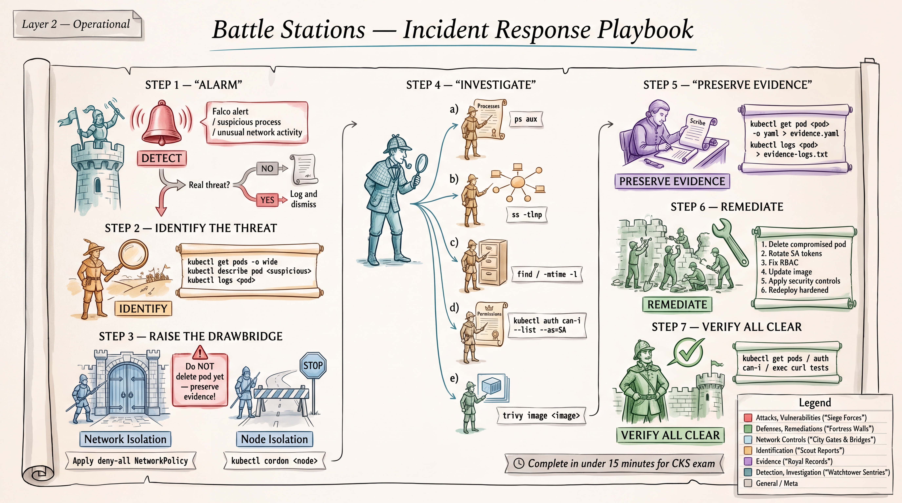

# CKS Troubleshooting Scenarios, Exercises, and Adaptive Training



## Table of Contents

- [Section 1: 40 Security Troubleshooting Scenarios](#section-1-40-security-troubleshooting-scenarios)
  - [A. RBAC Troubleshooting (Scenarios 1-8)](#a-rbac-troubleshooting-scenarios-1-8)
  - [B. Pod Security Troubleshooting (Scenarios 9-16)](#b-pod-security-troubleshooting-scenarios-9-16)
  - [C. Admission/Supply Chain Troubleshooting (Scenarios 17-24)](#c-admissionsupply-chain-troubleshooting-scenarios-17-24)
  - [D. Cluster/Infrastructure Troubleshooting (Scenarios 25-32)](#d-clusterinfrastructure-troubleshooting-scenarios-25-32)
  - [E. Secrets/Encryption Troubleshooting (Scenarios 33-40)](#e-secretsencryption-troubleshooting-scenarios-33-40)
- [Section 2: 20 Candidate-Inspired Original Exercises](#section-2-20-candidate-inspired-original-exercises)
- [Section 3: Adaptive Training Tracker](#section-3-adaptive-training-tracker)
- [Section 4: Interactive Exam Coach Protocol](#section-4-interactive-exam-coach-protocol)

---

# Section 1: 40 Security Troubleshooting Scenarios

---

## A. RBAC Troubleshooting (Scenarios 1-8)

---

### Scenario 1: ServiceAccount Can't Access Resource It Should

**Symptoms:**
A pod running in namespace `payments` with ServiceAccount `payment-processor` gets `403 Forbidden` when trying to list Secrets in its own namespace. The team confirms a Role and RoleBinding were created.

```
Error from server (Forbidden): secrets is forbidden: User "system:serviceaccount:payments:payment-processor"
cannot list resource "secrets" in API group "" in the namespace "payments"
```

**Investigation Commands:**

```bash
# Check what the SA can actually do
kubectl auth can-i list secrets --as=system:serviceaccount:payments:payment-processor -n payments

# List all roles in the namespace
kubectl get roles -n payments

# Inspect the role
kubectl get role secret-reader -n payments -o yaml

# List all rolebindings
kubectl get rolebindings -n payments

# Inspect the rolebinding
kubectl get rolebinding payment-secret-binding -n payments -o yaml

# Check SA exists
kubectl get sa payment-processor -n payments
```

**Root Cause:**
The RoleBinding references the ServiceAccount name as `payment-sa` instead of `payment-processor`. The `subjects[].name` field does not match the actual ServiceAccount name.

```yaml
# WRONG rolebinding
subjects:
- kind: ServiceAccount
  name: payment-sa          # <-- Typo! Should be payment-processor
  namespace: payments
```

**Fix:**

```bash
kubectl edit rolebinding payment-secret-binding -n payments
# Change subjects[0].name from "payment-sa" to "payment-processor"
```

Or patch it:

```bash
kubectl patch rolebinding payment-secret-binding -n payments --type='json' \
  -p='[{"op":"replace","path":"/subjects/0/name","value":"payment-processor"}]'
```

**Verification:**

```bash
kubectl auth can-i list secrets --as=system:serviceaccount:payments:payment-processor -n payments
# Expected: yes

# From inside the pod:
kubectl exec -it <pod-name> -n payments -- \
  curl -sk -H "Authorization: Bearer $(cat /var/run/secrets/kubernetes.io/serviceaccount/token)" \
  https://kubernetes.default.svc/api/v1/namespaces/payments/secrets
```

---

### Scenario 2: ServiceAccount Has Excessive Permissions

**Symptoms:**
A security audit reveals that the `monitoring-agent` ServiceAccount in the `monitoring` namespace can create Deployments, delete Pods, and exec into pods across all namespaces. The team only intended it to have read-only access to pod metrics.

```bash
$ kubectl auth can-i create deployments --as=system:serviceaccount:monitoring:monitoring-agent
yes
$ kubectl auth can-i delete pods --as=system:serviceaccount:monitoring:monitoring-agent --all-namespaces
yes
```

**Investigation Commands:**

```bash
# List all ClusterRoleBindings referencing this SA
kubectl get clusterrolebindings -o json | jq -r '
  .items[] |
  select(.subjects[]? | select(.kind=="ServiceAccount" and .name=="monitoring-agent")) |
  .metadata.name + " -> " + .roleRef.name'

# Also check namespace-scoped bindings
kubectl get rolebindings --all-namespaces -o json | jq -r '
  .items[] |
  select(.subjects[]? | select(.kind=="ServiceAccount" and .name=="monitoring-agent")) |
  .metadata.namespace + "/" + .metadata.name + " -> " + .roleRef.name'

# Inspect the overly permissive ClusterRole
kubectl get clusterrole cluster-admin -o yaml

# Check what verbs are granted
kubectl get clusterrole monitoring-role -o yaml
```

**Root Cause:**
A ClusterRoleBinding binds the `monitoring-agent` ServiceAccount to the `cluster-admin` ClusterRole instead of a minimal read-only role. This was likely a shortcut during initial setup that was never corrected.

**Fix:**

```bash
# 1. Delete the overly permissive binding
kubectl delete clusterrolebinding monitoring-admin-binding

# 2. Create a least-privilege ClusterRole
cat <<EOF | kubectl apply -f -
apiVersion: rbac.authorization.k8s.io/v1
kind: ClusterRole
metadata:
  name: monitoring-readonly
rules:
- apiGroups: [""]
  resources: ["pods"]
  verbs: ["get", "list", "watch"]
- apiGroups: ["metrics.k8s.io"]
  resources: ["pods", "nodes"]
  verbs: ["get", "list"]
EOF

# 3. Create a properly scoped ClusterRoleBinding
cat <<EOF | kubectl apply -f -
apiVersion: rbac.authorization.k8s.io/v1
kind: ClusterRoleBinding
metadata:
  name: monitoring-readonly-binding
subjects:
- kind: ServiceAccount
  name: monitoring-agent
  namespace: monitoring
roleRef:
  kind: ClusterRole
  name: monitoring-readonly
  apiGroup: rbac.authorization.k8s.io
EOF
```

**Verification:**

```bash
kubectl auth can-i create deployments --as=system:serviceaccount:monitoring:monitoring-agent
# Expected: no

kubectl auth can-i delete pods --as=system:serviceaccount:monitoring:monitoring-agent
# Expected: no

kubectl auth can-i list pods --as=system:serviceaccount:monitoring:monitoring-agent
# Expected: yes

kubectl auth can-i get pods --as=system:serviceaccount:monitoring:monitoring-agent --subresource=exec
# Expected: no
```

---

### Scenario 3: RoleBinding References Wrong ServiceAccount Namespace

**Symptoms:**
The `log-collector` ServiceAccount in namespace `logging` is supposed to read ConfigMaps in namespace `application`. A Role and RoleBinding exist in the `application` namespace, but access is denied.

```
Error from server (Forbidden): configmaps is forbidden:
User "system:serviceaccount:logging:log-collector" cannot list resource "configmaps"
in API group "" in the namespace "application"
```

**Investigation Commands:**

```bash
# Verify the SA exists in the logging namespace
kubectl get sa log-collector -n logging

# Inspect the RoleBinding in the application namespace
kubectl get rolebinding log-reader-binding -n application -o yaml

# Check the auth
kubectl auth can-i list configmaps -n application \
  --as=system:serviceaccount:logging:log-collector
```

**Root Cause:**
The RoleBinding in namespace `application` specifies `namespace: application` in the subjects instead of `namespace: logging`. When a ServiceAccount is in a different namespace than the RoleBinding, you must specify its actual namespace.

```yaml
# WRONG
subjects:
- kind: ServiceAccount
  name: log-collector
  namespace: application    # <-- Wrong! SA is in 'logging' namespace
```

**Fix:**

```bash
kubectl edit rolebinding log-reader-binding -n application
# Change subjects[0].namespace from "application" to "logging"
```

Or recreate:

```bash
cat <<EOF | kubectl apply -f -
apiVersion: rbac.authorization.k8s.io/v1
kind: RoleBinding
metadata:
  name: log-reader-binding
  namespace: application
subjects:
- kind: ServiceAccount
  name: log-collector
  namespace: logging        # <-- Correct namespace
roleRef:
  kind: Role
  name: configmap-reader
  apiGroup: rbac.authorization.k8s.io
EOF
```

**Verification:**

```bash
kubectl auth can-i list configmaps -n application \
  --as=system:serviceaccount:logging:log-collector
# Expected: yes

kubectl auth can-i get configmaps -n application \
  --as=system:serviceaccount:logging:log-collector
# Expected: yes
```

---

### Scenario 4: ClusterRoleBinding Grants Unintended Cluster-Wide Access

**Symptoms:**
A developer ServiceAccount `frontend-dev` in namespace `dev` can read Secrets in the `production` namespace. The admin only created a Role and RoleBinding in the `dev` namespace.

```bash
$ kubectl auth can-i get secrets -n production \
    --as=system:serviceaccount:dev:frontend-dev
yes    # This should NOT be yes!
```

**Investigation Commands:**

```bash
# Check for ClusterRoleBindings (the usual suspect for cluster-wide access)
kubectl get clusterrolebindings -o json | jq -r '
  .items[] |
  select(.subjects[]? | select(.name=="frontend-dev")) |
  "\(.metadata.name) -> \(.roleRef.name)"'

# Also check if there's a group binding
kubectl get clusterrolebindings -o json | jq -r '
  .items[] |
  select(.subjects[]? | select(.kind=="Group" and
    (.name=="system:serviceaccounts" or .name=="system:serviceaccounts:dev"))) |
  "\(.metadata.name) -> \(.roleRef.name)"'

# Inspect the binding
kubectl get clusterrolebinding suspicious-binding -o yaml

# Check the referenced ClusterRole
kubectl get clusterrole secret-reader-global -o yaml
```

**Root Cause:**
Someone created a ClusterRoleBinding (instead of a namespaced RoleBinding) that binds `frontend-dev` to a ClusterRole with secret-reading permissions. A ClusterRoleBinding always grants cluster-wide access, regardless of the subject's namespace.

Alternatively, a ClusterRoleBinding referencing the Group `system:serviceaccounts` (all SAs in all namespaces) grants unintended access.

**Fix:**

```bash
# Delete the ClusterRoleBinding
kubectl delete clusterrolebinding suspicious-binding

# If access is needed in dev namespace only, use a RoleBinding
cat <<EOF | kubectl apply -f -
apiVersion: rbac.authorization.k8s.io/v1
kind: RoleBinding
metadata:
  name: frontend-secret-reader
  namespace: dev              # Scoped to dev only
subjects:
- kind: ServiceAccount
  name: frontend-dev
  namespace: dev
roleRef:
  kind: ClusterRole           # Can reference a ClusterRole, but RoleBinding scopes it
  name: secret-reader-global
  apiGroup: rbac.authorization.k8s.io
EOF
```

**Verification:**

```bash
kubectl auth can-i get secrets -n production \
  --as=system:serviceaccount:dev:frontend-dev
# Expected: no

kubectl auth can-i get secrets -n dev \
  --as=system:serviceaccount:dev:frontend-dev
# Expected: yes (if still needed in dev)
```

---

### Scenario 5: User Can Escalate Privileges Through Bind Verb

**Symptoms:**
A security scan finds that user `junior-admin` can grant themselves `cluster-admin` privileges. They only have a custom admin role that was supposed to be limited.

```bash
$ kubectl auth can-i bind clusterroles --as=junior-admin
yes
$ kubectl auth can-i create clusterrolebindings --as=junior-admin
yes
```

**Investigation Commands:**

```bash
# Check what roles the user has
kubectl get clusterrolebindings -o json | jq -r '
  .items[] |
  select(.subjects[]? | select(.name=="junior-admin")) |
  "\(.metadata.name) -> \(.roleRef.name)"'

# Inspect the custom role
kubectl get clusterrole junior-admin-role -o yaml

# Check for the dangerous verbs
kubectl get clusterrole junior-admin-role -o json | jq '
  .rules[] | select(.verbs[] | contains("bind") or contains("escalate"))'
```

**Root Cause:**
The custom ClusterRole grants the `bind` verb on `clusterroles` resource, allowing the user to create RoleBindings/ClusterRoleBindings to any ClusterRole, including `cluster-admin`. The `escalate` verb may also be present.

```yaml
rules:
- apiGroups: ["rbac.authorization.k8s.io"]
  resources: ["clusterroles"]
  verbs: ["get", "list", "bind"]            # <-- 'bind' allows privilege escalation
- apiGroups: ["rbac.authorization.k8s.io"]
  resources: ["clusterrolebindings"]
  verbs: ["get", "list", "create", "delete"]  # <-- can create bindings to any role
```

**Fix:**

```bash
# Remove the bind verb from the ClusterRole
kubectl edit clusterrole junior-admin-role
```

Updated rules:

```yaml
rules:
- apiGroups: ["rbac.authorization.k8s.io"]
  resources: ["clusterroles"]
  verbs: ["get", "list"]                    # Removed "bind"
- apiGroups: ["rbac.authorization.k8s.io"]
  resources: ["clusterrolebindings"]
  verbs: ["get", "list"]                    # Removed "create", "delete"
```

If the user needs to manage specific roles, use `resourceNames` to restrict:

```yaml
rules:
- apiGroups: ["rbac.authorization.k8s.io"]
  resources: ["clusterroles"]
  verbs: ["bind"]
  resourceNames: ["view", "edit"]           # Can only bind these specific roles
```

**Verification:**

```bash
kubectl auth can-i bind clusterroles --as=junior-admin
# Expected: no

# Verify they can't create bindings to cluster-admin
kubectl auth can-i create clusterrolebindings --as=junior-admin
# Expected: no

# Try the escalation explicitly
kubectl create clusterrolebinding self-admin \
  --clusterrole=cluster-admin --user=junior-admin \
  --as=junior-admin --dry-run=server
# Expected: error
```

---

### Scenario 6: Cross-Namespace Access Denied Unexpectedly

**Symptoms:**
A CI/CD controller in namespace `cicd` needs to create Deployments in namespace `staging`. A ClusterRole and RoleBinding have been created, but access is denied.

```
Error from server (Forbidden): deployments.apps is forbidden:
User "system:serviceaccount:cicd:deployer" cannot create resource "deployments"
in API group "apps" in the namespace "staging"
```

**Investigation Commands:**

```bash
# Check RoleBinding in staging namespace
kubectl get rolebindings -n staging -o yaml

# Check if there's a ClusterRoleBinding instead
kubectl get clusterrolebindings -o json | jq -r '
  .items[] | select(.subjects[]? | select(.name=="deployer"))'

# Inspect the Role/ClusterRole
kubectl get clusterrole deployment-creator -o yaml

# Verify auth
kubectl auth can-i create deployments.apps -n staging \
  --as=system:serviceaccount:cicd:deployer
```

**Root Cause:**
The RoleBinding was created in the `cicd` namespace instead of the `staging` namespace. A RoleBinding only grants permissions in the namespace where it resides.

```bash
$ kubectl get rolebinding deploy-binding -n cicd -o yaml
# This binding is in 'cicd' namespace -- it grants access to cicd, not staging!
```

**Fix:**

```bash
# Delete the incorrectly placed RoleBinding
kubectl delete rolebinding deploy-binding -n cicd

# Create it in the correct namespace
cat <<EOF | kubectl apply -f -
apiVersion: rbac.authorization.k8s.io/v1
kind: RoleBinding
metadata:
  name: deploy-binding
  namespace: staging          # <-- Must be in the TARGET namespace
subjects:
- kind: ServiceAccount
  name: deployer
  namespace: cicd             # <-- SA lives in cicd namespace
roleRef:
  kind: ClusterRole
  name: deployment-creator
  apiGroup: rbac.authorization.k8s.io
EOF
```

**Verification:**

```bash
kubectl auth can-i create deployments.apps -n staging \
  --as=system:serviceaccount:cicd:deployer
# Expected: yes

kubectl auth can-i create deployments.apps -n production \
  --as=system:serviceaccount:cicd:deployer
# Expected: no (only staging should work)
```

---

### Scenario 7: Aggregated ClusterRole Grants Unexpected Permissions

**Symptoms:**
After installing a third-party CRD controller, the built-in `edit` ClusterRole suddenly grants access to delete PersistentVolumes. This was not the case before the installation.

```bash
$ kubectl auth can-i delete pv --as=system:serviceaccount:default:editor
yes    # This should NOT be possible with the 'edit' ClusterRole
```

**Investigation Commands:**

```bash
# Check aggregation labels on the edit ClusterRole
kubectl get clusterrole edit -o yaml | head -20

# Look for ClusterRoles with the aggregation label
kubectl get clusterroles -o json | jq -r '
  .items[] |
  select(.metadata.labels["rbac.authorization.k8s.io/aggregate-to-edit"]=="true") |
  .metadata.name'

# Inspect the newly installed role
kubectl get clusterrole storage-manager-aggregate -o yaml

# Check when it was created
kubectl get clusterrole storage-manager-aggregate -o jsonpath='{.metadata.creationTimestamp}'
```

**Root Cause:**
The third-party controller installed a ClusterRole with the label `rbac.authorization.k8s.io/aggregate-to-edit: "true"`. Kubernetes automatically merges rules from any ClusterRole with this label into the `edit` ClusterRole. The installed role includes `delete` permissions on `persistentvolumes`.

```yaml
apiVersion: rbac.authorization.k8s.io/v1
kind: ClusterRole
metadata:
  name: storage-manager-aggregate
  labels:
    rbac.authorization.k8s.io/aggregate-to-edit: "true"   # <-- auto-aggregates!
rules:
- apiGroups: [""]
  resources: ["persistentvolumes"]
  verbs: ["get", "list", "create", "delete"]               # <-- too permissive
```

**Fix:**

```bash
# Option 1: Remove the aggregation label
kubectl label clusterrole storage-manager-aggregate \
  rbac.authorization.k8s.io/aggregate-to-edit-

# Option 2: Edit the ClusterRole to reduce permissions
kubectl edit clusterrole storage-manager-aggregate
# Remove "delete" from verbs, or remove PV from resources

# Option 3: Delete and recreate without aggregation
kubectl delete clusterrole storage-manager-aggregate
cat <<EOF | kubectl apply -f -
apiVersion: rbac.authorization.k8s.io/v1
kind: ClusterRole
metadata:
  name: storage-manager-aggregate
  # No aggregation label
rules:
- apiGroups: [""]
  resources: ["persistentvolumes"]
  verbs: ["get", "list"]
EOF
```

**Verification:**

```bash
# Check the edit ClusterRole no longer has PV delete
kubectl get clusterrole edit -o yaml | grep -A5 persistentvolumes
# Should not appear or should not include "delete"

kubectl auth can-i delete pv --as=system:serviceaccount:default:editor
# Expected: no

# Verify aggregation labels
kubectl get clusterroles -l rbac.authorization.k8s.io/aggregate-to-edit=true \
  -o custom-columns=NAME:.metadata.name
```

---

### Scenario 8: Default ServiceAccount Has Too Many Permissions

**Symptoms:**
Every pod in the `web` namespace can list and read Secrets, even pods that don't need Secret access. No specific ServiceAccount is assigned to these pods, so they use the `default` SA.

```bash
# From inside any pod in the 'web' namespace:
$ curl -sk -H "Authorization: Bearer $(cat /var/run/secrets/kubernetes.io/serviceaccount/token)" \
  https://kubernetes.default.svc/api/v1/namespaces/web/secrets
# Returns list of all secrets!
```

**Investigation Commands:**

```bash
# Check bindings for the default SA
kubectl get rolebindings -n web -o json | jq -r '
  .items[] |
  select(.subjects[]? |
    select(.kind=="ServiceAccount" and .name=="default")) |
  "\(.metadata.name) -> \(.roleRef.name)"'

# Also check group-based bindings
kubectl get clusterrolebindings -o json | jq -r '
  .items[] |
  select(.subjects[]? |
    select(.kind=="Group" and .name=="system:serviceaccounts:web")) |
  "\(.metadata.name) -> \(.roleRef.name)"'

# Check if the default SA has automounted tokens
kubectl get sa default -n web -o yaml
```

**Root Cause:**
A RoleBinding in the `web` namespace grants the `default` ServiceAccount (or the group `system:serviceaccounts:web`) permissions to read Secrets. Additionally, `automountServiceAccountToken` is not disabled, so every pod gets a token.

**Fix:**

```bash
# 1. Remove the overly permissive binding
kubectl delete rolebinding default-secret-reader -n web

# 2. Disable automount on the default SA
kubectl patch sa default -n web -p '{"automountServiceAccountToken": false}'

# 3. For pods that DO need secret access, create a specific SA
cat <<EOF | kubectl apply -f -
apiVersion: v1
kind: ServiceAccount
metadata:
  name: secret-consumer
  namespace: web
automountServiceAccountToken: true
---
apiVersion: rbac.authorization.k8s.io/v1
kind: Role
metadata:
  name: specific-secret-reader
  namespace: web
rules:
- apiGroups: [""]
  resources: ["secrets"]
  verbs: ["get"]
  resourceNames: ["app-config"]    # Only specific secrets
---
apiVersion: rbac.authorization.k8s.io/v1
kind: RoleBinding
metadata:
  name: specific-secret-binding
  namespace: web
subjects:
- kind: ServiceAccount
  name: secret-consumer
  namespace: web
roleRef:
  kind: Role
  name: specific-secret-reader
  apiGroup: rbac.authorization.k8s.io
EOF
```

**Verification:**

```bash
# Default SA should no longer have secret access
kubectl auth can-i list secrets -n web --as=system:serviceaccount:web:default
# Expected: no

# New pods using default SA won't have tokens mounted
kubectl run test --image=busybox --restart=Never -n web -- sleep 3600
kubectl exec test -n web -- ls /var/run/secrets/kubernetes.io/serviceaccount/
# Expected: ls: /var/run/secrets/kubernetes.io/serviceaccount/: No such file or directory

# Clean up test pod
kubectl delete pod test -n web
```

---

## B. Pod Security Troubleshooting (Scenarios 9-16)

---

### Scenario 9: Pod Rejected by Pod Security Admission (Enforce Mode)

**Symptoms:**
A Deployment in namespace `secure-apps` fails to create pods. The ReplicaSet events show a rejection:

```
Warning  FailedCreate  replicaset/myapp-7d9f8b  pods "myapp-7d9f8b-xk2jl" is
forbidden: violates PodSecurity "restricted:latest": allowPrivilegeEscalation != false
(container "app" must set securityContext.allowPrivilegeEscalation=false),
unrestricted capabilities (container "app" must set securityContext.capabilities.drop=["ALL"]),
runAsNonRoot != true (pod or container "app" must set securityContext.runAsNonRoot=true),
seccompProfile (pod or container "app" must set securityContext.seccompProfile.type to
"RuntimeDefault" or "Localhost")
```

**Investigation Commands:**

```bash
# Check the namespace labels
kubectl get ns secure-apps --show-labels

# Check specifically the PSA labels
kubectl get ns secure-apps -o jsonpath='{.metadata.labels}' | jq .

# Check the Deployment spec
kubectl get deployment myapp -n secure-apps -o yaml | grep -A 30 securityContext

# Check ReplicaSet events
kubectl get events -n secure-apps --sort-by=.lastTimestamp | tail -20
```

**Root Cause:**
The namespace has `pod-security.kubernetes.io/enforce: restricted` label, but the Deployment's pod template does not meet the restricted security standard. The pod spec is missing required security context fields.

**Fix:**

```yaml
apiVersion: apps/v1
kind: Deployment
metadata:
  name: myapp
  namespace: secure-apps
spec:
  replicas: 1
  selector:
    matchLabels:
      app: myapp
  template:
    metadata:
      labels:
        app: myapp
    spec:
      securityContext:
        runAsNonRoot: true
        runAsUser: 1000
        runAsGroup: 1000
        fsGroup: 1000
        seccompProfile:
          type: RuntimeDefault
      containers:
      - name: app
        image: myapp:latest
        securityContext:
          allowPrivilegeEscalation: false
          capabilities:
            drop: ["ALL"]
          readOnlyRootFilesystem: true
        resources:
          requests:
            memory: "64Mi"
            cpu: "100m"
          limits:
            memory: "128Mi"
            cpu: "200m"
```

**Verification:**

```bash
# Apply and check pods come up
kubectl apply -f deployment.yaml
kubectl get pods -n secure-apps
# Expected: Running

# Dry-run test against the policy
kubectl label --dry-run=server --overwrite ns secure-apps \
  pod-security.kubernetes.io/enforce=restricted
# Should show no warnings for existing pods
```

---

### Scenario 10: Pod Warned But Allowed (Warn Mode)

**Symptoms:**
When applying a Deployment in namespace `staging`, you see warnings but pods are created:

```
Warning: would violate PodSecurity "restricted:latest": unrestricted capabilities
(container "api" must set securityContext.capabilities.drop=["ALL"])
deployment.apps/api-server created
```

The team wants to move from `warn` to `enforce` but needs to identify all non-compliant workloads first.

**Investigation Commands:**

```bash
# Check current PSA labels
kubectl get ns staging -o yaml | grep pod-security

# List all pods that would violate restricted
kubectl get pods -n staging -o json | jq -r '
  .items[] |
  select(.spec.containers[]? |
    select(.securityContext.capabilities.drop == null or
           (.securityContext.capabilities.drop | index("ALL") | not))) |
  .metadata.name'

# Dry-run to see what would be blocked
kubectl label --dry-run=server --overwrite ns staging \
  pod-security.kubernetes.io/enforce=restricted

# Check all Deployments, StatefulSets, DaemonSets for non-compliant templates
for kind in deployment statefulset daemonset; do
  echo "--- $kind ---"
  kubectl get $kind -n staging -o name
done
```

**Root Cause:**
The namespace has `warn` mode but not `enforce` mode. Pods are created despite violations. This is by design -- warn mode only generates warnings.

```yaml
labels:
  pod-security.kubernetes.io/warn: restricted
  pod-security.kubernetes.io/warn-version: latest
  # Missing: pod-security.kubernetes.io/enforce: restricted
```

**Fix:**

```bash
# Step 1: Fix all non-compliant workloads first
# (Add security contexts as shown in Scenario 9)

# Step 2: Use audit mode as intermediate step
kubectl label ns staging \
  pod-security.kubernetes.io/audit=restricted \
  pod-security.kubernetes.io/audit-version=latest \
  --overwrite

# Step 3: Check audit logs for violations
# (Violations appear in API server audit logs)

# Step 4: Once all workloads are compliant, enable enforce
kubectl label ns staging \
  pod-security.kubernetes.io/enforce=restricted \
  pod-security.kubernetes.io/enforce-version=latest \
  --overwrite
```

**Verification:**

```bash
# Verify labels
kubectl get ns staging --show-labels | grep pod-security

# Try to deploy a non-compliant pod
kubectl run test-violator --image=nginx -n staging --dry-run=server
# Expected: error (forbidden by enforce mode)

# Verify existing workloads are running
kubectl get pods -n staging
# All should be Running
```

---

### Scenario 11: Container Crashes Due to readOnlyRootFilesystem

**Symptoms:**
After applying security hardening, an Nginx container enters `CrashLoopBackOff`. The logs show:

```
nginx: [emerg] mkdir() "/var/cache/nginx/client_temp" failed (30: Read-only file system)
```

**Investigation Commands:**

```bash
# Check pod status and events
kubectl describe pod nginx-hardened -n web

# Check container logs
kubectl logs nginx-hardened -n web

# Check the security context
kubectl get pod nginx-hardened -n web -o jsonpath='{.spec.containers[0].securityContext}'

# Check volume mounts
kubectl get pod nginx-hardened -n web -o jsonpath='{.spec.containers[0].volumeMounts}' | jq .
```

**Root Cause:**
`readOnlyRootFilesystem: true` is set (good for security), but Nginx needs write access to `/var/cache/nginx`, `/var/run`, and `/tmp` for normal operation. No `emptyDir` volumes are mounted at these paths.

**Fix:**

```yaml
apiVersion: v1
kind: Pod
metadata:
  name: nginx-hardened
  namespace: web
spec:
  securityContext:
    runAsNonRoot: true
    runAsUser: 101        # nginx user
    runAsGroup: 101
    seccompProfile:
      type: RuntimeDefault
  containers:
  - name: nginx
    image: nginx:1.25
    securityContext:
      allowPrivilegeEscalation: false
      readOnlyRootFilesystem: true
      capabilities:
        drop: ["ALL"]
    volumeMounts:
    - name: cache
      mountPath: /var/cache/nginx
    - name: run
      mountPath: /var/run
    - name: tmp
      mountPath: /tmp
  volumes:
  - name: cache
    emptyDir: {}
  - name: run
    emptyDir: {}
  - name: tmp
    emptyDir: {}
```

**Verification:**

```bash
kubectl apply -f nginx-hardened.yaml
kubectl get pod nginx-hardened -n web
# Expected: Running

kubectl exec nginx-hardened -n web -- touch /test-file 2>&1
# Expected: touch: /test-file: Read-only file system (root FS is still read-only)

kubectl exec nginx-hardened -n web -- touch /tmp/test-file
# Expected: success (emptyDir is writable)

kubectl exec nginx-hardened -n web -- curl -s localhost:80
# Expected: nginx welcome page
```

---

### Scenario 12: Application Fails Because Capabilities Were Dropped

**Symptoms:**
A network diagnostic tool container crashes with:

```
Error: operation not permitted
bind: Permission denied
```

The security team mandated `capabilities.drop: ["ALL"]` on all containers.

**Investigation Commands:**

```bash
# Check pod logs
kubectl logs net-diag -n tools

# Check security context
kubectl get pod net-diag -n tools -o yaml | grep -A 10 securityContext

# Check what capabilities the container has
kubectl exec net-diag -n tools -- cat /proc/1/status | grep Cap
# If pod is crashing, check from a debug container:
kubectl debug -it net-diag -n tools --image=busybox -- cat /proc/1/status
```

**Root Cause:**
The container needs `NET_BIND_SERVICE` capability to bind to port 53 (DNS tool) and `NET_RAW` for ping/traceroute. Dropping ALL capabilities removes these. The fix is to drop ALL and then add back only the specific needed capabilities.

**Fix:**

```yaml
apiVersion: v1
kind: Pod
metadata:
  name: net-diag
  namespace: tools
spec:
  securityContext:
    runAsNonRoot: true
    runAsUser: 1000
    seccompProfile:
      type: RuntimeDefault
  containers:
  - name: net-diag
    image: network-tools:latest
    securityContext:
      allowPrivilegeEscalation: false
      capabilities:
        drop: ["ALL"]
        add: ["NET_BIND_SERVICE", "NET_RAW"]    # Add back only what's needed
      readOnlyRootFilesystem: true
```

Note: In the `restricted` Pod Security Standard, adding capabilities beyond `NET_BIND_SERVICE` is not allowed. If the namespace is enforcing `restricted`, you may need to use `baseline` or create an exemption.

**Verification:**

```bash
kubectl apply -f net-diag.yaml
kubectl get pod net-diag -n tools
# Expected: Running

# Test that the tool works
kubectl exec net-diag -n tools -- ping -c 1 8.8.8.8
# Expected: success

# Verify unnecessary caps are still dropped
kubectl exec net-diag -n tools -- cat /proc/1/status | grep CapEff
# Should show minimal capabilities
```

---

### Scenario 13: Seccomp Profile Blocks Required Syscall

**Symptoms:**
A Java application container with a custom seccomp profile fails to start:

```
Error: failed to create containerd task: OCI runtime create failed:
runc create failed: unable to start container process:
error during container init: error running hook: seccomp:
disallowed syscall: clone3
```

**Investigation Commands:**

```bash
# Check pod events
kubectl describe pod java-app -n apps

# Check the seccomp profile on the pod
kubectl get pod java-app -n apps -o jsonpath='{.spec.securityContext.seccompProfile}'

# If Localhost type, check the profile on the node
ssh node01 "cat /var/lib/kubelet/seccomp/profiles/java-restricted.json"

# Check which syscall is blocked
ssh node01 "cat /var/lib/kubelet/seccomp/profiles/java-restricted.json | jq '.syscalls'"

# Generate a list of syscalls the app needs using strace (on a dev system)
# strace -f -o /tmp/java-syscalls java -jar app.jar
```

**Root Cause:**
The custom seccomp profile uses an allowlist approach (`defaultAction: SCMP_ACT_ERRNO`) but is missing the `clone3` syscall, which modern glibc/JVM versions need for thread creation. The profile was likely created with an older runtime.

**Fix:**

Update the seccomp profile on the node:

```bash
# SSH to the node where the profile is stored
ssh node01

# Edit the profile
cat > /var/lib/kubelet/seccomp/profiles/java-restricted.json << 'SECCOMP'
{
  "defaultAction": "SCMP_ACT_ERRNO",
  "architectures": ["SCMP_ARCH_X86_64"],
  "syscalls": [
    {
      "names": [
        "accept", "accept4", "access", "arch_prctl", "bind", "brk",
        "capget", "capset", "chdir", "clone", "clone3", "close",
        "connect", "dup", "dup2", "dup3", "epoll_create", "epoll_create1",
        "epoll_ctl", "epoll_wait", "epoll_pwait", "eventfd2", "execve",
        "exit", "exit_group", "faccessat", "faccessat2", "fadvise64",
        "fallocate", "fchmod", "fchmodat", "fchown", "fchownat",
        "fcntl", "fdatasync", "flock", "fork", "fstat", "fstatfs",
        "fsync", "ftruncate", "futex", "getcwd", "getdents64",
        "getegid", "geteuid", "getgid", "getgroups", "getpeername",
        "getpgrp", "getpid", "getppid", "getpriority", "getrandom",
        "getresgid", "getresuid", "getrlimit", "getrusage",
        "getsockname", "getsockopt", "gettid", "gettimeofday",
        "getuid", "ioctl", "kill", "lchown", "lgetxattr", "link",
        "listen", "lseek", "lstat", "madvise", "membarrier",
        "memfd_create", "mincore", "mkdir", "mkdirat", "mlock",
        "mmap", "mprotect", "mremap", "msgctl", "msgget", "msync",
        "munlock", "munmap", "nanosleep", "newfstatat", "open",
        "openat", "pipe", "pipe2", "poll", "ppoll", "prctl",
        "pread64", "preadv", "prlimit64", "pwrite64", "pwritev",
        "read", "readlink", "readlinkat", "readv", "recvfrom",
        "recvmsg", "rename", "renameat", "renameat2", "restart_syscall",
        "rmdir", "rseq", "rt_sigaction", "rt_sigpending",
        "rt_sigprocmask", "rt_sigreturn", "rt_sigsuspend",
        "rt_sigtimedwait", "sched_getaffinity", "sched_getparam",
        "sched_getscheduler", "sched_setaffinity", "sched_yield",
        "seccomp", "select", "semctl", "semget", "semop",
        "sendfile", "sendmsg", "sendto", "set_robust_list",
        "set_tid_address", "setgid", "setgroups", "setitimer",
        "setpgid", "setpriority", "setresgid", "setresuid",
        "setsid", "setsockopt", "setuid", "shmat", "shmctl",
        "shmdt", "shmget", "shutdown", "sigaltstack", "socket",
        "socketpair", "splice", "stat", "statfs", "statx",
        "symlink", "symlinkat", "sysinfo", "tgkill", "time",
        "timer_create", "timer_delete", "timer_settime",
        "timerfd_create", "timerfd_settime", "tkill", "truncate",
        "umask", "uname", "unlink", "unlinkat", "utimensat",
        "vfork", "wait4", "waitid", "write", "writev"
      ],
      "action": "SCMP_ACT_ALLOW"
    }
  ]
}
SECCOMP
```

Alternatively, use `RuntimeDefault` which handles most cases:

```yaml
securityContext:
  seccompProfile:
    type: RuntimeDefault    # Simpler, covers most apps
```

**Verification:**

```bash
# Restart the pod to pick up the updated profile
kubectl delete pod java-app -n apps
# Wait for Deployment controller to recreate

kubectl get pod -l app=java-app -n apps
# Expected: Running

kubectl logs -l app=java-app -n apps
# Should show normal JVM startup
```

---

### Scenario 14: AppArmor Profile Too Restrictive

**Symptoms:**
A pod annotated with a custom AppArmor profile is in `CrashLoopBackOff`. Container logs show:

```
/usr/bin/python3: error while loading shared libraries: libpython3.10.so.1.0:
cannot open shared object file: Permission denied
```

**Investigation Commands:**

```bash
# Check pod annotations for AppArmor
kubectl get pod python-app -n apps -o jsonpath='{.metadata.annotations}' | jq .

# Check pod events
kubectl describe pod python-app -n apps

# SSH to the node and check the AppArmor profile
ssh node01 "aa-status | grep python"

# View the profile
ssh node01 "cat /etc/apparmor.d/python-restricted"

# Check AppArmor logs for denials
ssh node01 "dmesg | grep DENIED | tail -20"
# or
ssh node01 "journalctl -k | grep DENIED | tail -20"
```

**Root Cause:**
The custom AppArmor profile does not allow read access to `/usr/lib/` where shared libraries reside. The profile's file rules are too narrow.

```
# Too restrictive profile snippet:
/usr/bin/python3 mr,
/app/** rw,
# Missing: /usr/lib/** mr,
# Missing: /lib/** mr,
```

**Fix:**

```bash
# SSH to the node
ssh node01

# Edit the AppArmor profile
cat > /etc/apparmor.d/python-restricted << 'APPARMOR'
#include <tunables/global>

profile python-restricted flags=(attach_disconnected) {
  #include <abstractions/base>
  #include <abstractions/python>
  #include <abstractions/nameservice>

  # Python binary
  /usr/bin/python3* mr,
  /usr/lib/python3*/** mr,
  /usr/lib/x86_64-linux-gnu/** mr,
  /lib/x86_64-linux-gnu/** mr,

  # Application directory
  /app/** rw,

  # Temp files
  /tmp/** rw,

  # Deny network raw (no ping)
  deny network raw,

  # Deny mount
  deny mount,

  # Deny ptrace
  deny ptrace,
}
APPARMOR

# Reload the profile
apparmor_parser -r /etc/apparmor.d/python-restricted
```

**Verification:**

```bash
# Restart the pod
kubectl delete pod python-app -n apps

kubectl get pod python-app -n apps
# Expected: Running

# Verify AppArmor is enforced
kubectl exec python-app -n apps -- cat /proc/1/attr/current
# Expected: python-restricted (enforce)

# Verify denied operations still blocked
kubectl exec python-app -n apps -- ping -c 1 8.8.8.8
# Expected: Operation not permitted

# Check no more DENIED logs for legitimate operations
ssh node01 "dmesg | grep DENIED | grep python-restricted | tail -5"
```

---

### Scenario 15: Init Container Needs Different Security Context Than Main Container

**Symptoms:**
A pod has an init container that downloads TLS certificates and writes them to a shared volume. After hardening, the init container fails because it runs as non-root and cannot write to `/etc/ssl/custom/`.

```
Init container "cert-downloader" failed:
mkdir: can't create directory '/etc/ssl/custom/': Permission denied
```

**Investigation Commands:**

```bash
# Check pod status
kubectl describe pod secure-app -n apps

# Check init container logs
kubectl logs secure-app -n apps -c cert-downloader

# Check security contexts for both containers
kubectl get pod secure-app -n apps -o yaml | \
  grep -A 15 'initContainers\|containers' | grep -A 10 securityContext

# Check volume mount permissions
kubectl get pod secure-app -n apps -o jsonpath='{.spec.volumes}' | jq .
```

**Root Cause:**
The pod-level `securityContext` sets `runAsUser: 1000` and `fsGroup: 1000`, which also applies to the init container. The shared volume is created with `fsGroup` ownership, but the init container tries to write to a path outside the volume mount. Additionally, `readOnlyRootFilesystem: true` at the pod level prevents writing.

**Fix:**

```yaml
apiVersion: v1
kind: Pod
metadata:
  name: secure-app
  namespace: apps
spec:
  securityContext:
    runAsNonRoot: true
    fsGroup: 1000
    seccompProfile:
      type: RuntimeDefault
  initContainers:
  - name: cert-downloader
    image: curlimages/curl:latest
    command: ["/bin/sh", "-c"]
    args:
    - |
      curl -o /certs/tls.crt https://vault.internal/cert
      curl -o /certs/tls.key https://vault.internal/key
      chmod 400 /certs/tls.key
    securityContext:
      runAsUser: 1000           # Non-root
      allowPrivilegeEscalation: false
      readOnlyRootFilesystem: true
      capabilities:
        drop: ["ALL"]
    volumeMounts:
    - name: certs
      mountPath: /certs          # Write certs HERE, not /etc/ssl
    - name: tmp
      mountPath: /tmp
  containers:
  - name: app
    image: myapp:latest
    securityContext:
      runAsUser: 1000
      allowPrivilegeEscalation: false
      readOnlyRootFilesystem: true
      capabilities:
        drop: ["ALL"]
    volumeMounts:
    - name: certs
      mountPath: /etc/ssl/custom
      readOnly: true             # Main container only reads certs
    - name: tmp
      mountPath: /tmp
  volumes:
  - name: certs
    emptyDir:
      medium: Memory             # Keep certs in memory (more secure)
      sizeLimit: 10Mi
  - name: tmp
    emptyDir: {}
```

**Verification:**

```bash
kubectl apply -f secure-app.yaml
kubectl get pod secure-app -n apps
# Expected: Running (init container succeeded, main container running)

# Verify certs are mounted in main container
kubectl exec secure-app -n apps -- ls -la /etc/ssl/custom/
# Expected: tls.crt and tls.key present

# Verify main container can't write to cert directory
kubectl exec secure-app -n apps -- touch /etc/ssl/custom/test
# Expected: Read-only file system
```

---

### Scenario 16: Pod Can't Write to Mounted Volume Due to fsGroup

**Symptoms:**
A PostgreSQL pod fails to start with:

```
initdb: error: could not change permissions of directory "/var/lib/postgresql/data": Operation not permitted
```

The pod runs as non-root (UID 999 for postgres) with a PersistentVolume.

**Investigation Commands:**

```bash
# Check pod events
kubectl describe pod postgres -n db

# Check pod security context
kubectl get pod postgres -n db -o yaml | grep -A 10 securityContext

# Check the PV/PVC
kubectl get pvc postgres-data -n db -o yaml
kubectl get pv -o yaml | grep -A 5 'claimRef.*postgres'

# If pod starts momentarily, check permissions
kubectl exec postgres -n db -- ls -la /var/lib/postgresql/
# Or from a debug container
kubectl debug -it postgres -n db --image=busybox -- ls -la /var/lib/postgresql/
```

**Root Cause:**
The pod sets `runAsUser: 999` (postgres user) but does not set `fsGroup: 999`. Without `fsGroup`, the mounted PersistentVolume is owned by root, and UID 999 cannot change its permissions. Some storage drivers need `fsGroup` to set proper GID on the mounted filesystem.

```yaml
# Missing fsGroup
securityContext:
  runAsUser: 999
  runAsNonRoot: true
  # fsGroup: 999   <-- MISSING
```

**Fix:**

```yaml
apiVersion: v1
kind: Pod
metadata:
  name: postgres
  namespace: db
spec:
  securityContext:
    runAsUser: 999
    runAsGroup: 999
    fsGroup: 999                # <-- Ensures volume is group-writable by GID 999
    seccompProfile:
      type: RuntimeDefault
  containers:
  - name: postgres
    image: postgres:15
    securityContext:
      allowPrivilegeEscalation: false
      capabilities:
        drop: ["ALL"]
    env:
    - name: PGDATA
      value: /var/lib/postgresql/data/pgdata
    volumeMounts:
    - name: data
      mountPath: /var/lib/postgresql/data
  volumes:
  - name: data
    persistentVolumeClaim:
      claimName: postgres-data
```

**Verification:**

```bash
kubectl apply -f postgres.yaml
kubectl get pod postgres -n db
# Expected: Running

# Check volume permissions
kubectl exec postgres -n db -- ls -la /var/lib/postgresql/data/
# Expected: drwx--S--- owned by 999:999

# Verify postgres is running
kubectl exec postgres -n db -- pg_isready
# Expected: accepting connections
```

---

## C. Admission/Supply Chain Troubleshooting (Scenarios 17-24)

---

### Scenario 17: Image Rejected by Admission Webhook

**Symptoms:**
Deploying a pod fails with a message from an admission webhook:

```
Error from server: admission webhook "validate-image.security.io" denied the request:
image "docker.io/myapp:latest" is not from an allowed registry.
Allowed registries: [registry.internal.io, gcr.io/company-project]
```

**Investigation Commands:**

```bash
# List ValidatingWebhookConfigurations
kubectl get validatingwebhookconfigurations

# Inspect the webhook config
kubectl get validatingwebhookconfigurations image-validator -o yaml

# Check the webhook service/endpoint
kubectl get svc -n security-system image-validator-svc -o yaml
kubectl get endpoints -n security-system image-validator-svc

# Check the webhook's configuration (if it's a ConfigMap-based policy)
kubectl get configmap image-policy -n security-system -o yaml

# Try with an allowed registry
kubectl run test --image=registry.internal.io/myapp:v1.0 --dry-run=server
```

**Root Cause:**
An admission webhook is configured to only allow images from approved registries. The Deployment uses `docker.io/myapp:latest`, which is not on the allowlist.

**Fix:**

```bash
# Option 1: Use an approved registry (preferred)
# Push the image to the internal registry
docker pull myapp:latest
docker tag myapp:latest registry.internal.io/myapp:v1.0
docker push registry.internal.io/myapp:v1.0

# Update the Deployment
kubectl set image deployment/myapp app=registry.internal.io/myapp:v1.0 -n apps

# Option 2: Add the registry to the allowlist (if policy allows)
kubectl edit configmap image-policy -n security-system
# Add "docker.io" to the allowed registries list (if appropriate)
```

**Verification:**

```bash
kubectl get pods -n apps
# Expected: Running

# Verify the image source
kubectl get pod -l app=myapp -n apps -o jsonpath='{.items[0].spec.containers[0].image}'
# Expected: registry.internal.io/myapp:v1.0

# Test that disallowed registries are still blocked
kubectl run test --image=quay.io/random:latest -n apps --dry-run=server
# Expected: denied by webhook
```

---

### Scenario 18: ValidatingAdmissionPolicy Blocks Valid Deployment

**Symptoms:**
After upgrading to Kubernetes 1.30, a new `ValidatingAdmissionPolicy` blocks all Deployments in the `production` namespace, even those that are compliant:

```
Error from server (Forbidden): admission webhook denied: ValidatingAdmissionPolicy
'require-labels' with binding 'require-labels-production' denied request:
failed expression: has(object.metadata.labels.team) && has(object.metadata.labels.cost-center)
```

The Deployment has both labels but uses hyphens in label keys.

**Investigation Commands:**

```bash
# Check the policy
kubectl get validatingadmissionpolicy require-labels -o yaml

# Check the binding
kubectl get validatingadmissionpolicybinding require-labels-production -o yaml

# Check the Deployment labels
kubectl get deployment compliant-app -n production -o jsonpath='{.metadata.labels}' | jq .

# Test the CEL expression manually
# The issue is in how CEL accesses hyphenated keys
```

**Root Cause:**
The CEL expression uses dot notation (`object.metadata.labels.cost-center`) which fails for label keys containing hyphens. CEL interprets `cost-center` as `cost` minus `center`. The bracket notation must be used for hyphenated keys.

```yaml
# WRONG CEL expression
validations:
- expression: "has(object.metadata.labels.team) && has(object.metadata.labels.cost-center)"
  # cost-center is interpreted as subtraction!
```

**Fix:**

```bash
kubectl edit validatingadmissionpolicy require-labels
```

```yaml
spec:
  validations:
  - expression: >-
      has(object.metadata.labels.team) &&
      has(object.metadata.labels["cost-center"])
    message: "Deployments must have 'team' and 'cost-center' labels"
  matchConstraints:
    resourceRules:
    - apiGroups: ["apps"]
      apiVersions: ["v1"]
      operations: ["CREATE", "UPDATE"]
      resources: ["deployments"]
```

**Verification:**

```bash
# Re-apply the Deployment
kubectl apply -f compliant-app.yaml -n production
# Expected: created/configured successfully

# Test without labels (should still be blocked)
kubectl create deployment test --image=nginx -n production --dry-run=server
# Expected: denied (missing labels)

# Test with labels
kubectl create deployment test --image=nginx -n production \
  --dry-run=server -o yaml | \
  kubectl label --local -f - team=platform cost-center=eng-123 -o yaml | \
  kubectl apply --dry-run=server -f -
# Expected: success
```

---

### Scenario 19: Trivy Scan Shows Critical CVE But Image Must Be Used

**Symptoms:**
A Trivy scan on a required base image shows a critical CVE:

```bash
$ trivy image registry.internal.io/base-python:3.11
...
Total: 1 (CRITICAL: 1)
+-----------+------------------+----------+-------------------+---------------+
| Library   | Vulnerability    | Severity | Installed Version | Fixed Version |
+-----------+------------------+----------+-------------------+---------------+
| libexpat  | CVE-2024-XXXXX   | CRITICAL | 2.5.0-1           | 2.5.0-1+deb12u1|
+-----------+------------------+----------+-------------------+---------------+
```

The admission webhook rejects images with critical CVEs, but the application needs this base image.

**Investigation Commands:**

```bash
# Get full Trivy report
trivy image --severity CRITICAL registry.internal.io/base-python:3.11

# Check if a patched version exists
trivy image registry.internal.io/base-python:3.11-patched 2>/dev/null

# Check if the CVE is exploitable in our context
trivy image --ignore-unfixed registry.internal.io/base-python:3.11

# Check the admission policy
kubectl get configmap trivy-policy -n security-system -o yaml
```

**Root Cause:**
The base image has an outdated system library with a known CVE. The fixed version is available from the upstream distro but the image hasn't been rebuilt.

**Fix:**

```dockerfile
# Option 1: Update the base image (preferred)
FROM python:3.11-slim-bookworm

# Update the specific vulnerable package
RUN apt-get update && \
    apt-get install -y --only-upgrade libexpat1 && \
    apt-get clean && rm -rf /var/lib/apt/lists/*

COPY . /app
WORKDIR /app
RUN pip install --no-cache-dir -r requirements.txt

USER 1000
ENTRYPOINT ["python", "app.py"]
```

```bash
# Rebuild and push
docker build -t registry.internal.io/base-python:3.11-patched .
docker push registry.internal.io/base-python:3.11-patched

# Verify the CVE is fixed
trivy image --severity CRITICAL registry.internal.io/base-python:3.11-patched
# Expected: 0 critical vulnerabilities
```

```bash
# Option 2: If you must accept the risk temporarily, use .trivyignore
echo "CVE-2024-XXXXX" > .trivyignore
trivy image --ignorefile .trivyignore registry.internal.io/base-python:3.11
# Document the risk acceptance and set a remediation deadline
```

**Verification:**

```bash
# Scan the patched image
trivy image --severity CRITICAL,HIGH registry.internal.io/base-python:3.11-patched
# Expected: 0 vulnerabilities (or at least no critical)

# Deploy with the patched image
kubectl set image deployment/python-app app=registry.internal.io/base-python:3.11-patched
kubectl rollout status deployment/python-app
# Expected: successfully rolled out
```

---

### Scenario 20: ImagePolicyWebhook Configuration Error

**Symptoms:**
After enabling the `ImagePolicyWebhook` admission controller, no pods can be created in the cluster:

```
Error from server (Forbidden): pods is forbidden:
Post "https://image-review.security.svc:8443/review": dial tcp: lookup
image-review.security.svc on 10.96.0.10:53: no such host
```

**Investigation Commands:**

```bash
# Check API server admission plugins
ssh controlplane "cat /etc/kubernetes/manifests/kube-apiserver.yaml | grep enable-admission"

# Check the admission config file
ssh controlplane "cat /etc/kubernetes/admission/admission-config.yaml"

# Check the ImagePolicyWebhook config
ssh controlplane "cat /etc/kubernetes/admission/image-policy-config.yaml"

# Check the kubeconfig referenced by the webhook
ssh controlplane "cat /etc/kubernetes/admission/image-review-kubeconfig.yaml"

# Check if the webhook service exists
kubectl get svc image-review -n security

# Check DNS resolution
kubectl run test-dns --image=busybox --restart=Never -- nslookup image-review.security.svc
kubectl logs test-dns
```

**Root Cause:**
The `ImagePolicyWebhook` kubeconfig references the wrong service DNS name. The service is in namespace `security` but the kubeconfig uses `image-review.security.svc` (missing `.cluster.local`), or the service itself doesn't exist or is in a different namespace.

Additionally, `defaultAllow: false` is set, meaning all images are denied if the webhook is unreachable.

**Fix:**

```bash
ssh controlplane

# Fix the kubeconfig for the webhook
cat > /etc/kubernetes/admission/image-review-kubeconfig.yaml << 'EOF'
apiVersion: v1
kind: Config
clusters:
- name: image-review
  cluster:
    certificate-authority: /etc/kubernetes/admission/webhook-ca.crt
    server: https://image-review.security.svc.cluster.local:8443/review
contexts:
- context:
    cluster: image-review
    user: image-review
  name: image-review
current-context: image-review
users:
- name: image-review
  user:
    client-certificate: /etc/kubernetes/admission/webhook-client.crt
    client-key: /etc/kubernetes/admission/webhook-client.key
EOF

# Set defaultAllow to true (fail-open) while fixing
cat > /etc/kubernetes/admission/image-policy-config.yaml << 'EOF'
imagePolicy:
  kubeConfigFile: /etc/kubernetes/admission/image-review-kubeconfig.yaml
  allowTTL: 50
  denyTTL: 50
  retryBackoff: 500
  defaultAllow: true    # Fail-open while debugging; set to false in production
EOF
```

Then ensure the webhook service exists:

```bash
# Verify the service and pod are running
kubectl get svc image-review -n security
kubectl get pods -n security -l app=image-review
```

**Verification:**

```bash
# API server should restart automatically (it's a static pod)
# Wait for it to come back
kubectl get nodes
# Expected: Ready

# Test image deployment
kubectl run test --image=nginx --dry-run=server
# Expected: allowed (or denied by policy, not by connectivity error)

# Check webhook logs
kubectl logs -l app=image-review -n security
# Should show review requests being processed
```

---

### Scenario 21: Admission Controller Not Enabled

**Symptoms:**
You've created a `PodSecurityPolicy` (legacy) or configured `PodSecurity` namespace labels, but pods are not being restricted. Any pod spec is accepted regardless of security violations.

```bash
$ kubectl run privileged-test --image=nginx --overrides='
{"spec":{"containers":[{"name":"nginx","image":"nginx",
"securityContext":{"privileged":true}}]}}'
pod/privileged-test created    # Should have been denied!
```

**Investigation Commands:**

```bash
# Check which admission controllers are enabled
ssh controlplane "cat /etc/kubernetes/manifests/kube-apiserver.yaml" | \
  grep -i admission

# Check for PodSecurity labels on namespaces
kubectl get ns default --show-labels | grep pod-security

# Check API server logs for admission-related messages
ssh controlplane "crictl logs $(crictl ps --name kube-apiserver -q) 2>&1 | grep -i admission | tail -10"
```

**Root Cause:**
The `PodSecurity` admission controller is not listed in `--enable-admission-plugins`. Or the admission plugin list was overridden and `PodSecurity` was accidentally excluded.

```yaml
# Missing PodSecurity from the list
- --enable-admission-plugins=NodeRestriction,MutatingAdmissionWebhook,ValidatingAdmissionWebhook
```

**Fix:**

```bash
ssh controlplane

# Edit the API server manifest
vi /etc/kubernetes/manifests/kube-apiserver.yaml
```

Add `PodSecurity` to the admission plugins:

```yaml
- --enable-admission-plugins=NodeRestriction,PodSecurity,MutatingAdmissionWebhook,ValidatingAdmissionWebhook
```

Wait for the API server to restart:

```bash
# The kubelet will detect the manifest change and restart the API server
# Wait and verify
watch crictl ps --name kube-apiserver
```

Then label the namespace:

```bash
kubectl label ns default \
  pod-security.kubernetes.io/enforce=baseline \
  pod-security.kubernetes.io/warn=restricted
```

**Verification:**

```bash
# Check admission plugins
kubectl -n kube-system describe pod kube-apiserver-controlplane | grep admission

# Test that privileged pods are now blocked
kubectl run privileged-test --image=nginx --overrides='
{"spec":{"containers":[{"name":"nginx","image":"nginx",
"securityContext":{"privileged":true}}]}}' --dry-run=server
# Expected: denied by PodSecurity
```

---

### Scenario 22: Webhook Certificate Expired

**Symptoms:**
All Deployments in the cluster are failing. Even system components can't create pods:

```
Internal error occurred: failed calling webhook "validate.security.io":
Post "https://webhook.security.svc:443/validate": x509: certificate has expired
or is not yet valid: current time 2026-08-15T10:00:00Z is after 2026-07-01T00:00:00Z
```

**Investigation Commands:**

```bash
# Check the webhook configuration
kubectl get validatingwebhookconfigurations -o yaml | grep -A 5 'caBundle\|name:'

# Decode and check the CA bundle expiry
kubectl get validatingwebhookconfigurations image-validation -o jsonpath='{.webhooks[0].clientConfig.caBundle}' | \
  base64 -d | openssl x509 -noout -dates

# Check the webhook server's TLS certificate
kubectl get secret webhook-tls -n security -o jsonpath='{.data.tls\.crt}' | \
  base64 -d | openssl x509 -noout -dates -subject

# Check when it expired
kubectl get secret webhook-tls -n security -o jsonpath='{.data.tls\.crt}' | \
  base64 -d | openssl x509 -noout -enddate
```

**Root Cause:**
The TLS certificate for the webhook server expired. The `caBundle` in the webhook configuration or the server certificate (or both) are past their validity period.

**Fix:**

```bash
# Step 1: Set failurePolicy to Ignore temporarily (emergency)
kubectl patch validatingwebhookconfiguration image-validation \
  --type='json' -p='[{"op":"replace","path":"/webhooks/0/failurePolicy","value":"Ignore"}]'

# Step 2: Generate new certificates
# Generate CA key and cert
openssl req -x509 -newkey rsa:4096 -keyout ca.key -out ca.crt \
  -days 365 -nodes -subj "/CN=webhook-ca"

# Generate server key and CSR
openssl req -newkey rsa:4096 -keyout tls.key -out tls.csr -nodes \
  -subj "/CN=webhook.security.svc" \
  -addext "subjectAltName=DNS:webhook.security.svc,DNS:webhook.security.svc.cluster.local"

# Sign the server cert
openssl x509 -req -in tls.csr -CA ca.crt -CAkey ca.key -CAcreateserial \
  -out tls.crt -days 365 -extfile <(echo "subjectAltName=DNS:webhook.security.svc,DNS:webhook.security.svc.cluster.local")

# Step 3: Update the secret
kubectl create secret tls webhook-tls -n security \
  --cert=tls.crt --key=tls.key --dry-run=client -o yaml | kubectl apply -f -

# Step 4: Update the CA bundle in the webhook config
CA_BUNDLE=$(cat ca.crt | base64 -w 0)
kubectl patch validatingwebhookconfiguration image-validation \
  --type='json' -p="[{\"op\":\"replace\",\"path\":\"/webhooks/0/clientConfig/caBundle\",\"value\":\"${CA_BUNDLE}\"}]"

# Step 5: Restart the webhook pod to pick up new certs
kubectl rollout restart deployment webhook-server -n security

# Step 6: Restore failurePolicy
kubectl patch validatingwebhookconfiguration image-validation \
  --type='json' -p='[{"op":"replace","path":"/webhooks/0/failurePolicy","value":"Fail"}]'
```

**Verification:**

```bash
# Test creating a pod
kubectl run test --image=nginx --dry-run=server
# Expected: success (or denied by policy, but NOT a TLS error)

# Check webhook logs
kubectl logs -l app=webhook-server -n security | tail -5
# Should show successful TLS handshakes

# Verify new cert dates
kubectl get secret webhook-tls -n security -o jsonpath='{.data.tls\.crt}' | \
  base64 -d | openssl x509 -noout -dates
# Expected: notAfter is ~1 year from now
```

---

### Scenario 23: Mutating Webhook Modifying Resources Unexpectedly

**Symptoms:**
Pods are being created with unexpected fields. A `SecurityContext` is being injected into all pods, including ones in `kube-system`. This causes some system pods to fail because `runAsNonRoot: true` is incompatible with certain system containers.

```bash
$ kubectl get pod kube-proxy-xxxxx -n kube-system -o yaml | grep -A 5 securityContext
    securityContext:
      runAsNonRoot: true    # This was injected! kube-proxy needs root
```

**Investigation Commands:**

```bash
# List MutatingWebhookConfigurations
kubectl get mutatingwebhookconfigurations

# Inspect the webhook
kubectl get mutatingwebhookconfiguration security-injector -o yaml

# Check namespace selectors
kubectl get mutatingwebhookconfiguration security-injector -o json | \
  jq '.webhooks[0].namespaceSelector'

# Check object selectors
kubectl get mutatingwebhookconfiguration security-injector -o json | \
  jq '.webhooks[0].objectSelector'

# Verify it's matching kube-system
kubectl get ns kube-system --show-labels
```

**Root Cause:**
The `MutatingWebhookConfiguration` does not have a `namespaceSelector` to exclude system namespaces. It matches ALL namespaces including `kube-system`.

**Fix:**

```bash
kubectl edit mutatingwebhookconfiguration security-injector
```

Add namespace exclusions:

```yaml
webhooks:
- name: inject-security.example.com
  namespaceSelector:
    matchExpressions:
    - key: kubernetes.io/metadata.name
      operator: NotIn
      values:
      - kube-system
      - kube-public
      - kube-node-lease
    - key: pod-security.kubernetes.io/enforce     # Only match labeled namespaces
      operator: Exists
  rules:
  - apiGroups: [""]
    apiVersions: ["v1"]
    operations: ["CREATE"]
    resources: ["pods"]
    scope: Namespaced
  failurePolicy: Fail
  sideEffects: None
```

Then fix the affected system pods:

```bash
# Restart affected system pods to remove injected context
kubectl rollout restart daemonset kube-proxy -n kube-system
```

**Verification:**

```bash
# Check kube-system pods recover
kubectl get pods -n kube-system
# Expected: all Running

# Verify the webhook still works for user namespaces
kubectl label ns test-ns pod-security.kubernetes.io/enforce=restricted
kubectl run test --image=nginx -n test-ns -o yaml --dry-run=server | grep -A 5 securityContext
# Expected: security context injected

# Verify kube-system is excluded
kubectl run test --image=nginx -n kube-system -o yaml --dry-run=server | grep -A 5 securityContext
# Expected: no injected security context (only defaults)
```

---

### Scenario 24: Registry Authentication Failure

**Symptoms:**
Pods fail with `ImagePullBackOff`:

```
Failed to pull image "registry.internal.io/myapp:v1.0": rpc error: code = Unknown
desc = failed to pull and unpack image "registry.internal.io/myapp:v1.0":
failed to resolve reference "registry.internal.io/myapp:v1.0":
unexpected status code [https://registry.internal.io/v2/myapp/manifests/v1.0]: 401 Unauthorized
```

**Investigation Commands:**

```bash
# Check pod events
kubectl describe pod myapp -n apps | grep -A 5 Events

# Check if imagePullSecrets is set on the pod
kubectl get pod myapp -n apps -o jsonpath='{.spec.imagePullSecrets}'

# Check if the secret exists
kubectl get secrets -n apps | grep registry

# If the secret exists, verify it's valid
kubectl get secret registry-creds -n apps -o jsonpath='{.data.\.dockerconfigjson}' | base64 -d | jq .

# Check the ServiceAccount for default pull secrets
kubectl get sa default -n apps -o yaml | grep -A 3 imagePullSecrets

# Test authentication manually
kubectl run auth-test --image=registry.internal.io/myapp:v1.0 -n apps \
  --overrides='{"spec":{"imagePullSecrets":[{"name":"registry-creds"}]}}' --dry-run=server
```

**Root Cause:**
Multiple possible causes:
1. The `imagePullSecrets` field is not set on the pod spec
2. The Docker config secret exists but credentials are expired/rotated
3. The secret is in a different namespace
4. The ServiceAccount doesn't have the secret attached

**Fix:**

```bash
# 1. Create or update the registry secret
kubectl create secret docker-registry registry-creds \
  -n apps \
  --docker-server=registry.internal.io \
  --docker-username=robot-user \
  --docker-password='NEW_TOKEN_HERE' \
  --dry-run=client -o yaml | kubectl apply -f -

# 2. Attach it to the default ServiceAccount (affects all pods)
kubectl patch sa default -n apps -p '{"imagePullSecrets": [{"name": "registry-creds"}]}'

# 3. Or specify it in the pod spec directly
kubectl patch deployment myapp -n apps --type='json' \
  -p='[{"op":"add","path":"/spec/template/spec/imagePullSecrets","value":[{"name":"registry-creds"}]}]'
```

**Verification:**

```bash
# Restart the pod
kubectl rollout restart deployment myapp -n apps
kubectl rollout status deployment myapp -n apps
# Expected: successfully rolled out

# Check pod is running
kubectl get pods -n apps -l app=myapp
# Expected: Running

# Verify the secret is mounted
kubectl get pod -l app=myapp -n apps -o jsonpath='{.items[0].spec.imagePullSecrets}'
# Expected: [{"name":"registry-creds"}]
```

---

## D. Cluster/Infrastructure Troubleshooting (Scenarios 25-32)

---

### Scenario 25: API Server Won't Start After Audit Policy Change

**Symptoms:**
After modifying the audit policy, the API server pod is not running. The node shows `NotReady` and no kubectl commands work.

```bash
$ kubectl get nodes
The connection to the server 192.168.1.10:6443 was refused - did you specify the right host or port?
```

**Investigation Commands:**

```bash
# SSH to the control plane node
ssh controlplane

# Check API server container directly
crictl ps -a --name kube-apiserver

# Check API server container logs
crictl logs $(crictl ps -a --name kube-apiserver -q | head -1) 2>&1 | tail -20

# Check static pod manifest
cat /etc/kubernetes/manifests/kube-apiserver.yaml

# Check the audit policy file exists where the manifest references it
ls -la /etc/kubernetes/audit/

# Check the volume mounts in the manifest
grep -A 20 'volumeMounts' /etc/kubernetes/manifests/kube-apiserver.yaml
grep -A 20 'volumes:' /etc/kubernetes/manifests/kube-apiserver.yaml

# Check kubelet logs
journalctl -u kubelet | tail -30
```

**Root Cause:**
The API server manifest references the audit policy file via a `hostPath` volume, but either:
1. The `volumeMount` was added without the corresponding `volume` definition
2. The path in the `volume` definition doesn't match the actual file location
3. The audit log path volume mount is missing

```yaml
# API server flags reference audit policy:
- --audit-policy-file=/etc/kubernetes/audit/policy.yaml
- --audit-log-path=/var/log/kubernetes/audit/audit.log

# But volumes section is missing the hostPath mounts
```

**Fix:**

```bash
ssh controlplane

vi /etc/kubernetes/manifests/kube-apiserver.yaml
```

Ensure both the volume mounts and volumes are present:

```yaml
spec:
  containers:
  - command:
    - kube-apiserver
    - --audit-policy-file=/etc/kubernetes/audit/policy.yaml
    - --audit-log-path=/var/log/kubernetes/audit/audit.log
    - --audit-log-maxage=30
    - --audit-log-maxbackup=10
    - --audit-log-maxsize=100
    # ... other flags
    volumeMounts:
    # ... existing mounts
    - mountPath: /etc/kubernetes/audit
      name: audit-policy
      readOnly: true
    - mountPath: /var/log/kubernetes/audit
      name: audit-log
  volumes:
  # ... existing volumes
  - hostPath:
      path: /etc/kubernetes/audit
      type: DirectoryOrCreate
    name: audit-policy
  - hostPath:
      path: /var/log/kubernetes/audit
      type: DirectoryOrCreate
    name: audit-log
```

Also ensure the audit policy file exists:

```bash
mkdir -p /etc/kubernetes/audit
mkdir -p /var/log/kubernetes/audit

cat > /etc/kubernetes/audit/policy.yaml << 'EOF'
apiVersion: audit.k8s.io/v1
kind: Policy
rules:
- level: Metadata
  resources:
  - group: ""
    resources: ["secrets", "configmaps"]
- level: RequestResponse
  resources:
  - group: ""
    resources: ["pods"]
    verbs: ["create", "delete"]
- level: None
  resources:
  - group: ""
    resources: ["endpoints", "services"]
    verbs: ["get", "list", "watch"]
- level: Metadata
  omitStages:
  - RequestReceived
EOF
```

**Verification:**

```bash
# Wait for API server to restart (kubelet watches the manifest)
watch crictl ps --name kube-apiserver

# Once running, test kubectl
kubectl get nodes
# Expected: Ready

# Verify audit logs are being written
ls -la /var/log/kubernetes/audit/audit.log
tail -5 /var/log/kubernetes/audit/audit.log
# Expected: JSON audit events
```

---

### Scenario 26: API Server Won't Start After Encryption Config Change

**Symptoms:**
After configuring encryption at rest, the API server fails to start:

```
ssh controlplane
crictl logs <api-server-container-id> 2>&1 | tail -5
# Error: loading encryption provider configuration: error reading config at
# "/etc/kubernetes/enc/encryption-config.yaml": open /etc/kubernetes/enc/encryption-config.yaml:
# no such file or directory
```

**Investigation Commands:**

```bash
ssh controlplane

# Check the API server manifest for encryption flags
grep encryption /etc/kubernetes/manifests/kube-apiserver.yaml

# Check if the encryption config file exists on the host
ls -la /etc/kubernetes/enc/

# Check the volume mount
grep -A 30 'volumeMounts' /etc/kubernetes/manifests/kube-apiserver.yaml | grep -A 2 enc
grep -A 30 'volumes' /etc/kubernetes/manifests/kube-apiserver.yaml | grep -A 3 enc

# Check file permissions
stat /etc/kubernetes/enc/encryption-config.yaml

# If file exists, validate YAML
python3 -c "import yaml; yaml.safe_load(open('/etc/kubernetes/enc/encryption-config.yaml'))"
```

**Root Cause:**
Common causes:
1. The encryption config file path does not exist on the host
2. The volume is not mounted in the API server pod
3. The YAML is malformed (wrong indentation, missing fields)
4. The `kind` or `apiVersion` is wrong

**Fix:**

```bash
ssh controlplane

# Create the directory
mkdir -p /etc/kubernetes/enc

# Create a valid encryption config
cat > /etc/kubernetes/enc/encryption-config.yaml << 'EOF'
apiVersion: apiserver.config.k8s.io/v1
kind: EncryptionConfiguration
resources:
  - resources:
      - secrets
    providers:
      - aescbc:
          keys:
            - name: key1
              secret: $(head -c 32 /dev/urandom | base64)
      - identity: {}
EOF

# Regenerate with actual key
KEY=$(head -c 32 /dev/urandom | base64)
cat > /etc/kubernetes/enc/encryption-config.yaml << EOF
apiVersion: apiserver.config.k8s.io/v1
kind: EncryptionConfiguration
resources:
  - resources:
      - secrets
    providers:
      - aescbc:
          keys:
            - name: key1
              secret: ${KEY}
      - identity: {}
EOF

# Set proper permissions
chmod 600 /etc/kubernetes/enc/encryption-config.yaml

# Ensure volume and volumeMount exist in API server manifest
# (edit /etc/kubernetes/manifests/kube-apiserver.yaml)
# Add to containers.volumeMounts:
#   - mountPath: /etc/kubernetes/enc
#     name: enc-config
#     readOnly: true
# Add to volumes:
#   - hostPath:
#       path: /etc/kubernetes/enc
#       type: DirectoryOrCreate
#     name: enc-config
```

**Verification:**

```bash
# Wait for API server to restart
watch crictl ps --name kube-apiserver

kubectl get nodes
# Expected: Ready

# Create a test secret
kubectl create secret generic test-enc --from-literal=key=value

# Verify it's encrypted in etcd
ETCDCTL_API=3 etcdctl \
  --cacert=/etc/kubernetes/pki/etcd/ca.crt \
  --cert=/etc/kubernetes/pki/etcd/server.crt \
  --key=/etc/kubernetes/pki/etcd/server.key \
  get /registry/secrets/default/test-enc | hexdump -C | head
# Expected: should see encrypted content (k8s:enc:aescbc:...) not plaintext
```

---

### Scenario 27: Kubelet Authentication Not Enforced

**Symptoms:**
A kube-bench scan shows:

```
[FAIL] 4.2.1 Ensure that the --anonymous-auth argument is set to false
[FAIL] 4.2.2 Ensure that the --authorization-mode argument is not set to AlwaysAllow
```

Anonymous requests to the kubelet API succeed:

```bash
curl -sk https://node01:10250/pods
# Returns full pod listing without any authentication!
```

**Investigation Commands:**

```bash
# Check kubelet configuration
ssh node01

# Check kubelet flags
ps aux | grep kubelet | grep -o '\-\-[^ ]*'

# Check kubelet config file
cat /var/lib/kubelet/config.yaml | grep -E 'anonymous|authorization|authentication'

# Check if the kubelet is using a config file
ps aux | grep kubelet | grep config
```

**Root Cause:**
The kubelet config has `anonymous.enabled: true` and `authorization.mode: AlwaysAllow`. This means anyone who can reach the kubelet port can list pods, exec into containers, and access logs without authentication.

```yaml
# In /var/lib/kubelet/config.yaml:
authentication:
  anonymous:
    enabled: true      # <-- DANGEROUS
  webhook:
    enabled: false     # <-- Should be true
authorization:
  mode: AlwaysAllow    # <-- DANGEROUS
```

**Fix:**

```bash
ssh node01

# Edit the kubelet config
vi /var/lib/kubelet/config.yaml
```

```yaml
authentication:
  anonymous:
    enabled: false           # Deny anonymous requests
  webhook:
    enabled: true            # Use API server for authentication
    cacheTTL: 2m0s
  x509:
    clientCAFile: /etc/kubernetes/pki/ca.crt
authorization:
  mode: Webhook              # Use API server for authorization
  webhook:
    cacheAuthorizedTTL: 5m0s
    cacheUnauthorizedTTL: 30s
readOnlyPort: 0              # Disable read-only port (10255)
```

```bash
# Restart kubelet
systemctl daemon-reload
systemctl restart kubelet
```

**Verification:**

```bash
# Verify anonymous access is denied
curl -sk https://node01:10250/pods
# Expected: 401 Unauthorized

# Verify with valid credentials it still works
curl -sk --cacert /etc/kubernetes/pki/ca.crt \
  --cert /etc/kubernetes/pki/apiserver-kubelet-client.crt \
  --key /etc/kubernetes/pki/apiserver-kubelet-client.key \
  https://node01:10250/pods
# Expected: pod listing

# Verify read-only port is closed
curl -s http://node01:10255/pods
# Expected: connection refused

# Re-run kube-bench
kube-bench run --targets node
# Expected: checks 4.2.1 and 4.2.2 pass
```

---

### Scenario 28: etcd Not Using TLS

**Symptoms:**
A security audit reveals etcd is accessible without TLS:

```bash
$ ETCDCTL_API=3 etcdctl --endpoints=http://controlplane:2379 get / --prefix --keys-only | head
/registry/apiregistration.k8s.io/apiservices/v1.
/registry/clusterrolebindings/cluster-admin
/registry/secrets/default/mysecret
```

**Investigation Commands:**

```bash
ssh controlplane

# Check etcd is listening on non-TLS port
ss -tlnp | grep 2379

# Check etcd configuration
cat /etc/kubernetes/manifests/etcd.yaml | grep -E 'client-cert|peer-cert|listen'

# Check if TLS certs exist
ls -la /etc/kubernetes/pki/etcd/
```

**Root Cause:**
The etcd manifest uses `http://` URLs instead of `https://` and does not specify TLS certificate flags. Or the `--client-cert-auth` flag is missing, meaning etcd accepts connections without client certificates.

**Fix:**

```bash
ssh controlplane

vi /etc/kubernetes/manifests/etcd.yaml
```

Ensure TLS is configured:

```yaml
spec:
  containers:
  - command:
    - etcd
    - --advertise-client-urls=https://192.168.1.10:2379
    - --cert-file=/etc/kubernetes/pki/etcd/server.crt
    - --client-cert-auth=true
    - --data-dir=/var/lib/etcd
    - --key-file=/etc/kubernetes/pki/etcd/server.key
    - --listen-client-urls=https://127.0.0.1:2379,https://192.168.1.10:2379
    - --listen-peer-urls=https://192.168.1.10:2380
    - --peer-cert-file=/etc/kubernetes/pki/etcd/peer.crt
    - --peer-client-cert-auth=true
    - --peer-key-file=/etc/kubernetes/pki/etcd/peer.key
    - --peer-trusted-ca-file=/etc/kubernetes/pki/etcd/ca.crt
    - --trusted-ca-file=/etc/kubernetes/pki/etcd/ca.crt
```

Also update the API server to use TLS when connecting to etcd:

```yaml
# In kube-apiserver.yaml
- --etcd-cafile=/etc/kubernetes/pki/etcd/ca.crt
- --etcd-certfile=/etc/kubernetes/pki/apiserver-etcd-client.crt
- --etcd-keyfile=/etc/kubernetes/pki/apiserver-etcd-client.key
- --etcd-servers=https://127.0.0.1:2379
```

**Verification:**

```bash
# Verify TLS is enforced
ETCDCTL_API=3 etcdctl --endpoints=http://controlplane:2379 get /
# Expected: connection refused or TLS error

# Verify TLS connection works with certs
ETCDCTL_API=3 etcdctl \
  --endpoints=https://127.0.0.1:2379 \
  --cacert=/etc/kubernetes/pki/etcd/ca.crt \
  --cert=/etc/kubernetes/pki/etcd/server.crt \
  --key=/etc/kubernetes/pki/etcd/server.key \
  endpoint health
# Expected: is healthy

# Verify cluster is functional
kubectl get nodes
kubectl get pods -A
```

---

### Scenario 29: Certificate Expired

**Symptoms:**
kubectl commands fail with a certificate error:

```
Unable to connect to the server: x509: certificate has expired or is not yet valid:
current time 2026-08-15T10:00:00Z is after 2026-06-01T00:00:00Z
```

**Investigation Commands:**

```bash
ssh controlplane

# Check all certificate expiration dates
kubeadm certs check-expiration

# Check the API server certificate manually
openssl x509 -in /etc/kubernetes/pki/apiserver.crt -noout -dates -subject

# Check all certificates
for cert in /etc/kubernetes/pki/*.crt; do
  echo "=== $cert ==="
  openssl x509 -in $cert -noout -enddate -subject
done

# Check kubeconfig embedded certificates
for conf in /etc/kubernetes/*.conf; do
  echo "=== $conf ==="
  grep client-certificate-data $conf | awk '{print $2}' | base64 -d | \
    openssl x509 -noout -enddate 2>/dev/null || echo "No embedded cert"
done
```

**Root Cause:**
Kubernetes certificates (created by kubeadm) expire after 1 year by default. If not renewed, the API server certificate, kubelet client certificate, or kubeconfig certificates expire, breaking cluster communication.

**Fix:**

```bash
ssh controlplane

# Renew all certificates
kubeadm certs renew all

# Check the new expiration dates
kubeadm certs check-expiration

# Restart control plane components to pick up new certs
# (static pods will be restarted by kubelet when manifests are touched)
# Force restart by moving and restoring manifests:
cd /etc/kubernetes/manifests
mv kube-apiserver.yaml /tmp/
# Wait ~10 seconds for the pod to stop
sleep 10
mv /tmp/kube-apiserver.yaml .
# Wait for it to start
sleep 10

# Repeat for controller-manager and scheduler
mv kube-controller-manager.yaml /tmp/ && sleep 10 && mv /tmp/kube-controller-manager.yaml .
mv kube-scheduler.yaml /tmp/ && sleep 10 && mv /tmp/kube-scheduler.yaml .

# Update kubeconfig
cp /etc/kubernetes/admin.conf ~/.kube/config
```

**Verification:**

```bash
# Verify certificates are renewed
kubeadm certs check-expiration
# Expected: all certs valid for ~1 year

# Verify cluster is accessible
kubectl get nodes
# Expected: Ready

# Verify API server cert
openssl s_client -connect localhost:6443 2>/dev/null | openssl x509 -noout -dates
# Expected: valid dates
```

---

### Scenario 30: kube-bench Reports Failures

**Symptoms:**
Running kube-bench shows multiple CIS benchmark failures:

```
[FAIL] 1.2.16 Ensure that the --profiling argument is set to false
[FAIL] 1.2.18 Ensure that the --audit-log-path argument is set
[FAIL] 1.2.19 Ensure that the --audit-log-maxage argument is set
[FAIL] 1.2.22 Ensure that the --audit-log-maxsize argument is set
[FAIL] 1.3.2 Ensure that the --profiling argument is set to false (controller-manager)
[FAIL] 4.1.1 Ensure that the kubelet service file permissions are set to 644 or more restrictive
```

**Investigation Commands:**

```bash
# Run kube-bench for full output
kube-bench run --targets master,node

# Check specific failing areas
kube-bench run --targets master --check 1.2.16,1.2.18,1.2.19,1.2.22

# Check current API server flags
grep -E 'profiling|audit' /etc/kubernetes/manifests/kube-apiserver.yaml

# Check file permissions
stat -c "%a %n" /etc/systemd/system/kubelet.service.d/10-kubeadm.conf
stat -c "%a %n" /var/lib/kubelet/config.yaml
```

**Root Cause:**
Default kubeadm installations do not set all CIS benchmark recommended flags. Profiling is enabled by default, audit logging is not configured by default, and file permissions may be too permissive.

**Fix:**

```bash
ssh controlplane

# Fix API server - add profiling and audit flags
vi /etc/kubernetes/manifests/kube-apiserver.yaml
```

Add these flags to the API server command:

```yaml
- --profiling=false
- --audit-log-path=/var/log/kubernetes/audit/audit.log
- --audit-log-maxage=30
- --audit-log-maxbackup=10
- --audit-log-maxsize=100
- --audit-policy-file=/etc/kubernetes/audit/policy.yaml
```

Fix controller-manager:

```bash
vi /etc/kubernetes/manifests/kube-controller-manager.yaml
# Add: --profiling=false
```

Fix scheduler:

```bash
vi /etc/kubernetes/manifests/kube-scheduler.yaml
# Add: --profiling=false
```

Fix file permissions:

```bash
chmod 644 /etc/systemd/system/kubelet.service.d/10-kubeadm.conf
chmod 600 /var/lib/kubelet/config.yaml
chmod 600 /etc/kubernetes/manifests/*.yaml
chown root:root /etc/kubernetes/manifests/*.yaml
```

**Verification:**

```bash
# Re-run kube-bench
kube-bench run --targets master,node

# Check specific fixes
kube-bench run --targets master --check 1.2.16,1.2.18,1.2.19,1.2.22
# Expected: [PASS] for all previously failing checks

# Verify API server is running with new flags
kubectl -n kube-system describe pod kube-apiserver-controlplane | grep -E 'profiling|audit'
```

---

### Scenario 31: Encryption at Rest Not Working (Identity Provider First)

**Symptoms:**
Encryption at rest is configured, but secrets are still readable as plaintext in etcd:

```bash
$ ETCDCTL_API=3 etcdctl get /registry/secrets/default/my-secret \
  --cacert=/etc/kubernetes/pki/etcd/ca.crt \
  --cert=/etc/kubernetes/pki/etcd/server.crt \
  --key=/etc/kubernetes/pki/etcd/server.key | hexdump -C | head
# Shows plaintext: "k8s\x00\n..." followed by readable secret data
# Should show: "k8s:enc:aescbc:v1:key1:..." with encrypted data
```

**Investigation Commands:**

```bash
ssh controlplane

# Check the encryption config
cat /etc/kubernetes/enc/encryption-config.yaml

# Check the order of providers
grep -A 20 'providers' /etc/kubernetes/enc/encryption-config.yaml

# Verify the API server is using the encryption config
grep encryption /etc/kubernetes/manifests/kube-apiserver.yaml
```

**Root Cause:**
The `identity` provider is listed FIRST in the providers list. Kubernetes uses the first provider for encryption. The `identity` provider means "no encryption" -- it stores data as-is. The `aescbc` provider is listed second, meaning it's only used for decryption of previously encrypted data.

```yaml
# WRONG order:
providers:
  - identity: {}           # <-- First = used for NEW writes = NO ENCRYPTION
  - aescbc:
      keys:
        - name: key1
          secret: <base64-key>
```

**Fix:**

```bash
ssh controlplane

vi /etc/kubernetes/enc/encryption-config.yaml
```

```yaml
apiVersion: apiserver.config.k8s.io/v1
kind: EncryptionConfiguration
resources:
  - resources:
      - secrets
    providers:
      - aescbc:                 # <-- First = used for NEW writes = ENCRYPTED
          keys:
            - name: key1
              secret: <base64-key>
      - identity: {}            # <-- Second = allows reading old unencrypted data
```

Then re-encrypt all existing secrets:

```bash
# Wait for API server to restart with new config
sleep 30

# Re-encrypt all existing secrets
kubectl get secrets --all-namespaces -o json | kubectl replace -f -
```

**Verification:**

```bash
# Create a new secret
kubectl create secret generic test-encrypted --from-literal=key=supersecret

# Check it's encrypted in etcd
ETCDCTL_API=3 etcdctl get /registry/secrets/default/test-encrypted \
  --cacert=/etc/kubernetes/pki/etcd/ca.crt \
  --cert=/etc/kubernetes/pki/etcd/server.crt \
  --key=/etc/kubernetes/pki/etcd/server.key | hexdump -C | head
# Expected: should see "k8s:enc:aescbc:v1:key1:" prefix (NOT plaintext)

# Verify the secret is still readable via API
kubectl get secret test-encrypted -o jsonpath='{.data.key}' | base64 -d
# Expected: supersecret
```

---

### Scenario 32: Audit Logs Not Being Written

**Symptoms:**
Audit logging is configured on the API server, but the audit log file is empty or doesn't exist:

```bash
ssh controlplane
ls -la /var/log/kubernetes/audit/
# File doesn't exist or is 0 bytes
```

**Investigation Commands:**

```bash
ssh controlplane

# Check API server flags
grep audit /etc/kubernetes/manifests/kube-apiserver.yaml

# Check if the audit policy file exists and is valid
cat /etc/kubernetes/audit/policy.yaml

# Check API server logs for errors
crictl logs $(crictl ps --name kube-apiserver -q) 2>&1 | grep -i audit

# Check if the log directory exists with correct permissions
ls -la /var/log/kubernetes/audit/
stat /var/log/kubernetes/audit/

# Check volume mounts
grep -A 3 audit /etc/kubernetes/manifests/kube-apiserver.yaml
```

**Root Cause:**
Multiple possible causes:
1. The audit policy has `level: None` for all rules, effectively logging nothing
2. The audit log directory volume is not mounted in the API server pod
3. The audit policy uses `omitStages` that excludes all stages
4. The audit-log-path flag points to a path not covered by a volume mount

In this case, the audit policy has a catch-all `level: None` rule at the top that matches everything before more specific rules:

```yaml
# WRONG - catch-all None rule at the top blocks everything
rules:
- level: None                    # <-- Matches EVERYTHING, stops processing
- level: Metadata                # <-- Never reached!
  resources:
  - group: ""
    resources: ["secrets"]
```

**Fix:**

```bash
ssh controlplane

cat > /etc/kubernetes/audit/policy.yaml << 'EOF'
apiVersion: audit.k8s.io/v1
kind: Policy
rules:
# Don't log read-only endpoints and health checks
- level: None
  users: ["system:kube-proxy"]
  verbs: ["watch"]

- level: None
  nonResourceURLs:
  - /healthz*
  - /readyz*
  - /livez*

# Don't log events and endpoint changes (noisy)
- level: None
  resources:
  - group: ""
    resources: ["events", "endpoints"]

# Log secret access at Metadata level
- level: Metadata
  resources:
  - group: ""
    resources: ["secrets", "configmaps"]

# Log RBAC changes at RequestResponse level
- level: RequestResponse
  resources:
  - group: "rbac.authorization.k8s.io"
    resources: ["clusterroles", "clusterrolebindings", "roles", "rolebindings"]

# Log pod creation/deletion at RequestResponse
- level: RequestResponse
  resources:
  - group: ""
    resources: ["pods"]
  verbs: ["create", "delete", "patch"]

# Catch-all: log at Metadata level
- level: Metadata
  omitStages:
  - RequestReceived
EOF
```

Also ensure volume mounts are correct (see Scenario 25).

**Verification:**

```bash
# Wait for API server to restart
sleep 30

# Generate some auditable activity
kubectl create secret generic audit-test --from-literal=key=value
kubectl get secrets
kubectl delete secret audit-test

# Check audit log
cat /var/log/kubernetes/audit/audit.log | jq -r '.verb + " " + .objectRef.resource' | tail -10
# Expected: create secrets, list secrets, delete secrets

# Verify secret access is logged
cat /var/log/kubernetes/audit/audit.log | jq 'select(.objectRef.resource=="secrets")' | head -20
# Expected: audit entries for secret operations
```

---

## E. Secrets/Encryption Troubleshooting (Scenarios 33-40)

---

### Scenario 33: Secret Readable in etcd Despite Encryption Config

**Symptoms:**
An encryption configuration is in place and the API server has the `--encryption-provider-config` flag, but reading secrets directly from etcd still shows plaintext:

```bash
ETCDCTL_API=3 etcdctl get /registry/secrets/default/db-password \
  --cacert=/etc/kubernetes/pki/etcd/ca.crt \
  --cert=/etc/kubernetes/pki/etcd/server.crt \
  --key=/etc/kubernetes/pki/etcd/server.key
# Output contains readable "password=mysecretpassword"
```

**Investigation Commands:**

```bash
ssh controlplane

# Check API server encryption flag
grep encryption /etc/kubernetes/manifests/kube-apiserver.yaml

# Check when the secret was created vs when encryption was configured
kubectl get secret db-password -o jsonpath='{.metadata.creationTimestamp}'

# Check the encryption config
cat /etc/kubernetes/enc/encryption-config.yaml

# Check which provider is first
grep -A 5 providers /etc/kubernetes/enc/encryption-config.yaml

# Create a NEW secret and check if IT is encrypted
kubectl create secret generic test-new --from-literal=key=value
ETCDCTL_API=3 etcdctl get /registry/secrets/default/test-new \
  --cacert=/etc/kubernetes/pki/etcd/ca.crt \
  --cert=/etc/kubernetes/pki/etcd/server.crt \
  --key=/etc/kubernetes/pki/etcd/server.key | hexdump -C | head
```

**Root Cause:**
The encryption config was applied AFTER the secret was created. Enabling encryption at rest only affects NEW writes. Existing secrets remain in their original format (plaintext) until they are rewritten.

**Fix:**

```bash
# Re-encrypt all existing secrets by reading and writing them back
kubectl get secrets --all-namespaces -o json | kubectl replace -f -

# For a specific namespace:
kubectl get secrets -n default -o json | kubectl replace -f -
```

**Verification:**

```bash
# Check the previously plaintext secret
ETCDCTL_API=3 etcdctl get /registry/secrets/default/db-password \
  --cacert=/etc/kubernetes/pki/etcd/ca.crt \
  --cert=/etc/kubernetes/pki/etcd/server.crt \
  --key=/etc/kubernetes/pki/etcd/server.key | hexdump -C | head
# Expected: "k8s:enc:aescbc:v1:key1:" prefix, NOT plaintext

# Verify it's still accessible through the API
kubectl get secret db-password -o jsonpath='{.data.password}' | base64 -d
# Expected: mysecretpassword (API server decrypts transparently)
```

---

### Scenario 34: Encryption Key Rotation Breaks Existing Secrets

**Symptoms:**
After rotating the encryption key, some secrets return errors:

```
error: unable to retrieve the complete list of server APIs: internal error occurred:
unable to transform key "/registry/secrets/kube-system/bootstrap-token-xxxx":
no matching key was found for the provided AES-CBC envelope
```

**Investigation Commands:**

```bash
ssh controlplane

# Check the current encryption config
cat /etc/kubernetes/enc/encryption-config.yaml

# Check if the old key is still present
grep -c 'name: key' /etc/kubernetes/enc/encryption-config.yaml

# Check which secrets fail
for ns in $(kubectl get ns -o jsonpath='{.items[*].metadata.name}'); do
  kubectl get secrets -n $ns 2>&1 | grep -i error && echo "Failed in namespace: $ns"
done
```

**Root Cause:**
During key rotation, the old key was removed from the encryption config before all secrets were re-encrypted with the new key. Secrets encrypted with the old key can no longer be decrypted.

```yaml
# WRONG - old key removed too early
providers:
  - aescbc:
      keys:
        - name: key2              # New key only
          secret: <new-base64-key>
  - identity: {}
# Missing: old key1 for decryption of existing secrets
```

**Fix:**

```bash
ssh controlplane

# Step 1: Add the old key BACK (for decryption) while keeping new key first (for encryption)
cat > /etc/kubernetes/enc/encryption-config.yaml << 'EOF'
apiVersion: apiserver.config.k8s.io/v1
kind: EncryptionConfiguration
resources:
  - resources:
      - secrets
    providers:
      - aescbc:
          keys:
            - name: key2
              secret: <new-base64-key>    # New key first = used for new writes
            - name: key1
              secret: <old-base64-key>    # Old key = can still decrypt old data
      - identity: {}
EOF

# Step 2: Restart API server
# (happens automatically for static pods)

# Step 3: Re-encrypt ALL secrets with the new key
kubectl get secrets --all-namespaces -o json | kubectl replace -f -

# Step 4: NOW it's safe to remove the old key
cat > /etc/kubernetes/enc/encryption-config.yaml << 'EOF'
apiVersion: apiserver.config.k8s.io/v1
kind: EncryptionConfiguration
resources:
  - resources:
      - secrets
    providers:
      - aescbc:
          keys:
            - name: key2
              secret: <new-base64-key>
      - identity: {}
EOF
```

**Verification:**

```bash
# All secrets should be accessible
kubectl get secrets --all-namespaces
# Expected: no errors

# Verify specific secrets
kubectl get secret bootstrap-token-xxxx -n kube-system
# Expected: no error

# Verify new encryption in etcd
kubectl create secret generic rotation-test --from-literal=key=value
ETCDCTL_API=3 etcdctl get /registry/secrets/default/rotation-test \
  --cacert=/etc/kubernetes/pki/etcd/ca.crt \
  --cert=/etc/kubernetes/pki/etcd/server.crt \
  --key=/etc/kubernetes/pki/etcd/server.key | hexdump -C | head
# Expected: encrypted with key2
```

---

### Scenario 35: Secret Exposed in Pod Environment Variables

**Symptoms:**
A security audit reveals that database credentials are exposed as environment variables, making them visible through `kubectl describe pod`, process listings inside the container, and potentially in logs.

```bash
$ kubectl describe pod app-server -n production | grep -A 2 Environment
    Environment:
      DB_PASSWORD:  s3cretP@ss!    # Visible in plain text!
      DB_HOST:      postgres.db.svc
```

**Investigation Commands:**

```bash
# Check how secrets are mounted
kubectl get pod app-server -n production -o yaml | grep -A 10 env:

# Check if using env directly or secretKeyRef
kubectl get pod app-server -n production -o json | jq '.spec.containers[0].env'

# Check if the value is hardcoded or from a Secret
kubectl get deployment app-server -n production -o yaml | grep -B 2 -A 5 DB_PASSWORD

# Check /proc for environment exposure inside the container
kubectl exec app-server -n production -- cat /proc/1/environ | tr '\0' '\n' | grep DB_
```

**Root Cause:**
The Deployment uses environment variables with values directly in the spec (not from a Secret), or uses `secretKeyRef` which still exposes values via `kubectl describe`:

```yaml
# Hardcoded value (worst case):
env:
- name: DB_PASSWORD
  value: "s3cretP@ss!"

# Or using secretKeyRef (better, but still visible via describe/exec):
env:
- name: DB_PASSWORD
  valueFrom:
    secretKeyRef:
      name: db-creds
      key: password
```

**Fix:**

```bash
# 1. Create the Secret (if not already a Secret object)
kubectl create secret generic db-creds -n production \
  --from-literal=password='s3cretP@ss!' \
  --from-literal=host='postgres.db.svc' \
  --dry-run=client -o yaml | kubectl apply -f -

# 2. Mount the secret as a file instead of an env var
kubectl edit deployment app-server -n production
```

```yaml
spec:
  containers:
  - name: app
    image: myapp:latest
    env:
    - name: DB_HOST
      value: postgres.db.svc          # Non-sensitive can stay as env
    - name: DB_CREDENTIALS_FILE
      value: /etc/secrets/db-password  # Tell app where to read the file
    volumeMounts:
    - name: db-creds
      mountPath: /etc/secrets
      readOnly: true
  volumes:
  - name: db-creds
    secret:
      secretName: db-creds
      items:
      - key: password
        path: db-password
        mode: 0400
```

Update the application to read from file instead of environment variable.

**Verification:**

```bash
# Check describe no longer shows the password
kubectl describe pod -l app=app-server -n production | grep -A 5 Environment
# Expected: DB_CREDENTIALS_FILE=/etc/secrets/db-password (path, not value)

# Verify the secret is mounted as a file
kubectl exec -l app=app-server -n production -- cat /etc/secrets/db-password
# Expected: s3cretP@ss!

# Verify env vars don't contain the password
kubectl exec -l app=app-server -n production -- env | grep -i password
# Expected: DB_CREDENTIALS_FILE=/etc/secrets/db-password (not the actual password)
```

---

### Scenario 36: ServiceAccount Token Mounted Unnecessarily

**Symptoms:**
Pods that don't need Kubernetes API access have ServiceAccount tokens mounted. This increases the attack surface -- if the container is compromised, the attacker gets a valid API token.

```bash
$ kubectl exec myapp-pod -- cat /var/run/secrets/kubernetes.io/serviceaccount/token
eyJhbGciOiJSUzI1NiIsImtpZCI...    # Valid JWT token!

$ kubectl exec myapp-pod -- cat /var/run/secrets/kubernetes.io/serviceaccount/namespace
default
```

**Investigation Commands:**

```bash
# Check all pods for mounted tokens
kubectl get pods -A -o json | jq -r '
  .items[] |
  select(.spec.containers[]?.volumeMounts[]?.mountPath ==
    "/var/run/secrets/kubernetes.io/serviceaccount") |
  "\(.metadata.namespace)/\(.metadata.name)"'

# Check the ServiceAccount settings
kubectl get sa default -o yaml

# Check if automountServiceAccountToken is set on the pod
kubectl get pod myapp-pod -o jsonpath='{.spec.automountServiceAccountToken}'

# Decode the token to see its permissions
TOKEN=$(kubectl exec myapp-pod -- cat /var/run/secrets/kubernetes.io/serviceaccount/token)
echo $TOKEN | cut -d. -f2 | base64 -d 2>/dev/null | jq .
```

**Root Cause:**
By default, Kubernetes mounts the ServiceAccount token in every pod. Unless explicitly disabled at the SA level or pod level, every pod gets API access credentials.

**Fix:**

```bash
# Option 1: Disable at the ServiceAccount level (affects all pods using this SA)
kubectl patch sa default -n default -p '{"automountServiceAccountToken": false}'

# Option 2: Disable at the Pod/Deployment level
kubectl patch deployment myapp --type='json' \
  -p='[{"op":"add","path":"/spec/template/spec/automountServiceAccountToken","value":false}]'
```

For pods that DO need API access, use a specific ServiceAccount with minimal permissions:

```yaml
apiVersion: v1
kind: ServiceAccount
metadata:
  name: api-consumer
  namespace: default
automountServiceAccountToken: true    # Explicitly enabled for this SA
---
apiVersion: v1
kind: Pod
metadata:
  name: needs-api-access
spec:
  serviceAccountName: api-consumer
  automountServiceAccountToken: true
  containers:
  - name: app
    image: myapp:latest
```

**Verification:**

```bash
# Verify token is not mounted in pods that don't need it
kubectl exec myapp-pod -- ls /var/run/secrets/kubernetes.io/serviceaccount/ 2>&1
# Expected: No such file or directory

# Verify pods that need API access still have tokens
kubectl exec needs-api-access -- cat /var/run/secrets/kubernetes.io/serviceaccount/token
# Expected: token is present

# Bulk check across all pods
kubectl get pods -A -o json | jq -r '
  .items[] |
  {name: .metadata.name, namespace: .metadata.namespace,
   automount: (.spec.automountServiceAccountToken // "not set")} |
  "\(.namespace)/\(.name): automount=\(.automount)"'
```

---

### Scenario 37: Secret Access in Audit Log

**Symptoms:**
The security team wants to investigate who accessed a specific secret. Audit logging is enabled but finding the specific events is difficult.

```bash
$ cat /var/log/kubernetes/audit/audit.log | wc -l
1847392    # Nearly 2 million lines!
```

**Investigation Commands:**

```bash
ssh controlplane

# Find secret access events for a specific secret
cat /var/log/kubernetes/audit/audit.log | jq -r '
  select(.objectRef.resource=="secrets" and
         .objectRef.name=="db-credentials" and
         .objectRef.namespace=="production") |
  "\(.requestReceivedTimestamp) \(.verb) by \(.user.username) from \(.sourceIPs[0])"'

# Find who listed secrets (potential reconnaissance)
cat /var/log/kubernetes/audit/audit.log | jq -r '
  select(.objectRef.resource=="secrets" and .verb=="list") |
  "\(.requestReceivedTimestamp) \(.user.username) listed secrets in \(.objectRef.namespace)"'

# Find suspicious access patterns
cat /var/log/kubernetes/audit/audit.log | jq -r '
  select(.objectRef.resource=="secrets" and
         .verb=="get" and
         (.user.username | test("^system:") | not)) |
  "\(.requestReceivedTimestamp) \(.user.username) accessed \(.objectRef.namespace)/\(.objectRef.name)"' | \
  sort | uniq -c | sort -rn | head -20
```

**Root Cause:**
The audit policy is not granular enough. It logs at `Metadata` level for all resources, making it hard to find specific secret access events. The policy should capture `RequestResponse` for secrets to see what was requested.

**Fix:**

Update the audit policy to specifically track secret access:

```yaml
apiVersion: audit.k8s.io/v1
kind: Policy
rules:
# Log all secret operations at RequestResponse level
- level: RequestResponse
  resources:
  - group: ""
    resources: ["secrets"]
  omitStages:
  - RequestReceived

# Log RBAC changes
- level: RequestResponse
  resources:
  - group: "rbac.authorization.k8s.io"
  verbs: ["create", "update", "patch", "delete"]

# Log authentication events
- level: Metadata
  nonResourceURLs:
  - /api*
  users:
  - system:anonymous

# Catch-all
- level: Metadata
  omitStages:
  - RequestReceived
```

To investigate the immediate incident:

```bash
# Extract all secret access in the last 24 hours
cat /var/log/kubernetes/audit/audit.log | jq -r '
  select(.objectRef.resource=="secrets" and
         .requestReceivedTimestamp > "2026-08-14T00:00:00Z") |
  {time: .requestReceivedTimestamp, verb: .verb, user: .user.username,
   secret: "\(.objectRef.namespace)/\(.objectRef.name)",
   sourceIP: .sourceIPs[0]}' > /tmp/secret-access-report.json
```

**Verification:**

```bash
# Apply the new audit policy and restart API server
# (wait for restart)

# Access a secret to generate an audit event
kubectl get secret db-credentials -n production -o yaml

# Verify the event was logged with full details
tail -20 /var/log/kubernetes/audit/audit.log | jq '
  select(.objectRef.name=="db-credentials")'
# Expected: full RequestResponse audit entry including responseObject

# Verify the user and verb are captured
tail -20 /var/log/kubernetes/audit/audit.log | jq '
  select(.objectRef.name=="db-credentials") |
  {user: .user.username, verb: .verb, time: .requestReceivedTimestamp}'
```

---

### Scenario 38: Wrong Encryption Provider Ordering

**Symptoms:**
Two encryption providers are configured (aescbc and secretbox), but performance is poor and secrets are larger than expected. The team intended to use secretbox (faster) as primary.

```bash
# Check a secret in etcd - it uses aescbc prefix
ETCDCTL_API=3 etcdctl get /registry/secrets/default/my-secret ... | strings | head
# Output: k8s:enc:aescbc:v1:key1:...
# Expected: k8s:enc:secretbox:v1:key1:...
```

**Investigation Commands:**

```bash
ssh controlplane

# Check encryption config
cat /etc/kubernetes/enc/encryption-config.yaml

# Check provider ordering
grep -n 'aescbc\|secretbox\|aesgcm\|identity' /etc/kubernetes/enc/encryption-config.yaml

# Verify which provider is being used for new writes
kubectl create secret generic test-order --from-literal=test=value
ETCDCTL_API=3 etcdctl get /registry/secrets/default/test-order \
  --cacert=/etc/kubernetes/pki/etcd/ca.crt \
  --cert=/etc/kubernetes/pki/etcd/server.crt \
  --key=/etc/kubernetes/pki/etcd/server.key | strings | grep "k8s:enc"
```

**Root Cause:**
The `aescbc` provider is listed before `secretbox`, so it's used for all new writes. Provider ordering determines which is used for encryption (first provider = write, all providers = read).

```yaml
# Current (wrong) order:
providers:
  - aescbc:          # <-- First = used for writing
      keys:
        - name: key1
          secret: <key>
  - secretbox:       # <-- Only used for reading/decrypting
      keys:
        - name: key1
          secret: <key>
  - identity: {}
```

**Fix:**

```bash
ssh controlplane

cat > /etc/kubernetes/enc/encryption-config.yaml << 'EOF'
apiVersion: apiserver.config.k8s.io/v1
kind: EncryptionConfiguration
resources:
  - resources:
      - secrets
    providers:
      - secretbox:               # <-- Now first = used for new writes
          keys:
            - name: key1
              secret: <secretbox-key-base64>
      - aescbc:                  # <-- Second = can still decrypt old data
          keys:
            - name: key1
              secret: <aescbc-key-base64>
      - identity: {}
EOF

# Wait for API server to restart, then re-encrypt all secrets
kubectl get secrets --all-namespaces -o json | kubectl replace -f -
```

**Verification:**

```bash
# Create a new secret
kubectl create secret generic test-secretbox --from-literal=test=value

# Verify it uses secretbox
ETCDCTL_API=3 etcdctl get /registry/secrets/default/test-secretbox \
  --cacert=/etc/kubernetes/pki/etcd/ca.crt \
  --cert=/etc/kubernetes/pki/etcd/server.crt \
  --key=/etc/kubernetes/pki/etcd/server.key | strings | head
# Expected: k8s:enc:secretbox:v1:key1:...

# Verify the API still works (transparent decryption)
kubectl get secret test-secretbox -o jsonpath='{.data.test}' | base64 -d
# Expected: value
```

---

### Scenario 39: Missing Volume Mount for Encryption Config

**Symptoms:**
The API server has the `--encryption-provider-config` flag but references a path that's not mounted as a volume. The API server fails to start.

```bash
ssh controlplane
crictl logs $(crictl ps -a --name kube-apiserver -q | head -1) 2>&1 | tail -5
# Error: error reading encryption provider config "/etc/kubernetes/enc/config.yaml":
# open /etc/kubernetes/enc/config.yaml: no such file or directory
```

**Investigation Commands:**

```bash
ssh controlplane

# Verify the file exists ON THE HOST
ls -la /etc/kubernetes/enc/config.yaml
cat /etc/kubernetes/enc/config.yaml

# Check the API server manifest for volumes
grep -A 5 enc /etc/kubernetes/manifests/kube-apiserver.yaml

# Check if the flag path matches
grep encryption-provider /etc/kubernetes/manifests/kube-apiserver.yaml

# Compare the hostPath volumes with the volumeMounts
grep -A 3 'volumeMount' /etc/kubernetes/manifests/kube-apiserver.yaml
grep -A 3 'hostPath' /etc/kubernetes/manifests/kube-apiserver.yaml
```

**Root Cause:**
The file exists on the host at `/etc/kubernetes/enc/config.yaml`, and the API server flag references `/etc/kubernetes/enc/config.yaml`, but the `kube-apiserver.yaml` manifest is missing the volume and/or volumeMount to make this path available inside the container.

**Fix:**

```bash
ssh controlplane
vi /etc/kubernetes/manifests/kube-apiserver.yaml
```

Add the volume mount and volume:

```yaml
spec:
  containers:
  - command:
    - kube-apiserver
    - --encryption-provider-config=/etc/kubernetes/enc/config.yaml
    # ... other flags
    volumeMounts:
    # ... existing mounts
    - mountPath: /etc/kubernetes/enc      # <-- ADD THIS
      name: encryption-config
      readOnly: true
  volumes:
  # ... existing volumes
  - hostPath:                              # <-- ADD THIS
      path: /etc/kubernetes/enc
      type: DirectoryOrCreate
    name: encryption-config
```

**Verification:**

```bash
# Wait for API server to restart
watch crictl ps --name kube-apiserver
# Should show running state

# Test cluster access
kubectl get nodes
# Expected: Ready

# Verify encryption is working
kubectl create secret generic enc-test --from-literal=key=value
ETCDCTL_API=3 etcdctl get /registry/secrets/default/enc-test \
  --cacert=/etc/kubernetes/pki/etcd/ca.crt \
  --cert=/etc/kubernetes/pki/etcd/server.crt \
  --key=/etc/kubernetes/pki/etcd/server.key | hexdump -C | head
# Expected: encrypted content
```

---

### Scenario 40: etcd Backup Contains Unencrypted Secrets

**Symptoms:**
A routine security review of etcd backups reveals that secrets are stored in plaintext in the backup files, even though encryption at rest is enabled.

```bash
# Examine etcd snapshot
ETCDCTL_API=3 etcdctl snapshot restore /backup/etcd-snapshot.db \
  --data-dir /tmp/etcd-restored
ETCDCTL_API=3 etcdctl --endpoints=unix:///tmp/etcd-restored/... \
  get /registry/secrets/production/api-key | strings
# Shows plaintext: "api-key=sk_live_..."
```

**Investigation Commands:**

```bash
ssh controlplane

# Check when the backup was taken
ls -la /backup/etcd-snapshot.db

# Check when encryption was enabled
grep encryption /etc/kubernetes/manifests/kube-apiserver.yaml

# Check if secrets were re-encrypted after enabling encryption
# (look at secret modification timestamps)
kubectl get secrets -A -o json | jq -r '
  .items[] |
  select(.metadata.creationTimestamp < "2026-07-01T00:00:00Z") |
  "\(.metadata.namespace)/\(.metadata.name): created=\(.metadata.creationTimestamp)"' | head -20

# Check current encryption in etcd
ETCDCTL_API=3 etcdctl get /registry/secrets/production/api-key \
  --cacert=/etc/kubernetes/pki/etcd/ca.crt \
  --cert=/etc/kubernetes/pki/etcd/server.crt \
  --key=/etc/kubernetes/pki/etcd/server.key | hexdump -C | head
```

**Root Cause:**
Multiple issues compounding:
1. The backup was taken BEFORE encryption was enabled, or before existing secrets were re-encrypted
2. Even with encryption at rest, etcd backups contain data exactly as stored -- if data was unencrypted at the time of backup, the backup has plaintext
3. Old backups were not securely deleted or re-taken after encryption was enabled

**Fix:**

```bash
ssh controlplane

# Step 1: Ensure all current secrets are encrypted
kubectl get secrets --all-namespaces -o json | kubectl replace -f -

# Step 2: Verify encryption is working for all secrets
for ns in $(kubectl get ns -o jsonpath='{.items[*].metadata.name}'); do
  for secret in $(kubectl get secrets -n $ns -o jsonpath='{.items[*].metadata.name}'); do
    RESULT=$(ETCDCTL_API=3 etcdctl get "/registry/secrets/$ns/$secret" \
      --cacert=/etc/kubernetes/pki/etcd/ca.crt \
      --cert=/etc/kubernetes/pki/etcd/server.crt \
      --key=/etc/kubernetes/pki/etcd/server.key | strings | head -1)
    if [[ ! "$RESULT" =~ ^k8s:enc: ]]; then
      echo "WARNING: $ns/$secret may not be encrypted!"
    fi
  done
done

# Step 3: Take a new backup (now all secrets are encrypted)
ETCDCTL_API=3 etcdctl snapshot save /backup/etcd-snapshot-encrypted-$(date +%Y%m%d).db \
  --cacert=/etc/kubernetes/pki/etcd/ca.crt \
  --cert=/etc/kubernetes/pki/etcd/server.crt \
  --key=/etc/kubernetes/pki/etcd/server.key

# Step 4: Securely delete old unencrypted backups
shred -u /backup/etcd-snapshot.db

# Step 5: Encrypt the backup file at the filesystem level
gpg --symmetric --cipher-algo AES256 \
  /backup/etcd-snapshot-encrypted-$(date +%Y%m%d).db
```

**Verification:**

```bash
# Verify new backup contains encrypted secrets
ETCDCTL_API=3 etcdctl snapshot restore /backup/etcd-snapshot-encrypted-*.db \
  --data-dir /tmp/verify-backup 2>/dev/null

# Start a temporary etcd to read the backup
# (simplified check: look for encryption prefixes)
strings /backup/etcd-snapshot-encrypted-*.db | grep -c "k8s:enc:"
# Expected: multiple matches (encrypted secrets)

strings /backup/etcd-snapshot-encrypted-*.db | grep "api-key=sk_live" 2>/dev/null
# Expected: no matches (no plaintext secrets)

# Verify old backup is deleted
ls /backup/etcd-snapshot.db 2>&1
# Expected: No such file or directory
```

---

---

# Section 2: 20 Candidate-Inspired Original Exercises

---

### Exercise 1: NetworkPolicy Creation

**Community Signal:** "Many candidates report NetworkPolicy creation/troubleshooting appearing on the exam"

**Skill Tested:** Writing a NetworkPolicy that allows specific ingress and egress traffic while denying all other traffic.

**Original Task:**

You are in namespace `micro`. Three pods exist:
- `frontend` (labels: `app=frontend, tier=web`)
- `backend` (labels: `app=backend, tier=api`)
- `database` (labels: `app=database, tier=data`)

Create NetworkPolicies such that:
1. `frontend` can receive traffic from any source on port 80
2. `frontend` can ONLY talk to `backend` on port 8080
3. `backend` can ONLY receive traffic from `frontend` on port 8080
4. `backend` can ONLY talk to `database` on port 5432
5. `database` can ONLY receive traffic from `backend` on port 5432
6. `database` cannot initiate any egress traffic (except DNS)
7. All other traffic is denied

**Expected Time:** 12 minutes

**Difficulty:** Hard

**Solution:**

```yaml
# Default deny all in the namespace
apiVersion: networking.k8s.io/v1
kind: NetworkPolicy
metadata:
  name: default-deny-all
  namespace: micro
spec:
  podSelector: {}
  policyTypes:
  - Ingress
  - Egress
---
# Frontend: ingress from anywhere on 80, egress to backend on 8080 + DNS
apiVersion: networking.k8s.io/v1
kind: NetworkPolicy
metadata:
  name: frontend-policy
  namespace: micro
spec:
  podSelector:
    matchLabels:
      app: frontend
  policyTypes:
  - Ingress
  - Egress
  ingress:
  - ports:
    - port: 80
      protocol: TCP
  egress:
  - to:
    - podSelector:
        matchLabels:
          app: backend
    ports:
    - port: 8080
      protocol: TCP
  - ports:
    - port: 53
      protocol: UDP
    - port: 53
      protocol: TCP
---
# Backend: ingress from frontend on 8080, egress to database on 5432 + DNS
apiVersion: networking.k8s.io/v1
kind: NetworkPolicy
metadata:
  name: backend-policy
  namespace: micro
spec:
  podSelector:
    matchLabels:
      app: backend
  policyTypes:
  - Ingress
  - Egress
  ingress:
  - from:
    - podSelector:
        matchLabels:
          app: frontend
    ports:
    - port: 8080
      protocol: TCP
  egress:
  - to:
    - podSelector:
        matchLabels:
          app: database
    ports:
    - port: 5432
      protocol: TCP
  - ports:
    - port: 53
      protocol: UDP
    - port: 53
      protocol: TCP
---
# Database: ingress from backend on 5432, egress DNS only
apiVersion: networking.k8s.io/v1
kind: NetworkPolicy
metadata:
  name: database-policy
  namespace: micro
spec:
  podSelector:
    matchLabels:
      app: database
  policyTypes:
  - Ingress
  - Egress
  ingress:
  - from:
    - podSelector:
        matchLabels:
          app: backend
    ports:
    - port: 5432
      protocol: TCP
  egress:
  - ports:
    - port: 53
      protocol: UDP
    - port: 53
      protocol: TCP
```

**Verification:**

```bash
# From frontend to backend (should work)
kubectl exec frontend -n micro -- curl -s --connect-timeout 3 backend:8080
# From frontend to database (should fail)
kubectl exec frontend -n micro -- curl -s --connect-timeout 3 database:5432
# From backend to database (should work)
kubectl exec backend -n micro -- curl -s --connect-timeout 3 database:5432
# From database to backend (should fail)
kubectl exec database -n micro -- curl -s --connect-timeout 3 backend:8080
```

---

### Exercise 2: RBAC Least Privilege

**Community Signal:** "Many candidates report RBAC restriction/least privilege appearing on the exam"

**Skill Tested:** Creating a Role and RoleBinding with minimal permissions for a specific task.

**Original Task:**

In namespace `audit-system`, a pod running with ServiceAccount `log-reader` needs to:
- List and get pods in the `audit-system` namespace only
- Read (get) the ConfigMap named `audit-config` only (not other ConfigMaps)
- View (get, list) events in the `audit-system` namespace

The ServiceAccount must NOT be able to:
- Create, update, or delete any resources
- Access any resources in other namespaces
- Read secrets

Create the appropriate ServiceAccount, Role, and RoleBinding.

**Expected Time:** 6 minutes

**Difficulty:** Medium

**Solution:**

```bash
# Create ServiceAccount
kubectl create sa log-reader -n audit-system

# Create the Role
cat <<EOF | kubectl apply -f -
apiVersion: rbac.authorization.k8s.io/v1
kind: Role
metadata:
  name: log-reader-role
  namespace: audit-system
rules:
- apiGroups: [""]
  resources: ["pods"]
  verbs: ["get", "list"]
- apiGroups: [""]
  resources: ["configmaps"]
  verbs: ["get"]
  resourceNames: ["audit-config"]
- apiGroups: [""]
  resources: ["events"]
  verbs: ["get", "list"]
EOF

# Create the RoleBinding
kubectl create rolebinding log-reader-binding \
  --role=log-reader-role \
  --serviceaccount=audit-system:log-reader \
  -n audit-system
```

**Verification:**

```bash
kubectl auth can-i get pods -n audit-system --as=system:serviceaccount:audit-system:log-reader
# yes
kubectl auth can-i list pods -n audit-system --as=system:serviceaccount:audit-system:log-reader
# yes
kubectl auth can-i delete pods -n audit-system --as=system:serviceaccount:audit-system:log-reader
# no
kubectl auth can-i get configmaps/audit-config -n audit-system --as=system:serviceaccount:audit-system:log-reader
# yes
kubectl auth can-i list configmaps -n audit-system --as=system:serviceaccount:audit-system:log-reader
# no (can only get specific named CM)
kubectl auth can-i get secrets -n audit-system --as=system:serviceaccount:audit-system:log-reader
# no
kubectl auth can-i get pods -n default --as=system:serviceaccount:audit-system:log-reader
# no (namespace scoped)
```

---

### Exercise 3: SecurityContext Hardening

**Community Signal:** "Many candidates report securityContext hardening appearing on the exam"

**Skill Tested:** Applying comprehensive security context to meet restricted Pod Security Standard.

**Original Task:**

A Deployment named `payment-api` exists in namespace `secure` but is running as root with no security restrictions. Modify it to meet the `restricted` Pod Security Standard:
- Must not run as root (use UID 10001)
- Must drop all capabilities
- Must use a read-only root filesystem
- Must set seccomp profile to RuntimeDefault
- Must not allow privilege escalation
- The application writes temporary files to `/tmp` and logs to `/var/log/app` -- ensure these are writable

Do NOT change the image or command.

**Expected Time:** 7 minutes

**Difficulty:** Medium

**Solution:**

```bash
kubectl edit deployment payment-api -n secure
```

```yaml
spec:
  template:
    spec:
      securityContext:
        runAsNonRoot: true
        runAsUser: 10001
        runAsGroup: 10001
        fsGroup: 10001
        seccompProfile:
          type: RuntimeDefault
      containers:
      - name: payment-api
        # Keep existing image and command
        securityContext:
          allowPrivilegeEscalation: false
          readOnlyRootFilesystem: true
          capabilities:
            drop: ["ALL"]
        volumeMounts:
        - name: tmp
          mountPath: /tmp
        - name: logs
          mountPath: /var/log/app
      volumes:
      - name: tmp
        emptyDir: {}
      - name: logs
        emptyDir: {}
```

**Verification:**

```bash
kubectl get pods -n secure -l app=payment-api
# Should be Running

kubectl get pod -l app=payment-api -n secure -o jsonpath='{.items[0].spec.securityContext}'
# Verify runAsNonRoot, seccompProfile

kubectl exec -l app=payment-api -n secure -- id
# uid=10001 gid=10001

kubectl exec -l app=payment-api -n secure -- touch /test 2>&1
# Read-only file system

kubectl exec -l app=payment-api -n secure -- touch /tmp/test
# Success
```

---

### Exercise 4: Falco Rule Reading and Modification

**Community Signal:** "Many candidates report Falco rule reading/modification appearing on the exam"

**Skill Tested:** Understanding Falco rules syntax and creating/modifying rules to detect specific behavior.

**Original Task:**

Falco is installed on the cluster. You need to:

1. Find the Falco rule that detects when a shell is spawned inside a container. Write down the rule name.

2. Create a custom Falco rule in `/etc/falco/rules.d/custom-rules.yaml` that:
   - Detects when any process reads files under `/etc/shadow` inside a container
   - Has priority `WARNING`
   - The output should include: the container name, container ID, user, and the command that read the file
   - Name the rule: `Read Shadow File in Container`

3. Create another rule that detects when `kubectl cp` is used to copy files FROM a pod (exfiltration). Hint: `kubectl cp` uses `tar` inside the container.

**Expected Time:** 10 minutes

**Difficulty:** Hard

**Solution:**

```bash
# 1. Find the shell spawning rule
grep -r "Terminal shell" /etc/falco/falco_rules.yaml | head -3
# Rule name: "Terminal shell in container"

# 2. Create custom rules
cat > /etc/falco/rules.d/custom-rules.yaml << 'EOF'
- rule: Read Shadow File in Container
  desc: Detect reading of /etc/shadow inside a container
  condition: >
    open_read and
    container and
    fd.name = "/etc/shadow"
  output: >
    Shadow file read in container
    (container=%container.name container_id=%container.id
    user=%user.name command=%proc.cmdline file=%fd.name)
  priority: WARNING
  tags: [filesystem, mitre_credential_access]

- rule: Kubectl Copy from Container
  desc: Detect kubectl cp used to extract files from a container (tar invocation)
  condition: >
    spawned_process and
    container and
    proc.name = "tar" and
    proc.cmdline contains "cf -"
  output: >
    Kubectl cp detected - possible data exfiltration
    (container=%container.name container_id=%container.id
    user=%user.name command=%proc.cmdline)
  priority: WARNING
  tags: [process, mitre_exfiltration]
EOF

# 3. Reload Falco
kill -1 $(pidof falco)
# or
systemctl restart falco
```

**Verification:**

```bash
# Test rule 1: Read /etc/shadow
kubectl exec test-pod -- cat /etc/shadow

# Check Falco logs
grep "Shadow file read" /var/log/syslog | tail -5
# or
journalctl -u falco | grep "Shadow file read" | tail -5

# Test rule 2: kubectl cp
kubectl cp test-pod:/etc/hostname /tmp/test-hostname
grep "Kubectl cp detected" /var/log/syslog | tail -5

# Verify Falco is running with custom rules
falco --list | grep "Read Shadow"
# Expected: Read Shadow File in Container
```

---

### Exercise 5: Audit Policy Creation

**Community Signal:** "Many candidates report audit policy creation appearing on the exam"

**Skill Tested:** Writing an audit policy with appropriate levels for different resources.

**Original Task:**

Create an audit policy file at `/etc/kubernetes/audit/policy.yaml` that:
1. Does NOT log requests to the healthz and livez endpoints
2. Does NOT log watch requests by the `system:kube-proxy` user
3. Logs Secret access (get, list, watch) in all namespaces at the `Metadata` level
4. Logs changes (create, update, delete) to Deployments and StatefulSets at the `RequestResponse` level
5. Logs all changes to RBAC resources (Roles, RoleBindings, ClusterRoles, ClusterRoleBindings) at `RequestResponse` level
6. Logs everything else at the `Metadata` level, omitting the `RequestReceived` stage

Then enable audit logging on the API server with:
- Log path: `/var/log/kubernetes/audit/audit.log`
- Max age: 30 days
- Max backup: 10 files
- Max size: 100 MB

**Expected Time:** 10 minutes

**Difficulty:** Medium

**Solution:**

```yaml
# /etc/kubernetes/audit/policy.yaml
apiVersion: audit.k8s.io/v1
kind: Policy
rules:
# 1. Don't log health check endpoints
- level: None
  nonResourceURLs:
  - /healthz*
  - /livez*
  - /readyz*

# 2. Don't log watch requests by kube-proxy
- level: None
  users:
  - system:kube-proxy
  verbs:
  - watch

# 3. Log secret access at Metadata
- level: Metadata
  resources:
  - group: ""
    resources: ["secrets"]
  verbs: ["get", "list", "watch"]

# 4. Log Deployment/StatefulSet changes at RequestResponse
- level: RequestResponse
  resources:
  - group: "apps"
    resources: ["deployments", "statefulsets"]
  verbs: ["create", "update", "patch", "delete"]

# 5. Log RBAC changes at RequestResponse
- level: RequestResponse
  resources:
  - group: "rbac.authorization.k8s.io"
    resources: ["roles", "rolebindings", "clusterroles", "clusterrolebindings"]
  verbs: ["create", "update", "patch", "delete"]

# 6. Catch-all at Metadata, omitting RequestReceived
- level: Metadata
  omitStages:
  - RequestReceived
```

API server flags to add:

```yaml
# In /etc/kubernetes/manifests/kube-apiserver.yaml
- --audit-policy-file=/etc/kubernetes/audit/policy.yaml
- --audit-log-path=/var/log/kubernetes/audit/audit.log
- --audit-log-maxage=30
- --audit-log-maxbackup=10
- --audit-log-maxsize=100
```

Add volume mounts (see Scenario 25 for details).

**Verification:**

```bash
# Wait for API server restart, then:
kubectl create secret generic audit-test --from-literal=key=val
kubectl get secret audit-test
kubectl delete secret audit-test

cat /var/log/kubernetes/audit/audit.log | jq 'select(.objectRef.resource=="secrets")' | head -20
# Should show Metadata-level entries

kubectl create deployment audit-dep --image=nginx
cat /var/log/kubernetes/audit/audit.log | jq 'select(.objectRef.resource=="deployments" and .verb=="create")' | tail -5
# Should show RequestResponse-level entry with full request body
```

---

### Exercise 6: Image Scanning with Trivy

**Community Signal:** "Many candidates report image scanning with Trivy appearing on the exam"

**Skill Tested:** Using Trivy to scan images and making deployment decisions based on results.

**Original Task:**

You have these images that need to be deployed:
- `nginx:1.19`
- `nginx:1.25-alpine`
- `python:3.9-slim`
- `redis:7-alpine`

1. Scan all four images with Trivy for CRITICAL and HIGH vulnerabilities
2. Create a file `/opt/image-scan-results.txt` listing each image with its critical/high vulnerability count
3. Only deploy images that have 0 CRITICAL vulnerabilities. Create a Deployment in namespace `scanned` for each approved image using the image name (without tag) as the Deployment name
4. For images that fail, note the specific CRITICAL CVE IDs in `/opt/rejected-images.txt`

**Expected Time:** 10 minutes

**Difficulty:** Medium

**Solution:**

```bash
# Scan each image
trivy image --severity CRITICAL,HIGH --no-progress nginx:1.19 > /tmp/scan-nginx119.txt 2>&1
trivy image --severity CRITICAL,HIGH --no-progress nginx:1.25-alpine > /tmp/scan-nginx125.txt 2>&1
trivy image --severity CRITICAL,HIGH --no-progress python:3.9-slim > /tmp/scan-python39.txt 2>&1
trivy image --severity CRITICAL,HIGH --no-progress redis:7-alpine > /tmp/scan-redis7.txt 2>&1

# Create results summary
echo "Image Scan Results" > /opt/image-scan-results.txt
echo "==================" >> /opt/image-scan-results.txt
for img in "nginx:1.19" "nginx:1.25-alpine" "python:3.9-slim" "redis:7-alpine"; do
  CRIT=$(trivy image --severity CRITICAL -q --format json "$img" 2>/dev/null | jq '[.Results[]?.Vulnerabilities[]? | select(.Severity=="CRITICAL")] | length')
  HIGH=$(trivy image --severity HIGH -q --format json "$img" 2>/dev/null | jq '[.Results[]?.Vulnerabilities[]? | select(.Severity=="HIGH")] | length')
  echo "$img: CRITICAL=$CRIT, HIGH=$HIGH" >> /opt/image-scan-results.txt
done

# Create namespace
kubectl create ns scanned --dry-run=client -o yaml | kubectl apply -f -

# Deploy approved images (0 CRITICAL)
# Example: if nginx:1.25-alpine and redis:7-alpine pass
kubectl create deployment nginx -n scanned --image=nginx:1.25-alpine
kubectl create deployment redis -n scanned --image=redis:7-alpine

# Record rejected images
echo "Rejected Images" > /opt/rejected-images.txt
# For each rejected image, list CVE IDs
trivy image --severity CRITICAL -q --format json nginx:1.19 2>/dev/null | \
  jq -r '.Results[]?.Vulnerabilities[]? | select(.Severity=="CRITICAL") | .VulnerabilityID' >> /opt/rejected-images.txt
```

**Verification:**

```bash
cat /opt/image-scan-results.txt
cat /opt/rejected-images.txt
kubectl get deployments -n scanned
# Only images with 0 CRITICAL vulns should be deployed
```

---

### Exercise 7: Pod Security Admission Configuration

**Community Signal:** "Many candidates report Pod Security Admission configuration appearing on the exam"

**Skill Tested:** Configuring namespace-level Pod Security Standards.

**Original Task:**

Configure three namespaces with different Pod Security Standards:
1. Namespace `dev`: `warn` at `restricted` level, no enforcement
2. Namespace `staging`: `enforce` at `baseline`, `warn` at `restricted`
3. Namespace `production`: `enforce` at `restricted`, version pinned to `v1.28`

Then verify by deploying:
- A privileged pod to each namespace (should only succeed in `dev`)
- A baseline-compliant pod to each namespace (should succeed in `dev` and `staging`)
- A restricted-compliant pod to each namespace (should succeed in all three)

**Expected Time:** 8 minutes

**Difficulty:** Medium

**Solution:**

```bash
# Create and label namespaces
kubectl create ns dev
kubectl label ns dev \
  pod-security.kubernetes.io/warn=restricted

kubectl create ns staging
kubectl label ns staging \
  pod-security.kubernetes.io/enforce=baseline \
  pod-security.kubernetes.io/warn=restricted

kubectl create ns production
kubectl label ns production \
  pod-security.kubernetes.io/enforce=restricted \
  pod-security.kubernetes.io/enforce-version=v1.28

# Test privileged pod
kubectl run priv-test --image=nginx -n dev \
  --overrides='{"spec":{"containers":[{"name":"nginx","image":"nginx","securityContext":{"privileged":true}}]}}' \
  --dry-run=server
# dev: success (warn only)

kubectl run priv-test --image=nginx -n staging \
  --overrides='{"spec":{"containers":[{"name":"nginx","image":"nginx","securityContext":{"privileged":true}}]}}' \
  --dry-run=server
# staging: denied (enforce baseline)

# Test baseline-compliant pod (no privileged, no hostNetwork, etc.)
kubectl run baseline-test --image=nginx -n dev --dry-run=server
# success
kubectl run baseline-test --image=nginx -n staging --dry-run=server
# success
kubectl run baseline-test --image=nginx -n production --dry-run=server
# denied (doesn't meet restricted)

# Test restricted-compliant pod
cat <<EOF | kubectl apply --dry-run=server -f -
apiVersion: v1
kind: Pod
metadata:
  name: restricted-test
  namespace: production
spec:
  securityContext:
    runAsNonRoot: true
    runAsUser: 1000
    seccompProfile:
      type: RuntimeDefault
  containers:
  - name: nginx
    image: nginx
    securityContext:
      allowPrivilegeEscalation: false
      capabilities:
        drop: ["ALL"]
EOF
# success in all three namespaces
```

**Verification:**

```bash
kubectl get ns dev staging production --show-labels | grep pod-security
# Verify labels are correct for each namespace
```

---

### Exercise 8: ServiceAccount Token Restriction

**Community Signal:** "Many candidates report ServiceAccount token restriction appearing on the exam"

**Skill Tested:** Disabling automatic token mounting and creating minimal-access ServiceAccounts.

**Original Task:**

In namespace `web-app`:
1. Ensure the `default` ServiceAccount does NOT automount tokens into pods
2. A Deployment `api-gateway` exists that NEEDS API access to list Services. Create a dedicated ServiceAccount `api-gateway-sa` with only the permissions to list and get Services in the `web-app` namespace
3. Update the Deployment to use this ServiceAccount
4. All other Deployments in the namespace should NOT have tokens mounted

**Expected Time:** 7 minutes

**Difficulty:** Medium

**Solution:**

```bash
# 1. Disable automount on default SA
kubectl patch sa default -n web-app -p '{"automountServiceAccountToken": false}'

# 2. Create dedicated SA
kubectl create sa api-gateway-sa -n web-app

# Create Role
cat <<EOF | kubectl apply -f -
apiVersion: rbac.authorization.k8s.io/v1
kind: Role
metadata:
  name: service-reader
  namespace: web-app
rules:
- apiGroups: [""]
  resources: ["services"]
  verbs: ["get", "list"]
EOF

# Create RoleBinding
kubectl create rolebinding api-gateway-binding \
  --role=service-reader \
  --serviceaccount=web-app:api-gateway-sa \
  -n web-app

# 3. Update Deployment
kubectl set serviceaccount deployment api-gateway api-gateway-sa -n web-app
# Also ensure automount is explicitly true for this deployment
kubectl patch deployment api-gateway -n web-app --type='json' \
  -p='[{"op":"add","path":"/spec/template/spec/automountServiceAccountToken","value":true}]'
```

**Verification:**

```bash
# Verify default SA
kubectl get sa default -n web-app -o jsonpath='{.automountServiceAccountToken}'
# false

# Verify api-gateway has token and can list services
kubectl exec -l app=api-gateway -n web-app -- \
  cat /var/run/secrets/kubernetes.io/serviceaccount/token > /dev/null && echo "Token present"

kubectl auth can-i list services -n web-app \
  --as=system:serviceaccount:web-app:api-gateway-sa
# yes

kubectl auth can-i list pods -n web-app \
  --as=system:serviceaccount:web-app:api-gateway-sa
# no

# Verify other pods don't have tokens
kubectl run no-token --image=busybox -n web-app --restart=Never -- sleep 3600
kubectl exec no-token -n web-app -- ls /var/run/secrets/kubernetes.io/serviceaccount/ 2>&1
# No such file or directory
```

---

### Exercise 9: kube-bench Remediation

**Community Signal:** "Many candidates report kube-bench remediation appearing on the exam"

**Skill Tested:** Running kube-bench, interpreting results, and remediating failures.

**Original Task:**

Run kube-bench against the master node. Fix these specific CIS benchmark failures:
1. `1.2.16` - Profiling is enabled on the API server
2. `1.2.18` - Audit logging is not configured
3. `1.3.2` - Profiling is enabled on the controller-manager
4. `1.4.1` - Profiling is enabled on the scheduler
5. `4.2.1` - kubelet anonymous auth is enabled
6. `4.2.6` - kubelet protect-kernel-defaults is not set

After fixing, re-run kube-bench and confirm all six checks pass.

**Expected Time:** 12 minutes

**Difficulty:** Hard

**Solution:**

```bash
# Run initial kube-bench
kube-bench run --targets master,node 2>/dev/null | grep -E '^\[FAIL\]'

# Fix 1: API server profiling (1.2.16)
# Add --profiling=false to kube-apiserver.yaml

# Fix 2: Audit logging (1.2.18)
# Add --audit-log-path, --audit-policy-file, etc.

# Fix 3: Controller-manager profiling (1.3.2)
# Add --profiling=false to kube-controller-manager.yaml

# Fix 4: Scheduler profiling (1.4.1)
# Add --profiling=false to kube-scheduler.yaml

ssh controlplane

# Edit API server
vi /etc/kubernetes/manifests/kube-apiserver.yaml
# Add: --profiling=false
# Add audit flags + volumes (see Exercise 5)

vi /etc/kubernetes/manifests/kube-controller-manager.yaml
# Add: --profiling=false

vi /etc/kubernetes/manifests/kube-scheduler.yaml
# Add: --profiling=false

# Fix 5 & 6: kubelet config
vi /var/lib/kubelet/config.yaml
# Set:
# authentication:
#   anonymous:
#     enabled: false
# protectKernelDefaults: true

systemctl restart kubelet
```

**Verification:**

```bash
kube-bench run --targets master --check 1.2.16,1.2.18,1.3.2,1.4.1
# All should show [PASS]

kube-bench run --targets node --check 4.2.1,4.2.6
# All should show [PASS]
```

---

### Exercise 10: Encryption at Rest Configuration

**Community Signal:** "Many candidates report encryption at rest configuration appearing on the exam"

**Skill Tested:** Configuring and verifying encryption at rest for Kubernetes Secrets.

**Original Task:**

Secrets in the cluster are currently stored as plaintext in etcd. Configure encryption at rest using `aescbc` provider:

1. Generate a 32-byte encryption key
2. Create the EncryptionConfiguration at `/etc/kubernetes/enc/enc.yaml`
3. Configure the API server to use this encryption config
4. Ensure the volume mounts are correct
5. After the API server restarts, re-encrypt all existing secrets
6. Verify a secret is encrypted in etcd

**Expected Time:** 10 minutes

**Difficulty:** Medium

**Solution:**

```bash
ssh controlplane

# 1. Generate key
KEY=$(head -c 32 /dev/urandom | base64)

# 2. Create encryption config
mkdir -p /etc/kubernetes/enc
cat > /etc/kubernetes/enc/enc.yaml << EOF
apiVersion: apiserver.config.k8s.io/v1
kind: EncryptionConfiguration
resources:
  - resources:
      - secrets
    providers:
      - aescbc:
          keys:
            - name: key1
              secret: ${KEY}
      - identity: {}
EOF

# 3 & 4. Update API server manifest
vi /etc/kubernetes/manifests/kube-apiserver.yaml

# Add flag:
# - --encryption-provider-config=/etc/kubernetes/enc/enc.yaml

# Add volumeMount:
# - mountPath: /etc/kubernetes/enc
#   name: enc
#   readOnly: true

# Add volume:
# - hostPath:
#     path: /etc/kubernetes/enc
#     type: DirectoryOrCreate
#   name: enc

# Wait for API server to come back
sleep 30
kubectl get nodes

# 5. Re-encrypt all secrets
kubectl get secrets --all-namespaces -o json | kubectl replace -f -

# 6. Verify
kubectl create secret generic verify-enc --from-literal=test=encrypted
ETCDCTL_API=3 etcdctl get /registry/secrets/default/verify-enc \
  --cacert=/etc/kubernetes/pki/etcd/ca.crt \
  --cert=/etc/kubernetes/pki/etcd/server.crt \
  --key=/etc/kubernetes/pki/etcd/server.key | hexdump -C | head
# Should show k8s:enc:aescbc prefix
```

**Verification:**

```bash
# Confirm through API (transparent decryption)
kubectl get secret verify-enc -o jsonpath='{.data.test}' | base64 -d
# Expected: encrypted

# Confirm in etcd (should be encrypted)
ETCDCTL_API=3 etcdctl get /registry/secrets/default/verify-enc ... | strings | head
# Expected: k8s:enc:aescbc:v1:key1:... (NOT plaintext)
```

---

### Exercise 11: Seccomp Profile Application

**Community Signal:** "Many candidates report seccomp profile application appearing on the exam"

**Skill Tested:** Applying seccomp profiles to pods, understanding RuntimeDefault vs Localhost.

**Original Task:**

1. A pod named `unconfined-app` in namespace `secure` is running without any seccomp profile. Update it to use `RuntimeDefault`.

2. A custom seccomp profile exists on all nodes at `/var/lib/kubelet/seccomp/profiles/audit.json`. Create a pod named `audited-app` in namespace `secure` that uses this Localhost seccomp profile.

3. Verify both pods are running with their respective profiles.

**Expected Time:** 6 minutes

**Difficulty:** Medium

**Solution:**

```bash
# 1. Update existing pod to use RuntimeDefault
# Get the current pod spec
kubectl get pod unconfined-app -n secure -o yaml > /tmp/unconfined.yaml

# Edit to add seccomp
cat <<EOF | kubectl replace --force -f -
apiVersion: v1
kind: Pod
metadata:
  name: unconfined-app
  namespace: secure
spec:
  securityContext:
    seccompProfile:
      type: RuntimeDefault
  containers:
  - name: app
    image: nginx
    securityContext:
      allowPrivilegeEscalation: false
EOF

# 2. Create pod with Localhost seccomp profile
cat <<EOF | kubectl apply -f -
apiVersion: v1
kind: Pod
metadata:
  name: audited-app
  namespace: secure
spec:
  securityContext:
    seccompProfile:
      type: Localhost
      localhostProfile: profiles/audit.json
  containers:
  - name: app
    image: nginx
    securityContext:
      allowPrivilegeEscalation: false
EOF
```

**Verification:**

```bash
kubectl get pod unconfined-app -n secure -o jsonpath='{.spec.securityContext.seccompProfile}'
# {"type":"RuntimeDefault"}

kubectl get pod audited-app -n secure -o jsonpath='{.spec.securityContext.seccompProfile}'
# {"type":"Localhost","localhostProfile":"profiles/audit.json"}

kubectl get pods -n secure
# Both Running
```

---

### Exercise 12: AppArmor Profile Application

**Community Signal:** "Many candidates report AppArmor profile application appearing on the exam"

**Skill Tested:** Loading and applying AppArmor profiles to pods.

**Original Task:**

1. A custom AppArmor profile is available at `/opt/apparmor/restricted-nginx`. Load it on `node01`.
2. Create a pod named `armored-nginx` in namespace `secure` that:
   - Runs on `node01`
   - Uses the AppArmor profile `restricted-nginx` on its container
   - Uses image `nginx:1.25`
   - Has security context meeting the `baseline` Pod Security Standard

**Expected Time:** 7 minutes

**Difficulty:** Medium

**Solution:**

```bash
# 1. Load the AppArmor profile on node01
ssh node01
apparmor_parser -q /opt/apparmor/restricted-nginx
aa-status | grep restricted-nginx
exit

# 2. Create the pod
cat <<EOF | kubectl apply -f -
apiVersion: v1
kind: Pod
metadata:
  name: armored-nginx
  namespace: secure
  annotations:
    container.apparmor.security.beta.kubernetes.io/nginx: localhost/restricted-nginx
spec:
  nodeName: node01
  containers:
  - name: nginx
    image: nginx:1.25
    securityContext:
      allowPrivilegeEscalation: false
      capabilities:
        drop: ["ALL"]
        add: ["NET_BIND_SERVICE"]
    ports:
    - containerPort: 80
EOF
```

Note: In Kubernetes 1.30+, AppArmor can also be set via the securityContext field:

```yaml
securityContext:
  appArmorProfile:
    type: Localhost
    localhostProfile: restricted-nginx
```

**Verification:**

```bash
kubectl get pod armored-nginx -n secure
# Running

kubectl get pod armored-nginx -n secure -o jsonpath='{.metadata.annotations}'
# Should show apparmor annotation

kubectl exec armored-nginx -n secure -- cat /proc/1/attr/current
# restricted-nginx (enforce)
```

---

### Exercise 13: Cluster Component Hardening (API Server Flags)

**Community Signal:** "Many candidates report cluster component hardening (API server flags) appearing on the exam"

**Skill Tested:** Securing the API server through flags and configuration.

**Original Task:**

Harden the kube-apiserver with the following requirements:
1. Disable profiling
2. Disable the insecure port (if present)
3. Enable audit logging (use the policy from Exercise 5)
4. Set the `--authorization-mode` to `Node,RBAC` (remove any `AlwaysAllow`)
5. Ensure `--anonymous-auth` is set to `false`
6. Set `--kubelet-certificate-authority` to `/etc/kubernetes/pki/ca.crt`
7. Ensure `ServiceAccount` admission controller is enabled

Do NOT break the cluster. Verify each change.

**Expected Time:** 10 minutes

**Difficulty:** Hard

**Solution:**

```bash
ssh controlplane

# Back up the manifest
cp /etc/kubernetes/manifests/kube-apiserver.yaml /etc/kubernetes/kube-apiserver.yaml.backup

vi /etc/kubernetes/manifests/kube-apiserver.yaml
```

Add/modify these flags:

```yaml
- --profiling=false
- --authorization-mode=Node,RBAC
- --anonymous-auth=false
- --kubelet-certificate-authority=/etc/kubernetes/pki/ca.crt
- --enable-admission-plugins=NodeRestriction,PodSecurity,ServiceAccount
- --audit-policy-file=/etc/kubernetes/audit/policy.yaml
- --audit-log-path=/var/log/kubernetes/audit/audit.log
- --audit-log-maxage=30
- --audit-log-maxbackup=10
- --audit-log-maxsize=100
```

Remove if present:
```yaml
# Remove: --insecure-port=8080 (or set to 0, but it's removed in modern versions)
```

**Verification:**

```bash
# Wait for API server to restart
watch crictl ps --name kube-apiserver

kubectl get nodes
# Ready

# Verify flags
kubectl -n kube-system describe pod kube-apiserver-controlplane | grep -E 'profiling|authorization|anonymous|kubelet-cert|admission'

# Verify anonymous access is denied
curl -sk https://localhost:6443/api
# Should return 401, not a list of API paths
```

---

### Exercise 14: Runtime Security Incident Investigation

**Community Signal:** "Many candidates report runtime security incident investigation appearing on the exam"

**Skill Tested:** Using system tools and Falco to investigate a container security incident.

**Original Task:**

A Falco alert fired: "Shell spawned in container `web-server` in pod `compromised-pod` in namespace `production`." Investigate and respond:

1. Identify the process that spawned the shell (find the parent process)
2. Check what commands were run in the shell
3. Check if any files were modified in the container
4. Check if the container made any network connections
5. Write your findings to `/opt/incident-report.txt`
6. Delete the compromised pod
7. Create a NetworkPolicy to isolate the namespace from egress traffic (except DNS)

**Expected Time:** 12 minutes

**Difficulty:** Hard

**Solution:**

```bash
# 1. Identify the process
kubectl exec compromised-pod -n production -- ps aux
kubectl exec compromised-pod -n production -- cat /proc/1/cmdline | tr '\0' ' '

# 2. Check command history
kubectl exec compromised-pod -n production -- cat /root/.bash_history 2>/dev/null
kubectl exec compromised-pod -n production -- cat /home/*/.bash_history 2>/dev/null

# 3. Check modified files
kubectl exec compromised-pod -n production -- find / -mmin -60 -not -path '/proc/*' -not -path '/sys/*' 2>/dev/null

# 4. Check network connections
kubectl exec compromised-pod -n production -- netstat -tlnp 2>/dev/null || \
kubectl exec compromised-pod -n production -- ss -tlnp
kubectl exec compromised-pod -n production -- cat /etc/resolv.conf

# 5. Write findings
cat > /opt/incident-report.txt << 'EOF'
Incident Report - compromised-pod
==================================
Timestamp: 2026-08-15T10:00:00Z
Namespace: production
Pod: compromised-pod
Container: web-server

Findings:
- Shell was spawned inside the container
- [List specific findings from steps 1-4]
- Suspicious processes: [list]
- Modified files: [list]
- Network connections: [list]

Remediation:
- Pod deleted and isolated
- NetworkPolicy applied to restrict egress
EOF

# 6. Delete the pod
kubectl delete pod compromised-pod -n production

# 7. Create NetworkPolicy
cat <<EOF | kubectl apply -f -
apiVersion: networking.k8s.io/v1
kind: NetworkPolicy
metadata:
  name: restrict-egress
  namespace: production
spec:
  podSelector: {}
  policyTypes:
  - Egress
  egress:
  - ports:
    - port: 53
      protocol: UDP
    - port: 53
      protocol: TCP
  - to:
    - namespaceSelector: {}
    ports:
    - port: 443
      protocol: TCP
    - port: 80
      protocol: TCP
EOF
```

**Verification:**

```bash
cat /opt/incident-report.txt
kubectl get pod compromised-pod -n production
# Not Found (deleted)
kubectl get networkpolicy restrict-egress -n production
# Should exist
```

---

### Exercise 15: Secret Management

**Community Signal:** "Many candidates report secret management appearing on the exam"

**Skill Tested:** Creating, using, and securing Kubernetes Secrets.

**Original Task:**

1. Create a Secret named `app-creds` in namespace `backend` with:
   - `username`: `admin`
   - `password`: `Sup3rS3cr3t!`
   - `api-key`: `ak_live_12345abcde`

2. Mount the Secret into a pod named `secure-app` as files at `/etc/app/secrets` with permissions `0400`

3. Ensure the `username` is also available as environment variable `APP_USER` (from the secret, not hardcoded)

4. The pod must NOT have the default ServiceAccount token mounted

**Expected Time:** 7 minutes

**Difficulty:** Medium

**Solution:**

```bash
# Create namespace
kubectl create ns backend --dry-run=client -o yaml | kubectl apply -f -

# Create secret
kubectl create secret generic app-creds -n backend \
  --from-literal=username=admin \
  --from-literal=password='Sup3rS3cr3t!' \
  --from-literal=api-key='ak_live_12345abcde'

# Create pod
cat <<EOF | kubectl apply -f -
apiVersion: v1
kind: Pod
metadata:
  name: secure-app
  namespace: backend
spec:
  automountServiceAccountToken: false
  containers:
  - name: app
    image: busybox
    command: ["sleep", "3600"]
    env:
    - name: APP_USER
      valueFrom:
        secretKeyRef:
          name: app-creds
          key: username
    volumeMounts:
    - name: secrets
      mountPath: /etc/app/secrets
      readOnly: true
  volumes:
  - name: secrets
    secret:
      secretName: app-creds
      defaultMode: 0400
EOF
```

**Verification:**

```bash
# Check files are mounted
kubectl exec secure-app -n backend -- ls -la /etc/app/secrets/
# -r--------  password, username, api-key

# Check content
kubectl exec secure-app -n backend -- cat /etc/app/secrets/password
# Sup3rS3cr3t!

# Check env var
kubectl exec secure-app -n backend -- env | grep APP_USER
# APP_USER=admin

# Check no SA token
kubectl exec secure-app -n backend -- ls /var/run/secrets/ 2>&1
# No such file or directory
```

---

### Exercise 16: Admission Controller Configuration

**Community Signal:** "Many candidates report admission controller configuration appearing on the exam"

**Skill Tested:** Enabling, configuring, and troubleshooting admission controllers.

**Original Task:**

1. Verify which admission controllers are currently enabled on the API server
2. Enable the `PodSecurity` admission controller if not already enabled
3. Create a `ValidatingWebhookConfiguration` that:
   - Name: `deny-latest-tag`
   - Matches CREATE operations on pods
   - Calls a webhook service `image-validator` in namespace `validation` on port 443
   - Uses `failurePolicy: Ignore` (so the cluster doesn't break if the webhook is down)
   - Excludes `kube-system` namespace using a namespaceSelector
   - Has `sideEffects: None`

**Expected Time:** 8 minutes

**Difficulty:** Medium

**Solution:**

```bash
# 1. Check current admission controllers
ssh controlplane
grep enable-admission /etc/kubernetes/manifests/kube-apiserver.yaml

# 2. Enable PodSecurity (add if missing)
# Edit /etc/kubernetes/manifests/kube-apiserver.yaml
# Ensure PodSecurity is in the --enable-admission-plugins list

# 3. Create ValidatingWebhookConfiguration
cat <<EOF | kubectl apply -f -
apiVersion: admissionregistration.k8s.io/v1
kind: ValidatingWebhookConfiguration
metadata:
  name: deny-latest-tag
webhooks:
- name: deny-latest.image-validator.io
  admissionReviewVersions: ["v1"]
  clientConfig:
    service:
      name: image-validator
      namespace: validation
      port: 443
      path: /validate
  rules:
  - apiGroups: [""]
    apiVersions: ["v1"]
    operations: ["CREATE"]
    resources: ["pods"]
    scope: Namespaced
  failurePolicy: Ignore
  sideEffects: None
  namespaceSelector:
    matchExpressions:
    - key: kubernetes.io/metadata.name
      operator: NotIn
      values:
      - kube-system
EOF
```

**Verification:**

```bash
kubectl get validatingwebhookconfigurations deny-latest-tag -o yaml
# Verify all fields are correct

kubectl describe validatingwebhookconfigurations deny-latest-tag
# Check rules, namespaceSelector, failurePolicy
```

---

### Exercise 17: Container Image Restriction

**Community Signal:** "Many candidates report container image restriction appearing on the exam"

**Skill Tested:** Restricting which container images can be used in a cluster.

**Original Task:**

Only images from these registries should be allowed in namespace `restricted`:
- `registry.company.io`
- `docker.io/library` (official Docker images only)

1. Create a ValidatingAdmissionPolicy (Kubernetes 1.30+) named `restrict-registries` that:
   - Only applies to namespace `restricted`
   - Rejects pods with images not from the allowed registries
   - Provides a clear error message

2. Create the matching ValidatingAdmissionPolicyBinding

3. Test with both allowed and disallowed images

**Expected Time:** 10 minutes

**Difficulty:** Hard

**Solution:**

```bash
# Label the namespace
kubectl label ns restricted environment=restricted

# Create the policy
cat <<EOF | kubectl apply -f -
apiVersion: admissionregistration.k8s.io/v1
kind: ValidatingAdmissionPolicy
metadata:
  name: restrict-registries
spec:
  failurePolicy: Fail
  matchConstraints:
    resourceRules:
    - apiGroups: [""]
      apiVersions: ["v1"]
      operations: ["CREATE", "UPDATE"]
      resources: ["pods"]
  validations:
  - expression: >-
      object.spec.containers.all(c,
        c.image.startsWith("registry.company.io/") ||
        c.image.startsWith("docker.io/library/") ||
        !c.image.contains("/")
      )
    message: "Images must be from registry.company.io or docker.io/library (official images)"
  - expression: >-
      !has(object.spec.initContainers) ||
      object.spec.initContainers.all(c,
        c.image.startsWith("registry.company.io/") ||
        c.image.startsWith("docker.io/library/") ||
        !c.image.contains("/")
      )
    message: "Init container images must be from allowed registries"
---
apiVersion: admissionregistration.k8s.io/v1
kind: ValidatingAdmissionPolicyBinding
metadata:
  name: restrict-registries-binding
spec:
  policyName: restrict-registries
  validationActions: ["Deny"]
  matchResources:
    namespaceSelector:
      matchLabels:
        environment: restricted
EOF
```

**Verification:**

```bash
# Allowed image
kubectl run test-ok --image=nginx -n restricted --dry-run=server
# Success (nginx = docker.io/library/nginx)

# Allowed from internal registry
kubectl run test-internal --image=registry.company.io/myapp:v1 -n restricted --dry-run=server
# Success

# Disallowed image
kubectl run test-fail --image=quay.io/some/image:latest -n restricted --dry-run=server
# Denied with message about allowed registries

# Verify it doesn't affect other namespaces
kubectl run test-other --image=quay.io/some/image:latest -n default --dry-run=server
# Success (policy only applies to restricted namespace)
```

---

### Exercise 18: Kubelet Security Hardening

**Community Signal:** "Many candidates report kubelet security hardening appearing on the exam"

**Skill Tested:** Hardening kubelet configuration for CIS compliance.

**Original Task:**

Harden the kubelet on `node01`:
1. Disable anonymous authentication
2. Set authorization mode to Webhook
3. Disable the read-only port (10255)
4. Enable `protectKernelDefaults`
5. Set `--rotate-certificates` to true (in the config)
6. Ensure event recording rate limiting is set (`eventRecordQPS: 5`)

**Expected Time:** 8 minutes

**Difficulty:** Medium

**Solution:**

```bash
ssh node01

vi /var/lib/kubelet/config.yaml
```

```yaml
apiVersion: kubelet.config.k8s.io/v1beta1
kind: KubeletConfiguration
authentication:
  anonymous:
    enabled: false
  webhook:
    enabled: true
    cacheTTL: 2m0s
  x509:
    clientCAFile: /etc/kubernetes/pki/ca.crt
authorization:
  mode: Webhook
readOnlyPort: 0
protectKernelDefaults: true
rotateCertificates: true
eventRecordQPS: 5
# ... keep other existing config
```

```bash
systemctl daemon-reload
systemctl restart kubelet
systemctl status kubelet
```

**Verification:**

```bash
# Check anonymous access denied
curl -sk https://node01:10250/pods
# 401 Unauthorized

# Check read-only port is closed
curl -s http://node01:10255/healthz
# Connection refused

# Verify kubelet is running
systemctl status kubelet
# Active: active (running)

# From control plane
kubectl get node node01
# Ready

# Run kube-bench for node checks
kube-bench run --targets node --check 4.2.1,4.2.2,4.2.4,4.2.6
# All should PASS
```

---

### Exercise 19: Certificate Inspection

**Community Signal:** "Many candidates report certificate inspection appearing on the exam"

**Skill Tested:** Reading, inspecting, and understanding Kubernetes TLS certificates.

**Original Task:**

1. Find the API server certificate and determine:
   - Issuer
   - Subject
   - Expiry date
   - Subject Alternative Names (SANs)

2. Find the etcd server certificate and determine the same information

3. Check if any certificates will expire within the next 30 days

4. Identify which certificate file is used by the kubelet for client authentication to the API server

5. Write all findings to `/opt/cert-audit.txt`

**Expected Time:** 8 minutes

**Difficulty:** Medium

**Solution:**

```bash
ssh controlplane

# 1. API server certificate
echo "=== API Server Certificate ===" > /opt/cert-audit.txt
openssl x509 -in /etc/kubernetes/pki/apiserver.crt -noout \
  -issuer -subject -dates -ext subjectAltName >> /opt/cert-audit.txt

# 2. etcd server certificate
echo "" >> /opt/cert-audit.txt
echo "=== etcd Server Certificate ===" >> /opt/cert-audit.txt
openssl x509 -in /etc/kubernetes/pki/etcd/server.crt -noout \
  -issuer -subject -dates -ext subjectAltName >> /opt/cert-audit.txt

# 3. Check for expiring certs
echo "" >> /opt/cert-audit.txt
echo "=== Certificates expiring within 30 days ===" >> /opt/cert-audit.txt
kubeadm certs check-expiration >> /opt/cert-audit.txt

# Or manually:
for cert in /etc/kubernetes/pki/*.crt /etc/kubernetes/pki/etcd/*.crt; do
  EXPIRY=$(openssl x509 -in $cert -noout -enddate 2>/dev/null | cut -d= -f2)
  EXPIRY_EPOCH=$(date -d "$EXPIRY" +%s 2>/dev/null)
  NOW_EPOCH=$(date +%s)
  DAYS_LEFT=$(( ($EXPIRY_EPOCH - $NOW_EPOCH) / 86400 ))
  if [ $DAYS_LEFT -lt 30 ]; then
    echo "WARNING: $cert expires in $DAYS_LEFT days ($EXPIRY)" >> /opt/cert-audit.txt
  fi
done

# 4. Kubelet client certificate
echo "" >> /opt/cert-audit.txt
echo "=== Kubelet Client Certificate ===" >> /opt/cert-audit.txt
KUBELET_CERT=$(grep client-certificate /etc/kubernetes/kubelet.conf 2>/dev/null | awk '{print $2}')
echo "Kubelet client cert: $KUBELET_CERT" >> /opt/cert-audit.txt
# Or if using cert rotation:
ls -la /var/lib/kubelet/pki/ >> /opt/cert-audit.txt
```

**Verification:**

```bash
cat /opt/cert-audit.txt
# Should contain issuer, subject, dates, SANs for each cert
# Should identify any certs expiring within 30 days
# Should identify the kubelet client cert path
```

---

### Exercise 20: Supply Chain Security

**Community Signal:** "Many candidates report supply chain security appearing on the exam"

**Skill Tested:** Validating image integrity and enforcing supply chain policies.

**Original Task:**

1. Use Trivy to scan the image `nginx:1.25` and save the results in JSON format to `/opt/trivy-nginx.json`

2. Create a Dockerfile at `/opt/Dockerfile-secure` that:
   - Uses `nginx:1.25-alpine` as base (smaller attack surface)
   - Runs as non-root user (UID 10001)
   - Does not install any additional packages with package managers
   - Copies a custom `nginx.conf` from the build context
   - Has a HEALTHCHECK instruction

3. List all images currently running in the cluster and save to `/opt/running-images.txt`, sorted, with no duplicates

4. Identify any pod in the cluster using the `latest` tag (or no tag) and save the pod names to `/opt/latest-tag-pods.txt`

**Expected Time:** 10 minutes

**Difficulty:** Medium

**Solution:**

```bash
# 1. Trivy scan in JSON
trivy image -f json -o /opt/trivy-nginx.json nginx:1.25

# 2. Secure Dockerfile
cat > /opt/Dockerfile-secure << 'EOF'
FROM nginx:1.25-alpine

# Remove unnecessary packages
RUN rm -rf /var/cache/apk/*

# Copy custom config
COPY nginx.conf /etc/nginx/nginx.conf

# Create non-root user and set ownership
RUN addgroup -g 10001 -S appgroup && \
    adduser -u 10001 -S appuser -G appgroup && \
    chown -R appuser:appgroup /var/cache/nginx /var/log/nginx /etc/nginx/conf.d && \
    touch /var/run/nginx.pid && \
    chown appuser:appgroup /var/run/nginx.pid

USER 10001

EXPOSE 8080

HEALTHCHECK --interval=30s --timeout=3s --start-period=5s --retries=3 \
  CMD wget -q --spider http://localhost:8080/ || exit 1

ENTRYPOINT ["nginx", "-g", "daemon off;"]
EOF

# 3. List all running images
kubectl get pods -A -o jsonpath='{range .items[*]}{range .spec.containers[*]}{.image}{"\n"}{end}{end}' | \
  sort -u > /opt/running-images.txt

# 4. Find pods using latest tag or no tag
kubectl get pods -A -o json | jq -r '
  .items[] |
  select(.spec.containers[]? |
    (.image | test(":latest$")) or
    (.image | test("^[^:]+$"))) |
  "\(.metadata.namespace)/\(.metadata.name)"' | sort -u > /opt/latest-tag-pods.txt
```

**Verification:**

```bash
cat /opt/trivy-nginx.json | jq '.Results | length'
# Should show number of result sets

cat /opt/Dockerfile-secure
# Verify USER, no apt-get/apk add, HEALTHCHECK present

cat /opt/running-images.txt
# Sorted unique list of images

cat /opt/latest-tag-pods.txt
# List of pods using latest or untagged images
```

---

---

# Section 3: Adaptive Training Tracker

---

## Skill Tracking Table

Track your performance across all CKS domains. Update after each practice session.

| Skill Area | Sub-Skill | Accuracy (%) | Avg Speed (min) | Confidence (1-5) | Primary Error Type | Last Drilled | Next Drill |
|---|---|---|---|---|---|---|---|
| **Cluster Setup** | kube-bench remediation | __ | __ | __ | __ | __ | __ |
| | CIS benchmark interpretation | __ | __ | __ | __ | __ | __ |
| | Network security policies (cluster) | __ | __ | __ | __ | __ | __ |
| | Ingress TLS configuration | __ | __ | __ | __ | __ | __ |
| | GUI dashboard security | __ | __ | __ | __ | __ | __ |
| | Binary verification | __ | __ | __ | __ | __ | __ |
| **Cluster Hardening** | RBAC Role creation | __ | __ | __ | __ | __ | __ |
| | RBAC RoleBinding creation | __ | __ | __ | __ | __ | __ |
| | RBAC troubleshooting | __ | __ | __ | __ | __ | __ |
| | ServiceAccount management | __ | __ | __ | __ | __ | __ |
| | SA token restriction | __ | __ | __ | __ | __ | __ |
| | API server hardening flags | __ | __ | __ | __ | __ | __ |
| | Kubelet hardening | __ | __ | __ | __ | __ | __ |
| | etcd security | __ | __ | __ | __ | __ | __ |
| | Certificate management | __ | __ | __ | __ | __ | __ |
| | Upgrade cluster securely | __ | __ | __ | __ | __ | __ |
| **System Hardening** | OS-level security | __ | __ | __ | __ | __ | __ |
| | AppArmor profiles | __ | __ | __ | __ | __ | __ |
| | Seccomp profiles | __ | __ | __ | __ | __ | __ |
| | Kernel hardening | __ | __ | __ | __ | __ | __ |
| | Reduce attack surface | __ | __ | __ | __ | __ | __ |
| **Minimize Microservice Vulnerabilities** | SecurityContext configuration | __ | __ | __ | __ | __ | __ |
| | Pod Security Standards/Admission | __ | __ | __ | __ | __ | __ |
| | OPA/Gatekeeper policies | __ | __ | __ | __ | __ | __ |
| | Secrets management | __ | __ | __ | __ | __ | __ |
| | Encryption at rest | __ | __ | __ | __ | __ | __ |
| | Container runtime sandboxing (gVisor) | __ | __ | __ | __ | __ | __ |
| | mTLS / Service mesh basics | __ | __ | __ | __ | __ | __ |
| **Supply Chain Security** | Image scanning (Trivy) | __ | __ | __ | __ | __ | __ |
| | Image digest pinning | __ | __ | __ | __ | __ | __ |
| | Dockerfile best practices | __ | __ | __ | __ | __ | __ |
| | Admission webhooks | __ | __ | __ | __ | __ | __ |
| | ValidatingAdmissionPolicy | __ | __ | __ | __ | __ | __ |
| | ImagePolicyWebhook | __ | __ | __ | __ | __ | __ |
| | Private registry configuration | __ | __ | __ | __ | __ | __ |
| | Image allowlisting | __ | __ | __ | __ | __ | __ |
| **Monitoring, Logging, Runtime Security** | Falco rule reading | __ | __ | __ | __ | __ | __ |
| | Falco rule creation/modification | __ | __ | __ | __ | __ | __ |
| | Audit policy creation | __ | __ | __ | __ | __ | __ |
| | Audit log analysis | __ | __ | __ | __ | __ | __ |
| | Container immutability | __ | __ | __ | __ | __ | __ |
| | Runtime incident response | __ | __ | __ | __ | __ | __ |
| | Behavioral analysis | __ | __ | __ | __ | __ | __ |
| **Networking** | NetworkPolicy creation | __ | __ | __ | __ | __ | __ |
| | NetworkPolicy troubleshooting | __ | __ | __ | __ | __ | __ |
| | Default deny policies | __ | __ | __ | __ | __ | __ |
| | Egress restrictions | __ | __ | __ | __ | __ | __ |
| | DNS policy in NetworkPolicy | __ | __ | __ | __ | __ | __ |
| | Ingress/Service security | __ | __ | __ | __ | __ | __ |

---

## Error Classification Guide

Use these categories to classify mistakes during practice. Accurate classification drives effective remediation.

### Category 1: Knowledge Gap
**Definition:** You don't know the concept at all.
**Example:** Not knowing that Kubernetes supports encryption at rest.
**Signal:** You can't even begin to approach the problem.
**Remediation:** Read the relevant Kubernetes documentation section. Study the concept from scratch. Create flashcards for key facts.
**Drill:** Re-read the study material for that topic, then attempt 3 exercises on the same concept.

### Category 2: Kubernetes Syntax Gap
**Definition:** You understand the concept but write wrong YAML, use wrong API fields, or misremember resource structures.
**Example:** Writing `apiVersion: v1` for a NetworkPolicy instead of `networking.k8s.io/v1`.
**Signal:** Your approach is correct but the YAML/commands have errors.
**Remediation:** Practice `kubectl explain <resource>` for every resource you use. Write YAML from memory, then compare to docs.
**Drill:** Write 5 manifests for the problematic resource type from memory with a 3-minute timer each. Validate against `kubectl apply --dry-run=server`.

### Category 3: Linux Gap
**Definition:** Kubernetes knowledge is correct but the underlying Linux commands/concepts are wrong.
**Example:** Not knowing how to load an AppArmor profile (`apparmor_parser`), or confusing `chmod` permissions.
**Signal:** The Kubernetes portion of your answer is fine, but Linux operations fail.
**Remediation:** Practice the specific Linux command set (AppArmor: `aa-status`, `apparmor_parser`; systemd: `systemctl`, `journalctl`; openssl: `x509`, `req`, etc.)
**Drill:** Run 10 Linux command exercises related to the failed topic. Time yourself.

### Category 4: Security Concept Gap
**Definition:** You misunderstand the security implication of a configuration.
**Example:** Not understanding why `identity` as the first encryption provider means no encryption.
**Signal:** Your answer is syntactically correct but insecure.
**Remediation:** Study the "why" behind each security control. Map each control to the MITRE ATT&CK framework threat it mitigates.
**Drill:** For each security concept you get wrong, write a one-paragraph explanation of WHY this control exists and what attack it prevents.

### Category 5: Tool Usage Gap
**Definition:** You know what to do but can't use the specific tool correctly.
**Example:** Wrong Trivy flags, wrong Falco rule syntax, wrong etcdctl commands.
**Signal:** You describe the correct approach but the command doesn't work.
**Remediation:** Create a cheat sheet of exact commands for each tool. Practice the tool's help output.
**Drill:** Run the tool 5 times with different inputs. Practice `--help` flags from memory.

### Category 6: Troubleshooting Gap
**Definition:** You can't diagnose the root cause of a problem.
**Example:** API server won't start and you don't check `crictl logs` or the static pod manifest.
**Signal:** You apply fixes randomly instead of investigating systematically.
**Remediation:** Build a troubleshooting decision tree: check events -> check logs -> check config -> check permissions.
**Drill:** Practice 5 broken-scenario exercises. Write down your investigation steps BEFORE attempting a fix.

### Category 7: Documentation Navigation Gap
**Definition:** You know the concept exists but can't find it in the Kubernetes docs quickly.
**Example:** Spending 5 minutes searching for the encryption at rest page.
**Signal:** You waste time scrolling/searching.
**Remediation:** Build a bookmark list of the 20 most important K8s docs pages for CKS. Practice navigating to each in under 30 seconds.
**Drill:** Time yourself finding 10 specific doc pages. Target: under 30 seconds each. Key pages:
  - `kubernetes.io/docs/tasks/administer-cluster/encrypt-data/`
  - `kubernetes.io/docs/reference/access-authn-authz/rbac/`
  - `kubernetes.io/docs/concepts/security/pod-security-standards/`
  - `kubernetes.io/docs/concepts/services-networking/network-policies/`
  - `kubernetes.io/docs/tasks/debug/debug-cluster/audit/`

### Category 8: Context/Namespace Mistake
**Definition:** Correct answer applied to the wrong namespace, context, or cluster.
**Example:** Creating a NetworkPolicy in `default` instead of `production`.
**Signal:** The solution is perfect but targets the wrong resources.
**Remediation:** Build a habit: always read the question's namespace requirement FIRST. Run `kubectl config set-context --current --namespace=<ns>` before starting each task.
**Drill:** Practice 10 exercises where you must switch between namespaces/contexts. Verify namespace before every command.

### Category 9: Time Management Mistake
**Definition:** Correct answer but took too long.
**Example:** Spending 15 minutes on a task worth 4% when you should spend 7 minutes.
**Signal:** You complete correctly but the clock runs out on other questions.
**Remediation:** Practice with strict timers. Learn when to skip and return. Benchmark: allocate 1 minute per 1% of exam weight.
**Drill:** Run a full mock exam (15-20 tasks, 2 hours). Track time per task. Identify which tasks took longest and drill those specifically for speed.

### Category 10: Verification Failure
**Definition:** You applied a fix but didn't verify it worked.
**Example:** Editing the API server manifest but not checking if the API server restarted successfully.
**Signal:** The answer looks correct on paper but doesn't actually work.
**Remediation:** Build verification into every answer: apply the fix, wait for effect, run a verification command. Create a "verify" checklist for each task type.
**Drill:** For every exercise, add 2 verification commands at the end. Do not consider the task complete until verification passes.

---

## Drill Adjustment Rules

Based on your error patterns, follow these escalation rules:

### Performance Thresholds

| Accuracy | Speed vs Target | Action |
|---|---|---|
| >= 90% | On time | Move to harder variations; reduce drill frequency |
| 70-89% | On time | Continue current difficulty; increase repetitions to 5 per session |
| 50-69% | Any | Drop to easier variation; review fundamentals; 8 reps per session |
| < 50% | Any | Full concept review; start from documentation; 10 reps per session |
| Any | > 2x target time | Speed drills: same exercise type with strict timer at 1.5x target |
| Any | 1.5-2x target | Practice with timer at target speed; accept partial answers |

### Error Type to Drill Mapping

| Primary Error Type | Recommended Drill Type |
|---|---|
| Knowledge Gap | Read docs -> summarize in own words -> 3 exercises |
| Kubernetes Syntax Gap | `kubectl explain` practice -> write 5 manifests from memory |
| Linux Gap | Linux command practice -> 10 command exercises |
| Security Concept Gap | Write security rationale -> attack-defense mapping |
| Tool Usage Gap | Tool-specific practice -> 5 runs with different inputs |
| Troubleshooting Gap | Broken-scenario practice -> 5 debug exercises with investigation log |
| Documentation Navigation Gap | Bookmark drill -> 10 timed doc lookups |
| Context/Namespace Mistake | Multi-context exercise -> 10 namespace-switching tasks |
| Time Management Mistake | Timed mock exam -> time audit per task |
| Verification Failure | Add verification step to every exercise -> never skip |

### Weekly Review Protocol

1. **Every practice session:** Update the tracking table with today's results
2. **End of each week:** Review error type distribution
3. **Focus the next week** on the error type with the highest frequency
4. **If stuck (same error type > 3 sessions):** Change the drill approach entirely (different resource, different angle)
5. **If accuracy is > 90% across all areas:** Start timed full mock exams

---

---

# Section 4: Interactive Exam Coach Protocol

---

## Protocol Definition

The Interactive Exam Coach follows a strict pedagogical loop designed to build CKS exam readiness through deliberate practice with immediate feedback.

### The Coaching Loop

```
STEP 1: PRESENT  -> Show ONE hands-on task (no solution visible)
STEP 2: WAIT     -> Student provides their commands/YAML answer
STEP 3: EVALUATE -> Grade technically: Correct / Incorrect / Partial
STEP 4: SECURITY -> Identify specific security mistakes or gaps
STEP 5: OPTIMAL  -> Show the fastest correct CKS solution
STEP 6: VERIFY   -> Provide verification commands
STEP 7: ESCALATE -> Give a harder variation of the same topic
STEP 8: TRACK    -> Update performance tracking
STEP 9: REPEAT   -> Continue until mastery (3 consecutive correct = move on)
```

### Grading Criteria

**Correct:** Solution achieves the task objective, is secure, and would work on the exam.

**Partial:** Solution partially works but has one of:
- Missing verification step
- Works but uses a less efficient approach (e.g., full YAML when `kubectl create` suffices)
- Functionally correct but has a minor security gap
- Works but would take too long on exam

**Incorrect:** Solution does not achieve the objective, or:
- Contains a security vulnerability
- Would break the cluster
- Uses wrong resource type or API
- Targets wrong namespace/context

### Security-Specific Evaluation Points

For every answer, explicitly check:
- Is `runAsNonRoot` set where needed?
- Are capabilities dropped?
- Is `readOnlyRootFilesystem` used?
- Is `allowPrivilegeEscalation` set to false?
- Are ServiceAccount tokens restricted?
- Is the principle of least privilege followed?
- Are namespace boundaries respected?
- Are secrets handled securely (not in env vars, not hardcoded)?

---

## Example Coaching Sequences

---

### Coaching Sequence 1: RBAC Basics

**STEP 1 - PRESENT:**

> **Task:** In namespace `finance`, create a ServiceAccount named `report-generator` that can only read (get, list) ConfigMaps in the `finance` namespace. It should NOT be able to access any other resources or any other namespaces.
>
> **Time target:** 3 minutes

**STEP 2 - STUDENT ANSWER:**

```bash
kubectl create sa report-generator -n finance

kubectl create role cm-reader --verb=get,list --resource=configmaps -n finance

kubectl create rolebinding cm-reader-binding --role=cm-reader \
  --serviceaccount=finance:report-generator -n finance
```

**STEP 3 - EVALUATE: Correct**

The solution creates the SA, Role, and RoleBinding correctly. The imperative commands are efficient and exam-appropriate.

**STEP 4 - SECURITY CHECK:**
- [PASS] Uses Role (namespace-scoped), not ClusterRole
- [PASS] Only get and list verbs (read-only)
- [PASS] Only configmaps resource
- [NOTE] Consider also disabling automountServiceAccountToken on the SA if pods using it don't need API access beyond ConfigMaps

**STEP 5 - OPTIMAL SOLUTION:**

Student's solution IS the optimal approach. Imperative commands are faster than writing YAML for this task.

**STEP 6 - VERIFICATION:**

```bash
kubectl auth can-i get configmaps -n finance --as=system:serviceaccount:finance:report-generator
# yes
kubectl auth can-i create configmaps -n finance --as=system:serviceaccount:finance:report-generator
# no
kubectl auth can-i get secrets -n finance --as=system:serviceaccount:finance:report-generator
# no
kubectl auth can-i get configmaps -n default --as=system:serviceaccount:finance:report-generator
# no
```

**STEP 7 - HARDER VARIATION:**

> Now extend this: the `report-generator` SA must also be able to get (but NOT list) a single specific Secret named `db-connection-string` in namespace `finance`. Do NOT give it access to any other secrets.

**STEP 8 - TRACK:** RBAC Role creation: Correct, 2 min, Confidence 4

---

### Coaching Sequence 2: NetworkPolicy

**STEP 1 - PRESENT:**

> **Task:** In namespace `backend`, create a default deny-all ingress policy, then allow pods with label `app=api` to receive traffic ONLY from pods with label `app=frontend` in namespace `frontend` on port 8443.
>
> **Time target:** 5 minutes

**STEP 2 - STUDENT ANSWER:**

```yaml
apiVersion: networking.k8s.io/v1
kind: NetworkPolicy
metadata:
  name: deny-all
  namespace: backend
spec:
  podSelector: {}
  policyTypes:
  - Ingress
---
apiVersion: networking.k8s.io/v1
kind: NetworkPolicy
metadata:
  name: allow-frontend
  namespace: backend
spec:
  podSelector:
    matchLabels:
      app: api
  ingress:
  - from:
    - podSelector:
        matchLabels:
          app: frontend
      namespaceSelector:
        matchLabels:
          kubernetes.io/metadata.name: frontend
    ports:
    - port: 8443
```

**STEP 3 - EVALUATE: Correct**

Both policies are syntactically correct. The student correctly combined `podSelector` and `namespaceSelector` in the same `from` element (AND logic), which is the right approach for cross-namespace pod selection.

**STEP 4 - SECURITY CHECK:**
- [PASS] Default deny is in place
- [PASS] Cross-namespace selector is correct (AND logic, not OR)
- [NOTE] Consider also adding a default deny-all egress policy for defense in depth
- [PASS] Port restriction is specified

**STEP 5 - OPTIMAL SOLUTION:**

Student's solution is optimal. Key point: the `podSelector` and `namespaceSelector` are in the SAME `from` list element (AND). If they were separate list elements, it would be OR logic, which would be a security flaw.

```yaml
# AND logic (correct - what the student wrote):
  - from:
    - podSelector:           # BOTH must match
        matchLabels:
          app: frontend
      namespaceSelector:     # Same list item = AND
        matchLabels:
          kubernetes.io/metadata.name: frontend

# OR logic (WRONG - common mistake):
  - from:
    - podSelector:           # OR
        matchLabels:
          app: frontend
    - namespaceSelector:     # Separate list item = OR (allows ALL pods from frontend ns)
        matchLabels:
          kubernetes.io/metadata.name: frontend
```

**STEP 6 - VERIFICATION:**

```bash
# From a frontend pod in the frontend namespace
kubectl exec -n frontend deploy/frontend -- curl -sk --connect-timeout 3 https://api.backend.svc:8443
# Should succeed

# From any other pod
kubectl exec -n backend deploy/other -- curl -sk --connect-timeout 3 https://api.backend.svc:8443
# Should timeout/fail

# From frontend namespace but wrong label
kubectl run test --image=busybox -n frontend -- wget -qO- --timeout=3 https://api.backend.svc:8443
# Should timeout/fail
```

**STEP 7 - HARDER VARIATION:**

> Extend the policy: `api` pods should also be allowed egress ONLY to pods labeled `app=database` in the same namespace on port 5432, plus DNS (port 53). All other egress must be denied.

**STEP 8 - TRACK:** NetworkPolicy creation: Correct, 4 min, Confidence 4

---

### Coaching Sequence 3: Pod Security Context

**STEP 1 - PRESENT:**

> **Task:** A pod named `vulnerable-app` exists in namespace `hardening`. It currently runs as root with all capabilities. Modify it to meet the `restricted` Pod Security Standard. The app needs to write to `/tmp` and `/var/cache`. Use UID 65534 (nobody).
>
> **Time target:** 4 minutes

**STEP 2 - STUDENT ANSWER:**

```bash
kubectl get pod vulnerable-app -n hardening -o yaml > /tmp/pod.yaml
# Edit the file to add security context
```

```yaml
spec:
  securityContext:
    runAsNonRoot: true
    runAsUser: 65534
    seccompProfile:
      type: RuntimeDefault
  containers:
  - name: app
    securityContext:
      allowPrivilegeEscalation: false
      capabilities:
        drop: ["ALL"]
    volumeMounts:
    - name: tmp
      mountPath: /tmp
    - name: cache
      mountPath: /var/cache
  volumes:
  - name: tmp
    emptyDir: {}
  - name: cache
    emptyDir: {}
```

```bash
kubectl replace --force -f /tmp/pod.yaml
```

**STEP 3 - EVALUATE: Partial**

Missing `readOnlyRootFilesystem: true` in the container security context. This is required by the `restricted` standard and is important for security.

**STEP 4 - SECURITY CHECK:**
- [PASS] runAsNonRoot: true
- [PASS] runAsUser: 65534
- [PASS] capabilities.drop: ALL
- [PASS] allowPrivilegeEscalation: false
- [PASS] seccompProfile: RuntimeDefault
- [FAIL] Missing readOnlyRootFilesystem: true
- [PASS] emptyDir volumes for writable paths
- [NOTE] Consider adding runAsGroup and fsGroup

**STEP 5 - OPTIMAL SOLUTION:**

```yaml
spec:
  securityContext:
    runAsNonRoot: true
    runAsUser: 65534
    runAsGroup: 65534
    fsGroup: 65534
    seccompProfile:
      type: RuntimeDefault
  containers:
  - name: app
    securityContext:
      allowPrivilegeEscalation: false
      readOnlyRootFilesystem: true      # <-- This was missing
      capabilities:
        drop: ["ALL"]
    volumeMounts:
    - name: tmp
      mountPath: /tmp
    - name: cache
      mountPath: /var/cache
  volumes:
  - name: tmp
    emptyDir: {}
  - name: cache
    emptyDir: {}
```

**STEP 6 - VERIFICATION:**

```bash
kubectl get pod vulnerable-app -n hardening
# Running

kubectl exec vulnerable-app -n hardening -- id
# uid=65534(nobody) gid=65534(nogroup)

kubectl exec vulnerable-app -n hardening -- touch /test 2>&1
# Read-only file system

kubectl exec vulnerable-app -n hardening -- touch /tmp/test
# Success
```

**STEP 7 - HARDER VARIATION:**

> The same pod also needs `NET_BIND_SERVICE` capability to bind to port 443. Add it while keeping the restricted profile compliant. Is this compatible with the `restricted` Pod Security Standard?

**STEP 8 - TRACK:** SecurityContext configuration: Partial (missed readOnlyRootFilesystem), 5 min, Error: Knowledge Gap

---

### Coaching Sequence 4: Falco Rule Analysis

**STEP 1 - PRESENT:**

> **Task:** Read this Falco rule and answer:
>
> ```yaml
> - rule: Suspicious Network Connection
>   desc: Detect outbound connections to known bad IPs
>   condition: >
>     evt.type in (connect) and
>     container and
>     fd.typechar = '4' and
>     fd.ip != "0.0.0.0" and
>     fd.net != "10.0.0.0/8" and
>     fd.net != "172.16.0.0/12" and
>     fd.net != "192.168.0.0/16"
>   output: >
>     Outbound connection to non-RFC1918 address
>     (command=%proc.cmdline connection=%fd.name container=%container.name
>     image=%container.image.repository)
>   priority: WARNING
> ```
>
> 1. What does this rule detect?
> 2. Would this rule fire for a container connecting to `8.8.8.8:53`?
> 3. Would this rule fire for a container connecting to `10.96.0.1:443`?
> 4. What is a limitation of this rule?
>
> **Time target:** 3 minutes

**STEP 2 - STUDENT ANSWER:**

1. Detects any container making outbound connections to non-private IP addresses (outside RFC 1918 ranges).
2. Yes, 8.8.8.8 is not in any RFC 1918 range, so the rule would fire.
3. No, 10.96.0.1 is in the 10.0.0.0/8 range, so it's excluded.
4. It would generate false positives for legitimate external API calls (e.g., connecting to cloud provider APIs, external webhooks).

**STEP 3 - EVALUATE: Correct**

All four answers are accurate and demonstrate understanding of the rule.

**STEP 4 - SECURITY CHECK:**
- Student correctly identified the RFC 1918 exclusion logic
- Student correctly identified the false positive issue
- Additional point: The rule uses `fd.typechar = '4'` which means IPv4 only -- IPv6 connections would be missed (another limitation)

**STEP 5 - OPTIMAL SOLUTION:**

Student's answer is correct. Additional insights:
- `fd.typechar = '4'` means IPv4 TCP/UDP connections only
- The rule does not check for IPv6 connections (`fd.typechar = '6'`)
- The rule also fires on DNS connections to external resolvers (like 8.8.8.8), which may or may not be desired
- Missing `evt.dir = '>'` to filter only outbound connections (current rule might also match incoming)

**STEP 6 - VERIFICATION:** (conceptual for Falco rules)

```bash
# Test by making an external connection from a container
kubectl exec test-pod -- curl -s https://8.8.8.8 2>/dev/null
# Check Falco logs
grep "Suspicious Network Connection" /var/log/syslog | tail -3

# Test internal connection (should NOT fire)
kubectl exec test-pod -- curl -sk https://10.96.0.1:443
# No Falco alert
```

**STEP 7 - HARDER VARIATION:**

> Modify this rule to ALSO detect connections to non-standard ports (not 80, 443, 53). Create a new rule that only fires when a container connects to a non-RFC1918 address on a port other than 80, 443, or 53.

**STEP 8 - TRACK:** Falco rule reading: Correct, 2 min, Confidence 5

---

### Coaching Sequence 5: Encryption at Rest

**STEP 1 - PRESENT:**

> **Task:** Configure encryption at rest for Secrets using the `aescbc` provider. The encryption key should be stored at `/etc/kubernetes/enc/enc.yaml`. After configuring, create a Secret and verify it is encrypted in etcd.
>
> **Time target:** 8 minutes

**STEP 2 - STUDENT ANSWER:**

```bash
ssh controlplane

# Generate key
head -c 32 /dev/urandom | base64 > /tmp/key.txt
KEY=$(cat /tmp/key.txt)

# Create config
mkdir -p /etc/kubernetes/enc
cat > /etc/kubernetes/enc/enc.yaml << EOF
apiVersion: apiserver.config.k8s.io/v1
kind: EncryptionConfiguration
resources:
  - resources:
      - secrets
    providers:
      - identity: {}
      - aescbc:
          keys:
            - name: key1
              secret: $KEY
EOF

# Add to API server
vi /etc/kubernetes/manifests/kube-apiserver.yaml
# Added: --encryption-provider-config=/etc/kubernetes/enc/enc.yaml
# Added volume and volumeMount
```

**STEP 3 - EVALUATE: Incorrect**

Critical error: The `identity` provider is listed FIRST. This means new secrets will NOT be encrypted. The `identity` provider means "store as plaintext." The encryption provider (`aescbc`) must be first.

**STEP 4 - SECURITY CHECK:**
- [CRITICAL FAIL] Provider ordering is wrong -- `identity` first means no encryption
- [PASS] Key generation is correct (32 bytes, base64 encoded)
- [PASS] File path is correct
- [WARNING] Key stored in plaintext at `/tmp/key.txt` -- should be cleaned up
- [PASS] Volume mount approach is correct

**STEP 5 - OPTIMAL SOLUTION:**

```bash
ssh controlplane
mkdir -p /etc/kubernetes/enc

KEY=$(head -c 32 /dev/urandom | base64)

cat > /etc/kubernetes/enc/enc.yaml << EOF
apiVersion: apiserver.config.k8s.io/v1
kind: EncryptionConfiguration
resources:
  - resources:
      - secrets
    providers:
      - aescbc:             # FIRST = used for writing = ENCRYPTED
          keys:
            - name: key1
              secret: ${KEY}
      - identity: {}        # SECOND = fallback for reading old unencrypted data
EOF

chmod 600 /etc/kubernetes/enc/enc.yaml

# Edit API server manifest
# Add flag: --encryption-provider-config=/etc/kubernetes/enc/enc.yaml
# Add volumeMount: mountPath=/etc/kubernetes/enc, readOnly=true
# Add volume: hostPath=/etc/kubernetes/enc, type=DirectoryOrCreate
```

**STEP 6 - VERIFICATION:**

```bash
kubectl create secret generic test-enc --from-literal=key=supersecret
ETCDCTL_API=3 etcdctl get /registry/secrets/default/test-enc \
  --cacert=/etc/kubernetes/pki/etcd/ca.crt \
  --cert=/etc/kubernetes/pki/etcd/server.crt \
  --key=/etc/kubernetes/pki/etcd/server.key | hexdump -C | head
# MUST show k8s:enc:aescbc prefix, NOT plaintext
```

**STEP 7 - HARDER VARIATION:**

> Now rotate the encryption key. Generate a new key, update the config with the new key as primary and old key as secondary, re-encrypt all secrets, then remove the old key.

**STEP 8 - TRACK:** Encryption at rest: Incorrect (provider ordering), 7 min, Error: Security Concept Gap

---

### Coaching Sequence 6: Audit Policy

**STEP 1 - PRESENT:**

> **Task:** Create an audit policy that:
> - Logs nothing for requests to `/healthz`
> - Logs Secret access at `Metadata` level
> - Logs pod exec commands at `RequestResponse` level
> - Logs everything else at `Metadata` level, omitting the `RequestReceived` stage
>
> Save the policy to `/etc/kubernetes/audit/policy.yaml`.
>
> **Time target:** 5 minutes

**STEP 2 - STUDENT ANSWER:**

```yaml
apiVersion: audit.k8s.io/v1
kind: Policy
rules:
- level: None
  nonResourceURLs:
  - /healthz
- level: Metadata
  resources:
  - group: ""
    resources: ["secrets"]
- level: RequestResponse
  resources:
  - group: ""
    resources: ["pods/exec"]
- level: Metadata
  omitStages:
  - RequestReceived
```

**STEP 3 - EVALUATE: Partial**

The healthz rule should use a wildcard `/healthz*` to also catch `/healthz/etcd`, `/healthz/ping`, etc. The `pods/exec` subresource syntax is correct -- good catch. Otherwise functional.

**STEP 4 - SECURITY CHECK:**
- [PASS] Secrets are audited
- [PASS] Pod exec is audited at RequestResponse (captures who exec'd and what they ran)
- [MINOR] `/healthz` should be `/healthz*` to cover all health check subpaths
- [PASS] Catch-all rule present
- [PASS] RequestReceived omitted from catch-all (reduces noise)

**STEP 5 - OPTIMAL SOLUTION:**

```yaml
apiVersion: audit.k8s.io/v1
kind: Policy
rules:
- level: None
  nonResourceURLs:
  - /healthz*               # Wildcard covers all health subpaths
  - /livez*
  - /readyz*
- level: Metadata
  resources:
  - group: ""
    resources: ["secrets"]
- level: RequestResponse
  resources:
  - group: ""
    resources: ["pods/exec", "pods/attach", "pods/portforward"]
- level: Metadata
  omitStages:
  - RequestReceived
```

**STEP 6 - VERIFICATION:**

```bash
# After applying and restarting API server:
kubectl exec test-pod -- whoami
tail -3 /var/log/kubernetes/audit/audit.log | jq 'select(.objectRef.subresource=="exec")'
# Should show RequestResponse level entry
```

**STEP 7 - HARDER VARIATION:**

> Add rules that also log all authentication failures (401 responses) at `RequestResponse` level, and log changes to namespaces at `RequestResponse` level.

**STEP 8 - TRACK:** Audit policy creation: Partial (healthz wildcard), 4 min, Error: Kubernetes Syntax Gap

---

### Coaching Sequence 7: Image Scanning

**STEP 1 - PRESENT:**

> **Task:** Three Deployments exist in namespace `qa`: `app-alpha`, `app-beta`, `app-gamma`. Scan all container images used by these Deployments with Trivy. Delete any Deployment whose image has CRITICAL vulnerabilities. Save the list of deleted Deployments and their CVEs to `/opt/scan-results.txt`.
>
> **Time target:** 6 minutes

**STEP 2 - STUDENT ANSWER:**

```bash
# Get images
kubectl get deploy -n qa -o jsonpath='{range .items[*]}{.metadata.name}{"\t"}{.spec.template.spec.containers[0].image}{"\n"}{end}'

# Scan each
trivy image --severity CRITICAL app-alpha-image:tag
trivy image --severity CRITICAL app-beta-image:tag
trivy image --severity CRITICAL app-gamma-image:tag

# Delete vulnerable ones
kubectl delete deploy app-alpha -n qa
kubectl delete deploy app-gamma -n qa

# Save results
echo "Deleted: app-alpha (CVE-2024-XXXXX)" > /opt/scan-results.txt
echo "Deleted: app-gamma (CVE-2024-YYYYY)" >> /opt/scan-results.txt
```

**STEP 3 - EVALUATE: Correct**

The approach is correct: extract images, scan with Trivy, delete vulnerable Deployments, document. The student used efficient imperative commands.

**STEP 4 - SECURITY CHECK:**
- [PASS] Only CRITICAL severity scanned (per task requirement)
- [PASS] Vulnerable Deployments deleted
- [PASS] Results documented
- [NOTE] Consider using `--format json` for programmatic parsing of CVE IDs

**STEP 5 - OPTIMAL SOLUTION:**

```bash
# One-liner to get images and scan
for dep in $(kubectl get deploy -n qa -o jsonpath='{.items[*].metadata.name}'); do
  IMG=$(kubectl get deploy $dep -n qa -o jsonpath='{.spec.template.spec.containers[0].image}')
  echo "=== $dep: $IMG ==="
  CRIT=$(trivy image --severity CRITICAL -q --format json "$IMG" 2>/dev/null | \
    jq '[.Results[]?.Vulnerabilities[]? | select(.Severity=="CRITICAL")] | length')
  if [ "$CRIT" -gt 0 ]; then
    echo "$dep ($IMG): $CRIT CRITICAL CVEs - DELETING" | tee -a /opt/scan-results.txt
    trivy image --severity CRITICAL -q "$IMG" 2>/dev/null | grep CVE >> /opt/scan-results.txt
    kubectl delete deploy $dep -n qa
  fi
done
```

**STEP 6 - VERIFICATION:**

```bash
kubectl get deploy -n qa
# Only non-vulnerable deployments remain

cat /opt/scan-results.txt
# Lists deleted deployments and their CVEs
```

**STEP 7 - HARDER VARIATION:**

> Instead of deleting, update the vulnerable Deployments to use a fixed image tag that passes the Trivy scan. The fixed images use the same repository but with a `-patched` suffix on the tag.

**STEP 8 - TRACK:** Image scanning (Trivy): Correct, 5 min, Confidence 4

---

### Coaching Sequence 8: ServiceAccount Token Restriction

**STEP 1 - PRESENT:**

> **Task:** In namespace `microservices`, there are 5 Deployments. Only `auth-service` needs Kubernetes API access (to read Secrets). All other Deployments should NOT have ServiceAccount tokens mounted. Configure this.
>
> **Time target:** 5 minutes

**STEP 2 - STUDENT ANSWER:**

```bash
# Disable automount on default SA
kubectl patch sa default -n microservices -p '{"automountServiceAccountToken": false}'

# Create SA for auth-service
kubectl create sa auth-sa -n microservices

# Create role for secret reading
kubectl create role secret-reader --verb=get,list --resource=secrets -n microservices

# Bind
kubectl create rolebinding auth-sa-binding --role=secret-reader \
  --serviceaccount=microservices:auth-sa -n microservices

# Patch auth-service to use the SA
kubectl set serviceaccount deployment auth-service auth-sa -n microservices
```

**STEP 3 - EVALUATE: Partial**

The `kubectl set serviceaccount` command is correct, but the student didn't explicitly set `automountServiceAccountToken: true` on the auth-service Deployment. Since the default SA has `automountServiceAccountToken: false`, the new SA inherits that behavior from the pod spec (which doesn't set it). The student needs to explicitly enable it on the Deployment.

**STEP 4 - SECURITY CHECK:**
- [PASS] Default SA automount disabled
- [PASS] Dedicated SA with least privilege
- [MINOR] Need to explicitly enable automount on auth-service Deployment
- [PASS] Secret reading is namespace-scoped
- [NOTE] The role allows reading ALL secrets; consider using `resourceNames` for least privilege

**STEP 5 - OPTIMAL SOLUTION:**

```bash
# Same as student, plus:
kubectl patch deployment auth-service -n microservices --type='json' \
  -p='[{"op":"add","path":"/spec/template/spec/automountServiceAccountToken","value":true}]'
```

Or in the Deployment YAML:

```yaml
spec:
  template:
    spec:
      serviceAccountName: auth-sa
      automountServiceAccountToken: true    # Explicitly enable for this deployment
```

**STEP 6 - VERIFICATION:**

```bash
# Check auth-service has token
kubectl exec deploy/auth-service -n microservices -- \
  ls /var/run/secrets/kubernetes.io/serviceaccount/token
# Should exist

# Check other deployments don't have tokens
for dep in $(kubectl get deploy -n microservices -o name | grep -v auth-service); do
  POD=$(kubectl get pods -n microservices -l app=$(echo $dep | cut -d/ -f2) -o name | head -1)
  echo "$dep:"
  kubectl exec $POD -n microservices -- ls /var/run/secrets/kubernetes.io/serviceaccount/ 2>&1
done
# Should show "No such file or directory" for all
```

**STEP 7 - HARDER VARIATION:**

> Now, the auth-service should use a projected volume for its token with a 1-hour expiry and specific audience `auth-api`. Configure a bound service account token instead of the default automounted one.

**STEP 8 - TRACK:** SA token restriction: Partial (missed automount enable), 4 min, Error: Knowledge Gap

---

### Coaching Sequence 9: Container Runtime Security

**STEP 1 - PRESENT:**

> **Task:** A pod named `suspicious-pod` in namespace `monitoring` has been flagged by Falco for writing to `/etc/crontab`. Investigate the pod, capture evidence, and then:
> 1. Find what process wrote to `/etc/crontab`
> 2. Check if the pod's container image has been modified since deployment
> 3. Kill the pod and ensure the Deployment creates a clean replacement
> 4. Add a security control to prevent this in the future
>
> **Time target:** 8 minutes

**STEP 2 - STUDENT ANSWER:**

```bash
# 1. Investigate
kubectl exec suspicious-pod -n monitoring -- cat /etc/crontab
kubectl exec suspicious-pod -n monitoring -- ps aux
kubectl exec suspicious-pod -n monitoring -- find / -mmin -60 -not -path '/proc/*' 2>/dev/null

# 2. Check image
kubectl get pod suspicious-pod -n monitoring -o jsonpath='{.status.containerStatuses[0].imageID}'

# 3. Kill and replace
kubectl delete pod suspicious-pod -n monitoring

# 4. Prevent: add readOnlyRootFilesystem
kubectl edit deployment -n monitoring
# Add readOnlyRootFilesystem: true
```

**STEP 3 - EVALUATE: Correct**

Good investigation approach and the prevention mechanism (readOnlyRootFilesystem) is exactly right. The `/etc/crontab` write would be blocked with a read-only root filesystem.

**STEP 4 - SECURITY CHECK:**
- [PASS] Investigation is thorough
- [PASS] Image verification attempted
- [PASS] Pod killed for clean replacement
- [PASS] readOnlyRootFilesystem prevents future writes to /etc/crontab
- [NOTE] Could also add a Falco rule specifically for crontab modification
- [NOTE] Consider also dropping ALL capabilities and adding only needed ones

**STEP 5 - OPTIMAL SOLUTION:**

Student's approach is solid. Additional optimal steps:

```bash
# Save evidence before killing
kubectl exec suspicious-pod -n monitoring -- cat /etc/crontab > /opt/evidence-crontab.txt
kubectl exec suspicious-pod -n monitoring -- ps aux > /opt/evidence-processes.txt

# Check container diff (if docker/crictl available on node)
NODE=$(kubectl get pod suspicious-pod -n monitoring -o jsonpath='{.spec.nodeName}')
CONTAINER_ID=$(kubectl get pod suspicious-pod -n monitoring -o jsonpath='{.status.containerStatuses[0].containerID}' | cut -d/ -f3)
ssh $NODE "crictl inspect $CONTAINER_ID"
```

**STEP 6 - VERIFICATION:**

```bash
# After applying readOnlyRootFilesystem
kubectl exec deploy/monitoring-app -n monitoring -- touch /etc/crontab 2>&1
# Read-only file system

kubectl exec deploy/monitoring-app -n monitoring -- touch /tmp/test
# May need emptyDir for /tmp
```

**STEP 7 - HARDER VARIATION:**

> The attacker also used the compromised pod to scan the internal network. Create a NetworkPolicy that restricts this pod's egress to only its required destination (another pod in the same namespace on port 9090, plus DNS).

**STEP 8 - TRACK:** Runtime incident response: Correct, 7 min, Confidence 3

---

### Coaching Sequence 10: API Server Hardening

**STEP 1 - PRESENT:**

> **Task:** A kube-bench scan has identified the following failures on your control plane node. Fix all of them:
>
> ```
> [FAIL] 1.2.16 Ensure that the --profiling argument is set to false
> [FAIL] 1.2.18 Ensure that the --audit-log-path argument is set
> [FAIL] 1.2.20 Ensure that the --audit-log-maxbackup argument is set
> [FAIL] 1.3.2 Ensure that the --profiling argument is set to false (controller-manager)
> ```
>
> You already have an audit policy at `/etc/kubernetes/audit/policy.yaml`. Ensure audit logging writes to `/var/log/kubernetes/audit/audit.log`.
>
> **Time target:** 7 minutes

**STEP 2 - STUDENT ANSWER:**

```bash
ssh controlplane

# Edit API server
vi /etc/kubernetes/manifests/kube-apiserver.yaml
# Added:
# - --profiling=false
# - --audit-log-path=/var/log/kubernetes/audit/audit.log
# - --audit-policy-file=/etc/kubernetes/audit/policy.yaml
# - --audit-log-maxbackup=10

# Edit controller-manager
vi /etc/kubernetes/manifests/kube-controller-manager.yaml
# Added: --profiling=false
```

**STEP 3 - EVALUATE: Partial**

The flags are correct, but the student didn't mention adding the volume mounts for the audit policy file and audit log directory. Without the volume mounts, the API server container can't access these host paths.

**STEP 4 - SECURITY CHECK:**
- [PASS] Profiling disabled on API server
- [PASS] Profiling disabled on controller-manager
- [PASS] Audit log path set
- [PASS] Max backup set
- [FAIL] Missing volume mounts for audit policy and audit log directory
- [NOTE] Consider also setting --audit-log-maxage and --audit-log-maxsize

**STEP 5 - OPTIMAL SOLUTION:**

In addition to the flags, add these to the API server manifest:

```yaml
# volumeMounts (inside container spec):
- mountPath: /etc/kubernetes/audit
  name: audit-policy
  readOnly: true
- mountPath: /var/log/kubernetes/audit
  name: audit-log

# volumes (in pod spec):
- hostPath:
    path: /etc/kubernetes/audit
    type: DirectoryOrCreate
  name: audit-policy
- hostPath:
    path: /var/log/kubernetes/audit
    type: DirectoryOrCreate
  name: audit-log
```

Also create the directories:

```bash
mkdir -p /var/log/kubernetes/audit
```

**STEP 6 - VERIFICATION:**

```bash
# Wait for restart
watch crictl ps --name kube-apiserver

kubectl get nodes
# Ready

# Re-run kube-bench
kube-bench run --targets master --check 1.2.16,1.2.18,1.2.20,1.3.2
# All PASS

# Check audit log is being written
ls -la /var/log/kubernetes/audit/audit.log
# Should exist and have content
```

**STEP 7 - HARDER VARIATION:**

> Now configure the API server to also use `--encryption-provider-config` for encryption at rest. Create the encryption config, add the flag, and add the necessary volume mount. Do all of this without breaking the cluster (hint: if the API server fails, restore from the backup manifest).

**STEP 8 - TRACK:** API server hardening: Partial (missing volume mounts), 6 min, Error: Troubleshooting Gap

---

## Using the Coach

To start a coaching session, specify:

1. **Topic focus:** e.g., "RBAC", "NetworkPolicy", "Encryption", or "Mixed"
2. **Difficulty:** Easy, Medium, Hard, or Exam-level
3. **Session length:** Number of tasks (5, 10, or 20)
4. **Weakness focus:** Optionally specify an error type to target

The coach will:
- Select tasks matching your parameters
- Track cumulative performance within the session
- Adjust difficulty based on your answers (3 correct = increase difficulty)
- Provide a summary at the end with updated tracking data

### Example Session Request

> "Start a coaching session: Topic=RBAC, Difficulty=Medium, Length=5 tasks, Focus on Kubernetes Syntax Gaps"

The coach will then present Task 1 and wait for your answer before continuing.

---

*End of Document*
