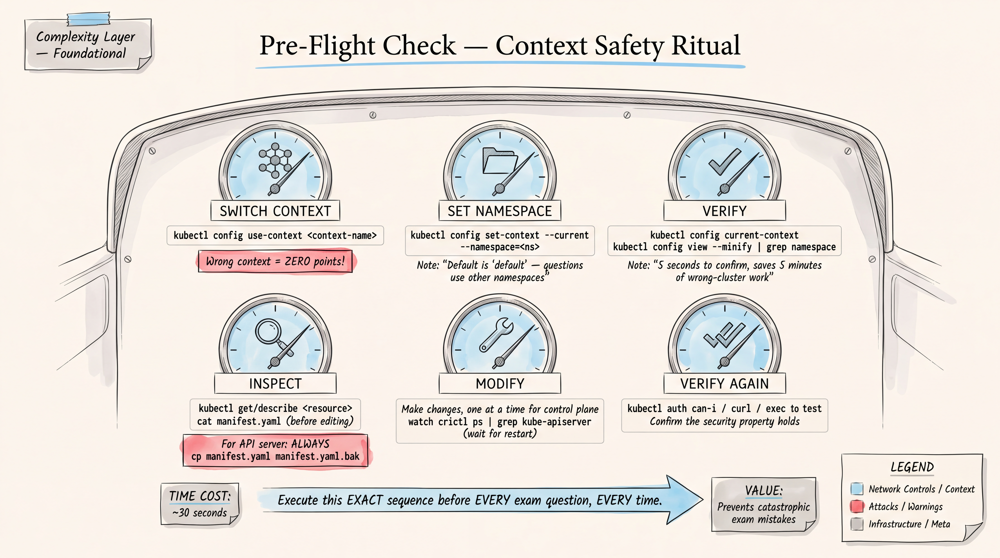

# CKS Exam Strategy -- Complete Preparation Guide




**Target Audience:** Experienced K8s engineer (11+ years, CKAD certified, Principal Platform Engineer)
**Exam:** Certified Kubernetes Security Specialist (CKS)
**Format:** Performance-based, 15-20 tasks, 2 hours, online proctored
**Passing Score:** 67%
**Prerequisite:** CKA certification (must be valid at time of CKS attempt)
**Kubernetes Version:** v1.35
**Certification Validity:** 2 years from passing
**Retakes:** One free retake included (two total attempts)
**Simulator:** Two Killer.sh sessions included (17 questions each, 36 hours access per session)

---

## CKS Exam Domains and Weights

| Domain | Weight |
|--------|--------|
| Cluster Setup | 15% |
| Cluster Hardening | 15% |
| System Hardening | 10% |
| Minimize Microservice Vulnerabilities | 20% |
| Supply Chain Security | 20% |
| Monitoring, Logging and Runtime Security | 20% |

---

## 1. CKS TASK FREQUENCY MAP

Based on community reports, exam simulators, and curriculum analysis:

| Task Pattern | Est. Frequency | Difficulty | Time Cost | Risk of Losing Points | Priority |
|---|---|---|---|---|---|
| NetworkPolicy (deny + allow specific) | Very High (90%+) | Medium | 5-8 min | HIGH -- selector mistakes | P0 |
| RBAC (Role/ClusterRole/Binding) | Very High (90%+) | Medium | 4-7 min | HIGH -- verb/resource errors | P0 |
| securityContext (pod/container level) | Very High (85%+) | Low-Med | 3-5 min | MEDIUM -- wrong level | P0 |
| Pod Security Admission (labels) | High (80%+) | Low | 2-4 min | LOW -- straightforward | P0 |
| Image scanning with Trivy | High (80%+) | Low-Med | 4-6 min | MEDIUM -- output parsing | P0 |
| Audit policy configuration | High (75%+) | High | 8-12 min | HIGH -- apiserver restart | P1 |
| Runtime detection with Falco | High (75%+) | Medium | 5-8 min | MEDIUM -- rule syntax | P1 |
| kube-bench / CIS benchmarks | High (70%+) | Medium | 5-8 min | MEDIUM -- fix identification | P1 |
| Secrets encryption at rest | Medium-High (65%+) | High | 8-12 min | HIGH -- apiserver config | P1 |
| seccomp profiles | Medium-High (65%+) | Medium | 5-7 min | MEDIUM -- profile path | P1 |
| ServiceAccount hardening | Medium-High (65%+) | Low-Med | 3-5 min | LOW -- well-documented | P1 |
| Admission controllers (enable/disable) | Medium (60%+) | Medium | 5-8 min | HIGH -- apiserver restart | P1 |
| AppArmor profiles | Medium (55%+) | Medium | 5-8 min | MEDIUM -- node-level work | P2 |
| Container image whitelisting (ImagePolicyWebhook) | Medium (50%+) | High | 8-12 min | HIGH -- webhook config | P2 |
| Ingress TLS configuration | Medium (50%+) | Low-Med | 4-6 min | LOW -- cert management | P2 |
| Container sandbox (gVisor/RuntimeClass) | Medium (45%+) | Low-Med | 3-5 min | LOW -- straightforward | P2 |
| Immutable containers (readOnlyRootFilesystem) | Medium (45%+) | Low | 2-3 min | LOW -- simple field | P2 |
| Restrict container registries | Medium (40%+) | Medium | 5-7 min | MEDIUM -- OPA/admission | P2 |
| Certificate/TLS management | Low-Med (35%+) | Medium | 5-8 min | MEDIUM -- openssl commands | P3 |
| Syscall filtering | Low-Med (30%+) | Medium | 5-7 min | MEDIUM -- niche topic | P3 |
| Binary verification (sha512sum) | Low (25%+) | Low | 2-4 min | LOW -- straightforward | P3 |

**Point Density Strategy:**
- P0 tasks: ~45% of total points. Master these first. They appear on nearly every exam.
- P1 tasks: ~35% of total points. Required for safe pass.
- P2 tasks: ~15% of total points. Needed for comfortable margin.
- P3 tasks: ~5% of total points. Nice to have but not make-or-break.

---

## 2. EXAM TIME MANAGEMENT STRATEGY

### Time Budget

```
Total exam time:          120 minutes
Number of tasks:          15-20 (typically 15-17)
Average time per task:    ~7 minutes
Review buffer:            10 minutes
Context switch overhead:  ~1 minute per task

Effective time per task:  6-7 minutes average
```

### Phase 1: Initial Scan (Minutes 0-5)
```
DO NOT read every question in detail.
Instead: Skim ALL questions in 3-5 minutes.
Mark each question mentally as:
  [FAST]   = Know exactly how to do it, <4 min
  [MEDIUM] = Know the approach, need docs, 5-8 min
  [HARD]   = Uncertain, need research, >8 min

Purpose: Identify quick wins and potential time sinks.
```

### Phase 2: Quick Wins (Minutes 5-45)
```
Attack ALL [FAST] questions first.
Target: Complete 5-7 questions in ~40 minutes.
These typically include:
  - securityContext settings
  - Pod Security Admission labels
  - ServiceAccount configuration
  - Simple RBAC bindings
  - readOnlyRootFilesystem
  - RuntimeClass assignment
  - Simple NetworkPolicy

CRITICAL: Always verify each answer before moving on.
  kubectl get <resource> -o yaml
  kubectl describe <resource>
  kubectl auth can-i --as=<user> <verb> <resource>
```

### Phase 3: Medium Tasks (Minutes 45-95)
```
Attack [MEDIUM] questions.
Target: Complete 5-8 questions in ~50 minutes.
These typically include:
  - Complex NetworkPolicy with egress
  - RBAC with specific verbs/resources
  - Trivy image scanning + remediation
  - Falco rule modification
  - kube-bench fix specific finding
  - seccomp profile application

Time box: If stuck after 8 minutes on a single task,
flag it and move on. Come back in Phase 4.
```

### Phase 4: Hard Tasks + Review (Minutes 95-120)
```
Attack [HARD] questions and flagged items.
Target: Attempt remaining 2-4 questions.
These typically include:
  - Audit policy configuration
  - Secrets encryption at rest
  - ImagePolicyWebhook setup
  - Complex admission controller config

LAST 10 MINUTES: Do NOT start new tasks.
Instead:
  1. Verify correct context on completed tasks
  2. Check that pods/deployments are running
  3. Verify NetworkPolicies are in correct namespace
  4. Ensure RBAC bindings reference correct subjects
```

### Time Limit Rules
```
Question worth 4% or less:    Max 5 minutes, then skip
Question worth 5-7%:          Max 8 minutes, then skip
Question worth 8%+:           Max 12 minutes, then skip

If documentation search takes >2 minutes: You are searching
for the wrong thing. Try different keywords or work from memory.
```

### Flagging Strategy
```
The PSI exam interface allows flagging questions.
Flag a question when:
  - You completed it but are unsure if correct
  - You partially completed it
  - You skipped it entirely

During review, prioritize:
  1. Partially completed (highest ROI -- some work already done)
  2. Skipped (fresh attempt with remaining time)
  3. Completed but uncertain (verify only if time permits)
```

---

## 3. CONTEXT SAFETY RITUAL

**This is the single most important habit for the CKS exam.**
Every question may use a different cluster and namespace.

### Before EVERY Question
```bash
# STEP 1: Read the question carefully. Note:
#   - Which cluster/context to use
#   - Which namespace to work in
#   - What resources already exist

# STEP 2: Switch context (the question will provide the command)
kubectl config use-context <correct-context>

# STEP 3: Set namespace (if specified)
kubectl config set-context --current --namespace=<correct-ns>

# STEP 4: Verify you are in the right place
kubectl config current-context
kubectl get ns <namespace>   # confirm it exists

# STEP 5: Inspect existing state BEFORE modifying anything
kubectl get all -n <namespace>
kubectl get networkpolicy,role,rolebinding,sa -n <namespace>

# STEP 6: Make your changes

# STEP 7: Verify your changes
kubectl get <resource> -o yaml
kubectl describe <resource>
# Test functionality if applicable
```

### SSH Safety (for node-level tasks)
```bash
# Some tasks require SSH to cluster nodes
ssh <node-name>

# ALWAYS verify where you are after SSH
hostname
whoami

# When done with node-level work
exit    # Return to base node

# Verify you are back
hostname   # Should show base node name
kubectl config current-context   # Should work again
```

### API Server Modification Safety
```bash
# Before modifying kube-apiserver manifest:
# 1. ALWAYS back up the manifest first
cp /etc/kubernetes/manifests/kube-apiserver.yaml /etc/kubernetes/manifests/kube-apiserver.yaml.bak

# 2. Make your changes
vim /etc/kubernetes/manifests/kube-apiserver.yaml

# 3. Wait for apiserver to restart (static pod)
# Watch for it to come back:
watch crictl ps | grep kube-apiserver
# Or:
kubectl get nodes   # Will fail then succeed when apiserver restarts

# 4. If apiserver does NOT come back within 2 minutes:
# Restore backup immediately
cp /etc/kubernetes/manifests/kube-apiserver.yaml.bak /etc/kubernetes/manifests/kube-apiserver.yaml

# 5. Check logs if apiserver fails to start
crictl logs <container-id>
cat /var/log/pods/kube-system_kube-apiserver-*/kube-apiserver/*.log
```

---

## 4. FIFTY MISTAKES THAT CAN COST THE CKS

### Context and Namespace Errors (1-8)
1. **Working in wrong cluster context.** The exam has multiple clusters. Forgetting to switch context means your work goes to the wrong cluster and scores zero for that question.
2. **Working in wrong namespace.** Creating resources in `default` when the question specifies a namespace. Always set namespace in context.
3. **Forgetting to switch back after SSH.** After SSHing to a node for system-level tasks, forgetting to exit and return to the base node.
4. **Creating resources in kube-system instead of the target namespace.** Some questions reference kube-system resources but ask you to work in a different namespace.
5. **Not reading the full question.** Skipping details like "in namespace `team-blue`" or "on cluster `k8s-node01`."
6. **Assuming default namespace.** If the question does not specify a namespace, check if there is one implied by existing resources.
7. **Modifying resources on the wrong node.** When SSHed to a worker node, accidentally modifying control-plane configs (or vice versa).
8. **Confusing cluster names.** exam clusters have similar names. Double-check which cluster a question refers to.

### RBAC Mistakes (9-16)
9. **Using ClusterRole when Role is needed (or vice versa).** ClusterRole + ClusterRoleBinding = cluster-wide. Role + RoleBinding = namespace-scoped. Mixing them up over-grants or under-grants access.
10. **Wrong API group for resources.** Deployments are in `apps`, not `""`. Pods are in `""`. NetworkPolicies are in `networking.k8s.io`. Ingresses are in `networking.k8s.io`.
11. **Misspelling resource names.** `pods` not `pod`, `deployments` not `deployment`, `configmaps` not `configmap` in role rules.
12. **Forgetting to include required verbs.** Question says "read access" -- that means `get`, `list`, `watch`. Not just `get`.
13. **Overly broad RBAC.** Using `*` for resources or verbs when the question asks for specific access. This is a security exam -- least privilege matters.
14. **Wrong subject in RoleBinding.** Binding to the wrong ServiceAccount name or user.
15. **ServiceAccount namespace mismatch.** ServiceAccounts are namespaced. If binding a SA from namespace `A` in namespace `B`, you must specify `namespace: A` in the subject.
16. **Forgetting to create the ServiceAccount.** Creating the Role and RoleBinding but not the ServiceAccount itself.

### NetworkPolicy Mistakes (17-24)
17. **Wrong podSelector labels.** Using deployment name instead of pod labels. Always check actual pod labels with `kubectl get pods --show-labels`.
18. **Confusing AND vs OR in selectors.** Two items in the same `from:` list item = AND. Two separate `from:` list items = OR. This is the most common NetworkPolicy mistake.
19. **Forgetting DNS egress.** If you create an egress policy, you MUST allow DNS (port 53 UDP and TCP to kube-dns) or all DNS resolution breaks. Pods cannot resolve service names.
20. **Missing policyTypes field.** If you specify `egress` rules but do not include `Egress` in `policyTypes`, the egress rules are ignored.
21. **Empty podSelector vs specific podSelector.** `podSelector: {}` selects ALL pods in the namespace. Forgetting `{}` means no pods selected.
22. **Applying NetworkPolicy in wrong namespace.** NetworkPolicies are namespaced. They must be in the same namespace as the pods they target.
23. **Forgetting namespaceSelector for cross-namespace traffic.** If pods in namespace A need to reach pods in namespace B, namespace B's NetworkPolicy needs a `namespaceSelector` (or label the namespace).
24. **Not testing the policy.** After applying, verify: `kubectl exec <pod> -- curl <target>` to confirm allowed traffic works and blocked traffic is denied.

### SecurityContext and Pod Security Mistakes (25-32)
25. **Setting securityContext at wrong level.** Some fields are pod-level (`spec.securityContext`), others are container-level (`spec.containers[].securityContext`). `runAsUser` works at both. `capabilities` is container-level only.
26. **Forgetting `drop: ["ALL"]` before adding capabilities.** Restricted profile requires dropping all capabilities first, then adding back only what is needed.
27. **Not setting `allowPrivilegeEscalation: false`.** Required for restricted Pod Security Standard. Often forgotten.
28. **Confusing Pod Security Admission label modes.** `enforce` = reject pods, `audit` = log violations, `warn` = warn but allow. Using `warn` when you need `enforce` means pods still run.
29. **Wrong Pod Security Standard level.** `privileged` (no restrictions), `baseline` (prevents known escalations), `restricted` (full hardening). The question will specify which level.
30. **Forgetting `runAsNonRoot: true`.** Required for restricted standard. Must be set at pod level or every container.
31. **Setting `runAsUser: 0` with `runAsNonRoot: true`.** These conflict. `runAsNonRoot: true` + `runAsUser: 0` = pod will fail to start.
32. **Not adding seccomp profile when required.** Restricted standard requires `seccompProfile.type: RuntimeDefault` or `Localhost`.

### Audit and API Server Configuration Mistakes (33-38)
33. **Not backing up kube-apiserver manifest before editing.** If you break the apiserver config, the cluster goes down. Always back up first.
34. **Audit policy rule order wrong.** Rules are evaluated top-to-bottom, first match wins. If a `None` rule comes first, it can shadow more specific rules below it.
35. **Missing volume mounts for audit log.** Adding `--audit-policy-file` and `--audit-log-path` flags without adding the corresponding `volumeMounts` and `volumes` to the static pod manifest.
36. **Wrong file path in audit flags.** The path in `--audit-policy-file` must match the mount path inside the container, not the host path.
37. **Not waiting for apiserver restart.** After modifying the static pod manifest, the apiserver takes 30-60 seconds to restart. Running kubectl commands too early shows connection errors that look like you broke something.
38. **Forgetting to create the audit policy file on the host.** Specifying the policy file path in kube-apiserver args but not actually creating the file.

### Secrets and Encryption Mistakes (39-42)
39. **EncryptionConfiguration provider order.** The first provider is used for encryption. If `identity: {}` is first, secrets are stored unencrypted. Put `aescbc` or `aesgcm` or `secretbox` first.
40. **Not encrypting existing secrets after enabling encryption.** New secrets are encrypted, but existing ones remain unencrypted until you run: `kubectl get secrets --all-namespaces -o json | kubectl replace -f -`
41. **Wrong encryption resource list.** You must specify which resources to encrypt (e.g., `secrets`). Misspelling or wrong resource name means no encryption.
42. **Forgetting apiserver restart after encryption config change.** The apiserver must be restarted for EncryptionConfiguration changes to take effect.

### Container and Image Security Mistakes (43-46)
43. **Using wrong Trivy command syntax.** `trivy image <image-name>` for scanning. Not `trivy scan` or `trivy <image-name>`.
44. **Not filtering Trivy output by severity.** Question may ask to find only CRITICAL vulnerabilities: `trivy image --severity CRITICAL <image>`.
45. **Deleting the wrong pods/images.** When asked to delete pods using images with vulnerabilities, double-check which pods use which images before deleting.
46. **Not updating image tag after finding vulnerability.** Finding the vulnerability is only half the task -- you usually must also fix it (update image, rebuild, redeploy).

### Runtime Security and Falco Mistakes (47-50)
47. **Editing Falco rules in wrong file.** Falco has multiple rule files. Custom rules should go in a separate file or the correct override file, not the default rules file.
48. **Wrong Falco output format.** Falco output strings use specific format specifiers (`%evt.time`, `%container.id`, `%proc.name`). Using wrong specifiers produces empty output.
49. **Not restarting Falco after rule changes.** Falco must be restarted/reloaded for rule changes to take effect: `systemctl restart falco`.
50. **Confusing Falco priority levels.** `EMERGENCY`, `ALERT`, `CRITICAL`, `ERROR`, `WARNING`, `NOTICE`, `INFORMATIONAL`, `DEBUG`. Using wrong priority may not match question requirements.

---

## 5. ATTACK-TO-DEFENSE MEMORY MAP

### Container and Pod Level (1-12)
```
 1. Privileged container escape      --> securityContext.privileged: false
 2. Root user container breakout     --> runAsNonRoot: true, runAsUser: >0
 3. Capability abuse (CAP_SYS_ADMIN) --> capabilities: drop: ["ALL"], add only needed
 4. Privilege escalation via setuid  --> allowPrivilegeEscalation: false
 5. Writable root filesystem tamper  --> readOnlyRootFilesystem: true
 6. Sensitive host path mount        --> Restrict volume types (no hostPath), PSA restricted
 7. Host namespace access            --> hostPID: false, hostNetwork: false, hostIPC: false
 8. Unrestricted syscalls            --> seccomp profile: RuntimeDefault or custom
 9. AppArmor bypass                  --> appArmorProfile: RuntimeDefault or Localhost
10. Container runtime exploit        --> RuntimeClass with gVisor/Kata sandbox
11. Proc filesystem information leak --> procMount: Default (not Unmasked)
12. Large attack surface in image    --> Minimal base images (distroless, alpine)
```

### Network Level (13-22)
```
13. Unrestricted pod-to-pod traffic  --> NetworkPolicy default deny + explicit allow
14. Lateral movement between NS      --> NetworkPolicy with namespaceSelector restrictions
15. Data exfiltration via egress      --> Egress NetworkPolicy restricting outbound
16. DNS tunneling                    --> Egress policy allowing DNS only to kube-dns
17. Man-in-the-middle on services    --> mTLS via service mesh, Ingress TLS termination
18. Unencrypted traffic to API       --> TLS certificates, --kubelet-certificate-authority
19. External access to internal svc  --> Service type ClusterIP (not NodePort/LB), Ingress
20. Pod IP spoofing                  --> NetworkPolicy + CNI-level enforcement
21. Ingress without TLS              --> Ingress TLS secret + redirect HTTP to HTTPS
22. Service account token over net   --> Bound service account tokens, short TTL
```

### Cluster and API Level (23-34)
```
23. Unauthorized API access          --> RBAC with least privilege roles
24. Anonymous API access             --> --anonymous-auth=false or restrict anonymous role
25. Excessive ServiceAccount perms   --> Dedicated SAs per workload, no default SA abuse
26. Auto-mounted SA tokens           --> automountServiceAccountToken: false
27. Stale/unused ServiceAccounts     --> Audit and delete unused SAs
28. Unencrypted etcd secrets         --> EncryptionConfiguration (aescbc/secretbox)
29. Direct etcd access               --> etcd peer/client TLS, firewall etcd port 2379
30. Unauthorized node actions        --> NodeRestriction admission controller
31. Insecure admission pipeline      --> Enable PodSecurity, webhook admission controllers
32. Malicious admission bypass       --> ValidatingAdmissionWebhook, fail-closed policy
33. Kubelet unauthenticated access   --> --authentication/authorization on kubelet
34. Insecure API server flags        --> kube-bench audit, fix CIS benchmark findings
```

### Supply Chain (35-40)
```
35. Vulnerable base images           --> Trivy scan, deny images with CRITICAL CVEs
36. Untrusted image registries       --> ImagePolicyWebhook, OPA/Gatekeeper whitelist
37. Image tag mutation (:latest)     --> Use image digests (sha256), AlwaysPullImages
38. Compromised build pipeline       --> Image signing, cosign verification
39. Embedded secrets in images       --> Multi-stage builds, never COPY secrets
40. Outdated K8s components          --> Regular cluster upgrades, kube-bench checks
```

### Host and System Level (41-48)
```
41. Host filesystem tampering        --> Immutable infrastructure, minimal OS
42. Unnecessary services on nodes    --> Disable/remove unused services and packages
43. Kernel exploit from container    --> Seccomp, AppArmor, gVisor sandboxing
44. SSH brute force to nodes         --> Key-based auth only, fail2ban, firewall
45. Unauthorized binary execution    --> AppArmor profile restricting exec paths
46. Modified system binaries         --> sha512sum verification, file integrity monitoring
47. Excessive host port exposure     --> Restrict hostPort usage in PSA baseline/restricted
48. Unpatched node OS                --> Regular OS updates, node rotation
```

### Monitoring and Detection (49-55)
```
49. Undetected runtime compromise    --> Falco rules for suspicious activity
50. Missing audit trail              --> Audit policy logging all sensitive operations
51. Log tampering                    --> Ship logs to external system, append-only storage
52. Unmonitored privilege changes    --> Falco rule: detect RBAC changes
53. Crypto mining in pods            --> Falco: detect crypto mining processes
54. Reverse shell from container     --> Falco: detect outbound shell connections
55. Sensitive file access            --> Falco: detect reads of /etc/shadow, /etc/passwd
```

---

## 6. "SEE THIS, THINK THIS" TRIGGER SHEET

### Pod/Container Security (1-25)
```
 1. privileged: true                 --> CRITICAL: container has full host access
                                         FIX: Set privileged: false

 2. runAsUser: 0                     --> Container runs as root
                                         FIX: runAsUser: 1000+ and runAsNonRoot: true

 3. allowPrivilegeEscalation: true   --> setuid/setgid binaries can gain root
                                         FIX: allowPrivilegeEscalation: false

 4. capabilities.add: [SYS_ADMIN]    --> Near-equivalent to privileged
                                         FIX: drop ALL, add only NET_BIND_SERVICE if needed

 5. capabilities.add: [NET_RAW]      --> Can craft raw packets, ARP spoofing
                                         FIX: Drop unless explicitly needed

 6. readOnlyRootFilesystem: false    --> Attacker can write to container filesystem
     (or missing)                        FIX: readOnlyRootFilesystem: true + emptyDir for writable paths

 7. hostPID: true                    --> Can see all host processes
                                         FIX: hostPID: false

 8. hostNetwork: true                --> Pod shares host network namespace
                                         FIX: hostNetwork: false

 9. hostIPC: true                    --> Can access host shared memory
                                         FIX: hostIPC: false

10. hostPath volume                  --> Direct access to host filesystem
                                         FIX: Remove hostPath, use PVC/emptyDir/configMap

11. No securityContext at all        --> Running with container runtime defaults
                                         FIX: Add full restricted securityContext block

12. image: nginx:latest              --> Mutable tag, unpinned version
                                         FIX: Use specific tag or sha256 digest

13. imagePullPolicy: IfNotPresent    --> Stale image may be used, potential tampering
     with :latest tag                    FIX: imagePullPolicy: Always, or pin digest

14. No resource limits               --> Container can consume all node resources (DoS)
                                         FIX: Set requests and limits for CPU/memory

15. seccompProfile.type: Unconfined  --> All syscalls allowed
                                         FIX: RuntimeDefault or Localhost with custom profile

16. appArmorProfile.type: Unconfined --> No AppArmor restriction
                                         FIX: RuntimeDefault or Localhost

17. procMount: Unmasked              --> Full /proc visible, info leak
                                         FIX: procMount: Default

18. automountServiceAccountToken:    --> SA token available for API access
     true (or missing)                   FIX: automountServiceAccountToken: false (if SA not needed)

19. serviceAccountName: default      --> Default SA may have excessive permissions
                                         FIX: Create dedicated SA with minimal RBAC

20. No seccomp profile specified     --> Default behavior varies by runtime
                                         FIX: Explicitly set RuntimeDefault

21. volumeMounts with subPath        --> Potential symlink traversal
                                         FIX: Validate need, consider alternatives

22. env with valueFrom secretKeyRef  --> Secret referenced directly (ok but check RBAC)
                                         FIX: Ensure SA cannot list all secrets

23. Container runs as GID 0         --> Some files writable by root group
                                         FIX: runAsGroup: >0, fsGroup: >0

24. Multiple containers same pod     --> Shared network namespace, sidecar risks
                                         FIX: Ensure each container has its own securityContext

25. initContainer without security   --> Init containers can have different contexts
     context                             FIX: Apply same security restrictions as main containers
```

### RBAC Patterns (26-40)
```
26. rules: [resources: ["*"]]        --> Access to ALL resources
                                         FIX: List specific resources needed

27. rules: [verbs: ["*"]]            --> All operations on resources
                                         FIX: List specific verbs: get, list, watch, etc.

28. ClusterRoleBinding to            --> Group-wide cluster access
     group "system:authenticated"        FIX: Bind to specific users/SAs only

29. ClusterRole with secrets access  --> Can read all secrets cluster-wide
                                         FIX: Use namespaced Role, not ClusterRole

30. RoleBinding to default SA        --> Every pod in NS gets these permissions
                                         FIX: Bind to specific ServiceAccount

31. Role with escalate/bind verbs    --> Can create more powerful bindings
                                         FIX: Remove unless absolutely necessary

32. Role with create pods + exec     --> Can exec into any pod in namespace
                                         FIX: Remove exec if not needed

33. Role with create pods/exec +     --> Potential container breakout vector
     mount secrets                       FIX: Separate roles, least privilege

34. ClusterRole with node access     --> Can read node info, potential pivot
                                         FIX: Restrict to specific node operations

35. system:masters group binding     --> Unrestricted cluster-admin access
                                         FIX: Never bind to this group in production

36. Role with impersonate verb       --> Can act as any user
                                         FIX: Remove impersonate unless specifically needed

37. No RBAC audit trail              --> Cannot track who did what
                                         FIX: Enable audit logging for RBAC resources

38. Unused RoleBindings              --> Stale permissions, attack surface
                                         FIX: Audit and remove unused bindings

39. Role allowing configmap write    --> Can modify configmaps used by other pods
     in kube-system                      FIX: Restrict to specific configmap names

40. SA with token not expiring       --> Long-lived credential risk
                                         FIX: Use bound tokens with expiry (default in 1.24+)
```

### Network Patterns (41-55)
```
41. No NetworkPolicy in namespace    --> All traffic allowed (pod is non-isolated)
                                         FIX: Create default deny + explicit allow policies

42. NetworkPolicy with empty         --> Selects ALL pods in namespace
     podSelector: {}                     CHECK: Is this intentional? Usually for default deny

43. ingress: [{}]                    --> Allow ALL ingress (empty rule = allow all)
                                         FIX: Specify explicit from/ports

44. egress: [{}]                     --> Allow ALL egress
                                         FIX: Specify explicit to/ports

45. policyTypes missing Egress       --> Egress rules are IGNORED even if specified
     but egress rules present            FIX: Add "Egress" to policyTypes array

46. namespaceSelector: {}            --> Matches ALL namespaces
                                         FIX: Use specific namespace labels

47. Only ingress policy, no egress   --> All outbound traffic is unrestricted
                                         FIX: Add egress policy if data exfiltration risk

48. Egress policy without DNS        --> Pod cannot resolve service names
     (port 53) allowance                 FIX: Allow UDP/TCP 53 to kube-dns

49. ipBlock including pod CIDR       --> Policy may not work as expected for pod traffic
                                         FIX: Use podSelector for pod-to-pod, ipBlock for external

50. Mixed AND/OR selectors           --> Two selectors in same from item = AND
     (common confusion)                  Two items in from array = OR
                                         FIX: Verify logic matches intent

51. Service exposed as NodePort      --> Accessible from outside cluster
                                         FIX: Use ClusterIP + Ingress with TLS

52. Service type LoadBalancer        --> Public internet access if cloud
     without NetworkPolicy               FIX: Restrict source IPs, add NetworkPolicy

53. No TLS on Ingress                --> Traffic unencrypted between client and cluster
                                         FIX: Add tls section with secret

54. Ingress without annotation       --> May not enforce HTTPS redirect
     for SSL redirect                    FIX: Add nginx.ingress.kubernetes.io/ssl-redirect: "true"

55. Service with externalIPs         --> Can be exploited for traffic hijacking
                                         FIX: Remove unless absolutely necessary
```

### Cluster Configuration Patterns (56-75)
```
56. --anonymous-auth=true            --> Unauthenticated API access possible
                                         FIX: Set false or ensure RBAC blocks anonymous

57. --authorization-mode=AlwaysAllow --> No authorization checks
                                         FIX: --authorization-mode=Node,RBAC

58. --insecure-port=8080             --> Unencrypted, unauthenticated API access (deprecated)
                                         FIX: Remove flag (disabled by default in recent versions)

59. --enable-admission-plugins       --> Missing PodSecurity or NodeRestriction
     without security controllers        FIX: Add PodSecurity,NodeRestriction to list

60. --profiling=true                 --> Exposes profiling endpoints
                                         FIX: --profiling=false

61. --audit-policy-file missing      --> No audit logging
                                         FIX: Create audit policy and add flag

62. --encryption-provider-config     --> Secrets stored unencrypted in etcd
     missing                             FIX: Create EncryptionConfiguration and add flag

63. etcd without --peer-cert-file    --> Unencrypted etcd peer communication
                                         FIX: Configure etcd TLS peer certificates

64. etcd --client-cert-auth=false    --> etcd accepts unauthenticated clients
                                         FIX: Set to true with proper certificates

65. kubelet --anonymous-auth=true    --> Kubelet API accessible without auth
                                         FIX: Set false in kubelet config

66. kubelet --authorization-mode=    --> No authorization on kubelet API
     AlwaysAllow                         FIX: Set to Webhook

67. kubelet --read-only-port=10255   --> Exposes read-only kubelet info
                                         FIX: Set to 0 to disable

68. kube-scheduler --profiling=true  --> Scheduler profiling exposed
                                         FIX: Set to false

69. controller-manager               --> Controller manager profiling exposed
     --profiling=true                    FIX: Set to false

70. No EncryptionConfiguration       --> identity: {} means plaintext in etcd
     or identity first                   FIX: Put aescbc/secretbox before identity

71. Deprecated API versions          --> May not enforce current security policies
                                         FIX: Use current stable API versions

72. ServiceAccount issuer not set    --> Less secure token validation
                                         FIX: Configure --service-account-issuer

73. kube-bench WARNING findings      --> Potential security gaps
                                         FIX: Address all FAIL and WARN findings

74. Missing RBAC for system:nodes    --> Nodes may have excessive access
                                         FIX: Enable NodeRestriction admission controller

75. Dashboard deployed with          --> Full cluster admin via web UI
     cluster-admin binding               FIX: Remove or restrict to read-only
```

### Image and Supply Chain Patterns (76-85)
```
76. FROM ubuntu:latest               --> Large image, many vulnerabilities
                                         FIX: Use distroless or alpine base

77. Image from public registry       --> Untrusted source, potential malware
     (docker.io/random/image)            FIX: Use private registry, scan before use

78. No image digest pinning          --> Tag can be overwritten with malicious image
                                         FIX: Use image@sha256:<digest>

79. Trivy shows CRITICAL CVEs        --> Known exploitable vulnerabilities
                                         FIX: Update base image, patch dependencies

80. Dockerfile COPY with secrets     --> Secrets baked into image layer
                                         FIX: Use multi-stage build, mount secrets at runtime

81. Dockerfile USER root             --> Container runs as root by default
                                         FIX: USER nonroot or USER 65534

82. No ImagePolicyWebhook            --> Any image can be deployed
                                         FIX: Configure admission webhook for registry whitelist

83. Container uses :latest tag       --> No version control, unpredictable
                                         FIX: Pin to specific version tag or digest

84. Multi-stage build leaking        --> Build tools/source in final image
     build artifacts                     FIX: Only COPY needed artifacts in final stage

85. No vulnerability scanning        --> Unknown risk profile in cluster
     in CI/CD                            FIX: Integrate Trivy in pipeline, fail on CRITICAL
```

### Runtime and Monitoring Patterns (86-100)
```
86. No Falco or runtime detection    --> Runtime attacks go undetected
                                         FIX: Deploy Falco with appropriate rules

87. Falco rule priority too low      --> Critical events not escalated
                                         FIX: Set appropriate priority (WARNING+)

88. Shell spawned in container       --> Potential compromise or debugging
     (kubectl exec)                      FIX: Falco rule for shell detection in prod

89. Sensitive file read in container --> /etc/shadow, /etc/passwd accessed
                                         FIX: Falco rule + AppArmor to restrict reads

90. New process spawned in container --> Unexpected binary execution
                                         FIX: Falco rule for unexpected processes

91. Outbound connection from         --> Potential C2 communication
     container to unusual port           FIX: Egress NetworkPolicy + Falco rule

92. Binary downloaded in container   --> Runtime payload delivery
     (curl, wget to unknown URL)         FIX: readOnlyRootFilesystem + Falco rule

93. Container drift detected         --> Files changed since container start
                                         FIX: Falco drift detection rule

94. No audit policy for secrets      --> Secret access not tracked
                                         FIX: Audit policy: level Metadata for secrets

95. Audit logs not shipped           --> Lost if node fails, tamper risk
     externally                          FIX: Webhook backend or log shipping agent

96. Log volume not rotated           --> Disk fills up, apiserver crashes
                                         FIX: --audit-log-maxsize, --audit-log-maxbackup

97. kube-bench FAIL results          --> CIS benchmark violations
                                         FIX: Follow kube-bench remediation output

98. No runtime class for             --> Untrusted workloads share kernel
     untrusted workloads                 FIX: RuntimeClass with gVisor handler

99. No seccomp profile applied       --> Container can use any syscall
                                         FIX: Apply RuntimeDefault profile at minimum

100. Sysctl net.ipv4.ip_forward=1   --> Pod can route traffic between interfaces
      in pod spec                        FIX: Remove unless explicitly needed, not in safe list
```

---

## 7. CKS DOCUMENTATION NAVIGATION MAP

### Official Kubernetes Docs (kubernetes.io/docs) -- Allowed During Exam

| Task | Search These Keywords | Direct URL Path |
|---|---|---|
| **NetworkPolicy** | "network policy" | /docs/concepts/services-networking/network-policies/ |
| **RBAC** | "rbac" | /docs/reference/access-authn-authz/rbac/ |
| **SecurityContext** | "security context" | /docs/tasks/configure-pod-container/security-context/ |
| **Pod Security Standards** | "pod security standards" | /docs/concepts/security/pod-security-standards/ |
| **Pod Security Admission** | "pod security admission" | /docs/concepts/security/pod-security-admission/ |
| **Audit logging** | "audit" or "auditing" | /docs/tasks/debug/debug-cluster/audit/ |
| **Secrets encryption** | "encrypt data at rest" | /docs/tasks/administer-cluster/encrypt-data/ |
| **Admission controllers** | "admission controllers" | /docs/reference/access-authn-authz/admission-controllers/ |
| **AppArmor** | "apparmor" | /docs/tutorials/security/apparmor/ |
| **Seccomp** | "seccomp" | /docs/tutorials/security/seccomp/ |
| **Service Accounts** | "service accounts" | /docs/concepts/security/service-accounts/ |
| **Secrets** | "secrets" | /docs/concepts/configuration/secret/ |
| **RuntimeClass** | "runtime class" | /docs/concepts/containers/runtime-class/ |
| **Ingress TLS** | "ingress tls" | /docs/concepts/services-networking/ingress/#tls |
| **Certificate signing** | "certificate signing requests" | /docs/reference/access-authn-authz/certificate-signing-requests/ |
| **Validating admission** | "validating admission webhook" | /docs/reference/access-authn-authz/extensible-admission-controllers/ |
| **ImagePolicyWebhook** | "imagepolicywebhook" | /docs/reference/access-authn-authz/admission-controllers/#imagepolicywebhook |
| **Kubelet security** | "kubelet authentication" | /docs/reference/access-authn-authz/kubelet-authn-authz/ |
| **Security checklist** | "security checklist" | /docs/concepts/security/security-checklist/ |
| **Securing cluster** | "securing a cluster" | /docs/tasks/administer-cluster/securing-a-cluster/ |

### Pro Tips for Doc Navigation
```
1. Use the built-in search on kubernetes.io -- it is fast.
2. Bookmark these in the exam browser during the first 2 minutes:
   - /docs/concepts/security/
   - /docs/reference/access-authn-authz/
   - /docs/tasks/configure-pod-container/security-context/
3. The "Tasks" section has copy-pasteable YAML examples.
4. If search takes >90 seconds, you are searching wrong keywords. Try simpler terms.
5. Remember: only kubernetes.io and its subdomains are allowed.
   (Plus Trivy, Falco, AppArmor docs as listed in allowed resources)
```

### Non-Kubernetes Docs (also allowed during exam)
```
Trivy:         trivy.dev (image scanning commands)
Falco:         falco.org (rule syntax, configuration)
AppArmor:      ubuntu.com AppArmor docs (profile syntax)
Seccomp:       man page / kernel docs
etcd:          etcd.io (TLS configuration)
```

---

## 8. SEVEN-DAY INTENSIVE CKS PLAN

**For:** Experienced engineer with strong K8s fundamentals, limited time.
**Prerequisite:** Already comfortable with kubectl, YAML, cluster administration.
**Daily commitment:** 4-6 hours

### Day 1: Cluster Hardening Foundations
```
MORNING (2h):
  Knowledge: CIS Benchmarks, kube-bench, API server security flags
  Read: kubernetes.io/docs/tasks/administer-cluster/securing-a-cluster/
  Lab:
    - Run kube-bench on a cluster, interpret ALL findings
    - Fix 5 kube-bench FAIL results on API server
    - Fix 3 kube-bench FAIL results on kubelet
    - Verify anonymous-auth, authorization-mode, profiling flags

AFTERNOON (2h):
  Knowledge: RBAC deep dive -- Role, ClusterRole, RoleBinding, ClusterRoleBinding
  Drills:
    - Create 5 Roles with different verb/resource combinations
    - Create 3 ClusterRoles with specific permissions
    - Bind roles to users, groups, and ServiceAccounts
    - Test with: kubectl auth can-i --as=system:serviceaccount:ns:sa <verb> <resource>
  Timed: Complete 3 RBAC tasks in 15 minutes total

EVENING (1h):
  Knowledge: ServiceAccount hardening
  Drills:
    - Create dedicated SA, disable token automount
    - Create pod using specific SA
    - Verify token mount behavior
```

### Day 2: Pod Security and SecurityContext
```
MORNING (2h):
  Knowledge: Pod Security Standards (Privileged/Baseline/Restricted)
  Read: Pod Security Admission controller
  Lab:
    - Label namespace with enforce:restricted, test pod rejection
    - Label namespace with all three modes (enforce/audit/warn)
    - Create pods that pass restricted standard (full securityContext)
  Drills:
    - Write 5 pods with complete restricted securityContext from memory
    - Fix 5 broken pod specs (wrong securityContext settings)

AFTERNOON (2h):
  Knowledge: seccomp profiles and AppArmor
  Lab:
    - Apply RuntimeDefault seccomp to a pod
    - Create custom seccomp profile, apply to pod
    - Load AppArmor profile, apply to pod
    - Verify profiles are active
  Drills:
    - Write seccomp and AppArmor pod specs from memory (3 each)

EVENING (1h):
  Knowledge: Capabilities deep dive
  Drills:
    - Create pod dropping ALL capabilities
    - Add back specific capabilities (NET_BIND_SERVICE)
    - Verify with: kubectl exec <pod> -- cat /proc/1/status | grep Cap
  Timed: 5 securityContext tasks in 20 minutes
```

### Day 3: Network Security
```
MORNING (2h):
  Knowledge: NetworkPolicy syntax, AND vs OR logic
  Read: kubernetes.io/docs/concepts/services-networking/network-policies/
  Lab:
    - Create default deny ingress for a namespace
    - Create default deny egress for a namespace
    - Allow specific pod-to-pod traffic
    - Allow cross-namespace traffic with namespaceSelector
    - Always include DNS egress (port 53 UDP+TCP)
  Drills:
    - Write 8 NetworkPolicies from memory covering different patterns

AFTERNOON (2h):
  Knowledge: Ingress TLS, Service security
  Lab:
    - Create TLS secret for Ingress
    - Configure Ingress with TLS termination
    - Test HTTPS access
  Drills:
    - Create 3 complete Ingress+TLS configurations
  Timed: 5 NetworkPolicy tasks in 25 minutes

EVENING (1h):
  Review: Common NetworkPolicy mistakes (AND vs OR, DNS egress)
  Self-test: Draw network flow diagrams for complex policies
```

### Day 4: Supply Chain Security
```
MORNING (2h):
  Knowledge: Image scanning with Trivy, image policies
  Lab:
    - Install and run Trivy against 10 different images
    - Filter by severity (CRITICAL, HIGH)
    - Identify and fix vulnerable images
    - Practice output parsing
  Drills:
    - Scan, identify, remediate 5 vulnerable deployments

AFTERNOON (2h):
  Knowledge: Admission controllers, ImagePolicyWebhook
  Lab:
    - Enable/disable admission controllers on API server
    - Configure ImagePolicyWebhook
    - Test image admission/rejection
    - Configure OPA Gatekeeper or ValidatingAdmissionWebhook
  Drills:
    - Enable 3 admission controllers from scratch

EVENING (1h):
  Knowledge: Dockerfile security best practices
  Review: Distroless images, multi-stage builds, USER directive
```

### Day 5: Audit, Secrets, and Encryption
```
MORNING (2h):
  Knowledge: Audit policy configuration
  Lab:
    - Write audit policy from scratch (None/Metadata/Request/RequestResponse)
    - Configure API server for audit logging (volumeMounts!)
    - Verify audit log output
    - Practice specific audit rules (secrets, configmaps, pods)
  Drills:
    - Write 3 different audit policies from scratch
    - Configure API server audit in under 8 minutes

AFTERNOON (2h):
  Knowledge: Secrets encryption at rest (EncryptionConfiguration)
  Lab:
    - Create EncryptionConfiguration with aescbc provider
    - Configure API server with --encryption-provider-config
    - Encrypt existing secrets (kubectl get/replace)
    - Verify encryption in etcd: etcdctl get /registry/secrets/...
  Drills:
    - Full encryption setup in under 10 minutes

EVENING (1h):
  Knowledge: Secret best practices
  Lab:
    - Create secrets from literals and files
    - Mount as volumes vs env vars
    - Verify secret content
```

### Day 6: Runtime Security and Monitoring
```
MORNING (2h):
  Knowledge: Falco rules and configuration
  Lab:
    - Install/configure Falco
    - Read and understand default rules
    - Modify existing rule output format
    - Create custom Falco rule
    - Test rule triggering
  Drills:
    - Modify 5 Falco rule outputs from memory

AFTERNOON (2h):
  Knowledge: RuntimeClass, gVisor, container sandboxing
  Lab:
    - Create RuntimeClass for gVisor
    - Assign RuntimeClass to pod
    - Verify sandbox runtime
  Knowledge: System hardening
  Lab:
    - Verify binary integrity with sha512sum
    - Remove unnecessary packages
    - Restrict system services

EVENING (1h):
  Knowledge: Kubernetes security checklist review
  Read: kubernetes.io/docs/concepts/security/security-checklist/
```

### Day 7: Full Simulation and Review
```
MORNING (2.5h):
  Killer.sh attempt #1 (or equivalent timed practice)
  - Simulate real exam conditions
  - 2 hours strict time limit
  - No breaks
  - Score yourself

AFTERNOON (2h):
  Review Killer.sh results:
  - Identify gaps and weak areas
  - Re-practice any task you scored <50% on
  - Review incorrect answers in detail
  - Note which docs pages you needed

EVENING (1.5h):
  Final drill: Top 10 most-tested patterns
  - 2 NetworkPolicies (5 min each)
  - 2 RBAC setups (4 min each)
  - 1 Audit policy (8 min)
  - 1 Secrets encryption (8 min)
  - 1 securityContext pod (3 min)
  - 1 Falco rule (5 min)
  - 1 Trivy scan+fix (5 min)
  - 1 PSA namespace labeling (2 min)
```

---

## 9. FOURTEEN-DAY CKS PLAN

**For:** Recommended default timeline for solid preparation.
**Daily commitment:** 3-4 hours

### Week 1: Build Knowledge

| Day | Focus Area | Activities | Timed Drills |
|-----|-----------|------------|-------------|
| 1 | CKS Overview + CIS Benchmarks | Read CKS curriculum, run kube-bench, understand domains | -- |
| 2 | RBAC Deep Dive | Roles, Bindings, ServiceAccounts, auth can-i | 3 RBAC tasks in 12 min |
| 3 | Pod Security Standards + Admission | PSA labels, Baseline vs Restricted, admission controllers | 5 PSA tasks in 15 min |
| 4 | SecurityContext + Capabilities | runAsNonRoot, capabilities, readOnlyRootFilesystem | 5 secContext tasks in 15 min |
| 5 | NetworkPolicy | Default deny, allow rules, AND/OR, DNS egress | 5 NetPol tasks in 25 min |
| 6 | Seccomp + AppArmor | RuntimeDefault, custom profiles, loading profiles | 3 profile tasks in 12 min |
| 7 | Supply Chain: Trivy + Image Policies | Image scanning, vulnerability remediation, admission webhook | 3 scan+fix tasks in 15 min |

### Week 2: Deepen and Simulate

| Day | Focus Area | Activities | Timed Drills |
|-----|-----------|------------|-------------|
| 8 | Audit Logging | Audit policy, API server config, volume mounts | Full audit setup in 10 min |
| 9 | Secrets Encryption at Rest | EncryptionConfiguration, provider order, etcdctl verify | Full encryption in 10 min |
| 10 | Falco + Runtime Security | Rules, output formats, custom rules, priorities | 3 Falco tasks in 15 min |
| 11 | System Hardening + RuntimeClass | Binary verification, gVisor, kubelet config | Mixed 5 tasks in 20 min |
| 12 | Killer.sh Attempt #1 | Full 2-hour simulation under exam conditions | Full exam sim |
| 13 | Gap Analysis + Weak Areas | Review Killer.sh results, re-drill weak topics | Targeted re-drill 1h |
| 14 | Final Review + Speed Drills | Top patterns from memory, context switching practice | 10 mixed tasks in 50 min |

### Daily Structure (14-Day Plan)
```
First 30 min:  Review yesterday's weak points + flashcard review
Next 90 min:   New topic study + hands-on lab
Next 60 min:   Timed drills on today's topic
Last 15 min:   Write down what you struggled with (for next day review)
```

---

## 10. TWENTY-ONE-DAY CKS PLAN

**For:** Maximum confidence with spaced repetition.
**Daily commitment:** 2-3 hours

### Week 1: Foundation (Learn Each Topic Once)

| Day | Topic | Key Lab | Spaced Review |
|-----|-------|---------|---------------|
| 1 | CKS exam format, domains, allowed resources | Set up practice cluster | -- |
| 2 | CIS Benchmarks + kube-bench | Run kube-bench, fix 5 findings | Day 1 recap |
| 3 | RBAC fundamentals | 5 Role/Binding exercises | Day 2 recap |
| 4 | ServiceAccount security | Dedicated SAs, token control | Day 2-3 recap |
| 5 | Pod Security Standards | Label namespaces, test enforce | Day 3 recap |
| 6 | SecurityContext + capabilities | 5 hardened pod specs | Day 4-5 recap |
| 7 | Week 1 review + timed test | 7 mixed tasks in 35 min | All Week 1 |

### Week 2: Intermediate (Deepen Each Topic)

| Day | Topic | Key Lab | Spaced Review |
|-----|-------|---------|---------------|
| 8 | NetworkPolicy deep dive | 8 different NP patterns | Day 3 RBAC |
| 9 | Seccomp profiles | RuntimeDefault + custom | Day 6 secContext |
| 10 | AppArmor profiles | Load, apply, verify | Day 5 PSA |
| 11 | Audit logging | Full audit setup | Day 8 NetPol |
| 12 | Secrets + Encryption at rest | EncryptionConfig end-to-end | Day 9 seccomp |
| 13 | Trivy + supply chain | Scan, remediate, admission | Day 10 AppArmor |
| 14 | Week 2 review + Killer.sh #1 | Full simulation | All Week 2 + Week 1 gaps |

### Week 3: Mastery (Speed + Simulation)

| Day | Topic | Key Lab | Spaced Review |
|-----|-------|---------|---------------|
| 15 | Falco runtime detection | Rules, custom output | Day 11 audit |
| 16 | System hardening + RuntimeClass | gVisor, binary checks | Day 12 encryption |
| 17 | ImagePolicyWebhook + admission | Webhook config, testing | Day 13 Trivy |
| 18 | Gap drill: weakest 3 topics | Targeted practice | Day 15-16 |
| 19 | Full speed drill: all topics | 15 mixed tasks in 90 min | Day 8 NetPol, Day 11 audit |
| 20 | Killer.sh Attempt #2 | Full simulation, score target >75% | All topics |
| 21 | Final review + confidence check | GO/NO-GO scorecard, last drills | Weak areas only |

### Spaced Repetition Rules
```
- Review each topic at these intervals: Day+1, Day+3, Day+7
- If you get a timed drill >80% correct, move to next interval
- If you get <80%, reset the interval to Day+1
- Focus review on recall, not re-reading: try to write YAML from memory first
```

---

## 11. KILLER.SH STRATEGY

### When to Use Your Two Sessions

**Session 1: Day 12-14 of your study plan (not earlier)**
```
WHY NOT EARLIER:
  - Using it too early means you cannot solve most questions
  - Wasted learning opportunity -- you learn more when you can attempt everything
  - Demoralizing to score 20% when you have not studied
  - You cannot reset or get additional sessions

WHEN YOU ARE READY FOR SESSION 1:
  - You have studied all 6 CKS domains at least once
  - You can write RBAC, NetworkPolicy, securityContext from memory
  - You have practiced audit policy and encryption setup
  - You are scoring >60% on practice drills

HOW TO USE SESSION 1:
  1. Simulate real exam: 2 hours, no breaks, no extra help
  2. After time expires, review EVERY question (you have 36 hours)
  3. For each wrong answer: note what you missed and which docs to use
  4. Re-do each wrong question until you can solve it
  5. Create a gap list: topics to drill before Session 2
```

**Session 2: 2-3 days before the real exam**
```
WHY THIS TIMING:
  - Recent practice keeps patterns fresh
  - Confidence boost before exam
  - Final gap identification
  - Familiarity with exam-like interface

HOW TO USE SESSION 2:
  1. Again simulate real exam: 2 hours strict
  2. Target score: >75% (provides margin above 67% pass)
  3. Review wrong answers same day
  4. Final day before exam: drill only the gaps from Session 2
```

### How Killer.sh Compares to Real Exam
```
HARDER than real exam:
  - Killer.sh has more questions (17 vs 15-17 on real exam)
  - Killer.sh questions tend to be more complex
  - Time pressure is more intense on Killer.sh
  - Many community reports confirm: "real exam felt easier"

SIMILAR to real exam:
  - Same type of environment (browser-based terminal)
  - Same type of tasks (command line, YAML editing)
  - Same context-switching between clusters
  - Similar documentation access

DIFFERENT from real exam:
  - Killer.sh grading is automated and strict
  - Real exam has partial credit for some questions
  - Real exam UI may differ slightly
  - Real exam has proctor interaction
```

### What to Focus On During Simulator
```
1. TIME MANAGEMENT: Track how long each question takes
2. CONTEXT SWITCHING: Practice the safety ritual every question
3. DOCUMENTATION SPEED: How fast can you find what you need?
4. VERIFICATION: Always verify before moving to next question
5. SKIP STRATEGY: Practice deciding when to skip and come back
```

---

## 12. BEST CURRENT LAB RESOURCES

### Tier 1: Essential (Use These)

**1. Killer.sh (Included with Exam Purchase)**
```
Type:       Full exam simulator
Cost:       Free with exam purchase (2 sessions)
Difficulty: Harder than real exam
Best for:   Final preparation, exam simulation
When:       Last 2 weeks of study
Verdict:    MANDATORY. Use both sessions strategically.
```

**2. KodeKloud CKS Course**
```
Type:       Video course + hands-on labs
Cost:       Subscription (~$17/month)
Difficulty: Beginner to intermediate
Best for:   Structured learning, built-in labs
When:       First 1-2 weeks of study
Verdict:    RECOMMENDED. Best structured CKS course with labs included.
            Covers all domains with practice environments.
            Mumshad Mannambeth's teaching style is clear and practical.
```

**3. Killercoda CKS Scenarios**
```
Type:       Free browser-based interactive scenarios
Cost:       Free
Difficulty: Intermediate
Best for:   Practicing specific topics without local cluster
When:       Throughout study period
Verdict:    RECOMMENDED. Free, no setup required.
            Good for topic-specific practice.
            Scenarios cover most CKS domains.
```

### Tier 2: Supplementary (Use If Needed)

**4. Official Kubernetes Documentation**
```
Type:       Reference documentation
Cost:       Free
Best for:   Understanding concepts, exam-allowed reference
When:       Throughout (this IS your exam resource)
Verdict:    ESSENTIAL for exam. Practice navigating it quickly.
            kubernetes.io/docs is allowed during the exam.
```

### What NOT to Spend Time On
```
- Multiple overlapping courses (pick ONE course, not three)
- YouTube videos without hands-on practice
- Books about Kubernetes security (too slow for exam prep)
- Setting up complex multi-node clusters (use KodeKloud/Killercoda labs)
- Collecting bookmarks/resources instead of practicing
```

### Recommended Minimal Stack
```
1. KodeKloud CKS     --> Learn all topics (Weeks 1-2)
2. Killercoda         --> Practice specific weak topics (Throughout)
3. Killer.sh          --> Full exam simulation (Last week)
4. K8s docs           --> Reference navigation practice (Throughout)

Total cost: ~$17/month KodeKloud + exam fee (includes Killer.sh)
```

---

## 13. EXAM SPEED TARGETS

| Task Type | Beginner Time | Competent Time | Exam-Ready Target |
|---|---|---|---|
| RBAC: Create Role + RoleBinding | 8-10 min | 5-6 min | 3-4 min |
| RBAC: ClusterRole + ClusterRoleBinding | 8-10 min | 5-6 min | 3-4 min |
| RBAC: Debug "can-i" permissions | 5-8 min | 3-5 min | 2-3 min |
| NetworkPolicy: Default deny | 5-7 min | 3-4 min | 1-2 min |
| NetworkPolicy: Allow specific traffic | 8-12 min | 5-7 min | 4-5 min |
| NetworkPolicy: Complex multi-rule | 12-18 min | 8-10 min | 6-8 min |
| securityContext: Harden pod | 8-12 min | 4-6 min | 2-4 min |
| Pod Security Admission: Label NS | 3-5 min | 2-3 min | 1-2 min |
| Audit policy: Write + configure | 15-25 min | 10-15 min | 7-10 min |
| Secrets encryption: Full setup | 15-25 min | 10-15 min | 8-10 min |
| Trivy: Scan + identify vulns | 5-8 min | 3-5 min | 2-4 min |
| Trivy: Scan + fix deployment | 10-15 min | 6-8 min | 4-6 min |
| Falco: Modify rule output | 8-12 min | 5-7 min | 3-5 min |
| Falco: Create custom rule | 12-18 min | 8-10 min | 5-7 min |
| kube-bench: Run + fix findings | 10-15 min | 6-8 min | 4-6 min |
| Seccomp: Apply profile | 5-8 min | 3-5 min | 2-3 min |
| AppArmor: Load + apply | 8-12 min | 5-7 min | 4-5 min |
| Admission controller: Enable | 8-12 min | 5-7 min | 3-5 min |
| ImagePolicyWebhook: Configure | 15-20 min | 10-12 min | 7-9 min |
| RuntimeClass: Create + assign | 5-8 min | 3-5 min | 2-3 min |
| ServiceAccount: Harden | 5-8 min | 3-4 min | 2-3 min |
| Ingress TLS: Configure | 8-12 min | 5-7 min | 3-5 min |
| Encryption config: Verify etcd | 5-8 min | 3-5 min | 2-3 min |
| Binary verification: sha512sum | 3-5 min | 2-3 min | 1-2 min |
| Context switch + verify | 2-3 min | 1 min | 30 sec |

### Speed Training Method
```
1. First attempt: Do it correctly (accuracy first)
2. Second attempt: Do it from memory (reduce doc lookups)
3. Third attempt: Time yourself (speed comes last)
4. Repeat until you hit "Exam-Ready Target" consistently
```

---

## 14. FINAL 48-HOUR STRATEGY

### 48 Hours Before Exam
```
DRILL (2-3 hours):
  - 10 mixed tasks under time pressure
  - Focus on your 3 weakest topics from Killer.sh results
  - Practice context-switching ritual until it is automatic
  - One complete audit policy setup from scratch
  - One complete encryption setup from scratch

DO NOT:
  - Start learning any new topic
  - Read new blog posts or watch new videos
  - Panic about topics you have not mastered
```

### 24 Hours Before Exam
```
REVISE (2 hours max):
  - Review your personal notes (mistakes from Killer.sh)
  - Review the cheat sheet (Section 16 below)
  - Practice 5 quick-win tasks (securityContext, PSA, SA, RBAC, basic NetPol)
  - Review documentation navigation (can you find audit policy page in <30 sec?)
  - Review Falco rule syntax (output format specifiers)
  - Review the context safety ritual

DO NOT:
  - Take another Killer.sh session
  - Do a full practice exam
  - Study for more than 2 hours
  - Stay up late
```

### Exam Morning (2-3 Hours Before)
```
REVIEW (30-45 min max):
  - Read through cheat sheet once
  - Mentally rehearse the first 5 minutes of exam:
      1. Read first question
      2. Switch context
      3. Set namespace
      4. Verify context
      5. Solve
      6. Verify answer
  - Review quick-win patterns: PSA labels, securityContext, RBAC
  - Review your exam aliases:
      alias k=kubectl
      export do="--dry-run=client -o yaml"

THEN STOP. Do something relaxing before the exam.
```

### Last 30 Minutes of Study (The Night Before)
```
HIGHEST VALUE ONLY:
  1. Context safety ritual (muscle memory)
  2. NetworkPolicy AND vs OR (draw it)
  3. Audit policy YAML structure (apiVersion, kind, rules, level)
  4. EncryptionConfiguration YAML structure (providers order)
  5. API server volume mount pattern for audit/encryption
  6. Falco output format specifiers
  7. Trivy command: trivy image --severity CRITICAL <image>
  8. PSA labels: pod-security.kubernetes.io/enforce: restricted
  9. RBAC verbs: get, list, watch, create, update, patch, delete
  10. kube-bench: kube-bench run --targets master
```

### What NOT to Learn Last Minute
```
- Complex OPA/Gatekeeper policies (if you do not know it, skip it on exam)
- Detailed Falco condition syntax (you will get the docs)
- Custom seccomp profile JSON (know the pod spec, look up JSON format)
- etcd backup/restore (more CKA than CKS)
- Any topic you have never practiced hands-on
```

---

## 15. GO/NO-GO READINESS SCORECARD

Rate yourself honestly on each skill. All GREEN = ready to pass. Any RED = delay exam.

| Skill | RED (Not Ready) | AMBER (Risky) | GREEN (Strong) |
|---|---|---|---|
| **Context Switching** | Forget to switch, work in wrong cluster | Switch but sometimes forget NS | Automatic ritual every question |
| **RBAC** | Cannot write Role YAML from memory | Can write it, sometimes wrong verbs/API groups | Write Role+Binding in <4 min, test with can-i |
| **NetworkPolicy** | Confused by AND/OR, forget DNS | Can write basic policies, slow with complex ones | Write any NP in <5 min, always include DNS egress |
| **SecurityContext** | Unsure which fields go where | Know most fields, occasionally miss one | Write restricted securityContext from memory in <2 min |
| **Pod Security Admission** | Do not know the label format | Know labels but unsure of levels | Apply correct labels in <1 min, know all three levels |
| **Audit Policy** | Never configured from scratch | Can configure with docs, takes >15 min | Write policy + configure API server in <10 min |
| **Secrets Encryption** | Never done end-to-end | Can do with docs, takes >15 min | Full setup including etcd verification in <10 min |
| **Trivy** | Do not know command syntax | Can scan but slow at parsing output | Scan + identify + fix in <5 min |
| **Falco** | Never modified a rule | Can read rules but not write/modify | Modify output format and create rules in <5 min |
| **Seccomp** | Do not know pod spec fields | Can apply RuntimeDefault, unsure about custom | Apply any profile type in <3 min |
| **AppArmor** | Never loaded a profile | Can apply but unsure about loading | Load + apply + verify in <5 min |
| **Admission Controllers** | Cannot enable/disable | Know the flag but worried about API restart | Enable/disable + verify in <5 min |
| **kube-bench** | Never used | Can run but cannot fix findings | Run + identify + fix findings in <6 min |
| **API Server Modification** | Afraid to touch static pod manifest | Can modify but slow, forget volume mounts | Modify + restart + verify confidently in <5 min |
| **Documentation Navigation** | Cannot find relevant pages | Can find pages but takes >2 min per search | Find any CKS topic page in <30 sec |
| **Time Management** | Spend >10 min on single question | Sometimes lose track of time | Strict time-boxing, know when to skip |
| **Verification** | Skip verification, hope it works | Verify sometimes | Always verify every answer before moving on |

### Scoring
```
Count your colors:
  17 GREEN, 0 RED       = GO. You will likely pass with margin.
  14+ GREEN, 0 RED      = GO. You should pass. Stay focused during exam.
  12+ GREEN, 0 RED      = CONDITIONAL GO. Tight but possible. Exam-day execution matters.
  Any RED                = NO-GO. Address RED items before scheduling exam.
  3+ AMBER on P0 topics = NO-GO. P0 topics (RBAC, NetPol, secContext, PSA) must be GREEN.
```

---

## 16. CKS MASTER CHEAT SHEET

### Exam Setup (First 30 Seconds)
```bash
# These should already be configured, but verify:
alias k=kubectl
export do="--dry-run=client -o yaml"
export now="--force --grace-period 0"

# Before EVERY question:
kubectl config use-context <context>
kubectl config set-context --current --namespace=<ns>
```

### RBAC
```yaml
# Role (namespaced)
apiVersion: rbac.authorization.k8s.io/v1
kind: Role
metadata:
  name: pod-reader
  namespace: team-blue
rules:
- apiGroups: [""]            # "" = core API group
  resources: ["pods"]
  verbs: ["get", "list", "watch"]
- apiGroups: ["apps"]
  resources: ["deployments"]
  verbs: ["get", "list"]

---
# RoleBinding
apiVersion: rbac.authorization.k8s.io/v1
kind: RoleBinding
metadata:
  name: read-pods
  namespace: team-blue
subjects:
- kind: ServiceAccount
  name: my-sa
  namespace: team-blue        # SA namespace (important!)
roleRef:
  kind: Role
  name: pod-reader
  apiGroup: rbac.authorization.k8s.io
```

```bash
# Imperative RBAC
k create role pod-reader --verb=get,list,watch --resource=pods -n team-blue
k create rolebinding read-pods --role=pod-reader --serviceaccount=team-blue:my-sa -n team-blue
k create clusterrole node-reader --verb=get,list --resource=nodes
k create clusterrolebinding node-rb --clusterrole=node-reader --serviceaccount=team-blue:my-sa

# Verify
k auth can-i get pods --as=system:serviceaccount:team-blue:my-sa -n team-blue
k auth can-i list nodes --as=system:serviceaccount:team-blue:my-sa
```

### Common API Groups
```
Core (""): pods, services, secrets, configmaps, namespaces, serviceaccounts,
           persistentvolumeclaims, nodes, events
apps:      deployments, daemonsets, statefulsets, replicasets
networking.k8s.io: networkpolicies, ingresses
rbac.authorization.k8s.io: roles, rolebindings, clusterroles, clusterrolebindings
policy:    poddisruptionbudgets
```

### ServiceAccount Hardening
```yaml
apiVersion: v1
kind: ServiceAccount
metadata:
  name: my-sa
  namespace: team-blue
automountServiceAccountToken: false   # Disable token auto-mount
---
apiVersion: v1
kind: Pod
metadata:
  name: secure-pod
  namespace: team-blue
spec:
  serviceAccountName: my-sa
  automountServiceAccountToken: false  # Can also set at pod level
```

### NetworkPolicy
```yaml
# Default deny ALL (ingress + egress)
apiVersion: networking.k8s.io/v1
kind: NetworkPolicy
metadata:
  name: default-deny-all
  namespace: team-blue
spec:
  podSelector: {}        # All pods in namespace
  policyTypes:
  - Ingress
  - Egress

---
# Allow specific ingress + DNS egress
apiVersion: networking.k8s.io/v1
kind: NetworkPolicy
metadata:
  name: allow-frontend
  namespace: team-blue
spec:
  podSelector:
    matchLabels:
      app: backend
  policyTypes:
  - Ingress
  - Egress
  ingress:
  - from:
    - podSelector:                    # AND (same object)
        matchLabels:
          app: frontend
      namespaceSelector:
        matchLabels:
          env: production
    ports:
    - protocol: TCP
      port: 8080
  egress:
  - to:                              # DNS egress (ALWAYS INCLUDE)
    - namespaceSelector: {}
    ports:
    - protocol: UDP
      port: 53
    - protocol: TCP
      port: 53
```

```
# AND vs OR -- Critical distinction!
# AND (single from item, both must match):
from:
- podSelector:
    matchLabels: {app: frontend}
  namespaceSelector:
    matchLabels: {env: prod}

# OR (separate from items, either matches):
from:
- podSelector:
    matchLabels: {app: frontend}
- namespaceSelector:
    matchLabels: {env: prod}
```

### SecurityContext (Restricted)
```yaml
apiVersion: v1
kind: Pod
metadata:
  name: hardened-pod
spec:
  securityContext:
    runAsNonRoot: true
    runAsUser: 1000
    runAsGroup: 3000
    fsGroup: 2000
    seccompProfile:
      type: RuntimeDefault
  containers:
  - name: app
    image: nginx:1.25
    securityContext:
      allowPrivilegeEscalation: false
      readOnlyRootFilesystem: true
      runAsNonRoot: true
      runAsUser: 1000
      capabilities:
        drop: ["ALL"]
      seccompProfile:
        type: RuntimeDefault
    volumeMounts:
    - name: tmp
      mountPath: /tmp
  volumes:
  - name: tmp
    emptyDir: {}
```

### Pod Security Admission
```yaml
# Label a namespace
apiVersion: v1
kind: Namespace
metadata:
  name: team-blue
  labels:
    pod-security.kubernetes.io/enforce: restricted
    pod-security.kubernetes.io/enforce-version: latest
    pod-security.kubernetes.io/audit: restricted
    pod-security.kubernetes.io/warn: restricted
```
```bash
# Imperative
k label ns team-blue pod-security.kubernetes.io/enforce=restricted
k label ns team-blue pod-security.kubernetes.io/audit=restricted
k label ns team-blue pod-security.kubernetes.io/warn=restricted
```

### Seccomp Profile
```yaml
# RuntimeDefault
spec:
  securityContext:
    seccompProfile:
      type: RuntimeDefault

# Custom Localhost profile (file at /var/lib/kubelet/seccomp/profiles/my-profile.json)
spec:
  securityContext:
    seccompProfile:
      type: Localhost
      localhostProfile: profiles/my-profile.json
```

### AppArmor Profile
```yaml
# Apply to pod (Kubernetes 1.30+)
spec:
  securityContext:
    appArmorProfile:
      type: Localhost
      localhostProfile: my-custom-profile
  containers:
  - name: app
    securityContext:
      appArmorProfile:
        type: Localhost
        localhostProfile: my-custom-profile
```
```bash
# Load AppArmor profile on node
apparmor_parser -q /etc/apparmor.d/my-custom-profile

# Verify loaded profiles
aa-status | grep my-custom-profile

# Check profile is loaded
cat /sys/kernel/security/apparmor/profiles
```

### Audit Policy
```yaml
apiVersion: audit.k8s.io/v1
kind: Policy
omitStages:
  - "RequestReceived"
rules:
  # Log secret access with full details
  - level: RequestResponse
    resources:
    - group: ""
      resources: ["secrets"]

  # Log configmap changes
  - level: Request
    resources:
    - group: ""
      resources: ["configmaps"]
    verbs: ["create", "update", "patch", "delete"]

  # Log pod changes at metadata level
  - level: Metadata
    resources:
    - group: ""
      resources: ["pods"]

  # Catch-all
  - level: Metadata
```

```bash
# API server flags (add to /etc/kubernetes/manifests/kube-apiserver.yaml)
# Under spec.containers[0].command:
- --audit-policy-file=/etc/kubernetes/audit/policy.yaml
- --audit-log-path=/var/log/kubernetes/audit/audit.log
- --audit-log-maxage=30
- --audit-log-maxbackup=10
- --audit-log-maxsize=100

# Volume mounts (add to spec.containers[0].volumeMounts):
- mountPath: /etc/kubernetes/audit/policy.yaml
  name: audit-policy
  readOnly: true
- mountPath: /var/log/kubernetes/audit/
  name: audit-log

# Volumes (add to spec.volumes):
- name: audit-policy
  hostPath:
    path: /etc/kubernetes/audit/policy.yaml
    type: File
- name: audit-log
  hostPath:
    path: /var/log/kubernetes/audit/
    type: DirectoryOrCreate
```

### Secrets Encryption at Rest
```yaml
# /etc/kubernetes/enc/encryption-config.yaml
apiVersion: apiserver.config.k8s.io/v1
kind: EncryptionConfiguration
resources:
  - resources:
    - secrets
    providers:
    - aescbc:                          # Encryption provider FIRST
        keys:
        - name: key1
          secret: <base64-encoded-32-byte-key>
    - identity: {}                     # Fallback for reading unencrypted
```
```bash
# Generate encryption key
head -c 32 /dev/urandom | base64

# API server flag
- --encryption-provider-config=/etc/kubernetes/enc/encryption-config.yaml

# Volume mount + volume (same pattern as audit)

# Encrypt existing secrets (after apiserver restart)
kubectl get secrets --all-namespaces -o json | kubectl replace -f -

# Verify encryption in etcd
ETCDCTL_API=3 etcdctl get /registry/secrets/default/my-secret \
  --cacert=/etc/kubernetes/pki/etcd/ca.crt \
  --cert=/etc/kubernetes/pki/etcd/server.crt \
  --key=/etc/kubernetes/pki/etcd/server.key \
  | hexdump -C | head -20
# Should show "k8s:enc:aescbc:v1:key1" prefix, NOT plain text
```

### Trivy Image Scanning
```bash
# Basic scan
trivy image nginx:1.25

# Filter by severity
trivy image --severity CRITICAL nginx:1.25
trivy image --severity CRITICAL,HIGH nginx:1.25

# Output to file
trivy image --severity CRITICAL -o results.txt nginx:1.25

# Scan and get specific format
trivy image --format json nginx:1.25

# List images in cluster for scanning
kubectl get pods -A -o jsonpath='{range .items[*]}{.spec.containers[*].image}{"\n"}{end}' | sort -u
```

### Falco
```yaml
# Falco rule structure
- rule: Detect Shell in Container
  desc: Alert when a shell is spawned inside a container
  condition: >
    spawned_process and container and
    proc.name in (bash, sh, zsh, ksh, csh)
  output: >
    Shell spawned in container
    (user=%user.name container_id=%container.id
    container_name=%container.name
    image=%container.image.repository
    proc=%proc.name cmdline=%proc.cmdline
    evt_type=%evt.type %container.info)
  priority: WARNING
  tags: [container, shell, mitre_execution]
```
```bash
# Common Falco output format specifiers
%evt.time          # Event timestamp
%user.name         # User name
%user.uid          # User ID
%container.id      # Container ID
%container.name    # Container name
%container.image.repository  # Image name
%proc.name         # Process name
%proc.cmdline      # Full command line
%proc.pname        # Parent process name
%fd.name           # File descriptor name
%evt.type          # Event type

# Falco config files
/etc/falco/falco.yaml           # Main config
/etc/falco/falco_rules.yaml     # Default rules
/etc/falco/falco_rules.local.yaml  # Custom rules (put changes HERE)

# Restart after changes
systemctl restart falco
# Or check logs
journalctl -u falco | tail -20
```

### kube-bench
```bash
# Run full check
kube-bench run

# Run specific target
kube-bench run --targets master
kube-bench run --targets node
kube-bench run --targets etcd

# Run specific check
kube-bench run --check 1.2.3

# Output in JSON
kube-bench run --json

# Common findings to fix:
# [FAIL] 1.2.18 Ensure --profiling is false
#   FIX: Add --profiling=false to kube-apiserver
# [FAIL] 1.2.6 Ensure --kubelet-certificate-authority is set
#   FIX: Add --kubelet-certificate-authority=/etc/kubernetes/pki/ca.crt
# [FAIL] 4.2.1 Ensure anonymous-auth is false
#   FIX: Set --anonymous-auth=false in kubelet config
```

### Admission Controllers
```bash
# Check current admission controllers
cat /etc/kubernetes/manifests/kube-apiserver.yaml | grep enable-admission

# Enable admission controllers (add to kube-apiserver command)
--enable-admission-plugins=NodeRestriction,PodSecurity,ImagePolicyWebhook

# Disable specific admission controller
--disable-admission-plugins=DefaultStorageClass
```

### RuntimeClass (gVisor/Sandbox)
```yaml
apiVersion: node.k8s.io/v1
kind: RuntimeClass
metadata:
  name: gvisor
handler: runsc
---
apiVersion: v1
kind: Pod
metadata:
  name: sandboxed-pod
spec:
  runtimeClassName: gvisor
  containers:
  - name: app
    image: nginx:1.25
```

### Ingress with TLS
```bash
# Create TLS secret
kubectl create secret tls my-tls-secret --cert=cert.pem --key=key.pem -n team-blue
```
```yaml
apiVersion: networking.k8s.io/v1
kind: Ingress
metadata:
  name: my-ingress
  namespace: team-blue
  annotations:
    nginx.ingress.kubernetes.io/ssl-redirect: "true"
spec:
  tls:
  - hosts:
    - myapp.example.com
    secretName: my-tls-secret
  rules:
  - host: myapp.example.com
    http:
      paths:
      - path: /
        pathType: Prefix
        backend:
          service:
            name: my-service
            port:
              number: 80
```

### Binary Verification
```bash
# Download and verify binary hash
sha512sum /usr/bin/kubelet
# Compare output with known good hash from Kubernetes release page
# If hashes do not match, binary has been tampered with
```

### Kubelet Security Configuration
```yaml
# /var/lib/kubelet/config.yaml
apiVersion: kubelet.config.k8s.io/v1beta1
kind: KubeletConfiguration
authentication:
  anonymous:
    enabled: false          # Disable anonymous access
  webhook:
    enabled: true           # Use webhook authentication
authorization:
  mode: Webhook             # Use webhook authorization (not AlwaysAllow)
readOnlyPort: 0             # Disable read-only port
protectKernelDefaults: true
```

### Essential Linux Commands for CKS
```bash
# File integrity
sha512sum <binary>
md5sum <file>

# Process inspection
ps aux | grep <process>
lsof -i :<port>
ss -tlnp

# AppArmor
apparmor_parser -q <profile-file>      # Load profile
aa-status                               # Show loaded profiles

# Service management
systemctl status falco
systemctl restart falco
systemctl status kubelet
systemctl restart kubelet

# Certificate inspection
openssl x509 -in cert.pem -text -noout
openssl req -in csr.pem -text -noout

# Systemd service files
cat /etc/systemd/system/<service>.service
systemctl daemon-reload

# Container runtime
crictl ps                              # List running containers
crictl pods                            # List pods
crictl logs <container-id>             # Container logs
crictl inspect <container-id>          # Container details
```

### Verification Commands Checklist
```bash
# After EVERY task, run at least one:
k get <resource> -n <ns> -o yaml       # Verify resource exists and config correct
k describe <resource> -n <ns>          # Detailed view with events
k auth can-i --as=<user> <verb> <res>  # RBAC verification
k exec <pod> -- curl <service>:<port>  # NetworkPolicy verification
k get events -n <ns> --sort-by='.lastTimestamp'  # Check for errors
k logs <pod> -n <ns>                   # Application logs
crictl ps | grep kube-apiserver        # Verify apiserver running after config change
etcdctl get /registry/secrets/...      # Verify encryption
journalctl -u falco | tail             # Verify Falco working
cat /var/log/kubernetes/audit/audit.log | tail  # Verify audit logging
```

---

## APPENDIX A: CKS EXAM DAY CHECKLIST

```
PRE-EXAM (1 hour before):
[ ] Close all applications except browser
[ ] Clear desk of all items
[ ] Ensure webcam and microphone work
[ ] Check internet connection stability
[ ] Have government ID ready
[ ] Remove second monitor
[ ] Close door, inform household of exam
[ ] Use restroom
[ ] Have water in clear container if needed

EXAM START (first 2 minutes):
[ ] Verify terminal works (type 'k get nodes')
[ ] Confirm aliases work (k, do)
[ ] Note number of questions
[ ] Begin Phase 1: Skim all questions

EVERY QUESTION:
[ ] Read question completely
[ ] Switch context
[ ] Set namespace
[ ] Verify context
[ ] Inspect before modify
[ ] Execute solution
[ ] Verify solution
[ ] Move to next question

LAST 10 MINUTES:
[ ] Review flagged questions (partial completion first)
[ ] Verify correct namespace on all completed work
[ ] Do NOT start a new complex question
```

---

## APPENDIX B: QUICK YAML SKELETONS

### Generate YAML Quickly (exam speed)
```bash
# Pod
k run secure-pod --image=nginx $do > pod.yaml

# Deployment
k create deploy my-deploy --image=nginx --replicas=3 $do > deploy.yaml

# Service
k expose pod secure-pod --port=80 --target-port=80 $do > svc.yaml

# ServiceAccount
k create sa my-sa -n team-blue

# Role
k create role my-role --verb=get,list --resource=pods -n team-blue $do > role.yaml

# RoleBinding
k create rolebinding my-rb --role=my-role --serviceaccount=team-blue:my-sa -n team-blue

# Secret
k create secret generic my-secret --from-literal=key=value -n team-blue

# ConfigMap
k create cm my-config --from-literal=key=value -n team-blue

# NetworkPolicy -- no imperative command, write YAML from memory
```

---

*Generated: August 2026*
*For: Nirbhay Singh -- CKS Exam Preparation*
*Prerequisite status: CKAD Certified (valid through Sep 2026), CKA required before CKS attempt*
