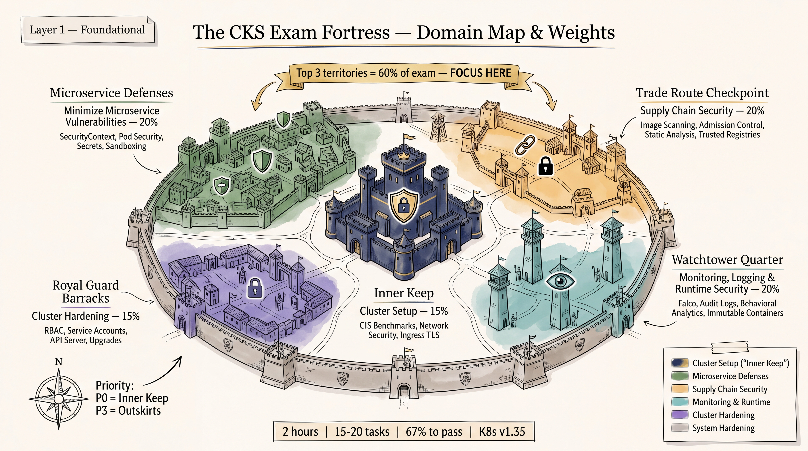
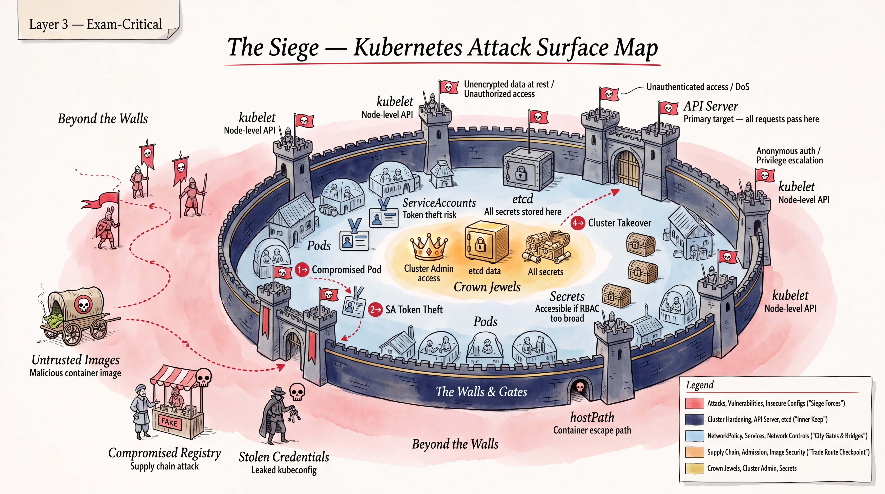
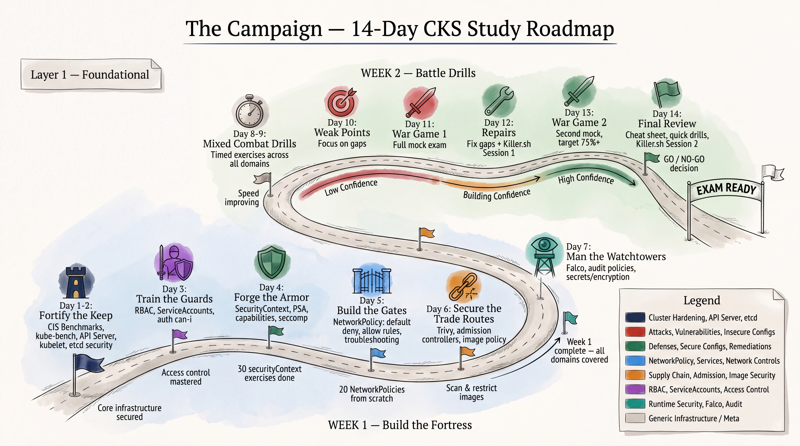

# CKS Community Intelligence Report

This note records practical preparation signals for the Certified Kubernetes Security Specialist exam. Treat community reports as directional rather than authoritative: the official CKS curriculum and Linux Foundation exam pages remain the source of truth for domains, task format, and current Kubernetes version.

## High-Confidence Preparation Signals

- The exam is performance-based. Repetition in a disposable cluster matters more than passive reading.
- Time pressure is the dominant constraint. Practice a fast inspect, change, verify loop and move on when a task becomes expensive.
- Most security tasks reward a small set of reusable controls: least-privilege RBAC, restrictive SecurityContext settings, default-deny NetworkPolicy, image scanning and admission checks, audit policy, encryption at rest, and runtime detection.
- Troubleshooting should begin with observable evidence: object status, events, logs, admission errors, audit records, and the relevant node or runtime service.
- Practice context safety on every task: confirm the current context and namespace before changing a live object.

## Practical Drill Priorities

1. Pod hardening: non-root execution, dropped capabilities, `allowPrivilegeEscalation: false`, read-only root filesystems, seccomp, AppArmor, and removal of unnecessary host access.
2. RBAC: identify the subject, verb, resource, namespace, and binding; verify with `kubectl auth can-i`.
3. NetworkPolicy: write and test default-deny ingress and egress policies, then add only the required exceptions.
4. Supply chain: scan images, use immutable or digest-pinned references, and enforce trusted images through admission.
5. Cluster hardening: use `kube-bench`, review API server and kubelet settings, and protect etcd and control-plane certificates.
6. Runtime and audit: distinguish prevention from detection, configure audit rules, and recognize Falco-style behavioral alerts.

## How To Use Community Advice

Use candidate reports to discover recurring task shapes and pacing problems, not to memorize alleged exam questions. Cross-check every reported command against the current Kubernetes documentation and test it in the same version family as the target exam. Do not use exam dumps or NDA-violating material.

## Related Notes

- [CKS exam snapshot and priorities](../01-exam-snapshot-and-priorities.md)
- [CKS exam strategy plans](../06-strategy/exam-strategy-plans.md)
- [CKA administrator foundations](../../CKA/README.md)
